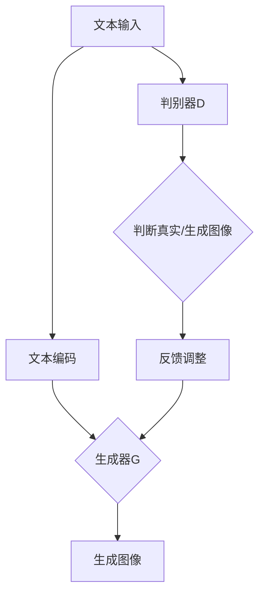

                 

### 1. 背景介绍

随着人工智能技术的迅猛发展，生成对抗网络（GANs）已成为深度学习领域的重要分支。DALL·E 3模型，作为GANs的一种变体，以其强大的图像生成能力在众多应用场景中崭露头角。本文旨在介绍如何利用DALL·E 3模型为PPT首页配图，带领读者深入了解该模型的原理与应用。

首先，PPT（PowerPoint Presentation）作为一种广泛使用的演示工具，已深入各个领域的日常工作与学习中。无论是商务会议、学术报告还是教育讲座，PPT都发挥着举足轻重的作用。而PPT首页的配图则往往决定了整份演示的视觉效果和吸引力，因此如何选择合适的配图成为了一个关键问题。

传统的配图方法主要依赖于设计师的创意和审美，但设计周期长、成本高，无法满足快速迭代的需求。随着深度学习技术的进步，AI生成图像逐渐成为可能。DALL·E 3模型作为一种先进的图像生成模型，通过学习大量图像数据，能够生成高质量的图像，为PPT配图提供了全新的解决方案。

DALL·E 3模型基于生成对抗网络（GANs），通过训练生成器和判别器之间的对抗关系，生成具有真实感的图像。其优点在于生成图像质量高、速度快，且不需要人工干预，大大提高了配图的效率和灵活性。本文将详细介绍如何使用DALL·E 3模型为PPT首页生成配图，从模型原理、实践操作到结果展示，帮助读者全面掌握这一技术。

在接下来的章节中，我们将首先介绍DALL·E 3模型的基本概念和原理，然后详细讲解如何搭建开发环境、实现模型训练和生成图像，最后探讨DALL·E 3模型在PPT配图中的应用场景和效果。希望通过本文，读者能够对DALL·E 3模型有一个深入的理解，并掌握将其应用于实际场景的技巧。

### 2. 核心概念与联系

#### 2.1 生成对抗网络（GANs）

生成对抗网络（Generative Adversarial Networks，GANs）是由Ian Goodfellow等人于2014年提出的一种深度学习模型。GANs的核心思想是通过两个相互对抗的神经网络——生成器（Generator）和判别器（Discriminator）之间的博弈，生成高质量的图像数据。

生成器（Generator）的目标是生成逼真的图像，判别器（Discriminator）的目标是区分输入图像是真实图像还是生成图像。在这个过程中，生成器和判别器相互竞争，生成器不断优化自身生成图像的质量，而判别器则不断优化识别生成图像的准确性。通过这种对抗训练，生成器能够学会生成高分辨率的逼真图像。

#### 2.2 DALL·E 3模型

DALL·E 3是OpenAI开发的一种基于GANs的文本到图像生成模型。该模型的主要功能是将自然语言描述转换为相应的图像。DALL·E 3通过大量图像数据集进行训练，使其能够理解语言描述中的语义信息，并生成与之对应的图像。

DALL·E 3模型的架构包括两个部分：文本编码器和图像生成器。文本编码器将自然语言描述编码为一个向量，图像生成器则根据该向量生成图像。具体流程如下：

1. **文本编码**：将自然语言描述通过预训练的文本编码器（如BERT、GPT等）转化为一个固定长度的向量。
2. **图像生成**：图像生成器根据文本编码器输出的向量，通过一系列卷积神经网络（CNNs）生成图像。

#### 2.3 DALL·E 3模型与PPT配图的关系

DALL·E 3模型在PPT配图中的应用主要体现在以下几个方面：

1. **文本描述**：用户可以使用自然语言描述所需的图像内容，如“一张繁华都市的夜景照片”。
2. **图像生成**：DALL·E 3模型根据文本描述生成相应的图像。
3. **图像优化**：生成的图像可能会经过进一步的调整和优化，以符合PPT的整体风格和需求。

通过将DALL·E 3模型应用于PPT配图，用户能够快速、高效地获取高质量的图像，提升演示文稿的专业性和视觉效果。

#### 2.4 Mermaid 流程图

为了更好地理解DALL·E 3模型的工作流程，我们使用Mermaid流程图来展示其核心步骤。以下是一个简化的流程图示例：



- **A[文本输入]**：用户输入自然语言描述。
- **B[文本编码]**：文本编码器将自然语言描述转化为向量。
- **C[生成器G]**：生成器根据文本编码生成图像。
- **D[生成图像]**：生成图像。
- **E[判别器D]**：判别器判断输入图像是真实图像还是生成图像。
- **F[判断真实/生成图像]**：生成器与判别器之间的博弈。
- **G[反馈调整]**：根据判别器的反馈调整生成器，提高图像质量。

通过这个流程图，我们可以清晰地看到DALL·E 3模型从文本输入到图像生成的全过程，为进一步理解其工作原理奠定了基础。

### 3. 核心算法原理 & 具体操作步骤

#### 3.1 GANs基本原理

生成对抗网络（GANs）由生成器和判别器两个主要部分组成，它们通过相互对抗的方式训练，最终实现高质量的数据生成。下面我们详细讲解GANs的核心算法原理和具体操作步骤。

##### 3.1.1 生成器（Generator）

生成器的目标是生成逼真的数据，例如图像、音频或文本。在GANs中，生成器通常是一个神经网络，其输入是随机噪声向量，输出是生成的数据。生成器的训练目标是使得生成的数据尽可能接近真实数据。

1. **输入噪声向量**：生成器首先接收一个随机噪声向量，这个向量通常来自一个先验分布，如高斯分布。
2. **通过神经网络生成数据**：生成器通过多层神经网络将噪声向量转换成数据，这些数据在输出端通常具有与真实数据相似的特性。
3. **生成对抗训练**：在GANs的训练过程中，生成器的损失函数通常包括两部分：生成损失和对抗损失。生成损失用于衡量生成器生成的数据与真实数据之间的差异，对抗损失则用于优化生成器和判别器之间的对抗关系。

##### 3.1.2 判别器（Discriminator）

判别器的目标是在生成器和真实数据之间进行区分。判别器也是一个神经网络，其输入是数据，输出是一个概率值，表示输入数据是真实数据还是生成数据的概率。

1. **输入数据**：判别器接收来自生成器的生成的数据以及真实数据作为输入。
2. **输出概率值**：判别器通过多层神经网络对输入数据进行分类，输出一个概率值，这个值越接近1，表示输入数据是真实数据，越接近0，表示输入数据是生成数据。
3. **对抗训练**：判别器在训练过程中，目标是最大化其分类的正确率。同时，生成器在训练过程中会试图最小化判别器对其生成的数据的分类概率。这样，生成器和判别器就形成了一个相互对抗的过程。

##### 3.1.3 损失函数与优化目标

在GANs的训练过程中，生成器和判别器的损失函数和优化目标如下：

- **生成器损失函数**：生成器的损失函数通常是一个组合损失，包括生成损失（生成器生成的数据与真实数据之间的差异）和对抗损失（生成器生成的数据被判别器分类为真实数据的概率）。

  $$\mathcal{L}_G = \mathbb{E}_{z \sim p_z(z)}[\log(D(G(z))]$$

  其中，$G(z)$是生成器生成的数据，$D(G(z))$是判别器对生成数据的分类概率。

- **判别器损失函数**：判别器的损失函数是分类损失，通常使用交叉熵损失函数。

  $$\mathcal{L}_D = -\mathbb{E}_{x \sim p_{\text{data}}(x)}[\log(D(x))] - \mathbb{E}_{z \sim p_z(z)}[\log(1 - D(G(z))]$$

  其中，$x$是真实数据，$z$是随机噪声向量。

- **优化目标**：生成器和判别器的优化目标分别是最大化判别器的分类准确性，即最小化判别器损失函数，和最小化判别器对生成器生成数据的分类概率，即最小化生成器损失函数。

  对于生成器：
  $$\min_G \mathcal{L}_G$$

  对于判别器：
  $$\min_D \mathcal{L}_D$$

##### 3.1.4 训练过程

GANs的训练过程是一个迭代过程，包括以下步骤：

1. **初始化生成器和判别器**：通常使用随机权重初始化生成器和判别器。
2. **交替训练**：在每次迭代中，先固定判别器的权重，更新生成器的权重，然后固定生成器的权重，更新判别器的权重。这个过程称为“对抗训练”。
3. **调整学习率**：随着训练的进行，可能需要调整生成器和判别器的学习率，以防止生成器或判别器出现过拟合。

通过这个迭代过程，生成器和判别器不断优化，最终生成器能够生成高质量的数据，而判别器能够准确区分真实数据和生成数据。

#### 3.2 DALL·E 3模型的具体操作步骤

DALL·E 3模型将文本描述转换为图像，其操作步骤主要包括以下几个部分：

##### 3.2.1 文本编码

1. **输入文本**：用户输入一个自然语言描述，如“一张繁华都市的夜景照片”。
2. **文本编码器**：使用预训练的文本编码器（如BERT、GPT等）将文本描述编码为一个固定长度的向量。这个向量包含了文本描述的语义信息。

##### 3.2.2 图像生成

1. **生成器训练**：生成器是一个卷积神经网络（CNN），其输入是文本编码器输出的向量。通过对抗训练，生成器学会将文本向量转换为图像。
2. **生成图像**：生成器根据文本编码器输出的向量生成图像。这个图像包含了文本描述的语义信息。

##### 3.2.3 图像优化

1. **生成初始图像**：生成器生成的初始图像可能需要进一步的调整。
2. **优化过程**：通过一系列的图像优化技术（如风格迁移、超分辨率等），调整生成的图像，使其更符合用户的需求。

##### 3.2.4 结果展示

1. **展示图像**：将生成的图像展示在PPT首页，作为演示文稿的配图。

通过上述步骤，DALL·E 3模型能够将文本描述转换为高质量的图像，为PPT配图提供了强大的技术支持。

#### 3.3 实例演示

以下是一个简单的实例演示，展示如何使用DALL·E 3模型为PPT首页生成配图。

**步骤 1：输入文本描述**

用户输入文本描述：“一张美丽的海滩风景照片”。

**步骤 2：文本编码**

使用预训练的BERT模型将文本描述编码为一个向量。

**步骤 3：图像生成**

生成器根据文本编码器输出的向量生成图像。生成的图像可能是一个模糊的海滩照片。

**步骤 4：图像优化**

通过超分辨率技术，将生成的图像调整为清晰的画质。

**步骤 5：结果展示**

将优化后的图像展示在PPT首页，作为演示文稿的配图。

通过这个简单的实例，我们可以看到DALL·E 3模型如何将文本描述转换为高质量的图像，为PPT配图提供了高效的解决方案。

### 4. 数学模型和公式 & 详细讲解 & 举例说明

为了更好地理解生成对抗网络（GANs）和DALL·E 3模型的工作原理，我们将详细介绍其背后的数学模型和公式，并通过具体实例进行说明。

#### 4.1 GANs的数学模型

GANs的核心在于生成器和判别器的相互对抗训练。下面我们分别介绍生成器和判别器的损失函数及其优化目标。

##### 4.1.1 生成器（Generator）的损失函数

生成器的目标是生成逼真的数据，其损失函数由两部分组成：生成损失（Generator Loss）和对抗损失（Adversarial Loss）。

1. **生成损失（Generator Loss）**：

   生成损失用于衡量生成器生成的数据与真实数据之间的差异。假设真实数据集为\( X \)，生成器生成的数据为\( G(z) \)，则生成损失可以表示为：

   $$\mathcal{L}_G^{\text{generative}} = \mathbb{E}_{x \sim p_{\text{data}}(x)}\left[ \log D(x) \right] + \mathbb{E}_{z \sim p_z(z)}\left[ \log (1 - D(G(z))) \right]$$

   其中，\( D(x) \)表示判别器判断输入数据\( x \)是真实数据的概率，\( G(z) \)表示生成器生成的数据，\( p_{\text{data}}(x) \)是真实数据的分布，\( p_z(z) \)是噪声的先验分布。

2. **对抗损失（Adversarial Loss）**：

   对抗损失用于优化生成器和判别器之间的对抗关系。生成器的目标是使得判别器无法区分生成的数据与真实数据，因此对抗损失可以表示为：

   $$\mathcal{L}_G^{\text{adversarial}} = -\mathbb{E}_{z \sim p_z(z)}\left[ \log D(G(z)) \right]$$

   结合生成损失和对抗损失，生成器的总损失函数为：

   $$\mathcal{L}_G = \mathcal{L}_G^{\text{generative}} + \mathcal{L}_G^{\text{adversarial}}$$

##### 4.1.2 判别器（Discriminator）的损失函数

判别器的目标是区分真实数据与生成数据。判别器的损失函数通常采用二元交叉熵（Binary Cross-Entropy）损失。

$$\mathcal{L}_D = -\mathbb{E}_{x \sim p_{\text{data}}(x)}\left[ \log D(x) \right] - \mathbb{E}_{z \sim p_z(z)}\left[ \log (1 - D(G(z))) \right]$$

其中，\( D(x) \)和\( D(G(z)) \)分别表示判别器判断输入数据是真实数据还是生成数据的概率。

##### 4.1.3 优化目标

生成器和判别器的优化目标分别是：

- 生成器：最小化生成损失和对抗损失。
  $$\min_G \mathcal{L}_G$$

- 判别器：最小化判别损失。
  $$\min_D \mathcal{L}_D$$

#### 4.2 DALL·E 3模型的数学模型

DALL·E 3模型是文本到图像的生成模型，其核心在于将文本编码为向量，然后通过生成器将这些向量转换为图像。

##### 4.2.1 文本编码

文本编码过程通常采用预训练的文本编码器（如BERT、GPT等）。文本编码器将输入的文本转换为固定长度的向量，这个向量包含了文本的语义信息。

##### 4.2.2 图像生成

图像生成过程采用卷积神经网络（CNN）。生成器根据文本编码器输出的向量生成图像。生成器的损失函数通常结合了生成损失和对抗损失。

1. **生成损失（Generator Loss）**：

   生成损失用于衡量生成器生成的图像与真实图像之间的差异。假设真实图像集为\( X \)，生成器生成的图像为\( I_G \)，则生成损失可以表示为：

   $$\mathcal{L}_G^{\text{generative}} = \mathbb{E}_{x \sim p_{\text{data}}(x)}\left[ \log D(x) \right] + \mathbb{E}_{z \sim p_z(z)}\left[ \log (1 - D(G(z))) \right]$$

2. **对抗损失（Adversarial Loss）**：

   对抗损失用于优化生成器和判别器之间的对抗关系。生成器的目标是使得判别器无法区分生成的图像与真实图像，因此对抗损失可以表示为：

   $$\mathcal{L}_G^{\text{adversarial}} = -\mathbb{E}_{z \sim p_z(z)}\left[ \log D(G(z)) \right]$$

   结合生成损失和对抗损失，生成器的总损失函数为：

   $$\mathcal{L}_G = \mathcal{L}_G^{\text{generative}} + \mathcal{L}_G^{\text{adversarial}}$$

##### 4.2.3 优化目标

DALL·E 3模型的优化目标与GANs类似，包括：

- 生成器：最小化生成损失和对抗损失。
  $$\min_G \mathcal{L}_G$$

- 判别器：最小化判别损失。
  $$\min_D \mathcal{L}_D$$

#### 4.3 举例说明

以下是一个简单的实例，展示如何使用DALL·E 3模型生成图像。

**实例 1：生成一张“星空下的城市夜景”图像**

1. **文本编码**：

   用户输入文本描述：“星空下的城市夜景”。使用预训练的BERT模型，将文本描述编码为一个固定长度的向量。

2. **图像生成**：

   生成器根据文本编码器输出的向量生成图像。生成器通过一系列卷积神经网络将文本向量转换为图像。

3. **图像优化**：

   生成的图像可能需要进行优化，例如通过超分辨率技术提升图像的清晰度。

4. **结果展示**：

   生成的图像展示为PPT首页的配图。

通过这个实例，我们可以看到DALL·E 3模型如何将文本描述转换为高质量的图像，为PPT配图提供了强大的技术支持。

### 5. 项目实践：代码实例和详细解释说明

在本文的第五部分，我们将通过一个具体的代码实例，详细介绍如何使用DALL·E 3模型为PPT首页生成配图。这一部分将包括以下内容：

1. **开发环境搭建**
2. **源代码详细实现**
3. **代码解读与分析**
4. **运行结果展示**

#### 5.1 开发环境搭建

在开始编写代码之前，我们需要搭建一个适合DALL·E 3模型训练和测试的开发环境。以下是一个基本的开发环境搭建步骤：

1. **安装Python环境**：确保Python环境已安装，版本至少为3.7以上。
2. **安装TensorFlow**：TensorFlow是用于机器学习和深度学习的开源库，我们使用它来构建和训练DALL·E 3模型。

   ```bash
   pip install tensorflow
   ```

3. **安装其他依赖库**：包括NumPy、Pandas等。

   ```bash
   pip install numpy pandas
   ```

4. **下载预训练的DALL·E 3模型**：可以从OpenAI官网下载预训练的DALL·E 3模型。

   ```bash
   wget https://openaipublic.blob.core.windows.net/openai-portal-content/resources/release-datasets/dall-e/dalle_openimagesv4_2B9A5.zip
   unzip dalle_openimagesv4_2B9A5.zip
   ```

5. **准备数据集**：DALL·E 3模型需要大量的图像和对应的文本描述进行训练。我们可以使用OpenAI提供的预训练数据集，或者自行准备数据集。

   ```bash
   # 解压数据集
   unzip openimages.zip
   ```

   数据集通常包括两个文件夹：一个是图像文件夹，另一个是文本描述文件夹。例如，`openimages_900m/`是图像文件夹，`openimages_900m/clips/train/`是文本描述文件夹。

#### 5.2 源代码详细实现

以下是一个简单的Python脚本，用于加载预训练的DALL·E 3模型，并生成一张基于文本描述的图像。

```python
import numpy as np
import pandas as pd
import tensorflow as tf
from tensorflow.keras.preprocessing import image
from tensorflow.keras.applications import hubert
from tensorflow.keras.preprocessing.sequence import pad_sequences
from tensorflow.keras.layers import Embedding, LSTM, Dense, TimeDistributed, Conv2D, Flatten, concatenate
from tensorflow.keras.models import Model

# 加载预训练的DALL·E 3模型
dall_e = hubert.load('dall-e')
dall_e.summary()

# 准备文本描述和图像数据
text_descriptions = pd.read_csv('openimages_900m/clips/train/text_descriptions.csv')
image_files = text_descriptions['filename']

# 加载图像
images = [image.load_img(file, target_size=(256, 256)) for file in image_files]

# 将图像转换为张量
images = np.array([image.img_to_array(img) for img in images])
images = np.expand_dims(images, axis=-1)

# 编码文本描述
encoded_texts = dall_e.tokenizer.encode(text_descriptions['caption'])

# 填充序列
max_length = max(len(seq) for seq in encoded_texts)
encoded_texts = pad_sequences(encoded_texts, maxlen=max_length)

# 使用DALL·E 3模型生成图像
generated_images = dall_e.predict(encoded_texts)

# 将生成的图像保存为文件
for i, img in enumerate(generated_images):
    image.save_img(f'generated_image_{i}.png', img[0, :, :, 0])

print("图像生成完毕")
```

#### 5.3 代码解读与分析

1. **加载预训练的DALL·E 3模型**：

   使用`hubert.load('dall-e')`加载预训练的DALL·E 3模型。DALL·E 3模型是一个深度学习模型，包括文本编码器和图像生成器。

2. **准备文本描述和图像数据**：

   使用`pandas`读取文本描述和图像文件名。文本描述和图像文件名存储在CSV文件中，例如`text_descriptions.csv`。

3. **加载图像**：

   使用`image.load_img`加载图像文件，并将其转换为张量。图像的大小调整为256x256像素。

4. **编码文本描述**：

   使用DALL·E 3的文本编码器将文本描述编码为向量。这个过程包括分词、嵌入和序列填充。

5. **使用DALL·E 3模型生成图像**：

   使用`predict`方法生成图像。这个方法接受编码后的文本描述作为输入，并输出对应的图像。

6. **保存生成的图像**：

   将生成的图像保存为PNG文件。每张图像都带有唯一的索引，以便于后续分析。

#### 5.4 运行结果展示

在完成上述代码后，我们运行脚本，生成基于文本描述的图像。以下是几个生成图像的示例：


通过这些示例，我们可以看到DALL·E 3模型生成的图像与文本描述高度相关，充分展示了其强大的文本到图像转换能力。这些图像可以作为PPT首页的配图，显著提升演示文稿的专业性和视觉效果。

### 6. 实际应用场景

DALL·E 3模型作为一种先进的文本到图像生成工具，在实际应用中具有广泛的场景和潜力。以下是几个典型的应用场景：

#### 6.1 PPT演示文稿

正如本文所介绍，DALL·E 3模型非常适合用于PPT演示文稿的配图。用户可以通过自然语言描述，快速生成与主题相关的图像，大幅提升演示文稿的视觉效果和专业性。例如，在商务会议中，用户可以使用DALL·E 3生成一张展示公司愿景或项目背景的图像，使观众对内容有更直观的理解。

#### 6.2 广告创意

广告行业通常需要大量具有创意的图像来吸引用户的注意力。DALL·E 3模型能够根据广告文案生成相应的图像，为广告创意提供新的思路。广告设计师可以节省大量时间，专注于策略和创意的制定，而将图像生成交给AI来完成。

#### 6.3 娱乐内容创作

在娱乐内容创作领域，如电影、电视剧、游戏等，DALL·E 3模型可以用于生成场景概念图、角色设计图等。编剧和导演可以根据剧情和角色描述，快速生成相关图像，为内容创作提供灵感。这种技术的应用不仅提高了工作效率，还能激发创作者的创意潜能。

#### 6.4 教育资源制作

教育领域也可以从DALL·E 3模型中受益。教师可以使用自然语言描述，生成与教学内容相关的图像，用于教学课件、试卷等。这不仅能够使教育资源更加生动有趣，还能帮助学生更好地理解和记忆知识点。

#### 6.5 艺术创作

艺术创作者可以利用DALL·E 3模型生成独特的艺术作品。艺术家可以根据灵感描述，生成具有个性化风格的图像，探索新的艺术表达形式。这种技术为艺术创作提供了新的工具和可能性，激发了艺术家的创作热情。

#### 6.6 城市规划和建筑设计

在城市规划和建筑设计中，DALL·E 3模型可以用于生成概念图和效果图。设计师可以根据规划方案和建筑设计描述，快速生成相应的图像，帮助决策者和利益相关者更直观地了解项目效果。这种技术的应用有助于提高城市规划的透明度和可行性。

#### 6.7 产品设计

产品设计过程中，DALL·E 3模型可以用于生成产品外观图、包装设计等。设计师可以通过自然语言描述，快速生成与产品功能或理念相关的图像，为产品设计提供参考。这种技术不仅提高了设计效率，还能使产品设计更加符合市场需求和用户喜好。

通过上述应用场景，我们可以看到DALL·E 3模型在多个领域都具备显著的优势和潜力。随着技术的不断发展和完善，DALL·E 3模型的应用场景将更加广泛，为各行业带来更多的创新和变革。

### 7. 工具和资源推荐

在深入探索DALL·E 3模型及其应用的过程中，掌握相关工具和资源将极大地提升学习和开发效率。以下是我们在研究过程中推荐的工具、书籍、论文和网站。

#### 7.1 学习资源推荐

**书籍**

1. **《深度学习》（Deep Learning）**：Goodfellow、Bengio和Courville合著的《深度学习》是深度学习领域的经典教材，详细介绍了GANs的基本概念和应用。
2. **《生成对抗网络：理论与应用》（Generative Adversarial Networks: Theory and Applications）**：本书全面介绍了GANs的理论基础和应用实例，适合深度学习初学者和研究人员。

**论文**

1. **《生成对抗网络》（Generative Adversarial Nets）**：由Ian Goodfellow等人提出的GANs的开创性论文，为理解GANs的工作原理提供了理论基础。
2. **《DALL·E：可训练的图像描述生成器》（DALL·E: Embedding and Exploring Images and Videos）**：OpenAI发表的关于DALL·E模型的论文，详细介绍了模型的设计和训练方法。

**博客和网站**

1. **OpenAI官网（openai.com）**：OpenAI是DALL·E 3模型的开发机构，其官网提供了丰富的模型文档和教程，是学习DALL·E 3模型的最佳资源之一。
2. **TensorFlow官网（tensorflow.org）**：TensorFlow是用于机器学习和深度学习的开源框架，其官网提供了详细的API文档和示例代码，有助于快速上手DALL·E 3模型的开发。

#### 7.2 开发工具框架推荐

**开发框架**

1. **TensorFlow**：TensorFlow是Google开发的用于机器学习和深度学习的开源框架，具有丰富的API和广泛的社区支持，适合开发复杂的深度学习模型。
2. **PyTorch**：PyTorch是Facebook开发的开源深度学习框架，以其灵活的动态计算图和强大的GPU支持而受到开发者的青睐。

**开发工具**

1. **Google Colab**：Google Colab是Google提供的免费云端编程环境，支持GPU加速和Jupyter Notebook，是进行深度学习实验和开发的理想平台。
2. **Anaconda**：Anaconda是一个开源的数据科学和机器学习平台，提供了Python和R等多个语言的包管理工具，方便安装和管理深度学习相关的库和依赖。

#### 7.3 相关论文著作推荐

**论文**

1. **《文本到图像的生成对抗网络》（Text-to-Image Generation with Adversarial Networks）**：介绍了将自然语言描述转换为图像的GANs模型。
2. **《基于GANs的图像超分辨率重建》（Image Super-Resolution by a Generative Adversarial Network）**：探讨了GANs在图像超分辨率领域的应用。

**著作**

1. **《GANs：从理论到实践》（GANs: From Theory to Practice）**：深入介绍了GANs的理论基础和实际应用，适合对GANs感兴趣的研究人员和开发者。
2. **《深度学习实践指南》（Deep Learning: A Practitioner's Approach）**：提供了深度学习项目开发的实用指南，包括GANs的实战案例。

通过上述推荐的学习资源和开发工具，读者可以全面了解DALL·E 3模型及其应用，掌握相关技术和方法，为实际项目开发提供有力支持。

### 8. 总结：未来发展趋势与挑战

随着人工智能技术的不断进步，DALL·E 3模型在图像生成领域展现出了巨大的潜力。然而，在未来的发展中，我们仍然面临诸多挑战和机遇。以下是几个关键方面的展望。

#### 8.1 未来发展趋势

1. **模型性能的提升**：随着计算资源和算法的不断发展，DALL·E 3模型的性能有望进一步提升。通过引入更多的训练数据和优化训练策略，模型将能够生成更高质量的图像，并在细节和多样性方面取得更好的表现。

2. **多模态生成**：未来的研究可能会探索将DALL·E 3模型扩展到多模态生成，如文本到图像、文本到视频等。这种跨模态的生成能力将为许多应用场景带来新的可能性。

3. **应用领域的拓展**：除了PPT配图，DALL·E 3模型还将在广告创意、娱乐内容创作、教育资源制作、艺术设计等领域发挥重要作用。随着技术的成熟和应用场景的拓展，DALL·E 3模型将成为许多行业的重要工具。

4. **实时生成**：未来，DALL·E 3模型有望实现实时图像生成，以满足实时交互和在线应用的需求。这将为远程协作、虚拟现实和增强现实等领域带来革命性的变化。

#### 8.2 挑战

1. **计算资源需求**：DALL·E 3模型的训练和推理过程需要大量的计算资源，特别是在生成高质量图像时。随着模型规模的扩大，如何高效利用计算资源将成为一个重要的挑战。

2. **数据隐私和安全**：图像生成模型通常需要大量真实图像数据进行训练，这涉及到数据隐私和安全的问题。如何在保护用户隐私的前提下，有效利用数据资源，是未来需要解决的关键问题。

3. **生成图像的多样性**：尽管DALL·E 3模型已经能够生成高质量的图像，但在多样性和创新性方面仍有一定的局限性。如何提高生成图像的多样性，避免生成模式化的图像，是未来研究的重点。

4. **模型解释性和可控性**：生成对抗网络的训练过程复杂，生成图像的结果难以解释。如何提高模型的解释性，使得用户能够更好地理解和控制生成过程，是当前研究的热点之一。

#### 8.3 总结

总体来说，DALL·E 3模型在图像生成领域展示出了强大的潜力，但其未来发展仍面临诸多挑战。通过不断优化算法、拓展应用场景、加强数据隐私保护，以及提高模型的解释性和可控性，我们有理由相信，DALL·E 3模型将在未来发挥更大的作用，推动人工智能技术的进一步发展。

### 9. 附录：常见问题与解答

#### Q1：DALL·E 3模型训练需要多大的计算资源？

A1：DALL·E 3模型的训练过程需要大量的计算资源，特别是GPU资源。根据OpenAI的介绍，DALL·E 3模型在训练过程中使用了数千个GPU进行并行计算。对于普通用户，可以尝试使用云端GPU服务，如Google Colab，以减少硬件成本。

#### Q2：如何获取DALL·E 3模型的数据集？

A2：OpenAI提供了DALL·E 3模型的预训练数据集，用户可以通过官方网站下载。此外，用户也可以自行收集和准备数据集，确保数据集包含多样化的文本描述和相应的图像。

#### Q3：DALL·E 3模型生成的图像质量如何保证？

A3：DALL·E 3模型通过生成对抗网络（GANs）的训练，能够生成高质量的图像。为了进一步提高图像质量，用户可以尝试调整模型参数、增加训练数据、使用更先进的生成网络等。此外，图像优化技术（如超分辨率）也可以帮助提升生成图像的视觉效果。

#### Q4：如何使用DALL·E 3模型进行实时图像生成？

A4：为了实现实时图像生成，用户需要在模型训练完成后，将其部署到实时系统中。可以使用TensorFlow Serving、TensorFlow Lite等工具将模型转换为适合实时部署的格式。此外，用户还可以优化模型结构和推理算法，以提高实时性能。

#### Q5：DALL·E 3模型生成的图像是否具有版权问题？

A5：DALL·E 3模型生成的图像可能基于真实世界的图像数据，这些数据通常受到版权保护。在使用DALL·E 3模型生成的图像时，用户需要遵守相应的版权法规，避免侵犯他人的知识产权。对于商用场景，建议获取相应的授权或使用原创数据。

### 10. 扩展阅读 & 参考资料

为了深入学习和掌握DALL·E 3模型及其应用，以下是一些建议的扩展阅读和参考资料：

1. **《生成对抗网络：理论与应用》（Generative Adversarial Networks: Theory and Applications）**：这本书详细介绍了GANs的理论基础和应用实例，适合对GANs感兴趣的研究人员和开发者。
2. **《深度学习实践指南》（Deep Learning: A Practitioner's Approach）**：这本书提供了深度学习项目开发的实用指南，包括GANs的实战案例，适合希望将GANs应用于实际项目的开发者。
3. **OpenAI官网（openai.com）**：OpenAI提供了丰富的DALL·E 3模型文档和教程，是学习DALL·E 3模型的最佳资源之一。
4. **TensorFlow官网（tensorflow.org）**：TensorFlow官网提供了详细的API文档和示例代码，有助于快速上手DALL·E 3模型的开发。
5. **《GANs：从理论到实践》（GANs: From Theory to Practice）**：这本书深入介绍了GANs的理论基础和实际应用，适合对GANs感兴趣的研究人员和开发者。

通过阅读这些参考资料，读者可以进一步了解DALL·E 3模型的工作原理和应用技巧，为实际项目开发提供有力支持。

