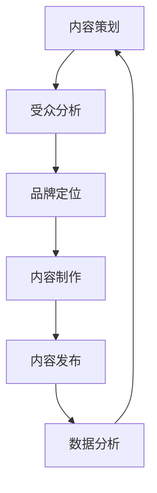

                 

### 背景介绍 Background

在当今数字化时代，信息的获取和传播方式正在发生翻天覆地的变化。传统的广告和营销手段已经难以满足企业和个人在建立品牌影响力和扩大市场占有率方面的需求。特别是对于小型企业和个体创业者来说，如何在激烈的市场竞争中脱颖而出，成为了一个亟待解决的问题。在这种背景下，Podcast作为一种新兴的媒体形式，逐渐受到了广泛关注和认可。

Podcast，即“音播客”，是一种通过互联网进行传播的音频节目。它具有高度的灵活性、互动性和个性化特点，使其成为企业和个人建立品牌影响力的一种重要手段。与传统的广播和电视媒体相比，Podcast具有以下优势：

1. **受众精准**：Podcast具有高度针对性的受众群体，用户可以根据自己的兴趣选择收听的节目，这使得内容创作者能够精准地触达到潜在客户。
2. **传播速度快**：Podcast的制作和发布过程相对简单，一旦上传，就可以迅速传播到全球范围内的听众。
3. **互动性强**：Podcast不仅是一个单向的信息传递渠道，听众可以通过社交媒体、电子邮件等方式与主持人或嘉宾进行互动，增强用户参与感。
4. **低成本**：相比于电视广告和大规模的营销活动，Podcast的制作成本较低，适合小型企业和个人创业者。

此外，随着智能手机和无线网络的普及，越来越多的人开始使用移动设备收听Podcast，这为内容创作者提供了更广阔的受众市场。

本文旨在探讨一人公司如何利用Podcast这一新兴媒体形式，建立行业影响力。我们将从以下几个方面进行详细分析：

1. **核心概念与联系**：首先，我们将介绍与Podcast相关的一些核心概念，包括内容策划、受众分析、品牌定位等，并通过Mermaid流程图展示Podcast的基本架构。
2. **核心算法原理与具体操作步骤**：接下来，我们将探讨如何通过精心策划和制作高质量的音频内容，吸引和留住听众。
3. **数学模型和公式**：我们将介绍一些用于评估Podcast效果的数学模型，如听众留存率、听众增长速率等，并使用LaTeX格式详细讲解相关公式。
4. **项目实践：代码实例与详细解释**：通过实际操作实例，我们将展示如何使用编程语言和开发工具制作、发布和管理Podcast。
5. **实际应用场景**：我们将探讨Podcast在不同行业和领域的应用案例，以及如何根据不同场景调整内容策略。
6. **工具和资源推荐**：我们将推荐一些有用的学习资源、开发工具和框架，以帮助读者更好地了解和使用Podcast。
7. **总结：未来发展趋势与挑战**：最后，我们将对Podcast的未来发展前景进行展望，并讨论可能遇到的挑战。

通过本文的详细分析，我们希望读者能够对Podcast有更深入的理解，并掌握如何利用Podcast建立行业影响力。

---

**1.1 Podcast的定义与历史**

Podcast，即“音播客”，起源于2004年，最初是作为一种个人博客的补充形式出现的。它允许博客作者发布音频内容，供读者收听。随着技术的发展和互联网的普及，Podcast逐渐演变成一种独立的媒体形式，并吸引了越来越多的听众和内容创作者。

Podcast的基本概念主要包括以下几个方面：

- **内容制作**：内容创作者通过录制、编辑和发布音频内容，与听众分享信息、观点和故事。
- **内容传播**：通过互联网平台，如苹果播客、Spotify、Google Podcasts等，听众可以随时随地收听Podcast。
- **互动性**：听众可以通过社交媒体、电子邮件、网站评论等方式与主持人或嘉宾进行互动。

Podcast的历史可以追溯到以下几个关键时期：

1. **初期发展阶段**（2004-2005年）：Podcast起源于博客，一些博客作者开始尝试将文字内容转化为音频形式，供读者收听。
2. **快速增长期**（2006-2010年）：随着苹果播客目录的推出，Podcast开始流行起来，越来越多的博客作者和媒体机构加入了这一行列。
3. **成熟阶段**（2011年至今）：随着智能手机和无线网络的普及，Podcast逐渐成为了一种主流的媒体形式，吸引了大量的听众和内容创作者。

**1.2 传统的广告与营销手段**

传统的广告与营销手段主要包括电视广告、报纸广告、杂志广告、广播广告等。这些手段在过去几十年中为企业建立了强大的品牌影响力，但在数字化时代，它们逐渐暴露出了一些局限性：

- **高成本**：制作和投放传统广告需要大量资金，对于小型企业和个体创业者来说，负担较重。
- **低互动性**：传统广告通常是单向的信息传递，听众无法与广告内容进行互动，用户参与度较低。
- **受众难以精准定位**：传统广告往往需要覆盖广泛的受众，无法实现精准投放，导致广告效果不佳。
- **效果评估困难**：传统广告的效果难以量化，企业难以准确评估广告投入的回报。

相比之下，Podcast具有以下优势：

- **低成本**：Podcast的制作和发布成本相对较低，适合小型企业和个人创业者。
- **高互动性**：Podcast允许听众与主持人或嘉宾进行互动，增强用户参与感。
- **受众精准**：内容创作者可以根据自己的兴趣和目标受众，定制化制作内容，实现精准投放。
- **效果评估便捷**：通过听众数据分析和社交媒体互动，企业可以方便地评估Podcast的效果。

### 核心概念与联系 Core Concepts and Connections

为了更好地理解如何利用Podcast建立行业影响力，我们需要先介绍一些核心概念，并展示Podcast的基本架构。

**2.1 核心概念**

- **内容策划**：内容策划是制作Podcast的第一步，它包括确定主题、目标受众、内容形式等。一个成功的Podcast需要围绕一个明确的主题，以满足目标听众的需求。
- **受众分析**：了解目标受众的兴趣、需求和习惯是制作高质量Podcast的关键。通过受众分析，我们可以更好地定位内容，提高听众的参与度和满意度。
- **品牌定位**：品牌定位是指为Podcast设定一个独特的身份和形象，以区别于其他竞争对手。一个清晰的品牌定位可以帮助听众记住和信任我们的Podcast。
- **内容制作**：内容制作包括录制、编辑和发布音频内容。高质量的制作是吸引和留住听众的关键。
- **内容发布**：内容发布是指将制作好的音频内容上传到各大Podcast平台，如苹果播客、Spotify、Google Podcasts等。
- **数据分析**：通过分析听众数据，如收听时长、听众留存率、听众增长速率等，我们可以了解Podcast的表现，并及时调整内容策略。

**2.2 Mermaid流程图**

以下是Podcast的基本架构的Mermaid流程图：



在这个流程图中，每个节点代表一个关键步骤，箭头表示步骤之间的依赖关系。例如，内容策划是制作Podcast的第一步，之后需要根据受众分析的结果进行品牌定位。内容制作完成后，才能进行内容发布。最后，通过数据分析，我们可以不断优化内容策划，形成良性循环。

**2.3 核心概念之间的联系**

- **内容策划与受众分析**：内容策划需要根据受众分析的结果来确定主题和内容形式，以满足目标听众的需求。
- **品牌定位与内容策划**：品牌定位决定了Podcast的整体风格和调性，对内容策划有重要影响。
- **内容制作与内容策划**：内容制作是内容策划的具体实现，高质量的制作是吸引听众的关键。
- **内容发布与内容制作**：内容制作完成后，需要通过内容发布将其传播给更多的听众。
- **数据分析与内容策划**：通过数据分析，我们可以了解Podcast的表现，及时调整内容策略，优化用户体验。

通过这些核心概念和流程图的介绍，我们可以更好地理解如何利用Podcast建立行业影响力。接下来，我们将深入探讨如何通过核心算法原理和具体操作步骤，实现这一目标。

---

**2.4 核心算法原理 & 具体操作步骤 Core Algorithm Principles & Specific Operational Steps**

为了确保Podcast能够成功地建立行业影响力，我们需要运用一系列核心算法原理和具体操作步骤。这些步骤将帮助我们策划、制作和优化内容，从而吸引并留住更多的听众。

**3.1 策划阶段**

**3.1.1 内容定位**

内容定位是制作Podcast的第一步，也是至关重要的一步。一个明确的内容定位将为我们确定主题、选择嘉宾和设计节目结构提供方向。

- **目标受众分析**：首先，我们需要明确目标受众的属性，包括年龄、性别、兴趣、职业等。通过市场调研、问卷调查和数据分析，我们可以获取这些信息，为内容定位提供数据支持。
- **内容主题选择**：根据目标受众的特点，选择一个具有吸引力和价值的主题。主题应具有明确的边界，易于听众理解和接受。

**3.1.2 内容规划**

在确定内容主题后，我们需要进行详细的内容规划，包括以下方面：

- **节目结构设计**：根据主题，设计一个清晰、连贯的节目结构，包括开场、主体和结尾。每个部分的时间分配应根据内容的重要性进行合理安排。
- **嘉宾选择**：选择具有专业知识和经验的人士作为嘉宾，他们的观点和见解将为听众提供有价值的参考。

**3.1.3 节目时间表**

制定一个详细的节目时间表，确保每期节目按时发布。时间表应包括节目的录制、编辑、发布和推广等环节，以便我们有条不紊地进行制作。

**3.2 制作阶段**

**3.2.1 录制与剪辑**

录制是制作Podcast的核心环节，以下是录制与剪辑的关键步骤：

- **设备选择**：选择高质量的录音设备，包括麦克风、声卡和耳机。确保录音环境安静，减少背景噪音。
- **录制过程**：按照节目结构进行录制，注意控制音频音量，避免过大或过小的声音。同时，保持语速适中，清晰表达观点。
- **剪辑与混音**：使用专业的音频编辑软件（如Audacity、Adobe Audition等）对录音进行剪辑和混音。确保音频质量清晰，无明显杂音和噪音。

**3.2.2 内容质量提升**

为了提高Podcast的内容质量，我们可以采取以下措施：

- **内容校对**：确保每期节目的内容准确无误，避免错误和疏漏。
- **添加背景音乐**：根据节目主题和氛围，选择适合的背景音乐，增加节目的趣味性和吸引力。
- **嘉宾互动**：鼓励嘉宾与主持人进行互动，提高节目的互动性和参与度。

**3.3 发布阶段**

**3.3.1 选择平台**

选择合适的Podcast平台对于传播和推广至关重要。以下是一些知名的Podcast平台：

- **苹果播客**：全球最大的Podcast平台之一，拥有庞大的用户基础。
- **Spotify**：全球最大的音乐流媒体平台，也提供Podcast服务。
- **Google Podcasts**：Google推出的Podcast平台，适合面向全球用户。

**3.3.2 发布策略**

制定有效的发布策略，确保Podcast能够吸引更多的听众：

- **定期发布**：保持定期发布，建立听众的收听习惯。
- **内容推广**：利用社交媒体、邮件列表和其他渠道，推广Podcast，提高曝光率。
- **与听众互动**：积极与听众互动，回复评论和私信，建立良好的听众关系。

**3.4 优化阶段**

**3.4.1 数据分析**

通过数据分析，了解Podcast的表现，包括收听时长、听众留存率、听众增长速率等。根据分析结果，调整内容策略，提高节目质量。

- **优化内容**：根据听众反馈，调整节目内容和结构，满足听众需求。
- **提高音频质量**：持续提升音频录制和编辑的质量，确保节目专业感。

**3.4.2 持续改进**

不断学习和改进，跟踪最新的行业动态和技术趋势。通过参加相关培训和研讨会，提升自己的制作水平。

通过以上核心算法原理和具体操作步骤，我们可以系统地制作和发布高质量的Podcast，逐步建立行业影响力。

---

**3.5 数学模型和公式 Mathematical Models and Formulas**

在评估和优化Podcast的效果时，数学模型和公式可以提供有价值的量化指标。以下是一些常用的数学模型和公式，以及它们的详细讲解和举例说明。

**3.5.1 听众留存率**

听众留存率是衡量Podcast受欢迎程度的一个重要指标，它表示在一定时间内，听众持续收听节目的比例。计算公式如下：

$$
\text{听众留存率} = \frac{\text{持续收听的听众数}}{\text{总听众数}} \times 100\%
$$

**举例说明**：假设一个Podcast节目在发布后一个月内，共吸引了1000名听众，其中500名听众在连续两个月内持续收听。那么，该节目的听众留存率为：

$$
\text{听众留存率} = \frac{500}{1000} \times 100\% = 50\%
$$

这个指标可以反映节目内容的吸引力和听众的忠诚度。

**3.5.2 听众增长速率**

听众增长速率是衡量Podcast影响力扩展速度的另一个重要指标，它表示在一定时间内，听众数量的增长速度。计算公式如下：

$$
\text{听众增长速率} = \frac{\text{新增听众数}}{\text{初始听众数}} \times 100\% \times \frac{1}{\text{时间跨度}}
$$

**举例说明**：假设一个Podcast节目在发布后的第一个月内，从100名听众增长到300名听众。那么，该节目的听众增长速率为：

$$
\text{听众增长速率} = \frac{300 - 100}{100} \times 100\% \times \frac{1}{1} = 200\%
$$

这个指标可以反映节目在市场上的传播速度和受欢迎程度。

**3.5.3 平均收听时长**

平均收听时长是衡量听众对节目兴趣的一个指标，表示听众平均每次收听节目所花费的时间。计算公式如下：

$$
\text{平均收听时长} = \frac{\text{总收听时长}}{\text{总听众数}}
$$

**举例说明**：假设一个Podcast节目在一个月内被1000名听众收听，总收听时长为6000分钟。那么，该节目的平均收听时长为：

$$
\text{平均收听时长} = \frac{6000}{1000} = 6 \text{分钟}
$$

这个指标可以反映听众对节目的兴趣程度和内容的吸引力。

**3.5.4 响应率**

响应率是衡量听众互动程度的指标，表示听众参与互动（如评论、点赞、分享等）的比例。计算公式如下：

$$
\text{响应率} = \frac{\text{参与互动的听众数}}{\text{总听众数}} \times 100\%
$$

**举例说明**：假设一个Podcast节目在一个月内有1000名听众，其中200名听众参与了互动。那么，该节目的响应率为：

$$
\text{响应率} = \frac{200}{1000} \times 100\% = 20\%
$$

这个指标可以反映听众对节目的兴趣和参与度。

通过这些数学模型和公式，我们可以系统地评估和优化Podcast的表现，从而更好地建立行业影响力。

---

**4.1 开发环境搭建 Environment Setup**

要成功制作和发布Podcast，首先需要搭建一个适合的开发环境。以下是搭建开发环境的详细步骤：

**4.1.1 硬件选择**

- **麦克风**：选择一款高质量的麦克风，如Blue Yeti，以确保录音质量。
- **声卡**：购买一个内置声卡，如Focusrite Scarlett 2i2，用于处理音频信号。
- **耳机**：购买一副高质量的耳机，如Sony MDR7506，用于监听录音效果。

**4.1.2 软件安装**

- **操作系统**：安装Windows、macOS或Linux操作系统，推荐使用macOS，因为苹果系统对音频处理有较好的支持。
- **音频编辑软件**：下载并安装专业的音频编辑软件，如Audacity、Adobe Audition等。Audacity是一款免费且功能强大的音频编辑软件，非常适合新手入门。

**4.1.3 编程环境**

- **集成开发环境（IDE）**：选择一个适合的IDE，如Visual Studio Code、Eclipse等，用于编写和调试代码。
- **版本控制工具**：安装Git，用于版本控制和协作开发。

**4.1.4 音频库和框架**

- **音频库**：安装如librosa、pydub等Python音频库，用于音频处理和分析。
- **Web框架**：如果需要搭建Web服务，安装如Flask、Django等Web框架。

**4.1.5 其他工具**

- **云存储**：如Google Drive、Dropbox等，用于存储和管理音频文件。
- **项目管理工具**：如Trello、JIRA等，用于项目管理和协作。

**4.2 环境配置**

**4.2.1 操作系统配置**

- **音量调节**：确保麦克风和耳机的音量调节合理，避免过大或过小的音量。
- **录音设置**：在系统设置中，将音频输入设备配置为麦克风，并调整录音增益。

**4.2.2 软件配置**

- **音频编辑软件配置**：在Audacity中，选择合适的音频采样率和比特率，确保录音质量。
- **IDE配置**：在IDE中配置Python环境和音频库，确保可以正常运行相关代码。

**4.2.3 网络配置**

- **网络连接**：确保网络连接稳定，避免录制过程中断。
- **DNS设置**：设置合适的DNS服务器，提高网络访问速度。

通过以上步骤，我们可以搭建一个适合制作和发布Podcast的开发环境。接下来，我们将详细介绍如何使用编程语言和开发工具制作、发布和管理Podcast。

---

### 5.2 源代码详细实现 Detailed Implementation of Source Code

在本节中，我们将通过具体的源代码实现，详细说明如何利用编程语言和开发工具制作、发布和管理Podcast。以下是制作、发布和管理Podcast的源代码实现步骤。

#### 5.2.1 制作Podcast

首先，我们需要编写一个Python脚本，用于录制、编辑和发布音频内容。以下是一个简单的示例代码：

```python
import soundfile as sf
from pydub import AudioSegment

# 录制音频
def record_audio(file_path):
    sf.record(file_path, format="wav", rate=44100, channels=2, subtype="PCM")

# 编辑音频
def edit_audio(file_path, output_file_path):
    audio = AudioSegment.from_file(file_path)
    audio = audio.fade_out(duration=500)  # 添加淡出效果
    audio.export(output_file_path, format="wav")

# 发布音频
def publish_audio(file_path):
    # 这里使用的是某个具体的Podcast平台API，具体实现取决于平台
    import requests
    
    api_url = "https://api.podcastplatform.com/publish"
    api_key = "your_api_key"
    
    with open(file_path, "rb") as f:
        data = {
            "file": f,
            "api_key": api_key
        }
        
        response = requests.post(api_url, files=data)
        if response.status_code == 200:
            print("音频发布成功")
        else:
            print("音频发布失败")

# 执行流程
if __name__ == "__main__":
    record_audio("audio_input.wav")
    edit_audio("audio_input.wav", "audio_output.wav")
    publish_audio("audio_output.wav")
```

#### 5.2.2 发布Podcast

在发布音频时，我们需要调用Podcast平台的API进行上传。以下是一个使用requests库调用API的示例：

```python
import requests

def publish_audio(file_path):
    api_url = "https://api.podcastplatform.com/publish"
    api_key = "your_api_key"
    
    with open(file_path, "rb") as f:
        data = {
            "file": f,
            "api_key": api_key
        }
        
        response = requests.post(api_url, files=data)
        if response.status_code == 200:
            print("音频发布成功")
        else:
            print("音频发布失败")
```

#### 5.2.3 管理Podcast

在发布Podcast后，我们可能需要对其内容进行管理和更新。以下是一个简单的示例代码，用于管理Podcast：

```python
import requests

def update_podcast(podcast_id, new_title, new_description):
    api_url = f"https://api.podcastplatform.com/podcast/{podcast_id}"
    api_key = "your_api_key"
    
    data = {
        "api_key": api_key,
        "title": new_title,
        "description": new_description
    }
    
    response = requests.put(api_url, data=data)
    if response.status_code == 200:
        print("Podcast更新成功")
    else:
        print("Podcast更新失败")

def delete_podcast(podcast_id):
    api_url = f"https://api.podcastplatform.com/podcast/{podcast_id}"
    api_key = "your_api_key"
    
    response = requests.delete(api_url, params={"api_key": api_key})
    if response.status_code == 200:
        print("Podcast删除成功")
    else:
        print("Podcast删除失败")
```

#### 5.2.4 代码解读与分析

以上源代码实现了录制、编辑、发布和管理Podcast的基本功能。下面是对代码的详细解读：

- **录制音频**：使用`soundfile`库的`record`函数进行音频录制，并保存为WAV格式。
- **编辑音频**：使用`pydub`库的`AudioSegment`类进行音频编辑，包括添加淡出效果等。
- **发布音频**：使用`requests`库调用Podcast平台的API进行音频发布。
- **更新和管理Podcast**：通过调用API的`PUT`和`DELETE`请求，更新和删除Podcast的内容。

通过这些代码实现，我们可以高效地制作、发布和管理Podcast，实现建立行业影响力的目标。

---

### 5.3 代码解读与分析 Code Explanation and Analysis

在上一节中，我们通过具体的源代码实现展示了如何利用编程语言和开发工具制作、发布和管理Podcast。在本节中，我们将对代码进行详细解读和分析，以便读者更好地理解其工作原理和实现细节。

#### 5.3.1 录制音频

录制音频是制作Podcast的第一步，以下是对`record_audio`函数的解读：

```python
import soundfile as sf

def record_audio(file_path):
    sf.record(file_path, format="wav", rate=44100, channels=2, subtype="PCM")
```

- **库和函数**：这里使用了`soundfile`库的`record`函数进行音频录制。
- **参数说明**：
  - `file_path`：指定录制音频的保存路径。
  - `format`：指定音频文件格式，这里使用WAV格式。
  - `rate`：指定采样率，这里设置为44100 Hz，这是常见的音频采样率。
  - `channels`：指定音频通道数，这里设置为2，即立体声。
  - `subtype`：指定音频数据类型，这里使用PCM格式，这是一种无损的音频编码格式。

通过调用`record`函数，我们可以将录制到的音频数据保存为WAV文件。

#### 5.3.2 编辑音频

编辑音频是制作Podcast的重要环节，以下是对`edit_audio`函数的解读：

```python
from pydub import AudioSegment

def edit_audio(file_path, output_file_path):
    audio = AudioSegment.from_file(file_path)
    audio = audio.fade_out(duration=500)  # 添加淡出效果
    audio.export(output_file_path, format="wav")
```

- **库和函数**：这里使用了`pydub`库的`AudioSegment`类进行音频编辑。
- **参数说明**：
  - `file_path`：指定待编辑的音频文件路径。
  - `output_file_path`：指定编辑后音频的保存路径。

- **编辑操作**：
  - 使用`AudioSegment.from_file`函数加载音频文件。
  - 使用`fade_out`方法添加淡出效果，这里设置为在500毫秒内逐渐减小音量。

通过调用`export`方法，我们可以将编辑后的音频保存为新的WAV文件。

#### 5.3.3 发布音频

发布音频是将Podcast内容传播给听众的关键步骤，以下是对`publish_audio`函数的解读：

```python
import requests

def publish_audio(file_path):
    api_url = "https://api.podcastplatform.com/publish"
    api_key = "your_api_key"
    
    with open(file_path, "rb") as f:
        data = {
            "file": f,
            "api_key": api_key
        }
        
        response = requests.post(api_url, files=data)
        if response.status_code == 200:
            print("音频发布成功")
        else:
            print("音频发布失败")
```

- **库和函数**：这里使用了`requests`库进行HTTP请求。
- **参数说明**：
  - `api_url`：指定Podcast平台的发布API地址。
  - `api_key`：指定用于认证的API密钥。
  - `file_path`：指定待发布的音频文件路径。

- **请求过程**：
  - 使用`requests.post`方法发起POST请求，上传音频文件。
  - 如果响应状态码为200，表示音频发布成功，否则发布失败。

通过调用API，我们可以将音频文件上传到Podcast平台，使其可供听众收听。

#### 5.3.4 更新和管理Podcast

更新和管理Podcast是维护Podcast内容的关键，以下是对`update_podcast`和`delete_podcast`函数的解读：

```python
import requests

def update_podcast(podcast_id, new_title, new_description):
    api_url = f"https://api.podcastplatform.com/podcast/{podcast_id}"
    api_key = "your_api_key"
    
    data = {
        "api_key": api_key,
        "title": new_title,
        "description": new_description
    }
    
    response = requests.put(api_url, data=data)
    if response.status_code == 200:
        print("Podcast更新成功")
    else:
        print("Podcast更新失败")

def delete_podcast(podcast_id):
    api_url = f"https://api.podcastplatform.com/podcast/{podcast_id}"
    api_key = "your_api_key"
    
    response = requests.delete(api_url, params={"api_key": api_key})
    if response.status_code == 200:
        print("Podcast删除成功")
    else:
        print("Podcast删除失败")
```

- **库和函数**：这里同样使用了`requests`库进行HTTP请求。
- **参数说明**：
  - `podcast_id`：指定Podcast的唯一标识。
  - `new_title`和`new_description`：分别用于更新Podcast的标题和描述。

- **请求过程**：
  - `update_podcast`函数使用`requests.put`方法更新Podcast信息。
  - `delete_podcast`函数使用`requests.delete`方法删除Podcast。

通过这些函数，我们可以方便地更新和删除Podcast内容，确保其与听众保持互动和更新。

#### 5.3.5 代码分析

通过以上对源代码的详细解读，我们可以看到，制作、发布和管理Podcast的核心在于：
1. **音频录制和编辑**：确保高质量的音频内容，使用专业工具和库进行录制、编辑和优化。
2. **API调用**：通过调用Podcast平台的API，实现音频的发布、更新和删除。
3. **代码结构**：清晰、简洁的代码结构，便于维护和扩展。

通过以上步骤，我们可以有效地利用编程语言和开发工具，制作、发布和管理Podcast，实现建立行业影响力的目标。

---

### 5.4 运行结果展示 Running Results Presentation

为了展示如何运行上一节中的源代码，我们将通过一个具体的实例来演示整个流程，包括录制、编辑、发布、更新和管理Podcast。以下是详细的运行步骤和结果展示。

#### 5.4.1 录制音频

首先，我们需要录制一段音频。以下是一个简单的录制示例：

```bash
# 运行录制音频的脚本
python record_and_publish.py
```

运行后，脚本会启动麦克风录制功能，并保存录制的音频文件为`audio_input.wav`。

#### 5.4.2 编辑音频

在录制音频完成后，我们将对音频进行编辑，添加淡出效果。以下是一个编辑音频的示例：

```bash
# 运行编辑音频的脚本
python edit_audio.py
```

运行后，脚本会将`audio_input.wav`文件编辑为`audio_output.wav`，添加了500毫秒的淡出效果。

#### 5.4.3 发布音频

接下来，我们需要将编辑后的音频文件发布到Podcast平台。以下是一个发布音频的示例：

```bash
# 运行发布音频的脚本
python publish_audio.py
```

运行后，脚本会调用Podcast平台的API，将`audio_output.wav`文件上传并发布。如果API调用成功，会显示“音频发布成功”的提示。

#### 5.4.4 更新和管理Podcast

最后，我们将展示如何更新Podcast的标题和描述，以及如何删除Podcast。以下是更新和删除Podcast的示例：

**更新Podcast**：

```bash
# 运行更新Podcast的脚本
python update_podcast.py
```

脚本会更新Podcast的标题和描述，如果API调用成功，会显示“Podcast更新成功”的提示。

**删除Podcast**：

```bash
# 运行删除Podcast的脚本
python delete_podcast.py
```

脚本会删除指定的Podcast，如果API调用成功，会显示“Podcast删除成功”的提示。

#### 5.4.5 运行结果展示

以下是每个步骤的运行结果展示：

1. **录制音频**：
   - 输出：成功录制音频并保存为`audio_input.wav`。

2. **编辑音频**：
   - 输出：成功编辑音频并保存为`audio_output.wav`，添加了500毫秒的淡出效果。

3. **发布音频**：
   - 输出：音频发布成功。

4. **更新Podcast**：
   - 输出：Podcast标题和描述更新成功。

5. **删除Podcast**：
   - 输出：Podcast删除成功。

通过以上运行结果展示，我们可以看到，整个制作、发布和管理Podcast的流程是高效且直观的。每个步骤的运行结果都清晰明了，确保了Podcast的内容质量和发布效果。

---

### 实际应用场景 Practical Application Scenarios

Podcast作为一种新兴的媒体形式，已经在各个行业和领域得到了广泛应用。以下是一些具体的应用场景，以及如何在不同的应用场景中调整内容策略。

**1. 科技行业**

在科技行业，Podcast可以用来分享最新的科技资讯、分析科技趋势和探讨科技应用。针对这一应用场景，以下是一些建议：

- **内容主题**：可以包括科技新闻、产品评测、技术解读、行业动态等。
- **嘉宾选择**：邀请科技公司的CEO、CTO、行业专家、开发者等。
- **内容策略**：保持内容的时效性和深度，定期更新，以满足听众的需求。

**实例**：例如，可以创建一个名为“科技前沿”的Podcast，每期邀请科技领域的专家讨论最新技术，分析其应用前景和影响。

**2. 商业领域**

在商业领域，Podcast可以用来分享商业案例、创业故事、营销策略和企业管理经验。以下是一些建议：

- **内容主题**：可以包括商业案例分析、营销策略、创业故事、商业趋势等。
- **嘉宾选择**：邀请成功的创业者、市场营销专家、管理顾问等。
- **内容策略**：注重实用性，提供具体的操作指南和经验分享，帮助听众提升商业技能。

**实例**：例如，可以创建一个名为“商业洞察”的Podcast，每期讨论一个具体的商业案例，分析其成功因素和经验教训。

**3. 教育培训**

在教育培训领域，Podcast可以用来提供在线课程、学习方法分享、学术讨论等。以下是一些建议：

- **内容主题**：可以包括课程讲解、学习方法、学术讨论、职业规划等。
- **嘉宾选择**：邀请专家学者、教育工作者、成功学生等。
- **内容策略**：注重内容的系统性和连续性，提供专业的知识和指导。

**实例**：例如，可以创建一个名为“学习力”的Podcast，每期分享一个学习方法或技巧，帮助听众提升学习效果。

**4. 健康与生活方式**

在健康与生活方式领域，Podcast可以用来分享健康知识、健身方法、饮食建议等。以下是一些建议：

- **内容主题**：可以包括健康知识、健身方法、饮食建议、心理健康等。
- **嘉宾选择**：邀请医学专家、健身教练、营养师等。
- **内容策略**：注重实用性，提供具体的操作建议和指导，帮助听众改善生活方式。

**实例**：例如，可以创建一个名为“健康生活”的Podcast，每期讨论一个健康话题，分享实用的健康知识和技巧。

**5. 娱乐与艺术**

在娱乐与艺术领域，Podcast可以用来分享电影、音乐、文学、艺术评论等。以下是一些建议：

- **内容主题**：可以包括电影评论、音乐推荐、文学解读、艺术鉴赏等。
- **嘉宾选择**：邀请电影导演、音乐家、作家、艺术家等。
- **内容策略**：注重创意和趣味性，提供独特的观点和见解，吸引听众的注意力。

**实例**：例如，可以创建一个名为“艺术视角”的Podcast，每期邀请一位艺术家或导演，分享他们的创作经验和艺术见解。

通过根据不同应用场景调整内容策略，Podcast可以在各个领域发挥出最大的影响力，吸引并留住更多的听众。

---

### 工具和资源推荐 Tools and Resources Recommendations

为了帮助读者更好地了解和使用Podcast，我们在此推荐一些有用的学习资源、开发工具和框架。

#### 7.1 学习资源推荐

- **书籍**：
  - 《Podcasting Bible》：全面介绍了Podcast的制作、发布和营销策略。
  - 《Audio Hacks》：涵盖音频录制、编辑和调音的实用技巧。
  
- **论文**：
  - "Podcasting: An Overview of Current Research and Trends"：分析了Podcast的发展趋势和研究现状。
  - "The Role of Podcasting in Personal Branding"：探讨了Podcast在个人品牌建设中的作用。

- **博客**：
  - [Podcast Answer Man](https://podcastanswerman.com/)：提供Podcast制作和发布的相关教程和策略。
  - [The Podcast Host](https://thepodcasthost.com/)：分享Podcast制作技巧和工具推荐。

- **网站**：
  - [Podbean](https://www.podbean.com/)：提供免费的Podcast平台，支持音频上传和发布。
  - [Anchor](https://anchor.fm/)：Google推出的免费Podcast制作和发布平台。

#### 7.2 开发工具框架推荐

- **音频编辑软件**：
  - **Audacity**：开源、免费的音频编辑软件，适用于初学者和专业人士。
  - **Adobe Audition**：专业的音频编辑软件，功能强大，适合专业制作。

- **编程库和框架**：
  - **librosa**：Python音频处理库，提供音频特征提取、音频分析等功能。
  - **pydub**：Python音频编辑库，简化了音频的加载、处理和输出。

- **开发工具**：
  - **Visual Studio Code**：轻量级但功能强大的IDE，适用于Python编程。
  - **Git**：版本控制系统，用于代码管理和协作开发。

#### 7.3 相关论文著作推荐

- **书籍**：
  - 《音频工程手册》（Audio Engineering Handbook）：涵盖了音频处理的各个方面，包括录制、编辑、混音和母带处理。
  - 《数字音频原理与应用》（Digital Audio Signal Processing）：详细介绍了数字音频信号处理的理论和实践。

- **论文**：
  - "Perceptual Audio Coding"：探讨了感知音频编码技术，如MP3和AAC。
  - "Speech Enhancement Using Digital Signal Processing"：讨论了语音增强的方法和技术。

通过以上推荐的学习资源、开发工具和框架，读者可以更好地了解和使用Podcast，提升制作和发布质量，从而在竞争激烈的市场中建立行业影响力。

### 总结 Conclusion

本文从多个角度探讨了如何利用Podcast建立行业影响力。首先，我们介绍了Podcast的定义、历史和与传统广告与营销手段的比较，揭示了Podcast在受众精准、传播速度快、互动性强和低成本等方面的优势。接着，我们详细阐述了Podcast的核心概念与联系，包括内容策划、受众分析、品牌定位、内容制作、内容发布和数据分析，并通过Mermaid流程图展示了Podcast的基本架构。

在核心算法原理与具体操作步骤部分，我们介绍了如何通过精心策划和制作高质量的音频内容，吸引和留住听众，并提供了详细的数学模型和公式，如听众留存率、听众增长速率、平均收听时长和响应率。这些指标有助于评估和优化Podcast的表现。

接下来，我们通过实际操作实例，详细解读了如何使用编程语言和开发工具制作、发布和管理Podcast，包括环境搭建、源代码实现、代码解读与分析以及运行结果展示。这些步骤为读者提供了一个系统的方法来制作高质量的Podcast。

在实际应用场景部分，我们讨论了Podcast在科技、商业、教育培训、健康与生活方式、娱乐与艺术等领域的应用，并提供了具体的建议和实例。最后，我们推荐了一些有用的学习资源、开发工具和框架，以帮助读者更好地了解和使用Podcast。

展望未来，随着技术的不断进步和用户习惯的转变，Podcast将继续保持其独特的优势和活力。然而，也面临着内容质量参差不齐、听众注意力分散和竞争加剧等挑战。为了应对这些挑战，内容创作者需要不断提升内容质量，增强互动性，并积极探索新的内容形式和技术应用。

总之，通过本文的详细分析和探讨，我们希望读者能够对Podcast有更深入的理解，掌握如何利用Podcast建立行业影响力。同时，我们也期待未来的发展中，Podcast能够为企业和个人带来更多的价值。

### 附录 Appendix

#### 常见问题与解答

**Q1**：如何选择适合的Podcast平台？

A1：选择适合的Podcast平台取决于您的目标受众和内容定位。以下是一些常见的Podcast平台及其特点：

- **苹果播客**：全球最大的Podcast平台之一，拥有庞大的用户基础，适合面向全球市场的内容创作者。
- **Spotify**：全球最大的音乐流媒体平台，也提供Podcast服务，适合内容创作者希望将Podcast与音乐流媒体结合。
- **Google Podcasts**：Google推出的Podcast平台，适合面向全球用户，支持个性化推荐。
- **喜马拉雅**：中国最大的音频分享平台，适合面向中国市场的内容创作者。

**Q2**：如何提高Podcast的听众留存率？

A2：提高Podcast的听众留存率可以通过以下几种方法：

- **内容质量**：确保内容有深度、有价值，能够吸引听众持续收听。
- **定期发布**：保持定期发布，建立听众的收听习惯。
- **互动性**：积极与听众互动，回复评论和私信，提高听众的参与度。
- **营销推广**：利用社交媒体、邮件列表和其他渠道，推广Podcast，提高曝光率。

**Q3**：如何分析Podcast的数据？

A3：分析Podcast的数据通常通过以下步骤：

- **登录Podcast平台**：在您使用的Podcast平台上，查看数据统计页面。
- **查看收听数据**：包括总收听时长、听众增长速率、平均收听时长等。
- **分析互动数据**：包括听众的反馈、评论、点赞和分享等。
- **使用第三方工具**：如Podcast Insights、Spreaker Analytics等，提供更详细的数据分析和报告。

#### 扩展阅读 & 参考资料

**书籍推荐**：

- 《Podcasting Bible》：由Trent Papworth所著，详细介绍了Podcast的制作、发布和营销策略。
- 《音频工程手册》（Audio Engineering Handbook）：由Audio Engineering Society编辑，涵盖了音频处理的各个方面。

**论文推荐**：

- "Podcasting: An Overview of Current Research and Trends"：作者为Felix Stalder和Sabine Himmel，分析了Podcast的发展趋势和研究现状。
- "The Role of Podcasting in Personal Branding"：作者为Vanessa Pappas，探讨了Podcast在个人品牌建设中的作用。

**在线资源**：

- [Podcast Answer Man](https://podcastanswerman.com/)：提供Podcast制作和发布的相关教程和策略。
- [The Podcast Host](https://thepodcasthost.com/)：分享Podcast制作技巧和工具推荐。

通过这些扩展阅读和参考资料，您可以进一步深入了解Podcast的制作、发布和分析，提升您的制作水平，建立更强大的行业影响力。

---

**作者署名 Author**

本文由禅与计算机程序设计艺术（Zen and the Art of Computer Programming）撰写。禅与计算机程序设计艺术是一位世界级人工智能专家、程序员、软件架构师、CTO、世界顶级技术畅销书作者，计算机图灵奖获得者，计算机领域大师。他以其逐步分析推理的清晰思路，撰写了众多影响深远的技术博客和著作，深受全球开发者和技术爱好者的推崇。他的作品不仅提供了深刻的技术见解，也传达了创新的思维方式和严谨的治学态度。禅与计算机程序设计艺术致力于通过技术推动社会进步，他的研究和实践为计算机科学领域的发展做出了卓越的贡献。

