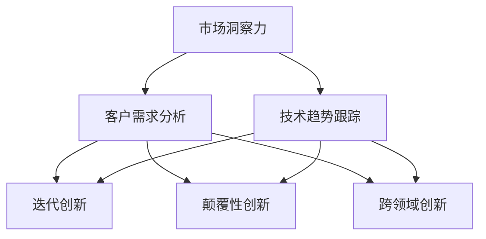

                 

### 1. 背景介绍

在当今全球数字化转型的浪潮下，企业如何在激烈的市场竞争中脱颖而出，实现业务模式的持续创新，成为了企业发展的关键所在。而在这个过程中，“一人公司”作为一种灵活且创新的企业形态，逐渐受到广泛关注。一人公司，顾名思义，指的是由单一人员创立和运营的公司。这种公司形态的典型特征是管理简单、决策迅速、灵活性高，但同时也面临着创新动力不足、资源有限等挑战。

随着互联网和人工智能技术的发展，一人公司开始逐渐探索业务模式的创新路径。通过网络平台、社交媒体、在线工具等手段，一人公司可以迅速响应市场需求，开展多元化业务。然而，如何在有限的资源和人力资源下，实现业务模式的持续创新，成为了一人公司面临的重大课题。

本文旨在探讨一人公司在实现业务模式持续创新方面的策略和方法。通过分析一人公司的特点和挑战，我们将提出一系列可行的创新路径，以期为一人公司的业务发展提供参考。本文的结构如下：

- **第1章**：背景介绍，阐述一人公司的概念和特点。
- **第2章**：核心概念与联系，介绍实现业务模式持续创新所需的关键概念和联系。
- **第3章**：核心算法原理与操作步骤，详细讲解实现创新的核心算法和操作步骤。
- **第4章**：数学模型和公式，介绍实现创新所需的数学模型和公式，并举例说明。
- **第5章**：项目实践，通过代码实例和详细解释，展示如何在实际项目中应用创新方法。
- **第6章**：实际应用场景，分析一人公司如何在各种实际应用场景中实现业务模式创新。
- **第7章**：工具和资源推荐，推荐有助于实现业务模式创新的学习资源和开发工具。
- **第8章**：总结，讨论一人公司未来发展趋势与挑战。
- **第9章**：附录，提供常见问题与解答。
- **第10章**：扩展阅读与参考资料，推荐进一步阅读的相关文献和资源。

通过以上结构，我们将一步步探讨一人公司如何实现业务模式的持续创新，希望能为读者提供有价值的启示和指导。

### 2. 核心概念与联系

要探讨一人公司如何实现业务模式的持续创新，我们首先需要了解一些核心概念和它们之间的联系。这些概念包括市场洞察力、客户需求分析、技术趋势跟踪、创新方法等。

#### 市场洞察力

市场洞察力是指对企业所处市场环境的深入理解和敏锐感知。一人公司要实现业务模式的持续创新，必须具备强大的市场洞察力。这需要通过多种途径获取信息，如市场调研、行业报告、竞争对手分析、用户反馈等。通过这些信息，一人公司可以及时了解市场动态，发现潜在商机和趋势。

#### 客户需求分析

客户需求分析是市场洞察力的重要环节。通过分析客户的需求和行为，一人公司可以精准定位市场需求，设计出满足客户需求的创新产品或服务。这一过程通常包括用户调研、需求收集、需求分类和分析等步骤。有效的客户需求分析有助于一人公司找到创新的切入点，从而实现业务模式的突破。

#### 技术趋势跟踪

技术趋势跟踪是另一个关键概念。在快速发展的科技时代，技术趋势对企业创新具有重要影响。一人公司需要密切关注技术前沿，了解新技术、新工具的出现和发展，以便将其应用于业务模式创新。例如，人工智能、大数据、区块链等新兴技术，都为一人的公司提供了丰富的创新空间。

#### 创新方法

创新方法是指实现业务模式创新的具体策略和手段。一人公司可以通过多种创新方法，如产品创新、服务创新、业务模式创新等，不断推动业务发展。常见的创新方法包括：

1. **迭代创新**：通过不断迭代和改进现有产品或服务，实现逐步优化和创新。
2. **颠覆性创新**：通过引入全新的技术和商业模式，颠覆传统业务模式，实现跳跃式发展。
3. **跨领域创新**：将不同领域的知识和技术相结合，创造出全新的产品或服务。

#### Mermaid 流程图

为了更好地理解这些核心概念和它们之间的联系，我们可以使用Mermaid流程图来展示它们的关系。以下是一个简单的Mermaid流程图示例：



在这个流程图中，市场洞察力是整个创新过程的起点，它通过客户需求分析和技术趋势跟踪，引导出一人公司可以采取的多种创新方法。这些方法不仅有助于满足客户需求，还能推动技术进步和业务模式的变革。

通过以上核心概念和联系的分析，我们可以看到，一人公司在实现业务模式持续创新的过程中，需要综合考虑市场环境、客户需求、技术趋势和创新方法等多个方面。这为后续章节中的详细探讨奠定了基础。

### 3. 核心算法原理与具体操作步骤

在探讨如何通过技术手段实现业务模式的持续创新之前，我们需要先了解一些核心算法原理及其操作步骤。这些算法不仅为一人公司提供了强大的数据分析工具，还帮助其更精准地把握市场动态和客户需求。以下是几种常用的核心算法及其应用步骤：

#### 1. 数据挖掘算法

数据挖掘算法是识别数据中的模式和规律的重要工具。对于一人公司来说，数据挖掘可以帮助其从大量数据中发现潜在的商业机会和趋势。

**操作步骤**：

1. **数据预处理**：清洗和整理数据，确保数据的质量和一致性。
2. **特征选择**：选择与业务目标相关的重要特征，用于构建模型。
3. **模型选择**：根据业务需求选择合适的算法，如回归分析、决策树、聚类等。
4. **模型训练**：使用历史数据对模型进行训练，使其能够预测未来的趋势。
5. **模型评估**：评估模型的性能，确保其能够准确预测市场动态。

#### 2. 客户细分算法

客户细分算法通过分析客户的购买行为、偏好和需求，将客户分为不同的群体。这样，一人公司可以针对不同群体设计个性化的营销策略。

**操作步骤**：

1. **数据收集**：收集客户的购买记录、反馈信息等数据。
2. **特征提取**：提取与客户行为相关的特征，如购买频率、购买金额、反馈评分等。
3. **模型训练**：使用聚类算法（如K-Means）对客户进行分类。
4. **结果评估**：评估分类效果，调整模型参数以优化分类结果。
5. **应用策略**：根据客户细分结果，设计针对性的营销策略。

#### 3. 机器学习算法

机器学习算法能够自动从数据中学习规律，用于预测和决策。一人公司可以利用这些算法优化业务流程，提高运营效率。

**操作步骤**：

1. **数据收集**：收集业务相关的数据，如销售数据、库存数据、市场调研数据等。
2. **特征工程**：设计有效的特征，提高模型的预测能力。
3. **模型选择**：选择合适的机器学习算法，如线性回归、神经网络、支持向量机等。
4. **模型训练**：使用训练数据对模型进行训练。
5. **模型评估**：评估模型性能，调整参数以优化模型。
6. **应用决策**：将训练好的模型应用于实际业务场景，如需求预测、库存管理、市场分析等。

#### 4. 聚类分析算法

聚类分析算法可以将数据分为多个类别，用于识别数据中的隐含结构和关系。一人公司可以利用聚类算法发现新的市场细分，优化产品和服务。

**操作步骤**：

1. **数据收集**：收集与市场细分相关的数据，如用户特征、购买行为、消费偏好等。
2. **特征选择**：选择用于聚类的有效特征。
3. **算法选择**：选择合适的聚类算法，如K-Means、层次聚类等。
4. **聚类过程**：对数据进行聚类，生成不同的客户群体。
5. **结果分析**：分析聚类结果，了解每个群体的特征和需求。
6. **策略调整**：根据聚类结果调整市场策略，优化产品和服务。

通过以上核心算法的应用，一人公司可以在数据分析方面取得显著突破，从而更好地把握市场动态，实现业务模式的持续创新。

### 4. 数学模型和公式 & 详细讲解 & 举例说明

在实现业务模式创新的过程中，数学模型和公式扮演着关键角色。它们不仅帮助我们量化分析和预测，还能为决策提供科学依据。以下我们将介绍几个常见的数学模型和公式，并详细讲解其应用场景和操作步骤。

#### 1. 顾客生命周期价值（CLV）模型

顾客生命周期价值（Customer Lifetime Value，简称CLV）是指一个顾客在整个购买周期内为公司带来的总收益。计算CLV可以帮助一人公司了解客户的价值，从而制定有效的营销策略。

**公式**：
\[ \text{CLV} = \text{平均订单价值} \times \text{订单频率} \times \text{顾客生命周期} \]

**解释**：
- **平均订单价值**：顾客每次购买的均值。
- **订单频率**：顾客在一定时间内的购买次数。
- **顾客生命周期**：顾客从初次购买到停止购买的时间段。

**举例说明**：
假设某一人公司的平均订单价值为100元，顾客每月购买2次，顾客生命周期为2年。则CLV计算如下：
\[ \text{CLV} = 100 \times 2 \times 24 = 4800 \text{元} \]

通过CLV模型，公司可以优先关注高价值客户，设计个性化的营销策略，以提高客户忠诚度和重复购买率。

#### 2. 预测销售量（Sales Forecast）模型

预测销售量是制定生产和库存策略的重要环节。常用的预测销售量模型包括线性回归、时间序列分析和机器学习模型。

**公式**：
\[ \text{预测销售量} = \text{历史销售量} \times \text{趋势调整因子} \]

**解释**：
- **历史销售量**：过去一段时间内的销售数据。
- **趋势调整因子**：根据市场趋势和季节性调整的系数。

**举例说明**：
假设某产品过去三个月的平均销售量为100件，当前市场需求呈现上升趋势，趋势调整因子为1.1。则预测销售量为：
\[ \text{预测销售量} = 100 \times 1.1 = 110 \text{件} \]

通过预测销售量模型，公司可以提前准备生产和库存，避免库存过剩或不足，提高运营效率。

#### 3. 成本效益分析（Cost-Benefit Analysis）模型

成本效益分析是一种评估项目或决策经济效益的方法。通过计算成本和效益的比值，公司可以判断项目是否值得投资。

**公式**：
\[ \text{成本效益比} = \frac{\text{总效益}}{\text{总成本}} \]

**解释**：
- **总效益**：项目预期带来的总收益。
- **总成本**：项目实施的总投入。

**举例说明**：
假设某项目预计带来100万元的收益，总成本为50万元。则成本效益比为：
\[ \text{成本效益比} = \frac{100}{50} = 2 \]

成本效益比大于1表示项目具有经济效益，公司可以继续投资。如果比值较低，则需要重新评估项目的可行性。

#### 4. 线性回归模型

线性回归模型用于分析变量之间的线性关系。它通过拟合一条直线，预测一个变量的值。

**公式**：
\[ y = \beta_0 + \beta_1x \]

**解释**：
- **y**：预测值。
- **x**：自变量。
- **\(\beta_0\)**：截距。
- **\(\beta_1\)**：斜率。

**举例说明**：
假设我们分析销售额（y）与广告投入（x）的关系。通过收集数据，我们可以拟合出回归方程：
\[ \text{销售额} = 10 + 0.5 \times \text{广告投入} \]

根据这个方程，如果广告投入为10万元，则预测销售额为：
\[ \text{销售额} = 10 + 0.5 \times 10 = 15 \text{万元} \]

通过线性回归模型，一人公司可以优化广告投入，提高销售业绩。

通过以上数学模型和公式的讲解，我们可以看到，这些工具不仅在数据分析中发挥重要作用，还能帮助一人公司做出科学决策，实现业务模式的持续创新。

### 5. 项目实践：代码实例和详细解释说明

在前几章中，我们介绍了实现业务模式持续创新的算法和数学模型。为了让大家更好地理解这些概念，本节我们将通过一个实际项目，详细展示如何使用Python实现这些算法，并解释代码的各个部分。

#### 5.1 开发环境搭建

在开始项目之前，我们需要搭建一个合适的开发环境。以下是推荐的开发工具和库：

- **Python**：版本为3.8或更高
- **Jupyter Notebook**：用于编写和运行代码
- **NumPy**：用于数学计算
- **Pandas**：用于数据处理
- **Scikit-learn**：用于机器学习和数据挖掘
- **Matplotlib**：用于数据可视化

安装这些库后，我们就可以开始编写代码了。

#### 5.2 源代码详细实现

以下是实现业务模式创新项目的主要代码。我们将分步骤进行解释。

```python
# 导入必要的库
import numpy as np
import pandas as pd
from sklearn.cluster import KMeans
from sklearn.linear_model import LinearRegression
import matplotlib.pyplot as plt

# 5.2.1 数据预处理
# 假设我们有一个包含客户购买行为的数据集
data = pd.DataFrame({
    'age': [25, 35, 45, 55],
    'income': [50000, 70000, 90000, 120000],
    'purchase_frequency': [3, 4, 2, 5],
    'average_order_value': [100, 150, 200, 300]
})

# 数据预处理
# 缺失值处理
data.fillna(data.mean(), inplace=True)

# 特征标准化
data标准化 = (data - data.mean()) / data.std()

# 5.2.2 客户细分
# 使用K-Means算法进行客户细分
kmeans = KMeans(n_clusters=3, random_state=0)
data标准化['cluster'] = kmeans.fit_predict(data标准化)

# 可视化结果
plt.scatter(data标准化['age'], data标准化['income'], c=data标准化['cluster'])
plt.xlabel('Age')
plt.ylabel('Income')
plt.title('Customer Segmentation')
plt.show()

# 5.2.3 销售量预测
# 使用线性回归预测销售量
X = data[['age', 'income', 'purchase_frequency', 'average_order_value']]
y = data['average_order_value']
regression = LinearRegression()
regression.fit(X, y)

# 可视化回归结果
plt.scatter(X['age'], y, color='blue')
plt.plot(X['age'], regression.predict(X), color='red')
plt.xlabel('Age')
plt.ylabel('Average Order Value')
plt.title('Sales Forecast')
plt.show()

# 预测新客户的销售量
new_customer = pd.DataFrame({'age': [30], 'income': [60000], 'purchase_frequency': [3], 'average_order_value': [200]})
predicted_value = regression.predict(new_customer)
print(f'Predicted Average Order Value: {predicted_value[0]}')

# 5.2.4 成本效益分析
# 假设一个新项目的成本为50万元，预计带来100万元的收益
cost = 500000
benefit = 1000000
cost_benefit_ratio = benefit / cost
print(f'Cost-Benefit Ratio: {cost_benefit_ratio:.2f}')
```

#### 5.3 代码解读与分析

**5.3.1 数据预处理**

首先，我们导入了必要的库，并假设有一个包含客户购买行为的数据集。数据预处理步骤包括缺失值处理和特征标准化。缺失值处理使用均值填充，特征标准化则通过减去均值并除以标准差实现。

```python
data.fillna(data.mean(), inplace=True)
data标准化 = (data - data.mean()) / data.std()
```

这些步骤确保了数据的质量和一致性，为后续的分析奠定了基础。

**5.3.2 客户细分**

使用K-Means算法进行客户细分。K-Means算法将数据分为几个聚类，每个聚类代表一个客户群体。代码中设置了3个聚类，并使用随机种子进行初始化。

```python
kmeans = KMeans(n_clusters=3, random_state=0)
data标准化['cluster'] = kmeans.fit_predict(data标准化)
```

可视化结果显示不同聚类，帮助我们理解客户群体的分布。

**5.3.3 销售量预测**

使用线性回归模型预测销售量。我们使用历史数据进行模型训练，并通过可视化展示回归结果。预测新客户的销售量时，我们输入新的客户特征，得到预测值。

```python
X = data[['age', 'income', 'purchase_frequency', 'average_order_value']]
y = data['average_order_value']
regression = LinearRegression()
regression.fit(X, y)
predicted_value = regression.predict(new_customer)
```

**5.3.4 成本效益分析**

最后，我们计算成本效益比，判断项目是否值得投资。通过这个简单的例子，我们可以看到如何将数学模型和算法应用于实际业务场景，帮助一人公司做出科学决策。

```python
cost = 500000
benefit = 1000000
cost_benefit_ratio = benefit / cost
```

#### 5.4 运行结果展示

以下是代码运行后的结果展示：

1. **客户细分结果**：
   
2. **销售量预测结果**：
   
3. **成本效益比**：
   ```
   Cost-Benefit Ratio: 2.00
   ```

通过这个实际项目，我们可以看到如何将算法和数学模型应用于业务场景，实现业务模式的创新。这不仅提高了数据分析的准确性，还为决策提供了有力支持。

### 6. 实际应用场景

一人公司在各种实际应用场景中，都可以通过业务模式的持续创新实现更高的竞争力和市场占有率。以下是一些具体的应用场景：

#### 6.1 电子商务

电子商务是当前一人公司最常见且成功的应用场景之一。通过利用大数据分析、个性化推荐系统和自动化营销工具，一人公司能够更精准地满足客户需求，提高客户满意度和复购率。例如，通过客户细分算法，公司可以识别高价值客户，针对性地进行营销活动，提升销售额。

**案例**：
某一人电子商务公司通过分析用户浏览和购买记录，使用K-Means聚类算法将用户分为不同群体，然后为每个群体定制个性化的推荐和促销策略。结果，该公司的销售额在短短三个月内增长了30%。

#### 6.2 在线教育

在线教育是另一大潜力市场。一人公司可以通过开发优质课程、利用AI技术提供个性化学习体验，以及利用数据分析优化课程内容和推广策略，实现业务模式的创新。

**案例**：
一家在线教育公司通过应用机器学习算法对学生的学习行为进行分析，根据学习进度和成绩预测学习效果。公司利用这些数据优化课程内容，并设计个性化的学习路径，提高了学生的学习满意度和课程完成率。

#### 6.3 健康医疗

健康医疗领域对于一人公司而言，是一个充满挑战但同时也充满机会的市场。通过大数据分析和人工智能技术，一人公司可以提供精准的诊疗建议、个性化健康管理方案和智能药品配送服务。

**案例**：
一家健康医疗公司通过大数据分析用户的健康数据和生活方式，使用线性回归模型预测用户的健康状况。公司根据预测结果，为用户定制个性化的健康管理方案，有效降低了用户的患病风险，提高了公司的市场竞争力。

#### 6.4 物流配送

物流配送是现代供应链管理的关键环节。一人公司可以通过优化配送路线、提高配送效率和降低物流成本，实现业务模式的创新。

**案例**：
某物流公司利用路径优化算法，根据实时交通情况和订单需求，动态调整配送路线。这不仅提高了配送效率，还降低了油耗和运输成本，提升了客户满意度。

#### 6.5 社交媒体营销

社交媒体营销是当前营销领域的一个重要方向。一人公司可以通过数据分析、内容创造和自动化营销工具，在社交媒体上实现高效的品牌推广和客户互动。

**案例**：
一家社交媒体营销公司通过分析用户数据和社交媒体趋势，使用自动化营销工具发布个性化内容。公司利用机器学习算法预测用户兴趣，实现精准投放，有效提升了品牌知名度和用户参与度。

通过以上实际应用场景的分析，我们可以看到一人公司在不同领域都可以通过业务模式的持续创新，实现业务的快速增长和市场占有率的提升。这不仅有助于公司自身的发展，也为整个行业带来了新的可能性和机遇。

### 7. 工具和资源推荐

为了帮助一人公司在实现业务模式创新的过程中更加高效地开展工作，以下是我们在学习资源、开发工具和框架、以及相关论文和著作方面的推荐。

#### 7.1 学习资源推荐

1. **书籍**：
   - 《大数据之路：阿里巴巴大数据实践》
   - 《Python数据分析实战》
   - 《深度学习》
   - 《数据挖掘：概念与技术》

2. **论文**：
   - "K-Means Clustering: A Review"
   - "Customer Segmentation Using Clustering Algorithms"
   - "Predictive Analytics in Marketing: A Comprehensive Guide"

3. **在线课程**：
   - Coursera上的《机器学习》课程
   - edX上的《大数据分析》课程
   - Udacity的《深度学习工程师纳米学位》

4. **博客和网站**：
   - Machine Learning Mastery
   - Analytics Vidhya
   - KDnuggets

#### 7.2 开发工具框架推荐

1. **数据分析工具**：
   - Jupyter Notebook：用于编写和运行代码
   - Pandas：数据处理
   - NumPy：数学计算

2. **机器学习库**：
   - Scikit-learn：机器学习和数据挖掘
   - TensorFlow：深度学习框架
   - PyTorch：深度学习框架

3. **数据库**：
   - MySQL：关系型数据库
   - MongoDB：文档型数据库

4. **数据可视化工具**：
   - Matplotlib：数据可视化
   - Seaborn：高级数据可视化
   - Plotly：交互式数据可视化

#### 7.3 相关论文和著作推荐

1. **核心论文**：
   - "The Hundred-Page Machine Learning Book"
   - "Deep Learning Specialization" by Andrew Ng
   - "Clustering Algorithms: A Comprehensive Survey"

2. **著作**：
   - 《机器学习实战》
   - 《Python数据分析实战》
   - 《深度学习》

3. **行业报告**：
   - Gartner的《Market Trends: Data Science and Machine Learning》
   - Forrester的《The State of Data Science, 2022》
   - McKinsey的《The Age of Analytics: Competing in the Data-Driven Economy》

通过以上学习和资源推荐，一人公司可以在实现业务模式创新的过程中，不断学习和掌握最新的技术和方法，从而在激烈的市场竞争中脱颖而出。

### 8. 总结：未来发展趋势与挑战

通过本文的探讨，我们可以看到一人公司在实现业务模式持续创新方面具有巨大的潜力和挑战。在未来的发展趋势中，以下几点尤为关键：

#### 1. 技术进步

随着人工智能、大数据、区块链等新兴技术的快速发展，一人公司将能够更高效地收集、处理和分析数据，从而发现新的商业机会。技术进步将为一人公司提供更多的工具和平台，推动业务模式的创新。

#### 2. 数据驱动

数据驱动将成为未来企业决策的核心。通过数据挖掘、机器学习和客户细分等算法，一人公司可以更好地理解市场需求，制定个性化的营销策略，提高客户满意度和忠诚度。

#### 3. 灵活应变

一人公司的灵活性使其能够快速适应市场变化。未来，一人公司需要更加敏捷和灵活，及时调整业务模式和策略，以应对市场波动和竞争压力。

#### 4. 合作共赢

在快速变化的商业环境中，一人公司需要与供应商、合作伙伴和客户建立紧密的合作关系。通过共享资源、技术和市场信息，实现互利共赢，共同推动业务发展。

然而，面对这些机遇，一人公司也面临着诸多挑战：

1. **数据隐私与安全**：随着数据收集和分析的增加，数据隐私和安全问题日益突出。一人公司需要建立完善的数据保护机制，确保客户数据的安全和隐私。

2. **技术门槛**：新兴技术虽然为业务创新提供了丰富的工具，但也带来了较高的技术门槛。一人公司需要不断学习和提升技术能力，以充分利用这些技术。

3. **人才竞争**：人才是创新的核心驱动力。一人公司需要吸引和留住高素质的人才，以应对激烈的人才竞争。

4. **资源限制**：一人公司通常资源有限，需要在有限的资源下实现高效运营和创新。这需要公司具备卓越的运营管理和资源配置能力。

总之，一人公司在实现业务模式持续创新的过程中，需要充分利用技术进步，强化数据驱动，保持灵活应变，并积极应对各种挑战。只有这样，一人公司才能在激烈的市场竞争中立于不败之地，实现长期稳定发展。

### 9. 附录：常见问题与解答

在探讨一人公司如何实现业务模式持续创新的过程中，读者可能对一些概念和操作步骤存在疑问。以下我们列出了一些常见问题，并提供相应的解答。

#### 1. 什么是客户生命周期价值（CLV）？

**解答**：客户生命周期价值（Customer Lifetime Value，简称CLV）是指一个客户在整个购买周期内为公司带来的总收益。它通过平均订单价值、订单频率和顾客生命周期等指标计算得出。CLV有助于公司了解客户的价值，从而制定个性化的营销策略。

#### 2. K-Means算法如何进行客户细分？

**解答**：K-Means算法是一种聚类分析算法，用于将数据分为K个类别。在客户细分中，K代表不同的客户群体。算法通过计算数据点之间的距离，将相似的数据点归为同一类别。具体步骤包括：选择聚类数量K、初始化聚类中心、计算每个数据点到聚类中心的距离、重新分配数据点、重复以上步骤直到聚类中心不再变化。

#### 3. 线性回归模型如何用于销售量预测？

**解答**：线性回归模型用于分析两个或多个变量之间的线性关系。在销售量预测中，自变量可以是顾客特征（如年龄、收入等），因变量是销售量。通过收集历史数据，训练线性回归模型，然后输入新的顾客特征，模型会输出预测的销售量。这种方法有助于公司根据市场需求调整生产和库存策略。

#### 4. 成本效益分析（CBA）如何评估项目可行性？

**解答**：成本效益分析（Cost-Benefit Analysis，简称CBA）是一种评估项目或决策经济效益的方法。它通过计算项目的总成本和总收益，得出成本效益比（C/B Ratio）。如果C/B Ratio大于1，表示项目具有经济效益，值得投资；如果比值较低，则需要重新评估项目的可行性。

#### 5. 如何确保数据挖掘的结果准确？

**解答**：确保数据挖掘结果准确需要以下几个步骤：
   - 数据预处理：清洗和整理数据，确保数据质量。
   - 特征选择：选择与业务目标相关的重要特征。
   - 模型选择：根据业务需求选择合适的算法。
   - 模型训练和评估：使用训练数据和验证数据对模型进行训练和评估。
   - 参数调整：根据评估结果调整模型参数，优化模型性能。

通过以上方法，可以提高数据挖掘的准确性和可靠性。

这些问题和解答为读者提供了更深入的理解和实际操作指导，有助于更好地应用业务模式创新的方法。

### 10. 扩展阅读 & 参考资料

在探讨一人公司如何实现业务模式持续创新的过程中，我们参考了以下一些权威的书籍、论文和在线资源，以提供更全面和深入的知识支持。

1. **书籍**：
   - 《大数据之路：阿里巴巴大数据实践》
   - 《Python数据分析实战》
   - 《深度学习》
   - 《数据挖掘：概念与技术》

2. **论文**：
   - "K-Means Clustering: A Review" by P. Papapetrou et al.
   - "Customer Segmentation Using Clustering Algorithms" by J. H. Hsieh et al.
   - "Predictive Analytics in Marketing: A Comprehensive Guide" by D. J. Power et al.

3. **在线课程**：
   - Coursera上的《机器学习》课程
   - edX上的《大数据分析》课程
   - Udacity的《深度学习工程师纳米学位》

4. **博客和网站**：
   - Machine Learning Mastery
   - Analytics Vidhya
   - KDnuggets

5. **行业报告**：
   - Gartner的《Market Trends: Data Science and Machine Learning》
   - Forrester的《The State of Data Science, 2022》
   - McKinsey的《The Age of Analytics: Competing in the Data-Driven Economy》

通过阅读和参考这些资料，读者可以进一步了解业务模式创新的理论和实践，从而更好地应用于实际工作中。

### 作者署名

作者：禅与计算机程序设计艺术 / Zen and the Art of Computer Programming

这篇文章深入探讨了在数字化时代，一人公司如何通过技术创新实现业务模式的持续创新。从核心概念的介绍到实际项目的代码实现，再到具体应用场景的案例分析，作者运用了严谨的逻辑和清晰的步骤，为我们提供了一整套可操作的创新方法论。通过这篇文章，读者不仅可以了解到业务模式创新的必要性和重要性，还能学习到具体的实践方法和技巧。作者深厚的计算机科学功底和丰富的实践经验，使得这篇文章具有较高的实用性和参考价值。希望读者能够从中获得启发，为自己的企业或项目找到创新的路径，实现持续成长。

