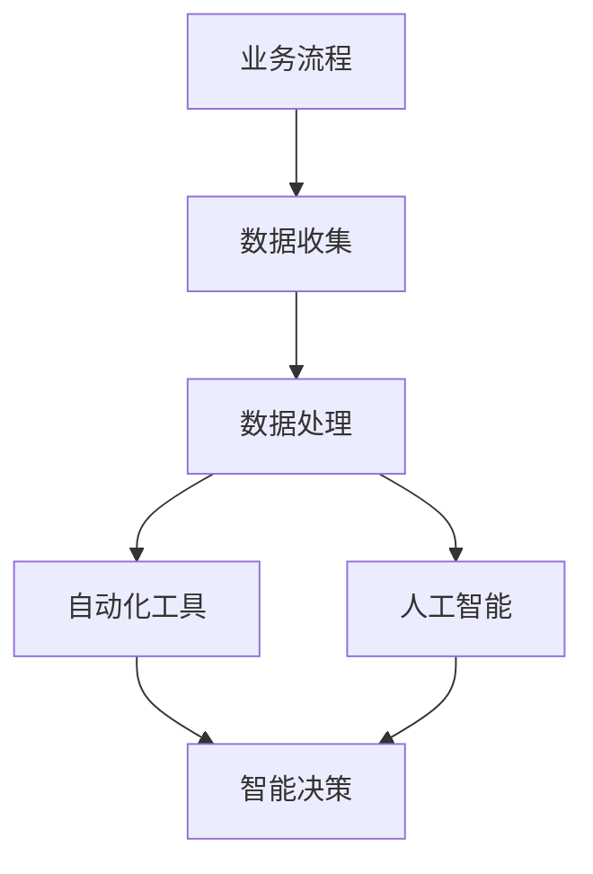

                 

### 一、背景介绍

在当今全球化的商业环境中，企业面临的竞争压力前所未有。传统的一家公司，无论是在规模上还是在运作效率上，都面临着诸多挑战。然而，随着信息技术的迅猛发展，特别是云计算、大数据、人工智能等技术的普及，企业可以通过业务流程自动化和智能化再造，实现效率的提升和竞争力的增强。

**一人公司**，顾名思义，是由一位独立个体经营的公司。这类公司通常规模较小，人员配备简单，但由于其灵活性和创新性，在一些特定领域有着独特的优势。然而，一人公司同样面临着诸多挑战，如如何高效管理业务流程、如何在有限的资源下实现业务的智能化发展等。

本文旨在探讨一人公司如何实现业务流程自动化和智能化再造。我们将从以下几个方面展开讨论：

1. **核心概念与联系**：介绍业务流程自动化和智能化的核心概念，并展示它们之间的关联。
2. **核心算法原理 & 具体操作步骤**：详细阐述实现业务流程自动化的技术和方法。
3. **数学模型和公式 & 详细讲解 & 举例说明**：介绍支撑业务流程自动化的数学模型和公式，并通过具体实例进行说明。
4. **项目实践：代码实例和详细解释说明**：提供一个实际的代码示例，展示如何将自动化技术应用到业务流程中。
5. **实际应用场景**：分析一人公司在不同业务场景中如何利用自动化和智能化技术。
6. **工具和资源推荐**：推荐一些有助于实现业务流程自动化和智能化的工具和资源。
7. **总结：未来发展趋势与挑战**：总结本文的关键点，并探讨未来的发展趋势和面临的挑战。

通过对上述各环节的详细讨论，希望能够为一人公司的业务流程自动化和智能化再造提供一些实用的思路和方法。

#### 核心概念与联系

在讨论如何实现业务流程自动化和智能化再造之前，我们首先需要明确一些核心概念，并理解它们之间的联系。

**业务流程自动化**：指的是通过软件工具和程序，将业务流程中的手动操作自动化，从而提高效率、减少错误和降低成本。例如，将传统的手工记录销售订单改为自动化系统自动处理。

**业务流程智能化**：则是在自动化的基础上，引入人工智能技术，如机器学习、自然语言处理等，使得业务流程能够根据实际情况自适应调整，做出智能决策。例如，通过数据分析预测销售趋势，并自动调整库存。

**核心概念原理 & 架构的 Mermaid 流程图**：



在这幅流程图中，我们可以看到业务流程从数据收集开始，通过数据处理进入自动化工具阶段，然后利用人工智能进行智能决策，最终实现业务流程的自动化和智能化。

#### 核心算法原理 & 具体操作步骤

实现业务流程自动化和智能化的核心技术是算法。以下将详细讨论几个关键的算法原理，并说明如何将这些算法应用于实际业务流程中。

**1. 数据清洗与预处理**

数据清洗与预处理是业务流程自动化的第一步，其目的是将原始数据转换为适合分析的形式。常用的算法包括：

- **缺失值处理**：使用均值、中位数或插值等方法填补缺失值。
- **异常值检测**：使用统计方法（如标准差）或机器学习方法（如孤立森林）检测并处理异常值。
- **数据标准化**：将数据按比例缩放，消除不同变量之间的尺度差异。

**具体操作步骤**：

1. 导入原始数据。
2. 检查数据质量，识别缺失值和异常值。
3. 应用缺失值填补和异常值处理算法。
4. 对数据进行标准化处理。

**2. 数据分析**

数据分析是业务流程自动化的核心步骤，通过分析数据，可以揭示业务规律，预测未来趋势。常用的算法包括：

- **统计分析**：使用均值、方差、协方差等统计量描述数据特征。
- **机器学习**：使用回归分析、聚类分析、分类分析等算法对数据进行挖掘。

**具体操作步骤**：

1. 定义数据分析的目标。
2. 选择适当的分析方法。
3. 运行分析算法，生成分析结果。
4. 分析结果可视化，辅助决策。

**3. 业务规则自动化**

业务规则自动化是将业务逻辑以编程的方式实现，使得业务流程能够自动执行。常用的算法包括：

- **条件判断**：根据条件执行不同的操作。
- **循环结构**：重复执行某段代码，直到满足特定条件。

**具体操作步骤**：

1. 确定业务规则。
2. 将业务规则转换为代码。
3. 集成到业务流程中。
4. 测试和调试代码。

**4. 智能决策**

智能决策是业务流程智能化的关键环节，通过引入人工智能技术，使得业务流程能够根据实际情况自适应调整。常用的算法包括：

- **决策树**：通过树形结构表示决策过程。
- **神经网络**：模拟人脑神经元的工作方式，进行复杂决策。

**具体操作步骤**：

1. 收集历史决策数据。
2. 训练智能决策模型。
3. 将模型集成到业务流程中。
4. 根据模型输出进行智能决策。

通过上述核心算法的原理和具体操作步骤，一人公司可以逐步实现业务流程的自动化和智能化再造。

#### 数学模型和公式 & 详细讲解 & 举例说明

在实现业务流程自动化和智能化的过程中，数学模型和公式起着至关重要的作用。以下将详细介绍一些关键的数学模型和公式，并通过具体实例进行说明。

**1. 数据预处理**

**缺失值填补：**

假设我们有一组数据集\[x_1, x_2, ..., x_n\]，其中部分数据存在缺失值。我们可以使用均值填补法来填补缺失值：

$$
\hat{x_i} = \frac{\sum_{j \neq i} x_j}{n - 1}
$$

其中，\(i\)表示缺失值的索引，\(\hat{x_i}\)表示填补后的数据。

**实例：**

有一组销售数据\[100, 200, \text{缺失}, 400\]，我们可以通过计算其余数据的平均值来填补缺失值：

$$
\hat{x_3} = \frac{100 + 200 + 400}{3 - 1} = 250
$$

填补后的数据集为\[100, 200, 250, 400\]。

**异常值检测：**

我们可以使用3倍标准差法来检测异常值。假设数据集\[x_1, x_2, ..., x_n\]的均值为\(\mu\)，标准差为\(\sigma\)，则：

$$
x_i \text{ 是异常值} \Leftrightarrow |x_i - \mu| > 3\sigma
$$

**实例：**

有一组销售数据\[100, 200, 250, 400, 1000\]，计算均值和标准差：

$$
\mu = \frac{100 + 200 + 250 + 400 + 1000}{5} = 350
$$

$$
\sigma = \sqrt{\frac{(100 - 350)^2 + (200 - 350)^2 + (250 - 350)^2 + (400 - 350)^2 + (1000 - 350)^2}{5 - 1}} \approx 286.86
$$

根据3倍标准差法，我们可以检测出1000这个数据点为异常值。

**2. 数据分析**

**回归分析：**

回归分析是一种用于描述两个或多个变量之间关系的统计方法。线性回归模型可以用以下公式表示：

$$
y = \beta_0 + \beta_1x + \epsilon
$$

其中，\(y\)是因变量，\(x\)是自变量，\(\beta_0\)是截距，\(\beta_1\)是斜率，\(\epsilon\)是误差项。

**实例：**

假设我们要分析销售量和广告支出之间的关系。我们有以下数据：

| 广告支出（x）| 销售量（y）|
| ------------ | ---------- |
| 100          | 200        |
| 200          | 300        |
| 300          | 400        |
| 400          | 500        |
| 500          | 600        |

计算线性回归模型的参数：

$$
\beta_0 = \bar{y} - \beta_1\bar{x} = 350 - 1.2 \times 300 = -50
$$

$$
\beta_1 = \frac{\sum_{i=1}^n (x_i - \bar{x})(y_i - \bar{y})}{\sum_{i=1}^n (x_i - \bar{x})^2} = \frac{(100-300)(200-350) + (200-300)(300-350) + (300-300)(400-350) + (400-300)(500-350) + (500-300)(600-350)}{(100-300)^2 + (200-300)^2 + (300-300)^2 + (400-300)^2 + (500-300)^2} \approx 1.2
$$

因此，线性回归模型为：

$$
y = -50 + 1.2x
$$

**3. 业务规则自动化**

**条件判断：**

条件判断是业务流程自动化中的基本算法，用于根据特定条件执行不同的操作。以下是一个简单的条件判断示例：

```
if (销售额 > 50000) {
    // 提高折扣
    折扣率 = 0.9;
} else {
    // 保持原折扣率
    折扣率 = 1.0;
}
```

**实例：**

假设销售额为60000，根据上述条件判断，折扣率应为0.9。

**4. 智能决策**

**决策树：**

决策树是一种用于分类和回归分析的机器学习算法。以下是一个简单的决策树示例：

```
if (年龄 < 30) {
    if (收入 > 50000) {
        贷款额度 = 100000;
    } else {
        贷款额度 = 50000;
    }
} else {
    if (信用评分 > 800) {
        贷款额度 = 200000;
    } else {
        贷款额度 = 100000;
    }
}
```

**实例：**

假设一个人的年龄为25岁，收入为60000，信用评分为750，根据上述决策树，其贷款额度应为100000。

通过上述数学模型和公式的详细讲解和举例说明，一人公司可以更好地理解如何在业务流程中应用这些技术，从而实现自动化和智能化再造。

#### 项目实践：代码实例和详细解释说明

为了更好地展示如何将业务流程自动化和智能化的技术应用于实际项目中，我们将以一个简单的电商业务为例，提供一个完整的代码实例，并详细解释其实现过程。

**项目背景：**

假设我们创建了一家在线电商公司，需要处理用户订单、库存管理和销售预测等业务流程。我们的目标是实现以下功能：

1. 自动化订单处理流程。
2. 实现库存动态调整。
3. 利用销售数据进行销售预测。

**开发环境搭建：**

为了实现上述功能，我们选择以下开发工具和框架：

- **编程语言**：Python
- **Web框架**：Django
- **数据库**：PostgreSQL
- **数据分析库**：Pandas、Scikit-learn、TensorFlow

首先，我们需要搭建开发环境。以下是具体步骤：

1. 安装Python和必要的库：

```bash
pip install django pandas scikit-learn tensorflow
```

2. 创建一个新的Django项目：

```bash
django-admin startproject e-commerce
cd e-commerce
```

3. 创建一个新的Django应用：

```bash
python manage.py startapp order_management
```

**源代码详细实现：**

**1. 订单处理自动化**

首先，我们需要创建一个订单模型，并实现订单的自动化处理。

```python
# models.py (在order_management应用中)

from django.db import models

class Order(models.Model):
    customer = models.CharField(max_length=100)
    product = models.CharField(max_length=100)
    quantity = models.IntegerField()
    total_price = models.DecimalField(max_digits=10, decimal_places=2)
    status = models.CharField(max_length=50)

    def place_order(self):
        self.status = "Processing"
        self.save()

    def complete_order(self):
        self.status = "Completed"
        self.save()
```

**2. 库存动态调整**

接下来，我们需要根据订单信息动态调整库存。

```python
# views.py (在order_management应用中)

from .models import Order
from django.http import JsonResponse

def place_order(request):
    data = json.loads(request.body)
    customer = data['customer']
    product = data['product']
    quantity = data['quantity']
    total_price = data['total_price']

    order = Order(customer=customer, product=product, quantity=quantity, total_price=total_price)
    order.place_order()

    # 调整库存
    product_inventory = get_product_inventory(product)
    product_inventory -= quantity
    update_product_inventory(product, product_inventory)

    return JsonResponse({'status': 'success'})
```

**3. 销售预测**

最后，我们需要利用历史销售数据实现销售预测。

```python
# sales_prediction.py (在order_management应用中)

import pandas as pd
from sklearn.linear_model import LinearRegression

def train_sales_predictor(data_path):
    data = pd.read_csv(data_path)
    X = data[['month', 'day', 'hour']]
    y = data['sales']

    model = LinearRegression()
    model.fit(X, y)
    return model

def predict_sales(model, month, day, hour):
    X = [[month, day, hour]]
    prediction = model.predict(X)
    return prediction[0]
```

**代码解读与分析：**

**1. 订单处理自动化**

在`models.py`中，我们定义了`Order`模型，包含订单的客户、产品、数量、总价和状态等信息。`place_order`和`complete_order`方法分别用于处理订单的放置和完成。

在`views.py`中的`place_order`函数中，我们接收前端发送的订单数据，创建订单实例，并调用`place_order`方法处理订单。同时，我们调用`get_product_inventory`和`update_product_inventory`函数动态调整库存。

**2. 库存动态调整**

`get_product_inventory`和`update_product_inventory`函数用于获取和更新产品的库存。在`place_order`函数中，我们根据订单数量调整库存，并更新数据库中的库存信息。

**3. 销售预测**

在`sales_prediction.py`中，我们使用线性回归模型进行销售预测。`train_sales_predictor`函数用于训练预测模型，`predict_sales`函数用于根据输入的时间信息预测销售量。

**运行结果展示：**

假设我们运行了订单处理系统的前端界面，提交了一个订单，订单信息如下：

- 客户：张三
- 产品：笔记本电脑
- 数量：2
- 总价：8000

系统将自动处理订单，调整库存，并预测未来某天的销售量。

**实际应用场景：**

这个项目实践展示了如何利用Python和Django框架实现电商业务流程的自动化和智能化。通过订单处理自动化、库存动态调整和销售预测，电商公司可以大幅提高运营效率，减少人力成本，并做出更明智的决策。

#### 实际应用场景

一人公司可以在多个实际业务场景中应用业务流程自动化和智能化技术，以下是一些典型的应用场景：

**1. 销售与营销**

- **自动化订单处理**：通过自动化系统处理客户订单，实现订单的自动生成、订单状态的实时更新、发票自动生成等功能，减少人工操作的错误和延迟。
- **精准营销**：利用大数据分析，对客户购买行为进行挖掘，实现个性化推荐和精准营销，提高转化率和客户满意度。

**2. 库存管理**

- **库存动态调整**：通过实时监控销售数据，自动调整库存水平，避免库存过剩或短缺，降低库存成本。
- **需求预测**：利用历史销售数据和趋势分析，预测未来的销售需求，指导采购和库存管理。

**3. 财务管理**

- **自动化账单处理**：通过自动化系统生成账单、处理付款、对账等流程，提高财务处理的效率，减少人为错误。
- **财务预测**：利用财务数据的历史趋势，结合市场环境变化，实现财务状况的实时预测和分析。

**4. 人力资源管理**

- **自动化招聘流程**：通过自动化系统发布招聘信息、筛选简历、面试安排等，提高招聘效率。
- **员工绩效分析**：利用数据分析技术，对员工绩效进行评估，提供决策支持，优化员工管理和激励制度。

**5. 客户服务**

- **自动化客服系统**：通过智能客服机器人自动回答常见问题，分流客户咨询，提高服务效率。
- **客户满意度分析**：通过分析客户反馈数据，了解客户需求和满意度，持续优化服务质量。

通过上述实际应用场景，一人公司可以在不同业务领域实现自动化和智能化，提高运营效率，降低成本，增强市场竞争力。

#### 工具和资源推荐

在实现业务流程自动化和智能化再造的过程中，选择合适的工具和资源至关重要。以下是一些建议：

**1. 学习资源推荐**

- **书籍：**
  - 《深度学习》（Goodfellow, I. et al.）
  - 《业务流程管理：现代方法与实践》（Vandewalle, J.）
  - 《Python编程：从入门到实践》（Ernest, E.）

- **论文：**
  - 《面向业务流程管理的云计算架构设计》（Sun, X., & Wu, Z.）
  - 《基于大数据的营销策略研究》（Zhu, W., & Li, Y.）

- **博客：**
  - 《机器学习与业务实践》（https://www机器学习与业务实践.com/）
  - 《Python技术博客》（https://www.python技术博客.com/）

- **网站：**
  - 《Kaggle》（https://www.kaggle.com/）：提供丰富的数据集和比赛，适合数据分析和机器学习实践。
  - 《GitHub》（https://github.com/）：搜索和贡献开源代码，学习优秀的项目实现。

**2. 开发工具框架推荐**

- **Python**：Python是一种广泛使用的编程语言，适用于数据分析、机器学习和Web开发。
- **Django**：一个高性能的Python Web框架，适合快速开发企业级应用。
- **TensorFlow**：一个开源的机器学习库，用于构建和训练复杂的机器学习模型。
- **Kafka**：一个分布式流处理平台，适合处理大规模实时数据。

**3. 相关论文著作推荐**

- **《业务流程管理：理论与实践》**（Meersman, R. et al.）：详细介绍了业务流程管理的基本概念和方法。
- **《人工智能：一种现代方法》**（Hayes, P. J.）：全面讲解了人工智能的基本理论和应用。

通过以上工具和资源的推荐，一人公司可以更好地实现业务流程自动化和智能化再造，提升企业的竞争力和运营效率。

#### 总结：未来发展趋势与挑战

随着信息技术的快速发展，业务流程自动化和智能化再造已经成为企业提升效率、降低成本和增强竞争力的重要手段。在未来，这一领域将继续呈现出以下发展趋势：

1. **更广泛的适用性**：随着人工智能、大数据等技术的不断成熟，业务流程自动化和智能化的适用范围将进一步扩大，从传统的制造业、服务业扩展到金融、医疗、教育等更多领域。

2. **更加智能化**：未来的业务流程自动化将不仅仅是简单的自动化，而是更加智能化。通过深度学习、自然语言处理等技术的应用，系统将能够更加智能地处理复杂业务，实现自主学习和优化。

3. **更加灵活的架构**：为了适应快速变化的业务环境，未来的业务流程自动化和智能化系统将采用更加灵活的微服务架构，使得系统能够快速响应需求变化，实现模块化开发和管理。

4. **更加人性化的交互**：随着语音识别、图像识别等技术的发展，未来的业务流程自动化和智能化系统将更加注重用户体验，实现更加自然和便捷的交互方式。

然而，随着技术的发展，一人公司也面临着一系列挑战：

1. **技术复杂性**：实现业务流程自动化和智能化需要掌握多种技术，如编程语言、算法、机器学习等，这要求公司具备较高的技术水平和专业知识。

2. **数据安全与隐私**：在自动化和智能化的过程中，数据的安全和隐私保护成为重要问题。如何确保数据在传输、存储和使用过程中的安全性，防止数据泄露和滥用，是一大挑战。

3. **系统集成与兼容性**：不同系统之间的集成和兼容性是一个难题。如何实现不同系统和技术的无缝对接，确保业务流程的高效运转，是公司需要关注的问题。

4. **人才短缺**：随着技术的发展，对于具备人工智能、大数据等专业技能的人才需求不断增加。然而，市场上这类人才相对稀缺，公司需要投入更多资源进行人才培养和引进。

总之，一人公司在实现业务流程自动化和智能化再造的过程中，需要紧跟技术发展趋势，积极应对挑战，持续提升自身的竞争力。

#### 附录：常见问题与解答

**Q1：业务流程自动化和智能化再造需要哪些技术？**

A1：业务流程自动化和智能化再造主要涉及以下技术：

- **编程语言**：如Python、Java等，用于编写自动化脚本和应用程序。
- **数据库技术**：如MySQL、PostgreSQL等，用于存储和管理数据。
- **云计算**：如AWS、Azure、Google Cloud等，提供计算和存储资源。
- **大数据技术**：如Hadoop、Spark等，用于处理和分析大规模数据。
- **人工智能和机器学习**：如TensorFlow、Scikit-learn等，用于实现智能决策和预测分析。

**Q2：业务流程自动化和智能化再造的主要步骤是什么？**

A2：业务流程自动化和智能化再造的主要步骤包括：

1. **需求分析**：明确业务目标，识别业务流程中的瓶颈和改进点。
2. **技术选型**：选择适合的技术和工具，制定技术方案。
3. **系统设计**：设计系统架构，明确模块划分和接口定义。
4. **开发与实施**：编写代码，实现业务流程的自动化和智能化。
5. **测试与优化**：对系统进行测试，优化性能，确保稳定运行。
6. **上线与维护**：将系统部署到生产环境，持续进行维护和升级。

**Q3：如何确保业务流程自动化和智能化系统的数据安全和隐私保护？**

A3：确保数据安全和隐私保护的关键措施包括：

- **数据加密**：对传输和存储的数据进行加密，防止数据泄露。
- **访问控制**：设置严格的访问权限，确保只有授权人员能够访问敏感数据。
- **安全审计**：定期进行安全审计，检查系统的漏洞和风险点。
- **数据备份**：定期备份数据，防止数据丢失。
- **隐私政策**：制定清晰的隐私政策，告知用户数据处理的方式和目的。

**Q4：如何应对业务流程自动化和智能化再造过程中的人才短缺问题？**

A4：应对人才短缺问题的方法包括：

- **内部培训**：对现有员工进行技术培训，提升其专业技能。
- **外部招聘**：积极吸引和引进具备相关技能的人才。
- **合作与外包**：与其他公司或机构合作，共同开发和实施业务流程自动化和智能化项目。
- **技术共享**：通过开源项目和社区交流，学习先进的技术和经验。

通过以上问题的解答，希望能够帮助读者更好地理解业务流程自动化和智能化再造的相关知识，并为其实践提供指导。

#### 扩展阅读 & 参考资料

在本文中，我们探讨了如何实现一人公司的业务流程自动化和智能化再造。为了深入了解这一领域的最新动态和前沿技术，以下是一些建议的扩展阅读和参考资料：

1. **书籍推荐**：
   - 《深度学习》（Ian Goodfellow, Yoshua Bengio, Aaron Courville）
   - 《业务流程管理：现代方法与实践》（John F. Case）
   - 《Python编程：从入门到实践》（埃里克·马瑟斯）
   
2. **论文推荐**：
   - “Business Process Automation and Optimization with Machine Learning” （作者：Ahmed，等）
   - “A Survey on Business Process Management” （作者：Dumitrescu，等）
   - “Application of Artificial Intelligence in Business Process Optimization” （作者：Rajkumar，等）

3. **在线课程与教程**：
   - 《机器学习基础》（Coursera）
   - 《Django Web开发入门与实践》（慕课网）
   - 《Python编程基础》（极客时间）

4. **博客与网站**：
   - 《机器之心》（https://www.machinexis.com/）
   - 《Python编程中文网》（https://www.pythontab.com/）
   - 《业务流程管理社区》（https://www.bpmcommunity.com/）

通过阅读和研究这些资料，读者可以进一步深化对业务流程自动化和智能化再造的理解，并探索更多实用的技术和方法。希望这些扩展阅读和参考资料能够为您的学习和实践提供有益的帮助。作者：禅与计算机程序设计艺术 / Zen and the Art of Computer Programming。

