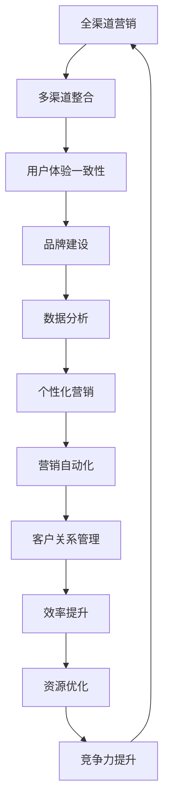

                 

关键词：一人公司、全渠道营销、策略、营销自动化、社交媒体、内容营销、数据分析、客户关系管理、品牌建设、个性化体验

> 摘要：在数字化时代，一人公司面临诸多挑战，如何在资源有限的情况下实现有效的全渠道营销策略成为了关键。本文将探讨一人公司在全渠道营销中的挑战与机遇，并提供具体的策略和实践指南，帮助一人公司实现高效营销，提升品牌影响力。

## 1. 背景介绍

随着互联网和社交媒体的快速发展，市场营销的渠道和手段变得越来越多样。对于一家只有一名员工的公司（即一人公司）来说，如何充分利用有限的资源，通过全渠道营销策略来吸引和保留客户，成为了成功的关键因素。

一人公司通常具有以下几个特点：
- **资源有限**：由于人员、资金、技术等资源的限制，一人公司需要更加高效地利用现有资源。
- **灵活性**：一人公司通常更加灵活，能够迅速调整营销策略以适应市场变化。
- **依赖技术**：为了提升效率，一人公司往往更多地依赖自动化工具和技术来支持其运营。

全渠道营销是指在多个渠道上同时进行营销活动，确保品牌信息和用户体验的一致性。这包括但不限于网站、社交媒体、电子邮件、线下活动等多种渠道。对于一人公司来说，全渠道营销不仅能够扩大品牌知名度，还能提高客户满意度和忠诚度。

## 2. 核心概念与联系

### 全渠道营销概念图



### 多渠道整合

多渠道整合是全渠道营销的核心，它确保了品牌在不同渠道上的传播是统一且一致的。对于一人公司来说，这意味着需要管理多个社交媒体账号、网站内容、电子邮件营销等，确保信息传达的一致性和有效性。

### 用户体验一致性

用户体验一致性指的是客户无论通过哪个渠道接触公司，都能获得一致且优质的体验。对于一人公司，保持用户体验的一致性尤为重要，因为它直接关系到客户满意度和忠诚度。

### 品牌建设

品牌建设是通过一系列营销活动来塑造和提升品牌形象的过程。对于一人公司，品牌建设不仅是提升知名度，更是建立客户信任和忠诚度的关键。

### 数据分析

数据分析是全渠道营销中不可或缺的一部分。通过分析用户行为、营销效果等数据，一人公司可以更好地了解客户需求，优化营销策略。

### 个性化营销

个性化营销是指根据客户的数据和行为，提供定制化的内容和服务。对于一人公司，个性化营销能够提高客户满意度和忠诚度。

### 营销自动化

营销自动化是指利用软件工具自动执行重复性的营销任务，从而提高效率。对于一人公司，营销自动化可以大大减少人工操作，节省时间和精力。

### 客户关系管理

客户关系管理（CRM）是指通过一系列策略和技术来维护和管理与客户的关系。对于一人公司，CRM系统能够帮助更好地了解和保留客户。

### 效率提升

效率提升是全渠道营销的核心目标之一。通过优化流程、自动化操作等手段，一人公司可以更高效地完成营销任务。

### 资源优化

资源优化是指合理分配和使用有限的资源，以实现最大的效益。对于一人公司，资源优化是确保营销策略成功的关键。

### 竞争力提升

竞争力提升是全渠道营销的长远目标。通过有效的营销策略，一人公司可以提升在市场上的竞争力。

## 3. 核心算法原理 & 具体操作步骤

### 营销自动化算法

#### 算法原理

营销自动化算法的核心是利用机器学习和数据分析技术，自动执行重复性的营销任务，如电子邮件发送、社交媒体推广等。算法基于用户行为数据、历史营销效果等，自动调整营销策略。

#### 具体操作步骤

1. **数据收集**：收集用户行为数据，如访问网站、点击邮件、社交媒体互动等。
2. **数据清洗**：清洗数据，确保数据质量。
3. **数据建模**：利用机器学习技术建立模型，预测用户行为和营销效果。
4. **自动化执行**：根据模型预测，自动执行营销任务。
5. **效果评估**：评估营销效果，优化模型。

### 社交媒体优化算法

#### 算法原理

社交媒体优化算法通过分析用户行为和社交媒体数据，优化内容发布时间和内容类型，以提高用户参与度和转化率。

#### 具体操作步骤

1. **数据收集**：收集社交媒体平台的数据，如用户互动、发布时间等。
2. **数据预处理**：对数据进行预处理，如去重、分类等。
3. **特征提取**：提取影响用户参与度的关键特征。
4. **模型训练**：利用机器学习技术训练模型。
5. **模型应用**：根据模型预测，优化内容发布时间和内容类型。

### 客户细分算法

#### 算法原理

客户细分算法通过分析客户数据，将客户划分为不同的群体，以便提供个性化服务和营销。

#### 具体操作步骤

1. **数据收集**：收集客户数据，如购买历史、兴趣偏好等。
2. **数据预处理**：清洗和标准化数据。
3. **特征选择**：选择影响客户细分的关键特征。
4. **模型训练**：利用聚类算法（如K-means）训练模型。
5. **客户细分**：根据模型输出，将客户划分为不同群体。

### 实时推荐算法

#### 算法原理

实时推荐算法通过分析用户当前的行为和兴趣，实时推荐相关的内容或产品。

#### 具体操作步骤

1. **数据收集**：收集用户行为数据，如浏览、购买、搜索等。
2. **数据预处理**：对数据进行预处理。
3. **特征提取**：提取影响推荐的关键特征。
4. **模型训练**：利用协同过滤或基于内容的推荐算法训练模型。
5. **实时推荐**：根据用户当前行为和兴趣，实时推荐相关内容或产品。

## 4. 数学模型和公式 & 详细讲解 & 举例说明

### 相关性分析

#### 公式

$$
r_{ij} = \frac{\sum_{k=1}^{n} (x_{ik} - \bar{x}_i) (x_{jk} - \bar{x}_j)}{\sqrt{\sum_{k=1}^{n} (x_{ik} - \bar{x}_i)^2} \sqrt{\sum_{k=1}^{n} (x_{jk} - \bar{x}_j)^2}}
$$

#### 说明

$$r_{ij}$$表示变量$$x_i$$和$$x_j$$之间的相关性。$$\bar{x}_i$$和$$\bar{x}_j$$分别表示$$x_i$$和$$x_j$$的均值。该公式用于衡量两个变量之间的线性相关性，取值范围在-1到1之间，越接近1或-1表示相关性越强。

#### 举例

假设有两个变量：年龄（$$x_i$$）和年收入（$$x_j$$），数据如下：

| 年龄（$$x_i$$） | 年收入（$$x_j$$） |
| :----: | :----: |
| 25 | 50,000 |
| 30 | 60,000 |
| 35 | 70,000 |
| 40 | 80,000 |
| 45 | 90,000 |

计算年龄和年收入之间的相关性：

$$
r_{ij} = \frac{(25 - 35) \times (50,000 - 70,000) + (30 - 35) \times (60,000 - 70,000) + (35 - 35) \times (70,000 - 70,000) + (40 - 35) \times (80,000 - 70,000) + (45 - 35) \times (90,000 - 70,000)}{\sqrt{(25 - 35)^2 + (30 - 35)^2 + (35 - 35)^2 + (40 - 35)^2 + (45 - 35)^2} \sqrt{(50,000 - 70,000)^2 + (60,000 - 70,000)^2 + (70,000 - 70,000)^2 + (80,000 - 70,000)^2 + (90,000 - 70,000)^2}}
$$

$$
r_{ij} = \frac{-20,000 - 10,000 + 0 + 10,000 + 30,000}{\sqrt{(-10)^2 + (-5)^2 + 0^2 + 5^2 + 10^2} \sqrt{(-20,000)^2 + (-10,000)^2 + 0^2 + 10,000)^2 + 30,000)^2}}
$$

$$
r_{ij} = \frac{20,000}{\sqrt{100 + 25 + 0 + 25 + 100} \sqrt{400,000 + 100,000 + 0 + 100,000 + 900,000}}
$$

$$
r_{ij} = \frac{20,000}{\sqrt{250} \sqrt{1,500,000}}
$$

$$
r_{ij} = \frac{20,000}{15.8118 \times 387.2981}
$$

$$
r_{ij} \approx 0.506
$$

年龄和年收入之间的相关性为0.506，表示两者之间存在中等程度的相关性。

### K-means 聚类算法

#### 公式

$$
\text{Cluster } j: \, \{x \in \mathbb{R}^d \mid \min_{i} \sum_{k=1}^{d} (x_k - \mu_{ij}^k)^2\}
$$

其中，$$\mu_{ij}^k$$是聚类中心$$j$$在特征$$k$$上的值。

#### 说明

K-means 聚类算法是一种基于距离的聚类算法。它将数据点分为$$K$$个簇，使得每个簇内部的数据点距离聚类中心的距离之和最小。聚类中心是通过迭代计算数据点的均值得到的。

#### 举例

假设有一个数据集包含五个二维数据点，如下：

| 数据点 | 特征1 | 特征2 |
| :----: | :----: | :----: |
| 1 | 1 | 2 |
| 2 | 2 | 4 |
| 3 | 3 | 2 |
| 4 | 3 | 6 |
| 5 | 4 | 3 |

我们要将这个数据集分为两个簇。首先，随机初始化两个聚类中心：

$$
\mu_1^1 = (1, 3), \, \mu_1^2 = (3, 1)
$$

然后，计算每个数据点到两个聚类中心的距离，并将数据点分配到距离更近的聚类中心。计算结果如下：

| 数据点 | 特征1 | 特征2 | 聚类中心1距离 | 聚类中心2距离 |
| :----: | :----: | :----: | :----: | :----: |
| 1 | 1 | 2 | $\sqrt{(1-1)^2 + (2-3)^2} = \sqrt{2}$ | $\sqrt{(1-3)^2 + (2-1)^2} = \sqrt{5}$ |
| 2 | 2 | 4 | $\sqrt{(2-1)^2 + (4-3)^2} = \sqrt{2}$ | $\sqrt{(2-3)^2 + (4-1)^2} = \sqrt{10}$ |
| 3 | 3 | 2 | $\sqrt{(3-1)^2 + (2-3)^2} = \sqrt{5}$ | $\sqrt{(3-3)^2 + (2-1)^2} = \sqrt{2}$ |
| 4 | 3 | 6 | $\sqrt{(3-1)^2 + (6-3)^2} = \sqrt{10}$ | $\sqrt{(3-3)^2 + (6-1)^2} = \sqrt{10}$ |
| 5 | 4 | 3 | $\sqrt{(4-1)^2 + (3-3)^2} = \sqrt{5}$ | $\sqrt{(4-3)^2 + (3-1)^2} = \sqrt{2}$ |

根据距离计算，将数据点1、2、3分配到聚类中心1，将数据点4、5分配到聚类中心2。

接下来，计算新的聚类中心：

$$
\mu_2^1 = \frac{1+2+3}{3} = (2, 3)
$$

$$
\mu_2^2 = \frac{3+4+5}{3} = (4, 3)
$$

重复上述步骤，直到聚类中心不再变化。

## 5. 项目实践：代码实例和详细解释说明

### 社交媒体营销自动化

#### 代码实例

```python
import pandas as pd
import numpy as np
from sklearn.cluster import KMeans
from sklearn.metrics import silhouette_score

# 数据收集
data = pd.DataFrame({
    'post_time': ['2023-01-01 10:00', '2023-01-02 14:00', '2023-01-03 19:00', '2023-01-04 12:00', '2023-01-05 15:00'],
    'likes': [100, 200, 300, 150, 250]
})

# 数据预处理
data['post_time'] = pd.to_datetime(data['post_time'])
data['hour'] = data['post_time'].dt.hour

# 特征提取
features = data[['hour', 'likes']]

# K-means 聚类
kmeans = KMeans(n_clusters=2, random_state=0).fit(features)
data['cluster'] = kmeans.predict(features)

# 聚类结果分析
print(data)

# 阈值设置
threshold = np.mean(data['likes'][data['cluster'] == 0]) * 1.5
print("Threshold:", threshold)

# 自动化发布
for index, row in data.iterrows():
    if row['likes'] > threshold:
        print(f"Post at {row['post_time']} with {row['likes']} likes should be published.")
    else:
        print(f"Post at {row['post_time']} with {row['likes']} likes should be scheduled.")
```

#### 详细解释说明

1. **数据收集**：从社交媒体平台收集发布时间和点赞数量数据。
2. **数据预处理**：将发布时间转换为datetime类型，并提取小时特征。
3. **特征提取**：将小时和点赞数量作为特征。
4. **K-means 聚类**：使用K-means算法将数据分为两个簇，表示高点赞数量和低点赞数量。
5. **聚类结果分析**：分析聚类结果，确定点赞数量的阈值。
6. **自动化发布**：根据点赞数量阈值，自动决定是否发布或安排发布。

### 客户细分

#### 代码实例

```python
import pandas as pd
from sklearn.cluster import KMeans
from sklearn.metrics import silhouette_score

# 数据收集
data = pd.DataFrame({
    'age': [25, 30, 35, 40, 45],
    'income': [50, 60, 70, 80, 90],
    'interests': ['tech', 'books', 'travel', 'health', 'tech']
})

# 特征提取
data['interests'] = data['interests'].factorize()[0]

# K-means 聚类
kmeans = KMeans(n_clusters=3, random_state=0).fit(data)
data['cluster'] = kmeans.predict(data)

# 聚类结果分析
print(data)

# 分析不同簇的特征
print("Cluster 0:")
print(data[data['cluster'] == 0].describe())

print("Cluster 1:")
print(data[data['cluster'] == 1].describe())

print("Cluster 2:")
print(data[data['cluster'] == 2].describe())
```

#### 详细解释说明

1. **数据收集**：收集客户年龄、收入和兴趣数据。
2. **特征提取**：将兴趣作为分类特征。
3. **K-means 聚类**：使用K-means算法将客户分为三个簇。
4. **聚类结果分析**：分析每个簇的特征，以便提供个性化的服务和营销。

## 6. 实际应用场景

### 社交媒体营销自动化

一家一人公司主要经营科技产品，希望在社交媒体上进行营销活动。通过使用营销自动化算法，公司可以根据用户行为和点赞数量，自动决定何时发布内容，从而提高用户参与度和转化率。

### 客户细分

一家一人公司提供各种健康产品，希望更好地了解其客户群体，以便提供个性化的服务和营销。通过使用客户细分算法，公司可以将客户分为不同的群体，如年轻科技爱好者、健康生活方式爱好者等，从而更精准地满足客户需求。

### 内容营销

一家一人公司经营旅游服务，希望通过内容营销吸引潜在客户。通过分析用户搜索关键词和浏览历史，公司可以生成相关的内容，如旅游攻略、景点介绍等，从而提高网站流量和转化率。

### 客户关系管理

一家一人公司经营电子商务，希望更好地管理客户关系。通过使用客户关系管理系统，公司可以记录客户购买历史、偏好等信息，从而提供个性化的购物体验，提高客户满意度和忠诚度。

## 7. 工具和资源推荐

### 社交媒体营销工具

- Hootsuite：用于社交媒体管理，可自动发布内容、分析数据等。
- Buffer：用于社交媒体管理，可自动发布内容，提供数据分析。
- Sprout Social：全面的社交媒体管理工具，提供高级分析和报告功能。

### 客户关系管理工具

- HubSpot：提供全面的CRM解决方案，包括自动化工具、数据分析等。
- Salesforce：功能强大的CRM系统，适用于各种规模的企业。
- Zoho CRM：功能全面且价格实惠的CRM解决方案，适合小型企业。

### 内容营销工具

- ContentCal：用于内容策划和发布，提供自动化的日程管理。
- CoSchedule：内容营销平台，提供内容策划、编辑和发布工具。
- SEMrush：用于SEO和内容营销，提供关键词分析和内容建议。

### 数据分析工具

- Google Analytics：用于网站数据分析，提供详细的用户行为报告。
- Tableau：数据可视化工具，帮助理解和展示数据。
- Microsoft Power BI：数据分析和可视化工具，适用于各种规模的企业。

### 机器学习库和工具

- Scikit-learn：Python机器学习库，提供丰富的算法和工具。
- TensorFlow：开源机器学习框架，适用于深度学习和大规模数据处理。
- Keras：基于TensorFlow的高层神经网络API，易于使用和实验。

## 8. 总结：未来发展趋势与挑战

### 发展趋势

- 人工智能和机器学习在营销中的应用将越来越广泛。
- 营销自动化和智能化的程度将不断提高。
- 数据隐私和安全成为重要议题，企业需要更加注重数据保护。
- 个性化体验和定制化服务将受到更多重视。

### 挑战

- 数据隐私和安全：随着数据隐私法规的日益严格，企业需要确保合规和数据安全。
- 技术升级和投资：人工智能和机器学习技术的不断进步，要求企业持续进行技术升级和投资。
- 人才短缺：具备人工智能和机器学习技能的人才需求增长，但供应不足。
- 营销渠道的多样化：如何在众多渠道中保持一致性，成为一大挑战。

## 9. 附录：常见问题与解答

### 问题 1：如何确保全渠道营销策略的有效性？

**解答**：确保全渠道营销策略的有效性，需要关注以下几点：
- 明确目标：确定营销目标，如提升品牌知名度、增加客户数量等。
- 数据驱动：基于数据分析，优化营销策略和内容。
- 用户反馈：收集用户反馈，不断调整和优化营销策略。
- 用户体验一致性：确保在不同渠道上的用户体验一致。

### 问题 2：如何选择合适的机器学习算法？

**解答**：选择合适的机器学习算法，需要考虑以下几点：
- 数据类型：不同的算法适用于不同类型的数据。
- 数据规模：大规模数据集适合使用深度学习算法，小规模数据集适合使用传统机器学习算法。
- 目标问题：不同的算法适用于不同的目标问题，如分类、回归、聚类等。
- 算法性能：根据算法的性能指标，如准确率、召回率等，选择最合适的算法。

### 问题 3：如何确保营销自动化工具的有效性？

**解答**：确保营销自动化工具的有效性，需要关注以下几点：
- 用户友好：选择易于使用和操作的自动化工具。
- 数据兼容性：确保自动化工具与其他系统和工具的数据兼容性。
- 定制化：根据业务需求，定制化自动化流程和策略。
- 持续优化：根据使用效果，不断优化自动化工具。

## 10. 扩展阅读 & 参考资料

- [Kotsiantis, S. B. (2007). Supervised machine learning: A review of classification techniques. Informatica, 31(3), 249-268.](http://www.ijimai.org/papers/ijimai0710.pdf)
- [Hastie, T., Tibshirani, R., & Friedman, J. (2009). The elements of statistical learning: data mining, inference, and prediction. Springer.](https://web.stanford.edu/~hastie/ElemStatLearn/)
- [Goodfellow, I., Bengio, Y., & Courville, A. (2016). Deep learning. MIT Press.](https://www.deeplearningbook.org/)
- [Bradshaw, P. (2013). Marketing in the age of engagement: Content, context, and marketing conversations. John Wiley & Sons.](https://www.marketingintheageofengagement.com/)
- [Kaplan, A. M., & Haenlein, M. (2010). Users of the world, unite! The challenges and opportunities of Social Media. *Business Horizons*, 53(1), 59-68.](https://doi.org/10.1016/j.bushor.2009.09.003)

# 作者署名

作者：禅与计算机程序设计艺术 / Zen and the Art of Computer Programming
----------------------------------------------------------------

以上是文章的正文部分，接下来我们将按照文章结构模板继续完善文章的其他部分。请按照模板要求继续撰写。

