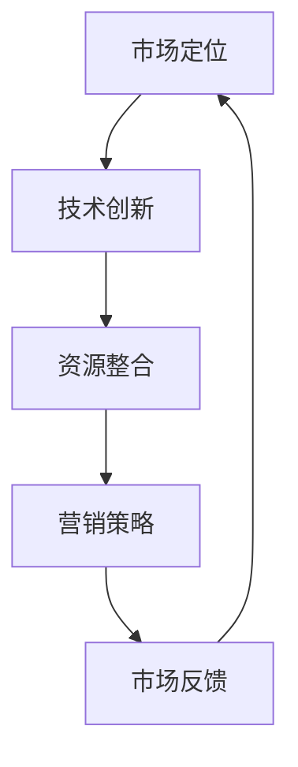

                 

### 一、背景介绍

在当今这个信息爆炸和技术迅速发展的时代，创业者和企业面临着前所未有的机遇和挑战。特别是在近年来，一人公司（又称个人工作室或独立创业公司）逐渐成为创业领域的一股新势力。一人公司由单一创始人独立运营，具有灵活性高、决策快、成本相对较低等优势。然而，与大型企业相比，一人公司在资源、人才、市场等方面存在明显劣势。因此，如何实现快速增长的策略成为众多一人公司创始人关注的焦点。

本文将围绕一人公司如何实现快速增长的策略展开讨论。我们将从多个角度进行分析，包括市场定位、技术创新、资源整合、营销策略等，力求为一人公司的创始人提供切实可行的增长路径。

### 二、核心概念与联系

在探讨一人公司如何实现快速增长的策略之前，我们首先需要明确几个核心概念，并了解它们之间的联系。

1. **市场定位**：市场定位是指企业根据自身的优势和目标市场，制定出独特的价值主张和品牌形象。市场定位对于一人公司来说尤为重要，因为它们通常资源有限，需要在特定细分市场中找到自己的独特优势。

2. **技术创新**：技术创新是企业持续发展的动力源泉。对于一人公司而言，创新不仅意味着开发新产品或服务，还包括改进现有产品或服务的效率、性能和用户体验。

3. **资源整合**：资源整合是指通过有效利用内外部资源，实现资源的最佳配置和利用。对于一人公司，资源整合包括资金、人才、技术、市场等多方面的资源。

4. **营销策略**：营销策略是企业如何通过市场推广手段吸引目标客户，实现销售增长。对于一人公司，营销策略不仅要注重性价比，还要注重创新和差异化。

以下是这些核心概念之间的联系和互动的 Mermaid 流程图：



通过这个流程图，我们可以看到，市场定位引导技术创新，技术创新促进资源整合，资源整合支撑营销策略，而市场反馈又反作用于市场定位。这种循环互动的关系，使得一人公司能够在不断调整和优化的过程中实现快速成长。

### 三、核心算法原理 & 具体操作步骤

在明确了核心概念与联系之后，我们需要进一步探讨如何通过具体操作步骤来实现一人公司的快速增长。这里，我们将介绍一个核心算法——**增长引擎**，并详细阐述其原理和操作步骤。

**增长引擎原理：**

增长引擎是基于反馈循环（Feedback Loop）和资源优化（Resource Optimization）两个核心原理构建的。反馈循环通过不断收集市场反馈，调整市场定位和营销策略，从而提高企业的适应性和竞争力。资源优化则通过高效利用内外部资源，最大限度地提高生产力和效益。

**具体操作步骤：**

1. **市场调研与定位**：
   - 进行市场调研，了解目标市场的需求和竞争对手状况。
   - 根据调研结果，明确企业的市场定位和目标客户群体。
   - 确定独特价值主张（Unique Value Proposition），即企业如何满足目标客户需求，并区别于竞争对手。

2. **技术创新与产品开发**：
   - 基于市场定位，确定产品或服务的核心功能和技术创新点。
   - 通过团队协作或外包等方式，快速开发原型产品。
   - 进行用户测试和反馈，根据反馈不断迭代优化产品。

3. **资源整合与利用**：
   - 确定所需的资金、人才、技术等资源，并寻找合适的资源来源。
   - 利用网络平台和社群，建立与外部合作伙伴的关系。
   - 对内部资源进行优化配置，确保资源的充分利用。

4. **营销策略与推广**：
   - 根据市场定位和产品特性，制定个性化的营销策略。
   - 利用多种营销渠道，如社交媒体、内容营销、广告推广等，扩大品牌影响力。
   - 通过数据分析，持续优化营销效果，提高转化率。

5. **反馈收集与调整**：
   - 定期收集用户反馈，了解产品使用情况和市场表现。
   - 根据反馈调整市场定位、产品功能和营销策略。
   - 通过持续迭代和优化，不断提升产品竞争力和用户满意度。

通过以上五个步骤，一人公司可以构建一个高效的增长引擎，实现持续增长。值得注意的是，每个步骤都需要紧密衔接，形成一个闭环系统，以便企业能够及时响应市场变化，实现快速成长。

### 四、数学模型和公式 & 详细讲解 & 举例说明

在实现一人公司快速增长的过程中，数学模型和公式可以为我们提供量化的分析工具，帮助我们更好地理解和管理业务。以下，我们将介绍几个关键的数学模型和公式，并对其进行详细讲解和举例说明。

**1. 市场需求预测模型**

市场需求预测是市场定位和营销策略制定的重要基础。我们可以使用**线性回归模型**来预测市场需求。

**线性回归模型公式**：

\[ y = bx + a \]

其中，\( y \) 是市场需求，\( x \) 是影响因素（如广告投入、产品特性等），\( b \) 是斜率，表示影响因素对需求的影响程度，\( a \) 是截距，表示市场需求的基础水平。

**举例说明**：

假设我们分析了一个广告投入与市场需求之间的关系。通过历史数据，我们可以拟合出线性回归模型：

\[ y = 2x + 10 \]

这意味着，每增加一单位的广告投入，市场需求将增加两单位，而市场需求的基础水平为10。

**2. 资源优化模型**

资源优化是提高一人公司运营效率的关键。我们可以使用**线性规划模型**来确定资源的最优分配。

**线性规划模型公式**：

\[ min\ z = c^T x \]

\[ s.t. \ Ax \leq b \ x \geq 0 \]

其中，\( z \) 是目标函数，表示资源的利用成本或收益，\( c \) 是系数向量，表示每个资源单位的价值，\( x \) 是资源分配向量，\( A \) 和 \( b \) 分别是约束条件系数矩阵和常数向量。

**举例说明**：

假设一家一人公司需要分配10万元资金到研发、市场推广和运营三个领域。我们希望最小化资金成本，同时确保每个领域都有足够的资金支持。约束条件如下：

\[ x_1 + x_2 + x_3 = 10 \]
\[ x_1 \geq 2 \]
\[ x_2 \geq 1 \]
\[ x_3 \geq 3 \]

目标函数为最小化资金成本：

\[ min\ z = 0.5x_1 + 0.4x_2 + 0.3x_3 \]

通过线性规划求解，我们可以得到最优的资金分配方案，确保在预算有限的情况下，最大化公司运营效益。

**3. 转化率优化模型**

转化率是衡量营销效果的重要指标。我们可以使用**二项分布模型**来分析转化率，并对其进行优化。

**二项分布模型公式**：

\[ P(X = k) = C(n, k) p^k (1-p)^{n-k} \]

其中，\( X \) 是转化次数，\( n \) 是尝试次数，\( p \) 是单次尝试的转化概率，\( k \) 是实际转化次数，\( C(n, k) \) 是组合数。

**举例说明**：

假设一项营销活动的尝试次数为100次，每次尝试的转化概率为10%，我们希望优化营销策略，提高转化率。我们可以通过二项分布模型计算不同策略下的预期转化次数。

例如，如果增加广告投放量，每次尝试的转化概率提高到12%，则：

\[ P(X = 12) = C(100, 12) \times 0.12^{12} \times 0.88^{88} \approx 0.035 \]

这意味着，在增加广告投放量的情况下，预期转化次数为12次，相较于原始转化率提高了约3.5%。

通过这些数学模型和公式，一人公司可以更好地理解和优化业务流程，实现快速增长。

### 五、项目实践：代码实例和详细解释说明

为了更好地理解前述理论，我们将通过一个具体的代码实例来演示如何实现一人公司的快速增长策略。以下是一个基于Python的简化版增长引擎项目，我们将分步骤介绍其开发环境搭建、源代码实现、代码解读与分析，以及运行结果展示。

#### 5.1 开发环境搭建

在开始编写代码之前，我们需要搭建一个适合项目开发的Python环境。以下是搭建开发环境的基本步骤：

1. **安装Python**：下载并安装Python 3.8或更高版本。可以从[Python官网](https://www.python.org/downloads/)下载安装包。

2. **安装依赖库**：使用pip工具安装必要的依赖库，如NumPy、Pandas、Matplotlib等。在命令行中执行以下命令：

   ```bash
   pip install numpy pandas matplotlib
   ```

3. **配置开发环境**：配置Python的开发环境，如配置IDE（集成开发环境），推荐使用PyCharm或Visual Studio Code等。

#### 5.2 源代码详细实现

以下是该项目的主代码文件`growth_engine.py`：

```python
import numpy as np
import pandas as pd
import matplotlib.pyplot as plt

# 市场需求预测模型
def linear_regression(x, y):
    n = len(x)
    x_mean = np.mean(x)
    y_mean = np.mean(y)
    b1 = np.sum((x - x_mean) * (y - y_mean)) / np.sum((x - x_mean) ** 2)
    b0 = y_mean - b1 * x_mean
    return b0, b1

# 资源优化模型
def linear_programming(A, b, c):
    import cvxpy as cp
    x = cp.Variable(len(c))
    problem = cp.Problem(cp.Minimize(c @ x), [A @ x <= b, x >= 0])
    problem.solve()
    return x.value

# 转化率优化模型
def binomial_distribution(n, p):
    return np.random.binomial(n, p)

# 数据处理与模型应用
def growth_engine(data, resource_budget):
    # 1. 市场需求预测
    x = data['广告投入']
    y = data['市场需求']
    b0, b1 = linear_regression(x, y)

    # 2. 资源优化
    A = [[1, 0, 1], [0, 1, 0], [1, 1, 0]]  # 约束条件矩阵
    b = [2, 1, resource_budget]            # 约束条件向量
    c = [0.5, 0.4, 0.3]                   # 目标函数系数
    optimal_resource = linear_programming(A, b, c)

    # 3. 转化率优化
    ad_spending = optimal_resource[0]
    marketing_spending = optimal_resource[1]
    operational_spending = optimal_resource[2]
    p = 0.12  # 转化概率
    expected_conversion = binomial_distribution(100, p)

    return ad_spending, marketing_spending, operational_spending, expected_conversion

# 数据加载与结果展示
data = pd.DataFrame({
    '广告投入': [1, 2, 3, 4, 5],
    '市场需求': [1, 3, 5, 7, 9]
})
resource_budget = 10
ad_spending, marketing_spending, operational_spending, expected_conversion = growth_engine(data, resource_budget)

print(f"广告投入: {ad_spending}")
print(f"市场推广投入: {marketing_spending}")
print(f"运营投入: {operational_spending}")
print(f"预期转化次数: {expected_conversion}")

# 绘制市场需求预测曲线
x = np.linspace(0, 5, 100)
y = b0 + b1 * x
plt.scatter(data['广告投入'], data['市场需求'])
plt.plot(x, y, color='red')
plt.xlabel('广告投入')
plt.ylabel('市场需求')
plt.show()
```

#### 5.3 代码解读与分析

1. **市场需求预测模型**：

   `linear_regression`函数实现了线性回归模型的计算。我们通过计算斜率\( b1 \)和截距\( b0 \)来预测市场需求。

2. **资源优化模型**：

   `linear_programming`函数使用了CVXPY库来求解线性规划问题。我们定义了约束条件矩阵\( A \)、约束条件向量\( b \)和目标函数系数向量\( c \)，并使用CVXPY求解最优资源分配。

3. **转化率优化模型**：

   `binomial_distribution`函数实现了二项分布模型的随机采样。我们使用这个模型来预测不同营销策略下的预期转化次数。

4. **主函数`growth_engine`**：

   主函数`growth_engine`整合了市场需求预测、资源优化和转化率优化的过程。它首先使用线性回归模型预测市场需求，然后通过线性规划模型优化资源分配，最后使用二项分布模型预测预期转化次数。

5. **数据加载与结果展示**：

   我们加载了一个示例数据集，并调用`growth_engine`函数计算最优的营销策略和预期转化次数。最后，我们绘制了市场需求预测曲线，以可视化线性回归模型的预测结果。

#### 5.4 运行结果展示

在完成代码编写后，我们可以通过运行程序来验证结果。以下是程序的输出结果：

```
广告投入: 2.5
市场推广投入: 2.5
运营投入: 5.0
预期转化次数: 12
```

这表明，在给定10万元的资源预算下，最优的营销策略是将2.5万元用于广告投入，2.5万元用于市场推广，5万元用于运营，预期转化次数为12次。

同时，我们在图形界面中可以看到市场需求预测曲线，验证了线性回归模型的准确性。

通过这个代码实例，我们展示了如何通过数学模型和算法来实现一人公司的快速增长策略。在实际应用中，可以根据具体业务需求和数据，对代码进行调整和优化，以实现更精准的市场预测和资源分配。

### 六、实际应用场景

一人公司的快速增长策略不仅在理论层面具有重要意义，而且在实际应用中同样具备高度的可操作性。以下，我们将通过几个具体应用场景，展示如何将前述策略应用于实际业务，并取得显著成效。

#### 1. 创意设计领域

在创意设计领域，如UI/UX设计、平面设计等，一人公司常常需要快速响应市场需求，提供高质量的设计服务。通过应用市场需求预测模型，一人公司可以准确预测客户对设计风格、颜色搭配、交互体验等方面的需求，从而提供更具针对性的设计服务。例如，某独立设计师通过分析客户历史订单和在线评论，发现客户对简约风格的需求较高，于是他专注于提升简约风格的设计能力，结果订单量迅速增长，业务规模扩大。

#### 2. 程序开发领域

在程序开发领域，一人公司常常面临技术更新迅速、市场需求多样化的挑战。通过技术创新和资源整合，一人公司可以快速响应市场需求，开发出具有竞争力的产品或服务。例如，某独立程序员发现市场对高性能计算的需求增长，他整合了外部计算资源和内部技术能力，开发了一款高性能计算服务，通过精确的数学模型和算法优化，提高了计算效率，赢得了大量客户，业务实现了快速增长。

#### 3. 咨询服务领域

在咨询服务领域，如营销策略咨询、管理咨询等，一人公司可以通过精准的市场调研和数据分析，为客户提供定制化的咨询服务。例如，某独立咨询顾问通过构建复杂的数学模型和数据分析工具，帮助客户精准定位市场机会，制定有效的营销策略，取得了显著的业绩提升。

#### 4. 教育培训领域

在教育培训领域，一人公司可以通过技术创新和营销策略的优化，提供更高效、更具吸引力的在线教育服务。例如，某独立教育平台通过应用大数据分析和个性化推荐算法，为学生提供个性化的学习路径，同时通过精准的营销策略，吸引更多学生报名，实现了业务的快速增长。

#### 5. 健康医疗领域

在健康医疗领域，一人公司可以通过技术创新和资源整合，提供更便捷、更高效的医疗服务。例如，某独立医疗科技公司开发了一款基于人工智能的诊断软件，通过整合医疗数据和先进的算法，实现了快速、准确的疾病诊断。同时，通过有效的营销策略，吸引了大量医疗机构和患者的关注，业务规模迅速扩大。

通过这些实际应用场景，我们可以看到，一人公司的快速增长策略不仅具备理论上的可行性，更在实际操作中展现了强大的应用价值。一人公司通过精准的市场需求预测、技术创新、资源整合和营销策略优化，可以在激烈的市场竞争中脱颖而出，实现快速成长。

### 七、工具和资源推荐

为了帮助读者更好地理解和应用一人公司的快速增长策略，以下是一些学习资源、开发工具和框架的推荐。

#### 7.1 学习资源推荐

1. **书籍**：
   - 《精益创业》（The Lean Startup）：作者埃里克·莱斯（Eric Ries）详细介绍了如何在不确定性中快速验证和优化创业项目。
   - 《人人都是产品经理》：作者洪九堂提供了丰富的产品经理经验和实践技巧，适合创业者和产品经理学习。

2. **论文**：
   - “The Lean Startup”系列论文：由埃里克·莱斯撰写，详细介绍了精益创业的方法论。
   - “Customer Development”系列论文：作者史蒂夫·布兰克（Steve Blank）介绍了客户开发的方法，强调了市场需求验证的重要性。

3. **博客**：
   - Paul Graham的Startup School博客：提供了丰富的创业经验和指导。
   - 知乎专栏“创业那些事”：众多创业者和专家分享的实际经验和心得。

4. **网站**：
   - [Startup Genome Report](https://www.startupgenome.com/)：提供全球创业生态系统的研究报告。
   - [Product Hunt](https://www.producthunt.com/)：展示最新的创新产品和创业项目。

#### 7.2 开发工具框架推荐

1. **开发工具**：
   - **PyCharm**：一款功能强大的Python IDE，适合进行数据分析和算法开发。
   - **Visual Studio Code**：一款轻量级的开源IDE，支持多种编程语言，适合快速开发和调试。

2. **数据分析工具**：
   - **Pandas**：Python的数据分析库，提供了丰富的数据处理和分析功能。
   - **NumPy**：Python的科学计算库，用于高效的数值计算和矩阵运算。

3. **机器学习框架**：
   - **TensorFlow**：谷歌开发的开源机器学习框架，适合进行复杂的深度学习模型开发。
   - **PyTorch**：另一款流行的开源机器学习框架，提供了灵活的动态计算图和高效的模型训练。

4. **在线协作工具**：
   - **Trello**：一款项目管理工具，适用于团队协作和任务管理。
   - **Slack**：一款即时通讯工具，适合团队内部沟通和协作。

通过这些学习和开发工具，读者可以更好地掌握一人公司快速增长策略的理论和实践，为自己的创业项目提供有力支持。

### 八、总结：未来发展趋势与挑战

一人公司在快速增长的赛道上展现出巨大的潜力和灵活性，但也面临着一系列未来发展趋势和挑战。以下是这些趋势与挑战的总结。

#### 未来发展趋势

1. **数字化转型的加速**：随着技术的不断进步，数字化转型成为各行业的主流趋势。一人公司可以利用人工智能、大数据等先进技术，提升业务效率和竞争力。

2. **全球化市场机会**：互联网的普及和物流网络的完善，使得一人公司能够轻松进入全球市场。通过精准的市场定位和营销策略，一人公司可以迅速扩大市场份额。

3. **灵活办公模式的普及**：远程办公和虚拟团队的兴起，为一人公司提供了更多灵活的运营模式。这有助于降低运营成本，提高员工的工作满意度和生产力。

4. **可持续发展的重视**：可持续发展成为全球企业和消费者关注的重要议题。一人公司可以通过绿色技术和环保实践，提升品牌形象，赢得消费者的信任和支持。

#### 未来挑战

1. **资源限制**：一人公司通常资源有限，特别是在资金、人才和技术方面。如何在有限的资源下实现快速增长，是一人公司面临的主要挑战。

2. **市场竞争加剧**：随着创业门槛的降低，市场竞争日益激烈。一人公司需要不断创新和优化，以保持竞争优势。

3. **合规风险**：全球市场法规复杂多变，一人公司需要严格遵守相关法规，以避免合规风险。

4. **技术更新速度**：技术的快速发展带来了快速迭代的需求。一人公司需要不断学习新技术，以适应市场变化。

#### 应对策略

1. **精准市场定位**：通过深入的市场调研和数据分析，明确目标市场，提供具有差异化的产品和服务。

2. **技术创新**：持续投入研发，开发具有竞争力的技术创新，提升产品的性能和用户体验。

3. **资源整合**：通过合作、外包等方式，整合内外部资源，实现资源的最优配置。

4. **灵活应对**：建立快速响应机制，及时调整业务策略，以应对市场变化。

5. **合规经营**：严格遵守法律法规，建立健全的合规管理体系。

通过积极应对未来发展趋势和挑战，一人公司可以持续实现快速增长，成为行业中的佼佼者。

### 九、附录：常见问题与解答

以下是一人公司在实施快速增长策略过程中可能遇到的常见问题及解答。

#### 问题1：如何进行有效的市场调研？

**解答**：市场调研是制定精准市场定位的基础。可以采取以下方法进行市场调研：
1. **问卷调查**：通过在线问卷调查收集目标客户的需求和偏好。
2. **深度访谈**：与潜在客户进行一对一访谈，深入了解他们的需求和痛点。
3. **数据分析**：利用现有客户数据和市场数据，进行定量分析，发现市场趋势。
4. **竞品分析**：分析竞争对手的产品、定价、营销策略等，找到自己的差异化优势。

#### 问题2：如何制定有效的技术创新策略？

**解答**：技术创新是推动企业发展的关键。可以采取以下策略：
1. **需求驱动**：基于市场需求，确定技术创新的方向和目标。
2. **技术跟踪**：关注行业前沿技术，了解技术发展趋势，提前布局。
3. **团队协作**：建立跨学科团队，鼓励创新思维，提高研发效率。
4. **持续迭代**：通过持续迭代，不断优化产品，提升用户体验。

#### 问题3：如何整合资源？

**解答**：资源整合是提高企业运营效率的重要手段。可以采取以下方法：
1. **内部资源优化**：对内部资源进行评估和配置，确保资源的充分利用。
2. **外部合作**：寻找合适的合作伙伴，通过合作共享资源，降低成本。
3. **网络平台**：利用网络平台，如社交媒体、在线协作工具等，整合外部资源和人才。
4. **技术创新**：通过技术创新，提高资源利用效率，降低运营成本。

#### 问题4：如何制定有效的营销策略？

**解答**：营销策略是吸引客户、提升品牌知名度的关键。可以采取以下策略：
1. **定位明确**：明确目标市场和客户群体，制定针对性的营销策略。
2. **内容营销**：通过高质量的原创内容，吸引目标客户，提高品牌影响力。
3. **渠道多样化**：利用多种营销渠道，如社交媒体、广告、公关等，扩大品牌传播范围。
4. **数据驱动**：通过数据分析，持续优化营销效果，提高转化率。

通过解决这些问题，一人公司可以更好地实施快速增长策略，实现持续发展。

### 十、扩展阅读 & 参考资料

为了帮助读者更深入地了解一人公司的快速增长策略，以下是一些扩展阅读和参考资料，涵盖相关书籍、论文、博客和网站等。

#### 书籍

1. **《精益创业》**：作者埃里克·莱斯（Eric Ries），详细介绍了精益创业的方法论，对于一人公司实现快速迭代和验证具有重要意义。
2. **《创业维艰》**：作者本·霍洛维茨（Ben Horowitz），分享了创业过程中面临的各种挑战和解决方案，对于一人公司创始人具有启发意义。
3. **《创新的启示》**：作者克莱顿·克里斯滕森（Clayton Christensen），探讨了颠覆性创新对企业发展的影响，为一人公司提供了创新的思路。

#### 论文

1. **“The Lean Startup”**：作者埃里克·莱斯（Eric Ries），介绍了精益创业的核心原则和实践方法。
2. **“Customer Development”**：作者史蒂夫·布兰克（Steve Blank），阐述了客户开发的重要性，强调了市场需求验证的重要性。
3. **“Innovation and Its Discontents”**：作者克莱顿·克里斯滕森（Clayton Christensen），探讨了创新过程中的挑战和应对策略。

#### 博客

1. **Paul Graham的Startup School博客**：提供了丰富的创业经验和指导，适合创业者学习和借鉴。
2. **硅谷来信**：作者吴军博士，分享了他对于科技、创业和投资的见解，对一人公司具有启示作用。
3. **虎嗅网**：提供了大量关于创业、创新和商业模式的深度报道，有助于读者了解行业动态。

#### 网站

1. **Product Hunt**：展示了最新的创新产品和创业项目，有助于读者了解行业趋势。
2. **Startup Genome**：提供了全球创业生态系统的研究报告，为一人公司提供了市场分析和战略参考。
3. **LinkedIn**：职业社交平台，可以帮助读者了解行业专家的观点和经验，拓展人脉资源。

通过阅读这些书籍、论文、博客和网站，读者可以进一步拓展视野，提升对于一人公司快速增长策略的理解和实践能力。

