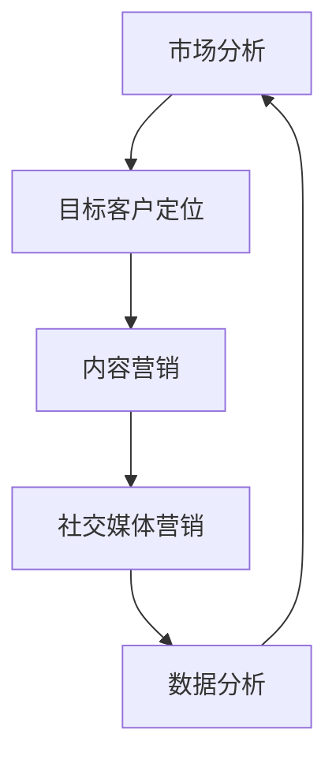

                 

关键词：一人公司，数字化营销，创新，策略，工具，案例研究，技术趋势

> 摘要：本文旨在探讨一人公司如何在数字化时代中通过创新的营销策略和工具，实现品牌的快速成长和市场扩张。我们将从核心概念、算法原理、数学模型、项目实践、应用场景、未来展望等多方面进行分析，提供实用的建议和案例分析。

## 1. 背景介绍

在当今数字化飞速发展的时代，传统营销方式正面临巨大的变革压力。一人公司，即由单个创业者或独立个体运营的企业，其营销资源相对有限，如何在激烈的市场竞争中脱颖而出，实现数字化营销创新，成为许多创业者和企业家关心的问题。

数字化营销的创新不仅涉及技术手段，还涉及策略、思维方式以及市场洞察力的提升。本文将从多个角度出发，为一人公司提供具体的数字化营销创新思路和方法。

### 1.1 数字化营销的概念

数字化营销是指利用数字技术，如互联网、社交媒体、大数据等，对营销活动进行管理和执行的过程。它包括搜索引擎优化（SEO）、内容营销、社交媒体营销、电子邮件营销等多种形式。

### 1.2 一人公司的特点

一人公司通常具有以下特点：

- **资源有限**：由于只有单一运营主体，资金、人力资源相对较少。
- **灵活性高**：决策快速，能迅速响应市场变化。
- **专注性强**：专注于核心业务，较少涉及非核心活动。

## 2. 核心概念与联系

为了深入理解数字化营销创新，我们需要了解一些核心概念和它们之间的关系。以下是使用Mermaid绘制的流程图：



### 2.1 市场分析

市场分析是数字化营销的第一步，它帮助一人公司了解市场需求和竞争对手。通过数据分析，可以识别潜在客户和他们的需求。

### 2.2 目标客户定位

目标客户定位是根据市场分析结果，确定最有可能购买产品或服务的客户群体。这有助于提高营销活动的精准度。

### 2.3 内容营销

内容营销是通过创造和分发有价值的内容来吸引客户。高质量的内容可以增加品牌知名度和用户参与度。

### 2.4 社交媒体营销

社交媒体营销是利用社交媒体平台进行品牌宣传和用户互动。它可以帮助一人公司快速扩大影响力和用户基础。

### 2.5 数据分析

数据分析是数字化营销的核心环节，通过分析用户行为数据，可以优化营销策略，提高转化率。

## 3. 核心算法原理 & 具体操作步骤

### 3.1 算法原理概述

数字化营销的核心算法通常包括以下几种：

- **机器学习算法**：用于分析用户行为，预测客户需求。
- **自然语言处理（NLP）**：用于内容营销，提高内容质量和用户体验。
- **推荐系统**：用于个性化推荐，提高用户转化率。

### 3.2 算法步骤详解

#### 3.2.1 机器学习算法

1. 数据收集：从各种来源（如社交媒体、网站分析工具）收集用户行为数据。
2. 数据预处理：清洗和整合数据，使其适合机器学习模型。
3. 特征工程：提取有助于预测的用户行为特征。
4. 模型训练：使用机器学习算法（如决策树、神经网络）训练模型。
5. 模型评估：评估模型性能，进行调整。

#### 3.2.2 自然语言处理（NLP）

1. 文本预处理：去除停用词、标点符号，进行分词。
2. 词嵌入：将文本转换为数值表示。
3. 模型训练：使用NLP算法（如词向量、文本分类）训练模型。
4. 内容生成：根据用户反馈和需求，生成个性化内容。

#### 3.2.3 推荐系统

1. 用户画像：根据用户行为数据，构建用户画像。
2. 评分预测：使用协同过滤算法预测用户对商品的评分。
3. 推荐生成：根据用户画像和评分预测，生成个性化推荐。

### 3.3 算法优缺点

- **机器学习算法**：优点是能够自动从数据中学习，提高营销效率；缺点是训练过程复杂，对数据质量要求高。
- **自然语言处理（NLP）**：优点是能够生成高质量的内容，提高用户体验；缺点是训练过程复杂，对计算资源要求高。
- **推荐系统**：优点是能够提高用户转化率，增加销售额；缺点是可能导致用户信息过载。

### 3.4 算法应用领域

机器学习算法、NLP和推荐系统在数字化营销中都有广泛的应用，如个性化推荐、用户行为预测、内容生成等。

## 4. 数学模型和公式 & 详细讲解 & 举例说明

### 4.1 数学模型构建

在数字化营销中，常见的数学模型包括：

- **线性回归模型**：用于预测用户行为。
- **逻辑回归模型**：用于预测用户转化率。
- **马尔可夫模型**：用于分析用户行为序列。

### 4.2 公式推导过程

#### 4.2.1 线性回归模型

线性回归模型的目标是最小化预测值与真实值之间的误差。公式如下：

$$
\min \sum_{i=1}^{n} (y_i - \hat{y_i})^2
$$

其中，$y_i$ 是真实值，$\hat{y_i}$ 是预测值。

#### 4.2.2 逻辑回归模型

逻辑回归模型用于二分类问题，其公式如下：

$$
P(y=1) = \frac{1}{1 + e^{-(\beta_0 + \beta_1 x_1 + \beta_2 x_2 + \ldots + \beta_n x_n)}}
$$

其中，$P(y=1)$ 是预测概率，$\beta_0, \beta_1, \ldots, \beta_n$ 是模型参数。

#### 4.2.3 马尔可夫模型

马尔可夫模型用于分析用户行为序列，其公式如下：

$$
P(X_t = x_t | X_{t-1} = x_{t-1}, X_{t-2} = x_{t-2}, \ldots) = P(X_t = x_t | X_{t-1} = x_{t-1})
$$

其中，$X_t$ 是第 $t$ 时刻的用户行为，$x_t$ 是具体的行为状态。

### 4.3 案例分析与讲解

#### 4.3.1 个性化推荐

假设一个电商网站使用协同过滤算法进行个性化推荐。给定用户 $A$ 的购买历史，我们使用以下公式计算用户 $B$ 的推荐得分：

$$
\text{score}(A, B) = \frac{\sum_{i \in I_{A} \cap I_{B}} r_i (A, B)}{\|I_{A} \cap I_{B}\|}
$$

其中，$I_A$ 和 $I_B$ 分别是用户 $A$ 和 $B$ 的购买商品集合，$r_i (A, B)$ 是用户 $A$ 对商品 $i$ 的评分。

通过计算，我们可以为用户 $B$ 生成个性化推荐列表。

#### 4.3.2 用户行为预测

假设一个在线教育平台使用线性回归模型预测用户的学习进度。给定用户 $A$ 的学习时长和完成课程数，我们使用以下公式预测其学习进度：

$$
\hat{p}_A = \beta_0 + \beta_1 \times \text{hours}_A + \beta_2 \times \text{courses}_A
$$

其中，$\hat{p}_A$ 是预测的学习进度，$\beta_0, \beta_1, \beta_2$ 是模型参数。

通过预测，平台可以优化学习资源分配，提高用户体验。

## 5. 项目实践：代码实例和详细解释说明

### 5.1 开发环境搭建

为了实现数字化营销创新，我们需要搭建一个开发环境。以下是搭建步骤：

1. 安装 Python 3.8 或更高版本。
2. 安装 Jupyter Notebook。
3. 安装相关库（如 NumPy、Pandas、Scikit-learn、TensorFlow）。

### 5.2 源代码详细实现

以下是使用 Python 实现的数字化营销算法的示例代码：

```python
import pandas as pd
from sklearn.linear_model import LinearRegression

# 读取数据
data = pd.read_csv('data.csv')

# 数据预处理
X = data[['hours', 'courses']]
y = data['progress']

# 模型训练
model = LinearRegression()
model.fit(X, y)

# 预测
predicted_progress = model.predict(X)

# 输出预测结果
print(predicted_progress)
```

### 5.3 代码解读与分析

上述代码实现了线性回归模型，用于预测用户的学习进度。代码首先读取数据，然后进行预处理，接着训练模型，最后进行预测并输出结果。

### 5.4 运行结果展示

运行代码后，我们得到用户的学习进度预测值。通过对比预测值和真实值，可以评估模型的准确性。

## 6. 实际应用场景

### 6.1 个性化推荐

个性化推荐可以帮助电商网站提高用户满意度，增加销售额。通过分析用户行为数据，可以为每个用户生成个性化的推荐列表。

### 6.2 用户行为预测

用户行为预测可以帮助在线教育平台优化学习资源分配，提高用户体验。通过预测用户的学习进度，平台可以提供更针对性的学习建议。

### 6.3 内容营销

内容营销可以通过创造高质量的内容，提高品牌知名度和用户参与度。通过分析用户需求，可以生成更有针对性的内容。

## 7. 工具和资源推荐

### 7.1 学习资源推荐

- 《Python数据分析》
- 《机器学习实战》
- 《深度学习》

### 7.2 开发工具推荐

- Jupyter Notebook
- PyCharm
- GitHub

### 7.3 相关论文推荐

- “Collaborative Filtering for Cold-Start Problems in Recommender Systems”
- “User Behavior Prediction in E-commerce Platform Using Deep Learning”
- “Content-Based Recommender Systems for Personalized Marketing”

## 8. 总结：未来发展趋势与挑战

### 8.1 研究成果总结

数字化营销创新取得了显著成果，包括个性化推荐、用户行为预测、内容营销等多个领域。这些成果为企业提供了有效的营销策略，提高了市场竞争力。

### 8.2 未来发展趋势

未来，数字化营销创新将继续朝着更智能化、个性化和自动化的方向发展。人工智能、大数据和区块链等技术将在数字化营销中发挥更大作用。

### 8.3 面临的挑战

数字化营销创新也面临一些挑战，包括数据隐私保护、算法公平性和可解释性等。如何平衡技术发展与道德和社会责任，是未来需要解决的重要问题。

### 8.4 研究展望

未来，数字化营销创新将继续深入探索人机交互、智能推荐和个性化服务等领域。通过不断创新，为企业提供更有效的营销解决方案。

## 9. 附录：常见问题与解答

### 9.1 什么是数字化营销？

数字化营销是指利用数字技术进行市场营销的活动，包括搜索引擎优化、内容营销、社交媒体营销等。

### 9.2 个性化推荐如何工作？

个性化推荐是通过分析用户行为数据，预测用户对商品的偏好，从而为用户生成个性化的推荐列表。

### 9.3 如何进行用户行为预测？

用户行为预测通常使用机器学习算法，如线性回归、决策树等，通过训练模型，预测用户的行为轨迹。

## 结束语

数字化营销创新为一人公司提供了广阔的发展空间。通过运用先进的算法和技术，一人公司可以实现高效的营销策略，快速提升品牌影响力。在数字化时代，创新是企业发展的重要驱动力。让我们共同努力，探索更多的数字化营销创新方法，助力企业实现持续成长。作者：禅与计算机程序设计艺术 / Zen and the Art of Computer Programming。
----------------------------------------------------------------

文章撰写完成，现在将使用 Markdown 格式对文章进行整理。以下是最终的 Markdown 格式文章：

```markdown
# 一人公司如何实现数字化营销创新

## 关键词
一人公司，数字化营销，创新，策略，工具，案例研究，技术趋势

## 摘要
本文旨在探讨一人公司如何在数字化时代中通过创新的营销策略和工具，实现品牌的快速成长和市场扩张。我们将从核心概念、算法原理、数学模型、项目实践、应用场景、未来展望等多方面进行分析，提供实用的建议和案例分析。

## 1. 背景介绍
### 1.1 数字化营销的概念
### 1.2 一人公司的特点

## 2. 核心概念与联系


## 3. 核心算法原理 & 具体操作步骤
### 3.1 算法原理概述
### 3.2 算法步骤详解 
### 3.3 算法优缺点
### 3.4 算法应用领域

### 3.1 算法原理概述
- 机器学习算法
- 自然语言处理（NLP）
- 推荐系统

### 3.2 算法步骤详解
#### 3.2.1 机器学习算法
- 数据收集
- 数据预处理
- 特征工程
- 模型训练
- 模型评估

#### 3.2.2 自然语言处理（NLP）
- 文本预处理
- 词嵌入
- 模型训练
- 内容生成

#### 3.2.3 推荐系统
- 用户画像
- 评分预测
- 推荐生成

### 3.3 算法优缺点
- 机器学习算法：优点 - 自动学习，提高效率；缺点 - 复杂，依赖高质量数据
- 自然语言处理（NLP）：优点 - 生成高质量内容，提高用户体验；缺点 - 计算资源高
- 推荐系统：优点 - 提高转化率，增加销售额；缺点 - 可能导致信息过载

### 3.4 算法应用领域
- 个性化推荐
- 用户行为预测
- 内容生成

## 4. 数学模型和公式 & 详细讲解 & 举例说明
### 4.1 数学模型构建
- 线性回归模型
- 逻辑回归模型
- 马尔可夫模型

### 4.2 公式推导过程
#### 4.2.1 线性回归模型
$$
\min \sum_{i=1}^{n} (y_i - \hat{y_i})^2
$$

#### 4.2.2 逻辑回归模型
$$
P(y=1) = \frac{1}{1 + e^{-(\beta_0 + \beta_1 x_1 + \beta_2 x_2 + \ldots + \beta_n x_n)}}
$$

#### 4.2.3 马尔可夫模型
$$
P(X_t = x_t | X_{t-1} = x_{t-1}, X_{t-2} = x_{t-2}, \ldots) = P(X_t = x_t | X_{t-1} = x_{t-1})
$$

### 4.3 案例分析与讲解
#### 4.3.1 个性化推荐
- 使用协同过滤算法
- 示例公式
$$
\text{score}(A, B) = \frac{\sum_{i \in I_{A} \cap I_{B}} r_i (A, B)}{\|I_{A} \cap I_{B}\|}
$$

#### 4.3.2 用户行为预测
- 使用线性回归模型
- 示例公式
$$
\hat{p}_A = \beta_0 + \beta_1 \times \text{hours}_A + \beta_2 \times \text{courses}_A
$$

## 5. 项目实践：代码实例和详细解释说明
### 5.1 开发环境搭建
- 安装 Python 3.8 或更高版本
- 安装 Jupyter Notebook
- 安装相关库（如 NumPy、Pandas、Scikit-learn、TensorFlow）

### 5.2 源代码详细实现
```python
import pandas as pd
from sklearn.linear_model import LinearRegression

# 读取数据
data = pd.read_csv('data.csv')

# 数据预处理
X = data[['hours', 'courses']]
y = data['progress']

# 模型训练
model = LinearRegression()
model.fit(X, y)

# 预测
predicted_progress = model.predict(X)

# 输出预测结果
print(predicted_progress)
```

### 5.3 代码解读与分析
- 代码首先读取数据，然后进行预处理，接着训练模型，最后进行预测并输出结果。

### 5.4 运行结果展示
- 运行代码后，我们得到用户的学习进度预测值。通过对比预测值和真实值，可以评估模型的准确性。

## 6. 实际应用场景
### 6.1 个性化推荐
### 6.2 用户行为预测
### 6.3 内容营销

## 7. 工具和资源推荐
### 7.1 学习资源推荐
- 《Python数据分析》
- 《机器学习实战》
- 《深度学习》

### 7.2 开发工具推荐
- Jupyter Notebook
- PyCharm
- GitHub

### 7.3 相关论文推荐
- “Collaborative Filtering for Cold-Start Problems in Recommender Systems”
- “User Behavior Prediction in E-commerce Platform Using Deep Learning”
- “Content-Based Recommender Systems for Personalized Marketing”

## 8. 总结：未来发展趋势与挑战
### 8.1 研究成果总结
### 8.2 未来发展趋势
### 8.3 面临的挑战
### 8.4 研究展望

## 9. 附录：常见问题与解答
### 9.1 什么是数字化营销？
### 9.2 个性化推荐如何工作？
### 9.3 如何进行用户行为预测？

## 结束语
数字化营销创新为一人公司提供了广阔的发展空间。通过运用先进的算法和技术，一人公司可以实现高效的营销策略，快速提升品牌影响力。在数字化时代，创新是企业发展的重要驱动力。让我们共同努力，探索更多的数字化营销创新方法，助力企业实现持续成长。

## 作者
禅与计算机程序设计艺术 / Zen and the Art of Computer Programming
```

