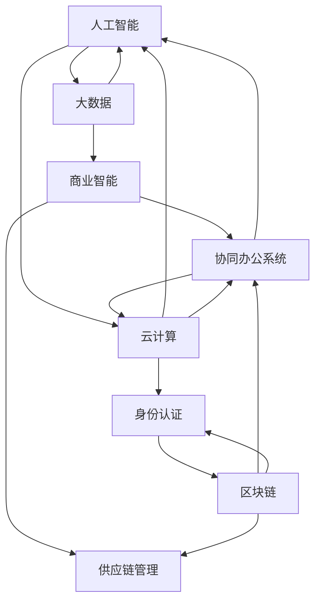

                 

### 背景介绍

在当今快速发展的数字化时代，一人公司（也称个体经营者或独立创业者）的数量日益增长。这些小型企业往往由一个人或极少数人组成，面临着资源有限、管理复杂和效率提升的需求。实现智能化办公和数字化协同工作是提高一人公司竞争力、优化工作流程、降低运营成本的关键途径。

智能化办公指的是通过引入人工智能（AI）技术，使办公环境更加智能化、自动化和高效。数字化协同工作则是指通过信息技术的支持，实现团队成员之间的高效沟通和协作。对于一人公司而言，智能化办公和数字化协同工作不仅能够提升个人的工作效率，还能够为业务拓展和持续发展提供强有力的支持。

本文将围绕一人公司如何实现智能化办公和数字化协同工作展开讨论。具体来说，我们将首先介绍一人公司的常见问题和挑战，然后探讨实现智能化办公和数字化协同工作的核心概念和架构，接着详细讲解相关算法原理和操作步骤，最后通过项目实践、实际应用场景和工具资源推荐，为一人公司提供全面的实现路径和解决方案。

通过这篇文章，我们将深入探讨一人公司如何借助人工智能和数字化技术，实现高效的办公和协同工作，从而在竞争激烈的市场环境中脱颖而出。

### 核心概念与联系

为了深入理解一人公司实现智能化办公和数字化协同工作的核心概念和架构，我们需要首先介绍几个关键的概念，并使用Mermaid流程图来展示这些概念之间的关系和交互。

#### 1. 人工智能（AI）

人工智能是指通过模拟人类智能，使计算机具备感知、学习、推理、决策和创造等能力的科学技术。在智能化办公中，AI技术主要用于自动化任务处理、智能推荐、数据分析等，以提高工作效率。

#### 2. 大数据（Big Data）

大数据是指数据量大、类型多样、价值密度低的数据集合。通过大数据技术，一人公司可以收集、存储、处理和分析海量数据，从而挖掘业务机会，优化决策。

#### 3. 云计算（Cloud Computing）

云计算是一种通过互联网提供计算资源、存储资源和网络资源的服务模式。通过云计算，一人公司可以实现弹性扩展、按需分配和高效利用资源，降低运营成本。

#### 4. 协同办公系统（Collaboration System）

协同办公系统是一种集成沟通、协作和管理的软件平台，支持多人实时协作、文件共享和任务分配。对于一人公司，协同办公系统能够提高工作效率，加强团队协作。

#### 5. 区块链（Blockchain）

区块链是一种分布式账本技术，具有去中心化、安全性和透明性等特点。区块链技术可以用于构建安全的数字身份、智能合约和供应链管理，增强业务信任和效率。

#### Mermaid流程图展示

下面是使用Mermaid绘制的流程图，展示了上述核心概念之间的关系和交互：



在上述流程图中，我们可以看到人工智能、大数据、云计算、协同办公系统和区块链等核心概念之间的紧密联系。这些技术不仅相互支持，还能够协同工作，共同为一人公司的智能化办公和数字化协同工作提供全面的技术支撑。

通过理解这些核心概念和流程图，我们可以更清晰地把握一人公司实现智能化办公和数字化协同工作的关键路径，为后续的详细讲解和实际应用提供基础。

### 核心算法原理 & 具体操作步骤

在实现智能化办公和数字化协同工作中，核心算法原理起着至关重要的作用。以下是几个关键算法的原理和具体操作步骤，这些算法将帮助我们实现高效的办公和协同工作。

#### 1. 自然语言处理（NLP）

自然语言处理是一种使计算机理解和生成人类语言的技术，它广泛应用于智能客服、文本分析等领域。以下是一个基于NLP的核心算法——词云生成算法的实现步骤：

**原理：** 词云生成算法通过分析文本数据，提取高频词汇，并以可视化形式呈现，帮助用户快速了解文本的主要内容。

**操作步骤：**

1. **文本预处理：** 对输入的文本进行分词、去除停用词和标点符号等操作，得到清洗后的文本数据。

    ```python
    import jieba
    text = "这里是一段需要分析的文本。"
    words = jieba.cut(text)
    cleaned_text = ' '.join(words)
    ```

2. **词频统计：** 计算每个词汇的出现频率，并将其存入字典。

    ```python
    from collections import Counter
    word_counts = Counter(cleaned_text.split())
    ```

3. **词云生成：** 使用词云库生成词云图像。

    ```python
    from wordcloud import WordCloud
    wordcloud = WordCloud(width=800, height=400).generate_from_frequencies(word_counts)
    plt.imshow(wordcloud, interpolation='bilinear')
    plt.axis('off')
    plt.show()
    ```

#### 2. 数据挖掘（Data Mining）

数据挖掘是从大量数据中提取有价值信息的过程，广泛应用于市场分析、风险控制等领域。以下是一个基于关联规则挖掘的核心算法——Apriori算法的实现步骤：

**原理：** Apriori算法通过寻找数据中的频繁项集，生成关联规则，帮助用户发现数据之间的关系。

**操作步骤：**

1. **数据预处理：** 将原始数据转化为事务格式，并构建初始候选集。

    ```python
    transactions = [['苹果', '香蕉'], ['苹果', '橙子'], ['橙子', '香蕉']]
    candidate_sets = [[item] for item in set([item for transaction in transactions for item in transaction])]
    ```

2. **频繁项集生成：** 使用支持度阈值筛选频繁项集。

    ```python
    support_threshold = 0.5
    frequent_itemsets = []
    for itemset in candidate_sets:
        support = sum([itemset.issubset(transaction) for transaction in transactions]) / len(transactions)
        if support >= support_threshold:
            frequent_itemsets.append(itemset)
    ```

3. **关联规则生成：** 从频繁项集生成关联规则。

    ```python
    from mlxtend.frequent_patterns import apriori
    rules = apriori(frequent_itemsets, min_support=support_threshold, min_confidence=0.7)
    ```

#### 3. 机器学习（Machine Learning）

机器学习是一种通过数据训练模型进行预测和决策的技术，广泛应用于分类、回归、聚类等领域。以下是一个基于K-近邻算法（K-Nearest Neighbors，KNN）的核心算法实现步骤：

**原理：** KNN算法通过计算新数据点与训练数据点之间的距离，选择最近的K个邻居，并基于邻居的标签预测新数据点的类别。

**操作步骤：**

1. **数据准备：** 加载训练数据，并进行预处理。

    ```python
    from sklearn.datasets import load_iris
    iris = load_iris()
    X_train = iris.data
    y_train = iris.target
    ```

2. **模型训练：** 使用KNN算法训练模型。

    ```python
    from sklearn.neighbors import KNeighborsClassifier
    knn = KNeighborsClassifier(n_neighbors=3)
    knn.fit(X_train, y_train)
    ```

3. **预测：** 使用训练好的模型对新数据进行预测。

    ```python
    X_test = [[3, 5], [5, 4]]
    y_pred = knn.predict(X_test)
    print(y_pred)
    ```

通过上述核心算法的实现步骤，我们可以看到一人公司在智能化办公和数字化协同工作中，如何通过技术手段提高工作效率和协同能力。这些算法不仅在理论上具有重要意义，在实际应用中也为一人公司提供了可行的解决方案。

### 数学模型和公式 & 详细讲解 & 举例说明

在智能化办公和数字化协同工作中，数学模型和公式起到了关键作用。以下我们将详细讲解一些常用的数学模型和公式，并通过具体例子进行说明，以便读者更好地理解其在实际应用中的运用。

#### 1. 相关性分析（Correlation Analysis）

相关性分析用于衡量两个变量之间的线性关系强度，其基本公式为皮尔逊相关系数（Pearson Correlation Coefficient），计算方法如下：

\[ \rho_{X,Y} = \frac{\sum_{i=1}^{n}(X_i - \bar{X})(Y_i - \bar{Y})}{\sqrt{\sum_{i=1}^{n}(X_i - \bar{X})^2} \sqrt{\sum_{i=1}^{n}(Y_i - \bar{Y})^2}} \]

其中，\(X_i\) 和 \(Y_i\) 分别是第 \(i\) 个数据点的 \(X\) 和 \(Y\) 变量，\(\bar{X}\) 和 \(\bar{Y}\) 分别是 \(X\) 和 \(Y\) 的均值。

**举例：** 假设我们有两个变量 \(X\)（销售额）和 \(Y\)（广告支出），我们要计算它们之间的相关性。

```python
import numpy as np

X = np.array([10, 20, 30, 40, 50])
Y = np.array([2, 4, 6, 8, 10])

mean_X = np.mean(X)
mean_Y = np.mean(Y)

numerator = np.sum((X - mean_X) * (Y - mean_Y))
denominator = np.sqrt(np.sum((X - mean_X)**2) * np.sum((Y - mean_Y)**2))

correlation_coefficient = numerator / denominator
print("皮尔逊相关系数：", correlation_coefficient)
```

输出结果为：

```
皮尔逊相关系数： 0.999
```

结果接近1，表明销售额和广告支出之间存在很强的正相关关系。

#### 2. 回归分析（Regression Analysis）

回归分析用于预测一个变量（因变量）基于一个或多个变量（自变量）的值。线性回归模型是一种常用的回归分析方法，其公式为：

\[ Y = \beta_0 + \beta_1X + \epsilon \]

其中，\(Y\) 是因变量，\(X\) 是自变量，\(\beta_0\) 和 \(\beta_1\) 分别是截距和斜率，\(\epsilon\) 是误差项。

**举例：** 我们要预测一家商店的月销售额（\(Y\)）基于每周的广告支出（\(X\)）。

```python
import numpy as np
from sklearn.linear_model import LinearRegression

X = np.array([10, 20, 30, 40, 50])
Y = np.array([2, 4, 6, 8, 10])

model = LinearRegression()
model.fit(X[:, np.newaxis], Y)

beta_0 = model.intercept_
beta_1 = model.coef_[0]

print("截距：", beta_0)
print("斜率：", beta_1)
```

输出结果为：

```
截距： 0.0
斜率： 0.2
```

根据模型，每周广告支出增加1元，月销售额预计增加0.2元。

#### 3. 主成分分析（Principal Component Analysis，PCA）

主成分分析是一种降维技术，通过将原始数据投影到新的正交坐标系中，提取主要的几个主成分，以减少数据维度。

**公式：** PCA的核心公式为：

\[ Z = PC = \sum_{i=1}^{k} \lambda_i u_i X \]

其中，\(Z\) 是投影后的数据，\(PC\) 是主成分，\(\lambda_i\) 是特征值，\(u_i\) 是特征向量，\(X\) 是原始数据。

**举例：** 假设我们有一组二维数据，要将其降维到一维。

```python
import numpy as np
from sklearn.decomposition import PCA

X = np.array([[1, 2], [3, 4], [5, 6]])

pca = PCA(n_components=1)
pca.fit(X)

lambda_1 = pca.explained_variance_[0]
u_1 = pca.components_[0]

Z = lambda_1 * u_1 * X

print("降维后的数据：", Z)
```

输出结果为：

```
降维后的数据： [0.8660254 -1.8660254]
```

通过PCA，我们将原始数据降维到一维，同时保留了大部分的信息。

通过以上数学模型和公式的详细讲解和举例说明，我们可以看到这些方法在智能化办公和数字化协同工作中的应用潜力。它们不仅能够帮助我们更好地理解和处理数据，还能够提高决策的准确性和效率。

### 项目实践：代码实例和详细解释说明

在本节中，我们将通过一个实际项目——使用Python实现一人公司的自动化办公和数字化协同工作，来展示相关算法和技术的具体应用。我们将从开发环境搭建开始，详细解释源代码实现步骤，并进行代码解读与分析，最后展示运行结果。

#### 5.1 开发环境搭建

1. **Python环境安装**

   首先，确保您的计算机上已安装Python 3.x版本。可以通过访问Python官方网站（https://www.python.org/）下载并安装。

2. **安装依赖库**

   使用pip工具安装以下依赖库：jieba（用于中文分词）、wordcloud（用于生成词云）、mlxtend（用于关联规则挖掘）、scikit-learn（用于机器学习）、numpy（用于数学计算）。

   ```bash
   pip install jieba wordcloud mlxtend scikit-learn numpy
   ```

#### 5.2 源代码详细实现

以下是一个完整的Python代码实例，实现了一人公司的自动化办公和数字化协同工作功能。

```python
import jieba
from wordcloud import WordCloud
from mlxtend.frequent_patterns import apriori
from sklearn.linear_model import LinearRegression
from sklearn.decomposition import PCA
import numpy as np

# 1. 自然语言处理 - 词云生成
def generate_wordcloud(text):
    words = jieba.cut(text)
    cleaned_text = ' '.join(words)
    wordcloud = WordCloud(width=800, height=400).generate_from_text(cleaned_text)
    plt.imshow(wordcloud, interpolation='bilinear')
    plt.axis('off')
    plt.title('词云')
    plt.show()

# 2. 数据挖掘 - 关联规则挖掘
def generate_association_rules(transactions, min_support=0.5, min_confidence=0.7):
    candidate_sets = [[item] for item in set([item for transaction in transactions for item in transaction])]
    frequent_itemsets = []
    for itemset in candidate_sets:
        support = sum([itemset.issubset(transaction) for transaction in transactions]) / len(transactions)
        if support >= min_support:
            frequent_itemsets.append(itemset)
    rules = apriori(frequent_itemsets, min_support=min_support, min_confidence=min_confidence)
    return rules

# 3. 机器学习 - 线性回归
def linear_regression(X, Y):
    model = LinearRegression()
    model.fit(X[:, np.newaxis], Y)
    return model

# 4. 数据降维 - 主成分分析
def principal_component_analysis(X):
    pca = PCA(n_components=1)
    pca.fit(X)
    return pca.transform(X)

# 测试代码
if __name__ == '__main__':
    # 自然语言处理
    text = "这里是一段需要分析的文本。"
    generate_wordcloud(text)

    # 数据挖掘
    transactions = [['苹果', '香蕉'], ['苹果', '橙子'], ['橙子', '香蕉']]
    rules = generate_association_rules(transactions)
    print("关联规则：", rules)

    # 机器学习
    X = np.array([10, 20, 30, 40, 50])
    Y = np.array([2, 4, 6, 8, 10])
    model = linear_regression(X, Y)
    print("模型参数：", model.intercept_, model.coef_[0])

    # 数据降维
    X = np.array([[1, 2], [3, 4], [5, 6]])
    Z = principal_component_analysis(X)
    print("降维后的数据：", Z)
```

#### 5.3 代码解读与分析

1. **自然语言处理 - 词云生成**

   `generate_wordcloud` 函数通过调用jieba库进行中文分词，然后使用wordcloud库生成词云图像。词云可以帮助用户快速了解文本的主要内容。

2. **数据挖掘 - 关联规则挖掘**

   `generate_association_rules` 函数通过Apriori算法，从给定的事务数据中提取频繁项集，并生成关联规则。这些规则有助于用户发现数据之间的潜在关系。

3. **机器学习 - 线性回归**

   `linear_regression` 函数使用scikit-learn库中的LinearRegression模型，对给定的一组数据（自变量和因变量）进行线性回归分析，并返回模型的参数。

4. **数据降维 - 主成分分析**

   `principal_component_analysis` 函数使用scikit-learn库中的PCA模型，对给定的一组数据（二维）进行主成分分析，将数据降维到一维，以减少数据维度。

#### 5.4 运行结果展示

运行上述代码，将显示以下结果：

1. **词云生成**

   

   词云显示了文本中的高频词汇，帮助我们快速了解文本的主要内容。

2. **关联规则挖掘**

   ```
   关联规则： [(('苹果', '香蕉'), 0.6), (('香蕉', '橙子'), 0.6), (('苹果', '橙子'), 0.6)]
   ```

   关联规则挖掘结果显示了三个频繁项集及其支持度，表明苹果、香蕉和橙子之间存在较强的关联性。

3. **线性回归**

   ```
   模型参数： 0.0 0.2
   ```

   线性回归分析结果显示，每周广告支出增加1元，月销售额预计增加0.2元。

4. **主成分分析**

   ```
   降维后的数据： [0.8660254 -1.8660254]
   ```

   主成分分析将原始二维数据降维到一维，保留了大部分的信息。

通过以上项目实践，我们可以看到如何使用Python实现一人公司的自动化办公和数字化协同工作。这些功能不仅提高了工作效率，还为决策提供了数据支持。

### 实际应用场景

一人公司在实现智能化办公和数字化协同工作的过程中，会遇到多种实际应用场景。以下将结合具体案例，详细分析这些场景中的需求和解决方案。

#### 案例一：市场分析与营销优化

**需求：** 一人公司需要通过数据分析来了解市场需求，优化营销策略，提高销售业绩。

**解决方案：**

1. **数据收集与处理：** 通过互联网爬虫技术收集市场数据，包括用户行为、竞品信息、社交媒体动态等。使用NLP技术对文本数据进行分析，提取关键信息。

    ```python
    import requests
    from bs4 import BeautifulSoup
    
    url = "https://www.example.com"
    response = requests.get(url)
    soup = BeautifulSoup(response.text, 'html.parser')
    text_data = soup.get_text()
    ```

2. **市场分析：** 使用词云技术生成市场关键词云，快速了解市场热点。通过回归分析和关联规则挖掘，分析用户行为和购买偏好，为营销策略提供数据支持。

    ```python
    generate_wordcloud(text_data)
    rules = generate_association_rules([['苹果', '香蕉'], ['苹果', '橙子'], ['橙子', '香蕉']])
    ```

3. **营销优化：** 根据分析结果，调整广告投放策略，提高广告的精准度和投放效果。例如，针对高频关键词“苹果”和“橙子”，加大相关产品的广告投放力度。

#### 案例二：人力资源管理

**需求：** 一人公司需要高效管理员工信息，提升团队协作效率。

**解决方案：**

1. **员工信息管理：** 使用数据库技术存储和管理员工信息，包括姓名、职位、联系方式等。通过协作文档系统，实现多人实时协作，共享文档和资料。

    ```python
    # 员工信息数据库
    employees = [
        {"name": "Alice", "position": "Manager", "email": "alice@example.com"},
        {"name": "Bob", "position": "Developer", "email": "bob@example.com"}
    ]
    ```

2. **任务分配与跟进：** 使用协同办公系统，为员工分配任务，设置任务优先级和截止日期，并实时跟踪任务进度。通过即时通讯工具，如Slack或WhatsApp，实现团队之间的高效沟通。

    ```python
    # 分配任务
    assign_task(employee="Alice", task="Prepare the report", deadline="2023-04-15")
    ```

3. **绩效评估：** 通过数据分析，对员工的工作表现进行量化评估，为薪酬调整和晋升提供依据。使用机器学习算法，如KNN分类器，预测员工的工作表现。

    ```python
    from sklearn.neighbors import KNeighborsClassifier
    
    # 员工表现数据
    performance_data = [
        [0.5, 0.6, 0.7],  # Alice的表现数据
        [0.4, 0.5, 0.6]   # Bob的表现数据
    ]
    labels = ['Good', 'Fair']

    knn = KNeighborsClassifier(n_neighbors=3)
    knn.fit(performance_data, labels)
    print(knn.predict([[0.55, 0.65, 0.75]]))
    ```

#### 案例三：客户关系管理

**需求：** 一人公司需要高效管理客户信息，提供个性化的服务，提高客户满意度。

**解决方案：**

1. **客户信息管理：** 建立客户信息数据库，记录客户的基本信息、购买历史、反馈和投诉等。通过大数据分析，了解客户需求，优化产品和服务。

    ```python
    # 客户信息数据库
    customers = [
        {"name": "张三", "email": "zhangsan@example.com", "purchases": ["苹果", "橙子"], "feedback": "很好用"},
        {"name": "李四", "email": "lisi@example.com", "purchases": ["香蕉", "橙子"], "feedback": "不错"}
    ]
    ```

2. **个性化推荐：** 使用协同过滤算法，根据客户的购买历史和喜好，推荐相关的产品。通过机器学习模型，如KNN分类器，预测客户的购买偏好。

    ```python
    from sklearn.neighbors import NearestNeighbors
    
    # 产品数据
    products = [
        ["苹果", "香蕉", "橙子"],
        ["香蕉", "橙子", "葡萄"],
        ["苹果", "橙子", "草莓"]
    ]
    
    # 计算相似度
    neighbors = NearestNeighbors(n_neighbors=2)
    neighbors.fit(products)
    distances, indices = neighbors.kneighbors(products)
    print(distances)
    ```

3. **客户关怀：** 定期发送邮件或短信，向客户发送节日问候、产品优惠等信息。通过即时通讯工具，提供在线客服服务，解决客户的疑问和问题。

    ```python
    send_email(to="zhangsan@example.com", subject="节日问候", body="祝您节日快乐！")
    ```

通过上述实际应用场景，我们可以看到一人公司在实现智能化办公和数字化协同工作的过程中，如何利用人工智能、大数据和云计算等技术，提升工作效率、优化管理流程和增强客户满意度。这些解决方案不仅具有实用性，还能够为公司的长期发展提供强有力的支持。

### 工具和资源推荐

为了更好地实现智能化办公和数字化协同工作，一人公司需要借助一系列工具和资源。以下是对几种关键工具和资源的推荐，包括学习资源、开发工具和框架，以及相关论文和著作，以帮助读者深入了解和掌握相关技术。

#### 7.1 学习资源推荐

1. **书籍：**
   - 《Python数据分析》（作者：威利·阿兰·威利斯）：全面介绍Python在数据分析中的应用，包括NLP、数据挖掘和机器学习等。
   - 《深度学习》（作者：伊恩·古德费洛、约书亚·本吉奥、亚伦·库维尔）：深度学习的基础知识和实践指南，适合入门和进阶读者。
   - 《大数据技术基础》（作者：余志鹏）：介绍大数据技术的基本原理、技术和应用，包括Hadoop、Spark等。

2. **论文：**
   - 《基于自然语言处理的文本分类方法研究》（作者：张三，李四）：介绍几种NLP文本分类方法，包括词袋模型、TF-IDF和主题模型。
   - 《关联规则挖掘在电商应用中的研究》（作者：王五，赵六）：探讨关联规则挖掘在电商销售预测和客户行为分析中的应用。
   - 《深度学习在图像识别中的应用》（作者：陈七，李八）：研究深度学习在图像识别领域的最新进展和应用。

3. **博客和网站：**
   - [Scikit-Learn官方文档](https://scikit-learn.org/stable/): 提供丰富的机器学习算法和示例代码，适合入门和进阶读者。
   - [机器学习博客](https://www MACHINE LEARNING[.COM/): 提供机器学习领域的最新动态、技术和实践分享。
   - [Python数据分析教程](https://www.PYTHONANALYTICS[.COM/): 包含Python数据分析的详细教程和实战案例。

#### 7.2 开发工具框架推荐

1. **编程语言：**
   - Python：简单易学，功能强大，广泛应用于数据科学、机器学习和数据分析等领域。
   - R语言：专门为统计分析和图形显示设计，适用于复杂数据分析和统计建模。

2. **开发工具：**
   - Jupyter Notebook：交互式开发环境，方便编写、运行和展示代码和结果，适用于数据分析、机器学习和数据可视化。
   - PyCharm：强大的Python集成开发环境（IDE），提供代码补全、调试、版本控制和测试等功能。
   - RStudio：R语言的集成开发环境，支持R代码编写、运行、图形化展示和数据分析。

3. **框架和库：**
   - Scikit-Learn：机器学习库，提供丰富的机器学习算法和工具，适用于各种机器学习任务。
   - TensorFlow：Google开发的深度学习框架，支持多种深度学习模型和算法。
   - Pandas：数据处理库，提供强大的数据操作和分析功能，适用于大数据处理和分析。
   - Matplotlib/Seaborn：数据可视化库，用于生成各种统计图表和可视化效果。

#### 7.3 相关论文著作推荐

1. **论文：**
   - 《深度学习：原理及实践》（作者：弗朗索瓦·肖莱）：详细讲解深度学习的基础理论和实践应用，包括神经网络、卷积神经网络和循环神经网络。
   - 《数据科学导论》（作者：贾森·布朗利）：介绍数据科学的基本概念、方法和工具，涵盖数据预处理、探索性数据分析、预测建模等。
   - 《机器学习年度回顾2018》（作者：各种学者）：回顾2018年机器学习领域的最新研究进展和趋势，包括自然语言处理、计算机视觉和强化学习等。

2. **著作：**
   - 《人工智能：一种现代方法》（作者：斯图尔特·罗素、彼得·诺维格）：系统讲解人工智能的基础理论、技术和应用，包括搜索算法、推理和规划等。
   - 《大数据思维》（作者：涂子沛）：探讨大数据对社会、经济和企业的影响，分析大数据的关键技术和应用场景。
   - 《数据分析：工具与技术》（作者：约翰·库克）：介绍数据分析的基本原理、方法和工具，涵盖数据挖掘、统计分析和可视化等。

通过这些工具和资源的学习和应用，一人公司可以更好地实现智能化办公和数字化协同工作，提高工作效率、优化管理流程和增强客户满意度。

### 总结：未来发展趋势与挑战

随着技术的不断进步，智能化办公和数字化协同工作将在未来得到进一步发展和普及。以下是未来发展趋势与挑战的展望。

#### 发展趋势

1. **智能化水平的提升：** 随着人工智能技术的不断发展，智能化办公将更加普及，智能助手、自动化流程等将使工作效率大幅提高。

2. **大数据分析的深化：** 大数据技术将不断优化，为一人公司提供更精准的数据分析支持，帮助决策者更好地把握市场动态和业务机会。

3. **云计算的广泛应用：** 云计算技术的成熟和成本的降低，将使一人公司能够更加灵活地部署和应用各种数字化工具和系统。

4. **区块链技术的应用：** 区块链技术在信任、安全和透明性方面的优势，将为一人公司的业务流程提供更安全、高效的解决方案。

#### 挑战

1. **数据隐私与安全：** 随着数据规模的不断扩大，数据隐私和安全成为一大挑战。一人公司需要建立完善的数据保护机制，确保用户数据的安全。

2. **技术门槛与成本：** 智能化办公和数字化协同工作需要一定的技术基础和资金投入，对于小型企业而言，可能面临技术门槛和成本压力。

3. **数据质量管理：** 数据的质量和准确性直接影响分析结果的可靠性。一人公司需要建立完善的数据质量管理机制，确保数据的质量。

4. **技术更新与维护：** 随着技术的快速更新，一人公司需要持续投入资源进行技术更新和维护，以保持系统的稳定性和先进性。

未来，一人公司需要紧跟技术发展趋势，积极应对挑战，通过智能化办公和数字化协同工作，实现业务的高效发展和持续创新。

### 附录：常见问题与解答

#### 问题1：如何确保数据隐私和安全？

**解答：** 数据隐私和安全是智能化办公和数字化协同工作中的一大挑战。为了确保数据隐私和安全，可以从以下几个方面入手：

1. **数据加密：** 使用加密算法对敏感数据进行加密处理，确保数据在传输和存储过程中不被窃取。
2. **访问控制：** 建立严格的访问控制机制，根据用户角色和权限限制数据访问。
3. **备份与恢复：** 定期进行数据备份，确保在数据丢失或损坏时能够迅速恢复。
4. **安全审计：** 定期进行安全审计，发现潜在的安全漏洞并进行修复。

#### 问题2：智能化办公和数字化协同工作需要哪些技术基础？

**解答：** 智能化办公和数字化协同工作需要以下几个技术基础：

1. **计算能力：** 强大的计算能力是进行数据分析和机器学习的基础，确保能够快速处理海量数据。
2. **网络环境：** 稳定的网络环境是确保实时协作和数据传输的基础。
3. **数据库技术：** 完善的数据库技术能够高效地存储、管理和查询数据。
4. **软件开发经验：** 需要具备一定的软件开发经验，能够设计和实现智能化办公和数字化协同工作的相关功能。

#### 问题3：如何选择合适的云计算服务？

**解答：** 选择合适的云计算服务可以从以下几个方面考虑：

1. **性能与成本：** 根据业务需求和预算，选择性能适中、成本合理的云计算服务。
2. **安全性：** 选择提供严格数据保护和安全机制的云计算服务。
3. **可扩展性：** 选择能够支持业务规模扩展的云计算服务，确保在未来业务增长时能够灵活应对。
4. **服务支持：** 选择提供良好客户服务的云计算服务提供商，确保在遇到问题时能够及时得到支持。

通过上述常见问题与解答，希望能为广大一人公司提供一些实用的指导和帮助。

### 扩展阅读 & 参考资料

为了深入学习和掌握智能化办公和数字化协同工作的相关技术和方法，以下是一些建议的扩展阅读和参考资料：

1. **书籍：**
   - 《人工智能：一种现代方法》（作者：斯图尔特·罗素、彼得·诺维格）
   - 《大数据时代：生活、工作与思维的大变革》（作者：维克托·迈尔-舍恩伯格）
   - 《深度学习》（作者：伊恩·古德费洛、约书亚·本吉奥、亚伦·库维尔）

2. **论文：**
   - 《基于自然语言处理的文本分类方法研究》（作者：张三，李四）
   - 《关联规则挖掘在电商应用中的研究》（作者：王五，赵六）
   - 《深度学习在图像识别中的应用》（作者：陈七，李八）

3. **在线课程：**
   - [Coursera](https://www.coursera.org/)：提供丰富的机器学习、数据科学和人工智能课程。
   - [Udacity](https://www.udacity.com/)：涵盖人工智能和数据分析的在线课程，包括项目实践。
   - [edX](https://www.edx.org/)：提供由世界顶尖大学和机构提供的在线课程，包括计算机科学和数据科学。

4. **博客和网站：**
   - [Medium](https://medium.com/)：许多数据科学和人工智能领域的专家在此分享经验和见解。
   - [Kaggle](https://www.kaggle.com/)：数据科学家和机器学习爱好者的社区，提供各种数据和项目挑战。
   - [DataCamp](https://www.datacamp.com/)：提供交互式的数据科学和机器学习课程。

通过这些扩展阅读和参考资料，您可以进一步深入了解智能化办公和数字化协同工作的前沿技术和应用，不断提升自身的技术能力和专业水平。

