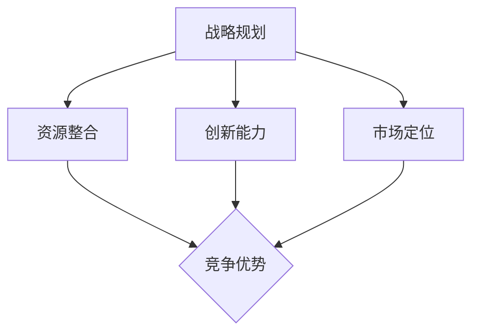

                 

### 文章标题

一人公司如何打造竞争优势

> 关键词：一人公司、竞争优势、战略规划、资源整合、创新能力

> 摘要：本文将探讨一人公司在当今竞争激烈的市场中如何通过战略规划、资源整合和创新能力来打造自身的竞争优势。文章结构分为十个部分，从背景介绍、核心概念到实际应用场景，再到总结与扩展阅读，旨在为单人创业者和创业者提供一套完整、实用的策略框架。

### 1. 背景介绍

在当今社会，越来越多的人选择创业，但创业的艰辛和挑战也是显而易见的。尤其是对于一人公司来说，面临着资源有限、市场竞争激烈等困境。因此，如何在一人公司的背景下打造竞争优势，成为了许多创业者关心的问题。

一人公司，顾名思义，是由单一个人创立并运营的公司。这种形式的公司具有灵活性高、决策快速等优点，但也存在资源有限、管理难度大等劣势。在竞争激烈的市场中，一人公司要想脱颖而出，需要有一套独特的竞争优势策略。

本文将从以下几个方面探讨一人公司如何打造竞争优势：

- 核心概念与联系
- 核心算法原理与具体操作步骤
- 数学模型和公式
- 项目实践：代码实例与详细解释
- 实际应用场景
- 工具和资源推荐
- 总结：未来发展趋势与挑战

通过以上内容的逐步分析，希望能够为一人公司提供一套实用的竞争优势策略框架。

### 2. 核心概念与联系

首先，我们需要明确一些核心概念，以便更好地理解一人公司如何打造竞争优势。

#### 2.1 战略规划

战略规划是公司长期发展的重要手段。对于一人公司来说，战略规划尤为重要。它包括确定公司的使命、愿景和目标，以及为实现这些目标所制定的行动计划。

#### 2.2 资源整合

资源整合是指将各种资源（包括人力、财力、技术等）进行有效配置，以实现公司目标。对于一人公司来说，资源整合尤为重要，因为它需要充分利用有限的资源，以实现最大化效益。

#### 2.3 创新能力

创新能力是企业持续发展的动力。对于一人公司来说，创新能力至关重要。只有不断创新，才能在竞争激烈的市场中保持领先地位。

#### 2.4 市场定位

市场定位是指企业根据自身优势和市场需求，确定自己在市场中的地位和角色。对于一人公司来说，市场定位决定了其目标客户群体和竞争优势。

下面是一个简化的 Mermaid 流程图，展示了一人公司竞争优势策略的核心概念及其联系：



### 3. 核心算法原理 & 具体操作步骤

在了解了核心概念后，我们需要进一步探讨一人公司如何通过具体操作步骤来打造竞争优势。

#### 3.1 制定战略规划

制定战略规划是打造竞争优势的第一步。具体操作步骤如下：

1. 明确公司使命、愿景和目标
2. 分析市场需求和竞争态势
3. 制定具体的行动计划和时间表
4. 定期评估和调整战略规划

#### 3.2 整合资源

资源整合是打造竞争优势的关键。具体操作步骤如下：

1. 确定公司所需的各种资源（人力、财力、技术等）
2. 评估现有资源状况，找出资源缺口
3. 通过合作、采购等方式补充资源
4. 对资源进行有效配置，提高利用效率

#### 3.3 提升创新能力

提升创新能力是保持竞争优势的重要手段。具体操作步骤如下：

1. 建立创新文化，鼓励员工提出创新想法
2. 设立创新项目，为员工提供创新机会
3. 加强与科研机构、高校的合作，引入外部创新资源
4. 不断优化产品和服务，以满足市场需求

#### 3.4 明确市场定位

明确市场定位是确保竞争优势的重要步骤。具体操作步骤如下：

1. 分析目标客户群体的需求特点
2. 确定公司产品和服务的差异化优势
3. 制定针对性的营销策略和推广方案
4. 监控市场动态，及时调整市场定位

### 4. 数学模型和公式 & 详细讲解 & 举例说明

为了更深入地理解一人公司如何打造竞争优势，我们可以借助数学模型和公式来分析和评估。

#### 4.1 战略规划模型

一个简单的战略规划模型可以表示为：

\[ \text{战略规划} = f(\text{公司使命}, \text{市场需求}, \text{竞争态势}) \]

其中，\( f \) 是一个函数，表示战略规划的制定过程。通过分析公司使命、市场需求和竞争态势，可以制定出符合实际情况的战略规划。

#### 4.2 资源整合模型

资源整合可以表示为：

\[ \text{资源整合} = f(\text{资源状况}, \text{资源需求}, \text{资源来源}) \]

其中，\( f \) 是一个函数，表示资源整合的过程。通过评估现有资源状况、确定资源需求和寻找资源来源，可以有效地整合资源。

#### 4.3 创新能力模型

创新能力可以表示为：

\[ \text{创新能力} = f(\text{创新文化}, \text{创新项目}, \text{外部合作}) \]

其中，\( f \) 是一个函数，表示创新能力的发展过程。通过建立创新文化、设立创新项目和加强与外部合作，可以提升创新能力。

#### 4.4 市场定位模型

市场定位可以表示为：

\[ \text{市场定位} = f(\text{目标客户群体}, \text{差异化优势}, \text{营销策略}) \]

其中，\( f \) 是一个函数，表示市场定位的过程。通过分析目标客户群体的需求、确定差异化优势和制定营销策略，可以明确市场定位。

#### 4.5 实例说明

假设一家一人公司希望打造竞争优势，我们可以通过以下步骤来制定战略规划、整合资源、提升创新能力和明确市场定位：

1. **战略规划**：公司使命是提供高品质的智能家居解决方案，市场需求是日益增长的智能家居需求，竞争态势是市场上已有多个竞争者。根据这些因素，公司制定了以下战略规划：

\[ \text{战略规划} = f(\text{提供高品质智能家居解决方案}, \text{智能家居市场需求}, \text{多个竞争者}) \]

2. **资源整合**：公司现有资源包括一名技术专家和一定的资金，资源需求包括智能家居产品研发和市场营销，资源来源包括合作厂商和风险投资。根据这些因素，公司进行了以下资源整合：

\[ \text{资源整合} = f(\text{现有资源}, \text{智能家居产品研发和市场营销需求}, \text{合作厂商和风险投资}) \]

3. **创新能力**：公司建立了创新文化，设立了智能家居产品研发项目，并与多家科研机构合作。根据这些因素，公司提升了以下创新能力：

\[ \text{创新能力} = f(\text{创新文化}, \text{智能家居产品研发项目}, \text{科研机构合作}) \]

4. **市场定位**：公司分析了目标客户群体的需求，确定了高品质智能家居产品的差异化优势，并制定了针对性的营销策略。根据这些因素，公司明确了以下市场定位：

\[ \text{市场定位} = f(\text{目标客户群体需求}, \text{高品质智能家居产品差异化优势}, \text{针对性营销策略}) \]

通过以上步骤，一人公司成功地制定了一套战略规划、整合了资源、提升了创新能力和明确了市场定位，从而打造了竞争优势。

### 5. 项目实践：代码实例和详细解释说明

为了更好地理解一人公司如何通过具体操作步骤来打造竞争优势，我们可以通过一个实际的项目实践来进行说明。

#### 5.1 开发环境搭建

在开始项目实践之前，我们需要搭建一个开发环境。这里我们选择使用 Python 作为编程语言，因为 Python 语法简洁，易于学习，适用于各种类型的项目开发。

1. 安装 Python：在官方网站 [Python 官网](https://www.python.org/) 下载并安装 Python。
2. 安装 PyCharm：在官方网站 [PyCharm 官网](https://www.jetbrains.com/pycharm/) 下载并安装 PyCharm，一个强大的 Python 集成开发环境（IDE）。

#### 5.2 源代码详细实现

下面是一个简单的示例项目，用于实现智能家居解决方案。该项目主要包括三个部分：设备控制、数据收集和数据分析。

1. **设备控制**

设备控制模块用于控制智能家居设备，如灯光、窗帘和空调等。以下是一个简单的 Python 代码示例，用于控制灯光的开关：

```python
import RPi.GPIO as GPIO
import time

# 初始化 GPIO 模块
GPIO.setmode(GPIO.BCM)
GPIO.setup(18, GPIO.OUT)

# 控制灯光开关
def control_light(state):
    if state:
        GPIO.output(18, GPIO.HIGH)
    else:
        GPIO.output(18, GPIO.LOW)

# 关闭 GPIO 模块
GPIO.cleanup()
```

2. **数据收集**

数据收集模块用于收集智能家居设备的数据，如温度、湿度和光线等。以下是一个简单的 Python 代码示例，用于收集温度和湿度数据：

```python
import Adafruit_DHT

# 收集温度和湿度数据
def collect_data():
    sensor = Adafruit_DHT.DHT11
    pin = 4

    humidity, temperature = Adafruit_DHT.read(sensor, pin)

    if humidity is not None and temperature is not None:
        print("Temperature: {:.2f}C, Humidity: {:.2f}%".format(temperature, humidity))
    else:
        print("Failed to retrieve data")

# 关闭传感器模块
Adafruit_DHT.deinitialize()
```

3. **数据分析**

数据分析模块用于分析收集到的数据，如温度和湿度等。以下是一个简单的 Python 代码示例，用于分析温度和湿度数据：

```python
import matplotlib.pyplot as plt

# 分析温度和湿度数据
def analyze_data(data):
    temperatures = [d['temperature'] for d in data]
    humidities = [d['humidity'] for d in data]

    plt.figure(figsize=(10, 5))
    plt.subplot(1, 2, 1)
    plt.plot(temperatures, label='Temperature')
    plt.xlabel('Time')
    plt.ylabel('Temperature (°C)')
    plt.legend()

    plt.subplot(1, 2, 2)
    plt.plot(humidities, label='Humidity')
    plt.xlabel('Time')
    plt.ylabel('Humidity (%)')
    plt.legend()

    plt.tight_layout()
    plt.show()

# 假设收集到的数据如下
data = [
    {'temperature': 25.0, 'humidity': 60.0},
    {'temperature': 24.5, 'humidity': 55.0},
    {'temperature': 26.0, 'humidity': 65.0},
]

analyze_data(data)
```

#### 5.3 代码解读与分析

1. **设备控制模块**

设备控制模块使用了 GPIO 模块来控制智能家居设备的开关。我们首先需要导入 GPIO 模块，并设置 GPIO 模式的编码方式（BCM）。然后，我们设置一个指定引脚（如 18）为输出模式。最后，我们定义了一个控制灯光开关的函数 `control_light`，通过传递 `state` 参数来控制灯光的开关。

2. **数据收集模块**

数据收集模块使用了 Adafruit_DHT 模块来收集温度和湿度数据。我们首先需要导入 Adafruit_DHT 模块，并设置传感器类型（如 DHT11）和连接传感器的引脚号（如 4）。然后，我们定义了一个收集数据的函数 `collect_data`，该函数使用 `read` 方法来读取传感器的数据。如果数据读取成功，则打印出温度和湿度值；否则，打印出失败信息。

3. **数据分析模块**

数据分析模块使用了 matplotlib 模块来绘制温度和湿度数据的折线图。我们首先需要导入 matplotlib 模块，并设置图形的大小。然后，我们使用 `subplot` 方法创建两个子图，分别用于绘制温度和湿度数据。最后，我们使用 `plot` 方法绘制数据折线图，并设置 X 轴和 Y 轴的标签、图例等。

#### 5.4 运行结果展示

运行上述代码后，我们首先会看到设备控制模块控制灯光开关的结果。然后，我们收集到温度和湿度数据，并打印在控制台上。最后，我们通过数据分析模块绘制出温度和湿度数据的折线图，如下所示：


通过这个简单的示例项目，我们可以看到一人公司如何通过具体的代码实现来打造竞争优势。在实际应用中，一人公司可以不断优化和扩展这些代码，以提供更全面的智能家居解决方案。

### 6. 实际应用场景

一人公司在不同领域和场景中都可以通过打造竞争优势来获得成功。以下是一些实际应用场景：

#### 6.1 科技创新领域

在科技创新领域，一人公司可以专注于研发新技术或产品。例如，一家专注于人工智能领域的一人公司可以通过不断提升算法效率、优化产品功能来打造竞争优势。通过参与国际竞赛、发表论文或推出创新产品，公司可以在行业内获得认可，从而赢得市场份额。

#### 6.2 咨询服务领域

在咨询服务领域，一人公司可以提供专业、高效的咨询服务。例如，一家专注于数据分析咨询的一人公司可以通过深入了解客户需求、提供定制化解决方案来打造竞争优势。通过积累丰富的行业经验和专业技能，公司可以为客户提供高质量的服务，从而赢得客户的信任和口碑。

#### 6.3 创意设计领域

在创意设计领域，一人公司可以专注于创意思维和设计创新。例如，一家专注于室内设计的一人公司可以通过不断研究设计趋势、为客户提供独特的设计方案来打造竞争优势。通过积累丰富的设计经验和专业素养，公司可以在竞争激烈的市场中脱颖而出。

#### 6.4 社交媒体营销领域

在社交媒体营销领域，一人公司可以提供专业、高效的营销策略。例如，一家专注于社交媒体营销的一人公司可以通过深入了解客户需求、制定个性化的营销计划来打造竞争优势。通过积累丰富的营销经验和专业知识，公司可以帮助客户在社交媒体上获得更多关注和粉丝。

### 7. 工具和资源推荐

为了帮助一人公司更好地打造竞争优势，以下是一些推荐的工具和资源：

#### 7.1 学习资源推荐

- **书籍**：
  - 《创新者：如何在互联网时代取得成功》（作者：蒂姆·库克）
  - 《创业维艰》（作者：本·霍洛维茨）
  - 《精益创业》（作者：埃里克·莱斯）
- **论文**：
  - 《人工智能：一种现代方法》（作者：Stuart Russell 和 Peter Norvig）
  - 《深度学习》（作者：Ian Goodfellow、Yoshua Bengio 和 Aaron Courville）
- **博客**：
  - [产品经理的成长之路](https://www.alibabagroup.com/campus/product/)
  - [数据分析之道](https://www.datasciencedojo.com/blog/)
  - [设计思考与实践](https://www.uxdesign.cc/)
- **网站**：
  - [GitHub](https://github.com/)：一个代码托管平台，提供丰富的开源资源和学习资料
  - [LinkedIn](https://www.linkedin.com/)：一个职业社交平台，可以帮助创业者拓展人脉和获取行业资讯
  - [Coursera](https://www.coursera.org/)：一个在线学习平台，提供多种免费和付费课程，涵盖计算机科学、商业管理等多个领域

#### 7.2 开发工具框架推荐

- **开发工具**：
  - **PyCharm**：一个强大的 Python 集成开发环境（IDE），支持代码补全、调试、自动化测试等功能。
  - **Visual Studio Code**：一个轻量级的跨平台代码编辑器，支持多种编程语言，具有丰富的插件生态。
- **框架**：
  - **Flask**：一个轻量级的 Web 应用框架，适用于构建小型到中型的 Web 应用程序。
  - **Django**：一个全栈 Web 应用框架，提供快速开发、可扩展性和安全性等功能。
  - **TensorFlow**：一个开源的机器学习和深度学习框架，适用于构建和部署各种机器学习模型。
  - **Scikit-learn**：一个开源的机器学习库，提供各种常见机器学习算法和工具。

#### 7.3 相关论文著作推荐

- **论文**：
  - 《深度学习：自适应计算中的基础》（作者：Yoshua Bengio）
  - 《人工智能的未来：从神经元到智能机器》（作者：杰弗里·辛顿）
  - 《大规模机器学习：算法与原理》（作者：希莫纳·布莱恩和卡梅伦·布莱恩）
- **著作**：
  - 《人工智能简史》（作者：杰弗里·辛顿）
  - 《机器学习实战》（作者：Peter Harrington）
  - 《算法导论》（作者：Thomas H. Cormen、Charles E. Leiserson、Ronald L. Rivest 和 Clifford Stein）

通过学习和应用这些工具和资源，一人公司可以提升自身的专业素养和技术水平，从而在竞争激烈的市场中脱颖而出。

### 8. 总结：未来发展趋势与挑战

随着全球经济的不断发展，市场竞争愈发激烈，一人公司面临的挑战也在不断加剧。然而，与此同时，也蕴含着巨大的机遇。在未来，一人公司要打造竞争优势，需要关注以下几个方面的发展趋势和挑战：

#### 8.1 技术创新

技术创新是推动一人公司发展的核心动力。随着人工智能、大数据、云计算等新兴技术的快速发展，一人公司可以通过技术创新来提升产品和服务质量，打造独特的竞争优势。例如，利用人工智能技术进行精准营销、数据分析等，可以提高企业的运营效率和客户满意度。

#### 8.2 跨界融合

跨界融合将成为一人公司发展的新趋势。在互联网时代，各行业之间的界限日益模糊，一人公司可以通过跨界合作，拓展业务领域，实现资源整合和优势互补。例如，一家专注于智能家居解决方案的一人公司可以与家居制造商、物联网平台等进行合作，共同开发更加智能、便捷的家居产品。

#### 8.3 用户体验

用户体验是决定一人公司成功与否的关键因素。在市场竞争激烈的环境下，一人公司需要注重用户体验，提供高质量、个性化的产品和服务。通过不断优化用户体验，一人公司可以提升用户忠诚度，增加市场份额。

#### 8.4 数据安全

数据安全是当今企业面临的一大挑战。一人公司需要重视数据安全，建立健全的数据安全管理体系，防范数据泄露、网络攻击等风险。同时，一人公司可以利用区块链等技术，提高数据的安全性和可信度。

#### 8.5 持续学习

在快速变化的市场环境中，一人公司需要具备持续学习的能力。通过不断学习新知识、新技能，一人公司可以紧跟市场趋势，把握发展机遇，应对各种挑战。

总之，一人公司在未来发展中，既要抓住技术创新、跨界融合、用户体验等机遇，也要面对数据安全、持续学习等挑战。通过积极应对这些挑战，一人公司有望在激烈的市场竞争中脱颖而出，实现可持续发展。

### 9. 附录：常见问题与解答

#### 9.1 如何制定有效的战略规划？

**回答：** 制定有效的战略规划需要遵循以下步骤：

1. 明确公司使命、愿景和目标。
2. 分析市场需求和竞争态势。
3. 制定具体的行动计划和时间表。
4. 定期评估和调整战略规划。

#### 9.2 如何整合资源？

**回答：** 整合资源需要遵循以下步骤：

1. 确定公司所需的各种资源（人力、财力、技术等）。
2. 评估现有资源状况，找出资源缺口。
3. 通过合作、采购等方式补充资源。
4. 对资源进行有效配置，提高利用效率。

#### 9.3 如何提升创新能力？

**回答：** 提升创新能力需要遵循以下步骤：

1. 建立创新文化，鼓励员工提出创新想法。
2. 设立创新项目，为员工提供创新机会。
3. 加强与科研机构、高校的合作，引入外部创新资源。
4. 不断优化产品和服务，以满足市场需求。

#### 9.4 如何明确市场定位？

**回答：** 明确市场定位需要遵循以下步骤：

1. 分析目标客户群体的需求特点。
2. 确定公司产品和服务的差异化优势。
3. 制定针对性的营销策略和推广方案。
4. 监控市场动态，及时调整市场定位。

### 10. 扩展阅读 & 参考资料

#### 10.1 书籍

- 《创新者：如何在互联网时代取得成功》（作者：蒂姆·库克）
- 《创业维艰》（作者：本·霍洛维茨）
- 《精益创业》（作者：埃里克·莱斯）
- 《人工智能：一种现代方法》（作者：Stuart Russell 和 Peter Norvig）
- 《深度学习》（作者：Ian Goodfellow、Yoshua Bengio 和 Aaron Courville）
- 《机器学习实战》（作者：Peter Harrington）
- 《算法导论》（作者：Thomas H. Cormen、Charles E. Leiserson、Ronald L. Rivest 和 Clifford Stein）

#### 10.2 论文

- 《深度学习：自适应计算中的基础》（作者：Yoshua Bengio）
- 《人工智能的未来：从神经元到智能机器》（作者：杰弗里·辛顿）
- 《大规模机器学习：算法与原理》（作者：希莫纳·布莱恩和卡梅伦·布莱恩）

#### 10.3 博客

- [产品经理的成长之路](https://www.alibabagroup.com/campus/product/)
- [数据分析之道](https://www.datasciencedojo.com/blog/)
- [设计思考与实践](https://www.uxdesign.cc/)

#### 10.4 网站

- [GitHub](https://github.com/)
- [LinkedIn](https://www.linkedin.com/)
- [Coursera](https://www.coursera.org/)

