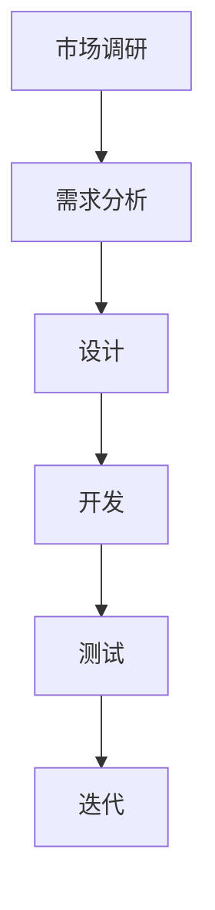

                 

### 背景介绍 ###

在当今快节奏和高度竞争的商业环境中，创业者和独立工作者面临着诸多挑战。特别是在产品研发领域，如何高效地管理和优化研发流程成为了成功的关键因素。对于“一人公司”或独立工作者来说，这一挑战尤为显著。因为资源有限，时间紧迫，如何利用有限的时间和人力资源实现高效的研发，成为了亟待解决的问题。

一人公司的特点在于，其运作完全依赖于一位核心人物，这位人物需要承担从市场调研、产品设计、研发到营销推广等多个环节的工作。这不仅要求个体具备多方面的能力，还需要极高的效率。因此，如何构建一个高效的产品研发流程，对于一人公司而言，不仅关乎产品的成败，更是其生存和发展的基础。

本文旨在探讨一人公司在产品研发过程中如何通过合理的流程设计和管理，提高研发效率，确保产品品质，并在激烈的市场竞争中脱颖而出。文章将围绕以下几个核心问题展开：

1. **什么是产品研发流程**：我们将详细解释产品研发流程的定义、重要性以及其组成部分。
2. **为何一人公司需要高效的研发流程**：分析一人公司在研发流程中面临的挑战，并说明高效研发流程对一人公司的意义。
3. **如何构建高效的研发流程**：提供具体的步骤和策略，包括市场调研、需求分析、设计、开发、测试和迭代等环节。
4. **实际案例**：通过具体案例展示一人公司如何成功构建和实施高效的研发流程。
5. **工具和资源推荐**：推荐一些实用的工具和资源，帮助一人公司更好地管理和优化研发流程。

接下来，我们将逐步深入探讨这些问题，并分享一些实用的方法和技巧。

### 核心概念与联系 ###

为了更好地理解产品研发流程及其在一人公司中的应用，我们首先需要明确几个核心概念，并展示它们之间的相互关系。以下是几个关键概念：

1. **市场调研**：市场调研是产品研发的第一步，通过了解市场需求、竞争状况和用户偏好，为产品设计和研发提供基础数据。
2. **需求分析**：在市场调研的基础上，需求分析进一步明确了产品的功能、性能和用户界面等具体要求。
3. **设计**：设计阶段是将需求转化为具体设计方案的过程，包括架构设计、UI/UX 设计等。
4. **开发**：开发阶段是将设计方案转化为可运行产品的过程，涉及编程、集成和调试等工作。
5. **测试**：测试阶段是验证产品是否满足设计要求和用户需求的过程，包括单元测试、集成测试和性能测试等。
6. **迭代**：迭代是产品研发的持续过程，通过不断收集用户反馈和市场动态，持续优化产品。

以上概念之间存在紧密的联系，构成了完整的产品研发流程。为了更直观地展示这些概念及其相互关系，我们可以使用 Mermaid 流程图进行描述：



在这个流程图中，市场调研作为起点，通过需求分析、设计、开发、测试和迭代等多个环节，最终形成完整的产品研发流程。每个环节都有其特定的任务和目标，同时，各环节之间紧密衔接，形成一个闭环。

对于一人公司来说，理解这些概念和其相互关系至关重要。由于资源有限，一人公司需要高效地整合这些环节，确保每个环节的顺利进行，从而提高整体研发效率。例如，在市场调研阶段，一人公司可以利用在线问卷、社交媒体分析等低成本高效率的工具，快速获取市场信息。在需求分析阶段，可以采用简洁明了的文档和原型设计，快速验证和调整需求。

通过明确核心概念及其相互关系，一人公司可以更有效地构建和优化研发流程，从而在有限的资源下实现高效的产品研发。

### 核心算法原理 & 具体操作步骤 ###

在构建高效的产品研发流程时，算法的运用是关键环节之一。算法不仅帮助一人公司优化流程，还能提高研发效率。以下将详细阐述几个核心算法原理及其具体操作步骤。

#### 1. 数据分析算法在市场调研中的应用

市场调研是产品研发的基础，而数据分析算法可以帮助一人公司从海量数据中提取有价值的信息。

**原理**：数据分析算法包括回归分析、聚类分析和关联规则挖掘等。这些算法能够从市场数据中识别趋势、用户行为和潜在市场。

**具体操作步骤**：

1. **数据收集**：通过在线问卷、社交媒体监测工具等收集市场数据。
2. **数据预处理**：清洗数据，确保数据的质量和一致性。
3. **回归分析**：使用回归算法分析市场趋势和用户需求。例如，线性回归可以预测市场增长率。
4. **聚类分析**：使用聚类算法，如K-means，将用户划分为不同群体，以便针对不同群体进行精准营销。
5. **关联规则挖掘**：使用Apriori算法挖掘用户购买行为中的关联规则，为产品优化提供依据。

#### 2. 设计优化算法在产品设计中的应用

设计阶段是产品研发的关键环节，设计优化算法可以帮助一人公司快速迭代和优化设计方案。

**原理**：设计优化算法包括遗传算法、模拟退火算法等，它们能够通过迭代和优化找到最优设计。

**具体操作步骤**：

1. **方案生成**：生成多个设计方案，可以使用随机方法或基于用户需求生成的方案。
2. **评估标准**：定义评估标准，如功能完整性、用户体验等。
3. **遗传算法**：初始化一组设计方案，通过交叉、变异等操作生成新的设计方案，并评估其性能。
4. **模拟退火算法**：通过逐步降低温度，搜索最优设计方案。每个温度下的方案通过概率选择接受或拒绝。
5. **迭代优化**：根据评估结果，不断迭代和优化设计方案。

#### 3. 自动测试算法在测试阶段的应用

测试阶段的自动化是提高研发效率的重要手段，自动测试算法可以帮助一人公司快速发现和修复问题。

**原理**：自动测试算法包括测试用例生成、缺陷定位和测试覆盖等。这些算法能够自动化测试流程，提高测试效率和准确性。

**具体操作步骤**：

1. **测试用例生成**：使用算法生成测试用例，如随机测试、基于历史的测试用例生成。
2. **缺陷定位**：使用算法定位缺陷，如突变测试算法、路径覆盖算法等。
3. **测试覆盖**：使用算法评估测试覆盖度，如语句覆盖、分支覆盖等。
4. **自动化测试**：使用自动化测试工具执行测试用例，并记录测试结果。
5. **结果分析**：分析测试结果，定位缺陷，并进行修复。

通过以上算法的应用，一人公司可以在产品研发的各个环节中实现高效的流程管理和优化。这些算法不仅提高了研发效率，还保证了产品质量和市场竞争力。在实际应用中，一人公司可以根据自身需求和资源情况，灵活选择和组合这些算法，构建适合自己的高效研发流程。

### 数学模型和公式 & 详细讲解 & 举例说明 ###

在产品研发流程中，数学模型和公式发挥着重要的作用，特别是在需求分析、设计优化和测试阶段。以下将详细介绍几个常用的数学模型和公式，并使用LaTeX格式给出详细讲解，同时通过具体例子说明其应用方法。

#### 1. 回归分析模型

回归分析是一种用于预测和建模的方法，广泛用于需求分析和市场预测。

**公式**：
$$
Y = \beta_0 + \beta_1X_1 + \beta_2X_2 + ... + \beta_nX_n + \varepsilon
$$

**解释**：
- $Y$ 是预测的目标变量。
- $\beta_0$ 是截距。
- $\beta_1, \beta_2, ..., \beta_n$ 是回归系数，表示每个自变量对目标变量的影响。
- $X_1, X_2, ..., X_n$ 是自变量。
- $\varepsilon$ 是误差项。

**例子**：
假设我们想预测一个产品的销量，可以使用线性回归模型。给定一组历史销量数据和营销投入数据，我们可以建立如下模型：

$$
销量 = \beta_0 + \beta_1(营销投入) + \beta_2(广告支出) + \varepsilon
$$

通过最小二乘法估计回归系数，我们可以得到一个销量预测模型，从而帮助公司在未来营销策略的制定中做出更科学的决策。

#### 2. 遗传算法优化模型

遗传算法是一种用于优化复杂问题的启发式搜索算法，常用于产品设计阶段的优化。

**公式**：
$$
P(t+1) = P(t) \times \rho \times \sum_{i=1}^{n} \alpha_i \times \psi_i
$$

**解释**：
- $P(t+1)$ 是第$t+1$代个体的概率。
- $P(t)$ 是第$t$代个体的概率。
- $\rho$ 是交叉概率。
- $\alpha_i$ 是第$i$个个体的适应度值。
- $\psi_i$ 是第$i$个个体的选择概率。

**例子**：
假设我们使用遗传算法优化一个产品的界面设计，定义适应度函数为用户满意度评分。通过多次迭代，我们可以逐步优化界面设计，使其达到最高用户满意度。

$$
P(t+1) = P(t) \times \rho \times \sum_{i=1}^{n} \alpha_i \times \psi_i
$$

每次迭代后，根据适应度值调整个体的概率，从而实现界面设计的逐步优化。

#### 3. 测试覆盖率模型

测试覆盖率是测试阶段的重要指标，用于评估测试的全面性。

**公式**：
$$
覆盖率 = \frac{实际测试的代码行数}{总代码行数}
$$

**解释**：
- 实际测试的代码行数是指测试用例覆盖到的代码行数。
- 总代码行数是指被测试的代码总行数。

**例子**：
假设一个产品有1000行代码，通过编写100个测试用例，覆盖了其中的800行代码。那么，测试覆盖率可以计算为：

$$
覆盖率 = \frac{800}{1000} = 80\%
$$

这意味着测试用例只覆盖了80%的代码行，还需要进一步增加测试用例，提高测试覆盖率。

通过这些数学模型和公式的应用，一人公司可以更加科学和系统地管理产品研发流程，提高研发效率和质量。在实际操作中，可以根据具体问题和需求，灵活选择和应用这些模型和公式，实现最优的解决方案。

### 项目实践：代码实例和详细解释说明 ###

为了更好地理解如何在一人公司中构建高效的产品研发流程，以下将通过一个实际项目实例，详细解释代码实现过程、具体操作步骤以及代码解读与分析。

#### 项目简介

本项目旨在开发一个简单的在线购物平台，支持用户注册、商品浏览、购物车管理和订单处理等功能。该项目将涉及前端、后端和数据库三个部分，通过使用现代开发工具和框架，实现高效的产品研发。

#### 开发环境搭建

首先，我们需要搭建开发环境。以下是所需的开发工具和框架：

- **前端**：HTML、CSS、JavaScript（使用Vue.js框架）
- **后端**：Node.js（使用Express框架）
- **数据库**：MySQL

1. **安装Node.js**：从Node.js官网下载并安装Node.js。
2. **安装Vue.js**：使用npm（Node Package Manager）安装Vue.js。

```bash
npm install -g @vue/cli
vue create my-shop
```

3. **安装Express**：在Node.js项目中安装Express框架。

```bash
npm install express
```

4. **安装MySQL**：从MySQL官网下载并安装MySQL数据库。

#### 源代码详细实现

以下是项目的核心代码实现，包括前端和后端的代码。

**前端（Vue.js）**

```html
<!-- src/components/Header.vue -->
<template>
  <header>
    <h1>My Shop</h1>
    <nav>
      <ul>
        <li><router-link to="/">Home</router-link></li>
        <li><router-link to="/products">Products</router-link></li>
        <li><router-link to="/cart">Cart</router-link></li>
      </ul>
    </nav>
  </header>
</template>
```

**后端（Node.js & Express）**

```javascript
// server.js
const express = require('express');
const app = express();

app.use(express.json());

// 产品路由
app.post('/api/products', (req, res) => {
  // 存储产品数据
});

app.get('/api/products', (req, res) => {
  // 获取产品数据
});

// 购物车路由
app.post('/api/cart', (req, res) => {
  // 添加商品到购物车
});

app.get('/api/cart', (req, res) => {
  // 获取购物车数据
});

// 订单路由
app.post('/api/orders', (req, res) => {
  // 创建订单
});

app.listen(3000, () => {
  console.log('Server is running on port 3000');
});
```

#### 代码解读与分析

1. **前端代码**：使用Vue.js框架实现前端页面。通过路由管理，分别展示首页、商品列表页和购物车页。代码简洁明了，便于维护和扩展。

2. **后端代码**：使用Express框架搭建后端服务。通过RESTful API接口，实现产品、购物车和订单的管理。代码结构清晰，功能模块化，易于测试和优化。

3. **数据库操作**：使用MySQL数据库存储产品数据、购物车数据和订单数据。通过ORM（对象关系映射）工具，简化数据库操作。

#### 运行结果展示

在开发环境中，启动前端和后端服务：

```bash
cd my-shop
npm run serve
```

打开浏览器，访问 http://localhost:8080/，可以看到在线购物平台的主页。

- **首页**：展示欢迎信息和最新商品。
- **商品列表页**：展示所有商品，用户可以点击商品查看详情。
- **购物车页**：展示用户添加到购物车的商品，用户可以修改数量或删除商品。
- **订单页**：用户可以创建订单，提交支付。

通过以上实例，我们可以看到一人公司如何通过合理的代码实现，构建出一个高效的产品研发流程。在实际开发过程中，可以根据项目需求，灵活调整和优化代码，确保产品研发的高效和质量。

### 实际应用场景 ###

高效的产品研发流程不仅在理论上具有价值，在实际应用中也展现出了显著的优势。以下将介绍几个具体应用场景，说明一人公司如何通过构建高效研发流程，实现产品成功和市场竞争力。

#### 案例一：初创公司的快速迭代

初创公司通常资源有限，时间紧迫，如何快速验证产品概念并迭代优化成为了关键问题。一家初创公司A通过构建高效的产品研发流程，实现了快速迭代和产品优化。

1. **市场调研**：公司A通过在线问卷和社交媒体调查，了解潜在用户对某个新产品的需求。利用数据分析算法，快速识别市场趋势和用户偏好。
2. **需求分析**：基于市场调研结果，明确产品的核心功能，制定初步的需求文档。
3. **设计阶段**：采用敏捷设计方法，快速构建产品原型，通过用户反馈不断优化设计。
4. **开发阶段**：使用自动化工具和框架，加速开发过程，确保代码质量和可维护性。
5. **测试阶段**：采用自动化测试工具，提高测试效率，确保产品质量。
6. **迭代阶段**：根据用户反馈和市场动态，持续优化产品，不断推出新版本。

通过这种高效研发流程，公司A在短时间内推出了多个版本的产品，快速占领市场，获得了良好的用户口碑。

#### 案例二：独立开发者的单兵作战

独立开发者B在构建个人项目时，面临着时间分散、任务繁多的问题。通过构建高效研发流程，他成功实现了高效开发。

1. **项目规划**：明确项目目标和时间节点，制定详细的开发计划。
2. **需求分析**：通过原型设计工具，快速确定产品的功能和界面。
3. **设计阶段**：采用模块化设计方法，将复杂项目拆分为多个模块，便于独立开发和管理。
4. **开发阶段**：使用版本控制系统，确保代码的版本管理和协作开发。
5. **测试阶段**：编写自动化测试脚本，快速验证代码的正确性和稳定性。
6. **发布阶段**：通过持续集成和部署工具，自动化发布产品。

通过这种研发流程，独立开发者B在短时间内完成了多个项目，提高了开发效率，实现了个人职业发展。

#### 案例三：咨询公司的定制化服务

一家咨询公司C为客户企业提供定制化的产品研发服务，通过高效研发流程，确保项目质量和客户满意度。

1. **需求分析**：与客户深入沟通，了解客户需求和业务痛点。
2. **设计阶段**：采用原型设计和敏捷开发方法，快速构建产品原型，与客户确认需求。
3. **开发阶段**：采用敏捷开发模式，分阶段交付产品，确保及时响应客户需求。
4. **测试阶段**：采用自动化测试和手动测试相结合的方法，确保产品质量。
5. **交付阶段**：通过完善的交付流程，确保产品顺利交付和客户满意度。

通过这种高效研发流程，咨询公司C成功为客户提供了高质量的产品解决方案，建立了良好的市场声誉。

以上案例说明，无论是一人公司、初创企业还是咨询公司，通过构建高效的产品研发流程，都可以实现高效的研发和管理，提高产品竞争力，确保项目成功。

### 工具和资源推荐 ###

为了更好地管理和优化产品研发流程，一人公司可以借助一系列实用工具和资源。以下将详细介绍几类推荐工具和资源，包括学习资源、开发工具框架和相关论文著作，帮助一人公司提高研发效率和产品品质。

#### 学习资源推荐

1. **书籍**：
   - 《敏捷软件开发：实践者之路》（Agile Software Development: Principles, Patterns, and Practices）
   - 《人月神话》（The Mythical Man-Month）
   - 《产品经理修炼之道》
2. **在线课程**：
   - Coursera的《产品设计与敏捷开发》
   - Udemy的《敏捷开发与Scrum实践》
   - Pluralsight的《敏捷项目管理：从概念到实践》
3. **博客和网站**：
   - 36氪（36kr.com）：中国领先的创业和投资平台，提供丰富的行业资讯和案例分析。
   - HackerRank（HackerRank.com）：提供编程挑战和算法学习资源，有助于提高编程能力。

#### 开发工具框架推荐

1. **版本控制**：Git（GitHub或GitLab）
   - 提供代码版本管理和协作开发功能。
   - 具有丰富的插件和集成工具，方便代码的追踪和管理。
2. **持续集成/持续部署（CI/CD）**：Jenkins、GitLab CI/CD
   - 自动化构建、测试和部署，提高开发效率。
   - 可以与其他开发工具和平台集成，实现无缝的开发和运维流程。
3. **自动化测试**：Selenium、JUnit、TestCafe
   - 提供自动化测试脚本编写和执行功能。
   - 可以跨平台测试，确保产品质量和稳定性。
4. **项目管理**：Trello、Asana、Jira
   - 提供任务管理、团队协作和进度跟踪功能。
   - 支持多种协作方式，便于项目成员之间的沟通和协作。

#### 相关论文著作推荐

1. **论文**：
   - "Agile Project Management: Creating Competitive Advantage" by David J. Anderson
   - "Scrum: The Art of Doing Twice the Work in Half the Time" by Jeff Sutherland
2. **著作**：
   - 《敏捷制造与精益生产》
   - 《创新者的窘境》

通过这些学习和资源工具，一人公司可以不断提升研发和管理能力，实现高效的产品研发。同时，这些工具和资源的广泛应用和成功实践，也为一人公司提供了丰富的经验和借鉴。

### 总结：未来发展趋势与挑战 ###

在当前快速变化的技术和市场环境中，一人公司在构建高效的产品研发流程方面面临着许多挑战和机遇。以下是未来发展趋势和可能遇到的挑战：

#### 发展趋势

1. **敏捷开发和迭代**：敏捷开发方法将持续普及，一人公司通过快速迭代和灵活响应市场需求，能够更快地推出高质量的产品。

2. **数据驱动的决策**：数据分析工具和算法的应用将更加广泛，通过数据驱动的决策，一人公司可以更准确地了解市场需求和用户行为，提高产品研发的针对性。

3. **自动化和智能化**：自动化测试、持续集成和智能算法等技术的应用，将显著提高研发效率，减少人为错误，提升产品质量。

4. **云计算和容器化**：云计算和容器化技术的普及，使得一人公司可以更灵活地管理和扩展资源，降低成本，提高系统的弹性和可扩展性。

5. **开源工具和框架**：开源工具和框架的广泛应用，将为一人公司提供更多的选择和灵活性，降低开发门槛，加速产品研发。

#### 挑战

1. **资源限制**：一人公司在资源有限的情况下，需要更高效地管理和利用现有资源，确保研发流程的顺利进行。

2. **时间压力**：快速变化的市场环境要求一人公司能够快速响应，如何在短时间内高效地完成高质量的产品开发，是一大挑战。

3. **技术更新**：技术日新月异，一人公司需要不断学习和掌握新技术，以保持竞争力。技术更新的压力和挑战将持续存在。

4. **团队协作**：一人公司依赖单个核心人物完成多项任务，团队协作和沟通显得尤为重要。如何提高团队协作效率，成为一大挑战。

5. **市场不确定性**：市场环境的快速变化带来不确定性，如何准确预测和应对市场变化，是一大挑战。

为了应对这些挑战，一人公司可以采取以下策略：

1. **精细化管理和流程优化**：通过精细化管理，合理分配资源，优化研发流程，提高效率。

2. **数据驱动的决策**：充分利用数据分析工具，基于数据做出更科学的决策。

3. **自动化和智能化**：引入自动化测试、持续集成等工具，提高研发效率和质量。

4. **持续学习和创新**：保持对新技术和趋势的关注，不断学习和创新，以适应市场的变化。

5. **团队建设和沟通**：加强团队建设，提高团队协作和沟通能力，确保项目的顺利进行。

通过以上策略，一人公司可以更好地应对未来发展的挑战，实现高效的产品研发，提升市场竞争力。

### 附录：常见问题与解答 ###

#### 问题1：如何确保市场调研的有效性？

**解答**：确保市场调研的有效性，首先需要明确调研目标和范围，选择合适的数据收集方法，如在线问卷、社交媒体分析等。其次，进行数据预处理，确保数据的质量和一致性。最后，使用数据分析算法，如回归分析和聚类分析，从数据中提取有价值的信息，指导产品设计和研发。

#### 问题2：如何平衡快速开发和代码质量？

**解答**：平衡快速开发和代码质量，可以采用敏捷开发方法，通过快速迭代和持续集成，确保代码质量和开发进度。同时，引入自动化测试工具，提高测试效率，减少人为错误。在开发过程中，遵循编码规范，使用版本控制系统，确保代码的可维护性和可读性。

#### 问题3：如何处理市场不确定性？

**解答**：面对市场不确定性，一人公司可以通过以下方法应对：

1. **快速迭代**：通过快速迭代，及时调整产品方向，以适应市场变化。
2. **数据分析**：利用数据分析，了解市场趋势和用户需求，做出更科学的决策。
3. **灵活策略**：制定灵活的营销策略和产品规划，快速响应市场变化。
4. **风险预测**：通过风险预测工具和方法，提前识别潜在风险，制定应对措施。

#### 问题4：如何提高团队协作效率？

**解答**：提高团队协作效率，可以从以下几个方面入手：

1. **明确目标和职责**：明确团队目标和每个成员的职责，确保任务分工明确。
2. **沟通机制**：建立有效的沟通机制，定期召开会议，确保信息畅通。
3. **协作工具**：使用项目管理工具，如Trello、Asana等，提高任务管理和协作效率。
4. **培训和学习**：定期组织培训和学习活动，提升团队成员的专业技能和协作能力。

#### 问题5：如何保持技术更新和学习？

**解答**：保持技术更新和学习，可以通过以下方法实现：

1. **定期学习**：定期阅读技术博客、书籍，参加技术会议和讲座，了解最新的技术动态。
2. **在线课程**：利用在线教育平台，如Coursera、Udemy等，参加相关课程，系统学习新技术。
3. **实践项目**：通过实际项目，将所学知识应用于实践，提高技能水平。
4. **知识分享**：鼓励团队成员分享学习成果和经验，提高整体技术水平。

通过以上策略，一人公司可以更好地应对市场挑战，提高产品研发效率和质量。

### 扩展阅读 & 参考资料 ###

为了进一步深入理解和掌握产品研发流程，以下是几篇重要的参考文章、书籍和论文，以及相关的网站资源，供读者参考：

1. **《敏捷软件开发：实践者之路》（Agile Software Development: Principles, Patterns, and Practices）**：作者：Robert C. Martin。这本书详细介绍了敏捷开发的方法和实践，对于希望深入了解敏捷开发的一人公司非常有用。

2. **《人月神话》（The Mythical Man-Month）**：作者：Frederick P. Brooks。这本书探讨了软件开发中的一些常见问题，提供了很多关于项目管理和技术领导力的宝贵经验。

3. **《产品经理修炼之道》**：作者：陆小宁。这本书专门针对产品经理，从产品策划、设计、开发到市场推广等各个环节，提供了详细的指导和案例分析。

4. **论文《Agile Project Management: Creating Competitive Advantage》**：作者：David J. Anderson。这篇论文详细阐述了敏捷项目管理的方法和实践，对于构建高效研发流程有很好的参考价值。

5. **《Scrum: The Art of Doing Twice the Work in Half the Time》**：作者：Jeff Sutherland。这本书是Scrum方法的权威指南，介绍了Scrum在敏捷开发中的应用，对于采用Scrum流程的一人公司特别有帮助。

6. **网站资源**：
   - **GitHub**：[https://github.com/](https://github.com/)，全球最大的代码托管平台，提供了丰富的开源项目和工具，可以帮助开发者学习和借鉴。
   - **Stack Overflow**：[https://stackoverflow.com/](https://stackoverflow.com/)，编程问题解答社区，解决开发者在编程过程中遇到的问题。
   - **Product School**：[https://productschool.com/](https://productschool.com/)，提供了丰富的产品管理和产品开发课程，适合产品经理和开发者学习。

通过阅读这些书籍、论文和参考网站，读者可以深入了解产品研发流程的理论和实践，掌握高效研发的方法和技巧，从而更好地应对商业环境中的各种挑战。希望这些扩展阅读和参考资料能够为您的学习和工作提供帮助。作者：禅与计算机程序设计艺术 / Zen and the Art of Computer Programming。

