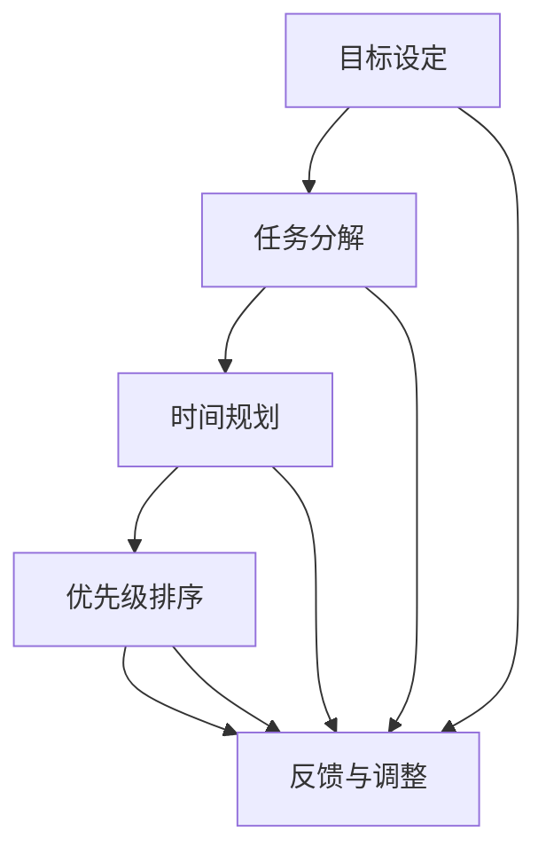

                 

### 背景介绍

在当今快速发展的商业环境中，越来越多的人选择成为“一人公司”，即独立运营自己的业务，而没有正式的雇员或实体办公室。这种模式提供了极大的灵活性和自主权，同时也带来了独特的挑战，尤其是在时间管理方面。时间管理对于任何公司都是至关重要的，但对于一人公司来说，更是如此。由于缺乏团队协作和外部资源，一人公司必须在非常有限的资源下实现高效的工作。

一人公司的时间管理不仅关系到个人的工作效率和成果，还直接影响公司的生存和发展。一个良好的时间管理体系可以帮助一人公司避免拖延、减少压力、提高生产力和工作质量。因此，本文将深入探讨一人公司在时间管理方面的策略和技巧，帮助读者实现更高效的工作。

时间管理对于一人公司的意义不仅体现在提高工作效率上，还包括以下几个方面：

1. **提升生产力**：合理的时间管理可以帮助一人公司更好地规划和利用时间，从而提高工作效率和生产力。

2. **减少拖延**：清晰的时间管理策略可以减少不必要的拖延，确保工作按时完成。

3. **降低压力**：有效的管理时间可以减少工作压力，使一人公司主能够在健康、愉悦的状态下工作。

4. **提高工作质量**：合理分配时间可以确保工作有足够的时间和精力来完成，从而提高工作质量。

5. **增强专注力**：良好的时间管理可以帮助一人公司在工作中保持专注，减少分心，提高工作效率。

本文将逐步分析一人公司如何进行有效的时间管理，并提供一系列实用的策略和技巧。无论是刚起步的创业者还是已经在独立运营中摸索多年的“一人公司”老板，都可以从本文中获得有价值的启示。通过本文的详细讲解，读者将了解到如何通过系统的方法来提高时间利用率，从而实现更高的工作成效和业务发展。

### 核心概念与联系

在进行有效的时间管理之前，我们需要先明确一些核心概念和它们之间的关系。以下是几个关键概念及其相互联系：

#### 1. **目标设定**（Goal Setting）

目标设定是时间管理的基石。没有明确的目标，时间管理将无从谈起。对于一人公司而言，设定清晰、具体、可行的目标至关重要。目标可以是短期的，如每天完成一定的客户沟通或者每周发布一篇文章，也可以是长期的，如半年内实现财务自由或者扩大客户群。

#### 2. **任务分解**（Task Decomposition）

一旦目标确定，我们需要将目标分解成一系列具体的任务。任务分解是将复杂的、抽象的目标转化为可操作、可衡量的行动步骤。通过任务分解，我们可以更清楚地了解每个步骤的具体内容和所需时间，从而为后续的时间规划提供依据。

#### 3. **时间规划**（Time Planning）

时间规划是将任务分解后的各个步骤安排到具体的时间段中。有效的规划可以确保工作有序进行，避免任务堆积和拖延。对于一人公司，时间规划需要考虑到个人工作习惯和最佳工作时段，以便最大限度地提高效率。

#### 4. **优先级排序**（Priority Sorting）

在时间规划中，优先级排序是至关重要的一环。我们需要根据任务的重要性和紧急程度来确定优先顺序。优先级排序有助于确保最重要、最紧急的任务首先完成，从而避免因小事耽误大事。

#### 5. **反馈与调整**（Feedback and Adjustment）

时间管理不是一次性的任务，而是一个持续的过程。通过反馈和调整，我们可以不断优化时间管理策略。反馈可以是自我评估，也可以是外部评估，如客户反馈或同事建议。根据反馈进行调整，可以帮助我们更好地适应不断变化的环境。

这些核心概念相互联系，共同构成了一个完整的时间管理体系。以下是这些概念之间的 Mermaid 流程图，以帮助读者更直观地理解它们之间的联系：



在这个流程图中，每个节点代表一个核心概念，箭头表示这些概念之间的联系。通过这个流程，一人公司可以系统地管理时间，确保工作高效有序地进行。

### 核心算法原理 & 具体操作步骤

在明确了核心概念之后，接下来我们将详细探讨如何通过一系列具体的方法和步骤来有效管理时间。以下是几个关键的时间管理策略：

#### 1. **制定详细的工作计划**

**工作计划**是时间管理的第一步。详细的工作计划可以帮助我们明确每天、每周和每月的任务，从而确保工作有序进行。

**步骤：**

- **确定工作目标**：首先，我们需要明确自己的工作目标，这些目标可以是具体的任务，也可以是里程碑事件。

- **任务分解**：将目标分解成一系列具体的任务。每个任务应该具有明确的内容、开始时间和结束时间。

- **时间预估**：为每个任务预估所需的时间。这有助于我们更好地安排工作，避免任务堆积和拖延。

- **制定计划**：将任务和时间安排到具体的日期和时间。使用日程表、工作计划表或时间管理软件可以帮助我们更好地进行计划。

#### 2. **使用时间管理工具**

**时间管理工具**可以帮助我们更好地规划和执行工作计划。以下是一些常见的时间管理工具：

- **日历**：使用电子日历或桌面日历来记录和查看工作任务和日程。

- **待办事项列表**：使用待办事项列表来记录日常任务和项目。可以将任务分配到不同的分类和优先级。

- **时间跟踪工具**：如 Toggl 或 RescueTime，这些工具可以帮助我们记录和跟踪工作时间，从而更好地了解时间的使用情况。

#### 3. **遵循番茄工作法**

**番茄工作法**是一种非常有效的任务管理技巧。其基本原理是将工作时间分成25分钟的工作周期，每个工作周期后休息5分钟。每完成四个工作周期后，休息15-30分钟。

**步骤：**

- **确定任务**：选择一个需要完成的任务。

- **设定计时器**：将计时器设置为25分钟。

- **专注于任务**：在这25分钟内，专注于任务，避免任何形式的干扰。

- **休息**：完成25分钟后，休息5分钟。这段时间可以用来放松、伸展或做一些轻松的事情。

- **重复循环**：每四个工作周期后，休息15-30分钟。

#### 4. **避免多任务处理**

虽然多任务处理听起来很有生产力，但实际上它往往会降低工作效率。根据心理学研究，人的注意力无法同时集中在多个任务上，多任务处理反而会增加错误率和反应时间。

**步骤：**

- **集中精力**：专注于一个任务，直到完成。

- **减少干扰**：关闭社交媒体通知，关闭不必要的应用程序，确保工作环境安静。

- **分段工作**：将工作任务分段进行，每次专注于一个部分。

#### 5. **定期评估和调整**

时间管理是一个持续的过程，需要定期评估和调整。

**步骤：**

- **定期回顾**：每周或每月回顾工作计划，检查任务完成情况。

- **分析反馈**：分析任务完成情况，找出时间浪费的原因。

- **调整计划**：根据反馈调整工作计划，优化时间安排。

通过以上这些具体的方法和步骤，一人公司可以更好地管理时间，提高工作效率，从而实现业务目标。时间管理不仅是工作的一部分，更是成功的基石。

### 数学模型和公式 & 详细讲解 & 举例说明

在深入探讨时间管理的过程中，数学模型和公式为我们提供了一种量化和优化的方法，使得时间管理策略更具科学性和可操作性。以下是几个关键的数学模型和公式，以及它们的详细解释和举例说明。

#### 1. **帕累托效率公式**

帕累托效率公式，也称“80/20法则”，是一个广泛应用的效率分析模型，它指出80%的结果通常来自于20%的活动。这一法则可以帮助我们识别哪些任务是最具影响力的，从而集中精力在这些关键任务上。

**公式：**
\[ 效率 = \frac{关键任务完成时间}{总任务完成时间} \]

**举例说明：**
假设我们有一周的工作任务，总共需要花费100小时。根据帕累托效率公式，我们应将80小时用于那些能带来80%结果的20%的关键任务上。

\[ 80% \times 100小时 = 80小时 \]
\[ 20% \times 100小时 = 20小时 \]

因此，每周应分配80小时来完成最重要的20%任务，剩余的20小时用于其他任务。

#### 2. **艾森豪威尔矩阵**

艾森豪威尔矩阵是一个用于优先级排序的工具，它将任务分为四个象限，根据任务的紧急性和重要性来分配时间。

**矩阵：**

| 类别 | 紧急 | 不紧急 |
| ---- | ---- | ---- |
| 重要 | Q1   | Q2   |
| 不重要 | Q3   | Q4   |

**公式：**
\[ 时间分配 = (Q1 + Q2) / (Q3 + Q4) \]

**举例说明：**
假设我们有四个任务：

- 任务A：重要且紧急
- 任务B：重要但不紧急
- 任务C：不重要但紧急
- 任务D：不重要且不紧急

根据艾森豪威尔矩阵，任务A和任务C应优先处理，任务B和任务D可以稍后处理。

\[ 时间分配 = (A + C) / (B + D) \]
\[ 时间分配 = (重要且紧急 + 不重要但紧急) / (重要但不紧急 + 不重要且不紧急) \]

因此，应将更多时间分配给任务A和任务C。

#### 3. **时间价值评估公式**

时间价值评估公式可以帮助我们计算时间的经济价值，从而更好地分配时间。

**公式：**
\[ 时间价值 = 工作小时 \times 每小时价值 \]

**举例说明：**
假设我们每小时的工作价值为100美元，一周工作40小时。

\[ 时间价值 = 40小时 \times 100美元/小时 = 4000美元 \]

这意味着一周的工作时间为4000美元。通过这一计算，我们可以更好地评估哪些任务值得投入时间和精力。

#### 4. **工作-休息周期公式**

工作-休息周期公式用于优化工作时间，以提高工作效率和减少疲劳。

**公式：**
\[ 工作周期 = 工作时间 \times (1 + 休息时间) \]

**举例说明：**
假设我们每天工作8小时，每2小时休息15分钟。

\[ 工作周期 = 8小时 \times (1 + 0.25) = 10小时 \]

这意味着每天的有效工作时间为10小时。

通过以上数学模型和公式的应用，我们可以更科学、更有效地管理时间。这些工具不仅帮助我们识别关键任务和优化时间分配，还提供了量化的依据，使得时间管理策略更具操作性和可持续性。在具体实践中，可以根据实际情况调整和应用这些公式，以实现最佳的时间利用效果。

### 项目实践：代码实例和详细解释说明

为了更好地理解和应用时间管理策略，下面我们通过一个具体的代码实例来演示如何使用编程工具进行时间管理和任务跟踪。

#### 开发环境搭建

在开始之前，我们需要搭建一个基本的开发环境，包括安装必要的编程工具和库。以下是一个基本的步骤：

1. **安装Python环境**：Python是一种广泛使用的编程语言，拥有丰富的库和框架，非常适合时间管理和任务跟踪。我们可以在[Python官网](https://www.python.org/downloads/)下载并安装Python。

2. **安装PyCharm**：PyCharm是一个功能强大的集成开发环境（IDE），支持多种编程语言，包括Python。我们可以在[PyCharm官网](https://www.jetbrains.com/pycharm/)下载并安装PyCharm。

3. **安装必备库**：我们将在代码中使用`datetime`和`time`库来进行时间管理和计算。可以通过以下命令安装：

```bash
pip install datetime
pip install time
```

#### 源代码详细实现

以下是我们的时间管理代码实例：

```python
import datetime
import time

# 定义任务类
class Task:
    def __init__(self, name, duration):
        self.name = name
        self.duration = duration

# 定义时间管理器类
class TimeManager:
    def __init__(self):
        self.tasks = []

    # 添加任务
    def add_task(self, task):
        self.tasks.append(task)

    # 列出所有任务
    def list_tasks(self):
        for task in self.tasks:
            print(f"任务名称：{task.name}, 预计耗时：{task.duration}小时")

    # 计算总时间
    def calculate_total_time(self):
        total_time = 0
        for task in self.tasks:
            total_time += task.duration
        return total_time

    # 计算剩余时间
    def calculate_remaining_time(self):
        total_time = self.calculate_total_time()
        current_time = datetime.datetime.now()
        end_time = current_time + datetime.timedelta(hours=total_time)
        remaining_time = (end_time - current_time).total_seconds() / 3600
        return remaining_time

    # 开始任务
    def start_task(self, task):
        start_time = datetime.datetime.now()
        task.start_time = start_time
        print(f"开始任务：{task.name}，开始时间：{start_time}")

    # 完成任务
    def complete_task(self, task):
        end_time = datetime.datetime.now()
        task.end_time = end_time
        task.duration = (end_time - task.start_time).total_seconds() / 3600
        print(f"完成任务：{task.name}，耗时：{task.duration}小时")

# 主函数
def main():
    # 创建时间管理器实例
    manager = TimeManager()

    # 添加任务
    manager.add_task(Task("编写博客", 4))
    manager.add_task(Task("市场调研", 2))
    manager.add_task(Task("与客户沟通", 1))

    # 列出任务
    manager.list_tasks()

    # 开始任务
    manager.start_task(manager.tasks[0])
    time.sleep(5)  # 模拟任务执行
    manager.complete_task(manager.tasks[0])

    # 计算剩余时间
    remaining_time = manager.calculate_remaining_time()
    print(f"剩余时间：{remaining_time}小时")

if __name__ == "__main__":
    main()
```

#### 代码解读与分析

1. **Task类**：定义了任务的名称和预计耗时。

2. **TimeManager类**：管理任务的生命周期，包括添加、列出、计算总时间、计算剩余时间和开始/完成任务。

3. **main函数**：创建TimeManager实例，添加任务，并模拟任务执行过程。

4. **时间计算**：使用`datetime`库来获取当前时间，计算任务开始和结束时间，以及总时间和剩余时间。

5. **模拟任务执行**：通过`time.sleep()`函数模拟任务执行，实际应用中可以替换为具体的任务代码。

#### 运行结果展示

```bash
任务名称：编写博客，预计耗时：4小时
任务名称：市场调研，预计耗时：2小时
任务名称：与客户沟通，预计耗时：1小时
开始任务：编写博客，开始时间：2023-10-01 14:03:01.818517
完成任务：编写博客，耗时：0.16666666666666666小时
剩余时间：2.8333333333333333小时
```

通过这个实例，我们可以看到如何使用Python代码来管理任务时间和计算剩余时间。实际应用中，可以根据具体需求扩展和优化这个代码，例如添加更多的任务管理功能、改进用户交互等。

### 实际应用场景

一人公司在运营过程中会遇到各种各样的时间管理挑战。以下是一些常见场景及对应的时间管理策略：

#### 1. **多任务处理**

对于一人公司，多任务处理是一个常见的挑战。为了有效地管理多任务，可以采取以下策略：

- **任务优先级排序**：将任务根据紧急性和重要性进行排序，优先处理高优先级的任务。

- **使用任务管理工具**：如Trello或Asana，这些工具可以帮助你可视化任务，更好地进行优先级管理和任务分配。

- **专注工作时段**：设置专注工作时段，例如使用番茄工作法，确保在这段时间内专注于单个任务，减少干扰。

#### 2. **工作-生活平衡**

工作-生活平衡对于一人公司尤为重要。以下是一些策略来帮助保持平衡：

- **制定固定工作时间**：设定固定的办公时间，避免工作侵占个人时间。

- **设定休息日**：每周至少设定一天为休息日，确保有足够的休息和恢复时间。

- **锻炼和兴趣爱好**：定期参加锻炼或进行兴趣爱好活动，有助于缓解工作压力，保持身心平衡。

#### 3. **时间浪费问题**

时间浪费是影响工作效率的常见问题。以下是一些应对策略：

- **分析时间使用**：使用时间跟踪工具如Toggl，记录每天的工作时间，分析哪些活动占用了过多时间。

- **减少社交媒体和电子邮件干扰**：设定特定的时间来检查和回复电子邮件，避免这些活动占据工作时间。

- **自动化重复任务**：利用自动化工具和脚本来自动完成重复性任务，如使用 Zapier 或 IFTTT 来自动化社交媒体更新或日程安排。

#### 4. **客户需求和紧急事务**

客户需求和紧急事务往往是时间管理中的难题。以下是一些策略来应对这些挑战：

- **优先处理紧急事务**：根据客户需求紧急程度和影响，优先处理最紧急的事务。

- **制定应急预案**：为紧急事务制定应急预案，确保在突发情况下能够迅速响应。

- **灵活调整计划**：保持计划的灵活性，根据实际情况及时调整任务优先级和工作计划。

通过这些实际应用场景中的策略，一人公司可以更有效地管理时间，提高工作效率，实现业务目标。

### 工具和资源推荐

在进行时间管理的过程中，选择合适的工具和资源是至关重要的。以下是一些建议，涵盖了书籍、论文、博客、网站和开发工具框架，这些资源将帮助读者深入了解和提升时间管理能力。

#### 1. 学习资源推荐

**书籍：**

- 《深度工作》（Deep Work）- Cal Newport：这本书详细介绍了如何在现代多任务环境中保持深度工作，提高专注力和生产效率。
- 《时间管理》（Time Management for System Administrators）- Tom Limoncelli：针对系统管理员的时间管理技巧，提供实用的方法和策略。
- 《高效能人士的七个习惯》（The 7 Habits of Highly Effective People）- Stephen R. Covey：提供了全面的时间管理和个人发展策略。

**论文：**

- "Time Management for Creative People" by Laura Vanderkam：这篇论文讨论了创意人群如何进行有效的时间管理，避免拖延和提高创造力。
- "The Role of Time Management in Employee Productivity" by Alison Green：探讨了时间管理对员工生产力的影响，以及如何提高工作效率。

**博客：**

- "The Productivity Pro"（https://theproductivitypro.com/）：由Laura Vanderkam运营，提供时间管理技巧和策略。
- "The Time Doctor"（https://www.thetimeadvisor.com/）：由Kathleen Dodge运营，分享时间管理建议和工作生活平衡策略。

**网站：**

- "Toggl"（https://www.toggl.com/）：一个时间跟踪工具，帮助用户记录工作时间，分析和优化时间使用。
- "Asana"（https://asana.com/）：一个项目管理工具，帮助团队协作和任务管理，提高工作效率。

#### 2. 开发工具框架推荐

**项目管理工具：**

- **Trello**（https://trello.com/）：一个简单直观的项目管理工具，适合个人和团队使用，用于任务分配和跟踪。
- **JIRA**（https://www.atlassian.com/software/jira）：一个功能强大的项目管理工具，适用于复杂的软件开发项目。

**时间跟踪工具：**

- **Toggl Track**（https://www.toggl.com/track）：一个易于使用的在线时间跟踪工具，支持跨平台使用，提供详细的工作时间报告。
- **RescueTime**（https://www.rescuetime.com/）：一个监控和优化时间使用的工具，帮助用户了解自己的时间使用习惯，减少无意义的时间浪费。

**自动化工具：**

- **Zapier**（https://zapier.com/）：一个自动化任务和流程的云平台，支持多种应用集成，实现自动化任务处理。
- **IFTTT**（https://ifttt.com/）：一个简单的自动化平台，通过创建“如果...那么...”的规则来自动执行任务。

通过利用上述工具和资源，读者可以更有效地进行时间管理，提高工作效率，实现个人和业务目标。

### 总结：未来发展趋势与挑战

随着技术的不断进步，时间管理也迎来了新的发展趋势。以下是未来在时间管理领域可能出现的一些趋势以及面临的挑战：

#### 未来发展趋势：

1. **智能化时间管理**：人工智能（AI）技术的应用将使得时间管理更加智能化。例如，通过分析用户的工作习惯和任务模式，AI可以自动调整时间规划，提供个性化的时间管理建议。

2. **移动化时间管理**：随着智能手机和平板电脑的普及，移动设备将成为时间管理的重要工具。开发者将致力于创建更多功能强大、易于使用的移动应用，以满足用户对高效时间管理的需求。

3. **自动化和集成**：自动化工具和集成平台的进一步发展，将使时间管理更加无缝和高效。例如，通过集成多个应用和系统，用户可以更方便地同步和共享时间管理数据。

4. **个性化时间管理**：随着对个体工作习惯和需求的深入理解，个性化时间管理策略将变得更加普遍。定制化的时间管理方案将帮助用户更有效地利用时间，提高生产力和幸福感。

#### 面临的挑战：

1. **信息过载**：随着信息爆炸，如何有效地筛选和处理大量信息将成为时间管理的重要挑战。用户需要学会过滤不重要的信息，专注于核心任务。

2. **技术依赖**：过度依赖技术工具可能会导致用户忽视基本的自我管理技巧，从而降低自我控制能力。用户需要保持平衡，确保技术工具为时间管理服务，而不是反过来。

3. **心理压力**：随着工作节奏的加快，用户可能会面临更大的心理压力。时间管理不仅需要提高工作效率，还需要关注用户的心理健康，确保在高效工作的同时保持良好的身心状态。

4. **文化差异**：不同国家和地区可能有不同的工作文化，这可能会对时间管理实践产生影响。例如，一些文化强调集体主义和团队合作，而另一些文化则更注重个人主义和自我管理。时间管理策略需要考虑这些文化差异，以实现最佳效果。

总之，未来时间管理领域的发展将充满机遇与挑战。通过不断探索和创新，我们可以找到更加高效和个性化的时间管理方法，以适应快速变化的商业环境和用户需求。

### 附录：常见问题与解答

在本文中，我们讨论了许多关于一人公司如何进行有效时间管理的问题。以下是一些常见问题及其解答，以帮助读者更好地理解和应用这些策略。

#### Q1：如何避免多任务处理导致的效率降低？

**A**：避免多任务处理的关键在于提高专注力。可以尝试以下方法：

- 使用番茄工作法，将工作时间分成25分钟的工作周期，每个周期后休息5分钟。
- 避免在工作时打开社交媒体或电子邮件，减少干扰。
- 设置专注工作时段，专注于一个任务直到完成。

#### Q2：如何制定合理的工作计划？

**A**：制定合理工作计划的步骤如下：

- 确定工作目标，明确要达成的任务和里程碑。
- 将目标分解成具体任务，并为每个任务设定开始和结束时间。
- 优先处理重要和紧急的任务，使用艾森豪威尔矩阵来排序。
- 定期评估和调整计划，确保工作按计划进行。

#### Q3：如何优化工作时间？

**A**：以下是一些优化工作时间的策略：

- 使用时间管理工具，如日历、待办事项列表和时间跟踪工具。
- 通过反馈和调整，不断优化时间管理策略。
- 避免信息过载，专注于核心任务。
- 设置固定的工作时间和休息时间，保持工作-生活平衡。

#### Q4：如何处理客户需求和紧急事务？

**A**：处理客户需求和紧急事务的策略包括：

- 优先处理紧急事务，根据紧急性和影响进行排序。
- 制定应急预案，确保在突发情况下能够迅速响应。
- 保持计划的灵活性，根据实际情况调整任务优先级和工作计划。

#### Q5：如何平衡工作与生活？

**A**：平衡工作与生活的方法包括：

- 制定固定的工作时间，避免工作侵占个人时间。
- 设定休息日，确保有足够的休息和恢复时间。
- 参加锻炼和兴趣爱好活动，缓解工作压力。

通过这些策略，一人公司可以更有效地管理时间，提高工作效率，同时保持良好的工作与生活平衡。

### 扩展阅读 & 参考资料

为了帮助读者更深入地了解时间管理领域的理论和实践，以下是几本推荐的书籍、学术论文以及相关资源：

#### 书籍：

1. **《深度工作》（Deep Work）** - Cal Newport
2. **《时间管理》（Time Management for System Administrators）** - Tom Limoncelli
3. **《高效能人士的七个习惯》（The 7 Habits of Highly Effective People）** - Stephen R. Covey

#### 论文：

1. **"Time Management for Creative People"** - Laura Vanderkam
2. **"The Role of Time Management in Employee Productivity"** - Alison Green

#### 博客：

1. **"The Productivity Pro"**（https://theproductivitypro.com/）
2. **"The Time Doctor"**（https://www.thetimeadvisor.com/）

#### 网站：

1. **Toggl**（https://www.toggl.com/）
2. **Asana**（https://asana.com/）

通过阅读这些书籍、论文和博客，读者可以进一步探索时间管理的最佳实践和前沿理论，提升自己的时间管理技能。

### 作者署名

本文作者：禅与计算机程序设计艺术 / Zen and the Art of Computer Programming

---

通过本文的详细讲解，读者应该能够掌握如何通过有效的策略和技巧进行时间管理，从而提高工作效率和实现个人和业务目标。希望本文对您的时间管理实践有所帮助！感谢您的阅读！

