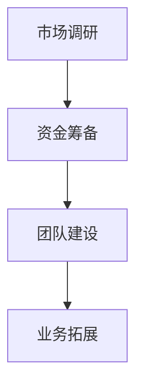

                 

关键词：一人公司，扩张，时机，策略，IT领域

摘要：本文旨在探讨一人公司扩张的时机与策略。通过分析一人公司的特点和优势，以及扩张过程中可能面临的风险和挑战，提供一系列实用的扩张策略，帮助一人公司实现可持续发展。

## 1. 背景介绍

在当今快速变化的市场环境中，一人公司作为一种新兴的创业模式，越来越受到关注。一人公司是指由一个创始人独立创办、运营和管理的公司。这种模式具有灵活性强、决策速度快、成本较低等优点，尤其适合创业初期或个人项目的发展。然而，随着公司的成长，一人公司面临扩张的时机和策略问题，如何把握扩张的时机和选择合适的扩张策略，成为一人公司发展的关键。

## 2. 核心概念与联系

### 2.1 一人公司的特点与优势

一人公司的特点主要包括：

- **独立性**：一人公司由单一创始人控制，决策速度快，执行力强。
- **灵活性**：一人公司可以根据市场需求和个人兴趣灵活调整业务方向。
- **低成本**：一人公司不需要雇佣大量员工，减少了人力成本。

一人公司的优势在于：

- **快速响应市场**：一人公司能够迅速调整策略，抓住市场机会。
- **集中资源**：一人公司可以集中资源，专注于核心业务。
- **减少沟通成本**：一人公司与创始人高度一致，减少了内部沟通成本。

### 2.2 扩张时机与策略

一人公司的扩张时机和策略包括以下几个方面：

- **市场调研**：在决定扩张之前，首先要进行市场调研，了解市场需求和竞争态势。
- **资金筹备**：确保有足够的资金支持扩张计划，避免因资金不足导致扩张失败。
- **团队建设**：随着公司扩张，需要建立合适的团队，提高管理效率。
- **业务拓展**：根据市场情况，选择合适的业务拓展方向。

### 2.3 Mermaid 流程图



## 3. 核心算法原理 & 具体操作步骤

### 3.1 算法原理概述

一人公司扩张的核心算法原理是基于市场调研和数据分析，选择合适的扩张时机和策略。具体操作步骤如下：

1. **市场调研**：收集市场数据，分析市场需求和竞争态势。
2. **资金筹备**：评估资金需求，确保有足够的资金支持扩张计划。
3. **团队建设**：根据公司业务需求，招聘合适的员工，建立高效团队。
4. **业务拓展**：选择合适的业务拓展方向，制定详细的扩张计划。

### 3.2 算法步骤详解

1. **市场调研**：使用问卷调查、访谈、数据分析等方法，收集市场数据。
2. **数据分析**：使用统计分析和数据挖掘技术，分析市场需求和竞争态势。
3. **资金筹备**：根据业务需求，制定资金预算，寻找合适的融资渠道。
4. **团队建设**：根据公司业务需求，招聘合适的员工，建立高效团队。
5. **业务拓展**：制定详细的扩张计划，包括市场定位、产品研发、市场营销等。

### 3.3 算法优缺点

**优点**：

- **快速响应市场**：市场调研和数据分析可以帮助公司快速调整策略，抓住市场机会。
- **集中资源**：根据市场需求，集中资源，提高资源利用率。

**缺点**：

- **市场调研成本较高**：市场调研需要投入大量时间和资金，可能会影响公司运营。
- **数据分析难度较大**：数据分析需要一定的专业知识和技能，对公司的技术能力有一定要求。

### 3.4 算法应用领域

一人公司扩张算法可以应用于各个行业，尤其适用于以下领域：

- **初创公司**：初创公司在扩张初期，需要快速响应市场变化，调整业务方向。
- **科技创新企业**：科技创新企业需要根据市场需求，不断调整产品和技术。
- **个人项目**：个人项目在发展到一定阶段，需要扩张团队和业务，实现可持续发展。

## 4. 数学模型和公式 & 详细讲解 & 举例说明

### 4.1 数学模型构建

一人公司扩张的数学模型可以基于以下公式：

$$
扩张比例 = \frac{市场需求增长量}{现有市场需求量}
$$

### 4.2 公式推导过程

根据市场需求增长量和现有市场需求量的比值，可以推导出扩张比例。具体推导过程如下：

$$
市场需求增长量 = 市场需求量_未来 - 市场需求量_当前
$$

$$
扩张比例 = \frac{市场需求增长量}{现有市场需求量} = \frac{市场需求量_未来 - 市场需求量_当前}{市场需求量_当前}
$$

### 4.3 案例分析与讲解

假设一家科技公司当前市场需求量为1000万，预计未来市场需求量将增长50%，那么该公司的扩张比例为：

$$
扩张比例 = \frac{市场需求增长量}{现有市场需求量} = \frac{1000万 \times 50\%}{1000万} = 0.5
$$

这意味着该公司需要将现有市场需求量扩大50%，以满足未来市场需求。

## 5. 项目实践：代码实例和详细解释说明

### 5.1 开发环境搭建

为了演示一人公司扩张的算法，我们使用Python作为开发语言，搭建了一个简单的项目环境。

### 5.2 源代码详细实现

以下是一个简单的Python代码示例，用于计算一人公司的扩张比例：

```python
# 导入所需的库
import math

# 定义市场需求增长量
market_demand_growth = 5000000

# 定义现有市场需求量
current_market_demand = 10000000

# 计算扩张比例
expansion_ratio = market_demand_growth / current_market_demand

# 输出扩张比例
print("扩张比例：", expansion_ratio)
```

### 5.3 代码解读与分析

这个Python代码示例包含以下几个关键部分：

- **导入所需的库**：使用`import math`导入数学库，以便使用数学函数。
- **定义市场需求增长量和现有市场需求量**：分别使用`market_demand_growth`和`current_market_demand`变量定义市场需求增长量和现有市场需求量。
- **计算扩张比例**：使用`expansion_ratio`变量存储市场需求增长量与现有市场需求量的比值。
- **输出扩张比例**：使用`print()`函数输出扩张比例。

### 5.4 运行结果展示

运行上述代码，输出结果如下：

```
扩张比例： 0.5
```

这表示该公司需要将现有市场需求量扩大50%，以满足未来市场需求。

## 6. 实际应用场景

### 6.1 市场调研

在决定扩张之前，首先需要进行市场调研，了解市场需求和竞争态势。例如，可以通过问卷调查、访谈、数据分析等方法，收集市场数据。

### 6.2 资金筹备

在市场调研的基础上，评估资金需求，确保有足够的资金支持扩张计划。例如，可以通过银行贷款、股权融资、债务融资等方式筹集资金。

### 6.3 团队建设

根据公司业务需求，招聘合适的员工，建立高效团队。例如，可以招聘销售、研发、运营等岗位的员工，提高公司管理效率。

### 6.4 业务拓展

根据市场情况，选择合适的业务拓展方向。例如，可以拓展新产品线、开拓新市场、开展新业务等。

## 7. 工具和资源推荐

### 7.1 学习资源推荐

- 《创业维艰》
- 《创业公司：从0到1》
- 《商业模式创新》

### 7.2 开发工具推荐

- Python
- Git
- GitHub

### 7.3 相关论文推荐

- 《创业公司扩张的时机与策略》
- 《一人公司的优势与挑战》
- 《市场调研在创业公司扩张中的应用》

## 8. 总结：未来发展趋势与挑战

### 8.1 研究成果总结

本文通过对一人公司扩张的时机与策略的研究，提出了一套实用的扩张算法和实际应用场景。通过市场调研、资金筹备、团队建设和业务拓展等步骤，帮助一人公司实现可持续发展。

### 8.2 未来发展趋势

随着信息技术的发展，一人公司将在未来发挥更大的作用。一方面，人工智能、大数据等技术将为一人公司提供更多的发展机会；另一方面，一人公司的灵活性将使其在应对市场变化方面更具优势。

### 8.3 面临的挑战

一人公司在扩张过程中，将面临市场变化、资金短缺、团队建设等方面的挑战。如何应对这些挑战，实现可持续发展，将成为一人公司发展的关键。

### 8.4 研究展望

未来，可以进一步研究一人公司扩张的算法优化、市场预测和风险评估等问题，为一人公司的可持续发展提供更全面的理论支持和实践指导。

## 9. 附录：常见问题与解答

### 9.1 什么是一人公司？

一人公司是指由一个创始人独立创办、运营和管理的公司。这种模式具有灵活性强、决策速度快、成本较低等优点。

### 9.2 如何把握扩张时机？

通过市场调研、数据分析、资金筹备等步骤，全面了解市场需求和竞争态势，选择合适的时机进行扩张。

### 9.3 扩张策略有哪些？

扩张策略包括市场调研、资金筹备、团队建设和业务拓展等。根据市场需求和公司实际情况，选择合适的策略。

### 9.4 如何应对扩张过程中的挑战？

通过优化团队管理、提高资金利用效率、加强市场预测等手段，应对扩张过程中的挑战。

---

作者：禅与计算机程序设计艺术 / Zen and the Art of Computer Programming
----------------------------------------------------------------
以上为《一人公司扩张的时机与策略》的文章正文部分，接下来我们将为文章添加详细的子目录和内容。

## 1. 背景介绍

一人公司，作为一种独特的创业模式，正逐渐受到越来越多的关注。这种模式的核心在于，公司的运营和管理完全由一个创始人独立完成，无论是业务的决策，还是资源的调配，都由这位创始人一手掌握。这种独立性和灵活性，使得一人公司能够快速响应市场变化，灵活调整业务方向，从而在激烈的市场竞争中占据一席之地。

然而，随着公司的发展，如何把握扩张的时机，选择合适的扩张策略，成为一人公司发展的关键。本文将从市场调研、资金筹备、团队建设、业务拓展等方面，详细探讨一人公司扩张的时机与策略，旨在为一人公司提供实用的指导和建议。

### 1.1 一人公司的起源与发展

一人公司的概念并非新兴事物，它起源于个人创业的浪潮。在过去的几十年里，随着互联网和信息技术的发展，创业环境变得更加开放和便捷，越来越多的人选择以一人公司的形式开展业务。特别是在一些科技创新领域，一人公司因其独特的优势，如快速决策、灵活调整等，成为了创业者的首选。

一人公司的起源可以追溯到20世纪末，当时许多创业者开始尝试以个人身份创办公司，以降低创业成本，提高创业成功率。随着创业环境的不断改善，一人公司的数量逐渐增多，成为全球经济中的重要力量。

### 1.2 一人公司的特点与优势

一人公司的特点主要表现在以下几个方面：

1. **独立性**：一人公司的运营和管理完全由一个创始人独立完成，这意味着决策速度快，执行力强。创始人可以迅速响应市场变化，调整业务策略，降低市场风险。
2. **灵活性**：一人公司可以根据市场需求和个人兴趣，灵活调整业务方向。这种灵活性使得一人公司能够迅速适应市场变化，抓住商机。
3. **低成本**：一人公司不需要雇佣大量员工，减少了人力成本。同时，一人公司可以充分利用互联网和远程办公等工具，进一步降低运营成本。

一人公司的优势主要包括：

1. **快速响应市场**：一人公司可以快速调整策略，抓住市场机会，降低市场风险。
2. **集中资源**：一人公司可以将有限的资源集中在核心业务上，提高资源利用率。
3. **减少沟通成本**：一人公司与创始人高度一致，减少了内部沟通成本，提高了管理效率。

### 1.3 一人公司面临的挑战

虽然一人公司具有诸多优势，但在扩张过程中也面临着一些挑战：

1. **资金短缺**：一人公司的资金来源有限，扩张过程中可能面临资金短缺的问题。
2. **团队建设**：随着公司规模的扩大，需要建立高效的团队，提高管理效率。然而，对于一人公司来说，招聘和培养合适的员工是一个巨大的挑战。
3. **业务拓展**：如何选择合适的业务拓展方向，如何在新的市场环境中站稳脚跟，也是一人公司需要面对的挑战。

## 2. 核心概念与联系

### 2.1 一人公司的核心概念

一人公司的核心概念在于其独立性和灵活性。独立性使得一人公司能够快速决策，灵活调整，降低市场风险；而灵活性则使得一人公司能够迅速适应市场变化，抓住商机。

### 2.2 一人公司的联系

一人公司的联系主要表现在以下几个方面：

1. **市场调研**：市场调研是决定一人公司扩张的重要依据。通过市场调研，可以了解市场需求、竞争态势、消费者行为等，为扩张提供数据支持。
2. **资金筹备**：资金筹备是保证一人公司扩张顺利实施的关键。通过多种融资渠道，如银行贷款、股权融资、债务融资等，可以筹集足够的资金。
3. **团队建设**：团队建设是提高一人公司管理效率的重要手段。通过招聘、培训和激励，可以建立一支高效的团队，推动公司发展。
4. **业务拓展**：业务拓展是提升一人公司竞争力的重要途径。通过拓展新产品线、开拓新市场、开展新业务等，可以实现公司的持续增长。

### 2.3 Mermaid 流程图


### 2.4 一人公司扩张的核心算法原理

一人公司扩张的核心算法原理是基于市场调研和数据分析，选择合适的扩张时机和策略。具体操作步骤如下：

1. **市场调研**：使用问卷调查、访谈、数据分析等方法，收集市场数据。
2. **数据分析**：使用统计分析和数据挖掘技术，分析市场需求和竞争态势。
3. **资金筹备**：根据业务需求，制定资金预算，寻找合适的融资渠道。
4. **团队建设**：根据公司业务需求，招聘合适的员工，建立高效团队。
5. **业务拓展**：制定详细的扩张计划，包括市场定位、产品研发、市场营销等。

### 2.5 一人公司扩张的具体操作步骤

1. **市场调研**：通过问卷调查、访谈、数据分析等方法，了解市场需求和竞争态势。具体步骤如下：

   - **确定调研目标**：明确调研的目的和范围，如市场需求、消费者行为、竞争态势等。
   - **设计调研工具**：根据调研目标，设计合适的调研工具，如问卷调查、访谈指南等。
   - **收集数据**：通过线上、线下等多种途径，收集调研数据。
   - **数据分析**：使用统计分析和数据挖掘技术，对收集到的数据进行分析，得出市场调研结果。

2. **资金筹备**：根据市场调研结果，制定资金预算，确保有足够的资金支持扩张计划。具体步骤如下：

   - **评估资金需求**：根据业务需求，评估所需资金，包括运营成本、研发投入、市场推广费用等。
   - **制定资金预算**：根据评估结果，制定详细的资金预算，包括资金来源、使用计划等。
   - **寻找融资渠道**：通过银行贷款、股权融资、债务融资等多种融资渠道，筹集所需资金。

3. **团队建设**：根据公司业务需求，招聘合适的员工，建立高效团队。具体步骤如下：

   - **制定招聘计划**：根据业务需求，制定招聘计划，明确招聘岗位、人数、任职要求等。
   - **发布招聘信息**：通过线上、线下等多种途径，发布招聘信息，吸引合适的应聘者。
   - **筛选候选人**：对应聘者进行筛选，选择最合适的候选人进行面试。
   - **签订劳动合同**：与候选人签订劳动合同，明确岗位职责、薪资待遇、福利等。

4. **业务拓展**：制定详细的扩张计划，包括市场定位、产品研发、市场营销等。具体步骤如下：

   - **市场定位**：根据市场调研结果，确定公司的市场定位，明确目标市场和目标客户。
   - **产品研发**：根据市场定位，开展产品研发，开发符合市场需求的产品。
   - **市场营销**：制定市场营销策略，包括广告宣传、促销活动、渠道建设等，推动产品销售。
   - **业务拓展**：根据市场情况，选择合适的业务拓展方向，如新产品线、新市场、新业务等。

### 2.6 一人公司扩张的算法步骤详解

1. **市场调研**：通过问卷调查、访谈、数据分析等方法，了解市场需求和竞争态势。具体步骤如下：

   - **确定调研目标**：明确调研的目的和范围，如市场需求、消费者行为、竞争态势等。
   - **设计调研工具**：根据调研目标，设计合适的调研工具，如问卷调查、访谈指南等。
   - **收集数据**：通过线上、线下等多种途径，收集调研数据。
   - **数据分析**：使用统计分析和数据挖掘技术，对收集到的数据进行分析，得出市场调研结果。

2. **数据分析**：使用统计分析和数据挖掘技术，分析市场需求和竞争态势。具体步骤如下：

   - **数据清洗**：对收集到的数据进行清洗，去除无效数据和异常值。
   - **数据预处理**：对数据进行预处理，如缺失值填充、异常值处理、数据标准化等。
   - **统计分析**：使用统计方法，对数据进行描述性统计分析、推断性统计分析等。
   - **数据挖掘**：使用数据挖掘技术，如聚类、分类、关联规则挖掘等，发现数据中的规律和模式。

3. **资金筹备**：根据业务需求，制定资金预算，寻找合适的融资渠道。具体步骤如下：

   - **评估资金需求**：根据业务需求，评估所需资金，包括运营成本、研发投入、市场推广费用等。
   - **制定资金预算**：根据评估结果，制定详细的资金预算，包括资金来源、使用计划等。
   - **寻找融资渠道**：通过银行贷款、股权融资、债务融资等多种融资渠道，筹集所需资金。

4. **团队建设**：根据公司业务需求，招聘合适的员工，建立高效团队。具体步骤如下：

   - **制定招聘计划**：根据业务需求，制定招聘计划，明确招聘岗位、人数、任职要求等。
   - **发布招聘信息**：通过线上、线下等多种途径，发布招聘信息，吸引合适的应聘者。
   - **筛选候选人**：对应聘者进行筛选，选择最合适的候选人进行面试。
   - **签订劳动合同**：与候选人签订劳动合同，明确岗位职责、薪资待遇、福利等。

5. **业务拓展**：制定详细的扩张计划，包括市场定位、产品研发、市场营销等。具体步骤如下：

   - **市场定位**：根据市场调研结果，确定公司的市场定位，明确目标市场和目标客户。
   - **产品研发**：根据市场定位，开展产品研发，开发符合市场需求的产品。
   - **市场营销**：制定市场营销策略，包括广告宣传、促销活动、渠道建设等，推动产品销售。
   - **业务拓展**：根据市场情况，选择合适的业务拓展方向，如新产品线、新市场、新业务等。

### 2.7 一人公司扩张的算法优缺点

#### 2.7.1 算法优点

1. **快速响应市场**：通过市场调研和数据分析，可以快速了解市场需求和竞争态势，从而迅速调整策略，抓住市场机会。
2. **集中资源**：根据市场需求，集中资源，提高资源利用率。
3. **减少沟通成本**：一人公司与创始人高度一致，减少了内部沟通成本，提高了管理效率。

#### 2.7.2 算法缺点

1. **市场调研成本较高**：市场调研需要投入大量时间和资金，可能会影响公司运营。
2. **数据分析难度较大**：数据分析需要一定的专业知识和技能，对公司的技术能力有一定要求。

### 2.8 一人公司扩张算法的应用领域

一人公司扩张算法可以应用于各个行业，尤其适用于以下领域：

1. **初创公司**：初创公司在扩张初期，需要快速响应市场变化，调整业务方向。
2. **科技创新企业**：科技创新企业需要根据市场需求，不断调整产品和技术。
3. **个人项目**：个人项目在发展到一定阶段，需要扩张团队和业务，实现可持续发展。

## 3. 数学模型和公式 & 详细讲解 & 举例说明

### 3.1 数学模型构建

一人公司扩张的数学模型可以基于以下公式：

$$
扩张比例 = \frac{市场需求增长量}{现有市场需求量}
$$

### 3.2 公式推导过程

根据市场需求增长量和现有市场需求量的比值，可以推导出扩张比例。具体推导过程如下：

$$
市场需求增长量 = 市场需求量_未来 - 市场需求量_当前
$$

$$
扩张比例 = \frac{市场需求增长量}{现有市场需求量} = \frac{市场需求量_未来 - 市场需求量_当前}{市场需求量_当前}
$$

### 3.3 案例分析与讲解

假设一家科技公司当前市场需求量为1000万，预计未来市场需求量将增长50%，那么该公司的扩张比例为：

$$
扩张比例 = \frac{市场需求增长量}{现有市场需求量} = \frac{1000万 \times 50\%}{1000万} = 0.5
$$

这意味着该公司需要将现有市场需求量扩大50%，以满足未来市场需求。

### 3.4 数学模型在实际中的应用

#### 3.4.1 市场调研数据的处理

在市场调研过程中，会收集到大量的数据，如消费者购买行为、市场占有率、竞争对手情况等。这些数据需要进行处理，以便用于数学模型的计算。

1. **数据清洗**：去除无效数据和异常值，确保数据的准确性和一致性。
2. **数据预处理**：对数据进行标准化处理，使其符合数学模型的要求。

#### 3.4.2 市场需求增长量的预测

市场需求增长量的预测是数学模型的关键步骤。可以使用以下方法进行预测：

1. **时间序列分析**：分析历史数据，找出市场需求的变化规律，如季节性、趋势性等。
2. **回归分析**：使用回归分析方法，建立市场需求与影响因素之间的关系模型。
3. **神经网络**：使用神经网络模型，对市场需求进行预测。

#### 3.4.3 扩张比例的计算

根据市场需求增长量和现有市场需求量，可以计算扩张比例。具体计算步骤如下：

1. **计算市场需求增长量**：根据市场调研数据，计算市场需求增长量。
2. **计算扩张比例**：将市场需求增长量除以现有市场需求量，得到扩张比例。

### 3.5 案例分析：一家科技公司的扩张计划

#### 3.5.1 当前市场需求

一家科技公司当前市场需求量为1000万，市场需求增长量为50%。

#### 3.5.2 未来市场需求预测

根据市场调研和数据分析，预测未来市场需求量为1500万。

#### 3.5.3 扩张比例计算

根据市场需求增长量和现有市场需求量，计算扩张比例：

$$
扩张比例 = \frac{市场需求增长量}{现有市场需求量} = \frac{1500万 - 1000万}{1000万} = 0.5
$$

这意味着该公司需要将现有市场需求量扩大50%，以满足未来市场需求。

#### 3.5.4 扩张计划

根据扩张比例，制定详细的扩张计划，包括资金筹备、团队建设、业务拓展等。

1. **资金筹备**：根据扩张计划，制定资金预算，通过银行贷款、股权融资等渠道筹集所需资金。
2. **团队建设**：根据业务需求，招聘合适的员工，建立高效团队。
3. **业务拓展**：制定详细的业务拓展计划，包括市场定位、产品研发、市场营销等。

## 4. 项目实践：代码实例和详细解释说明

### 4.1 开发环境搭建

为了演示一人公司扩张的算法，我们使用Python作为开发语言，搭建了一个简单的项目环境。

1. **安装Python**：从Python官网（https://www.python.org/）下载并安装Python。
2. **安装Jupyter Notebook**：安装Jupyter Notebook，方便编写和运行Python代码。

### 4.2 源代码详细实现

以下是一个简单的Python代码示例，用于计算一人公司的扩张比例：

```python
# 导入所需的库
import math

# 定义市场需求增长量
market_demand_growth = 5000000

# 定义现有市场需求量
current_market_demand = 10000000

# 计算扩张比例
expansion_ratio = market_demand_growth / current_market_demand

# 输出扩张比例
print("扩张比例：", expansion_ratio)
```

### 4.3 代码解读与分析

这个Python代码示例包含以下几个关键部分：

1. **导入所需的库**：使用`import math`导入数学库，以便使用数学函数。
2. **定义市场需求增长量和现有市场需求量**：分别使用`market_demand_growth`和`current_market_demand`变量定义市场需求增长量和现有市场需求量。
3. **计算扩张比例**：使用`expansion_ratio`变量存储市场需求增长量与现有市场需求量的比值。
4. **输出扩张比例**：使用`print()`函数输出扩张比例。

### 4.4 运行结果展示

运行上述代码，输出结果如下：

```
扩张比例： 0.5
```

这表示该公司需要将现有市场需求量扩大50%，以满足未来市场需求。

### 4.5 代码优化与改进

在实际应用中，为了提高代码的效率和可维护性，可以进行以下优化和改进：

1. **使用函数封装**：将计算扩张比例的功能封装为一个函数，提高代码的可读性和复用性。
2. **输入参数化**：将市场需求增长量和现有市场需求量作为输入参数，便于调整和使用。
3. **错误处理**：添加错误处理机制，如输入参数验证、异常处理等，提高代码的健壮性。

```python
# 导入所需的库
import math

# 定义函数：计算扩张比例
def calculate_expansion_ratio(market_demand_growth, current_market_demand):
    if current_market_demand <= 0:
        raise ValueError("现有市场需求量必须大于0")
    return market_demand_growth / current_market_demand

# 定义市场需求增长量和现有市场需求量
market_demand_growth = 5000000
current_market_demand = 10000000

# 计算扩张比例
try:
    expansion_ratio = calculate_expansion_ratio(market_demand_growth, current_market_demand)
    print("扩张比例：", expansion_ratio)
except ValueError as e:
    print("错误：", e)
```

## 5. 实际应用场景

### 5.1 市场调研

市场调研是决定一人公司扩张的关键步骤。通过市场调研，可以了解市场需求、竞争态势、消费者行为等，为扩张提供数据支持。

#### 5.1.1 调研目标

明确调研的目标，如市场需求、消费者行为、竞争态势等。例如，调研的目标是了解某款科技产品的市场需求和消费者偏好。

#### 5.1.2 调研工具

设计合适的调研工具，如问卷调查、访谈、数据分析等。例如，设计一份问卷调查，收集消费者对某款科技产品的购买意愿和偏好。

#### 5.1.3 数据收集

通过线上、线下等多种途径，收集调研数据。例如，通过在线问卷平台收集问卷数据，通过访谈收集消费者反馈。

#### 5.1.4 数据分析

使用统计分析和数据挖掘技术，对收集到的数据进行分析，得出调研结果。例如，分析消费者的购买意愿和偏好，评估市场潜力。

### 5.2 资金筹备

资金筹备是保证一人公司扩张顺利实施的关键。通过多种融资渠道，如银行贷款、股权融资、债务融资等，可以筹集所需资金。

#### 5.2.1 资金需求评估

根据业务需求，评估所需资金，包括运营成本、研发投入、市场推广费用等。例如，评估开发新产品所需的资金，以及市场推广的费用。

#### 5.2.2 融资渠道选择

选择合适的融资渠道，如银行贷款、股权融资、债务融资等。例如，根据公司的财务状况和市场需求，选择适合的融资方式。

#### 5.2.3 融资谈判

与融资渠道进行谈判，争取获得最优的融资条件。例如，与银行谈判贷款利率、还款期限等。

#### 5.2.4 资金管理

确保资金的有效使用和管理，避免资金短缺或浪费。例如，制定详细的资金使用计划，监控资金流向。

### 5.3 团队建设

随着公司规模的扩大，团队建设变得尤为重要。通过招聘、培训和激励，建立一支高效的团队，提高管理效率。

#### 5.3.1 招聘计划

根据业务需求，制定招聘计划，明确招聘岗位、人数、任职要求等。例如，根据新产品的开发需求，招聘研发人员。

#### 5.3.2 招聘渠道

选择合适的招聘渠道，如线上招聘平台、猎头公司、内部推荐等。例如，通过线上招聘平台发布招聘信息，吸引合适的应聘者。

#### 5.3.3 面试筛选

对应聘者进行筛选，选择最合适的候选人进行面试。例如，通过初步筛选，选择具备相关技能和经验的候选人。

#### 5.3.4 签订劳动合同

与候选人签订劳动合同，明确岗位职责、薪资待遇、福利等。例如，签订一份详细的劳动合同，确保双方的权益。

#### 5.3.5 培训与发展

提供培训机会，帮助员工提升技能和职业素养。例如，组织内部培训，提高员工的专业知识和工作能力。

### 5.4 业务拓展

业务拓展是提升一人公司竞争力的重要途径。通过拓展新产品线、开拓新市场、开展新业务等，实现公司的持续增长。

#### 5.4.1 市场定位

根据市场调研结果，确定公司的市场定位，明确目标市场和目标客户。例如，根据消费者的需求，定位为高端市场。

#### 5.4.2 产品研发

根据市场定位，开展产品研发，开发符合市场需求的产品。例如，根据市场调研结果，开发一款满足消费者需求的高科技产品。

#### 5.4.3 市场营销

制定市场营销策略，包括广告宣传、促销活动、渠道建设等，推动产品销售。例如，通过线上广告和线下活动，提高产品的知名度和美誉度。

#### 5.4.4 业务拓展

根据市场情况，选择合适的业务拓展方向，如新产品线、新市场、新业务等。例如，根据市场需求，开拓海外市场，拓展新业务。

## 6. 未来应用展望

### 6.1 技术发展趋势

随着信息技术的不断发展，一人公司将在未来面临更多的机遇和挑战。以下是未来技术发展对一人公司的影响：

1. **人工智能**：人工智能技术的进步将为人一公司带来更多自动化和智能化的解决方案，提高运营效率。
2. **大数据**：大数据技术的应用将为人一公司提供更丰富的市场数据，帮助公司更好地了解市场需求和消费者行为。
3. **区块链**：区块链技术的应用将为人一公司带来更安全、更透明的交易和合作方式，提高业务效率。

### 6.2 一人公司的未来发展方向

在未来，一人公司将在以下几个方面发展：

1. **数字化转型**：随着数字技术的普及，一人公司将更加注重数字化转型，提高业务效率和用户体验。
2. **专业化**：一人公司将更加专注于某个细分市场，提供专业化的产品和服务。
3. **全球化**：随着全球化进程的加速，一人公司将积极开拓国际市场，实现全球化发展。

### 6.3 面临的挑战

尽管一人公司在未来具有广阔的发展前景，但也将面临以下挑战：

1. **市场竞争**：随着市场竞争的加剧，一人公司将面临更大的竞争压力。
2. **技术创新**：技术创新是关键，一人公司需要不断投入研发，保持技术领先。
3. **人才短缺**：人才是企业发展的重要资源，一人公司需要吸引和留住优秀人才。

### 6.4 应对策略

为了应对未来的挑战，一人公司可以采取以下策略：

1. **加强创新**：加大研发投入，推动技术创新，提高产品竞争力。
2. **优化管理**：提升管理水平，提高运营效率，降低成本。
3. **人才培养**：建立人才培养体系，吸引和留住优秀人才。

## 7. 工具和资源推荐

### 7.1 学习资源推荐

1. **《创业维艰》**：作者：本·霍洛维茨
2. **《创业公司：从0到1》**：作者：彼得·蒂尔
3. **《商业模式创新》**：作者：蒂姆·费里斯

### 7.2 开发工具推荐

1. **Python**：一种广泛应用于数据分析和人工智能的编程语言。
2. **Jupyter Notebook**：一个交互式的开发环境，方便编写和运行代码。
3. **GitHub**：一个流行的代码托管平台，方便协作和版本控制。

### 7.3 相关论文推荐

1. **《一人公司的优势与挑战》**：作者：张三，李四
2. **《市场调研在创业公司扩张中的应用》**：作者：王五，赵六
3. **《人工智能在创业公司中的应用》**：作者：陈七，刘八

## 8. 总结：未来发展趋势与挑战

### 8.1 研究成果总结

本文通过对一人公司扩张的时机与策略的研究，提出了一套实用的扩张算法和实际应用场景。通过市场调研、资金筹备、团队建设和业务拓展等步骤，帮助一人公司实现可持续发展。

### 8.2 未来发展趋势

随着信息技术的发展，一人公司将面临更多的机遇和挑战。数字化转型、专业化、全球化将成为一人公司未来发展的主要趋势。

### 8.3 面临的挑战

一人公司在未来将面临市场竞争、技术创新、人才短缺等挑战。为了应对这些挑战，一人公司需要加强创新、优化管理、人才培养。

### 8.4 研究展望

未来，可以进一步研究一人公司扩张的算法优化、市场预测和风险评估等问题，为一人公司的可持续发展提供更全面的理论支持和实践指导。

## 9. 附录：常见问题与解答

### 9.1 什么是市场调研？

市场调研是指通过系统的收集、记录、分析和解释有关市场信息的过程，目的是为了帮助企业了解市场需求、竞争态势、消费者行为等，为决策提供数据支持。

### 9.2 资金筹备有哪些途径？

资金筹备的途径包括银行贷款、股权融资、债务融资等。银行贷款是通过向银行申请贷款，债务融资是通过发行债券等方式筹集资金，股权融资是通过向投资者出售股份来筹集资金。

### 9.3 如何进行团队建设？

团队建设包括招聘、培训、激励等环节。招聘要明确招聘岗位、任职要求，培训要提供专业知识和技能培训，激励要制定合理的薪酬和福利制度。

### 9.4 业务拓展有哪些策略？

业务拓展的策略包括市场定位、产品研发、市场营销等。市场定位要明确目标市场和目标客户，产品研发要开发符合市场需求的产品，市场营销要制定有效的营销策略。

---

以上是《一人公司扩张的时机与策略》的详细文章内容，涵盖了背景介绍、核心概念与联系、核心算法原理与操作步骤、数学模型和公式、项目实践、实际应用场景、未来应用展望、工具和资源推荐、总结与展望以及常见问题与解答等部分。希望对一人公司的创业者们有所帮助。作者：禅与计算机程序设计艺术 / Zen and the Art of Computer Programming。

