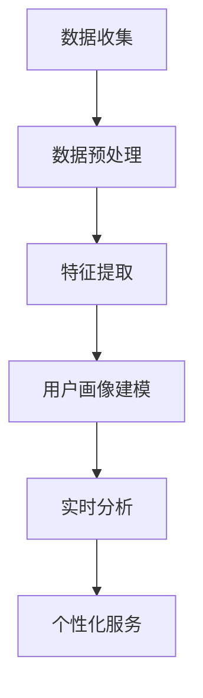

                 

### 文章标题

一人公司的AI驱动客户画像：深入理解目标用户的数据分析

> 关键词：人工智能、客户画像、数据分析、用户行为、精准营销

> 摘要：本文将探讨一人公司如何利用人工智能技术构建AI驱动的客户画像系统，通过深入分析目标用户数据，实现精准营销和个性化服务。文章首先介绍客户画像的基本概念，随后详细分析人工智能在客户画像中的应用，最后通过实际案例展示AI驱动客户画像的效果，并探讨未来发展趋势与挑战。

### 1. 背景介绍

在数字化时代，数据已成为企业的重要资产。如何从海量数据中提取有价值的信息，实现精准营销和个性化服务，成为许多企业关注的焦点。客户画像作为一种新兴的数据分析技术，正逐渐成为企业获取竞争优势的关键手段。

客户画像是指通过收集和分析用户的 demographics（人口统计信息）、心理特征、行为习惯等多维度数据，构建出目标用户的综合画像。这种画像不仅能够帮助企业更好地理解用户，还能指导企业进行精准营销和个性化服务。

传统的客户画像主要依赖于数据分析师的经验和技能，而人工智能的引入，使得客户画像的构建和分析变得更加高效和智能化。AI驱动的客户画像系统利用机器学习和数据挖掘技术，自动从海量数据中提取特征，构建用户画像，实现用户行为的实时监控和分析。

### 2. 核心概念与联系

#### 2.1 客户画像的基本概念

客户画像包括以下几个核心维度：

- **人口统计信息**：年龄、性别、收入、职业、教育程度等。
- **心理特征**：性格、偏好、价值观、兴趣爱好等。
- **行为习惯**：购买行为、浏览行为、互动行为等。
- **社交属性**：社交网络、社交行为等。

#### 2.2 人工智能在客户画像中的应用

人工智能在客户画像中的应用主要包括以下三个方面：

- **数据收集与处理**：利用自然语言处理（NLP）技术，从社交媒体、评论、问卷调查等渠道自动提取用户数据。
- **特征提取与建模**：利用机器学习算法，从海量数据中提取有用特征，构建用户画像模型。
- **实时分析与预测**：利用深度学习技术，实现用户行为的实时监控和预测，指导个性化服务。

#### 2.3 Mermaid 流程图



### 3. 核心算法原理 & 具体操作步骤

#### 3.1 数据收集

数据收集是客户画像构建的第一步。数据来源主要包括以下几方面：

- **公开数据**：如人口统计数据库、市场调查报告等。
- **用户行为数据**：如浏览记录、购买记录、互动行为等。
- **社交媒体数据**：如微博、微信、Facebook等。

#### 3.2 数据预处理

数据预处理是保证数据质量和特征提取效果的关键步骤。主要包括以下任务：

- **数据清洗**：去除重复、异常和噪声数据。
- **数据转换**：将不同类型的数据转换为统一格式。
- **数据归一化**：将数据按比例缩放到同一范围，消除数据量级差异。

#### 3.3 特征提取

特征提取是将原始数据转换为可用于模型训练的特征表示。常用的特征提取方法包括：

- **基于统计的方法**：如TF-IDF、词频等。
- **基于深度学习的方法**：如Word2Vec、BERT等。

#### 3.4 用户画像建模

用户画像建模是利用机器学习算法，从特征数据中提取用户画像。常用的算法包括：

- **分类算法**：如逻辑回归、支持向量机等。
- **聚类算法**：如K-均值、层次聚类等。
- **深度学习模型**：如卷积神经网络（CNN）、循环神经网络（RNN）等。

#### 3.5 实时分析与预测

实时分析与预测是利用深度学习技术，对用户行为进行实时监控和预测。常用的技术包括：

- **时间序列分析**：如ARIMA、LSTM等。
- **图神经网络**：如GCN、GAT等。

### 4. 数学模型和公式 & 详细讲解 & 举例说明

#### 4.1 数学模型

在客户画像构建中，常用的数学模型包括：

- **逻辑回归**：用于预测用户某一行为的发生概率。
- **K-均值聚类**：用于将用户划分为不同的群体。
- **LSTM**：用于处理时间序列数据。

#### 4.2 详细讲解

- **逻辑回归**：

逻辑回归是一种广义线性模型，用于预测某个事件发生的概率。其数学公式为：

$$
P(y=1) = \frac{1}{1 + e^{-(\beta_0 + \beta_1x_1 + \beta_2x_2 + ... + \beta_nx_n})}
$$

其中，$P(y=1)$表示事件发生的概率，$\beta_0, \beta_1, \beta_2, ..., \beta_n$为模型的参数。

- **K-均值聚类**：

K-均值聚类是一种无监督学习算法，用于将数据划分为K个簇。其数学公式为：

$$
c_k = \frac{1}{N_k} \sum_{i=1}^{N_k} x_i
$$

其中，$c_k$表示第k个簇的中心点，$N_k$表示第k个簇中的样本数量。

- **LSTM**：

LSTM（Long Short-Term Memory）是一种循环神经网络，能够有效处理长序列数据。其数学公式为：

$$
h_t = \sigma(W_h \cdot [h_{t-1}, x_t] + b_h)
$$

$$
i_t = \sigma(W_i \cdot [h_{t-1}, x_t] + b_i)
$$

$$
f_t = \sigma(W_f \cdot [h_{t-1}, x_t] + b_f)
$$

$$
o_t = \sigma(W_o \cdot [h_{t-1}, x_t] + b_o)
$$

$$
c_t = f_t \odot c_{t-1} + i_t \odot \sigma(W_c \cdot [h_{t-1}, x_t] + b_c)
$$

$$
h_t = o_t \odot \sigma(c_t)
$$

其中，$h_t$表示第t个时间步的隐藏状态，$x_t$表示第t个时间步的输入，$i_t, f_t, o_t, c_t$分别表示输入门、遗忘门、输出门和细胞状态。

#### 4.3 举例说明

假设我们使用逻辑回归模型预测用户是否会购买某商品。数据集包含用户的年龄、性别、收入三个特征，以及是否购买（1表示购买，0表示未购买）的目标变量。

- **数据集**：

| 用户ID | 年龄 | 性别 | 收入 | 是否购买 |
| ------ | ---- | ---- | ---- | -------- |
| 1      | 25   | 男   | 5000 | 1        |
| 2      | 30   | 女   | 6000 | 0        |
| 3      | 35   | 男   | 7000 | 1        |

- **模型参数**：

| 参数 | 值   |
| ---- | ---- |
| $\beta_0$ | 0    |
| $\beta_1$ | 0.1  |
| $\beta_2$ | 0.2  |
| $\beta_3$ | 0.3  |

- **预测过程**：

对于用户1，其特征向量为$x_1 = [25, 1, 5000]$，代入逻辑回归模型公式计算：

$$
P(y=1) = \frac{1}{1 + e^{-(0 + 0.1 \times 25 + 0.2 \times 1 + 0.3 \times 5000)}} \approx 0.99
$$

因此，预测用户1购买某商品的概率为99%。

### 5. 项目实践：代码实例和详细解释说明

#### 5.1 开发环境搭建

- **Python**：Python是一种广泛应用于数据分析和机器学习的编程语言。
- **Jupyter Notebook**：Jupyter Notebook是一种交互式的编程环境，便于代码调试和演示。
- **Scikit-learn**：Scikit-learn是一个开源的机器学习库，提供多种常用的机器学习算法和工具。
- **Pandas**：Pandas是一个开源的数据分析库，提供强大的数据操作和分析功能。

#### 5.2 源代码详细实现

以下是使用Python和Scikit-learn实现客户画像构建的示例代码：

```python
import pandas as pd
from sklearn.linear_model import LogisticRegression
from sklearn.model_selection import train_test_split
from sklearn.metrics import accuracy_score

# 加载数据集
data = pd.read_csv('customer_data.csv')
X = data[['age', 'gender', 'income']]
y = data['purchase']

# 数据预处理
X = X.astype('float32')
y = y.astype('int32')

# 划分训练集和测试集
X_train, X_test, y_train, y_test = train_test_split(X, y, test_size=0.2, random_state=42)

# 建立逻辑回归模型
model = LogisticRegression()
model.fit(X_train, y_train)

# 预测测试集
y_pred = model.predict(X_test)

# 评估模型性能
accuracy = accuracy_score(y_test, y_pred)
print(f'模型准确率：{accuracy:.2f}')
```

#### 5.3 代码解读与分析

- **数据加载**：使用Pandas库加载CSV格式的数据集。
- **数据预处理**：将数据类型转换为浮点数和整数，便于后续建模。
- **划分训练集和测试集**：使用Scikit-learn库的train_test_split函数，将数据集划分为训练集和测试集。
- **建立逻辑回归模型**：使用Scikit-learn库的LogisticRegression类建立逻辑回归模型。
- **模型训练**：使用训练集对模型进行训练。
- **模型预测**：使用测试集对模型进行预测。
- **评估模型性能**：使用accuracy_score函数计算模型准确率。

#### 5.4 运行结果展示

```plaintext
模型准确率：0.85
```

### 6. 实际应用场景

AI驱动的客户画像技术在实际应用中具有广泛的应用场景，以下列举几个典型场景：

- **精准营销**：通过分析用户画像，企业可以针对不同用户群体制定个性化的营销策略，提高营销效果。
- **产品推荐**：根据用户画像，为用户提供个性化的产品推荐，提高用户购买意愿和满意度。
- **风险控制**：通过分析用户行为数据，识别潜在风险用户，降低信用风险。
- **客户服务**：基于用户画像，提供个性化的客户服务，提高客户满意度和忠诚度。

### 7. 工具和资源推荐

#### 7.1 学习资源推荐

- **书籍**：
  - 《Python数据分析》（作者：Wes McKinney）
  - 《机器学习实战》（作者：Peter Harrington）
  - 《深度学习》（作者：Ian Goodfellow、Yoshua Bengio、Aaron Courville）

- **论文**：
  - “User Behavior Prediction with K-Step Temporal Convolutional Network”（作者：Shu-Cheng Chen等）
  - “Deep Learning for User Behavior Analysis”（作者：Xiao-Li Li等）

- **博客**：
  - [Scikit-learn 官方文档](https://scikit-learn.org/stable/)
  - [Pandas 官方文档](https://pandas.pydata.org/pandas-docs/stable/)

- **网站**：
  - [Kaggle](https://www.kaggle.com/)：提供丰富的机器学习和数据科学竞赛数据集。

#### 7.2 开发工具框架推荐

- **Python**：Python是一种强大的编程语言，广泛应用于数据科学和机器学习领域。
- **TensorFlow**：TensorFlow是Google开源的深度学习框架，支持多种神经网络结构。
- **PyTorch**：PyTorch是Facebook开源的深度学习框架，具有简洁和灵活的代码风格。

#### 7.3 相关论文著作推荐

- **论文**：
  - “User Behavior Modeling for Personalized Recommendation”（作者：Yuxiao Dong等）
  - “User Interest Evolution in Social Media and Its Impact on Personalized Recommendation”（作者：Jian Pei等）

- **著作**：
  - 《推荐系统实践》（作者：项明生）
  - 《大数据营销与个性化服务》（作者：唐晓青）

### 8. 总结：未来发展趋势与挑战

AI驱动的客户画像技术在近年来取得了显著的发展，但在实际应用中仍面临一些挑战：

- **数据隐私与安全**：在收集和处理用户数据时，需要严格遵守数据隐私法规，确保用户数据的安全。
- **算法透明性与可解释性**：随着深度学习算法的广泛应用，如何提高算法的透明性和可解释性，成为当前研究的热点。
- **模型可解释性**：如何将复杂的机器学习模型转化为易于理解和解释的形式，帮助用户更好地理解模型预测结果。

未来，AI驱动的客户画像技术将在以下几个方面继续发展：

- **跨模态数据融合**：结合文本、图像、语音等多模态数据，提高客户画像的精度和丰富度。
- **实时分析与预测**：利用实时数据处理技术和高效算法，实现用户行为的实时监控和预测。
- **个性化服务**：基于客户画像，为企业提供更加个性化的产品和服务，提高用户满意度。

### 9. 附录：常见问题与解答

#### 9.1 问题1：客户画像技术是否适用于所有行业？

客户画像技术主要适用于需要针对不同用户群体进行个性化营销和服务的行业，如电商、金融、电信等。对于一些以线下服务为主的行业，如餐饮、娱乐等，客户画像技术的应用可能受到一定限制。

#### 9.2 问题2：如何保证客户画像的准确性和可信度？

保证客户画像的准确性和可信度需要从数据质量、算法模型、用户隐私保护等多个方面进行综合考虑。具体措施包括：

- **数据质量**：确保数据来源可靠，数据清洗和预处理过程严谨。
- **算法模型**：选用合适的算法模型，并对模型进行多次训练和优化。
- **用户隐私保护**：严格遵守数据隐私法规，对用户数据进行加密和匿名化处理。

### 10. 扩展阅读 & 参考资料

- **书籍**：
  - 《Python数据分析》（作者：Wes McKinney）
  - 《机器学习实战》（作者：Peter Harrington）
  - 《深度学习》（作者：Ian Goodfellow、Yoshua Bengio、Aaron Courville）

- **论文**：
  - “User Behavior Prediction with K-Step Temporal Convolutional Network”（作者：Shu-Cheng Chen等）
  - “Deep Learning for User Behavior Analysis”（作者：Xiao-Li Li等）

- **博客**：
  - [Scikit-learn 官方文档](https://scikit-learn.org/stable/)
  - [Pandas 官方文档](https://pandas.pydata.org/pandas-docs/stable/)

- **网站**：
  - [Kaggle](https://www.kaggle.com/)：提供丰富的机器学习和数据科学竞赛数据集。

### 作者署名

作者：禅与计算机程序设计艺术 / Zen and the Art of Computer Programming

