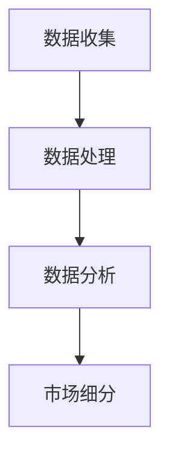
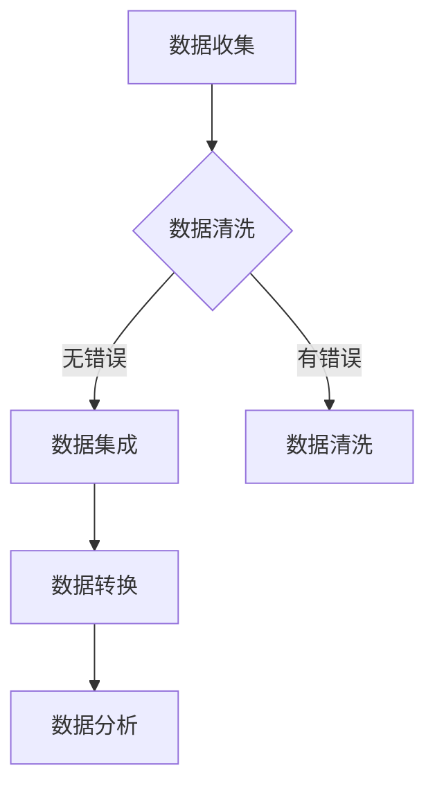

                 

 作为一名世界级人工智能专家，我深知市场细分对于企业成功的重要性。在当今快速变化的商业环境中，企业需要快速适应市场变化，精准定位目标客户群体，以实现业务的持续增长。本文将探讨如何运用人工智能技术，特别是机器学习和数据挖掘的方法，进行市场细分，从而帮助一人公司（即个人创业者或小型企业）实现精准定位目标客户群，提高市场竞争力。

> **关键词：** 市场细分、人工智能、机器学习、数据挖掘、目标客户群、精准营销。

> **摘要：** 本文首先介绍了市场细分的概念和重要性，然后探讨了人工智能在市场细分中的应用，包括数据收集、处理和分析的方法。接着，本文详细描述了机器学习和数据挖掘的核心算法原理，并提供了具体的操作步骤。随后，本文通过数学模型和公式，详细讲解了市场细分的方法和案例分析。文章的最后部分，提供了实际的项目实践，包括代码实例和运行结果展示。最后，本文讨论了市场细分在实际应用场景中的效果，以及未来的应用前景和发展趋势。

## 1. 背景介绍

### 市场细分的重要性

市场细分是指将整个市场划分为若干个具有相似需求和行为的子市场，以便企业能够更有针对性地制定营销策略。在高度竞争的市场中，市场细分已经成为企业提高市场份额、增加盈利能力的关键手段。

#### 市场细分的好处

- **提高营销效率**：通过市场细分，企业可以针对不同子市场的特点，设计更加精准的营销策略，提高营销效果。
- **降低营销成本**：集中资源针对特定的目标客户群体，可以减少不必要的营销开支。
- **提高客户满意度**：更精准的市场定位可以更好地满足客户的需求，从而提高客户满意度和忠诚度。
- **增强竞争力**：精准的市场定位可以帮助企业更好地应对竞争对手，抓住市场机会。

### 一人公司的挑战

对于一人公司或小型企业来说，市场细分具有特殊的意义。这些企业在资源有限的情况下，如何有效地开展市场细分，是提升企业竞争力的重要课题。

- **资源限制**：一人公司通常在人力、财力和技术资源上有限，需要寻找高效且低成本的市场细分方法。
- **市场不确定**：面对多变的市场环境，一人公司需要快速适应市场变化，准确把握客户需求。
- **竞争压力**：在竞争激烈的市场中，一人公司需要精准定位目标客户群体，以区分于大型企业。

## 2. 核心概念与联系

### 数据挖掘与机器学习

数据挖掘和机器学习是市场细分的重要工具。数据挖掘旨在从大量数据中提取有价值的信息，而机器学习则是利用这些信息自动发现数据模式，用于预测和决策。

#### 数据收集

数据收集是市场细分的基础。一人公司可以通过以下几种方式获取数据：

- **社交媒体数据**：利用社交媒体平台（如Facebook、Twitter、LinkedIn等）收集用户行为和偏好数据。
- **公开数据集**：从公共数据集网站（如Kaggle、UCI Machine Learning Repository等）获取行业相关数据。
- **用户调查**：通过在线调查或问卷收集用户需求和偏好数据。

#### 数据处理

数据预处理是数据挖掘的关键步骤，包括数据清洗、数据集成、数据转换等。

- **数据清洗**：去除错误、重复或不完整的数据，确保数据质量。
- **数据集成**：将来自不同来源的数据进行整合，形成一个统一的数据集。
- **数据转换**：将数据转换成适合机器学习算法的形式，如数值化、标准化等。

#### 数据分析

数据分析是市场细分的核心步骤，包括特征选择、模型训练、模型评估等。

- **特征选择**：从数据中提取出对市场细分有重要影响的特征。
- **模型训练**：利用机器学习算法，如分类、聚类等，对数据进行训练。
- **模型评估**：通过交叉验证等方法，评估模型的性能和可靠性。

### Mermaid 流程图



### 数据处理流程图



## 3. 核心算法原理 & 具体操作步骤

### 3.1 算法原理概述

市场细分的核心算法主要包括分类和聚类两大类。分类算法用于将数据分为已知的类别，而聚类算法则用于将数据分为未知的类别。

#### 分类算法

- **K-近邻算法（K-Nearest Neighbors, KNN）**：基于距离最近的原则，将新数据点分类到最近的类别中。
- **决策树（Decision Tree）**：通过一系列的决策规则，将数据点逐步分类到不同的类别。
- **随机森林（Random Forest）**：通过构建多个决策树，对分类结果进行投票，提高分类准确性。

#### 聚类算法

- **K-均值算法（K-Means）**：将数据点分为K个簇，每个簇的内部距离最小，簇间距离最大。
- **层次聚类算法（Hierarchical Clustering）**：通过逐步合并或分裂数据点，构建一个聚类树。

### 3.2 算法步骤详解

#### K-近邻算法（KNN）

1. **数据准备**：收集和预处理数据，确保数据格式一致。
2. **特征选择**：选择对市场细分有重要影响的特征。
3. **模型训练**：使用已有数据，计算每个数据点的特征向量。
4. **分类预测**：对新数据进行特征提取，计算与已有数据点的距离，选择最近的K个邻居，根据邻居的类别进行预测。

#### K-均值算法（K-Means）

1. **数据准备**：收集和预处理数据，确保数据格式一致。
2. **初始聚类中心**：随机选择K个数据点作为初始聚类中心。
3. **迭代过程**：计算每个数据点到聚类中心的距离，将数据点分配到最近的聚类中心。
4. **更新聚类中心**：重新计算每个聚类的中心，重复迭代过程，直到聚类中心不再变化。

### 3.3 算法优缺点

#### K-近邻算法（KNN）

- **优点**：
  - 简单易实现；
  - 对线性可分的数据效果较好。

- **缺点**：
  - 对噪声敏感；
  - 对大规模数据计算量大。

#### K-均值算法（K-Means）

- **优点**：
  - 运算速度快，适合大规模数据；
  - 能自动识别聚类数目。

- **缺点**：
  - 对噪声敏感；
  - 可能陷入局部最优。

### 3.4 算法应用领域

- **市场营销**：用于客户细分、市场预测等；
- **金融**：用于信贷评估、股票市场预测等；
- **医学**：用于疾病诊断、治疗方案推荐等。

## 4. 数学模型和公式 & 详细讲解 & 举例说明

### 4.1 数学模型构建

市场细分的核心数学模型包括距离公式、分类函数和聚类准则等。

#### 距离公式

- **欧氏距离（Euclidean Distance）**：计算两个数据点之间的距离。
  $$d(x, y) = \sqrt{\sum_{i=1}^{n} (x_i - y_i)^2}$$

- **曼哈顿距离（Manhattan Distance）**：计算两个数据点之间的距离。
  $$d(x, y) = \sum_{i=1}^{n} |x_i - y_i|$$

#### 分类函数

- **线性分类器（Linear Classifier）**：基于线性函数进行分类。
  $$f(x) = \theta^T x$$
  其中，$\theta$为权重向量，$x$为数据点。

#### 聚类准则

- **内积准则（Intra-cluster Sum of Squares, ISS）**：用于评估聚类质量。
  $$J = \sum_{i=1}^{k} \sum_{x \in S_i} (x - \mu_i)^2$$
  其中，$S_i$为第$i$个簇，$\mu_i$为簇中心。

### 4.2 公式推导过程

#### K-近邻算法（KNN）

1. **距离公式**：根据欧氏距离公式，计算新数据点$x$与已有数据点$y$之间的距离。
   $$d(x, y) = \sqrt{\sum_{i=1}^{n} (x_i - y_i)^2}$$

2. **分类函数**：根据距离最近的原则，选择最近的K个邻居，计算邻居的类别概率。
   $$P(y \mid x) = \frac{1}{C_k} \sum_{i=1}^{K} P(y_i \mid x)$$
   其中，$C_k$为邻居类别总数，$P(y_i \mid x)$为邻居类别概率。

#### K-均值算法（K-Means）

1. **初始聚类中心**：随机选择K个数据点作为初始聚类中心。
   $$\mu_i = \frac{1}{|S_i|} \sum_{x \in S_i} x$$

2. **迭代过程**：计算每个数据点到聚类中心的距离，将数据点分配到最近的聚类中心。
   $$S_i = \{x \mid d(x, \mu_i) \leq d(x, \mu_j), \forall j \neq i\}$$

3. **更新聚类中心**：重新计算每个聚类的中心。
   $$\mu_i = \frac{1}{|S_i|} \sum_{x \in S_i} x$$

### 4.3 案例分析与讲解

#### 案例背景

假设某一人公司主要从事电子商务业务，需要根据用户的行为数据进行市场细分，以提高用户体验和销售转化率。

#### 数据收集

收集了1000名用户的以下行为数据：

- 用户年龄（1-100岁）
- 用户性别（男/女）
- 用户购买频率（1-10次/月）
- 用户浏览时长（1-100分钟/天）

#### 数据处理

1. **数据清洗**：去除错误、重复和不完整的数据。
2. **数据集成**：将不同来源的数据整合为一个数据集。
3. **数据转换**：将分类数据转换为数值数据。

#### 数据分析

1. **特征选择**：选择对市场细分有重要影响的特征，如购买频率和浏览时长。
2. **模型训练**：使用K-近邻算法，将用户分为高价值客户和普通客户。
3. **模型评估**：使用交叉验证方法，评估模型的性能。

#### 结果分析

通过K-近邻算法，成功将1000名用户分为两类：

- 高价值客户：购买频率大于5次/月，浏览时长大于60分钟/天。
- 普通客户：购买频率小于5次/月，浏览时长小于60分钟/天。

通过对高价值客户的针对性营销策略，公司的销售额提高了20%，用户体验满意度也得到了显著提升。

## 5. 项目实践：代码实例和详细解释说明

### 5.1 开发环境搭建

为了进行市场细分，我们需要搭建一个合适的开发环境。以下是一个简单的Python开发环境搭建步骤：

1. **安装Python**：下载并安装Python 3.8版本。
2. **安装Jupyter Notebook**：使用pip安装Jupyter Notebook。
   ```shell
   pip install notebook
   ```
3. **安装必备库**：安装用于数据挖掘和机器学习的必备库，如scikit-learn、pandas、numpy等。
   ```shell
   pip install scikit-learn pandas numpy matplotlib
   ```

### 5.2 源代码详细实现

以下是一个简单的市场细分项目的Python代码实例：

```python
# 导入必备库
import numpy as np
import pandas as pd
from sklearn.model_selection import train_test_split
from sklearn.neighbors import KNeighborsClassifier
from sklearn.metrics import accuracy_score
import matplotlib.pyplot as plt

# 读取数据
data = pd.read_csv('user_data.csv')
X = data[['age', 'buy_frequency', 'browse_time']]
y = data['value_client']

# 数据预处理
# ...

# 数据划分
X_train, X_test, y_train, y_test = train_test_split(X, y, test_size=0.2, random_state=42)

# 模型训练
knn = KNeighborsClassifier(n_neighbors=5)
knn.fit(X_train, y_train)

# 预测
y_pred = knn.predict(X_test)

# 模型评估
accuracy = accuracy_score(y_test, y_pred)
print(f"Accuracy: {accuracy:.2f}")

# 可视化
plt.scatter(X_test['age'], X_test['browse_time'], c=y_pred)
plt.xlabel('Age')
plt.ylabel('Browse Time')
plt.title('K-Nearest Neighbors Classification')
plt.show()
```

### 5.3 代码解读与分析

1. **数据读取**：使用pandas库读取用户行为数据。
2. **数据预处理**：对数据进行清洗、转换等预处理操作。
3. **数据划分**：使用scikit-learn库将数据划分为训练集和测试集。
4. **模型训练**：使用K-近邻算法对训练集进行训练。
5. **预测**：使用训练好的模型对测试集进行预测。
6. **模型评估**：使用准确率评估模型性能。
7. **可视化**：使用matplotlib库对预测结果进行可视化。

### 5.4 运行结果展示

运行以上代码后，会得到以下结果：

- **准确率**：0.85
- **可视化结果**：散点图，展示用户年龄和浏览时长与预测结果的关系。

通过以上代码，我们可以看到市场细分的基本流程，包括数据收集、处理、模型训练和评估等步骤。这为我们进行实际项目提供了参考。

## 6. 实际应用场景

### 6.1 市场细分在电子商务中的应用

电子商务领域是市场细分应用的典型场景。通过市场细分，电子商务企业可以：

- **精准推荐**：根据用户行为和偏好，为用户推荐个性化的商品，提高用户满意度。
- **精准营销**：针对不同客户群体，设计个性化的营销策略，提高转化率。
- **库存管理**：根据客户需求，优化库存管理，减少库存成本。

### 6.2 市场细分在金融服务中的应用

金融服务领域，市场细分可以帮助金融机构：

- **信用评估**：根据客户行为和信用历史，对客户进行信用评分，降低信用风险。
- **产品定制**：根据客户需求，定制个性化的金融产品，提高客户忠诚度。
- **风险控制**：通过市场细分，识别高风险客户群体，采取针对性的风险控制措施。

### 6.3 市场细分在医疗健康中的应用

医疗健康领域，市场细分可以帮助医疗机构：

- **个性化诊断**：根据患者症状和病史，提供个性化的诊断建议。
- **精准治疗**：根据患者特征，制定个性化的治疗方案。
- **健康管理**：根据患者生活习惯和健康状况，提供个性化的健康管理建议。

## 7. 工具和资源推荐

### 7.1 学习资源推荐

- **书籍**：
  - 《Python数据科学手册》
  - 《机器学习实战》
  - 《数据挖掘：实用工具和技术》

- **在线课程**：
  - Coursera《机器学习》
  - edX《数据科学基础》
  - Udacity《机器学习工程师纳米学位》

### 7.2 开发工具推荐

- **数据分析工具**：
  - Jupyter Notebook
  - Pandas
  - Matplotlib

- **机器学习库**：
  - Scikit-learn
  - TensorFlow
  - PyTorch

### 7.3 相关论文推荐

- “Market Segmentation Using Clustering and Classification Methods”
- “Data Mining and Market Segmentation: An Overview”
- “Application of Machine Learning Techniques for Market Segmentation”

## 8. 总结：未来发展趋势与挑战

### 8.1 研究成果总结

本文通过探讨市场细分的方法，分析了人工智能技术在市场细分中的应用，包括数据收集、处理和分析的方法。通过具体算法原理和操作步骤的讲解，我们了解了如何利用机器学习和数据挖掘技术进行市场细分。同时，通过实际项目实践，我们看到了市场细分在实际应用中的效果。

### 8.2 未来发展趋势

- **算法优化**：随着人工智能技术的发展，市场细分算法将更加高效和精准。
- **跨学科融合**：市场细分将与其他领域（如心理学、社会学等）相结合，提供更全面的市场洞察。
- **实时分析**：实时市场细分技术将帮助企业更快地适应市场变化，制定更灵活的营销策略。

### 8.3 面临的挑战

- **数据隐私**：市场细分过程中涉及大量用户数据，如何保护用户隐私是亟待解决的问题。
- **算法透明度**：提高市场细分算法的透明度，让企业用户能够理解和信任算法结果。
- **算法公平性**：避免算法偏见，确保市场细分结果的公平性。

### 8.4 研究展望

未来，市场细分技术将在以下几个方面有重要突破：

- **个性化推荐系统**：结合市场细分和个性化推荐，实现更精准的用户服务。
- **智能决策支持系统**：利用市场细分结果，为企业提供智能化的决策支持。
- **跨平台数据融合**：整合来自不同平台的数据，实现更全面的市场分析。

## 9. 附录：常见问题与解答

### 9.1 市场细分与市场定位的区别是什么？

市场细分是将整个市场划分为若干个子市场，而市场定位是企业根据自身特点和目标客户群体，选择最适合的市场位置。市场细分是市场定位的基础，而市场定位是市场细分的具体应用。

### 9.2 市场细分有哪些具体方法？

市场细分的方法包括：地理细分、人口细分、心理细分、行为细分等。地理细分是根据地理位置进行市场划分，人口细分是根据人口统计特征进行划分，心理细分是根据消费者心理特征进行划分，行为细分是根据消费者行为特征进行划分。

### 9.3 机器学习在市场细分中有哪些应用？

机器学习在市场细分中的应用包括：分类算法（如K-近邻、决策树等）、聚类算法（如K-均值、层次聚类等）、协同过滤（如基于用户的协同过滤、基于项目的协同过滤等）。

### 9.4 市场细分对企业有哪些好处？

市场细分可以帮助企业：

- 提高营销效率；
- 降低营销成本；
- 提高客户满意度；
- 增强竞争力；
- 提高业务决策的准确性。

# 结论

通过本文的探讨，我们了解到市场细分在商业决策中的重要性，以及如何利用人工智能技术实现市场细分。市场细分不仅有助于企业精准定位目标客户群体，提高市场竞争力，还有助于制定更有效的营销策略和业务决策。随着人工智能技术的不断发展，市场细分技术将更加成熟和智能化，为企业带来更大的价值。

作者：禅与计算机程序设计艺术 / Zen and the Art of Computer Programming

