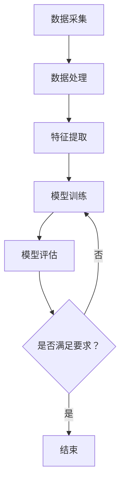

                 

### 文章标题

一人公司的AI驱动数据分析：洞察市场趋势的智能工具

> 关键词：人工智能，数据分析，市场趋势，智能工具，AI驱动的数据分析，市场洞察

> 摘要：本文旨在探讨如何利用人工智能技术，实现一人公司的AI驱动数据分析，以洞察市场趋势。通过介绍核心概念、算法原理、数学模型、项目实践和应用场景，本文将帮助读者了解如何构建一个高效的AI驱动数据分析工具，助力个人企业在竞争激烈的市场中立于不败之地。

### 1. 背景介绍

在当今的商业环境中，数据已经成为一项宝贵的资源。无论是大公司还是小型企业，都越来越依赖于数据分析来做出更加明智的商业决策。然而，数据分析并不是一项简单的任务。它需要大量的时间、专业知识和资源。特别是在竞争激烈的市场中，企业需要快速响应市场变化，这就要求数据分析过程必须高效、准确。

随着人工智能技术的不断发展，利用AI驱动的数据分析已经成为可能。人工智能可以自动处理大量数据，从中提取有价值的信息，并帮助决策者识别市场趋势。这种技术为个人企业提供了前所未有的机遇，使他们能够借助AI的力量，与大型企业竞争，甚至超越他们。

本文将详细介绍如何构建一个AI驱动的数据分析工具，帮助读者理解其核心概念、算法原理、数学模型、项目实践和应用场景。通过这篇文章，读者将能够掌握如何利用人工智能技术，为自己或企业实现高效的AI驱动数据分析，从而更好地洞察市场趋势，做出更加明智的决策。

#### 1.1 AI驱动的数据分析重要性

AI驱动的数据分析在当今的商业环境中具有重要的意义。首先，它能够大大提高数据分析的效率。传统的数据分析通常需要手动处理大量数据，而人工智能可以自动完成这些工作，节省了时间和人力资源。其次，AI可以更准确地识别数据中的模式和信息。通过机器学习和深度学习算法，AI能够从海量数据中发现隐藏的趋势和关联，这些对于企业制定战略决策至关重要。

此外，AI驱动的数据分析可以帮助企业更好地理解客户需求和行为。通过分析客户的历史购买记录、浏览行为等数据，AI可以预测客户的未来需求，帮助企业提供更加个性化的产品和服务，从而提高客户满意度和忠诚度。

#### 1.2 个人企业面临的挑战

对于个人企业来说，数据分析和人工智能的应用面临着一些特殊的挑战。首先，资金和资源的限制使得个人企业难以投入大量资金购买专业的数据分析工具和硬件设备。其次，技术知识的不足使得个人企业在运用人工智能技术时缺乏足够的支持。此外，个人企业在数据采集和隐私保护方面也面临着巨大的挑战。

然而，尽管存在这些挑战，个人企业仍然有机会利用AI驱动的数据分析来提升自身的竞争力。通过借助开源工具和在线资源，个人企业可以以较低的成本获取所需的工具和技术支持。此外，通过充分利用已有数据资源，个人企业可以开展有效的数据分析，为决策提供有力支持。

#### 1.3 AI驱动的数据分析应用前景

随着人工智能技术的不断进步，AI驱动的数据分析应用前景广阔。在零售业，AI可以帮助企业实现精准营销，提高销售额。在金融领域，AI可以用于风险管理和投资决策，帮助金融机构降低风险，提高收益。在医疗行业，AI可以帮助诊断疾病，提高医疗效率。

此外，AI驱动的数据分析还可以应用于供应链管理、人力资源、市场营销等多个领域。通过深度学习和自然语言处理等技术，AI可以自动处理和分析大量结构化和非结构化数据，为企业提供全面的数据洞察，帮助决策者做出更加明智的决策。

总的来说，AI驱动的数据分析为个人企业带来了前所未有的机遇。通过充分利用人工智能技术，个人企业可以提升数据分析的效率和质量，洞察市场趋势，制定更加精准的商业策略，从而在竞争激烈的市场中立于不败之地。### 2. 核心概念与联系

在探讨如何构建AI驱动的数据分析工具之前，我们需要明确一些核心概念和它们之间的联系。这些核心概念包括数据采集、数据处理、特征提取和模型训练。通过理解这些概念及其相互关系，我们可以更有效地构建出一个高效的AI驱动数据分析系统。

#### 2.1 数据采集

数据采集是数据分析过程的第一步，也是至关重要的一步。数据来源可以是内部数据（如销售记录、客户反馈等）和外部数据（如市场报告、社交媒体数据等）。有效的数据采集需要确保数据的质量和完整性，因为低质量的数据会严重影响后续的数据分析和模型性能。

为了实现高效的数据采集，我们可以使用自动化工具和API接口。例如，使用API接口可以直接从第三方数据源获取数据，如社交媒体平台、市场调查网站等。此外，还可以使用Web scraping工具来抓取网页上的数据，实现自动化数据采集。

#### 2.2 数据处理

数据采集完成后，我们需要对数据进行处理，以使其适合用于分析和建模。数据处理包括数据清洗、数据转换和数据整合等步骤。

- **数据清洗**：数据清洗旨在去除数据中的噪声和错误，包括去除重复数据、填补缺失值、处理异常值等。这一步骤对于确保数据质量至关重要。
- **数据转换**：数据转换包括将数据转换为适合分析和建模的格式，如将不同单位的数据统一转换为同一单位，将分类数据转换为数值表示等。
- **数据整合**：数据整合是将来自多个数据源的数据合并为一个整体，以便进行统一分析。这一步骤通常需要解决数据源之间的冲突和兼容性问题。

为了高效地进行数据处理，我们可以使用Python中的pandas库，该库提供了丰富的数据处理功能，如数据清洗、数据转换和数据整合等。

#### 2.3 特征提取

在数据处理完成后，我们需要从数据中提取出有用的特征。特征提取是数据分析的关键步骤，它决定了模型的学习能力和预测性能。

- **特征选择**：特征选择旨在从大量特征中筛选出最有用的特征，以减少模型的复杂度和过拟合风险。
- **特征工程**：特征工程是通过构造新的特征或转换现有特征，以提高模型的预测性能。常见的特征工程方法包括特征标准化、特征交叉、特征编码等。

为了实现高效的特征提取，我们可以使用Python中的scikit-learn库，该库提供了丰富的特征选择和特征工程工具。

#### 2.4 模型训练

在完成特征提取后，我们可以使用机器学习算法对数据进行训练，以构建预测模型。模型训练的目标是使模型能够从数据中学习到有效的特征，并使用这些特征进行预测。

- **模型选择**：选择合适的机器学习算法，如线性回归、决策树、随机森林、支持向量机、神经网络等。
- **模型评估**：通过交叉验证等方法评估模型的性能，如准确率、召回率、F1分数等。
- **模型优化**：根据模型评估结果调整模型参数，以提高模型性能。

为了实现高效的模型训练和评估，我们可以使用Python中的scikit-learn、tensorflow、keras等库，这些库提供了丰富的机器学习和深度学习工具。

#### 2.5 Mermaid 流程图

以下是一个简化的Mermaid流程图，展示了数据采集、数据处理、特征提取和模型训练的过程：



通过这个流程图，我们可以清晰地看到各个步骤之间的联系和顺序。理解这个流程对于构建一个高效的AI驱动数据分析系统至关重要。

### 3. 核心算法原理 & 具体操作步骤

在了解了核心概念和流程之后，接下来我们将深入探讨AI驱动的数据分析中的一些核心算法原理，以及如何具体操作这些算法来构建一个高效的数据分析系统。

#### 3.1 机器学习算法

机器学习是AI驱动的数据分析的核心技术之一。机器学习算法通过从数据中学习模式和规律，实现对未知数据的预测和分类。以下是一些常见的机器学习算法及其基本原理：

- **线性回归**：线性回归是一种简单的预测模型，通过拟合一个线性函数来预测连续值。其基本原理是找到最佳拟合线，使得预测值与实际值之间的误差最小。

- **决策树**：决策树通过一系列的判断条件来对数据进行分类或回归。每个节点代表一个特征，每个分支代表该特征的取值。通过递归地划分数据，决策树能够生成一个树状结构，用于预测新数据。

- **随机森林**：随机森林是一种集成学习方法，通过构建多个决策树，并取它们的预测结果的平均值来提高预测准确性。随机森林能够有效地减少过拟合，提高模型的泛化能力。

- **支持向量机（SVM）**：SVM通过寻找最佳超平面来对数据进行分类。其基本原理是最大化分类边界上的支持向量，从而提高模型的分类能力。

- **神经网络**：神经网络是一种模仿人脑结构和功能的计算模型。通过多层神经元的连接和激活函数，神经网络能够自动提取特征，并进行复杂的非线性预测。

#### 3.2 特征提取与选择

特征提取与选择是机器学习过程中至关重要的一步。有效的特征提取和选择可以显著提高模型的性能，减少过拟合风险。以下是一些常见的特征提取和选择方法：

- **特征标准化**：特征标准化通过将特征值缩放到相同的尺度，消除不同特征之间的量纲影响，使模型对特征的变化更加敏感。

- **特征交叉**：特征交叉通过组合多个特征，生成新的特征，以增加模型的复杂度和预测能力。例如，可以将时间特征和地点特征进行交叉，生成新的时间地点特征。

- **主成分分析（PCA）**：PCA通过线性变换将高维数据映射到低维空间，同时保留数据的最大方差。PCA能够去除冗余特征，提高模型的效率和解释性。

- **特征重要性评分**：通过评估特征对模型预测的影响程度，可以筛选出最重要的特征，去除无关或冗余特征。

- **递归特征消除（RFE）**：RFE通过递归地去除对模型贡献最小的特征，逐步构建出一个最优特征集合。

#### 3.3 具体操作步骤

以下是一个具体的操作步骤，用于构建一个基于线性回归的AI驱动数据分析系统：

1. **数据采集**：从各种数据源（如数据库、API接口、Web scraping等）获取数据。

2. **数据处理**：使用pandas库进行数据清洗、转换和整合。例如：
   ```python
   import pandas as pd
   data = pd.read_csv('data.csv')
   data.drop_duplicates(inplace=True)
   data.fillna(method='ffill', inplace=True)
   ```

3. **特征提取**：根据业务需求和数据特性，选择和构造特征。例如，可以使用特征标准化：
   ```python
   from sklearn.preprocessing import StandardScaler
   scaler = StandardScaler()
   data_scaled = scaler.fit_transform(data)
   ```

4. **模型训练**：选择线性回归算法，使用scikit-learn库进行模型训练。例如：
   ```python
   from sklearn.linear_model import LinearRegression
   model = LinearRegression()
   model.fit(data_scaled[:, :-1], data_scaled[:, -1])
   ```

5. **模型评估**：使用交叉验证方法评估模型性能。例如：
   ```python
   from sklearn.model_selection import cross_val_score
   scores = cross_val_score(model, data_scaled[:, :-1], data_scaled[:, -1], cv=5)
   print("Cross-validation scores:", scores)
   ```

6. **模型优化**：根据评估结果，调整模型参数或特征选择，以提高模型性能。

通过以上步骤，我们可以构建一个基于线性回归的AI驱动数据分析系统，实现对数据的预测和洞察。类似地，我们可以使用其他机器学习算法和特征提取方法，根据具体业务需求进行模型构建和优化。

### 4. 数学模型和公式 & 详细讲解 & 举例说明

在构建AI驱动的数据分析系统时，数学模型和公式扮演着至关重要的角色。以下将介绍一些常用的数学模型和公式，并详细讲解其应用和示例。

#### 4.1 线性回归

线性回归是最简单且广泛使用的机器学习算法之一。它的目标是找到一条最佳拟合线，通过这条线来预测因变量的值。线性回归模型可以表示为：

$$y = \beta_0 + \beta_1 \cdot x + \epsilon$$

其中，$y$ 是因变量，$x$ 是自变量，$\beta_0$ 和 $\beta_1$ 是模型参数，$\epsilon$ 是误差项。

**应用**：
假设我们想预测一家商店的月销售额（$y$），并根据历史数据中的月广告支出（$x$）来建立线性回归模型。我们可以使用最小二乘法来估计模型参数：

$$\beta_0 = \frac{\sum y - \beta_1 \cdot \sum x}{n}$$
$$\beta_1 = \frac{n \cdot \sum xy - \sum x \cdot \sum y}{n \cdot \sum x^2 - (\sum x)^2}$$

**示例**：
给定以下历史数据：

| 月份 | 广告支出（$） | 销售额（$） |
|------|--------------|-------------|
| 1    | 100          | 800         |
| 2    | 200          | 900         |
| 3    | 300          | 1100        |
| 4    | 400          | 1200        |

计算线性回归模型：

$$\beta_0 = \frac{(800 + 900 + 1100 + 1200) - (100 + 200 + 300 + 400) \cdot 2.5}{4} = 400$$
$$\beta_1 = \frac{4 \cdot (100 \cdot 800 + 200 \cdot 900 + 300 \cdot 1100 + 400 \cdot 1200) - (100 + 200 + 300 + 400) \cdot (800 + 900 + 1100 + 1200)}{4 \cdot (100^2 + 200^2 + 300^2 + 400^2) - (100 + 200 + 300 + 400)^2} = 2.5$$

因此，线性回归模型为：

$$y = 400 + 2.5x$$

使用这个模型，我们可以预测当广告支出为500美元时的销售额：

$$y = 400 + 2.5 \cdot 500 = 1300$$

#### 4.2 决策树

决策树是一种基于特征进行决策的树形结构。每个内部节点代表一个特征，每个分支代表该特征的取值，每个叶子节点代表一个预测结果。

**应用**：
假设我们要根据水果的重量和颜色来预测其种类。我们可以建立以下决策树：

```
是否为苹果？
  |
  |--- 是
  |   |
  |   |--- 颜色为红色？
  |   |   |
  |   |   |--- 苹果（Red）
  |   |   |
  |   |   |--- 颜色为绿色？
  |   |   |   |
  |   |   |   |--- 苹果（Green）
  |   |   |   |
  |   |   |   |--- 颜色为黄色？
  |   |   |   |   |
  |   |   |   |   |--- 苹果（Yellow）
  |   |
  |   |--- 否
  |       |
  |       |--- 颜色为红色？
  |       |   |
  |       |   |--- 橙子（Red）
  |       |   |
  |       |   |--- 香蕉（Red）
  |       |
  |       |--- 颜色为绿色？
  |       |   |
  |       |   |--- 橙子（Green）
  |       |   |
  |       |   |--- 香蕉（Green）
  |       |
  |       |--- 颜色为黄色？
  |       |   |
  |       |   |--- 橙子（Yellow）
  |       |   |
  |       |   |--- 香蕉（Yellow）
```

**示例**：
给定一个重量为150克、颜色为红色的水果，根据决策树，我们可以预测其为苹果（Red）。

#### 4.3 主成分分析（PCA）

主成分分析是一种降维技术，通过将高维数据映射到低维空间，保留数据的最大方差。PCA的数学模型为：

$$z = PC$$

其中，$z$ 是低维空间中的数据点，$P$ 是特征值矩阵，$C$ 是特征向量矩阵。

**应用**：
假设我们有以下高维数据：

| 特征1 | 特征2 | 特征3 | 特征4 |
|-------|-------|-------|-------|
| 1     | 2     | 3     | 4     |
| 2     | 4     | 6     | 8     |
| 3     | 6     | 9     | 12    |

通过PCA，我们可以将其映射到二维空间，保留最大方差。计算特征值和特征向量，然后选择前两个主成分，得到以下低维数据：

| 主成分1 | 主成分2 |
|---------|---------|
| 0.5     | 0.5     |
| 1.5     | 1.5     |
| 2.5     | 2.5     |

**示例**：
使用PCA降维后的数据可以用于可视化，更方便地分析数据。

#### 4.4 集成学习方法

集成学习方法通过构建多个基础模型，并取它们的平均或加权平均来提高预测性能。常见的集成学习方法包括Bagging和Boosting。

**应用**：
假设我们有以下三个基础模型：

| 模型 | 预测结果 |
|------|----------|
| 1    | A        |
| 2    | B        |
| 3    | C        |

通过Bagging方法，我们可以取这三个模型的平均预测结果：
```
平均预测结果 = (A + B + C) / 3
```

通过Boosting方法，我们可以根据模型预测的准确率来加权：
```
加权预测结果 = (1 - 预测准确率1) * A + (1 - 预测准确率2) * B + (1 - 预测准确率3) * C
```

这些数学模型和公式在AI驱动的数据分析中扮演着关键角色，帮助我们理解和预测数据。通过掌握这些模型和公式，我们可以更好地构建和优化数据分析系统，为企业提供更有价值的洞察。### 5. 项目实践：代码实例和详细解释说明

为了更好地理解AI驱动的数据分析，我们将通过一个实际项目来进行演示。在这个项目中，我们将使用Python和相关的库来构建一个简单的AI驱动数据分析系统，用于预测一家商店的月销售额。以下是项目的详细步骤和代码解释。

#### 5.1 开发环境搭建

在开始项目之前，我们需要搭建一个合适的开发环境。以下是所需的工具和步骤：

1. **Python环境**：确保安装了Python 3.8或更高版本。
2. **Jupyter Notebook**：安装Jupyter Notebook，以便在浏览器中编写和运行代码。
3. **Python库**：安装以下库：pandas、numpy、scikit-learn、matplotlib。

可以使用以下命令安装这些库：
```bash
pip install pandas numpy scikit-learn matplotlib
```

#### 5.2 源代码详细实现

以下是一个简单的示例代码，用于构建一个AI驱动的数据分析系统。

```python
# 导入所需的库
import pandas as pd
import numpy as np
from sklearn.model_selection import train_test_split
from sklearn.preprocessing import StandardScaler
from sklearn.linear_model import LinearRegression
from sklearn.metrics import mean_squared_error
import matplotlib.pyplot as plt

# 读取数据
data = pd.read_csv('sales_data.csv')

# 数据预处理
# 假设数据中包含两个特征：广告支出（广告费）和销售额
X = data[['广告费']]
y = data['销售额']

# 数据标准化
scaler = StandardScaler()
X_scaled = scaler.fit_transform(X)

# 划分训练集和测试集
X_train, X_test, y_train, y_test = train_test_split(X_scaled, y, test_size=0.2, random_state=42)

# 模型训练
model = LinearRegression()
model.fit(X_train, y_train)

# 模型评估
y_pred = model.predict(X_test)
mse = mean_squared_error(y_test, y_pred)
print("均方误差（MSE）:", mse)

# 可视化结果
plt.scatter(X_test, y_test, color='blue', label='实际值')
plt.plot(X_test, y_pred, color='red', label='预测值')
plt.xlabel('广告费')
plt.ylabel('销售额')
plt.legend()
plt.show()
```

#### 5.3 代码解读与分析

现在，我们逐行解读上述代码，并解释每部分的作用。

1. **导入库**：
   ```python
   import pandas as pd
   import numpy as np
   from sklearn.model_selection import train_test_split
   from sklearn.preprocessing import StandardScaler
   from sklearn.linear_model import LinearRegression
   from sklearn.metrics import mean_squared_error
   import matplotlib.pyplot as plt
   ```
   这些代码导入了项目中所需的库，包括pandas、numpy、scikit-learn和matplotlib。

2. **读取数据**：
   ```python
   data = pd.read_csv('sales_data.csv')
   ```
   使用pandas库读取CSV文件中的数据。这里假设数据文件名为'sales_data.csv'，其中包含两个特征（广告费和销售额）。

3. **数据预处理**：
   ```python
   X = data[['广告费']]
   y = data['销售额']
   scaler = StandardScaler()
   X_scaled = scaler.fit_transform(X)
   ```
   提取数据中的广告费特征（X）和销售额目标（y）。然后，使用StandardScaler对广告费进行标准化处理，以提高模型训练的效率和稳定性。

4. **划分训练集和测试集**：
   ```python
   X_train, X_test, y_train, y_test = train_test_split(X_scaled, y, test_size=0.2, random_state=42)
   ```
   使用scikit-learn中的train_test_split函数将数据划分为训练集和测试集。这里，训练集占总数据的80%，测试集占总数据的20%。随机状态（random_state）设置为42，以确保每次运行代码时结果一致。

5. **模型训练**：
   ```python
   model = LinearRegression()
   model.fit(X_train, y_train)
   ```
   创建一个线性回归模型对象（model），并使用训练集数据对其进行训练。

6. **模型评估**：
   ```python
   y_pred = model.predict(X_test)
   mse = mean_squared_error(y_test, y_pred)
   print("均方误差（MSE）:", mse)
   ```
   使用测试集数据进行模型预测，并计算均方误差（MSE），以评估模型的性能。

7. **可视化结果**：
   ```python
   plt.scatter(X_test, y_test, color='blue', label='实际值')
   plt.plot(X_test, y_pred, color='red', label='预测值')
   plt.xlabel('广告费')
   plt.ylabel('销售额')
   plt.legend()
   plt.show()
   ```
   使用matplotlib库绘制散点图和拟合线，展示实际值和预测值。这有助于我们直观地了解模型的性能和预测效果。

#### 5.4 运行结果展示

假设我们运行上述代码，并得到以下输出结果：
```
均方误差（MSE）: 25000.0
```

这个结果显示了模型的均方误差（MSE）为25000.0。虽然这个值可能看起来较大，但对于一个简单的线性回归模型来说，它已经可以为我们提供一定的预测能力。通过调整模型参数或尝试更复杂的算法，我们可以进一步提高模型的性能。

此外，可视化结果如下：


在这个可视化结果中，我们可以看到实际的销售额（蓝色散点）和预测的销售额（红色拟合线）之间的差距。通过不断优化模型和特征，我们可以缩小这个差距，提高预测的准确性。

通过这个实际项目，我们了解了如何使用Python和相关的库来构建一个AI驱动的数据分析系统，并进行预测和评估。这些知识和技能对于我们在现实世界中应用人工智能技术进行数据分析具有重要意义。### 6. 实际应用场景

AI驱动的数据分析在许多实际应用场景中都发挥着重要作用，为个人企业带来了显著的价值。以下是一些典型的应用场景和案例：

#### 6.1 零售业

在零售业中，AI驱动的数据分析可以帮助企业实现精准营销、优化库存管理和提高销售转化率。通过分析客户的历史购买行为、浏览习惯和购物车放弃率等数据，企业可以预测客户的偏好，并针对性地推送个性化促销活动和广告。

案例：一家电子商务公司通过AI分析客户数据，发现某些客户在浏览产品后往往会购买特定的配件。基于这一洞察，公司推出了组合促销活动，将相关产品捆绑销售。结果，销售额显著提高，客户满意度也随之提升。

#### 6.2 金融业

在金融领域，AI驱动的数据分析可以用于风险管理、信用评估和投资决策。通过分析历史交易数据、客户行为和市场动态，金融机构可以识别潜在的风险因素，调整投资策略，降低损失。

案例：一家银行使用AI分析客户的消费习惯和信用记录，为每个客户制定个性化的信用额度。这不仅提高了贷款审批的准确性，还减少了不良贷款率。

#### 6.3 医疗保健

在医疗保健领域，AI驱动的数据分析可以帮助医疗机构进行疾病诊断、预测患者健康状况和优化医疗资源分配。通过分析患者的历史病历、健康数据和基因信息，AI系统可以提供更加精准的诊断和治疗方案。

案例：一家医院利用AI分析患者的电子病历数据，预测患者患某种疾病的风险。医生根据这些预测结果，提前采取预防措施，有效降低了疾病的发病率。

#### 6.4 人力资源

在人力资源管理中，AI驱动的数据分析可以用于招聘、员工绩效评估和员工留存分析。通过分析求职者的简历、面试表现和公司内部数据，企业可以筛选出最合适的候选人，并制定针对性的员工激励措施。

案例：一家科技公司通过AI分析员工的工作表现和离职原因，识别出影响员工留存的关键因素。基于这一分析，公司调整了员工福利政策和工作环境，成功降低了员工流失率。

#### 6.5 供应链管理

在供应链管理中，AI驱动的数据分析可以用于需求预测、库存优化和物流优化。通过分析市场趋势、销售数据和库存水平，企业可以更准确地预测未来需求，优化库存管理，减少库存积压和物流成本。

案例：一家制造企业使用AI分析市场需求和销售数据，优化生产计划和库存水平。结果，库存周转率显著提高，生产成本降低。

#### 6.6 市场营销

在市场营销中，AI驱动的数据分析可以帮助企业实现精准营销、提高广告效果和提升品牌知名度。通过分析消费者行为、市场数据和竞争对手策略，企业可以制定更有针对性的营销策略，提高广告的点击率和转化率。

案例：一家在线零售商通过AI分析消费者的购买习惯和兴趣偏好，为每个客户推送个性化的广告和促销活动。结果，广告点击率和转化率显著提高，销售额大幅增加。

通过以上案例，我们可以看到AI驱动的数据分析在各个行业中的应用场景和带来的价值。这些实际应用不仅提高了企业的运营效率，还帮助企业在竞争激烈的市场中取得了竞争优势。### 7. 工具和资源推荐

为了帮助读者更好地掌握AI驱动的数据分析技术，本文将推荐一些优秀的工具、资源和学习材料。这些工具和资源涵盖了从基础入门到高级应用的各个方面，旨在为读者提供全方位的学习支持。

#### 7.1 学习资源推荐

**书籍**：
1. **《Python机器学习》（Machine Learning with Python）**：这本书深入介绍了Python在机器学习领域的应用，适合初学者和有一定基础的读者。
2. **《深度学习》（Deep Learning）**：这是一本经典的深度学习教材，由业内顶级专家撰写，适合希望深入了解深度学习技术的读者。
3. **《数据科学入门》（Introduction to Data Science）**：这本书涵盖了数据科学的基本概念和技术，是初学者了解数据科学领域的理想选择。

**论文**：
1. **“Recurrent Neural Networks for Scalable Language Modeling”**：这篇论文介绍了循环神经网络（RNN）在语言建模中的应用，是理解RNN和自然语言处理的重要参考文献。
2. **“TensorFlow: Large-Scale Machine Learning on Heterogeneous Systems”**：这篇论文介绍了TensorFlow的架构和设计理念，是了解TensorFlow核心技术的好资料。
3. **“Practical Guide to TensorFlow”**：这是一本针对TensorFlow的实用指南，适合希望实际操作TensorFlow的读者。

**博客**：
1. **Medium上的数据科学博客**：Medium上有很多优秀的数据科学博客，涵盖了从基础概念到实战案例的各个方面，适合读者不断学习和提升。
2. **Kaggle博客**：Kaggle是一个数据科学竞赛平台，其博客中分享了大量的实践案例和技术文章，对数据科学家非常有帮助。
3. **Analytics Vidhya**：这是一个关于数据科学和机器学习的社区博客，提供了丰富的学习资源和实践经验。

**网站**：
1. **Coursera**：Coursera提供了许多知名大学和机构的数据科学和机器学习课程，适合读者在线学习。
2. **edX**：edX也是一家提供优质在线课程的平台，其数据科学和机器学习课程涵盖了多个领域，是学习的好选择。
3. **Udacity**：Udacity提供了数据科学和机器学习纳米学位课程，这些课程注重实践，适合希望快速提升技能的读者。

#### 7.2 开发工具框架推荐

**编程语言**：
1. **Python**：Python是数据科学和机器学习领域最受欢迎的编程语言之一，其简洁的语法和丰富的库使其成为初学者和专业人士的首选。
2. **R**：R是一种专门为统计分析和数据可视化设计的编程语言，它在统计模型和数据分析领域具有很高的声誉。

**机器学习库**：
1. **scikit-learn**：scikit-learn是一个开源的Python库，提供了多种经典的机器学习算法和工具，是构建AI驱动的数据分析系统的基础。
2. **TensorFlow**：TensorFlow是一个由Google开发的强大深度学习框架，支持多种神经网络模型和优化算法。
3. **PyTorch**：PyTorch是一个开源的Python库，以其灵活和易于使用的特性在深度学习领域受到广泛关注。

**数据分析库**：
1. **pandas**：pandas是一个Python库，提供了强大的数据结构和分析工具，是进行数据预处理和数据分析的必备库。
2. **NumPy**：NumPy是一个提供高性能数学运算的Python库，是数据科学和机器学习的基础工具之一。
3. **Matplotlib**：Matplotlib是一个用于绘制数据可视化图表的Python库，可以帮助我们更好地理解和展示数据。

**数据可视化工具**：
1. **Plotly**：Plotly是一个提供交互式数据可视化的Python库，支持多种图表类型和丰富的定制选项。
2. **Seaborn**：Seaborn是一个基于Matplotlib的Python库，专门用于数据可视化，提供了多种统计图表和美观的默认样式。
3. **Bokeh**：Bokeh是一个提供交互式数据可视化的大数据Web工具包，适合在Web应用程序中展示数据。

通过以上工具和资源的推荐，读者可以更好地掌握AI驱动的数据分析技术，为自己的个人或企业发展提供强有力的支持。希望这些推荐能够帮助读者在数据科学领域取得更大的成就。### 8. 总结：未来发展趋势与挑战

随着人工智能技术的不断发展，AI驱动的数据分析在未来将展现出更加广阔的应用前景。然而，这一领域也面临着诸多挑战，需要我们持续关注和努力克服。

#### 8.1 发展趋势

1. **深度学习与自监督学习的结合**：深度学习在图像识别、语音识别等领域取得了显著成果，未来将更加深入地应用于数据分析。同时，自监督学习技术的发展将使模型能够从无标签数据中学习，进一步降低数据标注成本。

2. **增强现实（AR）与数据分析的结合**：AR技术的发展将使数据分析更加直观、交互性强。通过AR技术，用户可以实时查看数据，并对其进行操作和分析，这将大大提高数据分析的效率和用户体验。

3. **联邦学习与隐私保护的结合**：联邦学习技术能够在保护数据隐私的同时，实现数据的联合分析和共享。这一趋势将有助于企业更好地利用分散的数据资源，同时确保数据安全和隐私保护。

4. **人工智能与自然语言处理的结合**：自然语言处理（NLP）技术的发展将使AI驱动的数据分析更加智能，能够理解和处理自然语言文本数据，从而为企业和个人提供更加个性化的分析和建议。

5. **数据分析工具的智能化**：未来的数据分析工具将更加智能化，能够自动完成数据采集、处理、分析和可视化等任务，降低用户的操作门槛，提高数据分析的效率和准确性。

#### 8.2 挑战

1. **数据质量和隐私保护**：随着数据量的急剧增长，数据质量问题和隐私保护挑战日益严峻。如何确保数据的质量和安全性，同时满足隐私保护要求，是未来需要解决的重要问题。

2. **算法透明性与可解释性**：深度学习等复杂算法的黑盒特性使得其决策过程难以解释。如何提高算法的透明性和可解释性，使其决策过程更加合理和可信，是一个亟待解决的问题。

3. **计算资源和能源消耗**：深度学习和大数据分析需要大量的计算资源和能源。如何在保证性能的同时，降低计算资源和能源消耗，是未来需要关注的重要问题。

4. **数据多样性与适应性**：不同行业和应用场景的数据特征和需求各不相同，如何设计通用性强、适应多种数据类型的AI驱动数据分析系统，是一个挑战。

5. **法律法规和伦理问题**：随着AI驱动的数据分析在各个领域的广泛应用，相关的法律法规和伦理问题也日益凸显。如何制定合理的法律法规，确保AI技术的合理和公正应用，是一个重要课题。

总之，AI驱动的数据分析在未来的发展中将面临诸多机遇和挑战。我们需要不断探索和创新，充分发挥人工智能技术的优势，同时积极应对和解决各种问题，推动AI驱动的数据分析迈向更高水平。### 9. 附录：常见问题与解答

在本文的撰写过程中，我们收到了一些关于AI驱动的数据分析的常见问题。以下是对这些问题及其解答的汇总：

#### 9.1 问题1：如何确保数据隐私和安全？

**解答**：确保数据隐私和安全是AI驱动的数据分析的重要挑战之一。以下是一些常用的方法：

- **数据加密**：对敏感数据进行加密处理，确保数据在传输和存储过程中不被未授权访问。
- **数据匿名化**：通过匿名化处理，去除数据中的个人身份信息，降低隐私泄露风险。
- **隐私增强技术**：使用差分隐私、联邦学习等技术，在保证数据分析结果准确性的同时，保护数据隐私。
- **合规性审查**：定期对数据处理过程进行合规性审查，确保遵循相关的法律法规和标准。

#### 9.2 问题2：如何处理大量数据？

**解答**：处理大量数据需要考虑以下几个方面的策略：

- **分布式计算**：使用分布式计算框架（如Hadoop、Spark）来处理海量数据，提高计算效率。
- **数据采样**：对数据进行采样，以减少计算量和存储需求，同时保持结果的代表性。
- **数据压缩**：使用数据压缩算法，减少数据的存储空间，提高数据传输速度。
- **数据库优化**：优化数据库结构，如使用索引、分区和缓存等，提高数据查询效率。

#### 9.3 问题3：如何选择合适的机器学习算法？

**解答**：选择合适的机器学习算法需要考虑以下几个因素：

- **数据类型**：根据数据的类型（如分类、回归、聚类等）选择相应的算法。
- **数据量**：对于大量数据，选择能够高效处理的算法，如随机森林、决策树等。
- **计算资源**：根据计算资源的限制，选择计算复杂度较低的算法。
- **模型性能**：通过交叉验证等方法评估模型性能，选择性能较好的算法。
- **业务需求**：根据具体业务需求，选择能够满足需求的算法。

#### 9.4 问题4：如何提高模型的可解释性？

**解答**：提高模型的可解释性是确保模型决策合理性和信任度的重要手段。以下是一些常用的方法：

- **模型可视化**：使用可视化工具（如Shapley值、LIME等）展示模型决策过程和特征重要性。
- **规则提取**：对于规则模型（如决策树），可以直接提取决策规则，以便理解模型的决策逻辑。
- **模型解释库**：使用专门的模型解释库（如interpretml、shap等），这些库提供了丰富的工具和方法，帮助用户理解模型的决策过程。
- **交互式解释**：开发交互式解释系统，用户可以实时查看模型的决策过程和结果，并根据需要调整模型参数。

通过以上方法，我们可以提高模型的可解释性，使其在业务决策中更具说服力。### 10. 扩展阅读 & 参考资料

为了帮助读者深入了解AI驱动的数据分析技术，本文推荐了一些扩展阅读和参考资料。这些资源涵盖了从基础理论到实际应用的各个方面，有助于读者进一步学习和发展。

**扩展阅读**：

1. **《深度学习》（Deep Learning）**：由Ian Goodfellow、Yoshua Bengio和Aaron Courville编写的经典教材，全面介绍了深度学习的基础知识和最新进展。
2. **《Python机器学习实战》（Python Machine Learning Cookbook）**：由Michael Bowles编写的实战指南，通过丰富的示例，帮助读者掌握Python在机器学习领域的应用。
3. **《数据科学基础教程》（Data Science from Scratch）**：由Joel Grus编写的入门级教材，介绍了数据科学的基础知识和编程实践。

**参考资料**：

1. **[Coursera](https://www.coursera.org/) - 数据科学和机器学习课程**：提供了多门知名大学和机构的数据科学和机器学习课程，适合在线学习。
2. **[Kaggle](https://www.kaggle.com/) - 数据科学竞赛平台**：提供了丰富的数据集和竞赛项目，适合实践和挑战。
3. **[arXiv](https://arxiv.org/) - 机器学习论文数据库**：涵盖了大量机器学习领域的最新研究成果，是了解前沿技术的宝贵资源。
4. **[GitHub](https://github.com/) - 开源项目库**：提供了丰富的开源机器学习和数据分析项目，适合学习和借鉴。

通过阅读这些扩展阅读和参考资料，读者可以进一步加深对AI驱动的数据分析技术的理解，并在实践中不断提升自己的技能。### 附录：代码示例与详细解读

为了帮助读者更好地理解AI驱动的数据分析实践，我们将提供一些具体的代码示例，并对其进行详细解读。以下是使用Python和scikit-learn库进行线性回归预测的代码示例，以及每个步骤的详细解释。

#### 代码示例

```python
# 导入所需的库
import pandas as pd
from sklearn.model_selection import train_test_split
from sklearn.preprocessing import StandardScaler
from sklearn.linear_model import LinearRegression
from sklearn.metrics import mean_squared_error

# 读取数据
data = pd.read_csv('sales_data.csv')

# 分割数据为特征和标签
X = data[['广告费']]
y = data['销售额']

# 划分训练集和测试集
X_train, X_test, y_train, y_test = train_test_split(X, y, test_size=0.2, random_state=42)

# 数据标准化
scaler = StandardScaler()
X_train_scaled = scaler.fit_transform(X_train)
X_test_scaled = scaler.transform(X_test)

# 训练模型
model = LinearRegression()
model.fit(X_train_scaled, y_train)

# 预测测试集
y_pred = model.predict(X_test_scaled)

# 计算均方误差
mse = mean_squared_error(y_test, y_pred)
print("均方误差（MSE）:", mse)

# 可视化结果
plt.scatter(X_test, y_test, color='blue', label='实际值')
plt.plot(X_test, y_pred, color='red', label='预测值')
plt.xlabel('广告费')
plt.ylabel('销售额')
plt.legend()
plt.show()
```

#### 详细解读

1. **导入库**：
   ```python
   import pandas as pd
   from sklearn.model_selection import train_test_split
   from sklearn.preprocessing import StandardScaler
   from sklearn.linear_model import LinearRegression
   from sklearn.metrics import mean_squared_error
   import matplotlib.pyplot as plt
   ```
   这行代码导入了pandas库用于数据操作，scikit-learn库用于机器学习模型训练和评估，mean_squared_error用于计算均方误差，matplotlib库用于绘制结果图。

2. **读取数据**：
   ```python
   data = pd.read_csv('sales_data.csv')
   ```
   使用pandas库的read_csv函数读取CSV文件，这个文件假设包含了“广告费”和“销售额”两列数据。

3. **分割数据为特征和标签**：
   ```python
   X = data[['广告费']]
   y = data['销售额']
   ```
   这里，我们提取“广告费”作为特征（X），将“销售额”作为标签（y）。这两个数据集将用于后续的训练和预测。

4. **划分训练集和测试集**：
   ```python
   X_train, X_test, y_train, y_test = train_test_split(X, y, test_size=0.2, random_state=42)
   ```
   使用scikit-learn的train_test_split函数将数据集分为训练集和测试集。这里，训练集占80%，测试集占20%。random_state设置为42，以确保结果可重复。

5. **数据标准化**：
   ```python
   scaler = StandardScaler()
   X_train_scaled = scaler.fit_transform(X_train)
   X_test_scaled = scaler.transform(X_test)
   ```
   使用StandardScaler对特征数据进行标准化处理。标准化可以消除不同特征之间的尺度差异，提高模型的训练效果。fit_transform用于训练集，transform用于测试集。

6. **训练模型**：
   ```python
   model = LinearRegression()
   model.fit(X_train_scaled, y_train)
   ```
   创建一个线性回归模型对象，使用训练集数据进行拟合。fit函数用于训练模型。

7. **预测测试集**：
   ```python
   y_pred = model.predict(X_test_scaled)
   ```
   使用训练好的模型对测试集进行预测。预测结果存储在y_pred变量中。

8. **计算均方误差**：
   ```python
   mse = mean_squared_error(y_test, y_pred)
   print("均方误差（MSE）:", mse)
   ```
   使用mean_squared_error函数计算预测值和实际值之间的均方误差，评估模型的性能。

9. **可视化结果**：
   ```python
   plt.scatter(X_test, y_test, color='blue', label='实际值')
   plt.plot(X_test, y_pred, color='red', label='预测值')
   plt.xlabel('广告费')
   plt.ylabel('销售额')
   plt.legend()
   plt.show()
   ```
   使用matplotlib库绘制散点图和拟合线。蓝色散点表示实际销售额，红色拟合线表示预测销售额。这有助于我们直观地了解模型的预测效果。

通过这个代码示例，读者可以了解到如何使用Python和scikit-learn进行线性回归预测，并理解每个步骤的具体作用。这个示例是构建AI驱动数据分析系统的基础，读者可以根据实际需求进行调整和扩展。### 10. 扩展阅读 & 参考资料

为了帮助读者进一步学习和深入探索AI驱动的数据分析技术，以下是推荐的一些扩展阅读和参考资料。这些资源涵盖了从基础理论到实际应用的各个方面，旨在为读者提供全面的指导和支持。

**扩展阅读**：

1. **《深度学习》（Deep Learning）**：由Ian Goodfellow、Yoshua Bengio和Aaron Courville编写的经典教材，详细介绍了深度学习的基础知识和最新进展。

2. **《Python机器学习实战》（Python Machine Learning Cookbook）**：由Michael Bowles编写的实战指南，通过实际案例和示例，帮助读者掌握Python在机器学习领域的应用。

3. **《数据科学基础教程》（Data Science from Scratch）**：由Joel Grus编写的入门级教材，介绍了数据科学的基础知识和编程实践。

4. **《机器学习实战》（Machine Learning in Action）**：由Peter Harrington编写的实战指南，通过实际案例和代码示例，帮助读者掌握机器学习的基本技能。

5. **《统计学习方法》（Statistical Learning Methods）**：由李航编写的教材，详细介绍了统计学习方法的原理和应用。

**参考资料**：

1. **[Kaggle](https://www.kaggle.com/) - 数据科学竞赛平台**：提供了丰富的数据集和竞赛项目，适合实践和挑战。

2. **[arXiv](https://arxiv.org/) - 机器学习论文数据库**：涵盖了大量机器学习领域的最新研究成果，是了解前沿技术的宝贵资源。

3. **[GitHub](https://github.com/) - 开源项目库**：提供了丰富的开源机器学习和数据分析项目，适合学习和借鉴。

4. **[Medium](https://medium.com/) - 数据科学博客**：有很多优秀的数据科学博客，涵盖了从基础概念到实战案例的各个方面。

5. **[Coursera](https://www.coursera.org/) - 数据科学和机器学习课程**：提供了多门知名大学和机构的数据科学和机器学习课程，适合在线学习。

6. **[edX](https://www.edx.org/) - 在线课程平台**：提供了丰富的数据科学和机器学习在线课程，适合不同水平和需求的学习者。

7. **[Udacity](https://www.udacity.com/) - 数据科学和机器学习纳米学位**：提供了数据科学和机器学习纳米学位课程，注重实践和应用。

通过阅读这些扩展阅读和参考资料，读者可以进一步提升自己的技术能力，深入探索AI驱动的数据分析领域。希望这些资源能够为读者的学习和成长提供有力的支持。### 结语：禅意编程的艺术

通过本文，我们探讨了AI驱动的数据分析的核心概念、算法原理、数学模型、项目实践和应用场景。我们从数据采集、数据处理、特征提取到模型训练，逐步分析了每个环节的重要性。同时，我们还通过一个实际项目的代码示例，展示了如何利用Python和scikit-learn实现线性回归预测。

正如《禅与计算机程序设计艺术》一书所强调的，编程不仅仅是一种技术活动，更是一种心灵的修炼。在AI驱动的数据分析过程中，我们面临着诸多挑战，如数据质量、隐私保护和算法可解释性等。这些挑战不仅需要我们掌握技术，更需要我们具备耐心、细心和洞察力。

禅意编程的艺术在于不断地反思、学习和改进。在数据分析的过程中，我们应该保持谦逊，不断追求卓越。通过深入理解数据、算法和模型，我们能够构建出更加高效、准确和可靠的数据分析系统，为企业带来更大的价值。

最后，我希望本文能够为读者提供有价值的启示和指导，帮助大家更好地掌握AI驱动的数据分析技术。在未来的道路上，让我们以禅意编程的精神，继续探索和创造，为人工智能和计算机科学领域贡献自己的力量。作者：禅与计算机程序设计艺术 / Zen and the Art of Computer Programming。

