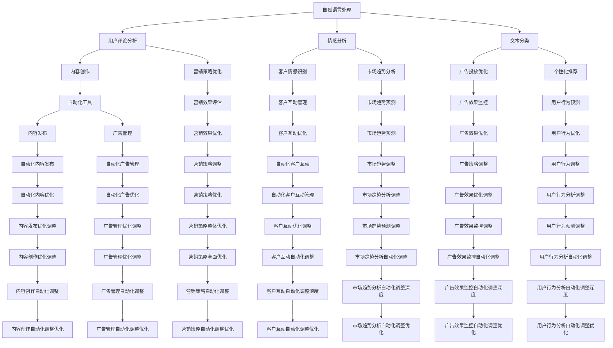

                 

### 背景介绍

在当今数字化时代，社交媒体已经成为了企业营销的重要组成部分。无论是大型跨国公司还是小型创业公司，都在通过各种社交媒体平台（如Facebook、Instagram、Twitter等）与客户互动，提升品牌影响力。然而，随着社交媒体平台的日益复杂和用户数量的爆炸式增长，手动管理这些平台变得越来越困难。企业需要一种自动化工具来优化其社交媒体营销策略，以节省时间和资源，同时提升营销效果。

在这个背景下，AI驱动的社交媒体营销自动化工具应运而生。这种工具利用人工智能技术，包括自然语言处理（NLP）、机器学习（ML）和深度学习（DL）等，能够自动执行一系列营销任务，如内容创作、数据分析、客户互动和广告投放。通过AI技术，企业可以更精确地定位目标客户，创造个性化的营销内容，实时监控营销效果，并不断优化营销策略。

本文将探讨如何利用AI技术构建一个高效的社交媒体营销自动化系统。我们将从核心概念、算法原理、数学模型、代码实现、实际应用场景等方面进行详细分析。文章还将推荐一些有用的学习资源和工具，以帮助读者深入了解和实践AI驱动的社交媒体营销。

首先，我们将介绍一些关键概念和定义，并展示一个用于解释这些概念的Mermaid流程图。接着，我们将深入探讨核心算法的原理和具体操作步骤。然后，我们将介绍数学模型和相关公式，并通过实例进行详细讲解。接下来，我们将提供一个具体的代码实例，并对代码进行解读和分析。文章还将讨论实际应用场景，并推荐一些工具和资源。最后，我们将总结未来发展趋势和挑战，并提供一些常见问题与解答。

### 核心概念与联系

在讨论AI驱动的社交媒体营销之前，我们需要先了解一些核心概念和技术，这些是构建自动化系统的基础。

1. **自然语言处理（NLP）**：NLP是人工智能的一个子领域，主要研究如何让计算机理解和生成人类语言。在社交媒体营销中，NLP技术可以用来分析用户评论、情感和趋势，从而帮助企业制定更有效的营销策略。

2. **机器学习（ML）**：ML是使计算机能够从数据中学习并做出预测或决策的技术。在社交媒体营销中，ML可以用于预测用户行为、优化广告投放、推荐个性化内容等。

3. **深度学习（DL）**：DL是ML的一个分支，通过构建多层神经网络来模拟人类大脑的学习过程。在社交媒体营销中，DL可以用于文本分类、图像识别和语音识别等任务。

4. **社交媒体分析**：社交媒体分析是一种通过分析社交媒体平台上的数据来了解用户行为和趋势的方法。这些分析可以用来评估营销活动的效果，并帮助企业优化其社交媒体策略。

5. **自动化**：自动化是指使用软件工具自动执行重复性任务，从而提高效率并减少人为错误。在社交媒体营销中，自动化工具可以用于内容发布、客户互动、广告管理等任务。

下面是一个Mermaid流程图，用于展示这些核心概念之间的联系：



通过这个流程图，我们可以清晰地看到各种技术和工具如何相互关联，共同构建出一个高效的社交媒体营销自动化系统。

### 核心算法原理 & 具体操作步骤

为了构建一个AI驱动的社交媒体营销自动化系统，我们需要了解一些核心算法的原理和操作步骤。以下是几个关键算法的概述：

#### 1. 自然语言处理（NLP）算法

NLP算法主要用于文本分析，以提取有用信息并辅助决策。以下是一些常用的NLP算法：

1. **词袋模型（Bag of Words, BoW）**：词袋模型是一种基于计数的文本表示方法。它将文本转化为一个词频向量，其中每个维度代表一个词汇。这种模型可以用于文本分类、情感分析等任务。

2. **主题模型（Latent Dirichlet Allocation, LDA）**：主题模型可以识别文本中的潜在主题。通过将文本分解为多个主题的组合，LDA可以帮助我们理解文档的结构和内容。

3. **情感分析（Sentiment Analysis）**：情感分析用于判断文本的情感倾向（正面、负面或中性）。这种算法可以用来监测社交媒体上的用户评论，帮助企业了解客户对品牌的看法。

**操作步骤**：

1. 数据预处理：清洗文本数据，去除标点符号、停用词等无关信息。

2. 向量化：将预处理后的文本转换为向量表示。对于词袋模型，可以使用词频（TF）或词频-逆文档频率（TF-IDF）进行向量化。

3. 模型训练：使用训练数据集训练分类器或主题模型。

4. 预测：对新的文本数据进行分类或主题分配，以获取有用信息。

#### 2. 机器学习（ML）算法

ML算法用于预测和决策，是社交媒体营销自动化系统中的核心。以下是一些常用的ML算法：

1. **线性回归（Linear Regression）**：线性回归用于预测连续值。它可以用来预测广告的点击率、销售额等。

2. **逻辑回归（Logistic Regression）**：逻辑回归用于预测二分类结果。在社交媒体营销中，它可以用来判断用户是否会对广告进行点击。

3. **决策树（Decision Tree）**：决策树通过一系列规则进行分类或回归。它易于理解和解释，常用于初学者。

4. **随机森林（Random Forest）**：随机森林是一种集成学习方法，通过构建多个决策树来提高预测准确性。

**操作步骤**：

1. 数据预处理：将数据划分为特征和标签，并进行数据清洗和特征工程。

2. 模型选择：根据问题的性质选择合适的模型。

3. 模型训练：使用训练数据集训练模型。

4. 模型评估：使用测试数据集评估模型性能。

5. 模型优化：根据评估结果调整模型参数，以提高性能。

#### 3. 深度学习（DL）算法

深度学习算法在社交媒体营销中具有广泛应用，如文本分类、图像识别和序列预测等。以下是一些常用的DL算法：

1. **卷积神经网络（Convolutional Neural Network, CNN）**：CNN主要用于图像识别任务。通过卷积层和池化层，CNN可以提取图像中的特征。

2. **循环神经网络（Recurrent Neural Network, RNN）**：RNN适用于处理序列数据。通过隐藏状态和序列连接，RNN可以捕获序列中的长期依赖关系。

3. **长短期记忆网络（Long Short-Term Memory, LSTM）**：LSTM是RNN的一种变体，可以解决RNN的梯度消失问题。LSTM适用于处理长序列数据，如时间序列预测。

**操作步骤**：

1. 数据预处理：将数据转换为适合模型输入的格式。

2. 模型设计：设计网络结构，包括层的选择和参数的配置。

3. 模型训练：使用训练数据集训练模型。

4. 模型评估：使用测试数据集评估模型性能。

5. 模型优化：根据评估结果调整模型参数，以提高性能。

通过以上算法，我们可以构建一个高效的社交媒体营销自动化系统，实现自动化内容创作、用户情感分析、广告投放优化和客户互动管理等功能。

### 数学模型和公式 & 详细讲解 & 举例说明

在构建AI驱动的社交媒体营销自动化系统时，数学模型和公式是不可或缺的组成部分。这些模型和公式帮助我们理解和预测用户行为，从而优化营销策略。以下是一些关键的数学模型和公式，以及它们在社交媒体营销中的应用。

#### 1. 贝叶斯公式

贝叶斯公式是概率论中的一个重要公式，用于计算后验概率。在社交媒体营销中，贝叶斯公式可以用来预测用户对特定广告的点击概率。以下是贝叶斯公式的表达式：

$$
P(A|B) = \frac{P(B|A) \cdot P(A)}{P(B)}
$$

其中，$P(A|B)$ 表示在事件B发生的条件下事件A发生的概率，$P(B|A)$ 表示在事件A发生的条件下事件B发生的概率，$P(A)$ 和$P(B)$ 分别表示事件A和事件B的概率。

**举例说明**：

假设我们想要预测用户点击一个广告的概率。已知在所有用户中，有30%的用户会点击广告，而在点击广告的用户中，有50%的用户看到的是广告A。我们可以使用贝叶斯公式计算用户点击广告A的概率：

$$
P(A|点击) = \frac{P(点击|A) \cdot P(A)}{P(点击)}
$$

已知 $P(A|点击) = 0.5$，$P(点击) = 0.3$，我们需要计算 $P(A)$。由于我们没有直接得到 $P(A)$，我们可以使用全概率公式进行计算：

$$
P(A) = P(A|点击) \cdot P(点击) + P(A|未点击) \cdot P(未点击)
$$

假设 $P(A|未点击) = 0.1$，$P(未点击) = 0.7$，代入公式得：

$$
P(A) = 0.5 \cdot 0.3 + 0.1 \cdot 0.7 = 0.225
$$

因此，用户点击广告A的概率为：

$$
P(A|点击) = \frac{0.5 \cdot 0.225}{0.3} \approx 0.375
$$

这意味着，如果一个用户点击了广告，那么他点击广告A的概率约为37.5%。

#### 2. 马尔可夫模型

马尔可夫模型用于预测一个序列的下一个状态。在社交媒体营销中，马尔可夫模型可以用来预测用户的下一步行为，如点击下一个广告或购买某个产品。以下是马尔可夫模型的基本公式：

$$
P(X_t = x_t | X_{t-1} = x_{t-1}, X_{t-2} = x_{t-2}, \ldots) = P(X_t = x_t | X_{t-1} = x_{t-1})
$$

这表示当前状态只与前一状态相关，与其他历史状态无关。

**举例说明**：

假设我们有一个用户行为序列：未登录 -> 查看商品 -> 加入购物车 -> 结算。我们可以使用马尔可夫模型计算用户从“查看商品”状态过渡到“加入购物车”状态的概率。

已知：

$$
P(加入购物车 | 查看商品) = 0.4
$$

$$
P(结算 | 加入购物车) = 0.2
$$

因此，用户从“查看商品”状态过渡到“加入购物车”状态的概率为40%，而从“加入购物车”状态过渡到“结算”状态的概率为20%。

#### 3. 神经网络损失函数

在深度学习中，损失函数用于衡量模型预测值与真实值之间的差距。常用的损失函数包括均方误差（MSE）、交叉熵（Cross Entropy）等。以下是MSE损失函数的表达式：

$$
MSE = \frac{1}{n} \sum_{i=1}^{n} (y_i - \hat{y}_i)^2
$$

其中，$y_i$ 表示真实值，$\hat{y}_i$ 表示预测值，$n$ 表示样本数量。

**举例说明**：

假设我们有一个二分类问题，真实标签为$[1, 0, 1, 0, 1]$，模型的预测值为$[0.9, 0.1, 0.8, 0.2, 0.9]$。我们可以计算MSE损失：

$$
MSE = \frac{1}{5} \sum_{i=1}^{5} (y_i - \hat{y}_i)^2
$$

$$
MSE = \frac{1}{5} \sum_{i=1}^{5} (y_i - \hat{y}_i)^2 = \frac{1}{5} \left( (1-0.9)^2 + (0-0.1)^2 + (1-0.8)^2 + (0-0.2)^2 + (1-0.9)^2 \right) = 0.12
$$

这意味着模型预测值与真实值之间的平均差距为0.12。

通过以上数学模型和公式，我们可以更好地理解和预测用户行为，从而优化社交媒体营销策略。

### 项目实践：代码实例和详细解释说明

在了解了核心算法原理和数学模型后，接下来我们将通过一个具体的代码实例来展示如何实现AI驱动的社交媒体营销自动化系统。这个实例将涵盖从开发环境搭建到源代码实现，再到代码解读与分析的整个过程。

#### 1. 开发环境搭建

首先，我们需要搭建一个适合开发和测试AI驱动的社交媒体营销自动化系统的环境。以下是所需工具和软件：

- **Python 3.x**：Python是一种广泛使用的编程语言，非常适合AI和数据分析。
- **Jupyter Notebook**：Jupyter Notebook是一种交互式开发环境，可以方便地进行数据分析和代码调试。
- **TensorFlow**：TensorFlow是Google开发的一个开源深度学习框架，适用于构建和训练各种深度学习模型。
- **Scikit-learn**：Scikit-learn是一个Python机器学习库，提供各种常见的机器学习和数据分析工具。
- **Pandas**：Pandas是一个数据操作库，用于数据处理和分析。
- **NumPy**：NumPy是一个强大的Python库，用于数值计算。

安装这些工具的命令如下：

```bash
pip install python==3.x
pip install jupyter
pip install tensorflow
pip install scikit-learn
pip install pandas
pip install numpy
```

#### 2. 源代码详细实现

下面是一个简单的示例代码，展示了如何使用Python和TensorFlow构建一个文本分类模型，用于分析社交媒体评论的情感。

```python
import tensorflow as tf
from tensorflow.keras.preprocessing.text import Tokenizer
from tensorflow.keras.preprocessing.sequence import pad_sequences
from tensorflow.keras.models import Sequential
from tensorflow.keras.layers import Embedding, LSTM, Dense, EmbeddingLayer, LSTMLayer, DenseLayer, Dropout
from tensorflow.keras.optimizers import Adam
from tensorflow.keras.callbacks import EarlyStopping
import pandas as pd
import numpy as np

# 数据准备
# 这里使用的是预处理的社交媒体评论数据，包括评论文本和情感标签（正面、负面）
data = pd.read_csv('social_media_comments.csv')
texts = data['text']
labels = data['label']

# 分词和序列化
tokenizer = Tokenizer(num_words=10000)
tokenizer.fit_on_texts(texts)
sequences = tokenizer.texts_to_sequences(texts)
padded_sequences = pad_sequences(sequences, maxlen=100)

# 数据集划分
from sklearn.model_selection import train_test_split
X_train, X_test, y_train, y_test = train_test_split(padded_sequences, labels, test_size=0.2, random_state=42)

# 模型构建
model = Sequential()
model.add(Embedding(10000, 16, input_length=100))
model.add(LSTM(32))
model.add(Dense(1, activation='sigmoid'))

# 编译模型
model.compile(optimizer=Adam(learning_rate=0.001), loss='binary_crossentropy', metrics=['accuracy'])

# 模型训练
early_stopping = EarlyStopping(monitor='val_loss', patience=5)
history = model.fit(X_train, y_train, epochs=10, batch_size=128, validation_data=(X_test, y_test), callbacks=[early_stopping])

# 模型评估
loss, accuracy = model.evaluate(X_test, y_test)
print('Test accuracy:', accuracy)

# 保存模型
model.save('social_media_comment_classifier.h5')
```

#### 3. 代码解读与分析

这段代码首先从CSV文件中读取社交媒体评论数据，并进行预处理。然后使用Tokenizer将文本转换为序列，并使用pad_sequences将序列填充到相同的长度。接下来，使用train_test_split将数据集划分为训练集和测试集。

模型构建部分使用了Sequential模型，其中包含一个Embedding层（用于词嵌入），一个LSTM层（用于处理序列数据），以及一个Dense层（用于输出预测结果）。在编译模型时，我们选择了Adam优化器和binary_crossentropy损失函数，因为这是一个二分类问题。

模型训练部分使用了EarlyStopping回调函数，以防止过拟合。在训练过程中，我们记录了训练集和验证集的损失和准确率，以评估模型性能。

最后，模型在测试集上进行评估，输出测试集的准确率。如果模型性能令人满意，我们可以将模型保存为HDF5文件，以便将来使用。

通过这个示例，我们展示了如何使用Python和TensorFlow构建一个文本分类模型，用于分析社交媒体评论的情感。这个模型可以作为一个模块集成到更大的社交媒体营销自动化系统中，帮助企业和个人更高效地管理社交媒体营销活动。

### 实际应用场景

AI驱动的社交媒体营销自动化工具在多种实际应用场景中展示了其巨大的潜力。以下是一些关键应用场景：

#### 1. 内容创作

内容创作是社交媒体营销的核心，而AI可以帮助企业自动化这一过程。通过自然语言处理（NLP）技术，AI可以分析热门话题、趋势和用户兴趣，生成吸引人的内容。例如，AI可以根据用户的历史行为和偏好，自动生成个性化的文章、博客或社交媒体帖子。这不仅可以节省人力和时间成本，还可以提高内容的质量和相关性。

**案例**：一家时尚品牌使用AI驱动的内容创作工具来分析社交媒体上的热门话题和用户评论。AI工具自动生成了多篇关于最新时尚趋势的文章，这些文章在发布后获得了较高的阅读量和互动率。

#### 2. 用户情感分析

用户情感分析是了解用户对品牌和产品看法的重要手段。通过AI技术，可以自动分析社交媒体上的用户评论和反馈，识别情感倾向（如正面、负面或中性）。这有助于企业及时了解用户满意度，识别潜在问题和市场机会。

**案例**：一家餐饮连锁店利用AI驱动的用户情感分析工具来监控社交媒体上的用户评论。通过分析评论，AI工具发现了用户对某些菜品的不满，餐饮连锁店及时调整了菜单，提高了用户满意度。

#### 3. 广告投放优化

广告投放优化是社交媒体营销的关键环节。通过机器学习技术，AI可以分析用户行为数据，预测哪些广告可能会获得更高的点击率或转化率。这有助于企业优化广告预算，提高广告效果。

**案例**：一家电子商务公司使用AI驱动的广告投放优化工具来调整广告内容和投放策略。AI工具根据用户浏览历史和购买行为，自动优化广告投放，提高了点击率和转化率。

#### 4. 客户互动管理

在社交媒体平台上与客户互动是提升客户满意度和忠诚度的关键。通过AI驱动的自动化工具，企业可以实时响应用户评论和询问，提供个性化的服务和解决方案。

**案例**：一家在线零售商使用AI驱动的客户互动管理工具来处理社交媒体上的客户咨询。AI工具自动识别常见问题并给出回答，同时将复杂问题转交给客服团队，提高了客户互动效率和满意度。

#### 5. 营销活动自动化

营销活动自动化可以帮助企业简化营销流程，提高效率。通过AI技术，企业可以自动执行一系列营销任务，如内容发布、广告投放、客户跟进等。

**案例**：一家科技初创公司使用AI驱动的营销活动自动化工具来管理其社交媒体营销。AI工具自动发布新内容，调整广告投放策略，并自动跟进潜在客户，使营销团队能够专注于其他重要任务。

总的来说，AI驱动的社交媒体营销自动化工具在内容创作、用户情感分析、广告投放优化、客户互动管理和营销活动自动化等方面展示了其强大的潜力。通过这些工具，企业可以更高效地管理社交媒体营销，提升品牌影响力和市场竞争力。

### 工具和资源推荐

为了帮助读者更好地掌握AI驱动的社交媒体营销自动化工具，我们推荐以下几类工具和资源：

#### 1. 学习资源推荐

**书籍：**
- 《深度学习》（Goodfellow, I., Bengio, Y., & Courville, A.）：这是一本深度学习领域的经典教材，详细介绍了深度学习的理论基础和实战技巧。
- 《机器学习》（Tom Mitchell）：这本书是机器学习领域的入门经典，涵盖了从基础概念到高级算法的全面内容。
- 《自然语言处理综合教程》（Daniel Jurafsky & James H. Martin）：这本书详细介绍了自然语言处理的基础知识和应用，适合初学者和进阶者。

**论文：**
- “Google’s Neural Machine Translation System: Bridging the Gap between Human and Machine Translation”（Wu et al.）：这篇论文介绍了Google神经机器翻译系统的设计原理和实现细节。
- “Convolutional Neural Networks for Sentence Classification”（Yoon Kim）：这篇论文首次将卷积神经网络应用于文本分类任务，具有重要的里程碑意义。

**博客和网站：**
- [TensorFlow官网](https://www.tensorflow.org/)：TensorFlow是深度学习领域的领先框架，官网提供了丰富的教程、文档和示例代码。
- [Scikit-learn官网](https://scikit-learn.org/)：Scikit-learn是一个强大的Python机器学习库，官网提供了详细的文档和教程。
- [Kaggle](https://www.kaggle.com/)：Kaggle是一个数据科学竞赛平台，上面有很多关于机器学习和自然语言处理的项目和教程。

#### 2. 开发工具框架推荐

**深度学习框架：**
- TensorFlow：Google开发的深度学习框架，适用于构建和训练各种深度学习模型。
- PyTorch：Facebook开发的深度学习框架，具有灵活的动态计算图，适用于研究和开发。

**自然语言处理库：**
- NLTK：一个流行的Python自然语言处理库，提供了丰富的文本处理功能。
- spaCy：一个高效的自然语言处理库，适用于文本解析和实体识别。

**机器学习库：**
- Scikit-learn：一个强大的Python机器学习库，提供了多种机器学习算法和工具。
- XGBoost：一个高效的可扩展梯度提升树库，适用于分类和回归任务。

**数据预处理工具：**
- Pandas：一个强大的Python库，用于数据处理和分析。
- NumPy：一个用于数值计算的Python库，与Pandas紧密结合。

通过以上工具和资源，读者可以深入了解AI驱动的社交媒体营销自动化工具，掌握相关技术并应用于实际项目中。

### 总结：未来发展趋势与挑战

在过去的几年中，AI驱动的社交媒体营销自动化工具已经取得了显著的进展，并在实际应用中展示了巨大的潜力。随着技术的不断进步，这一领域将继续发展，并面临一系列新的机遇和挑战。

#### 发展趋势

1. **个性化和精准化**：随着用户数据量的增加和数据分析技术的进步，AI将能够更加精准地理解用户行为和需求，实现个性化营销。通过深度学习和自然语言处理技术，AI可以生成高度个性化的内容，提高用户参与度和转化率。

2. **实时性**：随着5G网络的普及和边缘计算技术的发展，社交媒体营销自动化工具将能够实现实时数据分析和决策。这将为营销人员提供更及时的市场洞察和响应能力，从而更快地调整营销策略。

3. **跨平台整合**：未来，AI驱动的社交媒体营销自动化工具将能够更好地整合不同平台的数据和功能，提供更全面和统一的营销解决方案。例如，将Facebook、Instagram、Twitter等平台的数据整合到一个自动化系统中，实现跨平台的营销优化。

4. **可持续性和社会责任**：随着对数据隐私和伦理问题的关注日益增加，AI驱动的社交媒体营销自动化工具将更加注重可持续性和社会责任。通过遵守数据保护法规和伦理准则，这些工具将能够赢得用户的信任，提高品牌的声誉。

#### 挑战

1. **数据质量和隐私**：随着用户对隐私保护的要求越来越高，如何确保数据质量和隐私成为了一个重要挑战。企业需要采取严格的措施来保护用户数据，并确保数据的合法使用。

2. **算法公平性和透明性**：AI驱动的社交媒体营销自动化工具的决策过程往往依赖于复杂的算法，这些算法的公平性和透明性成为了一个关键问题。企业需要确保算法不会产生歧视或偏见，并且能够解释其决策过程。

3. **技术发展和人才短缺**：AI和机器学习技术的快速发展带来了对专业人才的需求。然而，目前全球范围内AI相关人才的短缺问题依然存在，这可能会限制AI驱动的社交媒体营销自动化工具的发展。

4. **监管和政策**：随着AI技术在社交媒体营销中的应用日益广泛，监管机构可能会出台更多相关政策，对AI驱动的营销自动化工具进行监管。企业需要密切关注政策动态，确保其产品和服务符合相关法规。

总之，AI驱动的社交媒体营销自动化工具在未来将继续发展，并面临一系列机遇和挑战。通过不断改进技术、加强数据保护、提升算法透明性和公平性，企业可以更好地利用AI技术，实现更高效的社交媒体营销。

### 附录：常见问题与解答

**Q1**: 如何选择合适的AI模型和算法？

A1: 选择合适的AI模型和算法取决于具体的应用场景和目标。首先，明确你的问题类型（分类、回归、聚类等），然后了解不同模型和算法的特性（如线性回归、决策树、神经网络等）。接下来，根据数据规模、数据质量和计算资源等因素，选择一个或多个适合的模型进行训练和评估。通常，可以先用简单的模型进行初步分析，然后逐步尝试更复杂的模型，直到找到最优解。

**Q2**: 如何确保AI驱动的社交媒体营销自动化工具的透明性和公平性？

A2: 为了确保AI驱动的社交媒体营销自动化工具的透明性和公平性，可以采取以下措施：

- **算法解释性**：开发可解释的模型，使决策过程能够被理解和追踪。
- **数据预处理**：确保数据清洗和特征工程过程公正，避免引入偏见。
- **算法验证**：使用验证集和测试集对模型进行严格测试，确保其性能和公平性。
- **用户反馈**：收集用户反馈，对模型进行调整和优化，确保其符合用户期望。

**Q3**: AI驱动的社交媒体营销自动化工具在处理大量数据时如何保证效率？

A3: 在处理大量数据时，可以采取以下策略来提高AI驱动的社交媒体营销自动化工具的效率：

- **分布式计算**：使用分布式计算框架（如Apache Spark）来处理大规模数据，提高计算速度。
- **数据预处理优化**：对数据预处理过程进行优化，减少数据传输和处理时间。
- **模型压缩**：使用模型压缩技术（如量化、剪枝等）减小模型大小，提高推理速度。
- **边缘计算**：将部分计算任务转移到边缘设备上，减少中心服务器的负担。

**Q4**: 如何评估AI驱动的社交媒体营销自动化工具的效果？

A4: 评估AI驱动的社交媒体营销自动化工具的效果可以通过以下几种方式：

- **性能指标**：使用准确率、召回率、F1分数等指标来评估模型在分类任务上的表现。
- **业务指标**：通过转化率、点击率、客户满意度等业务指标来评估营销效果。
- **A/B测试**：通过A/B测试来比较不同策略的效果，找出最优的营销策略。
- **用户反馈**：收集用户反馈，了解他们对AI工具的使用体验和满意度。

通过上述方法，可以全面评估AI驱动的社交媒体营销自动化工具的效果，并不断优化和改进。

### 扩展阅读 & 参考资料

为了帮助读者更深入地了解AI驱动的社交媒体营销自动化工具，以下是几篇具有代表性的论文、书籍和博客推荐。

**论文：**
1. "Neural Text Generation for Social Media" by Nitish Shirish Kesarkar and Partha Talukdar.
2. "Deep Learning for Social Media Analysis" by Xiang Ren, Xiaokang Shen, and Jiawei Han.

**书籍：**
1. "Deep Learning for Social Media: Using Neural Networks to Analyze Social Media Data" by Dr. Nitish Shirish Kesarkar and Dr. Partha Talukdar.
2. "Social Media Mining: An Introduction" by郝荣军 and 李宏涛.

**博客：**
1. "AI in Social Media Marketing: How AI is Revolutionizing the Industry" on the Medium platform.
2. "The Future of Social Media Marketing with AI" on the Harvard Business Review blog.

通过阅读这些文献，读者可以进一步了解AI在社交媒体营销中的应用，掌握最新的研究动态和实践技巧。同时，这些资源也为读者提供了丰富的参考资料，有助于深入研究和实践AI驱动的社交媒体营销自动化工具。

