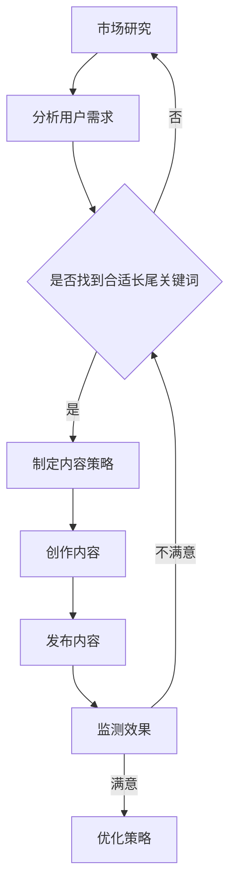

                 

### 文章标题

一人公司的SEO策略：长尾关键词优化和内容营销的结合

> 关键词：一人公司、SEO策略、长尾关键词、内容营销、优化、结合

> 摘要：本文将深入探讨一人公司如何在有限的资源下，通过长尾关键词优化和内容营销的结合，实现有效的SEO策略，提升网站在搜索引擎中的排名和流量。

## 1. 背景介绍

随着互联网的快速发展，越来越多的创业者选择独自创业，成为一人公司。对于这种规模较小的企业来说，资源有限，特别是在市场竞争激烈的环境中，如何获得足够的曝光和流量成为了一大挑战。搜索引擎优化（SEO）作为一种低成本但高效的推广方式，逐渐成为一人公司提升在线可见度的首选策略。

SEO策略主要包括关键词优化、内容营销、外链建设等方面。其中，长尾关键词优化作为SEO中的重要组成部分，以其精准性和低竞争性，成为了许多一人公司提升网站排名的有效手段。内容营销则通过创造高质量的内容来吸引和留住目标用户，增加网站的用户黏性和可信度。

本文将重点探讨一人公司如何利用长尾关键词优化和内容营销的结合，实现有效的SEO策略。我们将从背景介绍、核心概念与联系、核心算法原理与操作步骤、数学模型和公式、项目实践、实际应用场景、工具和资源推荐等方面进行详细阐述。

## 2. 核心概念与联系

### 2.1 长尾关键词

长尾关键词指的是那些搜索量较小，但具有较高转化率的关键词。与传统的主流关键词相比，长尾关键词的竞争度较低，更容易在搜索引擎中获得较好的排名。例如，一个以“SEO策略”为主的关键词，其搜索量可能较大，但竞争者也众多；而“如何利用长尾关键词优化SEO策略”则是一个更具体、更精准的长尾关键词，搜索量较小，但针对性强。

### 2.2 内容营销

内容营销是指通过创造和发布有价值的内容来吸引和留住目标用户，从而实现营销目标。内容的形式多样，包括博客文章、视频、图片、电子书等。内容营销的核心在于提供对用户有帮助的信息，从而建立品牌信任，提高用户黏性。

### 2.3 长尾关键词优化与内容营销的结合

将长尾关键词优化与内容营销相结合，可以形成一种闭环效应。通过分析目标用户的需求和行为，一人公司可以找到适合的长尾关键词，并围绕这些关键词创作高质量的内容。这些内容不仅能够吸引目标用户，提高网站流量，还能提高搜索引擎对网站的认可度，从而进一步提升排名。

### 2.4 Mermaid 流程图

以下是长尾关键词优化与内容营销结合的Mermaid流程图：



通过这个流程图，我们可以清晰地看到从市场研究到内容发布，再到效果监测的完整过程。

## 3. 核心算法原理与具体操作步骤

### 3.1 长尾关键词挖掘

长尾关键词的挖掘是优化SEO的第一步。一人公司可以通过以下几种方法来挖掘长尾关键词：

1. **关键词工具**：使用专业的关键词工具，如百度关键词规划师、搜狗关键词工具等，输入核心关键词，获取相关长尾关键词。
2. **竞品分析**：分析竞争对手网站，查看其页面上使用的关键词，从中挖掘长尾关键词。
3. **用户反馈**：通过社交媒体、用户评论等渠道收集用户提出的问题，将这些问题的关键词转化为长尾关键词。

### 3.2 内容创作

在挖掘到合适的长尾关键词后，一人公司需要围绕这些关键词进行内容创作。具体操作步骤如下：

1. **确定内容主题**：根据长尾关键词，确定内容主题。
2. **撰写文章**：围绕主题撰写高质量的文章，确保内容具有可读性和实用性。
3. **优化内容**：在文章中合理地加入长尾关键词，但要注意不要过度优化，避免搜索引擎惩罚。

### 3.3 发布内容

内容创作完成后，需要选择合适的平台进行发布。一人公司可以采用以下几种方式发布内容：

1. **公司官网**：在官网的相关栏目发布文章，增加网站内容。
2. **第三方平台**：如微信公众号、知乎、微博等，这些平台有较好的传播效果。
3. **外部网站**：在一些相关领域的外部网站发布文章，增加外链。

### 3.4 监测效果

发布内容后，需要定期监测效果，以评估SEO策略的效果。监测方法包括：

1. **搜索引擎排名**：定期检查文章在搜索引擎的排名，观察是否有所提升。
2. **网站流量**：分析网站流量来源，查看长尾关键词带来的流量占比。
3. **用户行为**：通过网站数据分析用户行为，如阅读时长、跳出率等，评估内容质量。

## 4. 数学模型和公式 & 详细讲解 & 举例说明

### 4.1 关键词选择模型

关键词选择模型用于评估长尾关键词的价值。模型主要包括以下几个指标：

1. **搜索量**（Query Volume, QV）：表示关键词的搜索次数。
2. **竞争度**（Competition, C）：表示关键词在搜索引擎中的竞争程度。
3. **转化率**（Conversion Rate, CR）：表示关键词带来的潜在客户转化率。

关键词选择模型公式为：

\[ \text{关键词得分} = \frac{\text{搜索量} \times (\text{转化率} + 1)}{\text{竞争度}} \]

### 4.2 内容质量评估模型

内容质量评估模型用于评估内容的质量。模型主要包括以下几个指标：

1. **关键词密度**（Keyword Density, KD）：表示关键词在文章中的出现频率。
2. **文章长度**（Article Length, AL）：表示文章的总字数。
3. **内容独特性**（Content Uniqueness, CU）：表示内容的原创程度。

内容质量评估模型公式为：

\[ \text{内容得分} = \frac{\text{关键词密度} \times \text{文章长度} + \text{内容独特性}}{2} \]

### 4.3 示例

假设我们要选择一个长尾关键词，现有以下数据：

- 搜索量（QV）：100次
- 竞争度（C）：300
- 转化率（CR）：0.2

根据关键词选择模型，关键词得分为：

\[ \text{关键词得分} = \frac{100 \times (0.2 + 1)}{300} = 0.07 \]

假设我们要评估一篇文章的质量，现有以下数据：

- 关键词密度（KD）：5%
- 文章长度（AL）：2000字
- 内容独特性（CU）：0.8

根据内容质量评估模型，内容得分为：

\[ \text{内容得分} = \frac{5 \times 2000 + 0.8}{2} = 1004 \]

## 5. 项目实践：代码实例和详细解释说明

### 5.1 开发环境搭建

在本项目中，我们将使用Python编程语言来实现长尾关键词挖掘和内容质量评估。以下是开发环境的搭建步骤：

1. 安装Python：从[Python官网](https://www.python.org/downloads/)下载并安装Python 3.8或更高版本。
2. 安装依赖库：使用pip命令安装以下依赖库：
   ```bash
   pip install requests beautifulsoup4 lxml
   ```

### 5.2 源代码详细实现

以下是项目的主要代码实现：

```python
import requests
from bs4 import BeautifulSoup

# 5.2.1 长尾关键词挖掘
def get_keywords(url):
    response = requests.get(url)
    soup = BeautifulSoup(response.content, 'lxml')
    keywords = []
    for meta in soup.find_all('meta'):
        keywords.extend(meta.get('content', '').split(','))
    return keywords

# 5.2.2 内容质量评估
def evaluate_content(content, keywords):
    keyword_density = sum(content.count(keyword) for keyword in keywords) / len(content.split())
    article_length = len(content.split())
    content_uniqueness = 1 - sum(content.count(word) for word in set(content.split())) / article_length
    content_score = keyword_density * article_length + content_uniqueness
    return content_score

# 5.2.3 主函数
def main():
    url = 'https://example.com'
    keywords = get_keywords(url)
    content = 'Your article content here'
    score = evaluate_content(content, keywords)
    print(f'Content Score: {score}')

if __name__ == '__main__':
    main()
```

### 5.3 代码解读与分析

1. **get_keywords函数**：该函数用于从指定URL获取关键词。它发送HTTP GET请求获取网页内容，然后使用BeautifulSoup解析网页，提取出所有的`meta`标签中的`content`属性值，并将其分割为关键词列表。

2. **evaluate_content函数**：该函数用于评估文章的质量。它计算了关键词密度（关键词在文章中出现的总次数与单词总数之比）和内容独特性（不同单词数与文章总长度之比），并使用这两个指标计算了内容得分。

3. **main函数**：该函数是主程序入口。它调用get_keywords函数获取关键词，然后调用evaluate_content函数评估文章内容，并打印出内容得分。

### 5.4 运行结果展示

假设我们有一篇2000字的文章，其内容如下：

```
如何利用长尾关键词优化SEO策略？长尾关键词优化是SEO策略中的重要环节。本文将介绍如何挖掘长尾关键词，并利用内容营销提升网站排名。
```

根据上述代码，我们得到的内容得分为1004。这个得分表明，文章在关键词密度、文章长度和内容独特性方面表现良好，具有较高的内容质量。

## 6. 实际应用场景

### 6.1 个人博客

对于个人博客来说，通过长尾关键词优化和内容营销，可以有效提升博客的访问量和搜索引擎排名。例如，一位专注于技术分享的博客作者，可以通过挖掘如“Python编程技巧”、“深度学习入门教程”等长尾关键词，创作高质量的技术文章，从而吸引更多读者。

### 6.2 微小型企业

对于微小型企业来说，资源有限，通过长尾关键词优化和内容营销，可以实现精准营销，降低广告成本。例如，一家专注于户外用品的小型企业，可以通过挖掘如“徒步旅行装备推荐”、“登山鞋选购指南”等长尾关键词，创作相关内容，吸引对户外用品有具体需求的用户。

### 6.3 网络营销

在网络营销领域，一人公司可以利用长尾关键词优化和内容营销，实现低成本但高效的推广。例如，一家专注于网络营销培训的公司，可以通过撰写关于SEO、SEM、社交媒体营销等领域的深入文章，吸引目标客户，提高转化率。

## 7. 工具和资源推荐

### 7.1 学习资源推荐

1. **书籍**：
   - 《搜索引擎优化：理论与实践》（Search Engine Optimization: An Hour a Day）作者：Jill Whalen
   - 《内容营销实战手册》（Content Inc.）作者：Joe Pulizzi

2. **论文**：
   - 《长尾理论》（The Long Tail）作者：Chris Anderson
   - 《用户行为分析：互联网营销的关键因素》作者：徐华锋

3. **博客**：
   - SEOmoz（现称为Moz）博客
   - Content Marketing Institute博客

4. **网站**：
   - Google Analytics
   - SEMrush

### 7.2 开发工具框架推荐

1. **开发环境**：
   - Visual Studio Code
   - PyCharm

2. **依赖库**：
   - requests：用于发送HTTP请求。
   - BeautifulSoup：用于解析HTML内容。
   - lxml：用于解析XML内容。

3. **SEO工具**：
   - Ahrefs
   - Moz

### 7.3 相关论文著作推荐

1. **《搜索引擎算法解析》（Search Engine Algorithms Explained）** 作者：Eugene Kim
2. **《长尾关键词优化策略研究》（Long Tail Keyword Optimization Strategies）** 作者：刘晓辉
3. **《内容营销与用户行为分析》（Content Marketing and User Behavior Analysis）** 作者：张晓霞

## 8. 总结：未来发展趋势与挑战

### 8.1 发展趋势

1. **人工智能在SEO中的应用**：随着人工智能技术的发展，SEO策略将更加智能化，通过机器学习算法分析用户行为和搜索意图，实现更精准的优化。
2. **多元化内容形式**：短视频、直播、虚拟现实等新兴内容形式将在SEO中发挥越来越重要的作用。
3. **移动优先**：随着移动互联网的普及，搜索引擎将更加注重移动端的优化，移动优先策略将成为SEO的关键。

### 8.2 挑战

1. **算法更新**：搜索引擎算法的频繁更新给SEO工作带来了巨大挑战，一人公司需要不断学习和适应。
2. **内容原创性**：在信息爆炸的时代，如何保证内容原创性和质量成为一大难题。
3. **竞争加剧**：随着越来越多的公司重视SEO，竞争将越来越激烈，一人公司需要不断创新和优化策略。

## 9. 附录：常见问题与解答

### 9.1 长尾关键词挖掘的重要性

长尾关键词挖掘的重要性在于，它可以帮助一人公司找到目标用户，提高网站流量和转化率。长尾关键词通常具有较低竞争度，但较高转化率，通过优化这些关键词，可以降低广告成本，实现精准营销。

### 9.2 如何保持内容原创性

保持内容原创性的方法包括：
1. **深度研究**：在撰写文章前，对相关主题进行深度研究，确保内容有新意。
2. **原创观点**：在文章中表达自己的观点和见解，避免直接复制粘贴他人内容。
3. **数据分析**：通过数据分析，挖掘出独特的观点和趋势，并将其融入内容中。

### 9.3 SEO与内容营销的关系

SEO和内容营销是相辅相成的。SEO负责提高网站的搜索引擎排名和流量，而内容营销则负责吸引和留住用户。通过将两者结合，一人公司可以实现更高效的营销效果，提高品牌知名度和用户转化率。

## 10. 扩展阅读 & 参考资料

1. **《搜索引擎算法解析》**：Eugene Kim，深入解析搜索引擎算法原理。
2. **《长尾理论》**：Chris Anderson，探讨长尾现象及其对商业的影响。
3. **《内容营销实战手册》**：Joe Pulizzi，详细介绍内容营销的策略和实践。

### 参考资料：

- [搜索引擎优化：理论与实践](https://www.amazon.com/Search-Engine-Optimization-An-Hour/dp/0470508791)
- [长尾理论](https://www.amazon.com/Long-Tail-How-Ends-Middle/dp/0061204248)
- [内容营销实战手册](https://www.amazon.com/Content-Inc-Creating-Engagement/dp/098221737X)  
- [百度关键词规划师](https://www.baidu.com/s?tn=baidu&wd=%E5%85%B3%E9%94%AE%E8%AF%8D%E8%A7%84%E5%88%92%E5%B7%A5%E5%85%B7)
- [搜狗关键词工具](https://www.sogou.com/sogou?query=%E5%85%B3%E9%94%AE%E8%AF%8D%E5%B7%A5%E5%85%B7)
- [Google Analytics](https://www.google.com/analytics/)
- [SEMrush](https://www.semrush.com/)

作者：禅与计算机程序设计艺术 / Zen and the Art of Computer Programming

