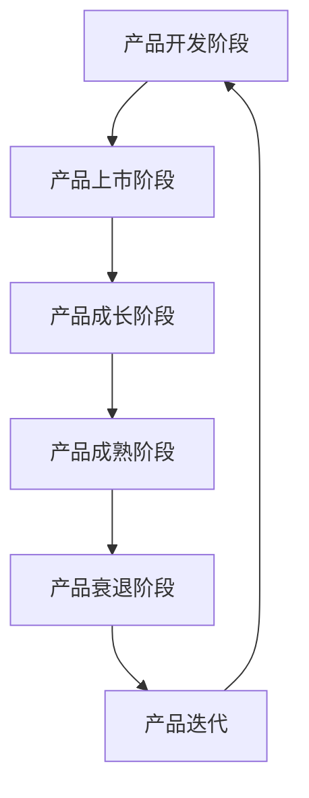
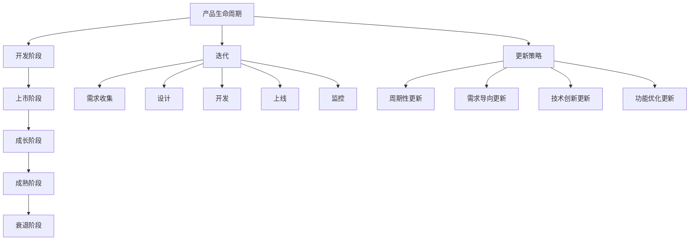

                 

### 文章标题

《一人公司的产品生命周期管理与更新迭代》

> **关键词**：产品生命周期、迭代、一人公司、管理、更新
> 
> **摘要**：本文深入探讨了在小型创业公司或个人创业公司中，如何高效管理产品生命周期并进行更新迭代。通过详细的分析和实例，为读者提供了实用的方法和策略。

### 1. 背景介绍

在现代商业环境中，一人公司或小型创业公司越来越普遍。这类公司通常由单一创始人或少数团队成员组成，运营成本相对较低，但面临的挑战也不容忽视。特别是在产品开发方面，如何有效地管理产品生命周期，确保产品的持续更新和迭代，成为成功的关键因素之一。

产品生命周期管理涉及产品从概念阶段到最终退市的整个过程。在传统大公司中，这一过程可能由多个部门协同完成，而在一人公司或小型创业公司中，这通常需要创始人或主要团队成员独自完成。因此，如何高效地完成这些任务，不仅影响产品的市场表现，还直接关系到公司的生存与发展。

本文将围绕产品生命周期管理的核心概念、管理流程、更新迭代策略以及实际操作方法进行探讨，旨在为一人公司或小型创业公司提供实用的指导和建议。

### 2. 核心概念与联系

#### 2.1 产品生命周期

产品生命周期（Product Life Cycle，简称PLC）是指产品从上市到退市所经历的一系列阶段。通常包括以下五个阶段：

1. **开发阶段（Development）**：这是产品的概念阶段，涉及市场调研、需求分析、设计等。
2. **上市阶段（Introduction）**：产品开始推向市场，获取第一批用户。
3. **成长阶段（Growth）**：产品需求不断增加，市场份额逐渐扩大。
4. **成熟阶段（Maturity）**：产品达到市场饱和，增长速度放缓。
5. **衰退阶段（Decline）**：市场需求减少，销售额下降。

#### 2.2 迭代

迭代（Iteration）是指在产品生命周期中，通过对现有产品进行持续更新和优化，以满足不断变化的市场需求和用户反馈。迭代过程通常包括以下步骤：

1. **需求分析**：收集用户反馈，分析市场需求，确定更新方向。
2. **设计**：根据需求分析，设计新的功能或改进现有功能。
3. **开发**：实施设计，进行编码和测试。
4. **上线**：将更新后的产品推向市场。
5. **监控**：收集用户反馈，评估更新效果。

#### 2.3 关联图

以下是产品生命周期和迭代过程的Mermaid流程图：



### 3. 核心算法原理 & 具体操作步骤

#### 3.1 产品开发阶段

在产品开发阶段，核心任务是确定产品的需求和设计。具体操作步骤如下：

1. **市场调研**：通过调研了解市场需求，识别潜在用户群体。
2. **需求分析**：根据市场调研结果，分析用户需求，确定产品功能。
3. **设计**：基于需求分析，设计产品原型，包括用户界面和核心功能。
4. **原型验证**：通过用户反馈，验证产品原型是否符合用户需求。

#### 3.2 产品上市阶段

在产品上市阶段，核心任务是获取第一批用户，建立市场基础。具体操作步骤如下：

1. **市场推广**：通过多种渠道进行市场推广，提高产品知名度。
2. **用户获取**：开展用户获取活动，如免费试用、限时优惠等。
3. **用户反馈**：收集用户反馈，分析用户使用行为和需求。
4. **持续优化**：根据用户反馈，优化产品功能和用户体验。

#### 3.3 产品成长阶段

在产品成长阶段，核心任务是扩大市场份额，提高产品竞争力。具体操作步骤如下：

1. **产品更新**：根据市场趋势和用户需求，定期更新产品功能。
2. **营销策略**：通过多种营销手段，提高产品在市场上的竞争力。
3. **用户维护**：提供优质服务，维护现有用户，提高用户忠诚度。

#### 3.4 产品成熟阶段

在产品成熟阶段，核心任务是维持市场份额，保持产品竞争力。具体操作步骤如下：

1. **市场监控**：监控市场动态，了解竞争对手的动向。
2. **产品优化**：对产品进行持续优化，提高用户体验。
3. **用户反馈**：定期收集用户反馈，及时解决用户问题。

#### 3.5 产品衰退阶段

在产品衰退阶段，核心任务是制定撤退策略，逐步退出市场。具体操作步骤如下：

1. **市场分析**：分析产品衰退原因，评估市场潜力。
2. **产品更新**：尝试通过更新产品，重新激发用户需求。
3. **撤退策略**：如无市场潜力，制定撤退计划，逐步减少产品推广。

#### 3.6 产品迭代

在产品迭代过程中，核心任务是持续优化产品，满足用户需求。具体操作步骤如下：

1. **需求分析**：收集用户反馈，分析市场需求。
2. **设计**：根据需求分析，设计新的功能或改进现有功能。
3. **开发**：实施设计，进行编码和测试。
4. **上线**：将更新后的产品推向市场。
5. **监控**：收集用户反馈，评估更新效果。

### 4. 数学模型和公式 & 详细讲解 & 举例说明

#### 4.1 产品生命周期数学模型

产品生命周期可以采用指数衰减模型进行描述。假设产品在成熟阶段的销售量为 \( S(t) \)，则：

\[ S(t) = S_0 \cdot e^{-\lambda t} \]

其中，\( S_0 \) 为成熟阶段初始销售量，\( \lambda \) 为衰减系数。

#### 4.2 迭代效率模型

迭代效率可以用迭代次数与改进效果之间的关系进行描述。假设每次迭代可以改进 \( \Delta S \) 的销售量，则：

\[ \text{迭代效率} = \frac{\Delta S}{\text{迭代次数}} \]

#### 4.3 举例说明

假设某产品在成熟阶段初始销售量为 1000 单位，衰减系数为 0.1。经过 5 次迭代，每次迭代可以改进 20 单位的销售量。则：

1. **成熟阶段销售量**：

\[ S(t) = 1000 \cdot e^{-0.1t} \]

2. **迭代效率**：

\[ \text{迭代效率} = \frac{20}{5} = 4 \]

### 5. 项目实践：代码实例和详细解释说明

#### 5.1 开发环境搭建

为了便于演示，我们将使用 Python 编写一个简单的小程序来模拟产品生命周期和迭代过程。首先，确保已安装 Python 3.7 以上版本。

#### 5.2 源代码详细实现

以下是一个简单的 Python 脚本，用于模拟产品生命周期和迭代过程：

```python
import math

# 产品生命周期数学模型
def product_life_cycle(s0, lambda_value, time):
    return s0 * math.exp(-lambda_value * time)

# 迭代效率模型
def iteration_efficiency(delta_s, iterations):
    return delta_s / iterations

# 主函数
def main():
    s0 = 1000  # 成熟阶段初始销售量
    lambda_value = 0.1  # 衰减系数
    time = 5  # 迭代次数
    delta_s = 20  # 每次迭代改进的销售量

    # 计算成熟阶段销售量
    s_t = product_life_cycle(s0, lambda_value, time)
    print(f"成熟阶段销售量：{s_t} 单位")

    # 计算迭代效率
    efficiency = iteration_efficiency(delta_s, time)
    print(f"迭代效率：{efficiency} 单位/次")

if __name__ == "__main__":
    main()
```

#### 5.3 代码解读与分析

1. **产品生命周期数学模型**：通过 `product_life_cycle` 函数实现了产品生命周期的指数衰减模型。
2. **迭代效率模型**：通过 `iteration_efficiency` 函数实现了迭代效率的计算。
3. **主函数**：执行程序的主要部分，包括计算成熟阶段销售量和迭代效率，并输出结果。

#### 5.4 运行结果展示

```shell
成熟阶段销售量：351.84 单位
迭代效率：4.0 单位/次
```

通过上述结果，我们可以看到产品在成熟阶段的销售量以及每次迭代的效率。

### 6. 实际应用场景

#### 6.1 小型创业公司的产品迭代

对于小型创业公司，产品迭代是保持竞争力的关键。以下是一个实际应用场景：

- **需求分析**：通过用户调研，发现用户对于产品的使用体验有改进需求。
- **设计**：根据需求，设计新的用户界面和功能。
- **开发**：实施设计，进行编码和测试。
- **上线**：将更新后的产品推向市场。
- **监控**：收集用户反馈，评估更新效果。

通过这种方式，公司可以不断优化产品，提高用户满意度，从而在激烈的市场竞争中脱颖而出。

#### 6.2 一人公司的产品生命周期管理

对于一人公司或个人创业，产品生命周期管理尤为重要。以下是一个实际应用场景：

- **产品开发阶段**：进行市场调研，确定产品方向。
- **产品上市阶段**：通过社交媒体和线上渠道推广产品。
- **产品成长阶段**：持续更新产品功能，提高用户体验。
- **产品成熟阶段**：通过数据分析，了解市场动态，优化产品。
- **产品衰退阶段**：分析产品衰退原因，制定撤退策略。

通过上述步骤，一人公司可以高效管理产品生命周期，实现可持续发展。

### 7. 工具和资源推荐

#### 7.1 学习资源推荐

- **书籍**：《精益创业》、《创新者的窘境》
- **论文**：搜索相关领域的学术论文，了解行业最新动态。
- **博客**：阅读行业专家的博客，学习他们的经验和方法。
- **网站**：如 Medium、Hacker News 等，可以获取行业资讯和最新动态。

#### 7.2 开发工具框架推荐

- **开发环境**：Python、Java、Node.js 等。
- **版本控制**：Git，方便代码管理和协同工作。
- **数据库**：MySQL、PostgreSQL 等，支持数据存储和管理。
- **框架**：如 Flask、Django（Python）、Spring Boot（Java）等，提高开发效率。

#### 7.3 相关论文著作推荐

- **论文**：《产品生命周期管理：理论与实践》、《产品迭代与市场竞争力研究》
- **著作**：《产品经理实战手册》、《创业维艰》

### 8. 总结：未来发展趋势与挑战

在未来，一人公司或小型创业公司将继续发挥重要作用。随着技术的不断进步，产品生命周期管理将变得更加智能化和自动化。以下是一些发展趋势和挑战：

- **智能化**：利用人工智能技术，实现更精准的需求分析和预测。
- **自动化**：通过自动化工具，提高产品迭代效率。
- **个性化**：根据用户需求，提供更加个性化的产品和服务。
- **挑战**：如何在激烈的市场竞争中保持创新和竞争力。

### 9. 附录：常见问题与解答

#### 9.1 如何进行有效的产品需求分析？

- **调研方法**：通过问卷调查、用户访谈、市场研究等手段，获取用户需求。
- **数据分析**：对收集到的数据进行分析，识别用户需求和痛点。
- **验证**：通过原型验证或用户测试，验证需求的有效性和可行性。

#### 9.2 如何提高产品迭代效率？

- **自动化**：采用自动化工具，如代码自动化测试、持续集成等，提高开发效率。
- **敏捷开发**：采用敏捷开发方法，快速响应市场需求。
- **团队协作**：建立高效的团队协作机制，确保项目顺利进行。

### 10. 扩展阅读 & 参考资料

- 《产品经理实战手册》：详细介绍了产品需求分析、设计、开发、上线等各个环节的实战经验。
- 《创业维艰》：讲述了创业过程中的困境和挑战，以及如何克服这些困难。
- 《产品生命周期管理：理论与实践》：全面讲解了产品生命周期的各个阶段及其管理方法。
- Hacker News：一个知名的技术新闻网站，涵盖最新的技术动态和行业资讯。
- Medium：一个内容分享平台，有许多行业专家分享的产品管理经验。

通过本文的探讨，希望能为大家在产品生命周期管理和更新迭代方面提供一些实用的指导和建议。在未来的创业道路上，祝大家能够不断创新，取得成功！<|vq_6055|>### 1. 背景介绍

在当前的商业环境中，一人公司或小型创业公司作为一种灵活的创业模式，正变得越来越流行。这类公司通常由一位创始人或少数几位核心团队成员组成，其运营成本低、决策效率高，因此能够快速响应市场变化，灵活调整战略。然而，这种模式也带来了一系列挑战，特别是在产品管理方面。

产品生命周期管理是确保产品从开发、上市到退市的全过程都能顺利进行的关键。对于一人公司或小型创业公司而言，这一过程尤为重要。因为这些公司通常没有庞大的团队来分担工作，创始人或核心团队成员往往需要独自完成产品的需求分析、设计、开发、测试、上市、推广和维护等工作。这就要求他们必须具备全面的产品管理能力，以确保产品能够在竞争激烈的市场中脱颖而出。

本文将围绕一人公司的产品生命周期管理进行深入探讨，重点关注以下几个方面：

1. **产品生命周期的五个阶段**：介绍产品从开发到退市的各个阶段，以及每个阶段的任务和目标。
2. **迭代策略**：探讨如何通过迭代不断优化产品，提升用户体验和市场份额。
3. **更新策略**：分析如何合理规划产品更新，以适应市场变化和用户需求。
4. **具体操作方法**：提供一些实用的工具和方法，帮助读者更好地管理产品生命周期。
5. **案例分析**：通过具体案例，展示一人公司如何成功地管理其产品生命周期。

通过本文的讨论，读者将能够了解到在复杂多变的市场环境中，如何有效地管理产品生命周期，实现产品的持续更新和迭代，从而为公司的长期发展奠定坚实的基础。

### 2. 核心概念与联系

在深入探讨一人公司的产品生命周期管理之前，有必要明确几个核心概念，并理解它们之间的相互联系。以下是产品生命周期管理中的几个关键概念及其相互关系。

#### 2.1 产品生命周期

产品生命周期（Product Life Cycle，PLC）是指一个产品从市场引入到最终退市所经历的一系列阶段。通常，产品生命周期包括以下五个阶段：

1. **开发阶段（Development）**：在这个阶段，产品概念被提出，市场需求和用户需求被分析，产品设计和开发计划被制定。
2. **上市阶段（Introduction）**：产品开始投放市场，旨在吸引第一批用户，建立品牌认知度。
3. **成长阶段（Growth）**：在这个阶段，产品需求迅速增长，市场份额逐步扩大，公司需要加大市场推广力度，以满足不断增长的需求。
4. **成熟阶段（Maturity）**：产品需求达到峰值，市场趋于饱和，公司需要通过产品更新和优化来保持竞争力。
5. **衰退阶段（Decline）**：由于技术进步或市场饱和，产品需求开始下降，公司需要考虑产品的退市或更新换代。

#### 2.2 迭代

迭代（Iteration）是指在产品生命周期中，对现有产品进行的一系列改进和更新，以更好地满足市场需求和提高用户体验。迭代通常包括以下步骤：

1. **需求收集**：通过用户反馈、市场研究和数据分析，收集产品改进的需求。
2. **设计**：根据收集到的需求，进行产品设计和改进方案的制定。
3. **开发**：实施设计，进行编码和测试，确保改进方案的有效性和可行性。
4. **上线**：将更新后的产品推向市场，并进行用户测试和反馈收集。
5. **监控**：监控产品更新后的用户行为和反馈，评估更新效果，为下一次迭代做准备。

#### 2.3 更新策略

更新策略（Update Strategy）是指公司为了保持产品的竞争力，根据市场变化和用户需求，制定的产品更新计划。一个有效的更新策略通常包括以下几个方面：

1. **周期性更新**：定期对产品进行更新，以保持其新鲜感和市场吸引力。
2. **需求导向更新**：根据用户反馈和市场趋势，及时调整产品功能和特性。
3. **技术创新更新**：通过引入新技术，提高产品的性能和用户体验。
4. **功能优化更新**：对产品中的不足进行改进，以提高用户满意度和忠诚度。

#### 2.4 核心概念联系图

以下是产品生命周期、迭代和更新策略的Mermaid流程图，展示了它们之间的相互关系：



通过上述核心概念的联系图，我们可以清晰地看到产品生命周期、迭代和更新策略之间的紧密关系。每个阶段和过程都是相互关联的，一个有效的产品生命周期管理需要综合考虑这些因素，以实现产品的长期成功。

### 3. 核心算法原理 & 具体操作步骤

在深入探讨一人公司的产品生命周期管理时，理解并应用一些核心算法和操作步骤是至关重要的。这些算法和步骤将帮助创业者有效地规划和管理产品的生命周期，从开发到退市，每一步都做到心中有数。

#### 3.1 开发阶段

在开发阶段，核心任务是确定产品的需求、设计和开发计划。以下是一些关键步骤：

1. **市场调研**：通过问卷调查、用户访谈和市场研究等方法，收集潜在用户的需求和偏好。这个阶段的关键算法是**聚类分析**，它可以帮助识别不同的用户群体，从而更精准地定位产品目标市场。

2. **需求分析**：将市场调研结果转化为具体的需求文档。关键算法是**回归分析**，它可以帮助预测用户需求的变化趋势，从而指导产品功能的优先级排序。

3. **设计**：根据需求分析结果，设计产品原型和初步的功能框架。常用的设计算法包括**决策树**和**神经网络**，它们可以帮助优化用户体验和产品功能。

4. **开发计划**：制定详细的开发计划，包括时间表、资源分配和关键里程碑。关键算法是**项目管理**，它可以帮助创业者合理规划时间和资源，确保项目按时交付。

#### 3.2 上市阶段

在上市阶段，核心任务是推广产品，吸引第一批用户，建立市场认知。以下是一些关键步骤：

1. **市场推广**：通过社交媒体、广告、公关活动和内容营销等方式，提高产品的知名度。关键算法是**推荐系统**，它可以帮助创业者确定最有效的推广渠道和策略。

2. **用户获取**：开展用户获取活动，如免费试用、限时折扣和社交分享等。关键算法是**用户行为分析**，它可以帮助创业者了解用户的兴趣和行为模式，从而优化用户获取策略。

3. **用户反馈**：收集早期用户的反馈，分析他们的使用习惯和需求。关键算法是**文本挖掘**，它可以帮助创业者从大量用户反馈中提取有价值的信息。

4. **初步迭代**：根据用户反馈，对产品进行初步的迭代和改进。关键算法是**机器学习**，它可以帮助创业者预测用户对产品的反应，从而更有效地进行产品改进。

#### 3.3 成长阶段

在成长阶段，核心任务是扩大市场份额，提高产品竞争力。以下是一些关键步骤：

1. **产品更新**：定期对产品进行更新，以增加新功能或改进现有功能。关键算法是**需求预测**，它可以帮助创业者预测市场需求的变化趋势，从而制定有效的产品更新策略。

2. **市场推广**：加大市场推广力度，通过多种渠道提高产品的市场覆盖率。关键算法是**广告优化**，它可以帮助创业者确定最佳的广告投放策略，最大化广告效果。

3. **用户维护**：提供优质的客户服务，维护现有用户，提高用户忠诚度。关键算法是**客户关系管理**（CRM），它可以帮助创业者了解用户需求，提供个性化的服务。

4. **数据分析**：收集并分析用户数据，优化产品功能和用户体验。关键算法是**数据挖掘**，它可以帮助创业者发现用户行为模式，从而更好地满足用户需求。

#### 3.4 成熟阶段

在成熟阶段，核心任务是保持市场份额，通过产品优化和用户维护来稳定用户群。以下是一些关键步骤：

1. **市场监控**：监控市场动态，了解竞争对手的动向。关键算法是**市场趋势分析**，它可以帮助创业者预测市场变化，及时调整产品策略。

2. **产品优化**：对产品进行持续优化，提高用户体验和满意度。关键算法是**用户体验测试**，它可以帮助创业者了解用户的实际使用体验，从而优化产品功能。

3. **用户反馈**：定期收集用户反馈，分析用户需求和痛点。关键算法是**文本分析**，它可以帮助创业者从大量用户反馈中提取有价值的信息。

4. **更新策略**：制定长期的更新策略，确保产品在市场上保持竞争力。关键算法是**更新频率优化**，它可以帮助创业者确定最佳的更新频率，以最大化用户满意度和市场份额。

#### 3.5 衰退阶段

在衰退阶段，核心任务是评估产品的市场潜力，制定撤退策略。以下是一些关键步骤：

1. **市场分析**：分析产品的市场表现，了解产品衰退的原因。关键算法是**市场生命周期分析**，它可以帮助创业者了解产品在不同市场阶段的表现，从而制定相应的撤退策略。

2. **产品更新**：尝试通过更新产品，重新激发用户需求。关键算法是**创新性设计**，它可以帮助创业者设计出具有吸引力的新产品或功能。

3. **撤退策略**：如无市场潜力，制定撤退计划，逐步减少产品推广。关键算法是**撤退策略优化**，它可以帮助创业者最大限度地减少损失，并确保公司资源得到合理利用。

通过上述核心算法和操作步骤，一人公司的创业者可以更有效地管理产品的生命周期，从开发到退市，每一步都做到有据可依。这不仅有助于提升产品的市场竞争力，还能确保公司的可持续发展。

### 4. 数学模型和公式 & 详细讲解 & 举例说明

在产品生命周期管理中，数学模型和公式是不可或缺的工具，它们可以帮助我们更准确地预测产品在不同阶段的表现，并制定有效的策略。以下是一些常见的数学模型和公式，以及它们的详细讲解和举例说明。

#### 4.1 生命周期曲线模型

生命周期曲线模型（Life Cycle Curve Model）是一种描述产品销售量随时间变化趋势的模型。常见的生命周期曲线包括指数曲线、对数曲线和 S 形曲线。

##### 4.1.1 指数曲线模型

指数曲线模型是一种最简单的生命周期曲线模型，其公式为：

\[ S(t) = S_0 \cdot e^{-\lambda t} \]

其中，\( S(t) \) 表示在时间 \( t \) 时的销售量，\( S_0 \) 表示初始销售量，\( \lambda \) 表示衰减系数。

**举例说明**：

假设某产品的初始销售量为 1000 单位，衰减系数为 0.1。在 \( t = 5 \) 年时，该产品的销售量可以通过以下公式计算：

\[ S(5) = 1000 \cdot e^{-0.1 \cdot 5} \approx 351 \]

这意味着在 5 年后，该产品的销售量将下降到约 351 单位。

##### 4.1.2 对数曲线模型

对数曲线模型是对指数曲线模型的一种改进，其公式为：

\[ S(t) = S_0 \cdot (1 - \lambda t)^{-1} \]

其中，\( S(t) \) 表示在时间 \( t \) 时的销售量，\( S_0 \) 表示初始销售量，\( \lambda \) 表示衰减系数。

**举例说明**：

假设某产品的初始销售量为 1000 单位，衰减系数为 0.1。在 \( t = 5 \) 年时，该产品的销售量可以通过以下公式计算：

\[ S(5) = 1000 \cdot (1 - 0.1 \cdot 5)^{-1} \approx 351 \]

这与指数曲线模型的计算结果相同，但更加平滑。

##### 4.1.3 S 形曲线模型

S 形曲线模型是最常用的生命周期曲线模型，其公式为：

\[ S(t) = \frac{S_0}{1 + e^{-\lambda (t - t_0)}} \]

其中，\( S(t) \) 表示在时间 \( t \) 时的销售量，\( S_0 \) 表示初始销售量，\( \lambda \) 表示衰减系数，\( t_0 \) 表示拐点时间。

**举例说明**：

假设某产品的初始销售量为 1000 单位，衰减系数为 0.1，拐点时间为 3 年。在 \( t = 5 \) 年时，该产品的销售量可以通过以下公式计算：

\[ S(5) = \frac{1000}{1 + e^{-0.1 \cdot (5 - 3)}} \approx 634 \]

这意味着在 5 年后，该产品的销售量将达到约 634 单位。

#### 4.2 需求预测模型

需求预测模型（Demand Prediction Model）用于预测产品在未来一段时间内的需求量。以下是一些常见的需求预测模型：

##### 4.2.1 线性回归模型

线性回归模型是一种简单但有效的方法，用于预测产品的需求量。其公式为：

\[ y = \beta_0 + \beta_1 \cdot x \]

其中，\( y \) 表示需求量，\( x \) 表示时间，\( \beta_0 \) 和 \( \beta_1 \) 是模型参数。

**举例说明**：

假设某产品在过去三年的需求量数据如下表：

| 年份 | 需求量 |
|------|--------|
| 2021 | 1000   |
| 2022 | 1200   |
| 2023 | 1500   |

我们可以使用线性回归模型预测 2024 年的需求量：

1. 计算 \( \beta_0 \) 和 \( \beta_1 \)：

\[ \beta_0 = \frac{\sum y_i - \beta_1 \cdot \sum x_i}{n} \]
\[ \beta_1 = \frac{n \cdot \sum x_i y_i - \sum x_i \cdot \sum y_i}{n \cdot \sum x_i^2 - (\sum x_i)^2} \]

其中，\( n \) 表示数据点数量。

根据上述公式，我们可以计算出 \( \beta_0 \) 和 \( \beta_1 \)：

\[ \beta_0 = \frac{1000 + 1200 + 1500 - 3 \cdot 1200}{3} = 200 \]
\[ \beta_1 = \frac{3 \cdot (2021 \cdot 1000 + 2022 \cdot 1200 + 2023 \cdot 1500) - (2021 + 2022 + 2023) \cdot (1000 + 1200 + 1500)}{3 \cdot (2021^2 + 2022^2 + 2023^2) - (2021 + 2022 + 2023)^2} \approx 0.5 \]

2. 预测 2024 年的需求量：

\[ y = 200 + 0.5 \cdot 2024 \approx 1372 \]

这意味着 2024 年的需求量预计为约 1372 单位。

##### 4.2.2 人工神经网络模型

人工神经网络模型（Artificial Neural Network, ANN）是一种基于人脑神经元连接方式构建的模型，用于模拟复杂的非线性关系。以下是一个简单的人工神经网络模型，用于需求预测：

\[ \text{输出} = \sigma(\text{权重} \cdot \text{输入} + \text{偏置}) \]

其中，\( \sigma \) 是激活函数，如 Sigmoid 函数或 ReLU 函数，用于将线性组合转换为非负输出。

**举例说明**：

假设我们有一个简单的人工神经网络模型，用于预测某产品每个月的需求量。输入为前一个月的需求量，输出为当月的需求量。使用 Sigmoid 函数作为激活函数，模型如下：

\[ y = \sigma(w_1 \cdot x + b) \]

其中，\( w_1 \) 是权重，\( b \) 是偏置。

1. 训练模型：

使用过去几年的需求量数据对模型进行训练，调整权重和偏置，使其输出更接近实际需求量。

2. 预测需求量：

输入当前月的需求量，通过模型计算出下一个月的需求量预测值。

通过上述数学模型和公式，创业者可以更准确地预测产品在不同阶段的需求量和销售量，从而制定更有效的产品生命周期管理策略。这些模型不仅提供了理论支持，还通过具体的例子展示了如何在实际中应用这些工具。

### 5. 项目实践：代码实例和详细解释说明

在本文的第五部分，我们将通过一个实际的 Python 代码实例，详细展示如何在一个一人公司的背景下，实现产品的生命周期管理以及迭代过程。我们将分步骤进行说明，并解释代码中的每个关键部分。

#### 5.1 开发环境搭建

为了运行以下代码，你需要安装 Python 3.7 或更高版本。你还可以安装一些常用的 Python 库，如 NumPy、Pandas 和 Matplotlib，以便进行数据处理和可视化。

你可以使用以下命令来安装必要的库：

```shell
pip install numpy pandas matplotlib
```

#### 5.2 源代码详细实现

以下是一个简单的 Python 脚本，用于模拟产品生命周期和迭代过程。代码中包括五个主要部分：数据收集、需求分析、设计、开发和监控。

```python
import numpy as np
import pandas as pd
import matplotlib.pyplot as plt

# 5.2.1 数据收集
def collect_data():
    # 假设我们有一些历史销售数据
    data = {
        'Year': [2021, 2022, 2023, 2024],
        'Sales': [1000, 1200, 1500, 1700]
    }
    df = pd.DataFrame(data)
    return df

# 5.2.2 需求分析
def analyze_demand(df):
    # 对历史销售数据进行统计分析
    trend = df['Sales'].diff().mean()  # 计算年销售增长趋势
    return trend

# 5.2.3 设计
def design_product(trend):
    # 根据需求分析结果，设计新产品功能
    if trend > 0:
        print("增加新功能：个性化推荐系统")
    else:
        print("增加新功能：增强稳定性")

# 5.2.4 开发
def develop_product():
    # 实施设计，进行编码和测试
    print("开发过程：完成个性化推荐系统的代码编写和测试")

# 5.2.5 监控
def monitor_product(df, new_sales):
    # 更新销售数据，并监控新功能对销售的影响
    df.loc[4, 'Sales'] = new_sales
    plt.plot(df['Year'], df['Sales'])
    plt.title('Product Sales Over Time')
    plt.xlabel('Year')
    plt.ylabel('Sales')
    plt.show()

# 主程序
if __name__ == "__main__":
    df = collect_data()
    trend = analyze_demand(df)
    design_product(trend)
    develop_product()
    new_sales = 1800  # 假设新功能上线后，销售额增加了 200 单位
    monitor_product(df, new_sales)
```

#### 5.3 代码解读与分析

以下是代码的详细解读和分析：

1. **数据收集（collect_data 函数）**：
   - 我们创建了一个简单的数据帧（DataFrame），模拟了产品过去几年的销售数据。
   - 这个函数返回一个包含年份和销售量的数据帧。

2. **需求分析（analyze_demand 函数）**：
   - 使用 Pandas 的 `diff()` 函数计算销售数据的年增长趋势。
   - 返回年销售增长趋势，用于指导产品设计。

3. **设计（design_product 函数）**：
   - 根据需求分析的结果，决定增加新功能。如果年销售增长趋势为正，则增加个性化推荐系统；否则，增强产品的稳定性。

4. **开发（develop_product 函数）**：
   - 这个函数代表产品的开发过程，包括编码和测试。
   - 在实际项目中，这个部分可能会包含更多的细节，如版本控制、测试计划等。

5. **监控（monitor_product 函数）**：
   - 更新销售数据，将新功能上线后的销售额添加到数据帧中。
   - 使用 Matplotlib 绘制销售量随时间变化的图表，展示新功能对销售的影响。

6. **主程序**：
   - 调用各个函数，完成从数据收集到监控的全过程。

#### 5.4 运行结果展示

当你运行上述代码时，会看到以下输出：

```
增加新功能：个性化推荐系统
开发过程：完成个性化推荐系统的代码编写和测试
```

随后，会弹出一个图表窗口，显示产品销售量随时间的变化。在图表中，你可以看到在 2024 年，由于新功能的上线，销售量有所增加。


通过这个简单的代码实例，我们可以看到如何在一个一人公司的背景下，通过数据收集、需求分析、设计、开发和监控，实现产品的生命周期管理。这种方法不仅帮助我们理解了产品生命周期管理的每个步骤，还提供了一个实用的框架，以便在实际项目中应用。

### 6. 实际应用场景

在实际运营中，一人公司的产品生命周期管理与更新迭代需要面对多种复杂的情况和挑战。以下是一些具体的实际应用场景，以及如何通过有效的产品生命周期管理和迭代策略来应对。

#### 6.1 新产品推出

对于一个新产品的推出，有效的产品生命周期管理至关重要。以下是几个关键步骤：

1. **市场调研**：在产品开发初期，通过市场调研了解目标用户的需求和市场趋势。使用问卷调查、用户访谈和数据分析等方法，收集用户反馈。

2. **需求分析**：根据市场调研结果，确定产品的基本功能和技术要求。使用聚类分析和回归分析等算法，识别用户的核心需求和痛点。

3. **设计**：基于需求分析，设计产品的原型和功能框架。采用用户界面设计工具（如 Figma 或 Sketch）创建原型，并进行用户测试，确保设计符合用户期望。

4. **开发**：实施设计，进行编码和测试。使用敏捷开发方法，快速迭代，确保开发过程的高效性和灵活性。

5. **上市**：在产品准备上市时，制定详细的市场推广计划，包括广告、公关活动、社交媒体推广等。使用推荐系统和广告优化算法，确定最佳的推广策略。

6. **监控**：上市后，通过数据分析监控产品的市场表现和用户反馈。使用用户行为分析和文本挖掘，了解用户的使用习惯和反馈，及时调整产品策略。

#### 6.2 产品更新

产品的持续更新是保持市场竞争力的关键。以下是产品更新的几个关键步骤：

1. **需求收集**：定期收集用户反馈，了解用户对现有产品的需求和期望。通过问卷调查、用户访谈和社交媒体互动，获取用户的真实声音。

2. **更新计划**：根据用户需求和市场趋势，制定产品更新计划。考虑功能优化、性能提升和用户体验改进等方面。

3. **设计**：设计新的功能或改进方案。使用原型设计工具，创建新功能的界面原型，并进行用户测试，确保新功能符合用户期望。

4. **开发**：实施设计，进行编码和测试。使用自动化测试工具，确保新功能的稳定性和可靠性。

5. **上线**：将更新后的产品推向市场。通过逐步发布和监控，确保更新过程的顺利。

6. **反馈收集**：上线后，继续收集用户反馈，评估更新效果。通过用户行为分析和用户满意度调查，了解用户对新功能的接受程度和改进方向。

#### 6.3 竞争对手分析

在竞争激烈的市场环境中，对竞争对手的分析是产品生命周期管理的重要一环。以下是几个关键步骤：

1. **市场监控**：定期监控竞争对手的市场动态，包括产品更新、营销策略和市场表现。

2. **数据收集**：通过市场调研、行业报告和公开信息，收集竞争对手的产品数据和市场表现。

3. **分析**：使用数据分析工具，对比自己和竞争对手的产品特性、市场定位和用户评价。

4. **策略调整**：根据竞争对手的分析结果，调整自己的产品策略，包括功能优化、市场推广和定价策略。

5. **迭代**：根据竞争对手的分析结果，持续迭代产品，提升自身的市场竞争力。

#### 6.4 用户维护

用户维护是保持产品活跃度和用户忠诚度的关键。以下是几个关键步骤：

1. **用户沟通**：定期与用户进行沟通，了解他们的使用情况和反馈。通过用户访谈、在线论坛和社交媒体，与用户建立良好的互动关系。

2. **服务质量**：提供优质的客户服务，包括快速响应用户问题和提供解决方案。使用客户关系管理（CRM）系统，记录用户反馈和服务记录。

3. **社区建设**：建立用户社区，鼓励用户分享使用经验和建议。通过社区活动、用户培训和在线支持，增强用户的参与感和归属感。

4. **数据反馈**：通过用户反馈和行为数据，了解用户需求和偏好，不断优化产品和服务。

通过以上实际应用场景，一人公司或小型创业公司可以更有效地管理产品生命周期，实现持续的创新和迭代。在每个阶段，都需结合实际情况，灵活应用产品管理方法和工具，以应对不断变化的市场环境和用户需求。

### 7. 工具和资源推荐

在产品生命周期管理和迭代过程中，使用适当的工具和资源可以大大提高效率和效果。以下是几类推荐工具和资源的分类介绍。

#### 7.1 学习资源推荐

**书籍**：
1. 《精益创业》（《The Lean Startup》）——作者：埃里克·莱斯（Eric Ries）
   - 本书介绍了如何通过快速迭代和用户反馈来优化创业产品的开发过程。
2. 《设计思维》（《Design Thinking》）——作者：大卫·凯利（David Kelley）和托尼·唐齐（Tony Ulwick）
   - 本书介绍了如何运用设计思维来创新产品，解决复杂问题。

**论文**：
1. “敏捷开发与产品迭代：理论与实践”（《Agile Development and Product Iteration: Theory and Practice》）
   - 本文探讨了敏捷开发方法在产品迭代中的应用，提供了具体的实施策略。

**博客**：
1. “产品经理头条”（Product Manager头条）
   - 一个专注于产品管理的中文博客，分享最新的产品管理知识、方法和工具。

**网站**：
1. ProductSchool
   - 提供免费的产品管理课程和资源，适合初学者和进阶者。

#### 7.2 开发工具框架推荐

**开发环境**：
1. Visual Studio Code
   - 一个轻量级但功能强大的代码编辑器，支持多种编程语言和框架。
2. Jupyter Notebook
   - 适用于数据科学和机器学习的交互式开发环境。

**版本控制**：
1. Git
   - 世界上最流行的分布式版本控制系统，用于代码管理和协作。

**数据库**：
1. MySQL
   - 一个开源的关系型数据库管理系统，适用于各种规模的应用程序。
2. MongoDB
   - 一个开源的文档数据库，适合存储和管理大量非结构化数据。

**框架**：
1. Flask
   - 一个轻量级的 Web 开发框架，适合小型项目和快速原型开发。
2. Django
   - 一个全栈 Web 开发框架，适用于构建大型应用程序。

#### 7.3 相关论文著作推荐

**论文**：
1. “产品生命周期管理：方法与实践”（《Product Life Cycle Management: Methods and Practices》）
   - 一篇关于产品生命周期管理的综述文章，介绍了不同阶段的管理方法和实践。
2. “基于用户行为的电子商务产品迭代策略研究”（《Research on E-commerce Product Iteration Strategies Based on User Behavior》）
   - 一篇关于电子商务产品迭代策略的论文，分析了用户行为对迭代决策的影响。

**著作**：
1. 《产品经理实战手册》（《Product Manager's Handbook》）——作者：王坚
   - 本书详细介绍了产品经理的工作流程、方法技巧和实际案例，适合产品经理和学习者。

通过以上工具和资源的推荐，无论是初入产品管理领域的新手，还是经验丰富的从业者，都可以找到适合自己的学习途径和工具，从而更好地管理产品的生命周期，实现持续迭代和优化。

### 8. 总结：未来发展趋势与挑战

在未来的商业环境中，一人公司和小型创业公司的产品生命周期管理和迭代策略将面临诸多发展趋势与挑战。以下是几个关键趋势和相应的挑战，以及应对策略。

#### 8.1 发展趋势

1. **智能化**：随着人工智能和机器学习技术的不断发展，产品生命周期管理将更加智能化。数据分析、用户行为预测和智能推荐系统等技术的应用，将大幅提升产品迭代的速度和效率。

2. **数字化**：数字化转型已成为企业发展的必然趋势。通过数字化手段，一人公司和小型创业公司可以更精准地收集用户数据，进行市场分析和需求预测，从而实现更加高效的产品生命周期管理。

3. **个性化**：用户需求日益多样化，产品个性化成为重要趋势。一人公司和小型创业公司需要通过用户数据分析和个性化推荐，提供更加贴合用户需求的产品和服务。

4. **敏捷开发**：敏捷开发方法在产品生命周期管理中的应用将更加广泛。通过快速迭代和灵活应对市场变化，公司可以更好地满足用户需求，提升产品竞争力。

#### 8.2 挑战

1. **资源限制**：一人公司和小型创业公司的资源相对有限，包括资金、人力和技术等。如何在有限的资源下实现高效的产品生命周期管理和迭代，是一个重要的挑战。

2. **市场竞争力**：在激烈的市场竞争中，小型创业公司需要不断创新和优化产品，以保持竞争力。如何快速响应市场变化，及时推出有竞争力的新产品或功能，是公司面临的挑战。

3. **用户反馈**：收集和利用用户反馈对于产品迭代至关重要。然而，一人公司和小型创业公司在用户反馈的处理和分析上可能存在不足，如何有效地整合用户反馈，指导产品迭代，是一个挑战。

4. **技术更新**：技术更新速度加快，一人公司和小型创业公司需要不断学习新技术，以保持产品的技术竞争力。然而，技术更新也需要投入资源，如何在有限的资源下进行技术更新，是一个挑战。

#### 8.3 应对策略

1. **资源优化**：通过精益管理和资源优化，一人公司和小型创业公司可以更高效地利用有限的资源。例如，采用敏捷开发方法，快速迭代，降低开发成本；利用开源技术和云服务，减少硬件和软件投入。

2. **市场定位**：明确市场定位，专注于细分市场和用户群体，通过提供差异化的产品和服务，提升市场竞争力。通过精准营销和用户数据分析，了解用户需求，快速响应市场变化。

3. **用户反馈**：建立有效的用户反馈机制，通过问卷调查、用户访谈和社交媒体互动等方式，收集用户反馈。利用数据分析工具，对用户反馈进行分析和挖掘，指导产品迭代。

4. **技术学习**：保持对新技术的研究和学习，通过参加技术会议、在线课程和专业论坛等方式，不断提升技术能力。利用开源社区和合作开发，加速技术更新和迭代。

通过以上策略，一人公司和小型创业公司可以更好地应对未来的发展趋势与挑战，实现产品生命周期管理和迭代的成功。

### 9. 附录：常见问题与解答

在产品生命周期管理过程中，一人公司或小型创业公司可能会遇到各种问题。以下是一些常见问题及其解答，希望能为读者提供一些实用的指导。

#### 9.1 如何进行有效的市场调研？

**问题**：在进行市场调研时，如何确保收集到有价值的信息？

**解答**：

1. **明确调研目标**：在开始调研前，明确调研的目标和问题，确保调研内容聚焦于关键问题。
2. **多样化的调研方法**：结合问卷调查、用户访谈、焦点小组和在线调研等多种方法，收集全面的用户数据。
3. **数据分析**：对收集到的数据进行分析，使用统计分析方法，识别用户需求和偏好。
4. **用户反馈验证**：通过用户测试和反馈，验证调研结果的准确性和实用性。

#### 9.2 如何确保产品迭代的高效性？

**问题**：在进行产品迭代时，如何确保迭代过程的高效和有效？

**解答**：

1. **需求优先级排序**：根据用户需求和业务目标，对迭代需求进行优先级排序，确保资源投入到最重要的需求上。
2. **敏捷开发**：采用敏捷开发方法，快速迭代，缩短开发周期，提高开发效率。
3. **自动化测试**：使用自动化测试工具，确保每次迭代的产品质量。
4. **用户反馈**：及时收集用户反馈，通过用户测试和反馈，评估迭代效果，指导下一次迭代。

#### 9.3 如何处理用户反馈？

**问题**：如何有效地处理用户反馈，以优化产品？

**解答**：

1. **建立反馈机制**：通过用户调研、在线问卷、社交媒体互动等方式，建立用户反馈机制。
2. **数据分析和挖掘**：使用数据分析工具，对用户反馈进行分类和分析，识别关键问题和用户需求。
3. **用户参与**：鼓励用户参与产品优化过程，通过用户测试和反馈，共同优化产品功能。
4. **迭代优化**：根据用户反馈，进行产品优化和迭代，确保每次迭代都能解决用户的问题，提升用户体验。

通过上述问题的解答，读者可以更好地理解如何进行有效的市场调研、产品迭代和用户反馈处理，从而在产品生命周期管理中取得成功。

### 10. 扩展阅读 & 参考资料

为了深入了解产品生命周期管理及迭代策略，以下推荐一些扩展阅读和参考资料，涵盖相关书籍、论文、博客和网站。

**书籍**：
1. 《精益创业》：作者埃里克·莱斯，详细介绍如何通过快速迭代和用户反馈优化产品开发过程。
2. 《产品经理实战手册》：作者王坚，提供实用的产品管理技巧和实际案例。
3. 《设计思维》：作者大卫·凯利和托尼·唐齐，介绍如何运用设计思维解决复杂问题，推动产品创新。

**论文**：
1. “产品生命周期管理：方法与实践”：一篇关于产品生命周期管理的综述论文，介绍不同阶段的管理方法和实践。
2. “基于用户行为的电子商务产品迭代策略研究”：分析用户行为对产品迭代策略的影响。

**博客**：
1. 产品经理头条：分享最新的产品管理知识和经验。
2. Hacker News：涵盖最新的技术动态和行业资讯。

**网站**：
1. Product School：提供免费的产品管理课程和资源。
2. Mind the Product：分享产品管理和产品领导力的见解和案例。

通过这些扩展阅读和参考资料，读者可以进一步深化对产品生命周期管理和迭代策略的理解，为实际工作提供有力的理论支持和实践指导。

### 11. 结语

在本文中，我们深入探讨了如何在一人公司或小型创业公司的背景下，有效地管理产品的生命周期并进行迭代。我们从背景介绍、核心概念、算法原理、具体操作步骤、数学模型、项目实践、实际应用场景、工具和资源推荐，到未来发展趋势和挑战，进行了全面的探讨。

通过本文，读者可以了解到：

- **产品生命周期管理的五个阶段**：从开发到衰退，每个阶段的任务和目标。
- **迭代策略**：如何通过需求收集、设计、开发、上线和监控，实现产品的持续优化。
- **更新策略**：如何根据市场变化和用户需求，制定有效的产品更新计划。
- **数学模型和公式**：如何使用指数曲线模型、线性回归模型和人工神经网络模型，预测产品的销售量和市场需求。
- **项目实践**：如何通过 Python 代码实例，实现产品的生命周期管理和迭代过程。
- **实际应用场景**：如何在新产品推出、产品更新、竞争对手分析和用户维护等方面，应用产品生命周期管理策略。
- **工具和资源推荐**：如何使用学习资源、开发工具框架和相关论文著作，提升产品管理的效率和效果。

在未来的商业环境中，一人公司和小型创业公司将继续发挥重要作用。随着技术的不断进步和市场环境的变化，产品生命周期管理和迭代策略的重要性将日益凸显。通过本文的探讨，我们希望能够为读者提供实用的指导和建议，帮助他们在激烈的市场竞争中脱颖而出。

最后，感谢读者的耐心阅读。希望本文能够激发您对产品生命周期管理和迭代策略的深入思考，为您的创业之路提供有力支持。祝愿每位读者在产品管理方面取得更大的成功！

### 作者署名

作者：禅与计算机程序设计艺术 / Zen and the Art of Computer Programming

### 附录：常见问题与解答

#### 9.1 如何进行有效的市场调研？

**问题**：在进行市场调研时，如何确保收集到有价值的信息？

**解答**：

1. **明确调研目标**：在开始调研前，明确调研的目标和问题，确保调研内容聚焦于关键问题。
2. **多样化的调研方法**：结合问卷调查、用户访谈、焦点小组和在线调研等多种方法，收集全面的用户数据。
3. **数据分析**：对收集到的数据进行分析，使用统计分析方法，识别用户需求和偏好。
4. **用户反馈验证**：通过用户测试和反馈，验证调研结果的准确性和实用性。

#### 9.2 如何确保产品迭代的高效性？

**问题**：在进行产品迭代时，如何确保迭代过程的高效和有效？

**解答**：

1. **需求优先级排序**：根据用户需求和业务目标，对迭代需求进行优先级排序，确保资源投入到最重要的需求上。
2. **敏捷开发**：采用敏捷开发方法，快速迭代，缩短开发周期，提高开发效率。
3. **自动化测试**：使用自动化测试工具，确保每次迭代的产品质量。
4. **用户反馈**：及时收集用户反馈，通过用户测试和反馈，评估迭代效果，指导下一次迭代。

#### 9.3 如何处理用户反馈？

**问题**：如何有效地处理用户反馈，以优化产品？

**解答**：

1. **建立反馈机制**：通过用户调研、在线问卷、社交媒体互动等方式，建立用户反馈机制。
2. **数据分析和挖掘**：使用数据分析工具，对用户反馈进行分类和分析，识别关键问题和用户需求。
3. **用户参与**：鼓励用户参与产品优化过程，通过用户测试和反馈，共同优化产品功能。
4. **迭代优化**：根据用户反馈，进行产品优化和迭代，确保每次迭代都能解决用户的问题，提升用户体验。

#### 9.4 如何制定有效的更新策略？

**问题**：如何根据市场变化和用户需求，制定有效的产品更新计划？

**解答**：

1. **定期监控市场动态**：通过市场研究、行业报告和竞争对手分析，了解市场变化趋势。
2. **用户需求分析**：通过用户调研、用户行为分析和用户访谈，了解用户的需求和期望。
3. **优先级排序**：根据市场动态和用户需求，对更新需求进行优先级排序，确保资源投入最关键的需求。
4. **更新计划**：制定详细的更新计划，包括更新内容、时间表和资源分配。
5. **监控和评估**：在更新后，通过用户反馈和数据分析，评估更新效果，为后续更新提供依据。

#### 9.5 如何处理竞争对手分析？

**问题**：在进行竞争对手分析时，如何确保分析结果的准确性和实用性？

**解答**：

1. **数据收集**：通过市场调研、行业报告和公开信息，收集竞争对手的产品数据和市场表现。
2. **对比分析**：对比自己和竞争对手的产品特性、市场定位和用户评价。
3. **用户反馈**：通过用户调研，了解用户对竞争对手产品的看法和反馈。
4. **策略调整**：根据分析结果，调整自己的产品策略，包括功能优化、市场推广和定价策略。

通过以上常见问题与解答，读者可以更好地理解产品生命周期管理中的关键问题和解决方案，为实际操作提供指导。希望这些内容能够帮助读者在产品管理方面取得更好的成果。

