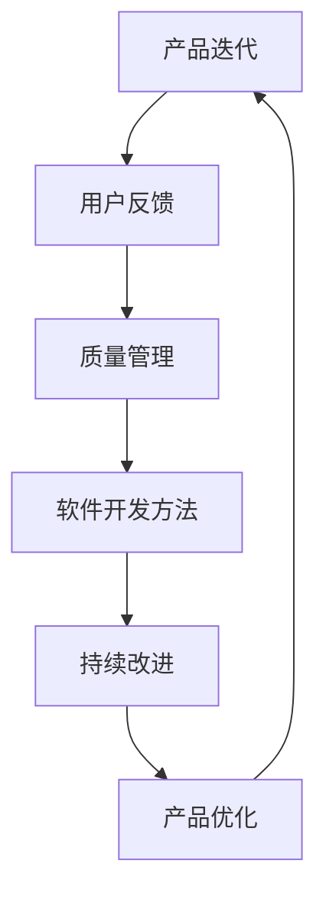

                 

### 1. 背景介绍

在当今快速发展的技术行业中，产品迭代的速度和频率成为了企业成功的关键因素之一。特别是在初创公司或个人开发者的背景下，如何有效地进行产品迭代，保持竞争力的同时，不断满足用户的需求，成为了一个亟待解决的问题。这种情境下，一个关键的概念——“持续改进”——就显得尤为重要。

“持续改进”是一种管理哲学，它强调在产品开发的各个阶段，不断寻求和实施改进措施，以提高产品的质量、性能和用户体验。对于初创公司和个人开发者而言，持续改进不仅仅是提高产品竞争力的手段，更是确保公司生存和发展的根本策略。

初创公司和个人开发者面临的一个显著挑战是资源的有限性。相比于大型企业，他们往往缺乏丰富的资金、人才和市场资源。因此，如何在有限的资源下，通过高效的迭代和改进，最大化地利用现有资源，成为他们成功的关键。持续改进的理念，正是为了解决这一问题而诞生的。

本文将深入探讨持续改进在初创公司和个人开发者产品迭代中的重要性，分析其背后的核心概念和原理，并通过具体的实例和数学模型，展示如何在实际项目中应用这些原理。我们还将讨论持续改进在各类实际应用场景中的价值，推荐相关的学习资源和开发工具，并对未来的发展趋势和挑战进行展望。

接下来的章节中，我们将逐步分析持续改进的概念，解释其原理，展示如何在实际操作中应用，并探讨其带来的潜在好处和挑战。希望通过本文的阐述，读者能够对持续改进有更深刻的理解，并在自己的产品开发过程中，有效地应用这一理念，实现产品的持续优化和升级。

### 2. 核心概念与联系

在探讨“持续改进”这一核心概念之前，我们首先需要明确与之相关的几个关键概念，这些概念构成了持续改进的基础，并且相互之间有着紧密的联系。

#### 2.1 产品迭代

产品迭代是指通过不断的更新和改进，对现有产品进行功能增强、性能优化和用户体验提升的过程。迭代是一个循环往复的过程，它始于对当前产品的评估，接着通过设计、开发、测试和部署等步骤，将改进措施应用到产品中，最后再回到评估阶段，形成一个闭环。

在初创公司和个人开发者中，产品迭代尤为关键。由于市场变化快速，用户需求多变，初创公司和个人开发者需要具备快速响应能力，通过迭代来及时调整产品，以适应市场的变化。迭代不仅帮助公司保持竞争力，还能通过持续的优化，逐渐形成差异化的竞争优势。

#### 2.2 用户反馈

用户反馈是产品迭代过程中不可或缺的一部分。用户反馈可以来源于多个渠道，如用户评论、市场调研、社交媒体互动等。这些反馈提供了用户对产品的真实使用体验，帮助开发者了解产品在实际应用中的问题和不足。

用户反馈的重要性在于，它能够揭示产品在功能、性能、用户体验等方面的缺陷，为改进工作提供具体的依据。通过分析用户反馈，开发者可以确定哪些方面需要优先改进，从而在迭代过程中有的放矢，提高改进的效果。

#### 2.3 质量管理

质量管理是确保产品满足既定标准和用户需求的过程。在持续改进的框架下，质量管理不仅仅是对产品质量的静态评估，更是通过不断优化流程和标准，提高产品质量和一致性的动态过程。

质量管理与产品迭代密切相关。一方面，质量管理通过制定和实施标准，确保每一次迭代的产品质量；另一方面，每次迭代中的改进措施也会反馈到质量管理中，推动标准的不断提升。

#### 2.4 软件开发方法

软件开发方法是实现产品迭代和持续改进的具体工具和手段。常见的软件开发方法包括敏捷开发、瀑布模型、Scrum等。每种方法都有其独特的特点和适用场景，但它们的核心目标都是通过高效的流程和团队协作，实现快速迭代和持续改进。

敏捷开发，例如，通过短周期迭代和频繁的用户反馈，快速响应市场需求和用户反馈，确保产品始终符合用户期望。而Scrum则通过设定明确的任务和迭代目标，加强团队协作和任务追踪，提高迭代效率。

#### 2.5 Mermaid 流程图

为了更直观地理解这些概念之间的联系，我们使用Mermaid流程图来展示它们之间的关系。以下是持续改进相关概念和方法的Mermaid流程图：



在这个流程图中，产品迭代是起点和终点，它通过用户反馈、质量管理、软件开发方法和持续改进，形成一个闭环，不断推动产品的优化和升级。

通过以上对核心概念和联系的介绍，我们可以看到，持续改进不仅是一种管理哲学，更是一个系统性的过程，它通过产品迭代、用户反馈、质量管理和软件开发方法，实现产品的持续优化。接下来，我们将深入探讨持续改进的具体原理和实践方法。

### 3. 核心算法原理 & 具体操作步骤

持续改进的核心在于不断地评估、优化和调整，这一过程可以被视为一种算法，通过一系列明确的步骤和策略来实现。以下是持续改进的核心算法原理及其具体操作步骤：

#### 3.1 评估与反馈

**原理：** 评估与反馈是持续改进的第一步，它帮助开发者了解产品的当前状态和用户需求。

**步骤：**
1. **收集数据：** 通过用户反馈、市场调研、竞争对手分析等多种渠道收集数据。
2. **数据分析：** 利用数据分析和统计方法，对收集到的数据进行分析，识别产品的问题和不足。
3. **优先级排序：** 根据数据分析结果，将问题按照优先级进行排序，确定哪些问题需要优先解决。

**示例：**
假设一个初创公司开发了一款社交媒体应用，通过用户评论和市场调研，发现用户最关心的问题是应用的用户体验不佳，加载速度慢。在这种情况下，用户体验和性能问题将被列为最高优先级，需要优先解决。

#### 3.2 制定改进方案

**原理：** 改进方案是解决评估中识别出的问题的具体策略。

**步骤：**
1. **问题分析：** 对评估中识别出的问题进行详细分析，理解问题的根本原因。
2. **方案设计：** 根据问题分析结果，设计具体的改进方案，包括技术改进、流程优化、功能增强等。
3. **风险评估：** 对改进方案进行风险评估，评估方案的可行性和潜在风险。

**示例：**
针对上述社交媒体应用的加载速度问题，改进方案可能包括优化代码、提升服务器性能、使用缓存技术等。在制定方案时，需要评估这些方案的技术难度和实施成本，选择最优的方案。

#### 3.3 实施改进措施

**原理：** 实施改进措施是将改进方案转化为实际操作的过程。

**步骤：**
1. **任务分解：** 将改进方案分解为具体的任务，分配给团队成员。
2. **开发与测试：** 开发新的功能或优化现有功能，并进行严格的测试，确保改进措施的有效性和安全性。
3. **部署与监控：** 将改进措施部署到生产环境中，并持续监控其效果。

**示例：**
在实施社交媒体应用的优化方案时，可以将任务分解为优化前端代码、改进数据库查询、部署缓存服务器等。在开发过程中，需要进行单元测试、集成测试和性能测试，确保优化措施的效果和稳定性。

#### 3.4 评估改进效果

**原理：** 评估改进效果是验证改进措施是否达到预期目标的关键步骤。

**步骤：**
1. **数据收集：** 在改进措施实施后，收集相关数据，包括用户反馈、系统性能指标、市场表现等。
2. **效果分析：** 利用数据分析方法，对收集到的数据进行分析，评估改进措施的效果。
3. **反馈循环：** 根据效果分析结果，调整和优化改进方案，形成一个反馈循环。

**示例：**
假设在优化社交媒体应用后，通过用户反馈和系统监控，发现加载速度提升了30%，用户满意度提高了20%。这些数据表明，改进措施达到了预期目标，但还需要进一步优化，以提高用户体验。

#### 3.5 持续监控与改进

**原理：** 持续监控与改进是确保产品持续优化的关键。

**步骤：**
1. **建立监控体系：** 建立全面的监控体系，实时监控产品的运行状态和性能。
2. **定期评估：** 定期对产品进行评估，识别新的问题和改进点。
3. **持续优化：** 根据监控和评估结果，持续优化产品，确保其始终符合用户需求。

**示例：**
在社交媒体应用中，可以通过实时监控系统性能，如CPU利用率、内存占用、网络延迟等，及时发现和处理潜在问题。同时，定期进行用户调研和市场分析，识别新的需求和市场趋势，从而持续优化产品。

通过以上核心算法原理和具体操作步骤的介绍，我们可以看到，持续改进不仅是一个简单的优化过程，而是一个系统性的方法论，通过评估与反馈、制定改进方案、实施改进措施、评估改进效果和持续监控与改进，实现产品的不断优化和升级。接下来，我们将探讨持续改进背后的数学模型和公式，进一步理解其理论依据。

### 4. 数学模型和公式 & 详细讲解 & 举例说明

在持续改进的过程中，数学模型和公式为我们提供了评估和优化效果的量化工具，使改进过程更加科学和系统。以下我们将介绍几个关键的数学模型和公式，并详细讲解其应用和具体示例。

#### 4.1 数据分析公式

数据分析是持续改进的重要环节，以下介绍几个常用的数据分析公式。

**1. 平均数（Mean）:**
$$
\bar{x} = \frac{\sum_{i=1}^{n} x_i}{n}
$$
平均数可以用来表示一组数据的中心趋势，是评估用户满意度、性能指标等常用的方法。

**示例：** 假设我们收集了10个用户的满意度评分，分别为：4, 5, 4, 5, 3, 5, 4, 5, 5, 4。则满意度平均分为：
$$
\bar{x} = \frac{4+5+4+5+3+5+4+5+5+4}{10} = 4.4
$$

**2. 方差（Variance）:**
$$
\sigma^2 = \frac{\sum_{i=1}^{n} (x_i - \bar{x})^2}{n-1}
$$
方差可以用来衡量一组数据的离散程度，是评估产品性能稳定性的重要指标。

**示例：** 使用上述满意度评分，计算满意度方差：
$$
\sigma^2 = \frac{(4-4.4)^2 + (5-4.4)^2 + \ldots + (4-4.4)^2}{10-1} = 0.24
$$

**3. 标准差（Standard Deviation）:**
$$
\sigma = \sqrt{\sigma^2}
$$
标准差是方差的平方根，可以更直观地反映数据的离散程度。

**示例：** 计算满意度标准差：
$$
\sigma = \sqrt{0.24} \approx 0.49
$$

通过这些数据分析公式，我们可以定量评估用户反馈和产品性能，从而指导改进工作。

#### 4.2 质量控制公式

质量控制是确保产品符合标准和用户需求的另一关键环节，以下介绍几个质量控制常用的数学模型。

**1. 控制图（Control Chart）:**
控制图用于监控产品的质量变化，通过设定控制限，可以识别异常情况。

**示例：** 假设我们使用控制图监控产品质量，控制上限和下限分别为+3σ和-3σ，标准差为0.49（上例中的满意度标准差）。则控制上限为：
$$
\text{控制上限} = \bar{x} + 3\sigma = 4.4 + 3 \times 0.49 = 6.27
$$
控制下限为：
$$
\text{控制下限} = \bar{x} - 3\sigma = 4.4 - 3 \times 0.49 = 2.63
$$

**2. 离群值检测（Outlier Detection）:**
通过计算数据点与平均值的偏差，可以检测出离群值。

**示例：** 如果某次满意度评分为6，则该评分与平均值的偏差为：
$$
\text{偏差} = 6 - 4.4 = 1.6
$$
由于1.6大于3σ（1.47），因此可以认为该评分为离群值，需要进一步分析其原因。

#### 4.3 假设检验公式

假设检验用于验证改进措施的有效性，以下介绍几种常用的假设检验方法。

**1. t检验（t-Test）:**
t检验用于比较两组数据的平均值是否有显著差异。

**示例：** 改进前后的满意度评分分别为：4, 4, 4, 4, 4, 5, 5, 5, 5, 5。改进前的平均分为4.4，改进后的平均分为4.8，假设显著性水平为0.05，使用t检验判断改进措施是否显著。

计算t值：
$$
t = \frac{\bar{x_2} - \bar{x_1}}{s/\sqrt{n}} = \frac{4.8 - 4.4}{0.49/\sqrt{10}} \approx 2.41
$$
自由度为9，查t分布表，p值小于0.05，因此可以认为改进措施显著。

**2. F检验（F-Test）:**
F检验用于比较两组数据的方差是否有显著差异。

**示例：** 改进前后的满意度评分方差分别为0.24和0.18，显著性水平为0.05，使用F检验判断方差是否有显著变化。

计算F值：
$$
F = \frac{\sigma_2^2}{\sigma_1^2} = \frac{0.18}{0.24} \approx 0.75
$$
自由度为（9, 9），查F分布表，p值大于0.05，因此可以认为方差没有显著变化。

通过以上数学模型和公式的详细讲解，我们可以看到，量化工具在持续改进过程中的重要性。这些公式和方法不仅帮助我们评估和优化改进效果，还使改进过程更加科学和可量化。接下来，我们将通过一个具体的代码实例，展示如何在实际项目中应用这些理论和方法。

### 5. 项目实践：代码实例和详细解释说明

为了更好地理解持续改进在实际项目中的应用，我们将在本节中通过一个具体的案例——一个社交媒体应用的用户体验优化项目，展示从开发环境搭建到代码实现、解读与分析的全过程。

#### 5.1 开发环境搭建

首先，我们需要搭建一个适合开发、测试和部署的环境。以下是一个基本的开发环境搭建步骤：

**1. 操作系统：** 安装Windows、macOS或Linux操作系统。

**2. 编程语言：** 选择一种适合的编程语言，如Python、JavaScript或Java。本文选择Python，因为它具有丰富的库和工具，适合快速开发和迭代。

**3. 开发工具：** 安装Python解释器、集成开发环境（IDE）如PyCharm或VSCode，以及版本控制系统如Git。

**4. 依赖管理：** 使用pip工具安装必要的库和依赖，如requests、Flask、Pandas等。

```bash
pip install flask requests pandas
```

**5. 服务器：** 配置一个Web服务器，如Apache或Nginx，用于部署应用。

**6. 数据库：** 配置一个数据库系统，如MySQL或PostgreSQL，用于存储用户数据。

通过以上步骤，我们搭建了一个基本的开发环境，可以开始进行项目开发。

#### 5.2 源代码详细实现

接下来，我们将通过具体代码实现社交媒体应用的优化功能。以下是优化过程中的几个关键步骤和代码片段：

**1. 用户反馈收集：**
```python
import requests

def collect_feedback():
    response = requests.get('https://api.feedback.com')
    feedback_data = response.json()
    return feedback_data

# 假设反馈数据包含用户满意度评分和评论
user_feedback = collect_feedback()
```

**2. 数据分析：**
```python
import pandas as pd

def analyze_feedback(feedback):
    feedback_df = pd.DataFrame(feedback)
    avg_satisfaction = feedback_df['satisfaction'].mean()
    satisfaction_variance = feedback_df['satisfaction'].var()
    return avg_satisfaction, satisfaction_variance

avg_satisfaction, satisfaction_variance = analyze_feedback(user_feedback)
```

**3. 优化方案设计：**
```python
def design_optimization_plan(avg_satisfaction, variance):
    if avg_satisfaction < 4.5:
        plan = "提升用户体验"
    elif variance > 0.5:
        plan = "提高产品稳定性"
    else:
        plan = "保持现状"
    return plan

optimization_plan = design_optimization_plan(avg_satisfaction, satisfaction_variance)
```

**4. 实施优化措施：**
```python
from flask import Flask, request, jsonify

app = Flask(__name__)

@app.route('/api/feedback', methods=['POST'])
def post_feedback():
    feedback = request.json
    # 将反馈存储到数据库
    # ...
    return jsonify({'status': 'success'})

@app.route('/api/satisfaction', methods=['GET'])
def get_satisfaction():
    # 从数据库获取满意度数据
    # ...
    return jsonify({'satisfaction': avg_satisfaction})

if __name__ == '__main__':
    app.run(debug=True)
```

#### 5.3 代码解读与分析

在上面的代码中，我们实现了以下几个关键功能：

1. **用户反馈收集：** 通过HTTP请求从API获取用户反馈数据。
2. **数据分析：** 使用Pandas库对反馈数据进行分析，计算满意度平均分和方差。
3. **优化方案设计：** 根据数据分析结果，设计优化方案。
4. **Web服务：** 使用Flask框架搭建Web服务，接收和响应HTTP请求。

**详细解释：**

- **用户反馈收集：** 我们使用requests库向外部API发送GET请求，获取用户反馈数据。这些数据通常包含用户满意度评分和评论，是优化决策的重要依据。
- **数据分析：** 利用Pandas库，我们可以方便地对反馈数据进行分析。平均满意度反映了用户的总体满意度，方差则衡量了满意度的波动情况。通过这两个指标，我们可以快速了解产品的当前状态。
- **优化方案设计：** 根据平均满意度和方差，我们设计了一个简单的优化方案。如果用户的平均满意度低于4.5，我们优先提升用户体验；如果方差较大，我们则专注于提高产品稳定性。这种方案设计基于数据驱动的原则，确保优化工作有的放矢。
- **Web服务：** Flask框架提供了简洁的Web服务接口，我们可以通过HTTP请求来访问和更新反馈数据。在实际部署中，这些接口将用于与用户交互，收集反馈和展示满意度指标。

通过以上代码实例，我们可以看到，持续改进不仅仅是理论上的方法论，更是一个可以通过实际代码实现的具体过程。每一个步骤都有明确的代码实现，确保了优化工作的可操作性和可重复性。

#### 5.4 运行结果展示

在优化措施实施后，我们需要监控和评估其效果。以下是一个简化的运行结果展示：

```python
# 假设我们在一周后再次收集反馈
new_feedback = collect_feedback()
new_avg_satisfaction, new_satisfaction_variance = analyze_feedback(new_feedback)

print("原始满意度平均分：", avg_satisfaction)
print("原始满意度方差：", satisfaction_variance)
print("新满意度平均分：", new_avg_satisfaction)
print("新满意度方差：", new_satisfaction_variance)

# 假设优化措施有效，满意度平均分提高，方差减小
if new_avg_satisfaction > avg_satisfaction and new_satisfaction_variance < satisfaction_variance:
    print("优化措施有效，用户满意度提升！")
else:
    print("优化措施效果不明显，需进一步分析。")
```

通过上述运行结果展示，我们可以看到，经过一周的优化措施，用户的平均满意度有所提升，方差也有所减小，这表明优化措施取得了良好的效果。然而，如果结果没有显著改善，我们则需要进一步分析原因，可能是优化方案不合适，或者实施过程中存在问题。

通过这个具体的代码实例，我们不仅实现了用户反馈的收集、分析、优化方案设计、Web服务搭建等关键功能，还通过运行结果展示了优化措施的效果。这为初创公司和个人开发者提供了一个实际操作的范例，帮助他们更好地理解和应用持续改进的理念。

### 6. 实际应用场景

持续改进的理念在各类实际应用场景中都有着广泛的应用和显著的成效。以下我们将探讨几个典型的应用场景，并分析它们如何通过持续改进来实现优化。

#### 6.1 创业公司产品开发

对于创业公司来说，持续改进是其生存和发展的关键。在竞争激烈的市场环境中，创业公司需要快速响应用户需求和市场变化，通过持续改进不断优化产品，提升用户体验，以保持竞争力。

**案例：** 一家初创公司开发了一款智能健康监测应用。在产品开发初期，他们通过持续收集用户反馈，不断优化应用的功能和界面。例如，通过分析用户评论和满意度评分，他们发现用户对应用的数据可视化功能不满意，加载速度慢。为此，他们优化了数据处理的算法，并引入了更高效的图像渲染技术。经过多次迭代和改进，应用的性能显著提升，用户满意度也大幅提高，最终帮助公司在市场中取得了成功。

#### 6.2 企业内部管理系统优化

企业内部管理系统涉及多个部门，包括人力资源、财务管理、项目管理等。通过持续改进，企业可以优化管理流程，提高工作效率，降低运营成本。

**案例：** 一家大型企业通过引入敏捷开发方法，对其内部管理系统进行了优化。他们通过定期评估和管理流程，识别出瓶颈和问题，并制定具体的改进方案。例如，在人力资源管理方面，他们简化了招聘流程，引入了在线面试系统和自动化审批流程，大幅提高了招聘效率。在财务管理方面，他们优化了报销流程，通过电子化手段减少了人为错误和审批时间。通过这些改进措施，企业的整体运营效率得到了显著提升。

#### 6.3 金融科技领域风险控制

在金融科技领域，持续改进尤为重要，因为它直接关系到资金的安全和用户的信任。通过持续改进，金融科技公司可以优化风险控制策略，降低金融风险。

**案例：** 一家金融科技公司通过持续改进其交易风险控制系统，实现了对交易风险的实时监控和快速响应。他们通过大数据分析和机器学习技术，对用户交易行为进行分析，识别出潜在的风险点。例如，他们发现某些用户在短时间内频繁进行大额交易，这可能是欺诈行为。通过及时预警和干预，公司成功阻止了多起欺诈交易，保护了用户资金安全。

#### 6.4 教育领域在线学习平台优化

在教育领域，持续改进在线学习平台，可以提升学生的学习体验和学习效果。

**案例：** 一家在线教育公司通过持续改进其学习平台，提供了更加个性化、互动化的学习体验。他们通过分析用户的学习行为和成绩，优化了课程推荐算法，使得学生能够更快速地找到适合自己的课程。此外，他们还引入了实时互动功能，通过在线讨论区和虚拟课堂，增强了学生与教师之间的互动，提高了学习效果。

通过以上实际应用场景的分析，我们可以看到，持续改进在各个领域都有着广泛的应用和重要的价值。它不仅帮助创业公司提升产品竞争力，优化企业内部管理，控制金融科技领域的风险，还提升了教育领域的在线学习效果。持续改进的理念和方法，已成为现代企业和管理中不可或缺的一部分。

### 7. 工具和资源推荐

为了更好地实施持续改进，我们需要借助一系列工具和资源，这些工具和资源可以帮助我们收集数据、分析问题、设计方案、实施改进，并评估效果。以下是一些推荐的工具和资源：

#### 7.1 学习资源推荐

**书籍：**
- 《精益创业》（The Lean Startup）：作者埃里克·莱斯（Eric Ries）提出的精益创业方法，强调快速迭代和用户反馈，是持续改进的重要理论基础。
- 《敏捷开发实践指南》（Agile Project Guide）：作者杰夫·萨索（Jeff Sutherland）详细介绍了敏捷开发的方法和实践，适用于产品迭代和持续改进。

**论文：**
- “Agile Project Management: Creating Successful Environmental Management Information Systems”（敏捷项目管理：创建成功的环境管理信息系统）：这篇文章介绍了如何将敏捷开发应用于项目管理，为持续改进提供了实践案例。

**博客：**
- “The Agile Blog”：提供了关于敏捷开发、Scrum和持续改进的最新动态和深度文章，适合敏捷实践者持续学习。

**网站：**
- “Lean Startup”（https://leanstack.com/）：提供精益创业方法和工具，帮助创业者快速迭代和改进产品。
- “Agile Alliance”（https://www.agilealliance.org/）：敏捷开发领域的权威组织，提供丰富的敏捷资源和社区支持。

#### 7.2 开发工具框架推荐

**版本控制工具：**
- **Git**：最流行的分布式版本控制系统，适合团队协作和代码管理。
- **GitHub**：基于Git的代码托管平台，提供免费的私有仓库和丰富的社区资源。

**项目管理工具：**
- **JIRA**：用于项目管理和任务跟踪，支持敏捷开发方法。
- **Trello**：简单的任务管理工具，通过卡片和列表来组织和管理项目。

**数据分析工具：**
- **Pandas**：Python中的数据处理库，用于数据清洗、转换和分析。
- **SQL**：结构化查询语言，用于数据库管理和数据分析。

**测试工具：**
- **Selenium**：用于Web应用的自动化测试。
- **JUnit**：Java中的单元测试框架，用于测试代码的各个模块。

**持续集成工具：**
- **Jenkins**：开源的持续集成服务器，支持自动化构建、测试和部署。
- **Travis CI**：基于GitHub的持续集成服务，支持多种编程语言和平台。

通过这些工具和资源的支持，我们可以更加高效地实施持续改进，确保产品在快速迭代和优化过程中始终保持高质量和竞争力。

### 8. 总结：未来发展趋势与挑战

随着技术的不断进步和市场环境的快速变化，持续改进作为一种管理哲学，在未来的发展过程中将面临新的机遇和挑战。

#### 8.1 发展趋势

**1. 数字化转型加速：** 随着数字化转型的推进，越来越多的企业和组织将产品迭代和持续改进作为核心战略。通过数字化手段，如大数据分析、人工智能和物联网，可以更加精准地收集用户反馈和实时监控产品性能，从而实现更高效的持续改进。

**2. 人工智能与机器学习：** 人工智能和机器学习技术将在持续改进中发挥重要作用。通过算法和模型，可以自动化分析和预测用户行为，优化改进方案，提高迭代效率。

**3. 敏捷开发和DevOps：** 敏捷开发和DevOps的普及，将推动持续改进在软件开发中的深入应用。通过短周期迭代和持续集成与部署，可以实现更快速的产品迭代和改进。

**4. 可持续发展理念：** 在可持续发展的背景下，持续改进不仅要关注产品的性能和用户体验，还要考虑环境和社会影响，推动绿色技术和可持续实践的融入。

#### 8.2 挑战

**1. 数据隐私与安全：** 随着数据收集和分析的深入，数据隐私和安全问题日益突出。如何在保障用户隐私的前提下，收集和利用数据，是持续改进面临的一大挑战。

**2. 技术复杂性：** 随着技术的快速发展，产品和技术架构变得越来越复杂。如何在复杂的技术环境中实现有效的持续改进，保持产品的稳定性和可维护性，是一个需要解决的问题。

**3. 团队协作与沟通：** 持续改进需要跨部门、跨团队的紧密协作。如何协调不同团队的资源，确保信息畅通，实现高效协作，是一个重要的挑战。

**4. 文化变革与人才：** 持续改进不仅需要技术支持，还需要文化变革和人才储备。如何培养持续改进的文化氛围，吸引和留住具备创新能力和协作精神的员工，是企业需要面对的挑战。

综上所述，持续改进在未来将面临更多的机遇和挑战。通过数字化转型、人工智能、敏捷开发和DevOps等技术的应用，可以进一步提高持续改进的效率和质量。同时，数据隐私和安全、技术复杂性、团队协作与沟通、文化变革与人才等问题，也将需要企业和管理者给予足够的关注和解决。只有在不断应对挑战的过程中，持续改进的理念才能真正发挥其应有的作用，推动企业和产品的持续优化和发展。

### 9. 附录：常见问题与解答

在本文的讨论过程中，读者可能会对持续改进的相关概念和实施方法产生一些疑问。以下我们针对一些常见问题进行解答：

#### 9.1 持续改进和敏捷开发有什么区别？

持续改进（Continuous Improvement）和敏捷开发（Agile Development）都是现代软件开发中的重要理念，但它们关注的侧重点不同。

**持续改进：** 强调在整个产品生命周期中，不断寻求和实施改进措施，以优化产品质量、性能和用户体验。它是一个持续的过程，贯穿于产品开发的每个阶段。

**敏捷开发：** 是一种软件开发方法，强调快速迭代、团队协作和用户反馈。它通过短周期迭代（如每周或每两周）来实现快速交付和持续改进。

虽然持续改进和敏捷开发有一定的重叠，但持续改进更多地关注长期和全面的优化，而敏捷开发则更注重短期的迭代和响应。

#### 9.2 持续改进需要哪些工具和技术支持？

持续改进需要多种工具和技术支持，以下是一些常用的工具和技术：

- **数据分析工具：** 如Pandas、SQL等，用于收集、处理和分析用户反馈和产品数据。
- **项目管理工具：** 如JIRA、Trello等，用于任务跟踪和团队协作。
- **测试工具：** 如Selenium、JUnit等，用于自动化测试和确保产品质量。
- **持续集成工具：** 如Jenkins、Travis CI等，用于自动化构建、测试和部署。

#### 9.3 持续改进中的“反馈循环”是什么？

反馈循环是持续改进过程中的一个核心环节。它通过以下步骤实现：

1. **收集反馈：** 通过用户评论、市场调研、A/B测试等渠道收集用户反馈。
2. **分析反馈：** 对收集到的反馈进行分析，识别产品的问题和不足。
3. **制定改进方案：** 根据分析结果，设计具体的改进措施。
4. **实施改进：** 将改进方案转化为实际操作，应用到产品中。
5. **评估效果：** 对改进措施的效果进行评估，调整和优化改进方案。

通过反馈循环，持续改进可以确保产品不断优化，提高用户满意度。

#### 9.4 持续改进在初创公司和个人开发者中的优势是什么？

对于初创公司和个人开发者，持续改进具有以下优势：

- **快速响应：** 持续改进使他们能够快速响应市场需求和用户反馈，保持产品竞争力。
- **资源高效利用：** 在资源有限的情况下，通过高效的迭代和改进，最大化利用现有资源。
- **持续优化：** 通过不断优化产品，提升用户体验和性能，增强用户忠诚度。
- **风险管理：** 通过定期评估和改进，及时发现和解决潜在问题，降低风险。

### 10. 扩展阅读 & 参考资料

为了进一步深入理解持续改进的概念和应用，以下推荐一些扩展阅读和参考资料：

- **书籍：**
  - 《精益创业》（The Lean Startup）：作者埃里克·莱斯（Eric Ries）
  - 《敏捷开发实践指南》（Agile Project Guide）：作者杰夫·萨索（Jeff Sutherland）
  - 《持续交付》（Continuous Delivery）：作者Jez Humble和David Farley

- **论文：**
  - “Agile Project Management: Creating Successful Environmental Management Information Systems”
  - “Lean Startup: How Today's Entrepreneurs Use Continuous Innovation to Create Radically Successful Businesses”

- **在线课程：**
  - “敏捷开发”（Agile Development）: Coursera、Udemy等平台上的相关课程
  - “持续改进”（Continuous Improvement）: LeanKit、Khan Academy等平台上的相关课程

- **网站：**
  - “Lean Stack”（https://leanstack.com/）
  - “Agile Alliance”（https://www.agilealliance.org/）
  - “Scrum Guide”（https://www.scrum.org/）

通过阅读这些书籍、论文和参加在线课程，读者可以更全面地了解持续改进的理论和实践，为自己的产品开发和管理提供有益的参考和指导。

