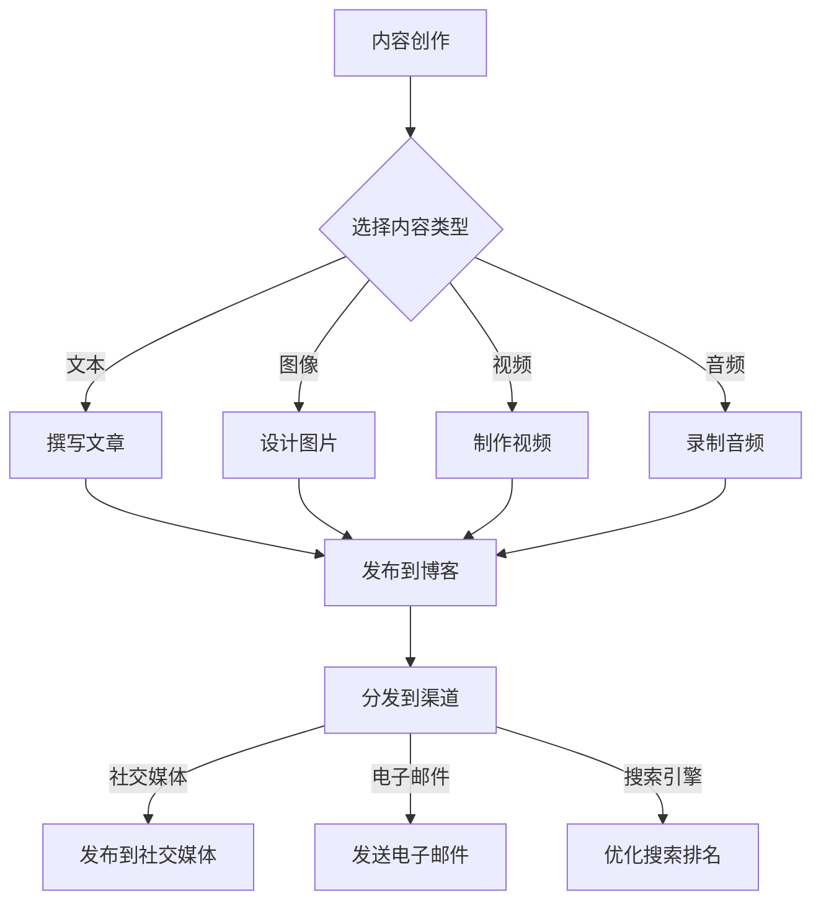

                 

 > 作为一位世界级人工智能专家，我深知内容分发在当前数字时代的重要性。对于一家独力经营的公司来说，如何有效地分发内容，以扩大其影响力，是一个至关重要的议题。本文将探讨一人公司的内容分发策略，提供一系列实用建议，帮助您在竞争激烈的市场中脱颖而出。

## 文章关键词

- 内容分发
- 一人公司
- 网络营销
- 数字影响力
- 营销策略

## 文章摘要

本文旨在探讨一人公司如何通过内容分发策略来扩大其影响力。我们将深入分析当前内容分发的挑战与机遇，并介绍一套实用的策略，包括内容创作、渠道选择、优化方法等，旨在帮助读者制定有效的个人品牌推广计划。通过本文的指导，您将学会如何利用内容分发实现业务增长和品牌提升。

### 1. 背景介绍

随着互联网技术的飞速发展，内容分发已成为现代市场营销的核心环节。对于小型企业或一人公司来说，内容分发不仅关乎品牌的传播，更直接影响到公司的市场认知度和业务增长。然而，面对复杂多变的市场环境和竞争压力，如何制定有效的内容分发策略成为许多企业主面临的挑战。

一人公司的特点在于其灵活性和创新性，这使得它们能够在内容创作和分发上更具灵活性。然而，这也带来了挑战，如资源有限、时间紧张等问题。因此，如何通过内容分发策略实现影响力的最大化，成为一人公司亟需解决的问题。

### 2. 核心概念与联系

要实现有效的内容分发，首先需要理解几个核心概念：

#### a. 内容类型

内容类型包括文本、图像、视频、音频等。每种类型都有其独特的传播效果和受众群体。对于一人公司来说，选择合适的内容类型至关重要。例如，如果公司的主要目标受众是年轻一代，那么视频和图像可能更受欢迎。

#### b. 分发渠道

分发渠道包括社交媒体、博客、电子邮件、搜索引擎等。不同的渠道适合不同的内容类型和目标受众。例如，社交媒体更适合快速传播，而博客则适合深入探讨。

#### c. 用户体验

用户体验是内容分发的关键因素。内容不仅需要吸引眼球，还需要提供价值，帮助受众解决问题或满足需求。一人公司需要关注用户体验，确保内容易于访问、理解和分享。

下面是一个简单的 Mermaid 流程图，展示内容分发的基本流程：



### 3. 核心算法原理 & 具体操作步骤

要制定一套有效的内容分发策略，需要以下几个核心算法原理：

#### a. 用户画像

用户画像是指对目标受众的特征和行为进行详细分析，以便更好地了解他们的需求、喜好和行为模式。通过用户画像，一人公司可以更加精准地制定内容策略。

具体操作步骤：

1. 收集用户数据：通过网站分析工具、社交媒体分析等手段收集用户数据。
2. 分析数据：使用数据分析工具对收集到的用户数据进行处理和分析。
3. 形成用户画像：根据分析结果，绘制出用户画像，包括年龄、性别、地理位置、兴趣爱好等。

#### b. 内容策划

内容策划是指根据用户画像和业务目标，制定合适的内容策略。内容包括主题、形式、频率等。

具体操作步骤：

1. 确定内容主题：根据用户画像和业务目标，选择具有吸引力的内容主题。
2. 设计内容形式：根据内容主题，选择最适合的文本、图像、视频等形式。
3. 制定发布计划：根据业务需求和用户习惯，制定合适的内容发布计划。

#### c. 分发优化

分发优化是指通过技术手段提高内容在各个分发渠道的可见度和影响力。

具体操作步骤：

1. 选择合适的渠道：根据用户画像和内容形式，选择最适合的分发渠道。
2. 优化内容格式：根据渠道特性，调整内容格式，提高用户点击率。
3. 跟踪分析效果：使用分析工具跟踪内容在各个渠道的表现，不断优化策略。

### 4. 数学模型和公式 & 详细讲解 & 举例说明

在内容分发策略中，我们可以使用以下数学模型和公式来评估内容的表现和优化策略：

#### a. 转化率

转化率是指访问者完成特定目标（如购买、订阅、留言等）的比例。转化率是衡量内容效果的重要指标。

公式：转化率 = 完成目标的人数 / 访问人数

举例说明：

假设某篇博客文章有1000次访问，其中20人完成了订阅目标，则该文章的转化率为20%。

#### b. 点击率

点击率是指用户点击内容的比例。点击率是衡量内容吸引力和分发效果的重要指标。

公式：点击率 = 点击次数 / 展示次数

举例说明：

假设某条社交媒体推文展示了1000次，其中50次被用户点击，则该推文的点击率为5%。

#### c. 营销ROI

营销ROI是指营销投入与回报的比率。营销ROI是衡量营销效果的重要指标。

公式：营销ROI = （收益 - 成本）/ 成本

举例说明：

假设某次电子邮件营销活动成本为1000元，产生收益2000元，则该活动的营销ROI为100%。

### 5. 项目实践：代码实例和详细解释说明

以下是一个简单的 Python 代码实例，用于分析内容分发的效果，并根据分析结果优化策略。

```python
import pandas as pd

# 加载分析数据
data = pd.read_csv('content_analysis.csv')

# 计算转化率
data['转化率'] = data['完成目标人数'] / data['访问人数']

# 计算点击率
data['点击率'] = data['点击次数'] / data['展示次数']

# 计算营销ROI
data['营销ROI'] = (data['收益'] - data['成本']) / data['成本']

# 打印分析结果
print(data[['内容类型', '渠道', '转化率', '点击率', '营销ROI']])

# 根据分析结果优化策略
for index, row in data.iterrows():
    if row['转化率'] < 0.05 or row['点击率'] < 0.1 or row['营销ROI'] < 1:
        print(f"优化策略：内容类型：{row['内容类型']}, 渠道：{row['渠道']}")
```

该代码首先加载分析数据，然后计算转化率、点击率和营销ROI，最后根据分析结果提出优化策略。

### 6. 实际应用场景

内容分发策略在许多实际应用场景中都取得了显著成效：

#### a. 社交媒体营销

通过精准的内容分发，一家小型电商公司在社交媒体上实现了显著的品牌曝光和销售增长。

#### b. 个人品牌建设

一位独立顾问通过持续的内容创作和分发，在专业领域内建立了强大的个人品牌，吸引了大量潜在客户。

#### c. 搜索引擎优化

一家初创公司通过内容分发和优化，提高了在搜索引擎中的排名，从而获得了更多的免费流量和业务机会。

### 7. 工具和资源推荐

为了帮助您更好地实施内容分发策略，以下是一些实用的工具和资源推荐：

- **内容创作工具**：Grammarly、Canva、Hootsuite
- **数据分析工具**：Google Analytics、Google Search Console、Google Trends
- **内容优化工具**：SEOmoz、Ahrefs、BuzzSumo
- **社交媒体平台**：Facebook、Instagram、LinkedIn、Twitter
- **电子邮件营销工具**：Mailchimp、ConvertKit、Constant Contact

### 8. 总结：未来发展趋势与挑战

随着技术的不断进步，内容分发领域将继续发展，带来更多机遇和挑战：

- **人工智能**：人工智能将在内容创作、分析和分发中发挥更大作用，提高效率和精准度。
- **个性化内容**：个性化内容将成为主流，更有效地满足用户需求。
- **多渠道整合**：多渠道整合将提高内容传播的覆盖面和影响力。

然而，内容分发也面临一些挑战，如信息过载、数据隐私和安全等问题。因此，一人公司需要不断调整和优化内容分发策略，以应对市场变化。

### 9. 附录：常见问题与解答

**Q1：如何提高内容转化率？**

A1：提高内容转化率的关键在于提供有价值的、与用户需求相关的内容，同时优化用户体验，如简化购买流程、提供清晰的产品描述等。

**Q2：内容分发是否适合所有类型的企业？**

A2：是的，内容分发适用于各种类型的企业，尤其是那些注重长期品牌建设和用户关系维护的企业。但对于资源有限的小型企业，需要更加谨慎地制定和执行内容分发策略。

**Q3：如何评估内容分发效果？**

A3：可以使用多种指标评估内容分发效果，如访问量、转化率、点击率、营销ROI等。结合这些指标，可以全面了解内容的表现，为后续优化提供依据。

### 10. 扩展阅读 & 参考资料

- **《内容营销实战手册》**：[尼尔·贝斯特罗夫](https://www.amazon.com/Content-Marketing-Handbook-Practical-Strategies/dp/1118546221)
- **《搜索引擎优化：理论与实践》**：[约翰·多伊尔](https://www.amazon.com/Search-Engine-Optimization-Theory-Practice/dp/007178814X)
- **《社交媒体营销：策略、工具与案例》**：[艾略特·克莱因](https://www.amazon.com/Social-Media-Marketing-Strategies-Tools/dp/0071800609)

---

作者：禅与计算机程序设计艺术 / Zen and the Art of Computer Programming

本文旨在为一人公司提供内容分发策略的指导，帮助其在竞争激烈的市场中脱颖而出。通过深入分析和实际应用，本文展示了如何制定和优化内容分发策略，实现业务增长和品牌提升。希望本文对您有所启发，助力您的公司取得更大的成功。|<|im_sep|>

