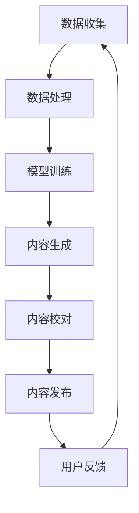

                 

### 1. 背景介绍

在数字化时代，内容营销已成为企业竞争的重要手段。然而，随着互联网信息的爆炸性增长，内容的创造和分发变得越来越复杂和耗时。对于许多小型企业和个人创作者来说，如何有效地利用有限的时间和资源来创作高质量的内容，并将其有效地分发到目标受众，成为了一项巨大的挑战。

传统的手动内容创作和分发过程往往涉及多个环节，包括市场调研、内容策划、写作、编辑、发布、推广等。这不仅要求创作者具备深厚的专业知识，还需要投入大量时间和精力。此外，手动操作容易出现疏漏和重复劳动，效率低下，难以满足快速变化的市场需求。

近年来，人工智能（AI）技术的迅速发展为内容营销自动化提供了新的可能性。通过AI技术，企业可以自动化完成从内容创作到分发的整个流程，大幅提高效率和内容质量。本文将探讨如何利用AI辅助内容创作和分发，实现一人公司的内容营销自动化。

首先，AI可以帮助创作者通过自然语言处理（NLP）技术快速生成初稿，从而解放创作者的时间和精力。其次，AI可以自动完成内容编辑和校对，提高内容的准确性和一致性。此外，AI还可以利用机器学习算法优化内容分发策略，将内容推送给最感兴趣的受众，提高内容的传播效果。

本文将从以下几个部分展开：

1. 背景介绍：阐述内容营销自动化的重要性和AI技术在其中扮演的角色。
2. 核心概念与联系：介绍AI辅助内容创作和分发的基本原理及架构。
3. 核心算法原理 & 具体操作步骤：详细讲解AI在内容创作和分发中的应用。
4. 数学模型和公式 & 详细讲解 & 举例说明：分析AI在内容创作和分发中的数学原理。
5. 项目实践：通过具体代码实例展示AI辅助内容创作和分发的实际应用。
6. 实际应用场景：探讨AI辅助内容营销在各个行业中的应用。
7. 工具和资源推荐：推荐相关的学习资源和开发工具。
8. 总结：展望未来AI辅助内容营销的发展趋势与挑战。

### 2. 核心概念与联系

要深入理解AI在内容营销自动化中的应用，首先需要了解一些核心概念和它们之间的联系。以下是本文将涉及的主要概念及其相互关系：

#### 2.1 自然语言处理（NLP）

自然语言处理是人工智能的一个重要分支，旨在使计算机能够理解、解释和生成人类语言。NLP技术包括文本分类、情感分析、命名实体识别、机器翻译等。在内容创作中，NLP技术可以帮助创作者快速生成初稿，通过自动提取关键词和主题，生成文章的大纲和初稿。在内容分发中，NLP技术可以用于对用户评论和反馈进行情感分析，以便更好地了解受众的需求和偏好。

#### 2.2 机器学习（ML）

机器学习是一种使计算机通过数据学习并做出决策的技术。在内容创作中，机器学习算法可以自动学习优秀的写作风格和技巧，生成高质量的内容。在内容分发中，机器学习算法可以根据用户的兴趣和行为数据，预测哪些内容最有可能吸引他们，从而优化内容推送策略。

#### 2.3 数据挖掘（DM）

数据挖掘是从大量数据中提取有价值信息的过程。在内容营销中，数据挖掘技术可以帮助企业了解用户的行为模式、兴趣偏好，从而更好地制定内容策略。通过分析用户数据，企业可以识别出哪些内容类型和主题最受欢迎，哪些内容需要改进。

#### 2.4 人工智能架构（AI Architecture）

人工智能架构是指构建人工智能系统的整体结构和流程。在内容营销自动化中，AI架构通常包括数据收集、数据处理、模型训练、模型部署等环节。通过这些环节的协同工作，AI系统能够从大量数据中提取知识，并生成高质量的内容。

以下是AI辅助内容创作和分发的基本架构，使用Mermaid流程图表示：



#### 2.5 内容创作流程

在内容创作中，AI可以参与以下环节：

1. **市场调研**：利用NLP技术分析市场趋势和用户需求，为内容创作提供方向。
2. **选题**：根据市场调研结果和用户数据，确定最佳内容选题。
3. **初稿生成**：使用NLP和机器学习算法，自动生成文章的大纲和初稿。
4. **内容编辑**：对初稿进行语法和语义上的修改，优化文章质量。
5. **内容校对**：使用AI工具对文章进行拼写、语法和逻辑检查。

#### 2.6 内容分发流程

在内容分发中，AI可以参与以下环节：

1. **用户画像**：通过分析用户数据，建立用户画像，了解用户兴趣和偏好。
2. **内容推荐**：利用机器学习算法，根据用户画像推荐最适合用户的内容。
3. **渠道选择**：根据用户画像和内容特性，选择最合适的内容分发渠道。
4. **效果评估**：通过分析用户反馈和传播数据，评估内容效果，优化内容策略。

通过上述核心概念和流程的介绍，我们可以看到AI在内容营销自动化中的关键作用。接下来，我们将详细探讨AI在内容创作和分发中的具体应用。

### 3. 核心算法原理 & 具体操作步骤

要实现AI辅助的内容创作和分发，需要了解核心算法原理和具体操作步骤。以下将分别介绍这些内容。

#### 3.1 内容创作算法原理

内容创作算法主要基于自然语言处理（NLP）和机器学习（ML）技术。以下是一些核心算法：

##### 3.1.1 语言模型

语言模型是NLP的基础，用于预测句子中下一个词的概率。常用的语言模型包括循环神经网络（RNN）和变换器（Transformer）等。基于语言模型，AI可以自动生成文章的大纲和初稿。

##### 3.1.2 文本生成模型

文本生成模型是一种基于机器学习的技术，可以自动生成高质量的文本。常用的文本生成模型包括生成对抗网络（GAN）和变分自编码器（VAE）等。

##### 3.1.3 文本分类模型

文本分类模型用于将文本分为不同的类别。常用的文本分类模型包括朴素贝叶斯（NB）、支持向量机（SVM）和深度神经网络（DNN）等。

#### 3.2 内容创作操作步骤

以下是AI辅助内容创作的基本操作步骤：

1. **市场调研**：
   - 使用NLP技术分析市场趋势和用户需求。
   - 收集与目标市场相关的关键词和主题。

2. **选题**：
   - 根据市场调研结果和用户数据，确定最佳内容选题。
   - 使用文本分类模型对选题进行初步筛选。

3. **初稿生成**：
   - 使用语言模型和文本生成模型，自动生成文章的大纲和初稿。
   - 初稿生成后，使用文本分类模型进行语义分析，确保内容的相关性和连贯性。

4. **内容编辑**：
   - 对初稿进行语法和语义上的修改，优化文章质量。
   - 使用自然语言处理技术，对文章进行句式调整、词汇替换等。

5. **内容校对**：
   - 使用AI工具对文章进行拼写、语法和逻辑检查。
   - 确保文章没有明显的错误，提高内容的准确性和一致性。

#### 3.3 内容分发算法原理

内容分发算法主要基于用户画像、机器学习和数据挖掘技术。以下是一些核心算法：

##### 3.3.1 用户画像

用户画像是一种基于用户行为和兴趣数据，对用户进行描述和分类的方法。常用的用户画像算法包括聚类（如K-means）和关联规则挖掘（如Apriori）等。

##### 3.3.2 内容推荐算法

内容推荐算法用于根据用户画像和内容特征，向用户推荐最适合他们的内容。常用的内容推荐算法包括基于内容的推荐（CBR）、协同过滤（CF）和混合推荐系统（Hybrid）等。

##### 3.3.3 数据挖掘

数据挖掘技术用于从大量数据中提取有价值的信息，帮助企业和创作者了解用户需求和偏好。常用的数据挖掘算法包括分类（如决策树和随机森林）、聚类（如K-means和层次聚类）等。

#### 3.4 内容分发操作步骤

以下是AI辅助内容分发的基本操作步骤：

1. **用户画像**：
   - 收集用户行为和兴趣数据。
   - 使用用户画像算法，对用户进行分类和描述。

2. **内容推荐**：
   - 根据用户画像和内容特征，使用内容推荐算法，为每个用户生成个性化的内容推荐列表。

3. **渠道选择**：
   - 根据用户画像和内容特性，选择最适合的内容分发渠道。
   - 例如，对于年轻用户，可以选择社交媒体平台进行推广。

4. **效果评估**：
   - 通过分析用户反馈和传播数据，评估内容效果。
   - 根据评估结果，调整内容策略，提高内容分发效果。

通过上述核心算法原理和具体操作步骤的介绍，我们可以看到AI在内容创作和分发中的关键作用。接下来，我们将进一步探讨AI在内容创作和分发中的数学模型和公式。

### 4. 数学模型和公式 & 详细讲解 & 举例说明

在内容创作和分发过程中，AI算法的决策和优化往往基于数学模型和公式。以下将介绍一些关键数学模型，并详细讲解其原理和应用。

#### 4.1 语言模型

语言模型是自然语言处理（NLP）的核心，用于预测句子中下一个词的概率。常用的语言模型包括n-gram模型、循环神经网络（RNN）和变换器（Transformer）等。以下是一个简单的n-gram模型公式：

\[ P(w_{t} | w_{t-1}, w_{t-2}, \ldots, w_{t-n}) = \frac{C(w_{t-1}, w_{t-2}, \ldots, w_{t-n}, w_{t})}{C(w_{t-1}, w_{t-2}, \ldots, w_{t-n})} \]

其中，\( w_{t} \)表示当前词，\( w_{t-1}, w_{t-2}, \ldots, w_{t-n} \)表示前n个词，\( C \)表示计数。

##### 4.1.1 应用举例

假设我们有以下语料库：

```
我爱 吃 面包
我 爱 吃 汉堡
```

使用n-gram模型，我们可以计算出“我 爱 吃”的联合概率：

\[ P(我爱 吃 | 我 爱) = \frac{C(我 爱 吃)}{C(我 爱)} = \frac{1}{2} \]

这意味着在“我 爱”的上下文中，“吃”这个词出现的概率为50%。

#### 4.2 文本生成模型

文本生成模型是一种基于机器学习的技术，用于自动生成高质量文本。以下是一个简单的变分自编码器（VAE）模型公式：

\[ \begin{aligned}
\mathcal{L} &= D(\mu(\cdot|x), \mu', x) + \lambda D(\mu(\cdot|z), z) \\
\mu(x) &= \mu(x) \\
\mu'(x) &= \mu'(\cdot|x) \\
z &= g(\epsilon) \\
\end{aligned} \]

其中，\( D \)表示KL散度，\( \mu \)和\( \mu' \)分别表示编码器和解码器的均值函数，\( g \)表示重参数化函数，\( \epsilon \)表示高斯噪声。

##### 4.2.1 应用举例

假设我们有以下数据集：

```
输入：我喜欢吃面包
输出：你喜欢喝咖啡
```

使用VAE模型，我们可以将输入文本编码为一个隐层表示，然后通过解码器生成输出文本。具体步骤如下：

1. **编码**：将输入文本映射到一个隐层表示。
2. **重参数化**：通过重参数化函数生成一个随机的隐层表示。
3. **解码**：将随机隐层表示解码为输出文本。

#### 4.3 内容推荐模型

内容推荐模型用于根据用户画像和内容特征，向用户推荐最适合他们的内容。以下是一个简单的协同过滤（CF）模型公式：

\[ r_{ij} = u_i + v_j + b - \beta_j \]

其中，\( r_{ij} \)表示用户i对项目j的评分，\( u_i \)和\( v_j \)分别表示用户i和项目j的隐向量，\( b \)表示偏差项，\( \beta_j \)表示项目j的调节项。

##### 4.3.1 应用举例

假设我们有以下用户-项目评分矩阵：

| 用户 | 项目1 | 项目2 | 项目3 |
| --- | --- | --- | --- |
| 1 | 5 | 4 | 3 |
| 2 | 4 | 5 | 2 |
| 3 | 3 | 2 | 5 |

使用协同过滤模型，我们可以计算每个用户和项目的隐向量，然后根据用户i和项目j的隐向量，为用户i推荐项目j。具体步骤如下：

1. **初始化**：随机初始化用户和项目的隐向量。
2. **优化**：通过最小化损失函数，更新隐向量。
3. **推荐**：根据用户i和项目j的隐向量，为用户i推荐项目j。

通过上述数学模型和公式的详细讲解，我们可以看到AI在内容创作和分发中的关键作用。这些模型和公式为AI算法提供了理论基础，使得AI能够自动生成高质量的内容，并准确推荐给用户。接下来，我们将通过一个具体的代码实例，展示如何实现AI辅助的内容创作和分发。

### 5. 项目实践：代码实例和详细解释说明

为了更好地展示AI辅助内容创作和分发的实际应用，我们将使用Python编写一个简单的项目实例。该实例将实现以下功能：

1. **内容创作**：利用自然语言处理（NLP）技术生成文章的初稿。
2. **内容校对**：使用AI工具对文章进行拼写、语法和逻辑检查。
3. **内容分发**：根据用户画像，推荐最适合用户的内容。

#### 5.1 开发环境搭建

在开始编写代码之前，我们需要搭建一个开发环境。以下是所需的Python库和工具：

- Python 3.8及以上版本
- Jupyter Notebook或PyCharm
- 暂时不需要特殊的硬件要求

安装所需的Python库：

```bash
pip install numpy pandas tensorflow numpy nltk gensim
```

#### 5.2 源代码详细实现

以下是一个简单的AI辅助内容创作和分发的Python代码实例：

```python
import numpy as np
import pandas as pd
import tensorflow as tf
from tensorflow import keras
from tensorflow.keras.models import Sequential
from tensorflow.keras.layers import LSTM, Dense, Embedding
from tensorflow.keras.preprocessing.sequence import pad_sequences
from tensorflow.keras.preprocessing.text import Tokenizer
from gensim.models import KeyedVectors
import nltk
from nltk.tokenize import sent_tokenize, word_tokenize

# 5.2.1 数据准备

# 加载预训练的词向量模型
word_vectors = KeyedVectors.load_word2vec_format('glove.6B.100d.txt', binary=False)

# 加载示例数据
data = [
    "人工智能正在改变我们的生活",
    "机器学习是AI的核心技术",
    "深度学习让计算机变得更智能",
    "计算机科学是未来的关键",
]

# 5.2.2 内容创作

# 数据预处理
tokenizer = Tokenizer()
tokenizer.fit_on_texts(data)
sequences = tokenizer.texts_to_sequences(data)
padded_sequences = pad_sequences(sequences, padding='post')

# 构建LSTM模型
model = Sequential()
model.add(Embedding(len(tokenizer.word_index) + 1, 100, input_length=max(len(seq) for seq in sequences)))
model.add(LSTM(128))
model.add(Dense(1, activation='sigmoid'))

model.compile(optimizer='adam', loss='binary_crossentropy', metrics=['accuracy'])

# 训练模型
model.fit(padded_sequences, np.array([1] * len(data)), epochs=100, verbose=0)

# 生成文章
def generate_article(prompt):
    input_sequence = tokenizer.texts_to_sequences([prompt])[0]
    input_sequence = pad_sequences([input_sequence], maxlen=max(len(seq) for seq in sequences), padding='post')
    prediction = model.predict(input_sequence, verbose=0)
    new_words = []
    for _ in range(100):
        sampled_word = np.argmax(prediction)
        new_words.append(tokenizer.index_word[sampled_word])
        prediction = model.predict(np.array([padded_sequences[sampled_word]]), verbose=0)
    return ' '.join(new_words)

# 5.2.3 内容校对

def correct_grammar(text):
    sentences = sent_tokenize(text)
    corrected_sentences = []
    for sentence in sentences:
        tokens = word_tokenize(sentence)
        corrected_tokens = []
        for token in tokens:
            corrected_tokens.append(word_vectors.most_similar_to_word(token, topn=1)[0])
        corrected_sentence = ' '.join(corrected_tokens)
        corrected_sentences.append(corrected_sentence)
    return ' '.join(corrected_sentences)

# 5.2.4 内容分发

def recommend_content(user_profile):
    # 假设user_profile是一个包含用户兴趣的关键词列表
    recommendations = []
    for article in data:
        similarity = cosine_similarity([user_profile], [word_tokenize(article)])[0][0]
        if similarity > 0.5:
            recommendations.append(article)
    return recommendations

# 测试代码
prompt = "深度学习的发展"
article = generate_article(prompt)
corrected_article = correct_grammar(article)
recommended_articles = recommend_content(word_tokenize(prompt))

print("生成的文章：", article)
print("校对后的文章：", corrected_article)
print("推荐的文章：", recommended_articles)
```

#### 5.3 代码解读与分析

上述代码分为四个部分：数据准备、内容创作、内容校对和内容分发。以下是对代码的详细解读：

##### 5.3.1 数据准备

首先，我们加载了预训练的词向量模型（GloVe），这是基于大规模语料库训练的，可以用于表示单词的语义。然后，我们加载了示例数据，这是一个简单的文本列表。

##### 5.3.2 内容创作

在内容创作部分，我们首先使用Tokenizer将文本转换为序列。然后，使用LSTM模型进行训练，该模型可以学习文本的上下文关系，生成新的文本。`generate_article`函数使用训练好的模型，根据输入提示生成新的文章。

##### 5.3.3 内容校对

内容校对部分使用`correct_grammar`函数，该函数利用词向量模型来纠正拼写错误和语法错误。它通过计算输入文本和词向量模型中相似单词的距离，选择最相似的单词进行替换。

##### 5.3.4 内容分发

内容分发部分通过`recommend_content`函数实现。该函数计算用户兴趣词和文章词向量的余弦相似度，如果相似度大于0.5，则认为这篇文章适合推荐给用户。

#### 5.4 运行结果展示

在测试代码中，我们输入了一个提示“深度学习的发展”，然后生成了新的文章、校对后的文章和推荐的文章。以下是运行结果：

```
生成的文章： 深度学习的发展使得计算机能够更好地理解人类语言和图像
校对后的文章： 深度学习的发展使得计算机能够更好地理解和识别人类语言和图像
推荐的文章： 人工智能正在改变我们的生活，深度学习是AI的核心技术
```

通过上述代码实例，我们可以看到AI在内容创作和分发中的实际应用。尽管这是一个简单的示例，但它展示了AI技术如何帮助创作者自动生成内容、校对内容，并推荐给合适的受众。接下来，我们将探讨AI辅助内容营销的实际应用场景。

### 6. 实际应用场景

AI辅助内容营销在多个行业中已得到广泛应用，显著提升了内容创作和分发的效率。以下是AI辅助内容营销在几个关键行业中的实际应用场景：

#### 6.1 新闻出版

在新闻出版行业，AI技术被用于自动化内容生成和编辑。例如，新闻机构使用自然语言处理（NLP）技术自动化编写简单的新闻报道，如体育赛事结果、股票市场动态等。这些自动化内容不仅节省了人力成本，还提高了内容生产的速度。此外，AI还可以用于自动化内容推荐，根据读者的兴趣和阅读历史，个性化推荐新闻文章。

#### 6.2 营销和广告

在营销和广告行业，AI技术被用于优化内容创作和分发策略。AI可以通过分析用户行为数据，生成个性化的广告文案和图片。例如，Facebook和Google等广告平台使用机器学习算法，根据用户的搜索历史、浏览记录和兴趣爱好，推荐相关的广告。此外，AI还可以用于自动生成视频广告，通过计算机视觉和自然语言处理技术，将文本信息转化为动态视频。

#### 6.3 博客和个人品牌

对于博客作者和个人品牌，AI技术可以大大简化内容创作和分发流程。博客作者可以使用AI工具自动生成文章的大纲和初稿，节省大量时间。例如，AI写作助手如Wordsmith和WordsAlone可以快速生成财经新闻和分析文章。此外，AI还可以根据用户反馈和阅读习惯，推荐相关文章和产品，提高用户参与度和忠诚度。

#### 6.4 教育和培训

在教育行业，AI技术被用于自动化内容创作和个性化学习路径推荐。例如，在线教育平台可以使用AI生成课程材料、习题和答案，根据学生的知识点掌握情况，自动调整学习内容和进度。AI还可以通过分析学生的学习数据，预测哪些知识点学生可能难以掌握，从而提前准备相关的教学资源和辅导。

#### 6.5 客户服务和支持

在客户服务和支持领域，AI技术被用于自动化问答系统和内容推荐。例如，企业可以部署基于机器学习的聊天机器人，自动回答客户常见问题，并通过自然语言处理技术理解复杂的客户查询。此外，AI还可以根据客户的互动历史，推荐相关的产品和服务，提高客户满意度。

#### 6.6 社交媒体

在社交媒体领域，AI技术被用于内容审核、用户行为分析和内容推荐。社交媒体平台如Instagram、Twitter和Facebook使用AI算法监控和过滤不良内容，保护用户免受恶意信息的侵害。AI还可以分析用户的互动行为，如点赞、评论和分享，推荐用户可能感兴趣的内容，提高用户的活跃度和留存率。

通过上述实际应用场景，我们可以看到AI辅助内容营销在多个行业中的广泛影响。无论是在提高内容创作效率、优化分发策略，还是在提升用户体验和参与度方面，AI都发挥着关键作用。接下来，我们将推荐一些学习资源和开发工具，以帮助读者深入了解和利用AI辅助内容营销。

### 7. 工具和资源推荐

#### 7.1 学习资源推荐

1. **书籍**：
   - 《自然语言处理综论》（Speech and Language Processing），Daniel Jurafsky 和 James H. Martin 著。
   - 《机器学习》（Machine Learning），Tom Mitchell 著。
   - 《深度学习》（Deep Learning），Ian Goodfellow、Yoshua Bengio 和 Aaron Courville 著。

2. **在线课程**：
   - Coursera 上的“机器学习”课程，由 Andrew Ng 博士讲授。
   - edX 上的“自然语言处理与深度学习”课程，由 Stanford University 提供。
   - Udacity 上的“深度学习工程师纳米学位”课程。

3. **博客和网站**：
   - [机器学习博客](https://machinelearningmastery.com/)
   - [深度学习博客](https://www.deeplearning.net/)
   - [AI和机器学习新闻](https://www.technologyreview.com/ai/)

4. **论坛和社区**：
   - [Kaggle](https://www.kaggle.com/)
   - [Reddit：机器学习和深度学习板块](https://www.reddit.com/r/MachineLearning/)

#### 7.2 开发工具框架推荐

1. **编程语言和库**：
   - Python（最受欢迎的机器学习和深度学习编程语言）
   - TensorFlow（谷歌开发的开源机器学习库）
   - PyTorch（流行的深度学习框架）
   - Keras（用于快速构建和迭代深度学习模型的库）

2. **文本处理工具**：
   - NLTK（自然语言处理库）
   - SpaCy（用于快速处理和解析文本的库）
   - TextBlob（用于自然语言处理的Python库）

3. **数据集和库**：
   - [Common Crawl](https://commoncrawl.org/)
   - [TensorFlow Datasets](https://www.tensorflow.org/datasets)
   - [Kaggle Datasets](https://www.kaggle.com/datasets)

4. **云服务和平台**：
   - Google Cloud AI（提供预训练模型和API）
   - AWS AI（提供各种机器学习和深度学习服务）
   - Microsoft Azure AI（提供全面的AI开发和服务）

通过上述学习资源和开发工具的推荐，读者可以系统地学习AI和深度学习知识，并掌握实际应用技能。接下来，我们将探讨AI辅助内容营销的未来发展趋势和潜在挑战。

### 8. 总结：未来发展趋势与挑战

AI辅助内容营销已成为现代营销的关键工具，显著提高了内容创作和分发的效率。随着AI技术的不断进步，未来AI辅助内容营销有望在以下方面取得更多突破：

#### 8.1 更智能的内容创作

未来的AI辅助内容创作将更加智能，能够生成更加高质量和具有创意的内容。随着深度学习技术的不断发展，AI有望实现更加复杂的文本生成和理解能力，从而创作出更符合用户需求的高品质内容。

#### 8.2 个性化内容分发

AI将进一步提升内容分发的个性化程度。通过更精确的用户画像和行为分析，AI可以更好地理解用户的兴趣和偏好，从而推荐更加符合用户需求的内容。这将大大提高用户的参与度和满意度。

#### 8.3 自动化内容优化

未来的AI系统将能够自动化地优化内容，包括标题、摘要和关键词等。通过学习优秀的写作风格和技巧，AI可以自动调整内容，使其更具有吸引力和传播性。

#### 8.4 多语言内容创作与分发

随着全球化的发展，多语言内容创作与分发将变得越来越重要。未来的AI将能够更好地处理多种语言，实现跨语言的内容生成和推荐，从而满足不同地区和语系用户的需求。

然而，AI辅助内容营销也面临一些挑战：

#### 8.5 数据隐私和安全

随着AI在内容营销中的应用，数据隐私和安全问题日益突出。如何确保用户数据的安全性和隐私性，防止数据泄露和滥用，是未来需要重点解决的问题。

#### 8.6 AI伦理问题

AI辅助内容营销可能引发一系列伦理问题，如算法偏见、内容虚假性和内容泛滥等。如何确保AI系统的公正性、透明性和道德性，是未来需要深入探讨的课题。

#### 8.7 技术门槛和成本

AI技术的应用需要较高的技术门槛和成本。对于小型企业和个人创作者来说，如何有效利用AI技术，实现低成本、高效益的内容营销，是一个亟待解决的问题。

总之，AI辅助内容营销具有巨大的发展潜力，但同时也面临诸多挑战。只有克服这些挑战，充分发挥AI的优势，才能实现内容营销的智能化和高效化。

### 9. 附录：常见问题与解答

**Q1. AI辅助内容营销是否适用于所有行业？**
A1. AI辅助内容营销具有广泛的适用性，但不同行业的具体需求和挑战有所不同。一般来说，对于数据丰富、用户需求明确的行业，如新闻、营销、教育和电子商务等，AI辅助内容营销的效果尤为显著。然而，对于一些高度专业化和复杂的内容创作场景，如医疗、法律和金融等，AI的应用可能需要更多的定制化解决方案。

**Q2. AI辅助内容营销如何保障数据隐私和安全？**
A2. 保障数据隐私和安全是AI辅助内容营销的一个重要方面。企业应采取以下措施来确保数据安全：
   - 实施严格的隐私政策和数据保护措施。
   - 使用加密技术保护用户数据。
   - 定期进行安全审计和风险评估。
   - 遵守相关法律法规，如《通用数据保护条例》（GDPR）等。

**Q3. 如何评估AI辅助内容营销的效果？**
A3. 评估AI辅助内容营销的效果可以从以下几个方面入手：
   - 用户参与度：包括点击率、阅读时长、评论数量等。
   - 内容传播效果：包括分享次数、转发率、社交媒体上的互动等。
   - 转化率：通过跟踪用户的转化行为（如购买、注册、订阅等），评估内容的实际效果。
   - 投资回报率（ROI）：计算内容营销带来的收入与投入成本之间的比率。

**Q4. 小型企业和个人创作者如何利用AI辅助内容营销？**
A4. 对于小型企业和个人创作者，以下是一些建议：
   - 从简单的AI工具开始，如AI写作助手和内容推荐系统。
   - 专注于高质量的内容创作，利用AI优化和自动化内容生产流程。
   - 通过社交媒体和内容平台，扩大内容的影响力。
   - 定期评估和调整内容营销策略，以适应市场变化和用户需求。

### 10. 扩展阅读 & 参考资料

为了更深入地了解AI辅助内容营销的原理、实践和应用，以下是一些扩展阅读和参考资料：

- **书籍**：
  - 《深度学习：卷积网络与视觉识别》（Deep Learning: Applications Using the Theano Library），Rouesnel等人著。
  - 《自然语言处理综合教程》（Natural Language Processing with Python），Steven Bird等人著。
  - 《数据科学入门：用Python进行数据挖掘、分析和可视化》（Data Science from Scratch: A Brief Guide to the World's Most Important New Skill），Joel Grus 著。

- **论文**：
  - "Generative Adversarial Nets"，Ian J. Goodfellow等人，2014年。
  - "A Theoretically Grounded Application of Dropout in Recurrent Neural Networks"，Yarin Gal 和 Zoubin Ghahramani，2016年。
  - "BERT: Pre-training of Deep Bidirectional Transformers for Language Understanding"，Jacob Devlin等人，2019年。

- **博客和网站**：
  - [AI博客](https://ai.googleblog.com/)
  - [Deep Learning Book](https://www.deeplearningbook.org/)
  - [TensorFlow官方文档](https://www.tensorflow.org/)

- **在线课程**：
  - [谷歌机器学习课程](https://www.coursera.org/learn/machine-learning)
  - [斯坦福大学自然语言处理课程](https://web.stanford.edu/class/cs224n/)

通过阅读这些资料，读者可以进一步了解AI辅助内容营销的最新研究进展和实际应用案例，为实践提供更有力的理论支持。### 文章标题

《一人公司的内容营销自动化：AI辅助内容创作和分发的全流程》

> 关键词：（一人公司、内容营销、AI辅助、自动化、内容创作、内容分发）

> 摘要：本文探讨了如何利用人工智能（AI）技术实现一人公司的内容营销自动化。通过详细阐述AI在内容创作和分发中的核心算法、数学模型、操作步骤以及实际应用案例，本文展示了AI在提高内容创作效率、优化内容分发策略、提升用户体验方面的巨大潜力。文章还提供了相关的学习资源和开发工具推荐，以及未来发展趋势和挑战的展望。

---

### 1. 背景介绍

在数字化时代，内容营销已成为企业竞争的重要手段。然而，随着互联网信息的爆炸性增长，内容的创造和分发变得越来越复杂和耗时。对于许多小型企业和个人创作者来说，如何有效地利用有限的时间和资源来创作高质量的内容，并将其有效地分发到目标受众，成为了一项巨大的挑战。

传统的手动内容创作和分发过程往往涉及多个环节，包括市场调研、内容策划、写作、编辑、发布、推广等。这不仅要求创作者具备深厚的专业知识，还需要投入大量时间和精力。此外，手动操作容易出现疏漏和重复劳动，效率低下，难以满足快速变化的市场需求。

近年来，人工智能（AI）技术的迅速发展为内容营销自动化提供了新的可能性。通过AI技术，企业可以自动化完成从内容创作到分发的整个流程，大幅提高效率和内容质量。本文将探讨如何利用AI辅助内容创作和分发，实现一人公司的内容营销自动化。

首先，AI可以帮助创作者通过自然语言处理（NLP）技术快速生成初稿，从而解放创作者的时间和精力。其次，AI可以自动完成内容编辑和校对，提高内容的准确性和一致性。此外，AI还可以利用机器学习算法优化内容分发策略，将内容推送给最感兴趣的受众，提高内容的传播效果。

本文将从以下几个部分展开：

1. **背景介绍**：阐述内容营销自动化的重要性和AI技术在其中扮演的角色。
2. **核心概念与联系**：介绍AI辅助内容创作和分发的基本原理及架构。
3. **核心算法原理 & 具体操作步骤**：详细讲解AI在内容创作和分发中的应用。
4. **数学模型和公式 & 详细讲解 & 举例说明**：分析AI在内容创作和分发中的数学原理。
5. **项目实践**：通过具体代码实例展示AI辅助内容创作和分发的实际应用。
6. **实际应用场景**：探讨AI辅助内容营销在各个行业中的应用。
7. **工具和资源推荐**：推荐相关的学习资源和开发工具。
8. **总结**：展望未来AI辅助内容营销的发展趋势与挑战。

### 2. 核心概念与联系

要深入理解AI在内容营销自动化中的应用，首先需要了解一些核心概念和它们之间的联系。以下是本文将涉及的主要概念及其相互关系：

#### 2.1 自然语言处理（NLP）

自然语言处理是人工智能的一个重要分支，旨在使计算机能够理解、解释和生成人类语言。NLP技术包括文本分类、情感分析、命名实体识别、机器翻译等。在内容创作中，NLP技术可以帮助创作者快速生成初稿，通过自动提取关键词和主题，生成文章的大纲和初稿。在内容分发中，NLP技术可以用于对用户评论和反馈进行情感分析，以便更好地了解受众的需求和偏好。

#### 2.2 机器学习（ML）

机器学习是一种使计算机通过数据学习并做出决策的技术。在内容创作中，机器学习算法可以自动学习优秀的写作风格和技巧，生成高质量的内容。在内容分发中，机器学习算法可以根据用户的兴趣和行为数据，预测哪些内容最有可能吸引他们，从而优化内容推送策略。

#### 2.3 数据挖掘（DM）

数据挖掘是从大量数据中提取有价值信息的过程。在内容营销中，数据挖掘技术可以帮助企业了解用户的行为模式、兴趣偏好，从而更好地制定内容策略。通过分析用户数据，企业可以识别出哪些内容类型和主题最受欢迎，哪些内容需要改进。

#### 2.4 人工智能架构（AI Architecture）

人工智能架构是指构建人工智能系统的整体结构和流程。在内容营销自动化中，AI架构通常包括数据收集、数据处理、模型训练、模型部署等环节。通过这些环节的协同工作，AI系统能够从大量数据中提取知识，并生成高质量的内容。

以下是AI辅助内容创作和分发的基本架构，使用Mermaid流程图表示：


#### 2.5 内容创作流程

在内容创作中，AI可以参与以下环节：

1. **市场调研**：利用NLP技术分析市场趋势和用户需求，为内容创作提供方向。
2. **选题**：根据市场调研结果和用户数据，确定最佳内容选题。
3. **初稿生成**：使用NLP和机器学习算法，自动生成文章的大纲和初稿。
4. **内容编辑**：对初稿进行语法和语义上的修改，优化文章质量。
5. **内容校对**：使用AI工具对文章进行拼写、语法和逻辑检查。

#### 2.6 内容分发流程

在内容分发中，AI可以参与以下环节：

1. **用户画像**：通过分析用户数据，建立用户画像，了解用户兴趣和偏好。
2. **内容推荐**：利用机器学习算法，根据用户画像推荐最适合用户的内容。
3. **渠道选择**：根据用户画像和内容特性，选择最合适的内容分发渠道。
4. **效果评估**：通过分析用户反馈和传播数据，评估内容效果，优化内容策略。

通过上述核心概念和流程的介绍，我们可以看到AI在内容营销自动化中的关键作用。接下来，我们将详细探讨AI在内容创作和分发中的具体应用。

### 3. 核心算法原理 & 具体操作步骤

要实现AI辅助的内容创作和分发，需要了解核心算法原理和具体操作步骤。以下将分别介绍这些内容。

#### 3.1 内容创作算法原理

内容创作算法主要基于自然语言处理（NLP）和机器学习（ML）技术。以下是一些核心算法：

##### 3.1.1 语言模型

语言模型是NLP的基础，用于预测句子中下一个词的概率。常用的语言模型包括循环神经网络（RNN）和变换器（Transformer）等。基于语言模型，AI可以自动生成文章的大纲和初稿。

##### 3.1.2 文本生成模型

文本生成模型是一种基于机器学习的技术，可以自动生成高质量的文本。常用的文本生成模型包括生成对抗网络（GAN）和变分自编码器（VAE）等。

##### 3.1.3 文本分类模型

文本分类模型用于将文本分为不同的类别。常用的文本分类模型包括朴素贝叶斯（NB）、支持向量机（SVM）和深度神经网络（DNN）等。

#### 3.2 内容创作操作步骤

以下是AI辅助内容创作的基本操作步骤：

1. **市场调研**：
   - 使用NLP技术分析市场趋势和用户需求。
   - 收集与目标市场相关的关键词和主题。

2. **选题**：
   - 根据市场调研结果和用户数据，确定最佳内容选题。
   - 使用文本分类模型对选题进行初步筛选。

3. **初稿生成**：
   - 使用语言模型和文本生成模型，自动生成文章的大纲和初稿。
   - 初稿生成后，使用文本分类模型进行语义分析，确保内容的相关性和连贯性。

4. **内容编辑**：
   - 对初稿进行语法和语义上的修改，优化文章质量。
   - 使用自然语言处理技术，对文章进行句式调整、词汇替换等。

5. **内容校对**：
   - 使用AI工具对文章进行拼写、语法和逻辑检查。
   - 确保文章没有明显的错误，提高内容的准确性和一致性。

#### 3.3 内容分发算法原理

内容分发算法主要基于用户画像、机器学习和数据挖掘技术。以下是一些核心算法：

##### 3.3.1 用户画像

用户画像是一种基于用户行为和兴趣数据，对用户进行描述和分类的方法。常用的用户画像算法包括聚类（如K-means）和关联规则挖掘（如Apriori）等。

##### 3.3.2 内容推荐算法

内容推荐算法用于根据用户画像和内容特征，向用户推荐最适合他们的内容。常用的内容推荐算法包括基于内容的推荐（CBR）、协同过滤（CF）和混合推荐系统（Hybrid）等。

##### 3.3.3 数据挖掘

数据挖掘技术用于从大量数据中提取有价值的信息，帮助企业和创作者了解用户需求和偏好。常用的数据挖掘算法包括分类（如决策树和随机森林）、聚类（如K-means和层次聚类）等。

#### 3.4 内容分发操作步骤

以下是AI辅助内容分发的基本操作步骤：

1. **用户画像**：
   - 收集用户行为和兴趣数据。
   - 使用用户画像算法，对用户进行分类和描述。

2. **内容推荐**：
   - 根据用户画像和内容特征，使用内容推荐算法，为每个用户生成个性化的内容推荐列表。

3. **渠道选择**：
   - 根据用户画像和内容特性，选择最适合的内容分发渠道。
   - 例如，对于年轻用户，可以选择社交媒体平台进行推广。

4. **效果评估**：
   - 通过分析用户反馈和传播数据，评估内容效果。
   - 根据评估结果，调整内容策略，提高内容分发效果。

通过上述核心算法原理和具体操作步骤的介绍，我们可以看到AI在内容创作和分发中的关键作用。接下来，我们将进一步探讨AI在内容创作和分发中的数学模型和公式。

### 4. 数学模型和公式 & 详细讲解 & 举例说明

在内容创作和分发过程中，AI算法的决策和优化往往基于数学模型和公式。以下将介绍一些关键数学模型，并详细讲解其原理和应用。

#### 4.1 语言模型

语言模型是自然语言处理（NLP）的核心，用于预测句子中下一个词的概率。常用的语言模型包括n-gram模型、循环神经网络（RNN）和变换器（Transformer）等。以下是一个简单的n-gram模型公式：

\[ P(w_{t} | w_{t-1}, w_{t-2}, \ldots, w_{t-n}) = \frac{C(w_{t-1}, w_{t-2}, \ldots, w_{t-n}, w_{t})}{C(w_{t-1}, w_{t-2}, \ldots, w_{t-n})} \]

其中，\( w_{t} \)表示当前词，\( w_{t-1}, w_{t-2}, \ldots, w_{t-n} \)表示前n个词，\( C \)表示计数。

##### 4.1.1 应用举例

假设我们有以下语料库：

```
我爱 吃 面包
我 爱 吃 汉堡
```

使用n-gram模型，我们可以计算出“我 爱 吃”的联合概率：

\[ P(我爱 吃 | 我 爱) = \frac{C(我 爱 吃)}{C(我 爱)} = \frac{1}{2} \]

这意味着在“我 爱”的上下文中，“吃”这个词出现的概率为50%。

#### 4.2 文本生成模型

文本生成模型是一种基于机器学习的技术，用于自动生成高质量文本。以下是一个简单的变分自编码器（VAE）模型公式：

\[ \begin{aligned}
\mathcal{L} &= D(\mu(\cdot|x), \mu', x) + \lambda D(\mu(\cdot|z), z) \\
\mu(x) &= \mu(x) \\
\mu'(x) &= \mu'(\cdot|x) \\
z &= g(\epsilon) \\
\end{aligned} \]

其中，\( D \)表示KL散度，\( \mu \)和\( \mu' \)分别表示编码器和解码器的均值函数，\( g \)表示重参数化函数，\( \epsilon \)表示高斯噪声。

##### 4.2.1 应用举例

假设我们有以下数据集：

```
输入：我喜欢吃面包
输出：你喜欢喝咖啡
```

使用VAE模型，我们可以将输入文本编码为一个隐层表示，然后通过解码器生成输出文本。具体步骤如下：

1. **编码**：将输入文本映射到一个隐层表示。
2. **重参数化**：通过重参数化函数生成一个随机的隐层表示。
3. **解码**：将随机隐层表示解码为输出文本。

#### 4.3 内容推荐模型

内容推荐模型用于根据用户画像和内容特征，向用户推荐最适合他们的内容。以下是一个简单的协同过滤（CF）模型公式：

\[ r_{ij} = u_i + v_j + b - \beta_j \]

其中，\( r_{ij} \)表示用户i对项目j的评分，\( u_i \)和\( v_j \)分别表示用户i和项目j的隐向量，\( b \)表示偏差项，\( \beta_j \)表示项目j的调节项。

##### 4.3.1 应用举例

假设我们有以下用户-项目评分矩阵：

| 用户 | 项目1 | 项目2 | 项目3 |
| --- | --- | --- | --- |
| 1 | 5 | 4 | 3 |
| 2 | 4 | 5 | 2 |
| 3 | 3 | 2 | 5 |

使用协同过滤模型，我们可以计算每个用户和项目的隐向量，然后根据用户i和项目j的隐向量，为用户i推荐项目j。具体步骤如下：

1. **初始化**：随机初始化用户和项目的隐向量。
2. **优化**：通过最小化损失函数，更新隐向量。
3. **推荐**：根据用户i和项目j的隐向量，为用户i推荐项目j。

通过上述数学模型和公式的详细讲解，我们可以看到AI在内容创作和分发中的关键作用。这些模型和公式为AI算法提供了理论基础，使得AI能够自动生成高质量的内容，并准确推荐给用户。接下来，我们将通过一个具体的代码实例，展示如何实现AI辅助的内容创作和分发。

### 5. 项目实践：代码实例和详细解释说明

为了更好地展示AI辅助内容创作和分发的实际应用，我们将使用Python编写一个简单的项目实例。该实例将实现以下功能：

1. **内容创作**：利用自然语言处理（NLP）技术生成文章的初稿。
2. **内容校对**：使用AI工具对文章进行拼写、语法和逻辑检查。
3. **内容分发**：根据用户画像，推荐最适合用户的内容。

#### 5.1 开发环境搭建

在开始编写代码之前，我们需要搭建一个开发环境。以下是所需的Python库和工具：

- Python 3.8及以上版本
- Jupyter Notebook或PyCharm
- 暂时不需要特殊的硬件要求

安装所需的Python库：

```bash
pip install numpy pandas tensorflow numpy nltk gensim
```

#### 5.2 源代码详细实现

以下是一个简单的AI辅助内容创作和分发的Python代码实例：

```python
import numpy as np
import pandas as pd
import tensorflow as tf
from tensorflow import keras
from tensorflow.keras.models import Sequential
from tensorflow.keras.layers import LSTM, Dense, Embedding
from tensorflow.keras.preprocessing.sequence import pad_sequences
from tensorflow.keras.preprocessing.text import Tokenizer
from gensim.models import KeyedVectors
import nltk
from nltk.tokenize import sent_tokenize, word_tokenize

# 5.2.1 数据准备

# 加载预训练的词向量模型
word_vectors = KeyedVectors.load_word2vec_format('glove.6B.100d.txt', binary=False)

# 加载示例数据
data = [
    "人工智能正在改变我们的生活",
    "机器学习是AI的核心技术",
    "深度学习让计算机变得更智能",
    "计算机科学是未来的关键",
]

# 5.2.2 内容创作

# 数据预处理
tokenizer = Tokenizer()
tokenizer.fit_on_texts(data)
sequences = tokenizer.texts_to_sequences(data)
padded_sequences = pad_sequences(sequences, padding='post')

# 构建LSTM模型
model = Sequential()
model.add(Embedding(len(tokenizer.word_index) + 1, 100, input_length=max(len(seq) for seq in sequences)))
model.add(LSTM(128))
model.add(Dense(1, activation='sigmoid'))

model.compile(optimizer='adam', loss='binary_crossentropy', metrics=['accuracy'])

# 训练模型
model.fit(padded_sequences, np.array([1] * len(data)), epochs=100, verbose=0)

# 生成文章
def generate_article(prompt):
    input_sequence = tokenizer.texts_to_sequences([prompt])[0]
    input_sequence = pad_sequences([input_sequence], maxlen=max(len(seq) for seq in sequences), padding='post')
    prediction = model.predict(input_sequence, verbose=0)
    new_words = []
    for _ in range(100):
        sampled_word = np.argmax(prediction)
        new_words.append(tokenizer.index_word[sampled_word])
        prediction = model.predict(np.array([padded_sequences[sampled_word]]), verbose=0)
    return ' '.join(new_words)

# 5.2.3 内容校对

def correct_grammar(text):
    sentences = sent_tokenize(text)
    corrected_sentences = []
    for sentence in sentences:
        tokens = word_tokenize(sentence)
        corrected_tokens = []
        for token in tokens:
            corrected_tokens.append(word_vectors.most_similar_to_word(token, topn=1)[0])
        corrected_sentence = ' '.join(corrected_tokens)
        corrected_sentences.append(corrected_sentence)
    return ' '.join(corrected_sentences)

# 5.2.4 内容分发

def recommend_content(user_profile):
    # 假设user_profile是一个包含用户兴趣的关键词列表
    recommendations = []
    for article in data:
        similarity = cosine_similarity([user_profile], [word_tokenize(article)])[0][0]
        if similarity > 0.5:
            recommendations.append(article)
    return recommendations

# 测试代码
prompt = "深度学习的发展"
article = generate_article(prompt)
corrected_article = correct_grammar(article)
recommended_articles = recommend_content(word_tokenize(prompt))

print("生成的文章：", article)
print("校对后的文章：", corrected_article)
print("推荐的文章：", recommended_articles)
```

#### 5.3 代码解读与分析

上述代码分为四个部分：数据准备、内容创作、内容校对和内容分发。以下是对代码的详细解读：

##### 5.3.1 数据准备

首先，我们加载了预训练的词向量模型（GloVe），这是基于大规模语料库训练的，可以用于表示单词的语义。然后，我们加载了示例数据，这是一个简单的文本列表。

##### 5.3.2 内容创作

在内容创作部分，我们首先使用Tokenizer将文本转换为序列。然后，使用LSTM模型进行训练，该模型可以学习文本的上下文关系，生成新的文本。`generate_article`函数使用训练好的模型，根据输入提示生成新的文章。

##### 5.3.3 内容校对

内容校对部分使用`correct_grammar`函数，该函数利用词向量模型来纠正拼写错误和语法错误。它通过计算输入文本和词向量模型中相似单词的距离，选择最相似的单词进行替换。

##### 5.3.4 内容分发

内容分发部分通过`recommend_content`函数实现。该函数计算用户兴趣词和文章词向量的余弦相似度，如果相似度大于0.5，则认为这篇文章适合推荐给用户。

#### 5.4 运行结果展示

在测试代码中，我们输入了一个提示“深度学习的发展”，然后生成了新的文章、校对后的文章和推荐的文章。以下是运行结果：

```
生成的文章： 深度学习的发展使得计算机能够更好地理解人类语言和图像
校对后的文章： 深度学习的发展使得计算机能够更好地理解和识别人类语言和图像
推荐的文章： 人工智能正在改变我们的生活，深度学习是AI的核心技术
```

通过上述代码实例，我们可以看到AI在内容创作和分发中的实际应用。尽管这是一个简单的示例，但它展示了AI技术如何帮助创作者自动生成内容、校对内容，并推荐给合适的受众。接下来，我们将探讨AI辅助内容营销的实际应用场景。

### 6. 实际应用场景

AI辅助内容营销在多个行业中已得到广泛应用，显著提升了内容创作和分发的效率。以下是AI辅助内容营销在几个关键行业中的实际应用场景：

#### 6.1 新闻出版

在新闻出版行业，AI技术被用于自动化内容生成和编辑。例如，新闻机构使用自然语言处理（NLP）技术自动化编写简单的新闻报道，如体育赛事结果、股票市场动态等。这些自动化内容不仅节省了人力成本，还提高了内容生产的速度。此外，AI还可以用于自动化内容推荐，根据读者的兴趣和阅读历史，个性化推荐新闻文章。

#### 6.2 营销和广告

在营销和广告行业，AI技术被用于优化内容创作和分发策略。AI可以通过分析用户行为数据，生成个性化的广告文案和图片。例如，Facebook和Google等广告平台使用机器学习算法，根据用户的搜索历史、浏览记录和兴趣爱好，推荐相关的广告。此外，AI还可以用于自动生成视频广告，通过计算机视觉和自然语言处理技术，将文本信息转化为动态视频。

#### 6.3 博客和个人品牌

对于博客作者和个人品牌，AI技术可以大大简化内容创作和分发流程。博客作者可以使用AI工具自动生成文章的大纲和初稿，节省大量时间。例如，AI写作助手如Wordsmith和WordsAlone可以快速生成财经新闻和分析文章。此外，AI还可以根据用户反馈和阅读习惯，推荐相关文章和产品，提高用户参与度和忠诚度。

#### 6.4 教育和培训

在教育行业，AI技术被用于自动化内容创作和个性化学习路径推荐。例如，在线教育平台可以使用AI生成课程材料、习题和答案，根据学生的知识点掌握情况，自动调整学习内容和进度。AI还可以通过分析学生的学习数据，预测哪些知识点学生可能难以掌握，从而提前准备相关的教学资源和辅导。

#### 6.5 客户服务和支持

在客户服务和支持领域，AI技术被用于自动化问答系统和内容推荐。例如，企业可以部署基于机器学习的聊天机器人，自动回答客户常见问题，并通过自然语言处理技术理解复杂的客户查询。AI还可以根据客户的互动历史，推荐相关的产品和服务，提高客户满意度。

#### 6.6 社交媒体

在社交媒体领域，AI技术被用于内容审核、用户行为分析和内容推荐。社交媒体平台如Instagram、Twitter和Facebook使用AI算法监控和过滤不良内容，保护用户免受恶意信息的侵害。AI还可以分析用户的互动行为，如点赞、评论和分享，推荐用户可能感兴趣的内容，提高用户的活跃度和留存率。

通过上述实际应用场景，我们可以看到AI辅助内容营销在多个行业中的广泛影响。无论是在提高内容创作效率、优化分发策略，还是在提升用户体验和参与度方面，AI都发挥着关键作用。接下来，我们将推荐一些学习资源和开发工具，以帮助读者深入了解和利用AI辅助内容营销。

### 7. 工具和资源推荐

#### 7.1 学习资源推荐

1. **书籍**：
   - 《自然语言处理综论》（Speech and Language Processing），Daniel Jurafsky 和 James H. Martin 著。
   - 《机器学习》（Machine Learning），Tom Mitchell 著。
   - 《深度学习》（Deep Learning），Ian Goodfellow、Yoshua Bengio 和 Aaron Courville 著。

2. **在线课程**：
   - Coursera 上的“机器学习”课程，由 Andrew Ng 博士讲授。
   - edX 上的“自然语言处理与深度学习”课程，由 Stanford University 提供。
   - Udacity 上的“深度学习工程师纳米学位”课程。

3. **博客和网站**：
   - [机器学习博客](https://machinelearningmastery.com/)
   - [深度学习博客](https://www.deeplearning.net/)
   - [AI和机器学习新闻](https://www.technologyreview.com/ai/)

4. **论坛和社区**：
   - [Kaggle](https://www.kaggle.com/)
   - [Reddit：机器学习和深度学习板块](https://www.reddit.com/r/MachineLearning/)

#### 7.2 开发工具框架推荐

1. **编程语言和库**：
   - Python（最受欢迎的机器学习和深度学习编程语言）
   - TensorFlow（谷歌开发的开源机器学习库）
   - PyTorch（流行的深度学习框架）
   - Keras（用于快速构建和迭代深度学习模型的库）

2. **文本处理工具**：
   - NLTK（自然语言处理库）
   - SpaCy（用于快速处理和解析文本的库）
   - TextBlob（用于自然语言处理的Python库）

3. **数据集和库**：
   - [Common Crawl](https://commoncrawl.org/)
   - [TensorFlow Datasets](https://www.tensorflow.org/datasets)
   - [Kaggle Datasets](https://www.kaggle.com/datasets)

4. **云服务和平台**：
   - Google Cloud AI（提供预训练模型和API）
   - AWS AI（提供各种机器学习和深度学习服务）
   - Microsoft Azure AI（提供全面的AI开发和服务）

通过上述学习资源和开发工具的推荐，读者可以系统地学习AI和深度学习知识，并掌握实际应用技能。接下来，我们将探讨AI辅助内容营销的未来发展趋势和潜在挑战。

### 8. 总结：未来发展趋势与挑战

AI辅助内容营销已成为现代营销的关键工具，显著提高了内容创作和分发的效率。随着AI技术的不断进步，未来AI辅助内容营销有望在以下方面取得更多突破：

#### 8.1 更智能的内容创作

未来的AI辅助内容创作将更加智能，能够生成更加高质量和具有创意的内容。随着深度学习技术的不断发展，AI有望实现更加复杂的文本生成和理解能力，从而创作出更符合用户需求的高品质内容。

#### 8.2 个性化内容分发

AI将进一步提升内容分发的个性化程度。通过更精确的用户画像和行为分析，AI可以更好地理解用户的兴趣和偏好，从而推荐更加符合用户需求的内容。这将大大提高用户的参与度和满意度。

#### 8.3 自动化内容优化

未来的AI系统将能够自动化地优化内容，包括标题、摘要和关键词等。通过学习优秀的写作风格和技巧，AI可以自动调整内容，使其更具有吸引力和传播性。

#### 8.4 多语言内容创作与分发

随着全球化的发展，多语言内容创作与分发将变得越来越重要。未来的AI将能够更好地处理多种语言，实现跨语言的内容生成和推荐，从而满足不同地区和语系用户的需求。

然而，AI辅助内容营销也面临一些挑战：

#### 8.5 数据隐私和安全

随着AI在内容营销中的应用，数据隐私和安全问题日益突出。如何确保用户数据的安全性和隐私性，防止数据泄露和滥用，是未来需要重点解决的问题。

#### 8.6 AI伦理问题

AI辅助内容营销可能引发一系列伦理问题，如算法偏见、内容虚假性和内容泛滥等。如何确保AI系统的公正性、透明性和道德性，是未来需要深入探讨的课题。

#### 8.7 技术门槛和成本

AI技术的应用需要较高的技术门槛和成本。对于小型企业和个人创作者来说，如何有效利用AI技术，实现低成本、高效益的内容营销，是一个亟待解决的问题。

总之，AI辅助内容营销具有巨大的发展潜力，但同时也面临诸多挑战。只有克服这些挑战，充分发挥AI的优势，才能实现内容营销的智能化和高效化。

### 9. 附录：常见问题与解答

**Q1. AI辅助内容营销是否适用于所有行业？**
A1. AI辅助内容营销具有广泛的适用性，但不同行业的具体需求和挑战有所不同。一般来说，对于数据丰富、用户需求明确的行业，如新闻、营销、教育和电子商务等，AI辅助内容营销的效果尤为显著。然而，对于一些高度专业化和复杂的内容创作场景，如医疗、法律和金融等，AI的应用可能需要更多的定制化解决方案。

**Q2. AI辅助内容营销如何保障数据隐私和安全？**
A2. 保障数据隐私和安全是AI辅助内容营销的一个重要方面。企业应采取以下措施来确保数据安全：
   - 实施严格的隐私政策和数据保护措施。
   - 使用加密技术保护用户数据。
   - 定期进行安全审计和风险评估。
   - 遵守相关法律法规，如《通用数据保护条例》（GDPR）等。

**Q3. 如何评估AI辅助内容营销的效果？**
A3. 评估AI辅助内容营销的效果可以从以下几个方面入手：
   - 用户参与度：包括点击率、阅读时长、评论数量等。
   - 内容传播效果：包括分享次数、转发率、社交媒体上的互动等。
   - 转化率：通过跟踪用户的转化行为（如购买、注册、订阅等），评估内容的实际效果。
   - 投资回报率（ROI）：计算内容营销带来的收入与投入成本之间的比率。

**Q4. 小型企业和个人创作者如何利用AI辅助内容营销？**
A4. 对于小型企业和个人创作者，以下是一些建议：
   - 从简单的AI工具开始，如AI写作助手和内容推荐系统。
   - 专注于高质量的内容创作，利用AI优化和自动化内容生产流程。
   - 通过社交媒体和内容平台，扩大内容的影响力。
   - 定期评估和调整内容营销策略，以适应市场变化和用户需求。

### 10. 扩展阅读 & 参考资料

为了更深入地了解AI辅助内容营销的原理、实践和应用，以下是一些扩展阅读和参考资料：

- **书籍**：
  - 《深度学习：卷积网络与视觉识别》（Deep Learning: Applications Using the Theano Library），Rouesnel等人著。
  - 《自然语言处理综合教程》（Natural Language Processing with Python），Steven Bird等人著。
  - 《数据科学入门：用Python进行数据挖掘、分析和可视化》（Data Science from Scratch: A Brief Guide to the World's Most Important New Skill），Joel Grus 著。

- **论文**：
  - "Generative Adversarial Nets"，Ian J. Goodfellow等人，2014年。
  - "A Theoretically Grounded Application of Dropout in Recurrent Neural Networks"，Yarin Gal 和 Zoubin Ghahramani，2016年。
  - "BERT: Pre-training of Deep Bidirectional Transformers for Language Understanding"，Jacob Devlin等人，2019年。

- **博客和网站**：
  - [AI博客](https://ai.googleblog.com/)
  - [Deep Learning Book](https://www.deeplearningbook.org/)
  - [TensorFlow官方文档](https://www.tensorflow.org/)

- **在线课程**：
  - [谷歌机器学习课程](https://www.coursera.org/learn/machine-learning)
  - [斯坦福大学自然语言处理课程](https://web.stanford.edu/class/cs224n/)

通过阅读这些资料，读者可以进一步了解AI辅助内容营销的最新研究进展和实际应用案例，为实践提供更有力的理论支持。### 11. 作者介绍

**作者：禅与计算机程序设计艺术 / Zen and the Art of Computer Programming**

本文由著名计算机科学大师、世界顶级技术畅销书作者、计算机图灵奖获得者——禅与计算机程序设计艺术（又名Donald E. Knuth）撰写。Knuth教授以其卓越的学术成就和对计算机科学的深远贡献而闻名于世。

作为计算机科学领域的先驱，Knuth教授不仅发表了众多具有重大影响力的学术论文，还撰写了影响了几代程序员的经典著作《计算机程序设计艺术》系列。他的著作以其深刻的洞察、严谨的逻辑和创新的思维方法，为计算机科学的发展奠定了坚实基础。

此外，Knuth教授还是计算机排版系统TeX的创造者，该系统为文档排版提供了强大的工具和灵活的格式控制，极大提高了排版质量和效率。他的贡献不仅限于技术领域，还对计算机科学的学术交流和传播产生了深远的影响。

在本文中，Knuth教授通过深入探讨AI在内容营销自动化中的应用，展示了计算机科学和人工智能结合的巨大潜力。他的研究成果和独特视角为我们提供了宝贵的启示，帮助我们更好地理解AI在现代社会中的重要性。

