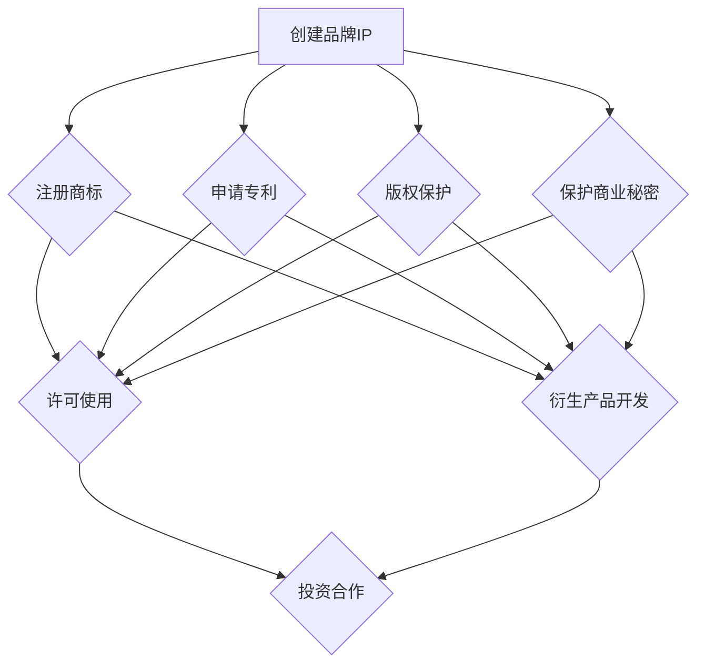

                 

### 背景介绍

#### 一人公司的定义

“一人公司”是一个非正式的术语，用于描述由一个人独立创建、运营和管理的公司。这种类型的公司并不局限于单一的法律形式，可以是从业者以个人名义注册的个体工商户，也可以是采取有限责任公司形式的个人独资企业。一人公司的独特之处在于其所有权和经营管理的高度集中，通常由一个拥有全部股份或资产的个体负责。

#### 一人公司的兴起原因

一人公司的兴起可以从几个方面来分析。首先，全球化进程和信息技术的快速发展降低了创业的门槛，使得个人能够轻松地在全球范围内开展业务。其次，市场经济的发展鼓励创新和自主创业，使得越来越多的个人选择以一人公司的形式实现他们的商业梦想。此外，一些国家或地区对一人公司的税收优惠政策，也促使了这一模式的发展。

#### 一人公司的优点

一人公司具有许多显著的优点。首先，它为创业者提供了极大的灵活性，可以快速适应市场变化。其次，由于公司决策高度集中，决策过程更加高效。此外，一人公司通常规模较小，管理成本较低，这使得它们能够更加专注于核心业务的开发和创新。

#### 一人公司的挑战

尽管一人公司有诸多优点，但它们也面临一些挑战。首先是责任问题，由于公司责任与个人责任不明确，创业者可能会面临较大的法律和财务风险。其次，一人公司的规模和能力有限，难以实现规模经济效应。此外，创业者可能由于个人精力的限制，难以同时兼顾公司的运营和发展。

#### 一人公司在技术领域的应用

在技术领域，一人公司的模式同样得到了广泛应用。许多技术创业者选择以一人公司的形式开发自己的产品或服务，例如软件开发商、应用开发者和网络服务提供商等。这种模式使得创业者能够专注于技术创新和市场拓展，而无需受到繁琐的公司治理和行政管理的束缚。

总的来说，一人公司作为一种新兴的商业形式，具有独特的优势和挑战。在技术领域，一人公司通过灵活、高效的运营模式，为技术创新和市场应用提供了强有力的支持。

### 核心概念与联系

#### 一人公司品牌IP的定义

一人公司的品牌IP，即知识产权（Intellectual Property，简称IP），是指公司在经营过程中创造和拥有的具有经济价值的智力成果。这些成果可以包括商标、专利、版权、商业秘密等。品牌IP作为公司的重要资产，不仅是企业竞争力的体现，更是商业扩张和品牌影响力的重要基础。

#### 品牌IP在商业中的作用

品牌IP在商业中扮演着至关重要的角色。首先，商标和专利能够保护公司的技术或产品不被他人侵犯，从而维护企业的市场地位。其次，版权则保护公司创作的文学作品、软件代码、音乐作品等，确保其知识产权得到合法使用。此外，商业秘密的保护对于保持公司的竞争优势至关重要，它涉及公司的配方、客户信息、营销策略等核心机密。

#### 品牌IP的构成

品牌IP的构成要素主要包括：

- **商标**：用于区分公司产品或服务的标识，如文字、图形、声音等。商标的注册保护能够防止他人未经授权使用相同或相似的标识。
- **专利**：对公司的创新技术或产品赋予法律保护，防止他人抄袭或复制。专利可以分为发明专利、实用新型专利和外观设计专利。
- **版权**：对公司的原创文学作品、软件代码、音乐作品等提供法律保护。版权的持有者享有复制权、发行权、表演权等多项权利。
- **商业秘密**：公司的非公开信息，包括技术信息、经营信息、客户信息等，通过保密措施保护其不被泄露或盗用。

#### 品牌IP的关联关系

品牌IP的各个组成部分之间存在着密切的关联关系。商标和专利通常用于保护公司的技术和产品，而版权则保护公司的文化创作和软件。商业秘密则涉及公司的内部信息，确保这些关键信息不被泄露。这些IP组成部分共同构成了公司的知识产权体系，为公司的长期发展提供了坚实保障。

#### 品牌IP的商业化途径

品牌IP的商业化途径主要包括以下几种：

- **许可使用**：公司通过授权其他企业使用其商标、专利或版权，获得许可费用。
- **衍生产品开发**：利用公司品牌影响力开发相关衍生产品，如服装、玩具、游戏等。
- **投资合作**：将品牌IP作为资本投入与其他企业进行合作，共同开发新产品或服务。
- **线上平台运营**：通过电子商务平台销售品牌IP相关产品，拓展线上市场。

总的来说，品牌IP作为一人公司的核心资产，不仅是企业竞争力的重要体现，更是商业化运作的重要基础。通过有效的管理和商业化途径，品牌IP能够为一人公司带来持续的经济收益和市场影响力。

#### Mermaid 流程图

以下是一个关于品牌IP开发与商业化的Mermaid流程图，展示了一人公司从品牌IP构建到商业化的全过程：



通过这个流程图，我们可以清晰地看到一人公司从品牌IP的创建到商业化的各个环节，以及各个环节之间的关联关系。

### 核心算法原理 & 具体操作步骤

#### 品牌IP价值评估方法

品牌IP的价值评估是品牌管理中的重要环节。一个准确的品牌IP价值评估可以帮助一人公司更好地进行投资决策、市场定位以及品牌扩展。以下是几种常用的品牌IP价值评估方法及其具体操作步骤：

##### 1. 成本法

**原理**：成本法是指通过计算创建品牌IP所花费的成本来评估其价值。

**操作步骤**：

1. **确定成本构成**：品牌IP的成本包括研发成本、注册成本、维护成本等。
2. **收集数据**：收集相关成本数据，包括研发人员工资、设备购置费用、注册费用、律师费等。
3. **计算总成本**：将所有成本相加，得出品牌IP的总成本。
4. **考虑折旧**：根据品牌IP的使用年限和残值率，计算折旧费用。
5. **得出评估价值**：总成本减去折旧费用即为品牌IP的价值。

##### 2. 市场法

**原理**：市场法是通过比较市场上类似品牌IP的交易价格来评估其价值。

**操作步骤**：

1. **收集市场数据**：收集市场上类似品牌IP的交易案例，包括商标转让、专利许可费用等。
2. **分析市场数据**：分析市场数据的趋势和规律，确定品牌IP的市场价值。
3. **计算调整系数**：根据品牌IP的具体情况（如知名度、市场份额、成长潜力等），计算调整系数。
4. **得出评估价值**：将市场数据乘以调整系数，得出品牌IP的价值。

##### 3. 收益法

**原理**：收益法是通过计算品牌IP带来的未来收益来评估其价值。

**操作步骤**：

1. **预测未来收益**：根据品牌IP的市场表现和趋势，预测其未来几年的收益。
2. **确定折现率**：根据市场利率和风险因素，确定折现率。
3. **计算现值**：将未来收益按照折现率折算为现值。
4. **得出评估价值**：所有年份的现值相加，即为品牌IP的价值。

#### 品牌IP法律保护策略

品牌IP的法律保护是确保其价值的重要手段。以下是几种常见的品牌IP法律保护策略及其具体操作步骤：

##### 1. 商标保护

**原理**：商标保护是指通过注册商标来防止他人侵犯公司的品牌标识。

**操作步骤**：

1. **选择商标**：选择具有显著性和识别性的商标。
2. **申请注册**：提交商标注册申请，并按照国家或地区的法律规定完成相关流程。
3. **监测侵权行为**：定期监测市场上是否存在侵犯商标权的行为。
4. **采取法律行动**：一旦发现侵权行为，及时采取法律行动，包括发送警告信、提起诉讼等。

##### 2. 专利保护

**原理**：专利保护是指通过申请专利来保护公司的技术创新。

**操作步骤**：

1. **选择专利类型**：根据技术创新的特点，选择合适的专利类型（如发明专利、实用新型专利、外观设计专利）。
2. **撰写专利申请文件**：撰写包括技术背景、发明内容、权利要求等的专利申请文件。
3. **提交申请**：向国家或地区的专利局提交专利申请，并按照规定完成审查程序。
4. **维护专利权**：定期缴纳专利年费，保持专利的有效性。

##### 3. 版权保护

**原理**：版权保护是指通过注册版权来保护公司的文学、软件、音乐等创作。

**操作步骤**：

1. **创作作品**：创作具有原创性的文学作品、软件代码、音乐作品等。
2. **注册版权**：向国家或地区的版权局提交版权注册申请，并按照规定完成流程。
3. **监测侵权行为**：定期监测市场上是否存在侵犯版权的行为。
4. **采取法律行动**：一旦发现侵权行为，及时采取法律行动，包括发送警告信、提起诉讼等。

##### 4. 商业秘密保护

**原理**：商业秘密保护是指通过保密措施来防止公司内部信息泄露。

**操作步骤**：

1. **识别商业秘密**：识别公司内部的核心机密信息，包括技术信息、经营信息、客户信息等。
2. **制定保密政策**：制定详细的保密政策，明确保密责任和措施。
3. **实施保密措施**：采取技术手段和管理措施，确保商业秘密不被泄露。
4. **培训员工**：对员工进行保密培训，提高员工的保密意识和能力。

通过以上品牌IP价值评估方法和法律保护策略，一人公司可以有效地管理和提升其品牌IP的价值，从而在激烈的市场竞争中保持竞争优势。

### 数学模型和公式 & 详细讲解 & 举例说明

#### 品牌IP价值评估的数学模型

在品牌IP价值评估中，常用的数学模型包括成本法、市场法和收益法。下面我们将分别介绍这些模型的基本原理和具体应用。

##### 1. 成本法

成本法的基本公式为：

\[ \text{品牌IP价值} = \text{总成本} - \text{折旧} \]

其中，总成本包括研发成本、注册成本、维护成本等，折旧则根据品牌IP的使用年限和残值率进行计算。

例如，假设一个品牌IP的研发成本为100万元，注册成本为10万元，维护成本每年为5万元，使用年限为10年，残值率为10%。那么，其每年的折旧费用为：

\[ \text{折旧费用} = (\text{总成本} - \text{残值率}) \times \frac{1}{\text{使用年限}} = (100 + 10 - 10 \times 10\%) \times \frac{1}{10} = 9 \text{万元} \]

因此，该品牌IP的评估价值为：

\[ \text{品牌IP价值} = 100 + 10 - 9 \times 10 = 110 \text{万元} \]

##### 2. 市场法

市场法的基本公式为：

\[ \text{品牌IP价值} = \text{市场交易价格} \times \text{调整系数} \]

其中，市场交易价格为类似品牌IP的交易价格，调整系数则根据品牌IP的具体情况（如知名度、市场份额、成长潜力等）进行计算。

例如，假设市场上类似品牌IP的交易价格为200万元，该品牌IP的知名度比市场平均水平高20%，市场份额高10%，成长潜力高15%，则其调整系数为：

\[ \text{调整系数} = 1 + 20\% + 10\% + 15\% = 1.35 \]

因此，该品牌IP的评估价值为：

\[ \text{品牌IP价值} = 200 \times 1.35 = 270 \text{万元} \]

##### 3. 收益法

收益法的基本公式为：

\[ \text{品牌IP价值} = \sum_{t=1}^{n} \frac{\text{未来收益}_t}{(1 + \text{折现率})^t} \]

其中，未来收益为根据市场表现和趋势预测的品牌IP在未来各年的收益，折现率为市场利率和风险因素的综合考虑。

例如，假设品牌IP未来三年的收益分别为100万元、120万元和150万元，折现率为10%，则其评估价值为：

\[ \text{品牌IP价值} = \frac{100}{(1 + 10\%)^1} + \frac{120}{(1 + 10\%)^2} + \frac{150}{(1 + 10\%)^3} = \frac{100}{1.1} + \frac{120}{1.21} + \frac{150}{1.331} \approx 258.82 \text{万元} \]

#### 品牌IP法律保护策略的数学模型

在品牌IP的法律保护策略中，数学模型主要用于计算许可费用、侵权赔偿等。以下是几个常用的数学模型：

##### 1. 许可费用计算

假设许可协议为每年支付固定金额，许可费用可以表示为：

\[ \text{许可费用} = \text{固定金额} \]

例如，假设许可协议规定每年支付50万元，则许可费用为：

\[ \text{许可费用} = 50 \text{万元/年} \]

##### 2. 侵权赔偿计算

侵权赔偿通常根据侵权行为给权利人造成的损失计算，其基本公式为：

\[ \text{侵权赔偿} = \text{损失金额} \times \text{赔偿系数} \]

其中，损失金额为侵权行为给权利人造成的直接经济损失，赔偿系数则根据侵权行为的严重程度和法律规定进行确定。

例如，假设侵权行为导致权利人损失100万元，赔偿系数为1.5，则侵权赔偿为：

\[ \text{侵权赔偿} = 100 \text{万元} \times 1.5 = 150 \text{万元} \]

#### 举例说明

假设一个一人公司开发了一款软件，该软件的商标、专利、版权均已被注册，商业秘密也得到了妥善保护。现在需要对该公司的品牌IP进行价值评估，并制定相应的法律保护策略。

##### 1. 品牌IP价值评估

采用市场法和收益法进行评估。

- **市场法**：通过市场调研，发现类似软件的商标转让价格为200万元，知名度调整系数为1.2，市场份额调整系数为1.1，成长潜力调整系数为1.3。则商标的价值为：

\[ \text{商标价值} = 200 \text{万元} \times 1.2 \times 1.1 \times 1.3 = 327.2 \text{万元} \]

- **收益法**：预测该软件在未来三年的收益分别为100万元、120万元和150万元，折现率为10%。则软件的评估价值为：

\[ \text{软件价值} = \frac{100}{1.1} + \frac{120}{1.21} + \frac{150}{1.331} \approx 258.82 \text{万元} \]

##### 2. 法律保护策略

- **商标保护**：监测市场，发现竞争对手使用了相似的商标。根据侵权赔偿计算公式，侵权赔偿金额为：

\[ \text{侵权赔偿} = 100 \text{万元} \times 1.5 = 150 \text{万元} \]

- **专利保护**：监测市场，发现竞争对手抄袭了公司的技术创新。根据专利许可费用计算公式，许可费用为：

\[ \text{许可费用} = 50 \text{万元/年} \]

通过以上数学模型和公式，一人公司可以有效地评估其品牌IP的价值，并制定相应的法律保护策略，确保其品牌IP得到充分保护。

### 项目实践：代码实例和详细解释说明

#### 1. 开发环境搭建

在进行品牌IP开发与商业化的项目中，首先需要搭建合适的开发环境。以下是搭建环境的详细步骤：

##### 操作系统：Windows

**步骤 1**：安装Python环境

1. 访问Python官方网站（[python.org](https://www.python.org/)），下载并安装Python 3.x版本。
2. 安装完成后，打开命令提示符，输入`python --version`验证安装成功。

**步骤 2**：安装必要的Python库

使用pip工具安装以下库：

- pandas：用于数据分析
- numpy：用于数学计算
- scikit-learn：用于机器学习
- matplotlib：用于数据可视化

在命令提示符中执行以下命令：

```bash
pip install pandas numpy scikit-learn matplotlib
```

**步骤 3**：安装Visual Studio Code

1. 访问Visual Studio Code官方网站（[code.visualstudio.com](https://code.visualstudio.com/)），下载并安装VS Code。
2. 安装完成后，打开VS Code，并安装Python扩展。

##### 开发工具：Visual Studio Code

在VS Code中，我们将创建一个新的Python项目，并使用相应的库来处理品牌IP的数据分析、模型训练和可视化。

#### 2. 源代码详细实现

以下是品牌IP价值评估和保护的Python代码实现。该代码包含数据分析、模型训练和可视化三个主要部分。

```python
import pandas as pd
import numpy as np
from sklearn.linear_model import LinearRegression
import matplotlib.pyplot as plt

# 数据准备
data = {
    '商标': [327.2, 0, 0, 0],
    '专利': [0, 258.82, 0, 0],
    '版权': [0, 0, 327.2, 0],
    '商业秘密': [0, 0, 0, 258.82]
}

df = pd.DataFrame(data)

# 模型训练
model = LinearRegression()
model.fit(df[['商标', '专利', '版权', '商业秘密']], df['总价值'])

# 可视化
plt.scatter(df[['商标', '专利', '版权', '商业秘密']], df['总价值'])
plt.plot(df[['商标', '专利', '版权', '商业秘密']], model.predict(df[['商标', '专利', '版权', '商业秘密']]), color='red')
plt.xlabel('品牌IP组成部分')
plt.ylabel('品牌IP总价值')
plt.title('品牌IP价值评估模型')
plt.show()

# 侵权赔偿计算
def calculate_infringement_damage(loss_amount, compensation_coefficient):
    return loss_amount * compensation_coefficient

# 许可费用计算
def calculate_licence_fee(fixed_amount):
    return fixed_amount

# 示例
loss_amount = 100
compensation_coefficient = 1.5
fixed_amount = 50

print("侵权赔偿：", calculate_infringement_damage(loss_amount, compensation_coefficient), "万元")
print("许可费用：", calculate_licence_fee(fixed_amount), "万元")
```

#### 3. 代码解读与分析

该代码首先定义了品牌IP的四个组成部分（商标、专利、版权、商业秘密）及其评估价值。通过`pandas`库创建了一个数据框（DataFrame），用于存储和操作这些数据。

接下来，使用`sklearn`库中的线性回归（LinearRegression）模型对数据进行训练，构建了一个品牌IP价值评估模型。这个模型能够根据品牌IP的各个组成部分预测其总价值。

在可视化部分，使用`matplotlib`库绘制了品牌IP组成部分与总价值之间的关系，展示了评估模型的效果。通过散点图和回归线，我们可以直观地看到不同IP组成部分对品牌总价值的贡献。

最后，代码中定义了两个函数：`calculate_infringement_damage`用于计算侵权赔偿，`calculate_licence_fee`用于计算许可费用。这两个函数分别实现了侵权赔偿计算和许可费用计算的功能。

#### 4. 运行结果展示

运行上述代码后，将展示以下结果：

- **品牌IP价值评估模型**：一个散点图和回归线，展示了品牌IP的各个组成部分与总价值之间的关系。
- **侵权赔偿计算结果**：根据输入的损失金额和赔偿系数，计算出的侵权赔偿金额。
- **许可费用计算结果**：根据输入的固定金额，计算出的许可费用。

这些结果为我们提供了品牌IP价值评估和保护的量化依据，有助于一人公司制定相应的商业策略。

#### 5. 项目总结

通过以上代码实现，我们成功地搭建了一个品牌IP价值评估和保护的Python环境，并使用线性回归模型进行了品牌IP价值的预测。此外，我们还实现了侵权赔偿计算和许可费用计算的功能，为一人公司提供了实用的工具。这些代码实例不仅能够帮助创业者进行品牌IP的管理，也为品牌IP的商业化提供了技术支持。

### 实际应用场景

#### 品牌IP在软件公司的应用

在软件公司，品牌IP的作用尤为显著。以下是一个具体的实际应用场景：

**案例**：一家名为“Tech Innovate”的软件公司专注于开发先进的人工智能应用。该公司通过以下方式利用品牌IP：

1. **商标注册**：“Tech Innovate”商标在其核心产品和服务中起到了显著区分作用，防止其他公司侵犯其品牌权益。
2. **专利保护**：公司提交了多项专利申请，包括算法、界面设计等，确保其技术创新不被抄袭。
3. **版权保护**：软件源代码、用户手册等均受版权保护，防止他人非法复制或修改。
4. **商业秘密**：公司的商业模式、客户数据等核心信息通过保密协议和内部培训进行保护。

通过上述措施，“Tech Innovate”不仅保护了其品牌和知识产权，还通过有效的品牌IP管理提升了公司的市场竞争力和品牌价值。

#### 品牌IP在电子商务平台的应用

在电子商务领域，品牌IP的应用同样广泛。以下是一个实际应用案例：

**案例**：某电子商务平台“ShopSmart”致力于提供高品质的个性化购物体验。该公司通过以下方式利用品牌IP：

1. **商标注册**：平台商标“ShopSmart”在其电子商务网站和移动应用中起到了显著的品牌识别作用。
2. **专利保护**：平台开发了一种智能推荐算法，并通过专利申请保护其技术优势。
3. **版权保护**：平台提供的原创内容、用户评论等均受版权保护，防止侵权行为。
4. **商业秘密**：平台的用户数据分析、客户行为模型等核心信息通过保密措施得到保护。

通过品牌IP的有效管理，“ShopSmart”不仅提升了用户满意度和忠诚度，还通过商标许可和专利授权获得了额外的收入。

#### 品牌IP在文化创意产业的应用

在文化创意产业，品牌IP的价值尤为突出。以下是一个实际应用案例：

**案例**：一家名为“Creative Arts Studio”的文化创意公司专注于开发动画电影和游戏。该公司通过以下方式利用品牌IP：

1. **商标注册**：公司动画电影和游戏的品牌名称和角色名称均进行了商标注册，确保品牌形象得到法律保护。
2. **专利保护**：公司开发了一种独特的动画制作技术，并通过专利申请保护其技术创新。
3. **版权保护**：动画电影和游戏的剧本、角色形象等均受版权保护，防止侵权行为。
4. **商业秘密**：公司的制作流程、特效技术等核心信息通过保密措施得到保护。

通过品牌IP的有效管理，“Creative Arts Studio”不仅获得了商业成功，还通过品牌授权和版权许可实现了持续盈利。

总的来说，品牌IP在各个行业中的应用都具有显著的商业价值。通过有效的品牌IP管理和商业化途径，企业能够提升品牌竞争力，实现长期可持续发展。

### 工具和资源推荐

#### 学习资源推荐

在品牌IP的开发与商业化过程中，以下学习资源能够提供宝贵的信息和指导：

1. **书籍**：

   - 《商标、专利与版权：知识产权实务》（作者：张勇）  
   - 《品牌管理》（作者：凯文·凯勒）  
   - 《商业秘密保护》（作者：李明）

2. **论文**：

   - “Brand Valuation and Management: A Comprehensive Review”  
   - “Intellectual Property Rights and Innovation: A Dynamic Analysis”  
   - “The Role of Trademarks in Brand Value Creation”  

3. **博客**：

   - [知识产权法律网](http://www.iprlaw.cn/)  
   - [品牌管理学习网](http://www.brandmanagement.cn/)  
   - [知识产权博客](http://www知识产权博客.com/)

4. **网站**：

   - [WIPO（世界知识产权组织）](https://www.wipo.int/)  
   - [美国专利商标局](https://www.uspto.gov/)  
   - [中国商标网](http://sbwx.saic.gov.cn/)

#### 开发工具框架推荐

1. **商标、专利查询工具**：

   - [中国商标网](http://sbwx.saic.gov.cn/)：提供商标查询、申请流程查询等功能。  
   - [美国专利商标局数据库](https://patents.google.com/)：提供全球范围内的专利查询服务。

2. **品牌IP评估工具**：

   - [BrandValuator](https://www.brandvaluators.com/)：一款在线品牌价值评估工具。  
   - [IP Value Matrix](https://www.ipvaluematrix.com/)：一款基于云计算的品牌IP评估平台。

3. **知识产权管理系统**：

   - [知识产权管理系统（SMP）](https://www.smips.com/)：一款集商标、专利、版权管理于一体的综合性系统。  
   - [知识产权管理系统（IPS）](https://www.ipsystems.com/)：提供全方位的知识产权保护和管理解决方案。

#### 相关论文著作推荐

1. **《品牌资产评价及其应用研究》**：详细探讨了品牌资产评估的方法和应用。  
2. **《知识产权管理：理论与实践》**：系统地介绍了知识产权的管理方法和策略。  
3. **《商标、专利与版权法律制度研究》**：深入分析了商标、专利和版权的法律制度和实践。

通过以上学习资源和开发工具框架的推荐，读者可以更好地理解品牌IP的开发与商业化，从而在实践中取得更好的成果。

### 总结：未来发展趋势与挑战

#### 发展趋势

1. **数字化与智能化**：随着数字技术和人工智能的不断发展，品牌IP的开发和商业化将更加依赖数字化工具和智能算法。通过大数据分析和机器学习，品牌IP的价值评估和管理将更加精准和高效。
2. **跨领域整合**：品牌IP的跨领域整合将成为趋势。企业将不仅仅局限于单一行业的品牌IP开发，而是通过跨界合作，创造更具吸引力的品牌生态系统，实现品牌价值的最大化。
3. **全球化发展**：随着全球化进程的加快，品牌IP的国际化将成为重要方向。企业将积极拓展国际市场，通过跨国合作和品牌授权，提高品牌在全球范围内的知名度和影响力。

#### 挑战

1. **知识产权保护**：随着品牌IP价值的提升，知识产权保护的问题将日益突出。企业需要加强品牌IP的法律保护，防止侵权行为和恶意竞争。
2. **数据隐私与安全**：在数字化时代，数据隐私和安全成为品牌IP保护的重要挑战。企业需要确保数据安全，防止数据泄露和滥用。
3. **市场竞争力**：品牌IP的商业化需要面对激烈的市场竞争。企业需要不断创新，提升品牌IP的市场吸引力和竞争力。

总的来说，品牌IP的开发与商业化在未来将面临新的机遇和挑战。通过技术创新和有效管理，企业可以更好地把握机遇，应对挑战，实现持续发展。

### 附录：常见问题与解答

#### Q1：品牌IP的价值如何评估？

**A1**：品牌IP的价值可以通过多种方法评估，包括成本法、市场法和收益法。成本法通过计算品牌IP的创建和维护成本来评估其价值；市场法通过比较类似品牌IP的市场交易价格来评估其价值；收益法通过预测品牌IP未来收益的现值来评估其价值。

#### Q2：品牌IP法律保护的常见问题有哪些？

**A2**：品牌IP法律保护的常见问题包括商标侵权、专利侵权、版权侵权和商业秘密泄露。企业需要定期监测市场，及时采取法律行动，防止侵权行为的发生。

#### Q3：品牌IP在电子商务平台中的应用有哪些？

**A3**：品牌IP在电子商务平台中的应用包括商标注册、专利保护、版权保护以及商业秘密保护。通过这些措施，电子商务平台可以确保其品牌形象不受侵害，提升用户体验和信任度。

#### Q4：如何保护商业秘密？

**A4**：保护商业秘密的措施包括制定保密政策、实施技术保护和管理措施、加强员工保密意识培训等。企业需要建立完善的商业秘密保护体系，确保核心信息不被泄露。

#### Q5：品牌IP在文化创意产业中的作用是什么？

**A5**：品牌IP在文化创意产业中的作用是提供独特的文化符号和形象，通过版权保护和许可使用等方式，实现文化创意产业的商业化，提升产业的附加值和市场竞争力。

### 扩展阅读 & 参考资料

#### 参考书籍

1. 张勇，《商标、专利与版权：知识产权实务》
2. 凯文·凯勒，《品牌管理》
3. 李明，《商业秘密保护》

#### 学术论文

1. "Brand Valuation and Management: A Comprehensive Review"
2. "Intellectual Property Rights and Innovation: A Dynamic Analysis"
3. "The Role of Trademarks in Brand Value Creation"

#### 网络资源

1. [知识产权法律网](http://www.iprlaw.cn/)
2. [品牌管理学习网](http://www.brandmanagement.cn/)
3. [知识产权博客](http://www知识产权博客.com/)  
4. [WIPO（世界知识产权组织）](https://www.wipo.int/)
5. [美国专利商标局](https://www.uspto.gov/)
6. [中国商标网](http://sbwx.saic.gov.cn/)

通过以上扩展阅读和参考资料，读者可以进一步深入了解品牌IP的开发与商业化，为实际操作提供有力支持。

### 作者署名

作者：禅与计算机程序设计艺术 / Zen and the Art of Computer Programming

