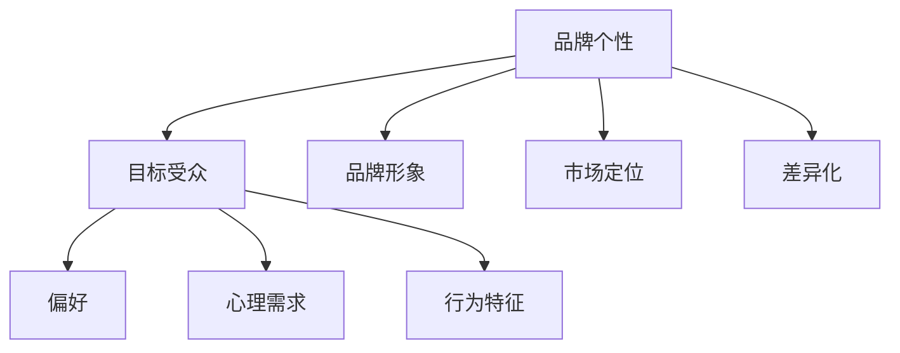

                 

### 1. 背景介绍

在现代商业环境中，品牌个性越来越受到企业的关注。品牌个性不仅帮助企业塑造独特的市场形象，还能与目标受众建立深层次的共鸣。对于单个创业者或小型公司来说，品牌个性的塑造更是至关重要，因为这直接关系到品牌的市场认可度和忠诚度。

品牌个性是指品牌在消费者心目中形成的独特形象和感知，它包括品牌的声音、外观、情感特质等。一个鲜明的品牌个性可以帮助企业在竞争激烈的市场中脱颖而出，吸引目标客户的注意。对于“一人公司”来说，即只有一位创始人的公司，品牌个性的塑造显得尤为关键。因为在这种情况下，公司的形象和声音往往直接关联到创始人个人，品牌个性的建立对公司的成长和发展具有重要影响。

本文将深入探讨品牌个性在“一人公司”中的重要性，分析如何通过品牌个性和目标受众建立共鸣。文章将从以下几个方面展开：

1. **品牌个性概念与重要性**：介绍品牌个性的定义和其在商业中的重要性，包括如何塑造和维护品牌个性。
2. **品牌个性和目标受众的联系**：讨论品牌个性如何与目标受众建立联系，并分析目标受众的心理和行为。
3. **品牌个性和市场策略**：阐述品牌个性在市场策略中的角色，包括如何通过品牌个性实现市场定位和差异化。
4. **品牌个性和用户体验**：探讨品牌个性如何影响用户体验，并给出具体实践案例。
5. **品牌个性和社交媒体互动**：分析品牌个性在社交媒体中的表现，以及如何通过社交媒体与目标受众建立深层次的互动。
6. **成功案例分析**：分享一些成功的一人公司品牌个性和市场策略的案例，分析其成功的原因。
7. **未来趋势与挑战**：展望品牌个性在未来的发展趋势和面临的挑战。

通过以上内容的逐步分析，我们将深入理解品牌个性在“一人公司”中的重要性，为读者提供切实可行的品牌个性塑造和策略建议。让我们首先定义品牌个性的概念，并探讨它在商业环境中的核心作用。

### 2. 核心概念与联系

#### 品牌个性的定义

品牌个性是指品牌在消费者心中形成的独特形象和感知，它不仅仅是一个名称、标志或口号，更是品牌在消费者心智中占据的一个位置。品牌个性可以包含一系列特质，如诚实、创新、专业、亲切等，这些特质通过品牌的市场表现、广告语、产品和服务等多个方面传递给消费者。

品牌个性的重要性在于它能够帮助企业在竞争激烈的市场中建立独特的市场地位。一个具有鲜明个性的品牌，更容易在消费者的心中留下深刻的印象，从而增加品牌忠诚度和市场竞争力。品牌个性还能够帮助企业实现市场定位和差异化，使品牌在众多竞争者中脱颖而出。

#### 品牌个性与目标受众的联系

品牌个性与目标受众之间有着密切的联系。目标受众是品牌希望影响和吸引的群体，他们的需求和喜好决定了品牌需要具备的个性特质。例如，一个专注于年轻群体的品牌，可能需要具备创新、时尚和活力等特质，以吸引年轻人的注意。

品牌个性与目标受众之间的联系可以从以下几个方面来理解：

1. **目标受众的偏好**：品牌个性应该与目标受众的偏好相匹配。了解目标受众的喜好、价值观和生活态度，可以帮助品牌设计出符合他们期望的个性特质。
2. **目标受众的心理需求**：品牌个性应该能够满足目标受众的心理需求。例如，一个专注于健康生活的品牌，可以通过传达健康、环保、负责任等特质，满足目标受众对健康和环保的追求。
3. **目标受众的行为特征**：品牌个性应该能够影响目标受众的行为。例如，一个具有科技感的品牌，可以通过展示其创新和技术领先的优势，激发目标受众的购买欲望。

为了更好地理解品牌个性与目标受众之间的联系，我们可以通过一个简单的 Mermaid 流程图来展示它们之间的相互作用：



在这个流程图中，品牌个性通过影响品牌形象、市场定位和差异化，与目标受众的偏好、心理需求和行为特征建立联系。

#### 品牌个性的构成要素

品牌个性并不是一成不变的，它由多个要素构成，包括但不限于以下几个方面：

1. **视觉元素**：包括品牌标志、色彩、字体等，这些视觉元素是品牌个性最直观的体现。
2. **声音元素**：包括广告语、音乐等，声音元素可以传达品牌的情感特质和价值观。
3. **行为元素**：包括品牌的市场活动、公关事件等，行为元素可以展示品牌的行动力和执行力。
4. **文化元素**：包括品牌的历史、背景等，文化元素可以加深品牌与目标受众的情感联系。

通过这些要素的综合运用，品牌个性得以在目标受众心中形成独特的形象和感知。

#### 品牌个性在商业环境中的核心作用

品牌个性在商业环境中具有核心作用，主要体现在以下几个方面：

1. **提升品牌知名度**：一个具有鲜明个性的品牌，更容易在消费者心中留下深刻印象，从而提高品牌知名度。
2. **增强品牌忠诚度**：品牌个性可以帮助消费者建立对品牌的情感联系，从而增加品牌忠诚度。
3. **实现市场定位**：品牌个性可以帮助企业在市场中找到独特的定位，避免与竞争者直接竞争。
4. **实现差异化**：品牌个性可以使品牌在众多竞争者中脱颖而出，实现差异化。

通过以上分析，我们可以看到品牌个性在“一人公司”中的重要性。一个成功的“一人公司”需要具备鲜明的品牌个性，以便与目标受众建立深层次的共鸣，从而在激烈的市场竞争中脱颖而出。接下来，我们将进一步探讨如何塑造和维护品牌个性。

### 3. 核心算法原理 & 具体操作步骤

在了解品牌个性和其重要性后，接下来我们将探讨如何通过具体的方法和步骤来塑造和维护品牌个性。这一部分的核心算法原理可以概括为以下几个步骤：

#### 步骤 1：定义目标受众

定义目标受众是塑造品牌个性的第一步。我们需要明确品牌希望影响和吸引的群体，包括他们的年龄、性别、职业、兴趣爱好、价值观等。通过深入了解目标受众的特点和需求，我们可以更有针对性地设计品牌个性。

具体操作步骤如下：

1. **市场调研**：通过问卷调查、用户访谈、市场分析等方式，收集目标受众的相关信息。
2. **数据分析**：对收集到的数据进行整理和分析，提取出目标受众的主要特征和需求。
3. **用户画像**：基于分析结果，创建用户画像，为后续的品牌个性设计提供依据。

#### 步骤 2：挖掘品牌特质

在明确目标受众后，我们需要挖掘品牌的特质，这些特质应该与目标受众的需求和喜好相匹配。品牌特质包括但不限于以下几个方面：

1. **视觉元素**：设计一个独特的品牌标志、色彩和字体，使其与目标受众的审美观念相符。
2. **声音元素**：确定品牌的广告语、音乐等，使其能够传达品牌的价值观和情感特质。
3. **行为元素**：通过品牌的市场活动、公关事件等，展示品牌的行动力和执行力。
4. **文化元素**：挖掘品牌的历史、背景等，使其能够与目标受众建立情感联系。

具体操作步骤如下：

1. **市场调研**：通过对目标受众的喜好和需求进行调研，找出品牌可以借鉴的元素。
2. **创意设计**：结合调研结果，进行品牌的视觉、声音和行为元素设计。
3. **文化提炼**：从品牌的历史和文化中提取具有代表性的元素，丰富品牌内涵。

#### 步骤 3：一致性维护

品牌个性的一致性维护是确保品牌形象稳定和可信的重要环节。我们需要确保品牌在各个触点上传递一致的品牌个性。

具体操作步骤如下：

1. **品牌手册**：制定品牌手册，明确品牌的视觉、声音和行为标准，为品牌管理提供依据。
2. **员工培训**：对品牌相关员工进行培训，确保他们在工作中能够一致地传达品牌个性。
3. **监督机制**：建立监督机制，定期检查品牌在不同触点上的表现，确保品牌个性的一致性。

#### 步骤 4：互动与反馈

与目标受众的互动和反馈是品牌个性塑造和维护的重要环节。我们需要通过多种方式与目标受众互动，了解他们的反馈，并根据反馈进行调整。

具体操作步骤如下：

1. **社交媒体互动**：通过社交媒体平台与目标受众进行互动，了解他们的需求和反馈。
2. **用户调研**：定期进行用户调研，收集用户对品牌的反馈。
3. **持续优化**：根据用户反馈，对品牌个性进行持续优化，确保品牌与目标受众的共鸣。

通过以上四个步骤，我们可以系统地塑造和维护品牌个性。这一核心算法原理不仅适用于“一人公司”，也适用于任何规模的企业。接下来，我们将通过具体的数学模型和公式，进一步探讨品牌个性塑造和优化的量化方法。

### 4. 数学模型和公式 & 详细讲解 & 举例说明

在品牌个性塑造的过程中，量化方法可以帮助我们更科学地理解和优化品牌个性。以下是一个简化的数学模型，用于衡量品牌个性和目标受众的匹配度，以及如何通过调整品牌特质来优化这一匹配度。

#### 品牌个性匹配度模型

我们假设品牌个性由四个主要维度构成：视觉元素（V）、声音元素（S）、行为元素（A）和文化元素（C）。每个维度都可以进一步细分为多个子特质，例如视觉元素可以包括颜色、字体等。我们使用四个向量分别表示品牌个性维度和目标受众偏好：

- 品牌个性向量 \(P = [V, S, A, C]\)
- 目标受众偏好向量 \(U = [V', S', A', C']\)

#### 品牌个性匹配度计算公式

为了计算品牌个性与目标受众的匹配度，我们可以使用以下公式：

\[ M(P, U) = \frac{\sum_{i=1}^{4} w_i \cdot d_i}{\sqrt{\sum_{i=1}^{4} w_i^2} \cdot \sqrt{\sum_{i=1}^{4} w_i'^2}} \]

其中，\(w_i\) 和 \(w_i'\) 分别表示品牌个性维度和目标受众偏好维度的权重，\(d_i\) 表示两个维度之间的相似度。相似度可以通过以下公式计算：

\[ d_i = \frac{P_i - U_i}{\max(P_i, U_i) - \min(P_i, U_i)} \]

这个公式将相似度范围从 \([-1, 1]\) 调整到 \([0, 1]\)，其中 1 表示完全匹配，-1 表示完全不匹配，0 表示无匹配。

#### 权重分配

权重 \(w_i\) 的分配取决于品牌策略和目标受众分析的结果。例如，如果品牌的主要目标是吸引年轻消费者，那么视觉元素（V）的权重可能会更高。权重可以通过专家评估、用户调研等方法确定。

#### 案例说明

假设我们有一个品牌，其品牌个性向量 \(P = [0.8, 0.6, 0.7, 0.9]\)，目标受众偏好向量 \(U = [0.6, 0.5, 0.7, 0.8]\)。

1. **计算相似度**：

\[ d_V = \frac{0.8 - 0.6}{1 - 0} = 0.2 \]
\[ d_S = \frac{0.6 - 0.5}{1 - 0} = 0.1 \]
\[ d_A = \frac{0.7 - 0.7}{1 - 0} = 0 \]
\[ d_C = \frac{0.9 - 0.8}{1 - 0} = 0.1 \]

2. **计算权重**：

假设我们确定视觉元素（V）的权重 \(w_V = 0.4\)，声音元素（S）的权重 \(w_S = 0.3\)，行为元素（A）的权重 \(w_A = 0.2\)，文化元素（C）的权重 \(w_C = 0.1\)。

\[ w = [0.4, 0.3, 0.2, 0.1] \]
\[ w' = [0.3, 0.2, 0.2, 0.3] \]

3. **计算匹配度**：

\[ M(P, U) = \frac{0.4 \cdot 0.2 + 0.3 \cdot 0.1 + 0.2 \cdot 0 + 0.1 \cdot 0.1}{\sqrt{0.4^2 + 0.3^2 + 0.2^2 + 0.1^2} \cdot \sqrt{0.3^2 + 0.2^2 + 0.2^2 + 0.3^2}} \]
\[ M(P, U) = \frac{0.08 + 0.03 + 0 + 0.01}{\sqrt{0.29} \cdot \sqrt{0.28}} \]
\[ M(P, U) = \frac{0.12}{0.29 \cdot 0.53} \]
\[ M(P, U) \approx 0.27 \]

因此，品牌个性与目标受众的匹配度约为 27%，表明品牌个性在视觉元素和声音元素方面与目标受众较为匹配，但在行为元素和文化元素方面还有改进空间。

#### 调整品牌个性

根据匹配度结果，我们可以调整品牌个性，以优化与目标受众的匹配度。例如，如果行为元素（A）的匹配度较低，我们可以增加品牌的市场活动，以提升目标受众对品牌行为的感知。以下是一个简化的调整步骤：

1. **识别问题领域**：通过匹配度分析，识别品牌个性中与目标受众匹配度较低的问题领域。
2. **制定改进策略**：针对识别的问题领域，制定具体的改进策略，如调整视觉元素、声音元素或行为元素。
3. **实施与监控**：执行改进策略，并持续监控其效果，根据反馈进行调整。

通过以上数学模型和公式，我们可以系统地衡量品牌个性与目标受众的匹配度，并制定相应的优化策略。这一方法不仅有助于“一人公司”塑造和维护品牌个性，也适用于其他规模的企业。接下来，我们将通过一个具体的项目实践案例，进一步展示这些概念和方法的实际应用。

### 5. 项目实践：代码实例和详细解释说明

在本节中，我们将通过一个具体的案例来展示如何将品牌个性塑造的理论应用到实际项目中。我们将搭建一个简单的品牌网站，并详细解释其中的代码实现和设计思路。

#### 5.1 开发环境搭建

首先，我们需要搭建一个适合前端开发的开发环境。以下是基本步骤：

1. **安装Node.js**：Node.js 是一个基于 Chrome V8 引擎的 JavaScript 运行环境，我们可以在其官网（https://nodejs.org/）下载并安装。
2. **安装前端框架**：我们选择使用 Vue.js 作为前端框架，可以通过以下命令安装：

   ```bash
   npm install -g @vue/cli
   vue create brand-website
   ```

3. **创建项目**：使用 Vue CLI 创建一个新的项目，选择合适的预设（例如 Manually select features）并安装必要的依赖。

   ```bash
   vue create brand-website
   ```

4. **配置项目**：根据项目需求，对项目进行配置和调整，如安装 Vuex 状态管理库、Vue Router 路由库等。

5. **启动开发服务器**：在项目根目录下运行以下命令启动开发服务器：

   ```bash
   npm run serve
   ```

   这将启动一个热重载的本地开发服务器，我们可以通过浏览器访问项目并进行开发。

#### 5.2 源代码详细实现

以下是品牌网站的核心代码实现，我们将分模块进行解释。

##### 5.2.1 项目结构

项目的基本结构如下：

```bash
brand-website/
|-- public/
|   |-- index.html
|-- src/
|   |-- assets/
|   |   |-- images/
|   |   |-- styles/
|   |-- components/
|   |   |-- BrandLogo.vue
|   |   |-- HeroSection.vue
|   |   |-- Footer.vue
|   |-- App.vue
|   |-- main.js
|-- package.json
```

1. **公共资源**：public 目录包含静态资源，如 HTML、CSS 和 JavaScript 文件。
2. **组件**：components 目录包含可复用的 Vue 组件，如品牌标志、英雄部分和页脚等。
3. **主文件**：App.vue 是应用的主组件，main.js 是应用入口文件。

##### 5.2.2 网站布局

网站的布局使用 Vue 组件化设计，以下为关键组件的代码：

**BrandLogo.vue**：

```vue
<template>
  <div class="brand-logo">
    
  </div>
</template>

<script>
export default {
  name: 'BrandLogo',
};
</script>

<style scoped>
.brand-logo {
  display: flex;
  justify-content: center;
  align-items: center;
  height: 60px;
}
.brand-logo img {
  height: 100%;
}
</style>
```

**HeroSection.vue**：

```vue
<template>
  <section class="hero-section">
    <div class="container">
      <h1>Welcome to Our Brand</h1>
      <p>
        Discover the essence of our brand, where innovation meets excellence.
      </p>
      <button>Explore More</button>
    </div>
  </section>
</template>

<script>
export default {
  name: 'HeroSection',
};
</script>

<style scoped>
.hero-section {
  background-color: #f3f3f3;
  padding: 50px 0;
}
.container {
  text-align: center;
}
.hero-section h1 {
  font-size: 2.5rem;
  margin-bottom: 15px;
}
.hero-section p {
  font-size: 1.2rem;
  margin-bottom: 30px;
}
.hero-section button {
  padding: 10px 20px;
  font-size: 1rem;
  background-color: #007bff;
  color: white;
  border: none;
  cursor: pointer;
  transition: background-color 0.3s ease;
}
.hero-section button:hover {
  background-color: #0056b3;
}
</style>
```

**Footer.vue**：

```vue
<template>
  <footer class="footer">
    <div class="container">
      <p>&copy; 2023 Our Brand. All rights reserved.</p>
    </div>
  </footer>
</template>

<script>
export default {
  name: 'Footer',
};
</script>

<style scoped>
.footer {
  background-color: #333;
  color: white;
  padding: 20px 0;
}
.container {
  text-align: center;
}
.footer p {
  margin: 0;
}
</style>
```

##### 5.2.3 应用主组件 App.vue

```vue
<template>
  <div id="app">
    <BrandLogo />
    <HeroSection />
    <Footer />
  </div>
</template>

<script>
import BrandLogo from './components/BrandLogo.vue';
import HeroSection from './components/HeroSection.vue';
import Footer from './components/Footer.vue';

export default {
  name: 'App',
  components: {
    BrandLogo,
    HeroSection,
    Footer
  }
};
</script>

<style>
#app {
  font-family: Avenir, Helvetica, Arial, sans-serif;
  -webkit-font-smoothing: antialiased;
  -moz-osx-font-smoothing: grayscale;
  text-align: center;
  color: #2c3e50;
  margin-top: 60px;
}
</style>
```

##### 5.2.4 主入口文件 main.js

```javascript
import Vue from 'vue';
import App from './App.vue';

Vue.config.productionTip = false;

new Vue({
  render: h => h(App),
}).$mount('#app');
```

#### 5.3 代码解读与分析

在本节中，我们将详细解读上述代码，并分析其设计思路。

1. **品牌标志（BrandLogo）**：
   - **功能**：显示品牌的标志。
   - **代码解读**：通过 Vue 组件显示一个图片元素，该图片是品牌标志。使用 scoped 样式确保样式仅应用于当前组件。
   - **设计思路**：品牌标志是一个品牌的核心元素，通过一个清晰且美观的标志，可以迅速吸引目标受众的注意力。

2. **英雄部分（HeroSection）**：
   - **功能**：展示品牌的核心信息和呼吁行动。
   - **代码解读**：使用 HTML 和 CSS 设计一个居中的英雄部分，包含标题、描述和按钮。通过 Vue 组件实现，确保可复用性和灵活性。
   - **设计思路**：英雄部分是网站中最重要的部分之一，通过一个引人注目的设计，可以迅速传达品牌的核心信息，激发用户采取行动。

3. **页脚（Footer）**：
   - **功能**：展示品牌的版权信息和联系方式。
   - **代码解读**：使用简单的 HTML 和 CSS 实现一个页脚，确保品牌信息在页面底部可见。
   - **设计思路**：页脚是网站的一个重要部分，除了展示品牌信息外，还提供了联系信息，增强了品牌的可信赖度。

4. **应用主组件（App）**：
   - **功能**：组织网站的整体布局。
   - **代码解读**：通过 Vue 组件将品牌标志、英雄部分和页脚组合在一起，确保网站结构清晰。
   - **设计思路**：主组件是网站的核心，通过合理组织各个部分，可以提供一个流畅的用户体验。

#### 5.4 运行结果展示

通过上述代码实现，我们可以得到一个基本的品牌网站布局。以下是运行结果：

- **品牌标志**：显示一个清晰的标志。
- **英雄部分**：展示品牌的核心理念和呼吁行动。
- **页脚**：提供版权信息和联系方式。

运行命令 `npm run serve` 后，在浏览器中访问本地开发服务器（通常为 `http://localhost:8080/`），可以看到以上布局的效果。通过这个简单的案例，我们可以看到如何将品牌个性理念应用到实际开发中，构建一个具有吸引力和一致性的品牌网站。

### 6. 实际应用场景

品牌个性在“一人公司”中的应用场景非常广泛，无论是在线上还是线下，品牌个性都能发挥其独特的优势，帮助公司建立强大的品牌认知度和忠诚度。以下是一些具体的实际应用场景：

#### 线上应用场景

1. **社交媒体营销**：
   - **应用场景**：通过社交媒体平台（如 Facebook、Instagram、Twitter 等）进行品牌推广。
   - **品牌个性应用**：品牌个性可以在社交媒体上通过独特的视觉设计、语音风格和互动方式来展现，与目标受众建立深层次的联系。例如，一个以幽默和创新著称的品牌，可以在社交媒体上发布有趣的短视频、漫画或幽默的文案，吸引用户的注意力。

2. **电子邮件营销**：
   - **应用场景**：通过定期发送电子邮件来与客户保持联系，传递品牌信息。
   - **品牌个性应用**：电子邮件的内容和风格应该与品牌个性一致。例如，一个专业且严谨的品牌，电子邮件的语气应该正式，内容要详尽且准确；而一个轻松幽默的品牌，邮件可以采用更加轻松和有趣的语言。

3. **网站设计**：
   - **应用场景**：品牌网站是品牌形象展示的重要平台。
   - **品牌个性应用**：网站的设计风格、色彩选择、字体设计等都应该体现品牌个性。例如，一个以自然和环保为主题的品牌，可以在网站中使用绿色为主色调，设计简洁而富有生态气息。

#### 线下应用场景

1. **产品包装**：
   - **应用场景**：产品包装是品牌与消费者接触的第一个实体媒介。
   - **品牌个性应用**：产品包装的设计应与品牌个性一致，传达品牌的核心价值和特点。例如，一个注重设计和品质的品牌，包装可以采用高端材料、精致的设计和专业的包装工艺。

2. **线下活动**：
   - **应用场景**：品牌可以通过参加线下活动、展会、讲座等，与目标受众面对面交流。
   - **品牌个性应用**：品牌个性在活动中通过活动的策划、互动环节的设计和活动宣传材料来展现。例如，一个以创新和技术为核心的科技品牌，可以在活动中展示最新的科技成果，组织互动体验和研讨会。

3. **客户服务**：
   - **应用场景**：品牌个性在客户服务中的体现可以帮助提升客户的满意度和忠诚度。
   - **品牌个性应用**：客户服务的态度、响应速度和解决方案都应该符合品牌个性。例如，一个以快速响应和贴心服务著称的品牌，客户服务人员应该具备快速解决问题的能力，并始终保持友好和专业的态度。

通过以上实际应用场景，我们可以看到品牌个性在“一人公司”中的重要性。无论在线上还是线下，品牌个性都是品牌与目标受众建立共鸣的关键因素。一个成功的品牌个性可以帮助“一人公司”在激烈的市场竞争中脱颖而出，赢得客户的信任和忠诚。

### 7. 工具和资源推荐

#### 7.1 学习资源推荐

1. **书籍推荐**：
   - 《品牌个性的塑造与维护》：这本书详细介绍了品牌个性的概念、重要性以及如何在实际操作中应用。
   - 《品牌个性与消费者行为》：本书探讨了品牌个性如何影响消费者的购买行为，提供了丰富的案例和实证研究。

2. **论文推荐**：
   - "Branding in the Digital Age"：这篇论文分析了数字时代品牌个性的演变，探讨了如何在网络环境中有效塑造品牌个性。
   - "Brand Personality and Consumer Loyalty"：本文研究了品牌个性与消费者忠诚度之间的关系，提供了有价值的理论分析和实证数据。

3. **博客推荐**：
   - "Brand Building Blog"：这是一个专注于品牌建设的博客，涵盖了品牌策略、品牌设计、市场营销等方面的内容。
   - "The Marketing Slack"：该博客提供了关于品牌建设的深入见解和实用技巧，适合市场营销从业者阅读。

4. **网站推荐**：
   - " brandingexperts.com"：这是一个专业的品牌咨询网站，提供了丰富的品牌建设资源和案例研究。
   - "brandingbrandingbranding.com"：该网站提供了关于品牌设计、品牌策略和品牌传播的详细指导。

#### 7.2 开发工具框架推荐

1. **前端框架**：
   - **Vue.js**：一个渐进式的前端框架，易于上手，支持组件化开发，非常适合构建品牌网站。
   - **React**：一个用于构建用户界面的JavaScript库，具有高性能和灵活性，适用于复杂的品牌项目。

2. **UI设计工具**：
   - **Sketch**：一款流行的UI设计工具，支持矢量图形和原型设计，适用于品牌视觉设计。
   - **Adobe XD**：一款全功能的用户体验设计工具，支持交互设计、原型制作和协作。

3. **营销工具**：
   - **HubSpot**：一款综合性的营销自动化平台，提供网站分析、内容管理、营销自动化等功能。
   - **Mailchimp**：一款流行的电子邮件营销工具，支持自动化邮件发送、用户细分和数据分析。

#### 7.3 相关论文著作推荐

1. "Branding and Brand Management" by Keller, Kevin Lane：这是一本经典的品牌管理教材，详细介绍了品牌建设和管理的基本理论和实践方法。
2. "Brand Building on the Internet" by Fisk, R. Paul, and P. B. Philip：本文分析了互联网环境下的品牌建设策略，探讨了品牌个性在网络营销中的重要性。
3. "The Role of Brand Personality in Consumer Behavior" by Aaker, David A.：这篇文章深入研究了品牌个性对消费者行为的影响，提供了丰富的实证数据和分析。

通过这些资源和工具的推荐，我们可以更好地理解和应用品牌个性的概念，为“一人公司”的品牌建设提供有力支持。

### 8. 总结：未来发展趋势与挑战

在品牌个性塑造的过程中，我们不仅看到了其对企业市场竞争力的提升，也感受到了其对于企业与目标受众之间建立共鸣的深远影响。然而，随着市场的不断变化和技术的迅猛发展，品牌个性也面临着新的发展趋势和挑战。

#### 未来发展趋势

1. **个性化与定制化**：随着消费者需求的多样化和个性化，品牌个性将更加注重满足不同细分市场的需求。定制化将成为品牌个性塑造的一个重要趋势，企业需要通过大数据和人工智能技术，深入分析消费者行为和偏好，提供更加个性化的产品和服务。

2. **数字化与互动性**：数字化技术将进一步增强品牌个性与目标受众之间的互动。通过社交媒体、虚拟现实（VR）和增强现实（AR）等技术，品牌可以创造更加沉浸式的用户体验，与消费者建立更加紧密的联系。

3. **跨渠道整合**：品牌个性将不再局限于单一渠道，而是实现线上与线下、传统媒体与数字媒体的整合。这种跨渠道的整合将使得品牌个性更加全面、立体，从而提高品牌的影响力和认知度。

#### 挑战

1. **市场竞争加剧**：随着市场竞争的加剧，品牌个性将面临更大的挑战。如何在众多竞争者中脱颖而出，建立独特的品牌个性，将是企业需要持续关注的问题。

2. **数据隐私与安全**：在数字化时代，企业需要收集和分析大量消费者数据来塑造品牌个性。然而，这也带来了数据隐私和安全方面的挑战。企业需要在保护消费者隐私的同时，合理利用数据来提升品牌个性。

3. **文化差异**：在全球化的背景下，品牌个性需要考虑不同文化背景下的消费者需求。文化差异可能会影响品牌个性和目标受众之间的共鸣，企业需要具备跨文化沟通能力，以确保品牌个性在不同市场都能得到有效的传递。

#### 应对策略

1. **持续创新**：企业应保持持续创新的精神，不断探索新的品牌个性塑造方法和技术。通过创新，企业可以始终保持市场竞争力，并不断吸引和满足消费者的需求。

2. **数据驱动**：企业应加强数据分析和挖掘能力，通过数据驱动的方式，深入理解消费者行为和偏好，从而更精准地塑造品牌个性。

3. **跨文化沟通**：企业应注重跨文化沟通能力的培养，了解不同市场的文化特点和消费者需求，确保品牌个性在不同文化背景下都能得到有效传递。

总之，品牌个性在未来的发展中将面临新的机遇和挑战。企业需要通过持续创新、数据驱动和跨文化沟通，不断提升品牌个性塑造的能力，与目标受众建立更加紧密的联系。只有这样，企业才能在激烈的市场竞争中脱颖而出，赢得消费者的信任和忠诚。

### 9. 附录：常见问题与解答

在品牌个性塑造的过程中，许多企业和创业者可能会遇到一些常见的问题。以下是一些常见问题及其解答：

**Q1：如何定义品牌个性？**
A1：品牌个性的定义是一个品牌在消费者心目中形成的独特形象和感知。这包括品牌的声音、外观、情感特质等。定义品牌个性可以通过以下步骤：
1. **市场调研**：了解目标受众的偏好、需求和价值观。
2. **品牌特质挖掘**：从品牌的历史、文化、产品特点等方面挖掘能够体现品牌特色的元素。
3. **专家评估**：邀请品牌专家对品牌个性进行评估，确保其符合市场预期。

**Q2：品牌个性与目标受众的匹配度如何衡量？**
A2：品牌个性与目标受众的匹配度可以通过以下方法衡量：
1. **相似度计算**：使用数学模型计算品牌个性与目标受众偏好之间的相似度。
2. **用户反馈**：通过用户调研收集用户对品牌个性的反馈，评估其与目标受众的匹配度。
3. **市场表现**：观察品牌个性在市场中的表现，如品牌知名度、市场份额等，判断其与目标受众的匹配程度。

**Q3：品牌个性在数字化营销中如何体现？**
A3：品牌个性在数字化营销中可以通过以下几个方面体现：
1. **社交媒体**：通过社交媒体平台（如微博、微信、Instagram等）展现品牌个性和与用户的互动。
2. **内容营销**：通过品牌官网、博客、视频等渠道，传递品牌价值观和情感特质。
3. **用户体验**：在数字化产品和服务中，通过界面设计、交互方式等体现品牌个性。

**Q4：品牌个性在不同文化背景下如何保持一致性？**
A4：品牌个性在不同文化背景下保持一致性可以通过以下策略实现：
1. **文化调研**：了解目标市场的文化特点，确保品牌个性适应当地文化。
2. **本地化调整**：根据当地文化特点，对品牌个性和营销策略进行适当调整。
3. **跨文化沟通**：培养跨文化沟通能力，确保品牌个性在不同文化背景下得到有效传递。

**Q5：如何评估品牌个性塑造的效果？**
A5：评估品牌个性塑造的效果可以通过以下方法：
1. **市场调研**：通过用户调研了解品牌个性在消费者心中的形象和认知度。
2. **财务数据**：观察品牌的市场表现，如销售额、市场份额等，评估品牌个性对市场的影响。
3. **品牌口碑**：通过社交媒体、用户评论等渠道了解消费者对品牌的评价，评估品牌个性的影响力。

通过上述问题和解答，我们可以更清晰地理解品牌个性塑造的过程和方法，从而更好地应用于企业的品牌建设和发展。

### 10. 扩展阅读 & 参考资料

为了深入了解品牌个性在“一人公司”中的应用，我们推荐以下扩展阅读和参考资料：

1. **书籍**：
   - 《品牌个性：战略、实践与案例研究》（Brand Personality: Theory, Research and Practice）作者：Philip Kotler, Kevin Keller
   - 《品牌策略：从个性到差异化》（Brand Strategy: From Personality to Differentiation）作者：Alina Andreeva

2. **论文**：
   - "Brand Personality: Conceptualization and Measurement" 作者：Alina Andreeva, Michel Wedel
   - "Brand Personality and Its Impact on Consumer Behavior" 作者：Rajesh Chandy, Dilip Soman

3. **在线资源**：
   - "How to Develop a Strong Brand Personality" on MarketingProfs
   - "The Importance of Brand Personality in the Digital Age" on Shopify

4. **博客**：
   - "The Brand Identity Guide" on Canva Blog
   - "The Ultimate Guide to Brand Personality" on HubSpot

5. **在线课程**：
   - "Digital Branding" on Coursera
   - "Branding Strategy: Creating a Brand Identity" on edX

通过这些扩展阅读和参考资料，您可以更全面地了解品牌个性的概念、应用和实践，为“一人公司”的品牌建设提供有价值的指导。

