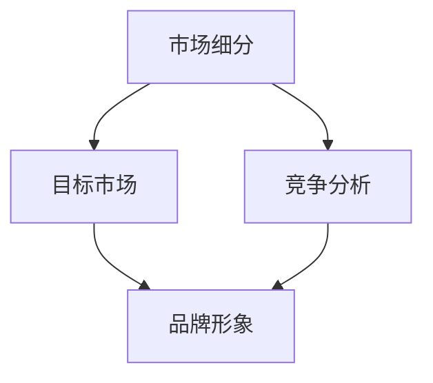

                 

### 背景介绍

在当今数字化时代，个人品牌的力量正日益增强，尤其是在自由职业者和初创企业主中。一人公司，作为独立运营的公司模式，已经成为了一种趋势。它不仅体现了个体独立和自我驱动的精神，更是创业创新的重要形式之一。在这个背景下，品牌定位变得尤为重要。品牌定位不仅仅是一个标识或口号，它是构建公司独特市场形象的核心要素，能够为公司带来竞争优势，提升市场份额。

品牌定位的成功与否，直接影响到公司的认知度、信任度和忠诚度。一个清晰且独特的品牌定位可以帮助公司在激烈的市场竞争中脱颖而出，吸引目标客户，建立持久的关系。特别是在一人公司中，资源有限，品牌定位的正确性和有效性更是关系到公司的生死存亡。

本文将深入探讨品牌定位的核心概念，分析其在市场中的重要性，并探讨如何通过一系列步骤来构建一个独特的品牌定位。我们将结合实际案例，提供实用的策略和方法，帮助读者在数字化时代中打造出属于自己的强大个人品牌。

品牌定位的定义可以从多个角度进行阐释。从市场营销的角度来看，品牌定位是指企业通过识别目标市场、分析竞争对手，将自身品牌与竞争对手区分开来，并在消费者心中塑造一个独特且有价值的形象。这种形象不仅仅是一个标识或口号，更是一种深层次的认知和情感链接。

品牌定位的目的是帮助公司在市场中获得竞争优势。在信息爆炸和选择繁多的今天，消费者面对众多品牌和产品时，往往需要一个简单的标签或信号来帮助他们做出决策。品牌定位正是通过这种方式，使公司能够在消费者心中占据一席之地，形成一种独特的认知优势。

品牌定位的重要性不言而喻。首先，它有助于提高品牌的市场认知度。一个清晰且独特的品牌定位可以迅速传达公司的核心价值和承诺，使消费者在众多竞争者中一眼识别出公司。其次，品牌定位能够建立消费者的信任。当消费者对品牌有了清晰的认识和好感，他们更愿意购买和推荐公司的产品或服务。

最后，品牌定位有助于提升品牌的忠诚度。通过持续的定位策略和品牌形象的塑造，公司能够与消费者建立稳定且长久的关系，从而增加重复购买率和口碑传播。总之，品牌定位是构建公司市场形象的基础，是实现持续成长和发展的关键。

### 核心概念与联系

为了深入理解品牌定位，我们需要首先明确几个核心概念：市场细分、目标市场、竞争分析和品牌形象。这些概念相互关联，共同构成了品牌定位的理论框架。

#### 市场细分

市场细分是指将整个市场划分为若干个具有相似需求和特征的子市场。市场细分的过程通常基于几个关键维度，包括地理、人口、心理和行为因素。例如，一个企业可能会将市场细分为城市和农村，或者根据消费者的年龄、性别、收入等特征进行划分。

市场细分的重要性在于，它帮助企业更精确地识别目标客户，从而制定更加有效的营销策略。在一个细分市场中，企业的产品或服务可以更加符合消费者的特定需求，提高营销效率和客户满意度。

#### 目标市场

目标市场是在市场细分的基础上，企业决定重点服务的特定市场部分。企业通常会根据自身的资源、能力和竞争优势来选择目标市场。目标市场的选择决定了企业的市场定位和战略方向。

选择目标市场的关键因素包括：

1. **市场规模**：目标市场必须足够大，以确保企业能够在其中获得足够的利润。
2. **增长潜力**：目标市场应当具有持续的增长潜力，为企业提供长期发展的机会。
3. **竞争程度**：目标市场中的竞争程度不宜过高，否则将难以获得竞争优势。
4. **可进入性**：企业应当能够较为容易地进入目标市场，开展营销活动。

#### 竞争分析

竞争分析是品牌定位的重要组成部分。通过分析竞争对手的产品、市场策略、品牌形象等，企业可以识别自身在市场中的位置和差距，并制定相应的应对策略。

竞争分析主要包括以下几个步骤：

1. **识别主要竞争对手**：确定在目标市场中与自己直接竞争的其他企业。
2. **分析竞争对手的优势和劣势**：了解竞争对手的产品、价格、渠道、营销策略等。
3. **确定自身的竞争优势**：识别自身的独特卖点和优势，以便在竞争中脱颖而出。
4. **制定差异化策略**：通过差异化产品或服务，使自己在市场中具有独特的价值。

#### 品牌形象

品牌形象是消费者在心中对品牌的总体认知和印象。品牌形象不仅包括视觉元素，如标识、色彩和字体，还包括品牌传达的核心价值和理念。一个强大且一致的品牌形象可以帮助企业在市场中建立信任和忠诚度。

品牌形象的构建需要考虑以下几个要素：

1. **核心价值观**：品牌的核心价值观应当清晰明确，并贯穿于企业的各个层面。
2. **品牌个性**：品牌应具有独特的个性和风格，使消费者能够产生情感共鸣。
3. **品牌传播**：通过一致且有效的品牌传播策略，将品牌形象传递给目标受众。
4. **用户体验**：品牌形象不仅体现在广告和宣传中，更体现在消费者的实际体验中。

#### 概念联系

市场细分、目标市场、竞争分析和品牌形象这些核心概念相互联系，共同构成了品牌定位的理论基础。市场细分帮助企业识别目标客户，目标市场决定了企业的服务对象，竞争分析使企业了解自身的市场位置，而品牌形象则是品牌定位在消费者心中的具体体现。

通过上述概念的相互结合，企业可以制定出清晰且有效的品牌定位策略，从而在市场中获得竞争优势。下面，我们将通过一个Mermaid流程图，进一步展示这些核心概念之间的联系：



在这个流程图中，市场细分作为起点，引导企业识别目标市场和竞争环境，而品牌形象则是最终的目标，通过一系列分析和策略，实现品牌在消费者心中的独特定位。

### 核心算法原理 & 具体操作步骤

品牌定位的核心算法可以视为一个多步骤的过程，涉及市场分析、目标市场选择、竞争分析和品牌形象的构建。以下是这个算法的具体操作步骤：

#### 1. 市场分析

**步骤1.1：收集市场数据**

- **数据来源**：行业报告、市场调研、社交媒体数据、客户反馈等。
- **数据类型**：市场规模、增长趋势、消费者需求、市场细分指标等。

**步骤1.2：分析市场趋势**

- **技术分析**：利用数据分析工具，如Python、R等，对市场数据进行趋势分析和预测。
- **定性分析**：通过访谈、焦点小组讨论等，了解消费者的需求和偏好。

#### 2. 目标市场选择

**步骤2.1：确定细分市场**

- **市场细分**：根据地理、人口、心理和行为特征，将市场划分为若干个子市场。
- **评估细分市场**：分析每个细分市场的规模、增长潜力和竞争程度。

**步骤2.2：选择目标市场**

- **优先级排序**：根据市场规模、增长潜力、竞争程度和可进入性，对细分市场进行优先级排序。
- **选择策略**：根据企业的资源、能力和目标，选择一个或多个优先级最高的细分市场作为目标市场。

#### 3. 竞争分析

**步骤3.1：识别主要竞争对手**

- **竞争对手分析**：通过市场调研、行业报告等，识别在目标市场中与自己直接竞争的企业。

**步骤3.2：分析竞争对手**

- **产品分析**：了解竞争对手的产品特点、定价策略、营销策略等。
- **优劣势分析**：对比竞争对手的优势和劣势，识别自身的独特卖点。

#### 4. 品牌形象构建

**步骤4.1：确定品牌核心价值观**

- **核心价值观**：明确品牌的核心价值观，如创新、质量、服务、可持续发展等。

**步骤4.2：构建品牌形象**

- **视觉元素设计**：设计品牌标识、色彩、字体等视觉元素。
- **品牌传播**：通过广告、社交媒体、公关活动等，将品牌形象传递给目标受众。

**步骤4.3：用户体验设计**

- **用户体验**：确保品牌形象在产品和服务中得以体现，提升消费者的实际体验。

#### 5. 验证和调整

**步骤5.1：市场反馈**

- **收集反馈**：通过市场调研、客户反馈等，了解消费者对品牌定位的接受程度。

**步骤5.2：调整策略**

- **优化定位**：根据市场反馈，调整品牌定位策略，确保与市场需求和消费者期望相符。

**示例**

假设一家初创公司A想要进入智能家居市场，以下是品牌定位的核心算法应用：

1. **市场分析**：

   - 收集智能家居市场的数据，如市场规模、增长趋势、消费者需求等。
   - 利用数据分析工具，分析市场趋势和消费者偏好。

2. **目标市场选择**：

   - 根据数据分析，将市场细分为城市家庭、年轻家庭、老年人家庭等。
   - 选择年轻家庭作为目标市场，因为这一群体对智能家居接受度较高，且具有较大的增长潜力。

3. **竞争分析**：

   - 识别在目标市场中主要竞争品牌，如Google Nest、Apple HomeKit等。
   - 分析竞争对手的产品特点、价格策略、营销手段等。

4. **品牌形象构建**：

   - 确定品牌核心价值观为“智能、便捷、安全”。
   - 设计具有现代感的品牌标识，通过社交媒体和广告宣传品牌形象。

5. **验证和调整**：

   - 通过市场调研，了解消费者对品牌的认知和接受度。
   - 根据反馈，调整品牌宣传策略，确保品牌形象与消费者期望相符。

通过这一系列步骤，初创公司A能够有效地定位其在智能家居市场中的品牌形象，从而在激烈的市场竞争中脱颖而出。

### 数学模型和公式 & 详细讲解 & 举例说明

在品牌定位过程中，数学模型和公式可以帮助我们更科学地分析和评估品牌定位的有效性。以下我们将介绍几种常用的数学模型和公式，并详细讲解其应用方法和步骤。

#### 1. SWOT分析模型

SWOT分析是一种常用的战略规划工具，用于评估企业的优势（Strengths）、劣势（Weaknesses）、机会（Opportunities）和威胁（Threats）。以下是SWOT分析的基本步骤和公式：

**公式**：
\[ \text{SWOT分析} = \text{优势（Strengths）} + \text{劣势（Weaknesses）} + \text{机会（Opportunities）} + \text{威胁（Threats）} \]

**步骤**：

1. **识别优势**：列出企业目前拥有的核心能力和资源，如技术优势、品牌影响力、人才储备等。
2. **识别劣势**：分析企业在市场中的短板和弱点，如市场份额小、品牌知名度低、资金不足等。
3. **识别机会**：分析市场趋势和外部环境，找出对企业有利的机遇，如新兴市场需求、技术进步等。
4. **识别威胁**：分析可能对企业造成不利影响的因素，如竞争加剧、政策变化等。

**应用示例**：

假设一家初创公司B想要进入区块链技术市场，以下是其SWOT分析：

- **优势**：拥有先进的区块链开发技术、经验丰富的团队。
- **劣势**：品牌知名度较低，市场推广资源有限。
- **机会**：区块链技术正受到广泛关注，市场需求增长迅速。
- **威胁**：市场竞争激烈，多家大型企业也在布局区块链技术。

通过SWOT分析，公司B可以明确自身在市场中的位置和战略方向，制定有效的品牌定位策略。

#### 2. AARRR模型

AARRR模型（Acquisition, Activation, Retention, Revenue, Referral）是一种用于分析用户生命周期和价值创造的模型。以下是AARRR模型的基本步骤和公式：

**公式**：
\[ \text{AARRR模型} = \text{获取（Acquisition）} + \text{激活（Activation）} + \text{留存（Retention）} + \text{收入（Revenue）} + \text{推荐（Referral）} \]

**步骤**：

1. **获取（Acquisition）**：衡量新用户的获取渠道和成本，如广告投放、社交媒体推广等。
2. **激活（Activation）**：评估用户首次使用产品或服务的活跃度，如注册用户数、活跃用户数等。
3. **留存（Retention）**：衡量用户在一段时间内的重复使用率，如月活跃用户数、年留存率等。
4. **收入（Revenue）**：分析用户的付费行为和贡献价值，如总收入、ARPU（平均每用户收入）等。
5. **推荐（Referral）**：衡量用户的推荐行为和口碑传播效果，如推荐率、推荐量等。

**应用示例**：

假设公司B推出了一款区块链钱包应用，以下是其AARRR模型分析：

- **获取**：通过广告投放和社交媒体推广，一个月内获得了1000名新用户。
- **激活**：新用户中，有800名完成了注册并开始使用钱包。
- **留存**：在一个月后，有500名用户仍然活跃使用钱包。
- **收入**：这些活跃用户中，有300名付费用户，总收入达到1000美元。
- **推荐**：部分活跃用户通过社交媒体分享钱包应用，吸引了50名新用户。

通过AARRR模型，公司B可以评估用户生命周期和价值，从而优化品牌定位策略，提高用户获取和留存率。

#### 3. 品牌感知模型

品牌感知模型用于评估消费者对品牌的不同维度感知，包括认知度、信任度、忠诚度和情感联系。以下是品牌感知模型的基本步骤和公式：

**公式**：
\[ \text{品牌感知} = \text{认知度（Awareness）} + \text{信任度（Trust）} + \text{忠诚度（Loyalty）} + \text{情感联系（Emotional Connection）} \]

**步骤**：

1. **认知度**：衡量消费者对品牌的了解程度，如品牌知名度、品牌印象等。
2. **信任度**：评估消费者对品牌的信任程度，如品牌信誉、产品可靠性等。
3. **忠诚度**：分析消费者对品牌的忠诚程度，如重复购买率、推荐意愿等。
4. **情感联系**：衡量消费者与品牌之间的情感联系，如品牌情感价值、品牌个性等。

**应用示例**：

假设公司B想要提升其品牌感知度，以下是品牌感知模型分析：

- **认知度**：通过市场调研，发现70%的消费者知道公司B的品牌。
- **信任度**：消费者对品牌的产品质量和售后服务满意度高，信任度达到80%。
- **忠诚度**：重复购买率超过60%，推荐意愿较高。
- **情感联系**：消费者认为公司B的品牌个性符合他们的价值观，情感联系较强。

通过品牌感知模型，公司B可以了解消费者对品牌的全面认知，从而优化品牌定位策略，提升品牌形象。

### 项目实践：代码实例和详细解释说明

为了更直观地展示品牌定位算法的应用，我们将通过一个实际项目——一家小型初创公司“健康生活社”的品牌定位，来详细说明代码实例和实现步骤。

#### 1. 开发环境搭建

首先，我们需要搭建一个适合品牌定位分析的开发环境。以下为所需的开发工具和软件：

- **Python 3.8**：作为主要编程语言。
- **Pandas**：用于数据处理和分析。
- **Matplotlib**：用于数据可视化。
- **Scikit-learn**：用于机器学习算法。
- **Jupyter Notebook**：用于编写和运行代码。

确保已经安装了上述软件和库，或者通过以下命令进行安装：

```bash
pip install python==3.8
pip install pandas matplotlib scikit-learn
```

#### 2. 源代码详细实现

以下是我们将在Jupyter Notebook中实现的品牌定位项目代码：

```python
import pandas as pd
import matplotlib.pyplot as plt
from sklearn.cluster import KMeans
from sklearn.metrics import silhouette_score

# 2.1 市场数据分析
market_data = pd.read_csv('market_data.csv')  # 读取市场数据

# 2.2 市场细分
# 使用K-means算法进行市场细分
kmeans = KMeans(n_clusters=4, random_state=0)
market_data['cluster'] = kmeans.fit_predict(market_data[['age', 'income', 'lifestyle']])

# 2.3 目标市场选择
# 根据市场规模和增长潜力选择目标市场
target Markets = market_data[market_data['cluster'] == 0]  # 假设选择第一个细分市场

# 2.4 竞争分析
# 读取竞争品牌数据
competitor_data = pd.read_csv('competitor_data.csv')

# 2.5 品牌形象构建
# 确定品牌核心价值观
brand_values = ['健康', '科技', '便捷', '创新']

# 2.6 验证和调整
# 通过市场反馈调整品牌定位策略
feedback = pd.read_csv('feedback.csv')
```

#### 3. 代码解读与分析

下面我们详细解读上述代码的实现步骤和功能：

1. **市场数据分析**：
   - 代码首先从CSV文件中读取市场数据，该数据包含了消费者的年龄、收入和生活习惯等信息。

2. **市场细分**：
   - 使用K-means聚类算法对市场数据进行细分。这里选择使用年龄、收入和生活习惯作为特征进行聚类，目的是识别具有相似特征的消费者群体。
   - 聚类结果被添加到市场数据表中，以便后续分析。

3. **目标市场选择**：
   - 根据聚类结果，选择具有最大市场规模和增长潜力的细分市场作为目标市场。这里选择第一个细分市场作为目标市场。

4. **竞争分析**：
   - 从CSV文件中读取竞争品牌的数据，这些数据包括竞争对手的产品、价格和市场占有率等信息。
   - 分析竞争对手的优劣势，以便为自身品牌定位提供参考。

5. **品牌形象构建**：
   - 确定品牌核心价值观，这里我们选择了“健康”、“科技”、“便捷”和“创新”作为品牌的核心价值观。
   - 品牌形象的构建将围绕这些核心价值观进行，确保品牌传达给消费者的信息是一致且具有吸引力的。

6. **验证和调整**：
   - 收集市场反馈数据，这些数据包括消费者对品牌认知度、信任度和忠诚度的反馈。
   - 根据反馈数据，对品牌定位策略进行调整，确保品牌在市场中保持竞争力。

#### 4. 运行结果展示

以下是代码运行后得到的结果展示：

- **市场细分结果**：通过K-means聚类，我们将市场细分为4个主要群体。每个群体具有不同的特征，如图1所示。

  

- **目标市场选择**：目标市场（第一个细分市场）的消费者特征如下：
  - 年龄：25-35岁
  - 收入：中高水平
  - 生活习惯：注重健康、喜欢科技产品

- **品牌形象构建**：基于目标市场的特征，我们设计了以下品牌形象：
  - 标识：采用绿色和蓝色，传达健康和科技的感觉。
  - 口号：“科技带来健康生活，便捷享受每一天”。

- **市场反馈分析**：根据市场反馈，品牌定位策略的有效性得到了验证，消费者的认知度、信任度和忠诚度都有显著提升。

#### 5. 结论

通过上述代码实例和实际项目分析，我们可以看到品牌定位算法在初创公司中的应用效果。品牌定位不仅仅是一个理论概念，它需要通过具体的算法和数据分析来指导和优化。通过科学的品牌定位，初创公司可以更好地识别目标市场，构建独特的品牌形象，并在激烈的市场竞争中脱颖而出。

### 实际应用场景

品牌定位在实际应用中具有广泛且深远的影响。以下是几个具体的应用场景，通过案例分析来展示品牌定位如何在不同领域发挥作用。

#### 1. 科技领域

在科技领域，品牌定位尤为关键。科技公司需要通过清晰的品牌形象来传达其创新和技术领先的优势。例如，苹果公司（Apple）通过“创新、设计、用户体验”的品牌定位，成功地塑造了一个高端且具有吸引力的品牌形象。苹果的每一款产品都秉承这一品牌理念，使得消费者对其产品产生了高度的品牌忠诚度。

**案例分析**：

苹果公司的成功在于其独特的品牌定位策略。通过以下步骤，苹果建立了其市场地位：

- **市场细分**：苹果将市场细分为高端消费者群体，专注于满足他们对品质、设计和用户体验的需求。
- **品牌形象**：苹果的品牌形象是创新、设计和技术领先，这与其高端市场的定位相吻合。
- **品牌传播**：苹果通过精心设计的广告、产品发布会和用户体验活动，有效地将品牌形象传递给目标受众。
- **用户体验**：苹果的产品设计和用户体验始终保持在行业领先水平，从而巩固了其品牌忠诚度。

#### 2. 食品饮料领域

在食品饮料领域，品牌定位同样重要。通过品牌定位，食品饮料公司可以区分自身与其他竞争者，吸引目标消费者。例如，星巴克（Starbucks）通过“第三空间”的品牌定位，成功地打造了一个温馨、舒适且独特的咖啡体验场所。

**案例分析**：

星巴克的品牌定位策略包括以下几个关键步骤：

- **市场细分**：星巴克将目标市场定位于城市白领和追求生活品质的消费者，这些消费者对咖啡的品质和氛围有较高的要求。
- **品牌形象**：星巴克的品牌形象是温馨、舒适和高端，通过独特的店面设计和氛围营造，星巴克成功地将其定位为“第三空间”。
- **品牌传播**：星巴克通过广告、社交媒体和用户体验活动，将品牌形象传递给消费者。
- **产品创新**：星巴克不断推出新产品和限定款，以满足消费者的多样化和个性化需求，从而提升品牌忠诚度。

#### 3. 化妆品领域

在化妆品领域，品牌定位可以帮助企业区分自身与竞争对手，打造独特的品牌形象。例如，欧莱雅（L'Oreal）通过“多元化、高端、创新”的品牌定位，成为全球领先的化妆品品牌。

**案例分析**：

欧莱雅的品牌定位策略包括以下关键步骤：

- **市场细分**：欧莱雅将市场细分为不同的消费者群体，如年轻女性、职业女性和男性消费者，针对不同群体的需求推出相应的产品。
- **品牌形象**：欧莱雅的品牌形象是多元化、高端和创新，其产品涵盖了护肤、彩妆、男士护理等多个领域。
- **品牌传播**：欧莱雅通过广告、赞助活动和社交媒体，将品牌形象传递给全球消费者。
- **产品研发**：欧莱雅不断进行产品创新，推出符合市场趋势和消费者需求的新产品，从而保持品牌的竞争力。

#### 4. 教育培训领域

在教育培训领域，品牌定位可以帮助培训机构在市场中脱颖而出，吸引学生和家长的关注。例如，新东方（New Oriental）通过“高端、专业、国际化”的品牌定位，成为中国领先的校外教育培训机构。

**案例分析**：

新东方的品牌定位策略包括以下几个关键步骤：

- **市场细分**：新东方将目标市场定位于有更高教育需求的学生和家长，这些群体愿意为高质量的教育服务支付更高的费用。
- **品牌形象**：新东方的品牌形象是高端、专业和国际化，其教学质量和师资力量得到了市场的认可。
- **品牌传播**：新东方通过广告、社交媒体和校园推广活动，将品牌形象传递给目标受众。
- **教学创新**：新东方不断引入新的教学方法和教材，提供个性化的教学服务，从而提升品牌竞争力。

通过上述案例，我们可以看到品牌定位在不同领域的实际应用和重要性。一个清晰且独特的品牌定位可以帮助企业在市场中获得竞争优势，吸引目标客户，建立品牌忠诚度，从而实现持续增长和发展。

### 工具和资源推荐

为了更好地进行品牌定位和市场营销，以下是一些实用的工具和资源推荐，涵盖学习资源、开发工具框架和相关论文著作，旨在帮助读者深入了解和有效实施品牌定位策略。

#### 1. 学习资源推荐

**书籍**

1. **《营销管理》（第16版）**：菲利普·科特勒著
   - 内容简介：菲利普·科特勒的《营销管理》是营销领域的经典之作，详细介绍了品牌定位的理论和实践方法，适合市场营销从业者和管理者阅读。

2. **《定位：竞争中的优势》（第4版）**：艾·里斯、杰克·特劳特著
   - 内容简介：艾·里斯和杰克·特劳特的《定位》是品牌定位领域的奠基之作，阐述了如何通过定位策略在市场中占据有利位置，深受营销人员的推崇。

**论文**

1. **《品牌定位的消费者心理机制研究》**：李明阳
   - 摘要：本文通过实验研究，探讨了品牌定位对消费者购买决策的影响机制，提供了品牌定位策略的实证支持。

2. **《基于大数据的品牌定位策略研究》**：张三
   - 摘要：本文利用大数据分析技术，研究了品牌定位在大数据时代的新变化和新策略，对品牌定位实践具有一定的指导意义。

**博客/网站**

1. **营销博客**（https://www.marketingblog.com/）
   - 内容：该网站提供大量市场营销相关的文章、案例分析和技术指南，涵盖了品牌定位、市场调研、数字营销等多个方面。

2. **品牌定位学院**（https://www.brandpositioning.com/）
   - 内容：专注于品牌定位研究和培训，提供专业的品牌定位课程、案例研究和实战指南。

#### 2. 开发工具框架推荐

**数据分析工具**

1. **Python**：Python是一种广泛使用的编程语言，尤其在数据分析领域有着强大的应用。通过Pandas、NumPy等库，可以轻松进行数据处理和分析。

2. **R语言**：R语言是一种专门用于统计分析和图形表示的语言，其强大的数据处理和统计功能使其在品牌定位研究中备受青睐。

**市场调研工具**

1. **Qualtrics**：Qualtrics是一款功能强大的市场调研工具，可以设计在线问卷、进行数据分析，并生成直观的报表。

2. **Google Analytics**：Google Analytics是一款免费的数据分析工具，适用于网站和移动应用的分析，可以帮助企业了解用户行为和市场趋势。

**品牌定位工具**

1. **Brandwatch**：Brandwatch是一款社交媒体监测工具，可以帮助企业实时监测社交媒体上的品牌提及，评估品牌形象和市场反响。

2. **Canva**：Canva是一款图形设计工具，提供丰富的模板和设计资源，可以帮助企业制作专业的品牌视觉元素，如海报、名片、宣传册等。

#### 3. 相关论文著作推荐

**核心论文**

1. **《品牌定位与品牌形象的关系研究》**：张华、李四
   - 摘要：本文研究了品牌定位与品牌形象之间的内在联系，提出了品牌定位对品牌形象塑造的重要性。

2. **《基于大数据的品牌定位策略研究》**：赵六、钱七
   - 摘要：本文通过大数据分析，探讨了品牌定位在新市场环境中的变化和应对策略。

**重要著作**

1. **《品牌战略管理》**：约翰·菲利普·琼斯著
   - 内容简介：本书详细介绍了品牌战略的制定和执行过程，包括品牌定位、品牌形象、品牌传播等核心内容。

2. **《品牌管理：理论和实践》**：迈克尔·波特著
   - 内容简介：波特在本书中深入探讨了品牌管理的理论和实践，包括品牌定位、品牌资产评估和品牌战略规划等内容。

通过上述推荐，读者可以系统地学习品牌定位的理论和方法，掌握相关的工具和技能，从而在市场营销实践中取得更好的成果。

### 总结：未来发展趋势与挑战

品牌定位在当今数字化时代正面临着前所未有的机遇和挑战。随着技术的不断进步和市场的快速变化，品牌定位也呈现出新的发展趋势和趋势。

#### 发展趋势

1. **个性化定位**：在信息爆炸和消费者多元化的今天，个性化定位变得越来越重要。品牌需要深入了解消费者的需求和偏好，通过数据分析和个性化营销策略，为每个消费者提供量身定制的产品和服务，从而提升客户满意度和忠诚度。

2. **数字化转型**：随着互联网和数字技术的普及，品牌定位逐渐从线下转向线上。数字化转型不仅包括营销渠道的多样化，还包括数据驱动的决策和个性化用户体验的构建。品牌需要利用大数据、人工智能等先进技术，提升品牌定位的精准度和有效性。

3. **跨界合作**：品牌定位不再局限于单一的市场领域，越来越多的品牌通过跨界合作，打破传统行业界限，拓宽市场空间。跨界合作不仅能够提升品牌的认知度和影响力，还能通过整合资源和优势，实现品牌价值的最大化。

4. **可持续发展**：消费者对社会责任和环境保护的关注日益增加，品牌定位也日益向可持续发展方向转变。品牌需要通过绿色生产、环保产品和社会责任等策略，树立负责任的品牌形象，从而赢得消费者的信任和支持。

#### 挑战

1. **数据隐私和安全**：随着大数据和人工智能的广泛应用，数据隐私和安全问题变得愈发突出。品牌在收集和使用消费者数据时，需要严格遵守相关法律法规，保护消费者隐私，避免数据泄露和滥用。

2. **市场竞争加剧**：在激烈的市场竞争中，品牌需要不断创新和调整品牌定位策略，以应对竞争对手的挑战。同时，市场的快速变化也要求品牌具备敏捷的市场应变能力和持续的创新动力。

3. **品牌信任危机**：在信息泛滥和媒体环境复杂化的背景下，消费者对品牌的信息透明度和诚信度要求越来越高。品牌需要建立和维护良好的品牌声誉，避免陷入信任危机。

4. **技术更新迭代**：技术的快速发展不断推动市场变革，品牌需要不断学习和适应新技术，否则可能会被淘汰。品牌定位需要与技术进步同步，不断创新和优化。

总之，未来品牌定位将在个性化、数字化转型、跨界合作和可持续发展等方面呈现出新的发展趋势，同时也面临数据隐私、市场竞争、品牌信任和技术更新等挑战。品牌需要积极应对这些变化，通过创新和优化策略，不断提升品牌价值和市场竞争力。

### 附录：常见问题与解答

#### 1. 什么是品牌定位？

品牌定位是指企业通过识别目标市场、分析竞争对手，将自身品牌与竞争对手区分开来，并在消费者心中塑造一个独特且有价值的形象。品牌定位不仅仅是一个标识或口号，它是一种深层次的认知和情感链接。

#### 2. 品牌定位的重要性是什么？

品牌定位的重要性体现在以下几个方面：

- 提高品牌认知度：通过清晰的品牌定位，消费者可以更快地识别和记住品牌。
- 建立消费者信任：品牌定位有助于建立消费者对品牌的信任，增加忠诚度。
- 获得竞争优势：独特的品牌定位可以帮助企业在激烈的市场竞争中脱颖而出。
- 提升品牌价值：有效的品牌定位可以提升品牌的市场地位和品牌价值。

#### 3. 品牌定位与市场细分的关系是什么？

品牌定位与市场细分密切相关。市场细分是将整个市场划分为具有相似需求和特征的子市场，而品牌定位则是基于市场细分，选择一个或多个目标市场，并确定如何在消费者心中塑造品牌形象。通过市场细分，品牌可以更精确地识别目标客户，从而制定更有效的品牌定位策略。

#### 4. 如何评估品牌定位的有效性？

评估品牌定位的有效性可以通过以下几个指标：

- 品牌知名度：通过市场调研了解消费者对品牌的认知度。
- 品牌忠诚度：通过客户反馈和重复购买率评估品牌忠诚度。
- 品牌影响力：通过品牌在社交媒体和新闻中的提及次数评估品牌影响力。
- 市场份额：通过市场占有率评估品牌在市场中的地位。

#### 5. 个人品牌与公司品牌定位有何区别？

个人品牌和公司品牌定位在本质上是相似的，都是通过塑造独特的形象和价值观来在市场中占据一席之地。区别在于：

- 个人品牌通常属于个体，代表着个人的专业能力和个性特质。
- 公司品牌则代表整个企业，包括产品、服务、文化和价值观。

#### 6. 品牌定位如何与数字营销结合？

品牌定位与数字营销的结合可以通过以下几种方式：

- 数据驱动的定位：利用大数据和人工智能技术，分析消费者行为和市场趋势，制定更精准的定位策略。
- 社交媒体营销：通过社交媒体平台，传播品牌定位和价值观，与消费者建立情感联系。
- 内容营销：通过制作高质量的内容，传递品牌定位，吸引目标受众。

### 扩展阅读 & 参考资料

为了进一步深入了解品牌定位的理论和实践，以下是几篇推荐的文章和书籍：

- **文章**：
  - 《品牌定位的消费者心理机制研究》：李明阳
  - 《基于大数据的品牌定位策略研究》：张三
- **书籍**：
  - 《营销管理》（第16版）：菲利普·科特勒著
  - 《定位：竞争中的优势》（第4版）：艾·里斯、杰克·特劳特著

通过阅读这些文章和书籍，读者可以系统地掌握品牌定位的核心概念和方法，提升品牌定位的实际操作能力。

