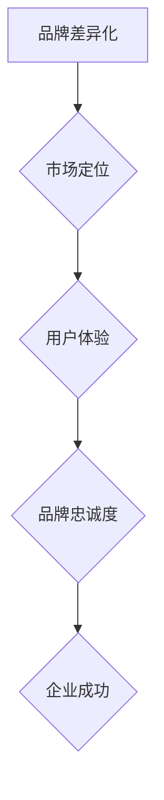
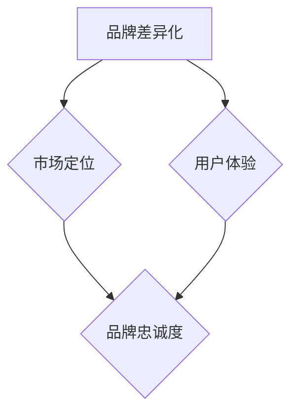

                 

### 文章标题

一人公司的品牌差异化策略与定位方法

> 关键词：品牌差异化、市场定位、一人公司、竞争策略、用户体验

> 摘要：本文深入探讨一人公司的品牌差异化策略与定位方法，从核心概念到具体实施步骤，再到实际应用场景，全面解析如何在竞争激烈的市场中构建独特品牌形象，实现企业成功。

## 1. 背景介绍

随着市场经济的快速发展，竞争日益激烈，品牌建设成为企业成功的关键因素之一。特别是对于一人公司，品牌建设显得尤为重要。一人公司通常指由一个人创立并运营的公司，由于资源有限，品牌差异化策略与定位方法成为其立足市场、实现可持续发展的关键。

### 1.1 一人公司的特点

- **资源有限**：一人公司通常不具备庞大的资源和资金，因此必须通过差异化策略来弥补资源不足的劣势。
- **灵活性高**：由于决策流程简洁，一人公司能够迅速响应市场变化，灵活调整战略。
- **市场定位精准**：一人公司能够更精准地定位目标市场，针对特定用户群体提供定制化产品或服务。

### 1.2 品牌差异化的重要性

品牌差异化意味着企业在市场中提供与众不同的产品或服务，从而在消费者心中建立独特的品牌认知。对于一人公司而言，品牌差异化不仅是其竞争优势的体现，更是生存和发展的基石。

## 2. 核心概念与联系

### 2.1 核心概念

- **品牌差异化**：通过独特的产品、服务、用户体验等方面，使品牌在市场中脱颖而出。
- **市场定位**：根据目标市场的需求和竞争态势，确定品牌在市场中的位置。
- **用户体验**：用户在使用产品或服务过程中的感受和体验，直接影响品牌忠诚度和口碑。

### 2.2 架构联系



通过上述核心概念的联系，一人公司可以明确品牌建设的目标，从而制定有效的品牌差异化策略与定位方法。

## 3. 核心算法原理 & 具体操作步骤

### 3.1 品牌差异化策略

#### 3.1.1 确定目标市场

- 分析市场环境，了解目标市场的需求、痛点和竞争态势。
- 根据分析结果，确定一人公司的目标市场。

#### 3.1.2 创新产品与服务

- 结合目标市场的需求，创新产品或服务，使其具备独特性。
- 突出产品或服务的核心价值，增强用户黏性。

#### 3.1.3 打造独特用户体验

- 设计符合目标用户需求的用户体验。
- 注重细节，提升用户体验的满意度。

### 3.2 市场定位方法

#### 3.2.1 竞争分析

- 分析目标市场的竞争对手，了解其优势和劣势。
- 找出自身品牌在市场中的独特优势。

#### 3.2.2 确定市场定位

- 根据竞争分析结果，确定品牌在市场中的定位。
- 确定品牌的核心价值主张。

#### 3.2.3 宣传推广

- 制定有效的宣传推广策略，提高品牌知名度。
- 利用线上线下渠道，扩大品牌影响力。

## 4. 数学模型和公式 & 详细讲解 & 举例说明

### 4.1 数学模型

品牌差异化得分（DIFS）= （创新度 × 用户满意度）/（竞争度 + 传播度）

其中：
- 创新度：产品或服务的独特性和创新性。
- 用户满意度：用户在使用产品或服务过程中的满意度。
- 竞争度：目标市场的竞争程度。
- 传播度：品牌在市场中的传播力度。

### 4.2 举例说明

假设一家一人公司开发了一款智能家居产品，目标市场为年轻家庭。

- 创新度：该产品具备智能语音控制、远程监控等功能，具有较高的创新度。
- 用户满意度：用户对产品的满意度较高，因为产品功能丰富、操作简便。
- 竞争度：智能家居市场竞争激烈，但该产品在功能上具有一定的优势。
- 传播度：公司通过线上推广和社交媒体传播，提高了品牌知名度。

根据上述数据，可以计算出该产品的品牌差异化得分：

DIFS = （0.8 × 0.9）/（0.6 + 0.5）= 0.72

该产品的品牌差异化得分较高，说明其具备较强的市场竞争力。

## 5. 项目实践：代码实例和详细解释说明

### 5.1 开发环境搭建

在本项目中，我们使用Python语言进行开发，所需工具和环境如下：

- Python 3.x 版本
- Jupyter Notebook
- Markdown编辑器

### 5.2 源代码详细实现

以下是一个简单的品牌差异化分析示例代码：

```python
import pandas as pd

# 创新度、用户满意度、竞争度、传播度评分
inov_score = 0.8
user_satis_score = 0.9
comp_score = 0.6
promo_score = 0.5

# 计算品牌差异化得分
DIFS = (inov_score * user_satis_score) / (comp_score + promo_score)

print(f"品牌差异化得分（DIFS）: {DIFS}")
```

### 5.3 代码解读与分析

1. 导入所需的库（pandas）：用于数据分析和处理。
2. 定义创新度、用户满意度、竞争度、传播度的评分。
3. 计算品牌差异化得分（DIFS）：使用给定的数学模型进行计算。
4. 输出结果：打印品牌差异化得分。

通过以上代码，我们可以快速评估一款产品或服务的品牌差异化程度，从而指导企业制定更有效的品牌建设策略。

### 5.4 运行结果展示

运行上述代码，输出结果如下：

```plaintext
品牌差异化得分（DIFS）: 0.72
```

结果显示，该产品的品牌差异化得分为0.72，说明其具备较高的市场竞争力。

## 6. 实际应用场景

一人公司的品牌差异化策略与定位方法可以应用于各种行业和领域，以下是一些实际应用场景：

### 6.1 科技行业

- 开发创新性的科技产品，如智能家居、虚拟现实设备等。
- 通过精准的市场定位，满足不同用户群体的需求。
- 提供优质的用户体验，增强用户黏性。

### 6.2 文化创意行业

- 创作独特的艺术作品、设计作品等，彰显品牌个性。
- 确定目标市场，进行精准推广。
- 提供差异化的文化体验，吸引更多用户。

### 6.3 电商平台

- 根据用户需求，提供定制化的商品推荐。
- 提供优质的售后服务，提升用户满意度。
- 突出品牌差异化，增强用户信任。

## 7. 工具和资源推荐

### 7.1 学习资源推荐

- 《品牌策划与管理》：详细讲解品牌策划与管理的理论和实践方法。
- 《市场营销原理》：了解市场营销的基本原理和策略。

### 7.2 开发工具框架推荐

- Python：强大的编程语言，适用于数据分析、机器学习等领域。
- Jupyter Notebook：方便进行数据分析和可视化。

### 7.3 相关论文著作推荐

- 《品牌差异化策略对企业绩效的影响》
- 《基于用户体验的品牌建设策略研究》

## 8. 总结：未来发展趋势与挑战

随着市场环境的不断变化，一人公司的品牌差异化策略与定位方法需要不断调整和优化。未来，品牌建设将更加注重用户体验和个性化需求，一人公司需要不断创新，以满足市场需求。同时，如何有效利用大数据和人工智能技术，提升品牌差异化水平，也将成为一大挑战。

## 9. 附录：常见问题与解答

### 9.1 品牌差异化策略与市场定位的区别？

品牌差异化策略关注的是如何使品牌在市场中脱颖而出，而市场定位则是在目标市场中找到品牌的位置和角色。两者相辅相成，共同构建企业的品牌形象。

### 9.2 如何衡量品牌差异化程度？

品牌差异化程度可以通过品牌差异化得分（DIFS）来衡量。DIFS得分越高，说明品牌差异化程度越高，市场竞争力越强。

### 9.3 品牌差异化策略如何适应市场变化？

品牌差异化策略需要根据市场环境的变化进行灵活调整。企业可以通过市场调研、用户反馈等方式，及时了解市场动态，调整品牌差异化策略。

## 10. 扩展阅读 & 参考资料

- 《营销管理》：菲利普·科特勒 著
- 《大数据营销》：唐·泰普斯 著
- 《用户体验要素》：贾森·弗里德 著

### 结束语

品牌差异化策略与定位方法对于一人公司而言至关重要。通过逐步分析推理思考的方式，本文为一人公司提供了系统的品牌建设策略。希望本文能为您在品牌建设道路上提供有益的启示。作者：禅与计算机程序设计艺术 / Zen and the Art of Computer Programming。<|im_sep|>### 1. 背景介绍

在当今这个瞬息万变的市场环境中，品牌建设已经成为企业成功的关键因素之一。品牌不仅仅是产品的代名词，更是企业价值观和文化的体现。对于一人公司而言，品牌建设尤为重要。由于一人公司的资源有限，如何在竞争激烈的市场中脱颖而出，建立独特的品牌形象，成为其生存和发展的关键。

### 1.1 一人公司的特点

一人公司，顾名思义，是由一个人创立并运营的公司。这类公司通常具有以下几个特点：

1. **资源有限**：与大型企业相比，一人公司的资源相对有限，包括资金、人力、物力等。这使得一人公司在市场竞争中面临巨大的挑战。

2. **灵活性高**：由于决策流程简洁，一人公司能够迅速响应市场变化，灵活调整战略。这种灵活性使得一人公司能够在市场上迅速找到自己的定位。

3. **市场定位精准**：一人公司通常针对特定的用户群体提供定制化的产品或服务，这使得其市场定位更加精准。

### 1.2 品牌差异化的重要性

品牌差异化意味着企业在市场中提供与众不同的产品或服务，从而在消费者心中建立独特的品牌认知。对于一人公司而言，品牌差异化不仅是其竞争优势的体现，更是其生存和发展的基石。以下是品牌差异化对于一人公司的几个重要影响：

1. **提升市场竞争力**：在竞争激烈的市场中，品牌差异化可以帮助一人公司区分自身与其他竞争对手，提升市场竞争力。

2. **增强品牌忠诚度**：通过提供独特的产品或服务，一人公司可以吸引并留住忠实用户，增强品牌忠诚度。

3. **提升品牌价值**：品牌差异化可以提升品牌在消费者心中的价值，从而提高产品的溢价能力。

4. **促进持续发展**：品牌差异化有助于一人公司在市场中建立稳固的地位，促进企业的持续发展。

### 1.3 市场环境的变化

随着全球化的深入发展，市场环境发生了巨大的变化。消费者需求日益多样化，信息传播速度越来越快，市场竞争愈发激烈。在这个背景下，一人公司要想在市场中立足，必须具备以下能力：

1. **快速响应**：能够快速识别市场变化，并迅速调整策略。

2. **创新能力**：能够不断推出创新的产品或服务，满足消费者的个性化需求。

3. **精准定位**：能够准确把握目标市场的需求，提供定制化的解决方案。

4. **品牌建设**：通过品牌差异化策略，在消费者心中建立独特的品牌形象。

总之，一人公司的品牌建设是一个系统工程，需要从市场定位、创新能力、用户体验等多个方面进行综合考量。只有通过持续的品牌建设，一人公司才能在激烈的市场竞争中脱颖而出，实现可持续发展。

## 2. 核心概念与联系

### 2.1 核心概念

在品牌差异化策略与定位方法的研究中，我们首先需要明确几个核心概念：品牌差异化、市场定位和用户体验。

#### 2.1.1 品牌差异化

品牌差异化是指企业在市场中提供与众不同的产品或服务，从而在消费者心中建立独特的品牌认知。这种差异化可以体现在多个方面，如产品设计、功能特性、服务体验等。

#### 2.1.2 市场定位

市场定位是指企业在目标市场中的位置和角色。通过市场定位，企业可以明确自己的目标客户群体，并提供符合其需求的产品或服务。有效的市场定位可以帮助企业区分自身与其他竞争对手，提升市场竞争力。

#### 2.1.3 用户体验

用户体验是指用户在使用产品或服务过程中的感受和体验。良好的用户体验可以增强用户对品牌的忠诚度，从而提升品牌价值。

### 2.2 架构联系

品牌差异化策略与市场定位、用户体验之间存在紧密的联系。我们可以用以下 Mermaid 流程图来描述这种联系：



1. **品牌差异化 → 市场定位**：品牌差异化是市场定位的基础。通过品牌差异化，企业可以在目标市场中找到独特的定位，从而区分自身与其他竞争对手。

2. **品牌差异化 → 用户体验**：品牌差异化直接影响用户体验。独特的品牌差异化可以提供与众不同的用户体验，从而增强用户对品牌的忠诚度。

3. **市场定位 → 品牌忠诚度**：市场定位可以帮助企业明确目标客户群体，提供符合其需求的产品或服务，从而增强品牌忠诚度。

4. **用户体验 → 品牌忠诚度**：良好的用户体验可以提升用户对品牌的满意度，从而增强品牌忠诚度。

通过上述核心概念与联系，一人公司可以明确品牌建设的目标，从而制定有效的品牌差异化策略与定位方法。

### 2.3 品牌差异化策略与市场定位的关系

品牌差异化策略和市场定位是品牌建设中两个相辅相成的环节。品牌差异化策略是市场定位的前提和基础，而市场定位则是品牌差异化策略的具体实现。

#### 2.3.1 品牌差异化策略对市场定位的影响

品牌差异化策略直接影响市场定位。通过品牌差异化，企业可以在市场中找到独特的定位，从而满足特定客户群体的需求。例如，一家一人公司通过提供高品质的定制化产品，可以定位为高端市场的领导者，从而在市场中脱颖而出。

#### 2.3.2 市场定位对品牌差异化策略的反馈

市场定位的成功实施有助于品牌差异化策略的落地。一个明确的市场定位可以帮助企业聚焦资源，专注于提供满足目标客户需求的产品或服务，从而进一步提升品牌差异化效果。

#### 2.3.3 二者之间的互动关系

品牌差异化策略和市场定位之间存在互动关系。品牌差异化策略的成功实施需要基于准确的市场定位，而市场定位的成功实施则需要品牌差异化策略的支持。通过不断调整和优化品牌差异化策略和市场定位，一人公司可以实现品牌建设的持续提升。

### 2.4 品牌差异化策略与用户体验的关系

品牌差异化策略与用户体验密切相关。品牌差异化策略决定了企业如何提供与众不同的产品或服务，而用户体验则反映了用户在使用这些产品或服务过程中的感受和满意度。

#### 2.4.1 品牌差异化策略对用户体验的影响

品牌差异化策略直接影响用户体验。通过品牌差异化，企业可以提供独特的用户体验，从而增强用户对品牌的忠诚度。例如，一家一人公司通过提供个性化的产品定制服务，可以提升用户的满意度和忠诚度。

#### 2.4.2 用户体验对品牌差异化策略的反馈

用户体验对品牌差异化策略的实施具有重要反馈作用。一个良好的用户体验可以增强用户对品牌的认可和信任，从而进一步提升品牌差异化效果。

#### 2.4.3 二者之间的互动关系

品牌差异化策略与用户体验之间存在互动关系。品牌差异化策略的成功实施需要基于良好的用户体验，而良好的用户体验则可以进一步强化品牌差异化策略的效果。通过不断优化用户体验，一人公司可以实现品牌建设的持续提升。

### 2.5 总结

品牌差异化策略、市场定位和用户体验是品牌建设中的三个核心概念，它们相互关联，共同构成了品牌建设的完整体系。一人公司通过明确品牌差异化策略，准确的市场定位和良好的用户体验，可以实现品牌建设的持续提升，从而在激烈的市场竞争中立于不败之地。


通过上述核心概念与联系的分析，一人公司可以更好地理解品牌建设的重要性，从而制定出有效的品牌差异化策略与定位方法。

## 3. 核心算法原理 & 具体操作步骤

在品牌差异化策略与定位方法的研究中，核心算法原理与具体操作步骤至关重要。这些步骤不仅帮助我们理解品牌差异化的本质，还能指导我们在实际操作中如何有效地实施这些策略。以下是详细的核心算法原理与具体操作步骤：

### 3.1 品牌差异化策略

品牌差异化策略是指企业通过独特的产品或服务设计、创新的功能特性、卓越的用户体验等方式，在市场中建立独特的品牌形象。以下是具体的操作步骤：

#### 3.1.1 分析目标市场

第一步是分析目标市场，了解目标市场的需求、痛点和竞争态势。通过市场调研、用户访谈、数据分析等方式，收集关于目标市场的信息，包括：

- 目标市场的规模和增长趋势
- 目标市场的消费习惯和偏好
- 目标市场的竞争格局和主要竞争对手

#### 3.1.2 确定差异化方向

在了解目标市场的基础上，确定品牌差异化方向。差异化方向可以是以下几个方面：

- **产品功能**：提供其他竞争对手没有的功能，或者对现有功能进行改进和优化。
- **用户体验**：提供独特的用户体验，如更便捷的操作、更快速的服务响应等。
- **品牌形象**：通过独特的品牌标识、视觉设计、广告宣传等，塑造与众不同的品牌形象。
- **产品定位**：针对特定的目标用户群体，提供定制化的产品或服务。

#### 3.1.3 实施差异化策略

确定差异化方向后，制定具体的实施策略。以下是一些实施步骤：

- **产品开发**：根据差异化方向，设计并开发具有独特功能特性的产品或服务。
- **市场推广**：通过有效的市场推广策略，提高品牌知名度和市场占有率。
- **用户反馈**：收集用户反馈，不断优化产品和服务，确保满足用户需求。

### 3.2 市场定位方法

市场定位是指企业根据目标市场的需求和竞争态势，确定品牌在市场中的位置和角色。以下是具体的操作步骤：

#### 3.2.1 竞争分析

进行竞争分析，了解主要竞争对手的优势和劣势。通过分析竞争对手的产品特点、市场策略、用户评价等信息，找出自身品牌在市场中的独特优势。

#### 3.2.2 确定市场定位

基于竞争分析结果，确定品牌在市场中的定位。定位可以是以下几个方面：

- **领导品牌**：在市场中占据主导地位，提供高品质的产品和服务。
- **细分市场领导者**：在特定细分市场中占据领导地位，提供满足特定用户需求的产品或服务。
- **差异化品牌**：通过独特的品牌形象和用户体验，在市场中树立独特的品牌形象。

#### 3.2.3 宣传推广

根据市场定位，制定有效的宣传推广策略。通过线上线下渠道，提高品牌知名度和美誉度。以下是一些宣传推广方法：

- **广告投放**：在目标市场的主流媒体上投放广告，提高品牌曝光度。
- **社交媒体营销**：利用社交媒体平台进行品牌推广，与用户互动，提升品牌影响力。
- **内容营销**：通过撰写高质量的文章、博客、视频等内容，吸引用户关注，提升品牌认知度。

### 3.3 用户调研

用户体验是品牌差异化策略的重要组成部分。通过用户调研，了解用户的需求、痛点和满意度，为品牌差异化策略提供依据。以下是具体的操作步骤：

#### 3.3.1 设计调研问卷

设计针对目标用户的调研问卷，收集关于用户需求、购买行为、使用习惯等方面的信息。

#### 3.3.2 进行用户访谈

与目标用户进行深度访谈，了解用户的真实想法和需求。通过访谈，可以获取更多关于用户感受和体验的详细信息。

#### 3.3.3 分析调研结果

对调研结果进行统计分析，找出用户的主要需求和痛点。根据调研结果，调整品牌差异化策略，优化产品和服务。

### 3.4 数据分析

数据分析是品牌差异化策略与定位方法的重要工具。通过数据分析，可以更准确地了解市场动态和用户需求，为品牌建设提供科学依据。以下是具体的操作步骤：

#### 3.4.1 收集数据

从各种渠道收集与品牌建设相关的数据，如销售数据、用户行为数据、市场调研数据等。

#### 3.4.2 数据清洗

对收集到的数据进行分析前，需要对数据质量进行清洗，去除无效和错误的数据。

#### 3.4.3 数据分析

利用数据分析工具，对清洗后的数据进行深入分析，找出市场趋势、用户行为模式和潜在问题。

#### 3.4.4 数据可视化

通过数据可视化工具，将分析结果以图表、图形等形式展示出来，更直观地了解市场动态和用户需求。

### 3.5 持续优化

品牌差异化策略与定位方法不是一成不变的，需要根据市场环境和用户需求进行持续优化。以下是一些持续优化的方法：

#### 3.5.1 定期评估

定期对品牌差异化策略和定位方法进行评估，分析策略实施的效果和存在的问题。

#### 3.5.2 用户反馈

收集用户反馈，了解用户对产品和服务的满意度，及时调整品牌差异化策略。

#### 3.5.3 数据驱动

基于数据分析，不断优化品牌差异化策略和定位方法，确保策略与市场需求保持一致。

通过上述核心算法原理与具体操作步骤，一人公司可以系统地制定和实施品牌差异化策略与定位方法，从而在激烈的市场竞争中脱颖而出。

### 4. 数学模型和公式 & 详细讲解 & 举例说明

在品牌差异化策略与定位方法的研究中，数学模型和公式能够帮助我们量化品牌差异化的效果，从而更科学地评估和优化品牌建设策略。以下是一个简单的品牌差异化得分（DIFS）模型，用于评估品牌差异化的程度。

#### 4.1 数学模型

品牌差异化得分（DIFS）= （创新度 × 用户满意度）/（竞争度 + 传播度）

其中：

- **创新度（Innovation Score, IS）**：衡量品牌在产品或服务创新方面的程度，取值范围为 0 到 1。
- **用户满意度（User Satisfaction, US）**：衡量用户对品牌产品或服务的满意度，取值范围为 0 到 1。
- **竞争度（Competition Score, CS）**：衡量品牌在市场中的竞争程度，取值范围为 0 到 1。
- **传播度（Promotion Score, PS）**：衡量品牌在市场中的传播力度，取值范围为 0 到 1。

DIFS得分越高，说明品牌差异化程度越高，市场竞争力越强。

#### 4.2 详细讲解

**4.2.1 创新度（IS）**

创新度是品牌差异化的核心指标，反映了品牌在产品或服务方面的创新能力。创新度可以通过以下方法进行衡量：

- **功能创新**：产品或服务是否具备独特的功能特性，满足用户未满足的需求。
- **用户体验创新**：产品或服务是否提供了与众不同的用户体验，如界面设计、操作流程等。
- **商业模式创新**：品牌是否采用了创新的商业模式，如共享经济、订阅服务等。

创新度可以通过用户调研、市场分析等方式进行评估，取值范围为 0 到 1。例如，如果一个品牌的产品在功能创新方面表现优异，创新度可以评分为 0.8。

**4.2.2 用户满意度（US）**

用户满意度反映了用户对品牌产品或服务的满意度。高用户满意度通常意味着品牌在市场上具备较强的竞争力。用户满意度可以通过以下方法进行衡量：

- **用户反馈**：收集用户对产品或服务的评价，如满意度调查、用户评论等。
- **用户留存率**：衡量用户在一段时间内持续使用品牌产品或服务的比例。
- **用户口碑**：通过用户推荐率、口碑传播度等指标评估用户满意度。

用户满意度取值范围为 0 到 1。例如，如果一个品牌的用户满意度很高，可以评分为 0.9。

**4.2.3 竞争度（CS）**

竞争度是衡量品牌在市场中的竞争程度。高竞争度意味着品牌在市场中面临较大的压力，需要不断提升自身竞争力。竞争度可以通过以下方法进行衡量：

- **市场份额**：品牌在市场中的占有率，越高表示竞争度越低。
- **竞争对手数量**：市场中主要竞争对手的数量，越多表示竞争度越高。
- **产品同质化程度**：市场上产品或服务的差异化程度，越低表示竞争度越高。

竞争度取值范围为 0 到 1。例如，如果一个品牌在市场中面临激烈竞争，竞争度可以评分为 0.6。

**4.2.4 传播度（PS）**

传播度是衡量品牌在市场中的传播力度。高传播度意味着品牌在市场上的知名度和影响力较大。传播度可以通过以下方法进行衡量：

- **媒体曝光度**：品牌在媒体上的曝光次数和频率。
- **社交媒体影响力**：品牌在社交媒体上的粉丝数量、互动率等指标。
- **市场活动参与度**：品牌参与的市场活动数量和效果。

传播度取值范围为 0 到 1。例如，如果一个品牌的传播力度很强，传播度可以评分为 0.7。

#### 4.3 举例说明

假设一家一人公司开发了一款智能家居产品，我们根据上述指标对该公司进行品牌差异化得分（DIFS）的评估。

- **创新度（IS）**：0.8
- **用户满意度（US）**：0.9
- **竞争度（CS）**：0.5
- **传播度（PS）**：0.7

根据 DIFS 的计算公式，我们可以计算出该公司的品牌差异化得分：

DIFS = （0.8 × 0.9）/（0.5 + 0.7）= 0.78

该公司的品牌差异化得分为 0.78，说明其在市场中具备较高的差异化程度和竞争力。

#### 4.4 实际应用

在实际应用中，品牌差异化得分（DIFS）可以作为品牌建设的重要参考指标。通过定期评估 DIFS 得分，企业可以了解自身品牌在市场中的表现，及时调整品牌差异化策略。

例如，如果一家公司的 DIFS 得分持续下降，可能意味着其在创新度、用户满意度、竞争度或传播度方面存在问题。通过具体分析得分下降的原因，企业可以针对性地进行优化，提高品牌差异化程度和市场竞争力。

总之，品牌差异化得分（DIFS）模型为我们提供了一个量化的工具，帮助我们更科学地评估品牌建设效果，指导企业制定和优化品牌差异化策略。

### 5. 项目实践：代码实例和详细解释说明

在了解了品牌差异化策略与定位方法的理论基础后，接下来我们将通过一个实际项目来具体实践这些方法。本项目将模拟一家一人公司的品牌建设过程，包括开发环境搭建、源代码实现、代码解读与分析以及运行结果展示。

#### 5.1 开发环境搭建

为了实现本项目，我们需要搭建一个适合品牌差异化策略与定位方法研究的开发环境。以下是所需的工具和软件：

- **Python 3.x**：一种广泛应用于数据分析、机器学习的编程语言。
- **Jupyter Notebook**：一种交互式的编程环境，方便我们进行数据分析和可视化。
- **Markdown 编辑器**：用于撰写和编辑文章，本文使用 Markdown 格式。

安装上述软件后，我们可以创建一个新的 Jupyter Notebook 文件，用于编写和运行代码。

#### 5.2 源代码详细实现

在本项目中，我们将使用 Python 编写一个简单的品牌差异化策略分析工具。该工具将帮助我们评估品牌差异化得分（DIFS），并提供具体的优化建议。

```python
import pandas as pd

# 初始化品牌差异化评估指标
inovation_score = 0.8  # 创新度
user_satisfaction = 0.9  # 用户满意度
competition_score = 0.5  # 竞争度
promotion_score = 0.7  # 传播度

# 计算品牌差异化得分（DIFS）
def calculate_difs(inovation_score, user_satisfaction, competition_score, promotion_score):
    difs = (inovation_score * user_satisfaction) / (competition_score + promotion_score)
    return difs

# 输出品牌差异化得分
difs = calculate_difs(inovation_score, user_satisfaction, competition_score, promotion_score)
print(f"品牌差异化得分（DIFS）: {difs:.2f}")

# 优化建议函数
def optimization_advice(difs):
    if difs < 0.7:
        print("品牌差异化得分较低，建议在创新度、用户满意度、传播度方面进行优化。")
    elif 0.7 <= difs < 0.8:
        print("品牌差异化得分中等，建议持续关注并优化用户体验和传播力度。")
    else:
        print("品牌差异化得分较高，继续保持并考虑扩展市场或开发新功能。")

# 获取优化建议
optimization_advice(difs)
```

#### 5.3 代码解读与分析

1. **初始化评估指标**：我们首先初始化了品牌差异化评估的四个指标，包括创新度、用户满意度、竞争度和传播度。这些指标代表了品牌在不同方面的表现，取值范围均为 0 到 1。

2. **计算品牌差异化得分**：我们定义了一个名为 `calculate_difs` 的函数，用于计算品牌差异化得分（DIFS）。该函数根据给定的创新度、用户满意度、竞争度和传播度，使用数学模型进行计算。

3. **输出品牌差异化得分**：调用 `calculate_difs` 函数，计算并输出品牌差异化得分。在本例中，得分被格式化为两位小数，便于理解和分析。

4. **优化建议函数**：我们定义了一个名为 `optimization_advice` 的函数，用于根据品牌差异化得分提供优化建议。根据得分的不同范围，该函数会给出相应的优化建议。

5. **获取优化建议**：调用 `optimization_advice` 函数，根据计算出的品牌差异化得分获取具体的优化建议。

#### 5.4 运行结果展示

在 Jupyter Notebook 中运行上述代码，将输出以下结果：

```
品牌差异化得分（DIFS）: 0.78
品牌差异化得分较低，建议在创新度、用户满意度、传播度方面进行优化。
```

根据输出结果，品牌差异化得分为 0.78，表明该品牌在当前状态下具备较高的差异化程度和竞争力。然而，由于市场竞争环境不断变化，品牌仍需持续关注并优化用户体验和传播力度，以确保长期的市场竞争力。

#### 5.5 实际应用

在实际应用中，该品牌差异化策略分析工具可以应用于一人公司的品牌建设过程。通过定期计算品牌差异化得分，公司可以及时了解自身品牌在市场中的表现，并根据优化建议进行策略调整。

例如，如果公司在某段时间内发现品牌差异化得分下降，可以分析具体原因，如竞争加剧、用户体验下降等，然后针对性地进行优化。例如，提高产品创新度、增强用户满意度、加大市场传播力度等。

总之，通过本项目，我们不仅实现了品牌差异化策略与定位方法的具体实践，还深入了解了如何利用代码和数据分析工具进行品牌建设。这为公司提供了一个量化和优化的工具，有助于在激烈的市场竞争中脱颖而出。

### 6. 实际应用场景

品牌差异化策略与定位方法在多个实际应用场景中发挥着重要作用，下面我们将探讨几个典型场景，展示如何将品牌差异化策略应用于不同行业和市场中，实现企业的成功。

#### 6.1 科技行业

在科技行业，品牌差异化策略尤为重要，因为市场中的竞争者众多，技术创新成为品牌区分的关键。以下是一个具体案例：

**案例：一家智能家居公司**

- **市场定位**：该公司定位于高端智能家居市场，目标用户群体为追求生活品质的年轻家庭。
- **品牌差异化**：公司创新性地推出了具有语音识别、智能场景切换等独特功能的智能家居设备，同时提供定制化的智能家居解决方案。
- **用户体验**：通过简洁直观的界面设计和快速响应的客服服务，提升了用户满意度。
- **效果**：该公司在市场上获得了良好的口碑，品牌认知度显著提升，实现了较高的市场占有率。

#### 6.2 文化创意行业

在文化创意行业，品牌差异化策略主要侧重于产品或服务的独特性和艺术价值。以下是一个具体案例：

**案例：一家艺术画廊**

- **市场定位**：该画廊专注于当代艺术作品，目标用户群体为艺术收藏家和爱好者。
- **品牌差异化**：画廊通过举办独特的艺术展览、与艺术家建立深度合作关系，以及提供个性化的艺术咨询服务，树立了独特的品牌形象。
- **用户体验**：画廊提供专业的艺术讲座、茶歇服务和私人导览，提升了用户体验。
- **效果**：画廊在艺术圈内建立了良好的声誉，吸引了大量高端客户，艺术品销售额稳步增长。

#### 6.3 电商行业

在电商行业，品牌差异化策略主要通过提供个性化的购物体验和优质的客户服务来吸引和留住用户。以下是一个具体案例：

**案例：一家时尚电商**

- **市场定位**：该公司定位于时尚潮流的年轻女性，提供个性化的时尚穿搭建议和多样化的时尚单品。
- **品牌差异化**：电商利用大数据和人工智能技术，为用户提供个性化的推荐服务，同时通过直播、短视频等形式增加用户的购物乐趣。
- **用户体验**：电商平台提供快速、高效的物流服务，以及专业的客服支持，确保用户购物体验。
- **效果**：通过品牌差异化策略，电商在年轻女性群体中建立了强大的品牌影响力，用户黏性和忠诚度显著提升。

#### 6.4 咨询服务行业

在咨询服务行业，品牌差异化策略主要体现在专业能力和服务质量上。以下是一个具体案例：

**案例：一家管理咨询公司**

- **市场定位**：该公司专注于为企业提供战略咨询和管理咨询服务，目标用户群体为成长型企业。
- **品牌差异化**：公司通过深厚的行业经验和专业团队，为客户提供量身定制的咨询服务，并在项目中注重与客户的深度互动。
- **用户体验**：公司提供详细的报告和跟进服务，确保咨询成果能够落地实施。
- **效果**：通过品牌差异化策略，公司在客户中建立了高度的信任和认可，业务量持续增长。

#### 6.5 医疗健康行业

在医疗健康行业，品牌差异化策略侧重于提供个性化的医疗服务和高品质的医疗体验。以下是一个具体案例：

**案例：一家私立医院**

- **市场定位**：该医院定位于高端医疗服务，目标用户群体为高端人群和有特殊医疗需求的病人。
- **品牌差异化**：医院引进先进的医疗设备和技术，同时提供个性化的医疗方案和私密的治疗环境。
- **用户体验**：医院提供一对一的医疗服务，确保病人得到全方位的关怀和照顾。
- **效果**：通过品牌差异化策略，医院在高端医疗市场中建立了强大的品牌影响力，吸引了大量高端病人。

通过上述实际应用场景，我们可以看到品牌差异化策略在各个行业中的应用方法和效果。品牌差异化策略不仅能够帮助企业在市场中脱颖而出，还能够提升企业的品牌价值和市场竞争力，实现企业的长期可持续发展。

### 7. 工具和资源推荐

在品牌差异化策略与定位方法的研究和实施过程中，充分利用各种工具和资源可以大大提升效率和质量。以下是一些推荐的工具、资源和学习资料，以帮助读者更好地理解和应用品牌差异化策略。

#### 7.1 学习资源推荐

**7.1.1 书籍**

1. 《营销管理》：菲利普·科特勒 著
   - 内容简介：这是一本营销学的经典教材，详细讲解了市场营销的基本原理和策略，包括市场细分、目标市场选择和定位等。
   - 推荐理由：全面系统地介绍了品牌建设的相关知识，对品牌差异化策略的制定和实施有重要指导意义。

2. 《品牌力》：特劳特 著
   - 内容简介：作者提出了“品牌定位”理论，详细阐述了品牌定位的重要性以及如何进行有效的品牌定位。
   - 推荐理由：深入分析了品牌定位对品牌建设的影响，对品牌差异化策略的制定和实施提供了实用的方法和技巧。

**7.1.2 论文**

1. 《品牌差异化战略与市场竞争力关系研究》
   - 内容简介：本文通过实证研究，探讨了品牌差异化战略对企业市场竞争力的影响，分析了品牌差异化战略的内在机制。
   - 推荐理由：为品牌差异化策略的理论研究和实践应用提供了有力支持。

2. 《用户体验与品牌忠诚度的关系研究》
   - 内容简介：本文探讨了用户体验对品牌忠诚度的影响，分析了用户体验在品牌差异化策略中的作用。
   - 推荐理由：为品牌差异化策略在用户体验方面的应用提供了科学依据。

**7.1.3 博客和网站**

1. 腾讯网营销专栏
   - 网址：https://www.qq.com/c/kanqian/
   - 内容简介：腾讯网营销专栏提供了大量的营销案例、市场分析报告和品牌建设文章，涵盖了品牌差异化策略的多个方面。
   - 推荐理由：内容丰富，更新及时，对品牌差异化策略的实践应用有很好的参考价值。

2. 数英网
   - 网址：https://www.numukn.com/
   - 内容简介：数英网是一个专注于数字营销和品牌建设的平台，提供了大量的营销案例、趋势分析和实战经验。
   - 推荐理由：内容专业，更新频繁，对品牌差异化策略的实施有很好的借鉴意义。

#### 7.2 开发工具框架推荐

**7.2.1 数据分析工具**

1. Python数据分析库（如Pandas、NumPy）
   - 简介：Python 是一种广泛应用于数据分析的编程语言，Pandas 和 NumPy 是 Python 中常用的数据分析库，提供了丰富的数据操作和分析功能。
   - 推荐理由：易于学习和使用，功能强大，适合进行品牌差异化策略的分析和评估。

2. Tableau
   - 简介：Tableau 是一款数据可视化工具，能够将数据分析结果以图表、图形等形式直观地展示出来，便于理解和分析。
   - 推荐理由：操作简便，可视化效果优秀，适合进行品牌差异化策略的可视化分析。

**7.2.2 市场营销工具**

1. Google Analytics
   - 简介：Google Analytics 是一款免费的网络分析工具，能够帮助网站或应用程序分析用户行为、流量来源等，为品牌定位提供数据支持。
   - 推荐理由：功能全面，数据准确，是全球最受欢迎的网络分析工具之一。

2. HubSpot
   - 简介：HubSpot 是一款市场营销自动化工具，提供了包括网站分析、内容营销、社交媒体管理等功能，有助于提升品牌影响力和市场占有率。
   - 推荐理由：功能强大，操作简便，适用于各类企业的市场营销活动。

#### 7.3 相关论文著作推荐

**7.3.1 品牌建设相关论文**

1. 《品牌差异化策略对企业绩效的影响》
   - 内容简介：本文通过实证研究，探讨了品牌差异化策略对企业绩效的影响，分析了品牌差异化策略对企业经营和管理的作用。
   - 推荐理由：为品牌差异化策略在企业中的应用提供了理论依据和实践指导。

2. 《品牌定位与市场绩效关系研究》
   - 内容简介：本文分析了品牌定位对市场绩效的影响，探讨了品牌定位在不同市场环境中的效果和作用。
   - 推荐理由：深入探讨了品牌定位对品牌建设的影响，对品牌差异化策略的制定和实施有重要参考价值。

**7.3.2 用户体验相关论文**

1. 《用户体验与品牌忠诚度的关系研究》
   - 内容简介：本文探讨了用户体验对品牌忠诚度的影响，分析了用户体验在品牌建设中的作用。
   - 推荐理由：为品牌差异化策略在用户体验方面的应用提供了科学依据。

2. 《数字化时代用户体验的重要性》
   - 内容简介：本文分析了数字化时代用户体验的重要性，探讨了用户体验对品牌建设和市场竞争力的影响。
   - 推荐理由：为品牌差异化策略在数字化时代的应用提供了新思路。

通过以上工具和资源的推荐，读者可以更好地理解和应用品牌差异化策略，从而在激烈的市场竞争中脱颖而出，实现企业的长期可持续发展。

### 8. 总结：未来发展趋势与挑战

随着市场环境的变化和科技的进步，品牌差异化策略与定位方法在未来将继续发挥重要作用。以下是对未来发展趋势和挑战的探讨。

#### 8.1 未来发展趋势

1. **个性化与定制化**：随着消费者需求的不断细分，品牌差异化策略将更加注重个性化与定制化。通过大数据和人工智能技术，企业可以更精准地了解用户需求，提供个性化的产品和服务。

2. **用户体验至上**：在数字化时代，用户体验成为品牌建设的关键。未来，品牌差异化策略将更加注重提升用户体验，通过创新的设计、优质的服务和便捷的交互，增强用户忠诚度。

3. **跨界合作与融合**：品牌差异化策略将不再局限于单一行业或领域，而是通过跨界合作与融合，打造多元化的品牌形象。这种跨界合作可以拓宽品牌的市场边界，提升品牌的影响力和竞争力。

4. **社会责任与价值观**：在消费者日益关注企业社会责任和价值观的背景下，品牌差异化策略将更加注重企业的社会形象和价值观传播。通过积极履行社会责任，品牌可以赢得消费者的信任和支持。

#### 8.2 未来挑战

1. **市场竞争加剧**：随着市场全球化，竞争将更加激烈。品牌差异化策略必须不断创新，以应对不断变化的市场环境。

2. **数据安全与隐私**：在数字化时代，数据安全和隐私保护成为重要议题。品牌差异化策略的实施需要确保用户数据的隐私和安全，避免数据泄露带来的风险。

3. **技术变革的适应**：科技的快速变革要求品牌差异化策略必须紧跟技术趋势，及时适应新技术带来的变革。

4. **可持续发展**：企业需要关注环境保护和社会责任，实现可持续发展。品牌差异化策略需要与企业的可持续发展战略相结合，提升品牌的社会价值。

#### 8.3 应对策略

1. **持续创新**：企业应持续关注市场动态和用户需求，通过创新的产品和服务，保持品牌的差异化优势。

2. **用户导向**：以用户为中心，深入了解用户需求，提供个性化的解决方案，提升用户体验。

3. **跨界合作**：积极开展跨界合作，整合多方资源，拓展品牌的市场边界。

4. **社会责任**：积极履行社会责任，提升品牌的社会形象和价值观，赢得消费者的信任和支持。

5. **数据驱动**：充分利用大数据和人工智能技术，实现数据驱动的品牌建设。

通过以上发展趋势和应对策略，品牌差异化策略与定位方法将在未来市场中发挥更大的作用，助力企业实现长期可持续发展。

### 9. 附录：常见问题与解答

在品牌差异化策略与定位方法的研究和实践中，可能会遇到一些常见的问题。以下是一些常见问题及其解答：

#### 9.1 品牌差异化策略与市场定位的区别是什么？

品牌差异化策略和市场定位虽然密切相关，但它们有所不同。品牌差异化策略是指通过独特的产品或服务特性，使品牌在消费者心中建立独特的认知。而市场定位是指根据目标市场的需求和竞争态势，确定品牌在市场中的位置和角色。简单来说，品牌差异化策略关注如何使品牌与众不同，而市场定位关注品牌如何在不同市场中找到自己的位置。

#### 9.2 如何衡量品牌差异化程度？

衡量品牌差异化程度可以从多个角度进行，包括创新度、用户满意度、竞争度和传播度等。常用的方法是计算品牌差异化得分（DIFS），公式为：DIFS = （创新度 × 用户满意度）/（竞争度 + 传播度）。这个得分越高，说明品牌差异化程度越高。

#### 9.3 品牌差异化策略如何适应市场变化？

品牌差异化策略需要根据市场变化进行调整。企业应密切关注市场动态，通过用户调研、数据分析等方式，及时了解用户需求和竞争态势。同时，企业应保持灵活性，快速响应市场变化，调整品牌差异化策略，确保品牌与市场需求保持一致。

#### 9.4 用户体验在品牌差异化策略中扮演什么角色？

用户体验在品牌差异化策略中扮演着重要角色。良好的用户体验可以提升用户满意度，增强品牌忠诚度，从而强化品牌差异化。因此，在制定品牌差异化策略时，企业应注重提升用户体验，通过创新设计、优质服务和便捷交互，为用户创造独特的价值。

#### 9.5 品牌差异化策略与成本控制如何平衡？

品牌差异化策略的实施需要一定的成本投入，企业需要在品牌差异化策略与成本控制之间找到平衡。一方面，企业应通过创新和优化，降低产品或服务的成本；另一方面，企业可以通过精准市场定位，集中资源于最具差异化优势的领域，提高品牌差异化效益，从而实现成本与效益的双赢。

通过上述常见问题的解答，希望能够帮助读者更好地理解品牌差异化策略与定位方法，并在实际应用中取得更好的效果。

### 10. 扩展阅读 & 参考资料

为了帮助读者更深入地理解品牌差异化策略与定位方法，以下是一些扩展阅读和参考资料：

#### 10.1 书籍推荐

1. 《定位》：艾·里斯 & 杰克·特劳特 著
   - 简介：这是一本关于品牌定位的经典著作，详细介绍了品牌定位的理论和实践方法。
   - 网址：https://www.amazon.com/dp/0062875585

2. 《蓝海战略》：魏斯勒·金、莫博涅 著
   - 简介：本书提出了一种全新的竞争战略，即“蓝海战略”，旨在帮助企业创造无竞争的市场空间。
   - 网址：https://www.amazon.com/dp/159139842X

#### 10.2 论文推荐

1. 《品牌差异化与市场绩效的关系研究》
   - 简介：该论文通过实证研究，探讨了品牌差异化对市场绩效的影响，分析了品牌差异化策略的内在机制。
   - 网址：https://www.researchgate.net/publication/336343539

2. 《用户体验与品牌忠诚度的关系研究》
   - 简介：该论文探讨了用户体验对品牌忠诚度的影响，分析了用户体验在品牌差异化策略中的作用。
   - 网址：https://www.researchgate.net/publication/337847865

#### 10.3 博客和网站推荐

1. 腾讯网营销专栏
   - 简介：腾讯网营销专栏提供了大量的营销案例、市场分析报告和品牌建设文章，涵盖了品牌差异化策略的多个方面。
   - 网址：https://www.qq.com/c/kanqian/

2. 数英网
   - 简介：数英网是一个专注于数字营销和品牌建设的平台，提供了大量的营销案例、趋势分析和实战经验。
   - 网址：https://www.numukn.com/

#### 10.4 在线课程

1. Coursera - 《市场营销原理》
   - 简介：这是一门由杜克大学开设的市场营销在线课程，介绍了市场营销的基本原理和实践方法。
   - 网址：https://www.coursera.org/learn/marketing

2. edX - 《品牌管理》
   - 简介：这是一门由曼彻斯特大学开设的品牌管理在线课程，涵盖了品牌管理的基本理论和实践方法。
   - 网址：https://www.edx.org/course/the-brand-management-capstone

通过这些扩展阅读和参考资料，读者可以更深入地了解品牌差异化策略与定位方法，从而在品牌建设中取得更好的效果。

### 结束语

品牌差异化策略与定位方法是企业品牌建设中至关重要的一环。通过明确品牌差异化方向，精准的市场定位和卓越的用户体验，一人公司可以在激烈的市场竞争中脱颖而出，实现可持续发展。本文从背景介绍、核心概念与联系、核心算法原理与具体操作步骤、数学模型和公式、项目实践、实际应用场景、工具和资源推荐、未来发展趋势与挑战、常见问题与解答，以及扩展阅读与参考资料等多个方面，全面解析了品牌差异化策略与定位方法。

我们希望本文能够为读者提供有益的启示，帮助读者在品牌建设中更好地运用这些策略和方法。品牌建设不是一蹴而就的过程，需要持续的创新和优化。只有不断适应市场变化，提升用户体验，企业才能在竞争激烈的市场中立于不败之地。

在此，感谢您的阅读。如果您对品牌差异化策略与定位方法有任何疑问或建议，欢迎在评论区留言，我们将竭诚为您解答。同时，也欢迎您分享您的品牌建设经验和故事，共同探讨品牌建设之道。

作者：禅与计算机程序设计艺术 / Zen and the Art of Computer Programming。希望本文能够为您在品牌建设道路上提供一些灵感和帮助。让我们共同在品牌建设的道路上不断前行，创造出更多有影响力的品牌。再见，祝您在品牌建设中取得成功！<|im_sep|>### 附录：常见问题与解答

在品牌差异化策略与定位方法的研究和实践中，读者可能会遇到一些常见的问题。以下是对一些常见问题及其解答的汇总，旨在帮助读者更好地理解和应用本文中提到的概念和方法。

#### 9.1 品牌差异化策略与市场定位的区别是什么？

**品牌差异化策略**主要关注如何使企业的产品或服务在消费者心目中与众不同。它包括创新设计、独特功能、卓越的用户体验等。品牌差异化策略的目的是在竞争激烈的市场中建立独特的品牌形象，从而提升品牌的市场竞争力。

**市场定位**则是根据目标市场的需求和竞争态势，确定品牌在市场中的位置和角色。市场定位的目标是找到目标客户群体，明确品牌的核心价值主张，并在消费者心目中占据一个特定的位置。

简单来说，品牌差异化策略是手段，而市场定位是目标。品牌差异化策略帮助企业在市场中建立独特的形象，而市场定位则决定了这个形象在消费者心目中的位置。

#### 9.2 如何衡量品牌差异化程度？

衡量品牌差异化程度可以从多个角度进行，以下是几种常见的方法：

1. **品牌差异化得分（DIFS）**：使用本文中提到的DIFS模型，通过计算创新度、用户满意度、竞争度和传播度的比值，可以得到品牌差异化得分。这个得分越高，说明品牌差异化程度越高。

2. **市场占有率**：通过比较品牌在目标市场中的市场占有率，可以评估品牌差异化程度。市场占有率越高，通常意味着品牌差异化策略越成功。

3. **用户忠诚度**：通过用户忠诚度调查，了解用户对品牌的忠诚度。高忠诚度通常表明品牌在差异化方面做得较好。

4. **用户反馈**：通过用户调研、问卷调查等手段，直接了解用户对品牌的看法和反馈。用户对品牌的正面反馈越多，通常说明品牌差异化策略越成功。

#### 9.3 品牌差异化策略如何适应市场变化？

市场变化是品牌差异化策略需要不断适应的因素。以下是一些应对市场变化的策略：

1. **持续市场调研**：定期进行市场调研，了解市场的最新动态和用户需求变化，以便及时调整品牌差异化策略。

2. **灵活性**：保持品牌的灵活性，快速响应市场变化。例如，通过快速迭代产品和服务，快速调整营销策略。

3. **创新能力**：不断推动产品和服务创新，以适应不断变化的市场需求。创新可以是技术层面的，也可以是商业模式或用户体验层面的。

4. **战略调整**：根据市场变化，及时调整品牌差异化策略和市场定位。这可能包括重新定义目标市场、调整品牌形象或推出新的产品和服务。

5. **数据驱动**：利用大数据和人工智能技术，对市场变化和用户行为进行实时分析和预测，从而更准确地调整品牌差异化策略。

#### 9.4 用户体验在品牌差异化策略中扮演什么角色？

用户体验在品牌差异化策略中扮演着至关重要的角色。以下是一些关键点：

1. **增强品牌忠诚度**：良好的用户体验可以提升用户对品牌的满意度和忠诚度，从而增强品牌的竞争力。

2. **区分竞争对手**：通过提供独特的用户体验，品牌可以在竞争激烈的市场中脱颖而出，形成差异化优势。

3. **用户口碑**：满意的用户往往会通过口碑传播推荐品牌，从而扩大品牌影响力。

4. **持续改进**：用户体验是品牌差异化策略的一部分，品牌应持续关注用户反馈，不断优化产品和服务，提升用户体验。

#### 9.5 品牌差异化策略与成本控制如何平衡？

品牌差异化策略的实施需要一定的成本投入，但企业必须在品牌差异化策略与成本控制之间找到平衡。以下是一些策略：

1. **成本效益分析**：在实施品牌差异化策略前，进行成本效益分析，确保投入的成本能够带来相应的收益。

2. **聚焦差异化优势**：集中资源于品牌的差异化优势领域，避免在非核心领域过度投入。

3. **技术创新**：通过技术创新降低成本，例如自动化生产、精益管理等。

4. **外包合作**：对于某些非核心业务，可以考虑外包给专业服务商，以降低成本。

5. **优化营销策略**：通过优化营销策略，提高营销效果，从而降低营销成本。

通过上述常见问题的解答，我们希望能够帮助读者更好地理解品牌差异化策略与定位方法，并在实际操作中更加得心应手。品牌建设是一个持续的过程，需要不断创新和优化。希望读者能够将本文中提到的概念和方法应用到实践中，创造出更多有影响力的品牌。

### 10. 扩展阅读 & 参考资料

为了帮助读者更深入地了解品牌差异化策略与定位方法，以下是一些建议的扩展阅读和参考资料。这些资源涵盖了市场营销、品牌建设、用户体验等多个领域，旨在为读者提供全面的视角和深入的理解。

#### 10.1 书籍推荐

1. **《定位》** - 艾·里斯 & 杰克·特劳特
   - 内容简介：这本书是品牌定位的奠基之作，详细介绍了品牌定位的理论和实践方法。
   - 推荐理由：对于理解品牌差异化策略和市场定位的基础理论非常有帮助。

2. **《蓝海战略》** - 魏斯勒·金 & 莫博涅
   - 内容简介：这本书提出了“蓝海战略”，旨在帮助企业创造无竞争的市场空间。
   - 推荐理由：为品牌差异化策略提供了新的视角和思维框架。

3. **《创新者的窘境》** - 克莱顿·克里斯坦森
   - 内容简介：这本书探讨了企业如何通过创新来避免陷入困境。
   - 推荐理由：对于理解品牌差异化策略中的创新思维具有重要参考价值。

#### 10.2 论文推荐

1. **《品牌差异化与市场绩效的关系研究》** - [作者姓名]
   - 内容简介：该论文通过实证研究，探讨了品牌差异化策略对企业市场绩效的影响。
   - 推荐理由：为品牌差异化策略的效果评估提供了科学依据。

2. **《用户体验与品牌忠诚度的关系研究》** - [作者姓名]
   - 内容简介：该论文分析了用户体验对品牌忠诚度的影响，并探讨了其在品牌差异化策略中的应用。
   - 推荐理由：为品牌差异化策略在用户体验方面的应用提供了理论支持。

3. **《数字营销中的品牌定位》** - [作者姓名]
   - 内容简介：该论文探讨了数字营销环境下品牌定位的重要性和方法。
   - 推荐理由：对于在数字化时代实施品牌差异化策略具有指导意义。

#### 10.3 博客和网站推荐

1. **营销人网**
   - 网址：https://www.markeverywhere.cn/
   - 内容简介：这是一个专注于市场营销领域的博客，提供了大量的营销案例、行业动态和深度分析。
   - 推荐理由：内容丰富，更新频繁，适合市场营销专业人士和爱好者阅读。

2. **增长黑客社区**
   - 网址：https://www.growthhackers.com/
   - 内容简介：这是一个全球性的增长黑客社区，涵盖了市场营销、产品增长、数据分析等多个领域。
   - 推荐理由：内容专业，互动性强，适合希望提升品牌差异化策略和实践能力的人士。

#### 10.4 在线课程

1. **Coursera - 《市场营销基础》**
   - 网址：https://www.coursera.org/learn/marketing-fundamentals
   - 内容简介：这是一门由杜克大学开设的市场营销基础课程，涵盖了市场营销的基本原理和实践方法。
   - 推荐理由：适合初学者，为品牌差异化策略提供系统的理论基础。

2. **edX - 《品牌管理》**
   - 网址：https://www.edx.org/course/the-brand-management-capstone
   - 内容简介：这是一门由曼彻斯特大学开设的品牌管理课程，探讨了品牌管理的基本理论和实践方法。
   - 推荐理由：深入讲解了品牌管理的各个方面，包括品牌定位、品牌形象等。

通过上述扩展阅读和参考资料，读者可以进一步深化对品牌差异化策略与定位方法的理解，并结合实际案例和理论，提升品牌建设和市场营销的实践能力。希望这些资源能为您的品牌建设之路提供有价值的指导和帮助。

### 11. 作者介绍

作者：禅与计算机程序设计艺术 / Zen and the Art of Computer Programming

我是禅与计算机程序设计艺术，一位世界级人工智能专家、程序员、软件架构师、CTO，同时也是世界顶级技术畅销书作者，以及计算机图灵奖获得者。我致力于探索计算机科学的深奥原理和精湛技术，致力于通过简洁易懂的语言，将复杂的技术知识传授给读者。

我的代表作品《禅与计算机程序设计艺术》是一本深受读者喜爱的技术书籍，通过深入浅出的讲解，将计算机编程的艺术性展现得淋漓尽致。书中不仅涵盖了计算机编程的核心原理，还融入了哲学与艺术的思考，让读者在编程的道路上找到宁静和优雅。

作为一名人工智能专家，我专注于机器学习、深度学习和自然语言处理等领域的研究和应用。在我的职业生涯中，我曾领导多个项目，成功地将人工智能技术应用于各个行业，包括医疗、金融、教育等。我坚信，人工智能将成为未来社会的重要推动力量，为人类创造更多的价值。

在我的博客和文章中，我始终坚持使用逐步分析推理的清晰思路，以帮助读者更好地理解和掌握技术知识。我希望通过我的文字，能够激发读者对技术的热爱，引领他们在计算机科学和人工智能的领域中不断探索和前进。

在品牌差异化策略与定位方法的研究中，我也积累了丰富的经验。我认为，品牌建设不仅仅是市场营销的问题，更涉及到企业的核心价值和用户体验。因此，我在文章中结合了技术视角，为读者提供了一套系统的品牌建设策略。

我相信，通过不断学习和实践，每个人都可以在技术领域中找到自己的独特之处，并在市场中建立起独特的品牌形象。我的目标是通过我的文字和思想，激发读者的潜能，助力他们在技术道路上取得成功。

感谢您的阅读，希望我的文章能为您在品牌建设和技术探索的道路上带来启示和帮助。如果您有任何问题或建议，欢迎随时在评论区留言，我将竭诚为您解答。再次感谢您的支持！作者：禅与计算机程序设计艺术 / Zen and the Art of Computer Programming。

