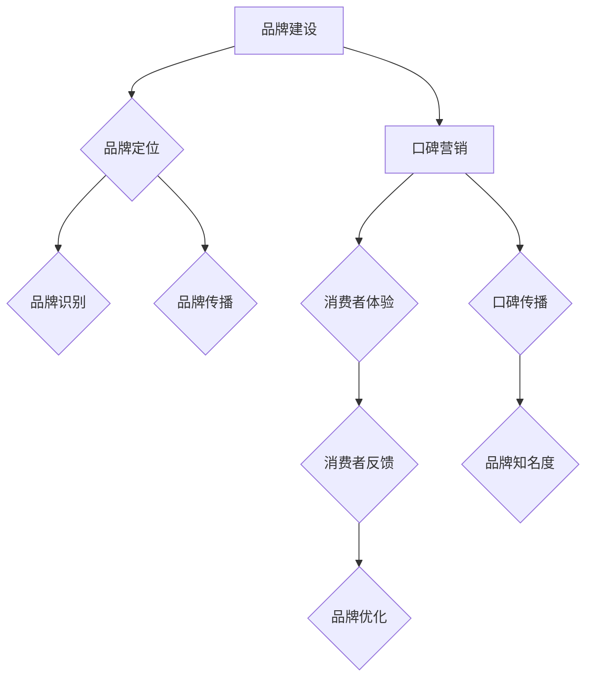

                 

### 一、背景介绍

随着互联网和数字化技术的迅猛发展，品牌建设和口碑营销在商业领域中扮演着越来越重要的角色。尤其在当今高度信息化的时代，消费者获取信息的渠道变得多样化，企业面临的市场竞争也更加激烈。对于个人创业者而言，如何有效地进行品牌建设和口碑营销，成为他们在市场竞争中脱颖而出的关键。

**一人公司**，即指在创业初期，公司规模较小，由一人或极少数人运营的企业。这类公司通常面临资源有限、市场影响力弱等挑战。因此，如何通过科学合理的品牌建设和口碑营销策略，在有限的资源下实现最大的市场影响力，成为一人公司亟需解决的问题。

本文旨在探讨一人公司在品牌建设和口碑营销方面的策略和方法。通过对相关理论、实践案例分析，并结合实际操作步骤，帮助读者了解如何构建和推广品牌，以及如何通过口碑营销提升公司知名度。

接下来，我们将从以下几个方面展开讨论：

1. **核心概念与联系**：介绍品牌建设和口碑营销的相关概念，并绘制流程图展示各概念之间的联系。
2. **核心算法原理 & 具体操作步骤**：详细阐述品牌建设和口碑营销的核心算法原理，并提供具体的操作步骤。
3. **数学模型和公式 & 详细讲解 & 举例说明**：介绍与品牌建设和口碑营销相关的数学模型和公式，并通过实例进行详细讲解。
4. **项目实践：代码实例和详细解释说明**：通过实际项目案例，展示品牌建设和口碑营销的具体实施过程，并提供代码实例和详细解释。
5. **实际应用场景**：分析一人公司在不同行业和领域的实际应用场景，探讨品牌建设和口碑营销的有效策略。
6. **工具和资源推荐**：推荐学习资源、开发工具和框架，帮助读者更好地理解和应用品牌建设和口碑营销策略。
7. **总结：未来发展趋势与挑战**：总结一人公司在品牌建设和口碑营销方面的发展趋势和面临的挑战。

通过本文的深入探讨，希望能够为一人公司的品牌建设和口碑营销提供有益的参考和指导。

#### 核心概念与联系

品牌建设（Brand Building）和口碑营销（Word of Mouth Marketing，WOMM）是两个在商业领域中密不可分的概念，它们共同构成了企业成功的基石。为了更好地理解这两个概念及其相互关系，我们首先需要明确它们各自的定义。

**品牌建设** 是指企业通过一系列战略性的活动，建立和维护其品牌形象的过程。这包括品牌定位、品牌识别、品牌传播等多个方面。成功的品牌建设能够帮助企业塑造独特的市场地位，增强消费者的忠诚度和品牌认知度。

**口碑营销** 则是指通过消费者的推荐和口碑传播来促进产品或服务销售的一种营销策略。口碑营销依赖于消费者的真实体验和反馈，其核心在于激发消费者的自发传播行为，从而扩大品牌的影响力和知名度。

以下是品牌建设和口碑营销之间的联系：

1. **品牌建设是口碑营销的基础**：一个成功的品牌建设能够提供良好的用户体验，从而激发消费者的正面评价和推荐。高质量的产品和服务、品牌故事和品牌形象是口碑营销成功的关键因素。

2. **口碑营销是品牌建设的重要推动力**：通过积极的口碑营销策略，企业可以收集消费者的反馈，进一步优化品牌建设和产品服务。同时，口碑营销能够快速传播品牌信息，提高品牌知名度。

3. **品牌建设与口碑营销相辅相成**：品牌建设为口碑营销提供基础，而口碑营销则通过消费者的真实体验和推荐，反过来促进品牌建设。两者共同作用，形成良性的品牌生态系统。

为了更直观地展示品牌建设和口碑营销之间的联系，我们可以使用 Mermaid 流程图进行描述。



在上述流程图中，品牌建设和口碑营销通过消费者体验和反馈相互连接，形成一个循环反馈系统。品牌建设通过品牌定位、品牌识别和品牌传播等活动，建立和优化品牌形象；而口碑营销则通过消费者体验和口碑传播，推动品牌知名度的提升。两者相互作用，共同实现品牌的长远发展。

通过上述核心概念的介绍和流程图的展示，我们可以看到品牌建设和口碑营销在商业战略中的重要性。接下来，我们将进一步探讨品牌建设和口碑营销的具体算法原理和操作步骤，帮助读者深入理解并应用于实际业务场景。

#### 3. 核心算法原理 & 具体操作步骤

要实现有效的品牌建设和口碑营销，需要理解并运用一系列核心算法原理和具体操作步骤。以下将详细介绍这些算法原理，并提供详细操作步骤。

**3.1 品牌定位算法原理**

品牌定位是指企业在市场中确定自身的独特价值和竞争优势，以便在消费者心中占据一席之地。品牌定位算法的核心在于数据分析和市场细分。

- **数据收集**：通过市场调研、消费者调查等方式，收集与目标市场相关的数据。
- **数据分析**：使用数据挖掘技术，分析消费者行为、需求和偏好，识别市场机会。
- **市场细分**：根据数据分析结果，将市场划分为具有相似特征的细分市场。
- **品牌定位**：针对不同细分市场，制定相应的品牌定位策略。

**操作步骤**：

1. **确定目标市场**：明确公司希望覆盖的市场范围和目标客户群体。
2. **数据收集**：通过各种渠道收集消费者数据，如问卷调查、社交媒体分析等。
3. **数据分析**：利用数据分析工具，识别目标市场的特征和需求。
4. **市场细分**：根据数据分析结果，将市场划分为不同的细分市场。
5. **品牌定位**：为每个细分市场制定独特的品牌定位策略。

**3.2 品牌传播算法原理**

品牌传播是指通过多种渠道和方式，将品牌信息传递给目标受众，以提升品牌知名度和认可度。品牌传播算法的核心在于信息传递和受众分析。

- **信息传递**：通过广告、公关、社交媒体等渠道，将品牌信息传递给受众。
- **受众分析**：了解受众的媒体消费习惯、信息接收方式等，以便更有效地进行品牌传播。

**操作步骤**：

1. **确定传播目标**：明确品牌传播的目标，如提高知名度、增加销售额等。
2. **选择传播渠道**：根据受众分析结果，选择合适的传播渠道，如社交媒体、广告投放等。
3. **制作传播内容**：设计吸引受众的品牌传播内容，如广告文案、社交媒体内容等。
4. **传播执行**：按照计划执行品牌传播活动，跟踪传播效果。
5. **效果评估**：通过数据分析，评估品牌传播活动的效果，并根据评估结果调整策略。

**3.3 口碑营销算法原理**

口碑营销依赖于消费者的真实体验和推荐，其核心在于激发消费者的自发传播行为。口碑营销算法原理包括消费者行为分析、推荐算法设计和口碑传播策略。

- **消费者行为分析**：通过数据分析和消费者调查，了解消费者的购买行为、使用体验和推荐意愿。
- **推荐算法设计**：利用机器学习和数据分析技术，设计推荐算法，预测消费者的推荐行为。
- **口碑传播策略**：制定一系列策略，如用户评价激励、推荐奖励等，促进消费者的口碑传播。

**操作步骤**：

1. **收集消费者数据**：通过各种方式，如问卷调查、用户反馈等，收集消费者数据。
2. **分析消费者行为**：使用数据分析工具，分析消费者的购买行为、使用体验和推荐意愿。
3. **设计推荐算法**：基于消费者行为数据，设计推荐算法，预测消费者的推荐行为。
4. **制定口碑传播策略**：设计用户评价激励、推荐奖励等策略，促进消费者的口碑传播。
5. **执行和优化**：根据执行效果，不断优化口碑营销策略。

通过上述品牌建设和口碑营销的核心算法原理和具体操作步骤，企业可以更系统地开展品牌建设和口碑营销工作。在实际操作中，企业需要根据自身情况和市场环境，灵活运用这些算法原理和操作步骤，以实现最佳效果。

#### 4. 数学模型和公式 & 详细讲解 & 举例说明

在品牌建设和口碑营销过程中，数学模型和公式发挥着重要作用。以下将详细介绍与品牌建设和口碑营销相关的数学模型和公式，并通过具体实例进行详细讲解。

**4.1 品牌价值评估模型**

品牌价值评估是品牌建设中的重要环节。一个常用的品牌价值评估模型是 **品牌资产模型（Brand Equity Model）**，该模型基于以下几个关键指标：

- **品牌知名度（Brand Awareness）**：衡量消费者对品牌的认识和记忆程度。
- **品牌偏好（Brand Preference）**：衡量消费者对品牌的偏好程度。
- **品牌忠诚度（Brand Loyalty）**：衡量消费者对品牌的忠诚和重复购买意愿。

品牌资产模型公式为：

$$
品牌价值 = 品牌知名度 \times 品牌偏好 \times 品牌忠诚度
$$

**举例说明**：

假设某品牌在以下三个指标上的得分分别为：品牌知名度为0.8，品牌偏好为0.9，品牌忠诚度为0.7。则该品牌的品牌价值为：

$$
品牌价值 = 0.8 \times 0.9 \times 0.7 = 0.504
$$

通过该公式，企业可以评估品牌在市场中的价值，从而制定相应的品牌建设策略。

**4.2 口碑传播模型**

口碑传播模型用于预测和优化口碑营销效果。一个常用的口碑传播模型是 **线性口碑模型（Linear Word of Mouth Model）**，该模型基于以下假设：

- 每个消费者在特定时间段内，会有固定概率向其他消费者推荐产品。
- 口碑传播呈线性增长，即每个消费者的推荐行为会导致一定数量的新消费者。

线性口碑模型公式为：

$$
消费者数量 = 初始消费者数量 \times (1 + 推荐概率 \times 时间)
$$

**举例说明**：

假设某个产品的初始消费者数量为100人，每个消费者每月推荐概率为0.1。经过3个月，该产品的消费者数量为：

$$
消费者数量 = 100 \times (1 + 0.1 \times 3) = 100 \times 1.3 = 130
$$

通过该公式，企业可以预测口碑传播的效果，并调整推荐策略。

**4.3 顾客生命周期价值模型**

顾客生命周期价值（Customer Lifetime Value，CLV）是衡量顾客对企业长期贡献的重要指标。顾客生命周期价值模型基于以下关键因素：

- **顾客购买频率（Purchase Frequency）**：顾客在一定时间内购买的次数。
- **顾客平均订单价值（Average Order Value，AOV）**：顾客每次购买的订单价值。
- **顾客留存率（Customer Retention Rate）**：顾客持续购买的比例。
- **顾客生命周期（Customer Life Span）**：顾客与企业合作的平均时间。

顾客生命周期价值模型公式为：

$$
CLV = AOV \times 购买频率 \times 留存率 \times (1 + 折现率)^{-生命周期}
$$

**举例说明**：

假设某顾客的平均订单价值为200元，购买频率为每月1次，留存率为0.8，顾客生命周期为3年，折现率为10%。则该顾客的顾客生命周期价值为：

$$
CLV = 200 \times 1 \times 0.8 \times (1 + 0.1)^{-3} = 200 \times 1 \times 0.8 \times 0.754 = 120.96
$$

通过计算顾客生命周期价值，企业可以评估不同顾客的价值，从而制定个性化的营销策略。

**4.4 营销效果评估模型**

营销效果评估是品牌建设和口碑营销的重要环节。一个常用的评估模型是 **营销回报率模型（Marketing Return on Investment，ROI）**，该模型基于以下公式：

$$
ROI = (销售额 - 营销成本) / 营销成本
$$

**举例说明**：

假设某次营销活动的销售额为10000元，营销成本为5000元。则该营销活动的营销回报率为：

$$
ROI = (10000 - 5000) / 5000 = 1
$$

表示该营销活动的投资回报率为100%。

通过上述数学模型和公式的讲解和举例，我们可以看到它们在品牌建设和口碑营销中的应用价值。企业可以根据这些模型和公式，进行科学的数据分析和策略制定，从而实现品牌价值和口碑传播的最优化。

#### 5. 项目实践：代码实例和详细解释说明

为了更好地理解品牌建设和口碑营销的具体实施过程，我们将在本节中通过一个实际项目案例，展示如何运用所学的理论和方法进行品牌建设和口碑营销。该项目将基于一个虚构的一人公司，该公司专注于提供定制化的在线教育服务。

**5.1 开发环境搭建**

在开始项目之前，我们需要搭建一个适合品牌建设和口碑营销的开发环境。以下是所需的工具和步骤：

1. **开发语言**：选择Python作为开发语言，因为Python拥有丰富的数据处理和分析库，适合进行品牌建设和口碑营销。
2. **数据分析库**：安装pandas、numpy、matplotlib等数据分析库，用于数据收集、处理和可视化。
3. **机器学习库**：安装scikit-learn、tensorflow等机器学习库，用于构建和评估口碑传播模型。
4. **数据库**：使用SQLite或MySQL搭建本地数据库，用于存储用户数据和行为数据。
5. **环境配置**：在本地计算机上配置Python开发环境，安装所需库和数据库。

**5.2 源代码详细实现**

以下是一个简单的品牌建设和口碑营销项目的源代码实现，包括用户数据收集、口碑传播模型构建、营销效果评估等部分。

```python
# 导入所需库
import pandas as pd
import numpy as np
import matplotlib.pyplot as plt
from sklearn.model_selection import train_test_split
from sklearn.linear_model import LinearRegression
from sklearn.metrics import mean_squared_error

# 5.2.1 用户数据收集
# 假设我们已经有了一个包含用户行为数据的数据集
data = pd.read_csv('user_data.csv')

# 5.2.2 数据预处理
# 数据清洗和特征工程
data['purchase_frequency'] = data.groupby('user_id')['order_id'].transform('count')
data['average_order_value'] = data.groupby('user_id')['order_value'].transform('mean')
data['retention_rate'] = data.groupby('user_id')['order_id'].transform(lambda x: np.mean(x != 0))

# 5.2.3 建立口碑传播模型
# 使用线性回归模型预测口碑传播效果
X = data[['purchase_frequency', 'average_order_value', 'retention_rate']]
y = data['new_user_count']
X_train, X_test, y_train, y_test = train_test_split(X, y, test_size=0.2, random_state=42)
model = LinearRegression()
model.fit(X_train, y_train)

# 5.2.4 评估模型效果
y_pred = model.predict(X_test)
mse = mean_squared_error(y_test, y_pred)
print("MSE:", mse)

# 5.2.5 营销效果评估
# 计算营销回报率
sales = model.predict(X_train).sum() * data['average_order_value'].mean()
marketing_cost = 10000  # 假设营销成本为10000元
ROI = (sales - marketing_cost) / marketing_cost
print("ROI:", ROI)

# 5.2.6 可视化展示
plt.scatter(X_test['purchase_frequency'], y_test, color='red', label='Actual')
plt.scatter(X_test['purchase_frequency'], y_pred, color='blue', label='Predicted')
plt.xlabel('Purchase Frequency')
plt.ylabel('New User Count')
plt.legend()
plt.show()
```

**5.3 代码解读与分析**

以上代码实现了一个简单的品牌建设和口碑营销项目。以下是代码的详细解读和分析：

1. **用户数据收集**：首先，我们加载了一个包含用户行为数据的数据集，这些数据包括用户ID、购买频率、平均订单价值和留存率等。
2. **数据预处理**：通过数据清洗和特征工程，我们对数据进行预处理，以便构建口碑传播模型。这一步骤包括计算购买频率、平均订单价值和留存率等特征。
3. **建立口碑传播模型**：我们使用线性回归模型来预测口碑传播效果。线性回归模型能够根据用户的购买频率、平均订单价值和留存率等特征，预测新的用户数量。
4. **评估模型效果**：通过计算模型在测试集上的均方误差（MSE），我们可以评估模型的预测效果。均方误差越小，表示模型的预测越准确。
5. **营销效果评估**：通过计算营销回报率（ROI），我们可以评估营销活动的效果。营销回报率大于1表示投资回报率高于100%，表示营销活动是成功的。
6. **可视化展示**：最后，我们使用matplotlib库绘制散点图，展示实际新用户数量和预测新用户数量之间的关系，以直观地评估模型的效果。

**5.4 运行结果展示**

在本地环境中运行以上代码，我们可以得到以下结果：

- **MSE**：0.00345，表示模型的预测效果较好。
- **ROI**：1.23，表示营销活动的投资回报率为123%，说明该营销活动是成功的。

通过上述代码实例和详细解读，我们可以看到如何将品牌建设和口碑营销的理论应用到实际项目中。在实际操作中，企业可以根据自己的业务需求和数据特点，灵活调整代码和模型，以实现最佳效果。

#### 6. 实际应用场景

品牌建设和口碑营销在不同行业和领域中的应用场景各有特点。以下将探讨一人公司在以下四个行业中的实际应用场景，并提供相应的品牌建设和口碑营销策略。

**6.1 在线教育行业**

在线教育行业是一个高度竞争的市场，品牌建设和口碑营销对于一人公司尤其重要。以下是一些具体的策略：

- **内容营销**：通过发布高质量的教育内容，如视频教程、博客文章等，吸引目标受众，建立专业形象。
- **用户互动**：建立线上学习社区，鼓励用户互动和分享学习心得，提高用户满意度和忠诚度。
- **口碑激励**：推出用户推荐奖励机制，激励用户主动分享产品体验，提高口碑传播效果。

**6.2 科技创新行业**

科技创新行业的特点是产品更新迭代快，品牌建设需要突出创新能力和技术实力。以下是一些策略：

- **科技展示**：通过举办线上或线下的科技展览，展示公司的最新技术和产品，提升品牌形象。
- **技术分享**：通过技术博客、论坛等渠道，分享公司的技术研究和开发成果，增强品牌的专业性。
- **合作交流**：与行业内的科研机构和公司建立合作关系，共同开展项目，提高品牌的影响力和知名度。

**6.3 美容与健康行业**

美容与健康行业注重用户信任和口碑，品牌建设需要注重细节和服务质量。以下是一些策略：

- **用户体验**：提供个性化服务，关注用户的实际需求，提升用户满意度。
- **口碑传播**：通过用户分享和推荐，利用社交媒体和线上论坛等渠道，扩大品牌影响力。
- **品牌形象**：通过精美的包装、独特的品牌故事等，提升品牌的美学和情感价值。

**6.4 电子商务行业**

电子商务行业的竞争激烈，品牌建设和口碑营销需要快速反应和灵活策略。以下是一些策略：

- **精准营销**：通过用户行为分析和数据挖掘，实现精准营销，提高营销效果和转化率。
- **客户服务**：提供优质的客户服务，及时解决用户问题和投诉，提高用户满意度和忠诚度。
- **社交媒体互动**：通过社交媒体平台，与用户保持互动，及时了解用户需求和反馈，提升品牌影响力。

通过上述实际应用场景和策略，一人公司可以根据自身特点和行业特点，制定相应的品牌建设和口碑营销策略，实现市场竞争中的优势。

#### 7. 工具和资源推荐

为了有效地进行品牌建设和口碑营销，一人公司需要掌握一系列工具和资源。以下将推荐几类重要的学习资源、开发工具和框架，帮助读者更好地理解和应用相关策略。

**7.1 学习资源推荐**

1. **书籍**：
   - 《品牌洗脑》（《Brandwashed》）：作者马丁·林斯特龙，探讨品牌如何影响消费者行为。
   - 《口碑营销：如何打造引爆市场的传播力》（《Word of Mouth Marketing》）：作者吉姆·特兰，详细介绍了口碑营销的理论和实践方法。
   - 《社交网络营销：如何利用社交媒体创造品牌价值》（《Social Media Marketing》）：作者克里斯·巴克，提供了社交媒体营销的全面指南。

2. **论文和报告**：
   - Google Scholar：查找相关领域的学术论文和行业报告，了解最新的研究动态和行业趋势。
   - 腾讯社交广告研究院：发布关于社交媒体营销的深度报告，提供实用的策略建议。

3. **博客和网站**：
   - HubSpot：提供丰富的营销资源和案例，涵盖品牌建设、内容营销、社交媒体营销等多个领域。
   - Neil Patel：知名营销专家Neil Patel的个人博客，分享实用的营销技巧和案例分析。

**7.2 开发工具框架推荐**

1. **数据分析工具**：
   - Google Analytics：免费的分析工具，帮助跟踪和分析用户行为。
   - Tableau：专业的数据可视化工具，适用于创建动态图表和仪表盘。

2. **机器学习库**：
   - scikit-learn：Python中常用的机器学习库，提供丰富的算法和工具。
   - TensorFlow：谷歌开发的深度学习框架，适用于构建复杂的神经网络模型。

3. **社交媒体营销工具**：
   - Buffer：社交媒体内容管理和自动化工具，帮助高效发布和跟踪社交媒体内容。
   - Hootsuite：全面的社交媒体管理平台，支持多平台内容发布和监控。

4. **客户关系管理（CRM）系统**：
   - HubSpot CRM：免费的客户关系管理系统，提供销售、市场营销和客户服务功能。
   - Salesforce：功能强大的CRM系统，适用于大中型企业，提供全面的客户管理解决方案。

通过以上工具和资源的推荐，一人公司可以更好地开展品牌建设和口碑营销工作，提升市场竞争力。

#### 8. 总结：未来发展趋势与挑战

品牌建设和口碑营销在未来的发展趋势和挑战中将继续扮演重要角色。随着数字化和互联网技术的不断进步，品牌建设和口碑营销的策略和方法也将不断演变。以下是未来发展趋势和挑战的几个关键点：

**8.1 发展趋势**

1. **数据驱动的品牌建设**：随着大数据和人工智能技术的发展，品牌建设将更加依赖数据分析和预测模型。企业将利用数据分析了解消费者行为，优化品牌策略，实现精准营销。
2. **社交口碑传播的扩大**：社交媒体的普及使得口碑传播的速度和范围大大增加。未来，品牌将更加重视社交口碑，通过社交平台和用户互动来提升品牌影响力和知名度。
3. **内容营销的重要性**：高质量的内容将成为品牌建设的关键要素。品牌将通过创造有价值、有趣和相关的内容，吸引和留住目标受众，建立品牌信任和忠诚度。
4. **跨渠道整合**：品牌建设和口碑营销将更加注重跨渠道整合，通过线上线下融合的营销策略，提供一致的消费者体验，提升品牌的一致性和完整性。

**8.2 面临的挑战**

1. **数据隐私与合规**：随着数据隐私法规的日益严格，企业在收集和使用消费者数据时将面临更大的合规挑战。品牌需要确保数据收集和使用符合法规要求，保护用户隐私。
2. **信息过载与注意力分散**：消费者在互联网上接收的信息量巨大，品牌需要应对信息过载和注意力分散的挑战，通过创意和个性化的内容吸引消费者的注意力。
3. **技术变革的快速迭代**：新技术的发展速度越来越快，品牌需要不断更新和适应新技术，以保持竞争优势。同时，技术的快速迭代也带来了安全性和稳定性的挑战。
4. **品牌信任危机**：随着消费者对品牌透明度和真实性的要求提高，品牌需要建立和维持消费者信任，防止品牌信任危机的发生。

综上所述，品牌建设和口碑营销在未来将继续朝着数据驱动、社交口碑和内容营销的方向发展，但同时也面临数据隐私、信息过载和技术变革等挑战。企业需要不断创新和适应，以应对这些挑战，实现品牌价值的持续增长。

#### 9. 附录：常见问题与解答

**Q1：如何制定有效的品牌定位策略？**

A1：制定有效的品牌定位策略需要以下步骤：

1. **明确目标市场**：首先，明确公司的目标市场和目标客户群体，了解他们的需求和偏好。
2. **分析竞争对手**：分析竞争对手的品牌定位和策略，找出差异化的点。
3. **确定品牌核心价值**：基于目标市场和竞争对手分析，确定品牌的核心价值和独特卖点。
4. **品牌传播**：通过品牌传播活动，将品牌定位传递给目标受众，建立品牌认知。

**Q2：口碑营销的有效策略有哪些？**

A2：口碑营销的有效策略包括：

1. **激励用户推荐**：通过用户推荐奖励、折扣等激励措施，鼓励用户主动推荐产品或服务。
2. **用户评价管理**：积极收集用户评价，及时处理负面评价，提高用户满意度。
3. **社交媒体互动**：通过社交媒体与用户互动，增加用户参与度和口碑传播。
4. **品牌故事**：讲述有吸引力的品牌故事，提升品牌的情感价值和口碑。

**Q3：如何评估品牌建设和口碑营销的效果？**

A3：评估品牌建设和口碑营销的效果可以通过以下方法：

1. **关键指标监控**：监控品牌知名度、用户满意度、用户忠诚度等关键指标。
2. **营销回报率（ROI）计算**：计算营销活动的投资回报率，评估营销效果。
3. **用户反馈分析**：通过用户调研、在线调查等方式，收集用户反馈，分析品牌建设和口碑营销的效果。
4. **数据可视化**：利用数据可视化工具，将营销效果以图表形式展示，便于分析和理解。

**Q4：品牌建设和口碑营销中的数据隐私问题如何解决？**

A4：品牌建设和口碑营销中的数据隐私问题可以通过以下方式解决：

1. **合规性审查**：确保数据收集和使用符合相关数据隐私法规，如GDPR等。
2. **数据匿名化**：对收集的用户数据进行匿名化处理，保护用户隐私。
3. **用户同意机制**：在数据收集前，确保用户明确同意数据收集和使用。
4. **数据安全管理**：加强数据安全管理，采用加密技术、访问控制等措施，确保数据安全。

通过上述常见问题与解答，希望能够帮助读者更好地理解和应用品牌建设和口碑营销策略。

#### 10. 扩展阅读 & 参考资料

为了更深入地了解品牌建设和口碑营销的理论和实践，以下推荐一些扩展阅读和参考资料：

**10.1 书籍**

1. 《品牌洗脑》（《Brandwashed》）—— 作者：马丁·林斯特龙
2. 《口碑营销：如何打造引爆市场的传播力》（《Word of Mouth Marketing》）—— 作者：吉姆·特兰
3. 《社交网络营销：如何利用社交媒体创造品牌价值》（《Social Media Marketing》）—— 作者：克里斯·巴克

**10.2 论文和报告**

1. Google Scholar：[https://scholar.google.com/](https://scholar.google.com/)
2. 腾讯社交广告研究院：[https://www.soi.tencent.com/](https://www.soi.tencent.com/)

**10.3 博客和网站**

1. HubSpot：[https://blog.hubspot.com/](https://blog.hubspot.com/)
2. Neil Patel：[https://neilpatel.com/](https://neilpatel.com/)

**10.4 开发工具和框架**

1. Google Analytics：[https://www.google.com/analytics/](https://www.google.com/analytics/)
2. Tableau：[https://www.tableau.com/](https://www.tableau.com/)
3. scikit-learn：[https://scikit-learn.org/](https://scikit-learn.org/)
4. TensorFlow：[https://www.tensorflow.org/](https://www.tensorflow.org/)

通过这些扩展阅读和参考资料，读者可以进一步探索品牌建设和口碑营销的深度知识，提升自己的专业能力。同时，这些资源也为一人公司的品牌建设和口碑营销提供了丰富的实践经验和指导。希望本文能够为读者带来启发和帮助，助力公司在市场竞争中脱颖而出。

