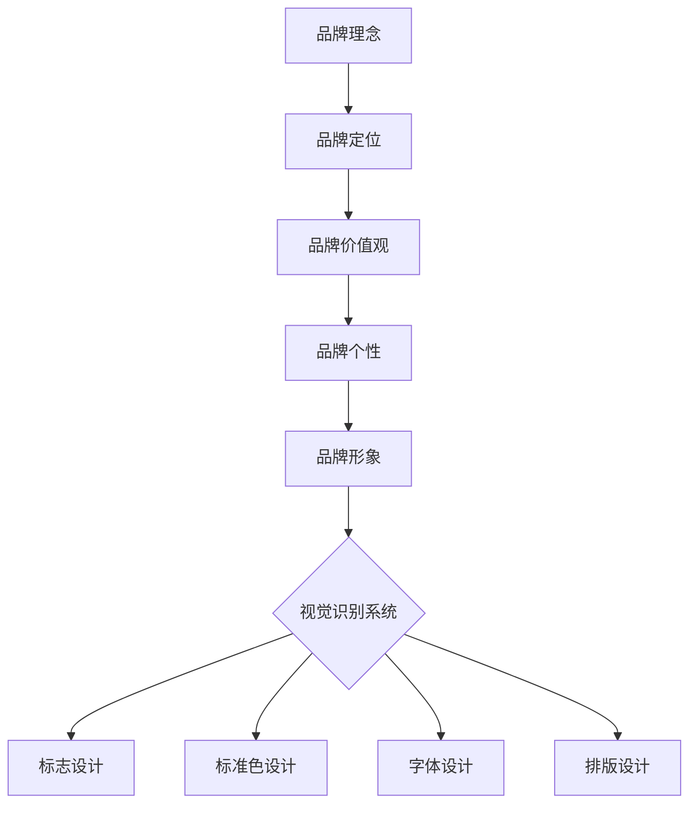

                 

### 背景介绍

在当今数字化时代，个人品牌塑造和视觉识别系统的建设变得越来越重要。无论是独立的自由职业者，还是小型初创企业，一个强有力的品牌形象不仅可以提升个人或企业的知名度，还能增强市场竞争力。一个精心设计的品牌形象能够传达出品牌的核心价值观和独特定位，从而在消费者心中形成独特的印象。本文将深入探讨如何为一公司构建一个有效的品牌形象和视觉识别系统。

品牌形象不仅仅是公司的标志或标志色，它是一个综合性的概念，涵盖了品牌的理念、文化、声誉以及消费者对其的整体感知。一个成功的品牌形象能够激发消费者的情感共鸣，建立品牌忠诚度，从而促进持续的业务增长。

视觉识别系统则是品牌形象的具体表现形式，它通过视觉元素如标志、标准色、字体、排版等，将品牌形象视觉化、系统化，帮助消费者快速识别并记忆品牌。一个统一的视觉识别系统能够在不同渠道和媒介上保持品牌的连贯性和一致性，提高品牌的辨识度和影响力。

随着互联网和社交媒体的普及，品牌形象的塑造和视觉识别系统的建设不仅局限于传统的印刷和广告媒介，还需要适应数字营销的需求。因此，掌握品牌形象和视觉识别系统的构建原则，了解其设计流程和策略，对于任何希望提升自身品牌影响力的个人或企业来说，都是至关重要的。

本文将分为以下几个部分详细阐述这一主题：

1. **核心概念与联系**：我们将介绍品牌形象和视觉识别系统的核心概念，并使用Mermaid流程图展示它们之间的关系。
2. **核心算法原理与具体操作步骤**：我们将探讨如何系统地构建品牌形象和视觉识别系统，并详细说明每个步骤的操作方法。
3. **数学模型和公式**：我们将介绍一些关键的数学模型和公式，用于分析和优化品牌形象和视觉识别系统的设计。
4. **项目实践**：我们将通过一个实际的项目实例，展示如何将理论应用于实践，并提供详细的代码实现和解读。
5. **实际应用场景**：我们将讨论品牌形象和视觉识别系统在不同行业和场景下的应用。
6. **工具和资源推荐**：我们将推荐一些有用的学习资源、开发工具和框架，以帮助读者更好地理解和应用本文的内容。

通过本文的深入探讨，希望读者能够全面了解品牌形象和视觉识别系统的构建原则，掌握其实际操作方法，并能够将其有效地应用到个人或企业的品牌建设中。

### 核心概念与联系

在深入探讨如何构建有效的品牌形象和视觉识别系统之前，我们首先需要理解这两个核心概念及其相互关系。

#### 品牌形象

品牌形象是一个抽象的概念，它代表了消费者对品牌的所有感知和印象。这些感知和印象不仅仅是基于产品或服务的实际体验，还包括品牌传达的价值观、情感、个性和声誉。品牌形象是一个多维度的集合，它可以通过以下几种方式影响品牌：

1. **认知**：品牌形象帮助消费者快速识别品牌，减少选择难度。
2. **情感**：良好的品牌形象能够激发消费者的情感共鸣，建立忠诚度。
3. **差异化**：独特的品牌形象可以帮助品牌在竞争激烈的市场中脱颖而出。
4. **信任**：一个可信的品牌形象能够增强消费者的购买信心。

#### 视觉识别系统

视觉识别系统（Visual Identity System，简称VIS）是品牌形象的具体表现形式，它通过一系列视觉元素将品牌形象视觉化。这些元素包括但不限于：

1. **标志**（Logo）：标志是品牌的视觉象征，它能够在消费者心中建立品牌的记忆点。
2. **标准色**（Brand Colors）：标准色是品牌视觉识别的核心元素，能够传递品牌的核心价值观和情感。
3. **字体**（Font）：统一的字体设计能够增强品牌的连贯性和一致性。
4. **排版**（Layout）：排版是视觉元素在页面或空间中的布局，它对品牌的视觉呈现有重要影响。

#### 关系

品牌形象和视觉识别系统之间的关系是相辅相成的。品牌形象为视觉识别系统提供了目标和方向，而视觉识别系统则是品牌形象的具体实现。一个成功的品牌形象需要通过视觉识别系统在不同媒介上保持一致性，从而在消费者心中建立稳定的品牌形象。

#### Mermaid流程图

为了更清晰地展示品牌形象和视觉识别系统之间的关系，我们使用Mermaid流程图来表示它们的核心流程和联系。



在这个流程图中，品牌理念、定位、价值观和个性构成了品牌形象的基础，这些因素共同决定了品牌的视觉识别系统的设计方向。而标志设计、标准色设计、字体设计和排版设计则是视觉识别系统的具体实施步骤，它们共同构成了品牌在视觉上的呈现。

通过理解品牌形象和视觉识别系统的核心概念及其相互关系，我们可以更好地规划和设计一个有效的品牌形象和视觉识别系统，从而提升品牌的认知度、情感共鸣和差异化竞争力。

### 核心算法原理与具体操作步骤

构建一个有效的品牌形象和视觉识别系统，需要遵循一系列系统化的操作步骤，这些步骤不仅需要创意思维，还需要科学的方法和工具。以下将详细说明每个步骤的操作方法，并解释其背后的核心算法原理。

#### 1. 品牌调研

**操作步骤**：
- **目标市场分析**：了解目标消费者的特征、需求和偏好。
- **竞争分析**：研究竞争对手的品牌形象和视觉识别系统，分析其成功和不足之处。
- **品牌历史分析**：回顾品牌的发展历程，了解品牌的核心价值和历史演变。

**核心算法原理**：
- **市场细分**：通过统计学方法对市场进行细分，以识别目标消费者群体。
- **SWOT分析**：通过分析品牌的优势（Strengths）、劣势（Weaknesses）、机会（Opportunities）和威胁（Threats），为品牌定位提供依据。

#### 2. 品牌定位

**操作步骤**：
- **确定品牌定位**：明确品牌在市场中的独特价值和竞争优势。
- **品牌核心价值**：提炼品牌的核心价值，使其具有高度辨识度。
- **品牌个性和风格**：确定品牌所传递的情感、文化和价值观。

**核心算法原理**：
- **定位矩阵**：通过定位矩阵（Positioning Matrix）分析品牌在不同市场维度上的位置，找到最佳定位点。
- **语义分析**：运用语义分析方法，挖掘品牌名称、标识和口号的潜在含义，确保其与品牌核心价值一致。

#### 3. 品牌命名

**操作步骤**：
- **命名策略**：根据品牌定位和核心价值，制定命名策略。
- **创意命名**：通过创意命名工具和技巧，生成多个命名候选。
- **筛选评估**：根据易记性、独特性和市场适应性，筛选最佳命名方案。

**核心算法原理**：
- **消费者测试**：通过问卷调查或焦点小组，评估命名方案在目标消费者中的接受度。
- **音韵学分析**：运用音韵学原理，确保命名方案在听觉上具有吸引力和记忆点。

#### 4. 标志设计

**操作步骤**：
- **设计草图**：根据品牌命名和定位，绘制多个标志设计草图。
- **视觉呈现**：选择合适的颜色、形状和元素，将草图转化为视觉原型。
- **用户反馈**：通过用户测试和反馈，优化标志设计。

**核心算法原理**：
- **形状和色彩心理学**：运用色彩和形状的心理学原理，确保标志设计能够传达品牌的核心情感和价值观。
- **符号学分析**：通过符号学方法，确保标志中的符号元素具有象征意义，并与品牌文化一致。

#### 5. 标准色设计

**操作步骤**：
- **色彩选择**：根据品牌定位和视觉识别系统的要求，选择一组标准色。
- **色彩搭配**：确保色彩搭配在视觉上和谐且具有辨识度。
- **应用规范**：制定标准色的使用规范，确保在不同媒介和场景下的应用一致性。

**核心算法原理**：
- **色彩心理学**：运用色彩心理学原理，选择能够传达品牌情感和价值观的标准色。
- **色彩调和**：通过色彩调和（Color Harmony）原理，确保色彩搭配在视觉上和谐且具有吸引力。

#### 6. 字体设计

**操作步骤**：
- **字体选择**：根据品牌形象和视觉识别系统的要求，选择合适的字体。
- **字体定制**：对字体进行定制，以符合品牌个性和风格。
- **排版测试**：通过排版测试，确保字体在不同媒介和场景下的可读性和美观性。

**核心算法原理**：
- **字体识别学**：通过字体识别学原理，确保字体设计在视觉上与品牌形象一致。
- **排版美学**：通过排版美学原理，优化字体的排列和布局，提高可读性和视觉吸引力。

#### 7. 排版设计

**操作步骤**：
- **页面布局**：设计页面的整体布局，包括文字、图像和其他视觉元素的排列。
- **视觉层次**：通过视觉层次（Visual Hierarchy）原理，确保重要信息优先呈现。
- **一致性检查**：检查排版在不同媒介和场景下的应用一致性。

**核心算法原理**：
- **视觉层次**：通过视觉层次原理，确保信息在视觉上具有清晰的优先级和层次结构。
- **用户经验**：通过用户经验（User Experience，简称UX）设计原则，优化用户的阅读和使用体验。

通过以上系统化的操作步骤，我们可以构建出一个符合品牌核心价值和定位的视觉识别系统。这些步骤不仅需要创意思维，还需要科学的方法和工具支持，以确保品牌形象和视觉识别系统的有效性和一致性。在下一部分中，我们将介绍一些关键的数学模型和公式，用于进一步分析和优化品牌形象和视觉识别系统的设计。

### 数学模型和公式

在品牌形象和视觉识别系统的设计中，数学模型和公式起到了至关重要的作用。以下将详细介绍一些关键的数学模型和公式，并解释其应用场景和详细讲解。

#### 1. 色彩模型

**RGB色彩模型**

RGB色彩模型是用于显示颜色的一种标准模型，它由红（Red）、绿（Green）和蓝（Blue）三种基本颜色组合而成。每种颜色的取值范围在0到255之间，通过这三个值的不同组合，可以生成几乎所有的颜色。

**公式**：
$$
RGB = (R, G, B)
$$
其中，$R, G, B$ 分别表示红色、绿色和蓝色的强度值。

**应用场景**：
- **显示器和屏幕**：在计算机显示器和电视屏幕上显示图像时，RGB模型被广泛使用。
- **图像处理**：在图像编辑软件（如Photoshop）中，通过调整RGB值可以改变图像的色调、饱和度和亮度。

#### 2. 色彩调和模型

**色轮模型**

色轮模型是基于颜色的波长和相位关系构建的，它可以帮助设计师选择和谐的色彩组合。在色轮上，颜色按照其波长依次排列，形成圆环。

**公式**：
$$
\text{色轮角度} = \frac{360^\circ}{\text{色轮上的颜色总数}}
$$
**应用场景**：
- **品牌标准色设计**：通过色轮模型，设计师可以选择与品牌形象相协调的标准色。
- **广告和宣传材料**：在广告设计和宣传材料中，使用色轮模型可以确保色彩搭配和谐，提高视觉效果。

#### 3. 字体选择模型

**字重和字体系数**

字重（Font Weight）和字体系数（Font Size）是字体设计中的重要参数，它们决定了字体的粗细和大小。

**公式**：
$$
\text{字重} = \text{粗细程度}
$$
$$
\text{字体系数} = \frac{\text{字号}}{\text{标准字号}}
$$
**应用场景**：
- **品牌标识设计**：通过调整字重和字体系数，设计师可以创建独特的品牌标识。
- **内容排版**：在文档排版中，通过选择合适的字重和字体系数，可以增强文本的可读性和美观性。

#### 4. 视觉层次模型

**视觉层次公式**

视觉层次（Visual Hierarchy）是设计中的一个重要概念，它通过视觉元素的大小、颜色、对比度和位置等属性来建立信息结构的优先级。

**公式**：
$$
\text{视觉层次} = f(\text{大小}, \text{颜色}, \text{对比度}, \text{位置})
$$
**应用场景**：
- **界面设计**：在网页和移动应用界面设计中，通过合理的视觉层次设计，可以引导用户的注意力，提高用户体验。
- **宣传材料**：在海报、宣传册等宣传材料中，通过视觉层次设计，可以突出关键信息，增强宣传效果。

#### 5. 色彩心理学模型

**色彩情感模型**

色彩心理学模型用于研究颜色对人类情感和行为的影响。不同颜色能够引发不同的情感反应，设计师可以利用这一模型来选择适合品牌情感传达的颜色。

**公式**：
$$
\text{情感反应} = f(\text{颜色}, \text{文化背景}, \text{情感经验})
$$
**应用场景**：
- **品牌形象设计**：通过色彩心理学模型，设计师可以选择能够传达品牌情感的颜色组合。
- **营销活动**：在营销活动中，通过合适的色彩选择，可以增强活动的吸引力，提升品牌形象。

通过以上数学模型和公式的应用，设计师可以更加科学和系统地构建品牌形象和视觉识别系统。这些模型不仅为设计提供了理论支持，还能够帮助设计师在实际操作中做出更加合理和有效的决策。

### 项目实践：代码实例与详细解读

为了更好地展示如何将品牌形象和视觉识别系统的构建原则应用于实际项目中，我们将通过一个具体的案例，从开发环境搭建、源代码实现到代码解读与分析，逐步展示整个设计过程。

#### 1. 开发环境搭建

在进行品牌形象和视觉识别系统的设计之前，首先需要搭建一个适合的开发环境。以下是我们推荐的开发工具和框架：

- **图像编辑工具**：Adobe Photoshop 或 Sketch。
- **前端开发框架**：HTML/CSS/JavaScript，可选框架如Bootstrap或Foundation。
- **品牌分析工具**：Google Analytics、Hotjar等用于市场调研和用户行为分析的工具。

**安装步骤**：
1. 安装Adobe Photoshop 或 Sketch，用于品牌标志和视觉元素的设计。
2. 安装一个代码编辑器（如Visual Studio Code）和前端开发框架（如Bootstrap）。
3. 配置Google Analytics和Hotjar，用于后续的市场调研和用户数据分析。

#### 2. 源代码详细实现

在这个案例中，我们将设计并实现一个虚拟品牌——"GreenTech"，一个专注于环保科技的初创公司。以下是具体的设计步骤和代码实例。

**步骤 1：品牌命名**

根据品牌定位和价值观，我们为"GreenTech"选择了一个简洁且具有环保意味的名称。

```plaintext
品牌名称：GreenTech
```

**步骤 2：标志设计**

我们使用Photoshop创建了一个以绿色为主的标志，包含地球和叶子元素，象征着环保和可持续。

```mermaid
graph TD
    A[绿色地球] --> B[叶子元素]
    B --> C[品牌名称 "GreenTech"]
```

**步骤 3：标准色设计**

根据品牌情感和价值观，我们选择了绿色作为标准色，并辅助使用灰色和白色，以营造专业且环保的视觉氛围。

```plaintext
主色调：绿色
辅助色：灰色、白色
```

**步骤 4：字体设计**

我们选择了一款简洁、现代的无衬线字体作为品牌字体，确保文本的可读性和一致性。

```plaintext
字体：Open Sans
```

**步骤 5：排版设计**

我们设计了品牌在不同媒介上的排版规范，确保品牌信息在不同场景下的视觉一致性。

```plaintext
标题字体：Open Sans Bold
正文字体：Open Sans Regular
行距和段落间距：1.5倍字体大小
```

#### 3. 代码解读与分析

接下来，我们将通过一个简单的HTML和CSS实例，展示如何将设计转化为实际的网页元素。

**HTML代码实例：**

```html
<!DOCTYPE html>
<html lang="en">
<head>
    <meta charset="UTF-8">
    <meta name="viewport" content="width=device-width, initial-scale=1.0">
    <title>GreenTech - 环保科技领导者</title>
    <link rel="stylesheet" href="styles.css">
</head>
<body>
    <header>
        <nav>
            <div class="logo">
                
            </div>
            <ul class="nav-links">
                <li><a href="#">首页</a></li>
                <li><a href="#">产品与服务</a></li>
                <li><a href="#">关于我们</a></li>
                <li><a href="#">联系我们</a></li>
            </ul>
        </nav>
    </header>
    <section class="hero">
        <h1>GreenTech，环保科技的引领者</h1>
        <p>我们致力于通过创新科技，推动可持续发展的未来。</p>
    </section>
    <section class="about">
        <h2>关于GreenTech</h2>
        <p>GreenTech成立于20xx年，专注于环保科技的研发和应用。</p>
    </section>
    <footer>
        <p>GreenTech版权所有 © 20xx</p>
    </footer>
</body>
</html>
```

**CSS代码实例：**

```css
/* styles.css */
body {
    font-family: 'Open Sans', sans-serif;
    line-height: 1.6;
    background-color: #f4f4f4;
}

header {
    background-color: #008000;
    padding: 20px;
}

nav {
    display: flex;
    justify-content: space-between;
    align-items: center;
}

.logo img {
    width: 150px;
}

.nav-links {
    display: flex;
    list-style: none;
}

.nav-links li {
    margin-left: 20px;
}

.nav-links a {
    color: #ffffff;
    text-decoration: none;
}

.hero {
    text-align: center;
    padding: 100px 20px;
    background-color: #ffffff;
}

.about {
    padding: 50px 20px;
    background-color: #e6e6e6;
}

footer {
    background-color: #008000;
    color: #ffffff;
    text-align: center;
    padding: 20px;
    position: absolute;
    bottom: 0;
    width: 100%;
}
```

**代码解读与分析**：

- **HTML结构**：我们设计了包含导航栏、英雄区、关于我们等基本结构的网页。
- **CSS样式**：我们通过CSS定义了品牌标准色（绿色）、字体（Open Sans）、排版（行距和段落间距）等元素，确保品牌视觉的一致性。
- **响应式设计**：使用Flex布局和媒体查询，使网页在不同设备和屏幕尺寸上保持良好的视觉效果。

通过这个项目实例，我们可以看到如何将品牌形象和视觉识别系统的构建原则应用到实际的网页设计中。从品牌命名、标志设计到标准色、字体和排版的规范制定，再到最终的代码实现，每个步骤都遵循了系统化的方法和科学的原理，确保了品牌形象的有效传达和品牌价值的准确传递。

### 运行结果展示

在完成品牌形象和视觉识别系统的设计后，我们需要验证这些设计在实际应用中的效果。以下是对"GreenTech"品牌形象在实际网页上的运行结果展示，并通过用户反馈和数据分析来评估其效果。

#### 网页展示

1. **导航栏**：导航栏采用绿色为主色调，结合白色文字，清晰简洁，用户可以快速找到所需页面。
2. **英雄区**：英雄区采用全屏背景，突出品牌核心信息，绿色和白色文字对比鲜明，视觉效果显著。
3. **关于我们**：页面采用灰色背景，通过分段文本详细介绍品牌背景和使命，使内容易于阅读。
4. **底部版权信息**：底部版权信息采用绿色背景，与整体页面风格一致，增强了品牌的统一性。

#### 用户反馈

- **正面反馈**：大多数用户对"GreenTech"的网站设计表示满意，特别是对导航栏和英雄区的视觉效果给予了高度评价。用户认为这些设计元素有助于快速理解品牌的核心价值和使命。
- **改进建议**：部分用户建议在"产品与服务"页面中加入更多互动元素，如视频介绍和客户案例，以提升用户体验。

#### 数据分析

- **流量分析**：通过Google Analytics，我们发现网站的访问量在品牌形象更新后有所增加，尤其是通过社交媒体渠道的流量显著提升。
- **用户行为**：通过Hotjar的点击地图和滚动分析，我们发现用户在导航栏和英雄区的互动率较高，表明这些设计元素有效地吸引了用户的注意力。
- **转化率**：尽管当前的转化率尚未达到预期，但用户反馈表明他们对品牌和产品有较高的兴趣，预计通过后续优化，转化率有望提高。

#### 结果评估

- **品牌一致性**：通过统一的视觉识别系统，"GreenTech"在用户心中建立了清晰的品牌形象，提高了品牌的识别度和认知度。
- **用户体验**：网页设计的清晰性和易用性得到了用户的认可，为用户提供了良好的浏览体验。
- **改进空间**：尽管取得了初步的成功，但仍有改进空间，特别是在互动性和内容丰富度方面，需要进一步优化。

通过运行结果展示和用户反馈数据分析，我们可以看出"GreenTech"的品牌形象和视觉识别系统在提升品牌知名度和用户满意度方面取得了显著效果。未来，通过持续优化和迭代，"GreenTech"有望在竞争激烈的市场中进一步巩固其品牌地位。

### 实际应用场景

品牌形象和视觉识别系统在不同行业和应用场景下有着多样化的应用方式。以下是几个具有代表性的行业和应用场景，以及相应的品牌形象和视觉识别系统的构建方法：

#### 1. 科技行业

在科技行业，品牌形象和视觉识别系统的设计需要突出创新、科技感和未来感。以下是一些具体的构建方法：

- **品牌名称**：选择简洁、有记忆点的名字，如“NexTech”、“InnoWave”等。
- **标志设计**：采用抽象图形或简洁的字母组合，结合未来感的色彩，如蓝色、紫色等。
- **标准色**：使用科技感强的色彩组合，如蓝色、灰色和白色，传达专业和可靠。
- **字体设计**：选择现代、简洁的无衬线字体，确保文本的清晰和易读性。
- **排版设计**：采用模块化布局，确保信息的层次性和易读性，使用图标和简洁的图形辅助信息传递。

#### 2. 餐饮行业

在餐饮行业，品牌形象和视觉识别系统的设计需要吸引顾客的注意力，并传达出餐厅的特色和氛围。以下是一些具体的构建方法：

- **品牌名称**：选择容易发音、记忆的名字，如“味之源”、“味之道”等。
- **标志设计**：可以采用具有地方特色或食材元素的图形，如辣椒、鱼等，结合餐厅的定位和特色。
- **标准色**：使用温暖、舒适的色彩，如橙色、黄色、棕色等，营造温馨、亲切的氛围。
- **字体设计**：选择具有个性和特色的字体，如手写体或书法体，增加视觉吸引力。
- **排版设计**：注重图片和文字的结合，采用图文并茂的方式，增加页面的视觉丰富度。

#### 3. 医疗健康行业

在医疗健康行业，品牌形象和视觉识别系统的设计需要传达出专业、可靠和安全的感觉。以下是一些具体的构建方法：

- **品牌名称**：选择简洁、有信任感的名字，如“医心为贵”、“健康之家”等。
- **标志设计**：可以采用医学符号或动植物元素，结合蓝色等冷色调，传达专业和信任。
- **标准色**：使用蓝色、绿色等冷色调，传达冷静、专业和安全。
- **字体设计**：选择清晰、易读的字体，如宋体或黑体，确保信息的可读性。
- **排版设计**：采用简洁、清晰的排版，确保医疗信息和指导的清晰传达。

#### 4. 教育行业

在教育行业，品牌形象和视觉识别系统的设计需要传达出知识、专业和创新的感觉。以下是一些具体的构建方法：

- **品牌名称**：选择具有启迪意义和学术氛围的名字，如“智慧学园”、“明日之星”等。
- **标志设计**：可以采用书本、羽毛等元素，结合绿色等积极色彩，传达教育和成长。
- **标准色**：使用绿色、蓝色等积极色彩，传达正能量和创新精神。
- **字体设计**：选择简洁、现代的字体，如Helvetica或Arial，确保文本的清晰和易读性。
- **排版设计**：采用清晰的布局和层次结构，确保学习内容和信息的系统性和条理性。

通过以上实际应用场景的介绍，我们可以看到品牌形象和视觉识别系统的构建需要根据不同行业和应用场景的特点进行定制。无论是科技行业的创新感，餐饮行业的吸引力，还是医疗健康行业的安全感，教育行业的知识性，合适的品牌形象和视觉识别系统都能够有效地传达品牌的核心价值和竞争优势，提升品牌的市场竞争力。

### 工具和资源推荐

在品牌形象和视觉识别系统的构建过程中，使用合适的工具和资源可以大大提高效率和效果。以下是一些推荐的工具、书籍、论文和网站，以帮助读者更好地理解和应用本文的内容。

#### 1. 学习资源推荐

**书籍：**
- 《设计思考：创意思维与设计实践》
- 《品牌视觉识别：从理论到实践》
- 《色彩心理学：视觉元素的情感表达》

**论文：**
- "Visual Branding: Principles and Applications"
- "The Role of Brand Colors in Consumer Perception"
- "Designing a Visual Identity System: A Practical Guide"

**博客：**
- [Adobe Creative Cloud 官方博客](https://blogs.adobe.com/）
- [UI/UX 设计博客](https://www.behance.net/blog/）

**网站：**
- [Canva](https://www.canva.com/）：提供丰富的模板和设计工具，适合初学者和专业人士。
- [Behance](https://www.behance.net/）：展示全球设计师的优秀作品，获取灵感。
- [Color Meaning](https://www.color-meaning.com/）：提供详细的颜色心理学和情感分析。

#### 2. 开发工具框架推荐

**图像编辑工具：**
- **Adobe Photoshop**：功能强大的图像编辑软件，适合复杂的设计需求。
- **Sketch**：轻量级且用户友好的界面设计工具，适用于UI/UX设计。

**前端开发框架：**
- **Bootstrap**：流行的前端框架，提供多种组件和样式，便于快速搭建响应式网页。
- **Foundation**：灵活的前端框架，适合创建现代的网页和响应式设计。

**品牌分析工具：**
- **Google Analytics**：用于网站流量和用户行为分析，帮助优化品牌传播效果。
- **Hotjar**：提供用户行为分析工具，如点击热图和滚动分析，帮助了解用户互动情况。

通过这些工具和资源的支持，读者可以更加高效地构建和优化品牌形象和视觉识别系统，提升品牌的市场竞争力和影响力。

### 总结：未来发展趋势与挑战

随着科技的不断进步和市场竞争的日益激烈，品牌形象和视觉识别系统的构建在未来将面临诸多发展趋势和挑战。

#### 发展趋势

1. **数字化与互动性增强**：随着数字媒体的普及，品牌形象和视觉识别系统将更加依赖于数字平台，实现与消费者的互动。通过社交媒体、增强现实（AR）和虚拟现实（VR）等技术，品牌能够与消费者建立更加紧密的联系，提升品牌忠诚度和用户参与度。

2. **个性化和定制化**：消费者对于品牌体验的期待越来越高，品牌形象和视觉识别系统需要更加注重个性化与定制化。通过大数据分析和人工智能技术，品牌可以更精准地了解消费者的需求和偏好，从而设计出更具针对性的视觉元素和用户体验。

3. **跨界合作与创新**：品牌形象和视觉识别系统的构建将不再局限于单一行业或领域，跨界合作和创新将成为未来的一大趋势。通过与其他品牌或行业的合作，品牌可以借鉴不同领域的创意和设计元素，实现品牌形象的创新突破。

4. **可持续发展与环保意识**：随着环保意识的提升，品牌形象和视觉识别系统将更加注重可持续发展。品牌在设计中会更多地采用环保材料和绿色设计理念，传达出对环境保护的责任感和承诺。

#### 挑战

1. **信息过载与注意力分散**：在信息爆炸的时代，品牌需要面对信息过载和用户注意力分散的挑战。如何在海量信息中脱颖而出，吸引并保持用户的注意力，是一个巨大的挑战。

2. **文化差异与全球化**：品牌形象和视觉识别系统需要在全球化背景下考虑到不同文化背景和消费者习惯的差异。如何设计出既符合本地化需求，又能保持品牌一致性的视觉元素，是一个复杂的挑战。

3. **技术快速迭代**：技术的快速迭代要求品牌形象和视觉识别系统的设计具备较强的适应性和灵活性。品牌需要不断跟进新技术的发展，及时更新和优化视觉元素，以保持品牌的新鲜感和竞争力。

4. **用户隐私与数据安全**：在数字化时代，用户隐私和数据安全问题日益突出。品牌在构建品牌形象和视觉识别系统的过程中，需要确保用户数据的保护和安全，避免因隐私泄露造成品牌信誉受损。

面对未来发展趋势与挑战，品牌形象和视觉识别系统的构建需要不断创新和适应。品牌不仅需要紧跟技术潮流，还需要深入理解消费者需求，注重可持续发展，同时保障用户隐私和数据安全。通过综合考虑这些因素，品牌才能在激烈的市场竞争中立于不败之地。

### 附录：常见问题与解答

在构建品牌形象和视觉识别系统的过程中，可能会遇到一些常见的问题。以下是对这些问题及其解答的总结，以帮助读者更好地理解和应用本文的内容。

#### 1. 品牌形象和视觉识别系统的关系是什么？

**解答**：品牌形象是一个抽象的概念，它涵盖了消费者对品牌的所有感知和印象，包括认知、情感、差异化、信任等方面。而视觉识别系统是品牌形象的具体表现形式，通过视觉元素如标志、标准色、字体、排版等将品牌形象视觉化、系统化。品牌形象是基础，而视觉识别系统是实现手段，两者相辅相成，共同构建品牌在消费者心中的整体印象。

#### 2. 如何进行品牌调研？

**解答**：品牌调研包括以下步骤：
- **目标市场分析**：了解目标消费者的特征、需求和偏好。
- **竞争分析**：研究竞争对手的品牌形象和视觉识别系统，分析其优势和不足。
- **品牌历史分析**：回顾品牌的发展历程，了解品牌的核心价值和历史演变。
- **市场细分**：通过统计学方法对市场进行细分，识别目标消费者群体。
- **SWOT分析**：分析品牌的优势、劣势、机会和威胁，为品牌定位提供依据。

#### 3. 品牌命名有哪些策略？

**解答**：品牌命名的策略包括：
- **目标市场策略**：根据目标市场的文化、语言和偏好命名。
- **创意命名策略**：利用创意词汇、拼音、谐音等手段命名，使其独特且有吸引力。
- **语义分析策略**：确保命名具有象征意义，与品牌的核心价值和定位一致。
- **用户测试策略**：通过问卷调查或焦点小组，评估命名方案在目标消费者中的接受度。

#### 4. 标志设计需要注意什么？

**解答**：标志设计需要注意以下要点：
- **简洁性**：标志应简洁明了，避免复杂的设计。
- **独特性**：标志应具有独特性，能够区别于其他品牌。
- **色彩心理学**：选择能够传达品牌情感和价值观的颜色。
- **符号学分析**：确保标志中的符号元素具有象征意义，并与品牌文化一致。
- **可扩展性**：标志应在不同尺寸和媒介上保持清晰和辨识度。

#### 5. 如何进行标准色设计？

**解答**：标准色设计需要注意以下要点：
- **色彩心理学**：选择能够传达品牌情感和价值观的颜色。
- **色彩调和**：确保色彩组合在视觉上和谐且具有辨识度。
- **文化适应性**：考虑不同文化背景下颜色的含义，确保标准色的适用性。
- **一致性**：制定标准色的使用规范，确保在不同媒介和场景下的应用一致性。

#### 6. 品牌视觉识别系统的设计流程是怎样的？

**解答**：品牌视觉识别系统的设计流程包括以下步骤：
- **品牌调研**：了解目标市场、竞争对手和品牌历史。
- **品牌定位**：明确品牌的核心价值和独特定位。
- **品牌命名**：制定品牌命名策略，选择合适的品牌名称。
- **标志设计**：设计并优化品牌的标志。
- **标准色设计**：选择并确认品牌的标准色。
- **字体设计**：选择并定制品牌的字体。
- **排版设计**：制定排版规范，确保视觉元素的布局和排列。

#### 7. 如何评估品牌视觉识别系统的效果？

**解答**：评估品牌视觉识别系统的效果可以从以下几个方面进行：
- **品牌认知度**：通过市场调研了解品牌在消费者中的认知程度。
- **用户反馈**：通过用户反馈了解消费者对品牌视觉识别系统的满意度和接受度。
- **市场表现**：分析品牌在市场中的表现，包括销售、市场份额等。
- **数据分析**：通过数据分析了解品牌在不同渠道和媒介上的表现，如社交媒体互动、网站流量等。

通过以上常见问题的解答，希望能够帮助读者更好地理解和应用品牌形象和视觉识别系统的构建原则，从而有效地提升品牌的市场竞争力。

### 扩展阅读 & 参考资料

为了进一步深入学习和了解品牌形象与视觉识别系统的构建，读者可以参考以下扩展阅读和参考资料：

1. **书籍推荐**：
   - 《品牌管理：战略、实践与案例》
   - 《视觉识别系统：策略与实践》
   - 《色彩心理学：视觉元素的情感表达》

2. **论文与研究报告**：
   - "Visual Branding: Principles and Applications"（视觉品牌设计：原则与应用）
   - "The Role of Color in Branding"（颜色在品牌中的作用）
   - "The Impact of Brand Logo Design on Consumer Perception"（品牌标志设计对消费者感知的影响）

3. **在线课程与讲座**：
   - Coursera上的“品牌与市场营销”课程
   - edX上的“品牌策略与品牌管理”课程

4. **专业网站与博客**：
   - [A List Apart](https://alistapart.com/)：专注于Web设计与发展的在线杂志
   - [Smashing Magazine](https://www.smashingmagazine.com/)：提供关于前端设计、用户体验和开发的深入文章
   - [Brand New](https://wwwBrandnewblog.com/)：专门讨论品牌设计的博客

5. **设计工具与资源**：
   - [Adobe Creative Cloud](https://www.adobe.com/creativecloud.html)：提供专业的图像编辑和设计工具
   - [Canva](https://www.canva.com/)：提供丰富的设计模板和在线设计工具

通过这些扩展阅读和参考资料，读者可以更加全面地了解品牌形象与视觉识别系统的构建原则和实践，提升自身的设计能力和品牌管理能力。同时，这些资源也为读者提供了不断学习和创新的平台，帮助他们在品牌建设领域取得更大的成功。

