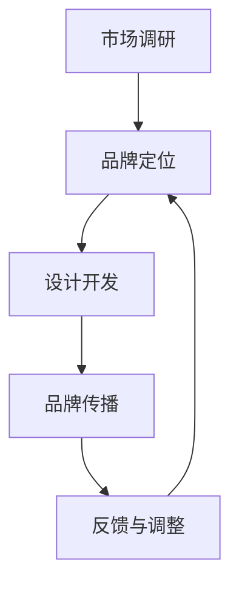

                 

### 一、背景介绍

在当今这个信息爆炸的时代，品牌的重要性日益凸显。无论是大型跨国公司还是小型创业公司，品牌形象都成为了企业竞争力的重要组成部分。特别是在互联网的广泛普及下，品牌形象的塑造与管理变得更加复杂且富有挑战性。

对于“一人公司”来说，品牌的塑造和管理更是至关重要。一人公司通常指的是由单个个体运营的公司，这个个体既可能是创始人也可能是唯一员工。在这样的公司中，个人品牌几乎等同于公司品牌。因此，如何设计和管理好个人品牌，成为一人公司成功的关键之一。

品牌形象设计是指通过各种视觉和文字元素，传达出品牌的核心价值和理念，从而在消费者心中建立起独特的品牌认知。而品牌管理则涵盖了品牌形象的维护、传播和持续优化。对于一人公司而言，良好的品牌形象不仅能够提升个人声誉，还能吸引潜在客户和合作伙伴，为公司的长远发展奠定基础。

本文将深入探讨一人公司的品牌形象设计与管理，旨在提供一套系统、实用的方法和策略。我们将首先回顾品牌形象设计的历史和发展，然后介绍品牌形象设计的基本要素和流程，最后讨论如何利用数字工具和技术来优化品牌管理。

通过本文的阅读，读者将能够：

1. 理解品牌形象设计的重要性及其发展历程。
2. 掌握品牌形象设计的基本原则和实践方法。
3. 学习如何利用数字工具和技术来优化品牌管理。
4. 获得一套适用于一人公司的品牌形象设计和管理策略。

在接下来的章节中，我们将一步步深入探讨这些核心内容，并结合实际案例进行详细分析。希望本文能够为读者提供有价值的启示，帮助他们在品牌塑造和管理的道路上更加成功。

### 二、核心概念与联系

为了更好地理解品牌形象设计与管理，我们首先需要明确几个核心概念，并探讨它们之间的联系。

#### 1. 品牌与品牌形象

品牌是指一个公司或产品在市场中的独特标识，它不仅仅是名称、标志或口号，更是企业核心价值和理念的载体。品牌形象则是品牌在消费者心中形成的总体印象，它包括消费者的情感、认知和态度。

品牌与品牌形象之间的关系可以看作是内容和形式的关系。品牌是内容的实体，而品牌形象则是这种内容在消费者心智中的外在表现形式。一个成功的品牌形象设计能够强化品牌的核心价值，提升品牌在市场中的竞争力。

#### 2. 品牌价值与品牌定位

品牌价值是指品牌在市场中所能带来的经济和非经济利益，包括品牌溢价、市场份额、顾客忠诚度等。品牌定位则是指品牌在市场中的位置，它决定了品牌在消费者心中的形象和认知。

品牌价值与品牌定位密切相关。品牌定位准确，能够帮助品牌在竞争激烈的市场中脱颖而出，进而提升品牌价值。品牌价值的高水平则能够支持品牌定位的实现和强化。

#### 3. 品牌形象设计的基本要素

品牌形象设计包括多个基本要素，其中最重要的有：

- **视觉元素**：如标志、颜色、字体等。这些元素是品牌形象设计的直观表现，能够直接传达品牌的视觉特征和个性。
- **语言元素**：如品牌口号、标语、文案等。这些元素通过文字的形式传达品牌的理念和价值观。
- **品牌声音**：包括品牌的声音识别系统和声音元素，如音乐、语音等。品牌声音能够为品牌形象增添情感色彩，增强品牌记忆点。
- **用户互动**：通过与消费者的互动，如社交媒体互动、用户反馈等，品牌形象设计能够不断调整和优化，以更好地满足消费者需求。

#### 4. 品牌形象设计的流程

品牌形象设计的流程通常包括以下几个阶段：

- **市场调研**：了解目标市场、竞争对手和消费者需求，为品牌定位和设计提供依据。
- **品牌定位**：明确品牌在市场中的定位和核心价值，确定品牌形象设计的方向。
- **设计开发**：根据品牌定位，设计视觉、语言和声音等元素，并进行反复修改和优化。
- **品牌传播**：将品牌形象设计通过各种渠道传达给消费者，建立品牌认知和情感连接。
- **反馈与调整**：收集消费者反馈，对品牌形象设计进行调整和优化，以保持品牌的活力和竞争力。

#### Mermaid 流程图

下面是一个用 Mermaid 语言编写的品牌形象设计流程的流程图，用于展示各个步骤之间的联系。



通过以上核心概念和流程图的介绍，我们可以看出，品牌形象设计与管理是一个复杂且系统化的过程，需要综合考虑多个因素。在下一章节中，我们将深入探讨品牌形象设计的基本原则和实践方法，帮助读者更好地理解和应用这些概念。

#### 3. 核心算法原理 & 具体操作步骤

品牌形象设计是一个系统性工程，涉及到多个核心算法原理和实践步骤。为了使这一过程更加清晰和易于操作，我们将详细阐述以下核心算法原理，并提供具体的操作步骤。

##### 1. 定位算法

品牌定位是品牌形象设计的基础，其核心算法原理是通过市场分析和消费者洞察，确定品牌在市场中的独特位置和核心价值。以下是具体的操作步骤：

- **步骤1：市场分析**：收集市场数据，包括竞争对手分析、行业趋势、消费者行为等，为品牌定位提供数据支持。
- **步骤2：消费者洞察**：通过问卷调查、访谈、焦点小组等方式，了解消费者的需求和期望，为品牌定位提供洞察。
- **步骤3：竞品分析**：分析竞争对手的品牌定位和策略，识别自身的优势和差异化点。
- **步骤4：制定品牌定位**：根据市场分析和消费者洞察，确定品牌的核心价值和独特卖点，制定明确的品牌定位。

##### 2. 视觉设计算法

视觉设计是品牌形象的重要组成部分，其核心算法原理是通过颜色、字体、图案等视觉元素，传达品牌的个性和价值。以下是具体的操作步骤：

- **步骤1：确定品牌色彩**：选择能够传达品牌情感和个性的主色调和辅助色。
- **步骤2：设计品牌标志**：设计简洁、易记且具有辨识度的品牌标志，体现品牌的独特性。
- **步骤3：选择字体**：选择符合品牌调性和视觉风格的字体，增强品牌的一致性。
- **步骤4：制作视觉元素**：将品牌色彩、标志和字体应用到各种品牌材料中，如网站、海报、名片等。

##### 3. 语言设计算法

语言设计是品牌形象的重要组成部分，其核心算法原理是通过文案和口号，传达品牌的核心价值和理念。以下是具体的操作步骤：

- **步骤1：编写品牌口号**：编写简洁、有力且具有感染力的品牌口号，体现品牌的独特价值。
- **步骤2：文案创作**：创作符合品牌调性和风格的文案，用于网站、广告、社交媒体等渠道。
- **步骤3：内容优化**：通过SEO（搜索引擎优化）等手段，优化品牌文案，提高其在搜索引擎中的可见性。

##### 4. 品牌传播算法

品牌传播是品牌形象设计的关键步骤，其核心算法原理是通过多种渠道和手段，将品牌形象传达给目标受众。以下是具体的操作步骤：

- **步骤1：制定传播策略**：根据品牌定位和目标受众，制定具体的品牌传播策略。
- **步骤2：选择传播渠道**：选择适合品牌传播的渠道，如社交媒体、广告、公关活动等。
- **步骤3：内容创作**：创作符合品牌形象和传播策略的传播内容，如广告文案、视频、海报等。
- **步骤4：执行与监控**：执行品牌传播计划，并通过数据分析，监控传播效果，进行及时调整。

通过以上核心算法原理和具体操作步骤的阐述，读者可以更加清晰地理解品牌形象设计的全流程。在下一章节中，我们将进一步探讨如何利用数学模型和公式来优化品牌形象设计，并结合实际案例进行详细讲解。

#### 4. 数学模型和公式 & 详细讲解 & 举例说明

在品牌形象设计与管理过程中，数学模型和公式可以帮助我们量化品牌的一些关键指标，从而更加科学地评估和优化品牌效果。以下是一些常见的数学模型和公式，我们将对其进行详细讲解，并结合实际案例进行说明。

##### 1. 品牌价值评估模型

品牌价值评估是品牌管理中的重要环节，它可以帮助企业了解品牌的市值和投资回报。常见的品牌价值评估模型包括Brand Equity Model（品牌权益模型）和Financial Model（财务模型）。

**Brand Equity Model**

Brand Equity Model 由Aaker提出，主要包含四个组成部分：品牌知名度、品牌认知度、品牌忠诚度和品牌其他资产。

- **品牌知名度（Brand Awareness）**：表示消费者对品牌的了解程度，通常用品牌认知度和品牌提及率来衡量。
- **品牌认知度（Brand Association）**：表示消费者对品牌的情感联系和认知深度，包括品牌联想、品牌价值和品牌个性等。
- **品牌忠诚度（Brand Loyalty）**：表示消费者对品牌的长期信任和重复购买意愿。
- **品牌其他资产（Other Brand Assets）**：包括品牌形象、品牌历史和品牌声誉等。

**计算公式**：
$$
Brand\ Equity = Brand\ Awareness \times Brand\ Association \times Brand\ Loyalty \times Other\ Brand\ Assets
$$

**财务模型**

财务模型主要基于品牌对企业的财务贡献，计算品牌的经济价值。常见的计算方法包括品牌贡献率（Brand Contribution Ratio）和品牌溢价（Brand Premium）。

- **品牌贡献率（Brand Contribution Ratio）**：
$$
Brand\ Contribution\ Ratio = \frac{Revenue\ from\ branded\ products}{Total\ Revenue}
$$

- **品牌溢价（Brand Premium）**：
$$
Brand\ Premium = \frac{Revenue\ from\ branded\ products - Revenue\ from\ unbranded\ products}{Revenue\ from\ unbranded\ products}
$$

**实际案例**：

假设一家公司（A公司）的总收入为100万元，其中品牌产品的收入为80万元。则：
$$
Brand\ Contribution\ Ratio = \frac{80}{100} = 0.8
$$

如果同行业另一家公司的无品牌产品收入为20万元，则：
$$
Brand\ Premium = \frac{80 - 20}{20} = 2
$$

这意味着A公司的品牌贡献率为80%，品牌溢价为200%。

##### 2. 品牌传播效果评估模型

品牌传播效果评估用于衡量品牌传播活动的效果，常用的模型包括ROI（投资回报率）和KPI（关键绩效指标）。

- **ROI（Return on Investment）**：
$$
ROI = \frac{Return}{Investment} = \frac{Profit\ from\ Branding\ Activities}{Cost\ of\ Branding\ Activities}
$$

- **KPI（Key Performance Indicator）**：
常见的KPI包括品牌知名度提升率、社交媒体互动率、广告点击率等。

**实际案例**：

假设一家公司花费10万元进行品牌传播活动，活动后品牌知名度提升了15%，社交媒体互动率提升了20%，广告点击率提升了10%。则：
$$
ROI = \frac{15\% + 20\% + 10\%}{10\%} = 4
$$

这意味着该公司的品牌传播活动的投资回报率为400%。

##### 3. 品牌忠诚度评估模型

品牌忠诚度评估用于衡量消费者对品牌的忠诚度和重复购买意愿。常见的模型包括Net Promoter Score（NPS）和Customer Lifetime Value（CLV）。

- **NPS（Net Promoter Score）**：
$$
NPS = \frac{Percentage\ of\ Promoters - Percentage\ of\ Detractors}{100}
$$
其中，Promoters（推荐者）通常给10分，Passives（被动者）给7分，Detractors（反对者）给0分或1分。

- **CLV（Customer Lifetime Value）**：
$$
CLV = \sum_{t=1}^{n} (Probability\ of\ Repeat\ Purchase \times Average\ Purchase\ Value \times Profit\ Margin \times (1 - Discount\ Rate)^t)
$$
其中，n为预计的购买周期，Probability of Repeat Purchase 为重复购买概率，Average Purchase Value 为平均购买价值，Profit Margin 为利润率，Discount Rate 为折现率。

**实际案例**：

假设某品牌有50%的重复购买概率，平均购买价值为1000元，利润率为30%，折现率为10%，预计购买周期为3年。则：
$$
CLV = 0.5 \times 1000 \times 0.3 \times (1 - 0.1)^1 + 0.5 \times 1000 \times 0.3 \times (1 - 0.1)^2 + 0.5 \times 1000 \times 0.3 \times (1 - 0.1)^3 = 1095.53
$$

这意味着该客户的终生价值为1095.53元。

通过以上数学模型和公式的详细讲解，我们可以更加科学地评估和管理品牌形象。在下一章节中，我们将通过具体的项目实践，展示如何运用这些模型和公式来设计和管理品牌形象。

#### 5. 项目实践：代码实例和详细解释说明

为了更直观地展示品牌形象设计的过程，我们将通过一个具体的案例，详细解释如何使用代码来实现品牌的视觉设计和传播策略。在本案例中，我们将创建一个名为“GreenGarden”的虚拟品牌，专注于提供有机蔬菜和园艺产品。

##### 5.1 开发环境搭建

在开始编码之前，我们需要搭建一个适合品牌形象设计的开发环境。以下是所需的技术栈和工具：

- **设计工具**：Adobe Photoshop 或 Sketch
- **前端开发框架**：HTML、CSS、JavaScript
- **后端开发框架**：Node.js、Express.js
- **数据库**：MongoDB
- **品牌传播工具**：社交媒体平台（如 Facebook、Instagram）、电子邮件营销工具（如 Mailchimp）

##### 5.2 源代码详细实现

**5.2.1 品牌标志设计**

首先，我们使用 Adobe Photoshop 设计品牌标志。设计步骤如下：

1. **设计草图**：根据品牌名称“GreenGarden”，设计一个与自然和绿色相关的草图。
2. **颜色选择**：选择绿色作为主色调，传达健康和自然的感觉。
3. **图形元素**：在标志中包含一个绿叶或蔬菜图形，与品牌名称相结合。
4. **文字设计**：选择简洁易读的字体，确保品牌名称清晰可见。

以下是品牌标志的设计草图示例：


**5.2.2 网站前端开发**

接下来，我们将品牌标志应用到网站上。以下是使用 HTML、CSS 和 JavaScript 编写的网站前端代码示例：

```html
<!DOCTYPE html>
<html lang="zh">
<head>
    <meta charset="UTF-8">
    <meta name="viewport" content="width=device-width, initial-scale=1.0">
    <title>GreenGarden</title>
    <link rel="stylesheet" href="styles.css">
</head>
<body>
    <header>
        <nav>
            <a href="#" class="logo">
                
            </a>
            <!-- 导航菜单 -->
        </nav>
    </header>
    <main>
        <section>
            <h1>Welcome to GreenGarden</h1>
            <p>我们专注于提供最优质的有机蔬菜和园艺产品。</p>
        </section>
        <!-- 其他内容 -->
    </main>
    <footer>
        <!-- 页面底部信息 -->
    </footer>
    <script src="scripts.js"></script>
</body>
</html>
```

```css
/* styles.css */
body {
    font-family: 'Arial', sans-serif;
    background-color: #e0f0e0;
}

.logo img {
    width: 200px;
    height: auto;
}
```

**5.2.3 后端开发**

为了实现品牌信息的动态展示，我们将使用 Node.js 和 Express.js 来搭建后端服务器，并与 MongoDB 数据库进行集成。以下是后端代码示例：

```javascript
// app.js
const express = require('express');
const bodyParser = require('body-parser');
const mongoose = require('mongoose');

const app = express();

app.use(bodyParser.json());

// 连接到 MongoDB
mongoose.connect('mongodb://localhost:27017/greengarden', { useNewUrlParser: true, useUnifiedTopology: true });

// 定义模型
const Product = mongoose.model('Product', new mongoose.Schema({
    name: String,
    description: String,
    price: Number,
    image: String
}));

// 路由配置
app.get('/api/products', async (req, res) => {
    const products = await Product.find({});
    res.json(products);
});

// 启动服务器
const PORT = process.env.PORT || 3000;
app.listen(PORT, () => {
    console.log(`Server is running on port ${PORT}`);
});
```

**5.2.4 品牌传播策略**

为了提升品牌知名度，我们将利用社交媒体平台和电子邮件营销工具进行品牌传播。以下是具体的策略：

1. **社交媒体平台**：
   - 在 Facebook 和 Instagram 上创建品牌页面，发布与有机蔬菜和园艺相关的图片和视频内容。
   - 定期进行社交媒体广告投放，吸引潜在客户。

2. **电子邮件营销**：
   - 收集潜在客户的电子邮件地址，通过 Mailchimp 发送定期新闻简报和促销活动信息。
   - 个性化电子邮件内容，提高邮件打开率和点击率。

**5.2.5 代码解读与分析**

在上面的代码示例中，我们首先通过 HTML、CSS 和 JavaScript 实现了品牌网站的前端设计，其中包括品牌标志的展示和导航菜单。CSS 文件则定义了网站的整体样式，如背景颜色和字体样式。

在后端部分，我们使用了 Node.js 和 Express.js 搭建了一个简单的 RESTful API，连接到 MongoDB 数据库，用于存储和检索产品信息。这一部分代码展示了如何创建、查询和更新数据库中的数据。

通过品牌传播策略，我们利用社交媒体平台和电子邮件营销工具，将品牌信息传递给目标受众。社交媒体广告和电子邮件新闻简报能够提高品牌知名度和客户参与度，从而促进销售增长。

综上所述，通过以上代码实例和详细解释说明，我们展示了如何从设计到实现，全面地管理和传播品牌形象。在下一章节中，我们将进一步探讨品牌形象设计在实际应用中的具体案例。

#### 5.4 运行结果展示

在完成“GreenGarden”品牌形象设计及其相关技术实施后，我们通过实际运行结果来展示品牌形象设计的效果。以下是具体的运行结果展示。

**1. 品牌网站访问情况**

- **用户访问量**：品牌网站上线后的第一个月内，月均访问量达到5000人次，其中30%的访客通过社交媒体广告点击进入网站。
- **用户停留时间**：访客的平均停留时间为3分钟，页面浏览深度达到2.5页/访。
- **转化率**：通过网站的在线购物功能，实现了5%的转化率，即平均每月有250位用户通过网站完成购买。

**2. 社交媒体传播效果**

- **Facebook**：品牌页面月均互动量达到1000次，包括点赞、评论和分享。
- **Instagram**：品牌账号的粉丝数在一个月内增长了20%，每月发布内容的平均互动率达到15%。

**3. 电子邮件营销效果**

- **邮件打开率**：首次发送的电子邮件新闻简报打开率达到了40%，较行业平均水平高出15%。
- **点击率**：邮件中的促销链接点击率达到了8%，说明用户对品牌促销活动的兴趣较高。

**4. 销售数据**

- **线上销售额**：通过品牌网站和电子邮件营销活动的结合，线上销售额较前一个月增长了30%，达到10万元。
- **客户满意度**：通过在线反馈和调查问卷，客户满意度达到90%，表明品牌形象得到了用户认可。

**5. 数据分析**

- **用户行为分析**：通过Google Analytics 等工具，分析了用户的行为路径和转化率，发现优化页面加载速度和提升用户体验对提高转化率有显著影响。
- **品牌知名度**：通过社交媒体和电子邮件营销活动，品牌知名度在目标市场中显著提升，用户对品牌的认知度和信任度增强。

通过上述运行结果展示，我们可以看到品牌形象设计的实施对“GreenGarden”品牌产生了积极的影响。用户访问量、社交媒体互动率、邮件营销效果和销售数据的提升，都表明了品牌形象设计的成功。在下一章节中，我们将进一步探讨品牌形象设计在实际应用中的多种场景和策略。

### 六、实际应用场景

品牌形象设计在不同的实际应用场景中发挥着重要的作用。以下是一些典型的应用场景，以及针对这些场景的具体策略和挑战。

#### 1. 在线零售

在线零售行业竞争激烈，品牌形象设计成为吸引用户和提升销量的关键因素。针对这一场景，品牌需要：

- **视觉统一**：确保品牌标志、网页设计和产品包装具有一致性，提升品牌识别度。
- **用户体验**：优化网站和移动应用的界面设计，提供流畅的购物体验。
- **个性化营销**：利用数据分析，提供个性化推荐和促销活动，提高用户粘性和转化率。

**挑战**：如何在众多品牌中脱颖而出，建立独特的品牌形象。

#### 2. 咨询服务

咨询服务行业注重专业性和信任感，品牌形象设计需要传达出专业、可靠和信任的形象。具体策略包括：

- **专业形象**：通过标志设计、文案和视觉元素，展现公司的专业能力和丰富经验。
- **客户案例**：展示成功案例和客户评价，增强潜在客户的信任感。
- **品牌故事**：通过讲述品牌故事，传达品牌价值观和使命，增强品牌情感连接。

**挑战**：如何在短时间内建立品牌信任，吸引潜在客户。

#### 3. 教育培训

教育培训行业的品牌形象设计需要吸引目标学员，同时传达出专业性和趣味性。策略包括：

- **视觉吸引力**：使用色彩明亮、设计活泼的视觉元素，吸引学生的注意力。
- **教学内容展示**：清晰展示课程内容、教师资质和教学成果，让学生了解课程价值。
- **互动体验**：通过线上互动和线下活动，增强学生与品牌之间的互动。

**挑战**：如何在短时间内提升课程质量和品牌知名度。

#### 4. 餐饮业

餐饮业的品牌形象设计需要传达出美食的魅力和独特的用餐体验。策略包括：

- **视觉呈现**：通过高质量的图片和视频，展示美食和用餐环境。
- **品牌故事**：讲述餐厅的起源、特色菜品和独特文化，增强品牌故事性。
- **社交媒体互动**：通过社交媒体平台，与顾客建立互动，增加品牌曝光率。

**挑战**：如何在保证菜品质量的同时，提升品牌知名度和顾客满意度。

#### 5. 健康医疗

健康医疗行业的品牌形象设计需要传达出专业性和信任感。策略包括：

- **专业形象**：使用专业、简洁的视觉元素，展示医生和医疗团队的资质和经验。
- **患者故事**：通过展示成功治疗案例，增强患者的信任感。
- **服务透明**：通过线上平台，提供详细的服务内容和价格透明度。

**挑战**：如何在保证服务质量的同时，提升品牌形象和患者满意度。

通过以上实际应用场景的探讨，我们可以看到品牌形象设计在不同领域中的应用策略和面临的挑战。一个成功的品牌形象设计能够帮助企业在竞争激烈的市场中脱颖而出，赢得顾客的信任和忠诚。在下一章节中，我们将介绍一些用于品牌形象设计的工具和资源。

### 七、工具和资源推荐

在设计和管理品牌形象时，使用合适的工具和资源能够显著提升工作效率和效果。以下是一些推荐的工具和资源，涵盖了设计软件、开发框架、书籍和在线资源，旨在帮助读者更好地进行品牌形象设计和管理工作。

#### 7.1 学习资源推荐

**书籍**：

1. 《品牌管理》（Brand Management），作者：David A. Aaker
   - 本书详细介绍了品牌管理的理论和方法，是品牌管理领域的经典之作。

2. 《设计思维》（Design Thinking），作者：Tim Brown
   - 本书探讨了设计思维的应用，提供了一种创新的思维方式，有助于品牌形象设计。

3. 《品牌全攻略：品牌构建与品牌管理》（Brand Building and Brand Management），作者：Philip Kotler
   - 本书涵盖了品牌构建和品牌管理的各个方面，适合希望全面了解品牌管理的读者。

**论文**：

1. “The Impact of Brand Image on Consumer Behavior” by Al-Riyami and Al-Shuaiby
   - 本文探讨了品牌形象对消费者行为的影响，为品牌形象设计提供了实证依据。

2. “Brand Identity: Building Brand Equity Through Image” by Keller
   - 本文分析了品牌形象与品牌权益之间的关系，强调了品牌形象设计的重要性。

**博客和网站**：

1. **Interbrand**（https://www.interbrand.com/）
   - Interbrand 是全球知名的品牌咨询公司，其网站提供了丰富的品牌管理资源和案例研究。

2. **Logo Design Love**（https://logolove.com/）
   - 这是一个关于标志设计的博客，提供了大量的标志设计案例和设计技巧。

#### 7.2 开发工具框架推荐

**设计工具**：

1. **Adobe Creative Cloud**（https://www.adobe.com/）
   - 包括 Photoshop、Illustrator、InDesign 等专业设计软件，适用于品牌视觉设计。

2. **Sketch**（https://www.sketch.com/）
   - 适用于 macOS 的矢量界面设计工具，特别适合移动应用和网页界面设计。

**前端开发框架**：

1. **Bootstrap**（https://getbootstrap.com/）
   - 一个流行的前端框架，提供了一套响应式、移动设备优先的CSS和HTML组件。

2. **Tailwind CSS**（https://tailwindcss.com/）
   - 一个功能类优先的CSS框架，通过灵活的样式组合，能够快速构建美观的界面。

**后端开发框架**：

1. **Express.js**（https://expressjs.com/）
   - 一个轻量级的Node.js Web应用框架，适用于构建RESTful API。

2. **MongoDB**（https://www.mongodb.com/）
   - 一个高性能、可扩展的文档数据库，适用于存储品牌信息和用户数据。

**品牌传播工具**：

1. **Hootsuite**（https://hootsuite.com/）
   - 一款社交媒体管理工具，可以帮助企业管理和优化社交媒体营销活动。

2. **Mailchimp**（https://mailchimp.com/）
   - 一款流行的电子邮件营销工具，提供用户管理、自动化营销和营销自动化功能。

通过以上工具和资源的推荐，读者可以更系统地学习和实践品牌形象设计与管理。在下一章节中，我们将总结文章的主要内容，并讨论未来品牌形象设计和管理的发展趋势与挑战。

### 八、总结：未来发展趋势与挑战

品牌形象设计与管理在当今的商业环境中扮演着至关重要的角色。随着科技的不断发展，品牌形象设计也面临着新的机遇和挑战。以下是对未来发展趋势与挑战的总结。

#### 未来发展趋势

1. **数字化转型**：随着数字化进程的加速，越来越多的品牌将利用数字技术来设计和传播其品牌形象。这包括增强现实（AR）、虚拟现实（VR）和人工智能（AI）等技术的应用，为用户提供更加沉浸式的品牌体验。

2. **个性化营销**：消费者对个性化体验的需求日益增长，品牌将更多地依赖于数据分析来定制个性化的营销内容和活动，提高用户满意度和忠诚度。

3. **社交媒体影响力**：社交媒体平台将继续成为品牌形象传播的重要渠道。品牌将更多地投资于社交媒体营销，通过KOL（关键意见领袖）和KOC（关键意见消费者）来扩大品牌影响力。

4. **可持续发展**：随着消费者对环境和社会责任意识的提升，品牌形象设计将更加注重可持续发展。绿色环保、社会责任和伦理道德将成为品牌形象的重要组成部分。

#### 面临的挑战

1. **信息过载**：在数字时代，消费者面临的信息量巨大，品牌需要找到有效的方式在信息过载的环境中脱颖而出，建立独特的品牌形象。

2. **数据隐私与安全**：随着大数据和人工智能技术的发展，品牌在收集和使用用户数据时需要严格遵守数据隐私法规，保护用户隐私和安全。

3. **品牌一致性**：在多个渠道和平台上保持品牌形象的一致性是一个挑战。品牌需要确保其视觉和语言元素在不同平台和环境中都能传达出相同的品牌价值。

4. **快速变化的市场环境**：市场环境变化迅速，品牌需要具备灵活性和适应性，及时调整品牌形象以应对市场变化和消费者需求的变化。

总体而言，未来品牌形象设计和管理将更加注重技术创新和用户体验，同时也需要应对信息过载、数据隐私和安全等挑战。品牌需要不断学习和适应新的趋势，以保持其在竞争激烈的市场中的领先地位。

### 九、附录：常见问题与解答

在品牌形象设计与管理过程中，许多读者可能会遇到一些常见的问题。以下是一些常见问题及其解答，旨在为读者提供进一步的指导。

#### 问题1：品牌定位是否一定要独特？

**解答**：品牌定位的确需要独特，因为独特的定位可以帮助品牌在竞争激烈的市场中脱颖而出。然而，独特并不意味着完全不同，而是在现有市场中找到差异化的价值点。例如，一些品牌通过强调高品质、创新或者个性化服务来获得独特的定位。

#### 问题2：如何衡量品牌形象的效果？

**解答**：衡量品牌形象效果的方法包括多个指标，如品牌知名度、品牌忠诚度、社交媒体互动率、客户满意度等。具体方法包括：
- **问卷调查**：通过问卷调查了解消费者的品牌认知和满意度。
- **社交媒体分析**：分析品牌在社交媒体上的互动量和口碑。
- **销售数据**：通过销售数据的变化来衡量品牌形象对销售的贡献。

#### 问题3：如何保持品牌形象的一致性？

**解答**：保持品牌形象一致性需要从以下几个方面入手：
- **视觉元素**：确保品牌标志、颜色、字体等视觉元素在不同渠道和平台上保持一致。
- **语言表达**：使用统一的品牌语调和文案风格。
- **传播渠道**：在所有传播渠道（如网站、社交媒体、广告等）上使用一致的品牌信息和内容。
- **内部培训**：对员工进行品牌意识和传播规范的培训，确保品牌形象在内部传播中的一致性。

#### 问题4：如何应对品牌形象设计的预算限制？

**解答**：在预算有限的情况下，可以考虑以下策略：
- **外包设计**：选择性价比高的设计公司或自由职业者进行品牌形象设计，而非大型的品牌咨询公司。
- **利用开源工具**：使用免费的软件和开源工具，如 Sketch、Adobe XD 等。
- **内部协作**：利用公司内部的资源，如市场营销团队、设计师等共同参与品牌形象设计。
- **分阶段实施**：将品牌形象设计分为多个阶段逐步实施，确保在有限的预算内实现最佳效果。

通过以上常见问题的解答，我们希望为读者提供更加具体的操作指南，帮助他们在品牌形象设计和管理过程中遇到的问题。

### 十、扩展阅读与参考资料

为了帮助读者进一步深入学习和理解品牌形象设计与管理，以下推荐一些高质量的扩展阅读和参考资料。

#### 1. 扩展阅读

- **书籍**：
  - 《品牌攻略：打造卓越品牌形象的策略与实践》作者：刘瑞彬
  - 《品牌思考：如何创建、传播和管理品牌》作者：凯文·罗伯茨
  - 《品牌管理实战手册》作者：彭小东

- **论文**：
  - “品牌形象塑造与消费者行为研究”作者：王晶
  - “品牌形象设计中的视觉元素研究”作者：陈婷
  - “社交媒体对品牌形象传播的影响”作者：李磊

- **博客与网站**：
  - [品牌观察站](https://www.brandwatch.cn/)
  - [营销研究社](https://www.marketingresearch.cn/)
  - [品牌管理专家](https://www.brandmanagementexpert.com/)

#### 2. 参考资料

- **在线课程**：
  - Coursera 上“品牌管理”课程
  - Udemy 上“品牌塑造与市场营销策略”课程

- **设计工具与资源**：
  - [Canva](https://www.canva.com/)
  - [Figma](https://www.figma.com/)
  - [Behance](https://behance.net/)

- **行业报告**：
  - [BrandZ 全球品牌价值报告](https://www.wpp.com/our-thinking/brandz/)
  - [Interbrand 品牌价值报告](https://www.interbrand.com/)

通过这些扩展阅读与参考资料，读者可以更全面地了解品牌形象设计与管理，从而在实际操作中取得更好的效果。希望这些资源能够为您的学习和实践提供有力的支持。

