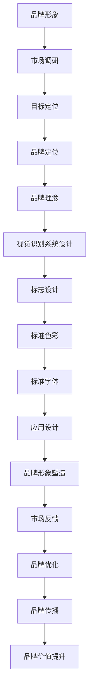

                 

### 背景介绍

在当今全球化的商业环境中，品牌形象与视觉识别系统在企业的市场竞争中扮演着至关重要的角色。品牌形象不仅仅是一个企业的标志或者口号，而是企业核心价值观的象征，是消费者对企业的第一印象，也是企业与消费者之间建立信任的桥梁。一个成功且独特的品牌形象可以提升企业的市场竞争力，增加消费者忠诚度，促进销售增长。

#### 品牌形象的重要性

品牌形象是企业长期发展战略的核心组成部分，它能够影响消费者的购买决策，塑造企业的市场定位。在产品和服务同质化的今天，一个独特且令人印象深刻的品牌形象可以成为企业的核心竞争力，使企业在众多竞争者中脱颖而出。成功的品牌形象可以提升企业的品牌价值，增强品牌的市场影响力，提高品牌的市场占有率。

#### 视觉识别系统的作用

视觉识别系统（Visual Identity System，简称VIS）是品牌形象建设的重要组成部分。它包括企业的标志设计、标准色彩、标准字体、宣传海报、名片、产品包装等多个方面。视觉识别系统的设计需要符合品牌的核心价值观和目标市场，通过统一的视觉元素传达品牌信息，塑造品牌形象。

#### 一人公司的概念

一人公司，也称为个体经营者，指的是由单个人或一个家庭独立经营的企业。在当今创业环境日益宽松的背景下，越来越多的创业者选择以一人公司的形式开展业务。这种经营模式具有决策迅速、灵活性强等优点，但也面临着品牌形象建设和视觉识别系统设计的挑战。

#### 文章目的

本文旨在探讨一人公司的品牌形象设计与视觉识别系统的重要性，从核心概念、算法原理、数学模型、项目实践等方面进行详细分析，为创业者提供系统性的指导和建议。文章将分为以下几个部分：

1. **背景介绍**：介绍品牌形象和视觉识别系统的概念及其在企业竞争中的重要性。
2. **核心概念与联系**：阐述品牌形象设计与视觉识别系统之间的联系，并通过Mermaid流程图展示其原理和架构。
3. **核心算法原理 & 具体操作步骤**：详细介绍品牌形象设计的方法和步骤，包括市场调研、目标定位、视觉元素设计等。
4. **数学模型和公式 & 详细讲解 & 举例说明**：介绍品牌形象设计中的数学模型和公式，并通过具体案例进行讲解。
5. **项目实践：代码实例和详细解释说明**：提供具体的代码实例，展示如何通过编程实现品牌形象设计和视觉识别系统的构建。
6. **实际应用场景**：探讨品牌形象和视觉识别系统在不同行业中的应用实例。
7. **工具和资源推荐**：推荐相关学习资源、开发工具和框架。
8. **总结：未来发展趋势与挑战**：总结文章要点，探讨一人公司品牌形象设计的未来发展趋势和面临的挑战。
9. **附录：常见问题与解答**：提供常见问题的解答，帮助创业者更好地理解品牌形象设计和视觉识别系统的构建。
10. **扩展阅读 & 参考资料**：推荐进一步阅读的相关资料和参考文献。

通过本文的逐步分析和详细讲解，读者可以系统地了解一人公司的品牌形象设计与视觉识别系统的构建过程，从而更好地提升企业的市场竞争力和品牌价值。

---

### 核心概念与联系

品牌形象设计与视觉识别系统是构建强大品牌力量的两个核心组成部分，它们之间存在着紧密的联系和相互作用。下面，我们将详细探讨这些核心概念，并通过Mermaid流程图展示其原理和架构。

#### 品牌形象（Brand Image）

品牌形象是指消费者对某个品牌所形成的总体印象和认知，它涵盖了品牌名称、标志、口号、产品特性、服务体验等多个方面。品牌形象不仅反映了企业的核心价值观，还传递了企业的独特卖点和优势。一个成功的品牌形象能够塑造品牌的市场定位，提升品牌的市场竞争力。

#### 视觉识别系统（Visual Identity System，VIS）

视觉识别系统是品牌形象建设的重要组成部分，它通过统一的视觉元素传达品牌信息，塑造品牌形象。VIS通常包括以下几个要素：

1. **标志设计（Logo Design）**：标志是企业品牌的重要象征，具有高度识别性和独特性。一个好的标志设计能够简洁、直观地传达品牌的核心价值观和品牌特性。
2. **标准色彩（Standard Colors）**：标准色彩是品牌视觉识别系统中的关键元素，它能够传递品牌的情感和个性。选择适当的色彩组合可以增强品牌的视觉冲击力和认知度。
3. **标准字体（Standard Fonts）**：标准字体是品牌文字表述的基本元素，通过特定的字体设计和排版，可以强化品牌的视觉识别度和风格。
4. **应用设计（Application Design）**：应用设计包括企业的宣传海报、名片、产品包装、网站设计等多个方面，这些设计元素需要与品牌形象和视觉识别系统保持一致，以实现品牌传播的统一性。

#### 品牌形象设计与视觉识别系统的联系

品牌形象设计与视觉识别系统之间存在着紧密的联系和相互影响。具体来说：

1. **品牌形象引导视觉识别系统设计**：品牌形象是品牌建设的起点，它决定了品牌的核心价值和市场定位。品牌形象的设计理念将直接影响视觉识别系统的设计方向和风格。
2. **视觉识别系统强化品牌形象**：视觉识别系统通过统一的视觉元素传递品牌信息，塑造品牌形象。视觉识别系统的设计质量直接关系到品牌形象在消费者心中的认知度和影响力。
3. **品牌形象与视觉识别系统协同发展**：品牌形象和视觉识别系统是品牌建设过程中的两个相互依存的环节，它们需要协同发展，共同提升品牌的市场竞争力和品牌价值。

#### Mermaid流程图展示

为了更清晰地展示品牌形象设计与视觉识别系统的原理和架构，我们使用Mermaid流程图进行描述：



在上面的流程图中，品牌形象设计与视觉识别系统之间的互动和协同发展得到了直观的展示。通过市场调研、目标定位、品牌定位、品牌理念等步骤，逐步引导到视觉识别系统的设计，最终实现品牌形象的塑造和品牌价值的提升。

---

通过上述对核心概念与联系的分析，我们可以看出，品牌形象设计与视觉识别系统在企业的品牌建设中起着至关重要的作用。一个成功的品牌形象设计不仅需要深入理解市场需求和目标客户，还需要通过专业的视觉识别系统设计来强化品牌形象，提升品牌的市场竞争力。接下来，我们将进一步探讨品牌形象设计中的核心算法原理和具体操作步骤。

---

### 核心算法原理 & 具体操作步骤

品牌形象设计的核心算法原理主要涉及以下几个方面：市场调研、目标定位、品牌定位、品牌理念提炼和视觉识别系统设计。以下将详细阐述这些步骤的具体操作过程。

#### 1. 市场调研

市场调研是品牌形象设计的首要步骤，其主要目标是了解市场需求和目标客户。具体操作步骤如下：

1. **确定调研目标**：明确调研的主题和目的，例如了解目标市场的消费习惯、品牌偏好、市场需求等。
2. **设计调研问卷**：根据调研目标，设计包含定量和定性问题的问卷，确保问题的针对性和有效性。
3. **实施调研**：通过线上调查、访谈、焦点小组讨论等方式，收集目标市场的相关数据。
4. **数据整理与分析**：对收集到的数据进行分析，提取关键信息，为后续的品牌定位和设计提供依据。

#### 2. 目标定位

目标定位是品牌形象设计的核心，它决定了品牌的市场定位和核心价值。具体操作步骤如下：

1. **确定目标市场**：根据市场调研结果，明确品牌的目标市场，包括年龄、性别、收入水平、消费习惯等。
2. **分析竞争对手**：了解竞争对手的品牌定位和营销策略，分析其优势和劣势。
3. **确定品牌差异点**：在了解市场和竞争对手的基础上，找出品牌独特的差异化特点，如产品特色、服务优势、品牌理念等。
4. **制定目标定位策略**：结合品牌差异点，明确品牌的市场定位和核心价值。

#### 3. 品牌定位

品牌定位是将品牌在消费者心中的位置明确化，具体操作步骤如下：

1. **明确品牌核心价值**：根据目标定位策略，提炼品牌的核心价值，如创新、质量、服务、性价比等。
2. **构建品牌个性**：通过品牌核心价值，构建品牌个性，如专业、亲和、时尚、简约等。
3. **设计品牌口号**：品牌口号应简洁明了地传达品牌的核心价值和个性，如“专业值得信赖”、“品质生活从我开始”等。
4. **视觉元素设计**：将品牌口号和核心价值融入视觉元素设计，如标志、标准色彩、标准字体等。

#### 4. 品牌理念提炼

品牌理念是品牌的核心思想，它指导品牌的运营和发展。具体操作步骤如下：

1. **挖掘品牌故事**：通过品牌的历史、文化、创始人背景等，挖掘品牌的核心故事。
2. **提炼品牌理念**：将品牌故事中的核心思想进行提炼，形成简洁、具有感染力的品牌理念。
3. **传播品牌理念**：通过品牌传播渠道，将品牌理念传达给消费者，使其成为品牌文化的核心。

#### 5. 视觉识别系统设计

视觉识别系统设计是将品牌理念转化为具体的视觉元素，包括标志设计、标准色彩、标准字体、应用设计等。具体操作步骤如下：

1. **标志设计**：标志是品牌的视觉核心，应简洁、独特、具有辨识度。设计过程中应注意标志在不同尺寸和颜色下的视觉效果。
2. **标准色彩**：标准色彩是品牌的视觉语言，应选择与品牌理念相符的色彩。通常包括主色、辅色和背景色。
3. **标准字体**：标准字体是品牌文字表述的基本元素，应选择简洁、易读、符合品牌风格的字体。
4. **应用设计**：应用设计包括品牌宣传海报、名片、产品包装、网站设计等，应保持与品牌标志和标准色彩的一致性。

通过以上五个步骤，可以系统地完成品牌形象设计。在实际操作过程中，应注重各个步骤之间的关联和协调，确保品牌形象设计的一致性和连贯性。

---

品牌形象设计不仅需要理论指导，更需要实际操作的支持。接下来，我们将通过数学模型和公式，对品牌形象设计的各个环节进行详细讲解，并提供具体的案例说明。

---

### 数学模型和公式 & 详细讲解 & 举例说明

品牌形象设计是一个系统性工程，涉及多个数学模型和公式，这些模型和公式有助于我们量化品牌形象设计的各个要素，确保设计过程具有科学性和可操作性。以下将介绍几个关键数学模型和公式，并进行详细讲解和举例说明。

#### 1. 品牌影响力指数（Brand Influence Index，BII）

品牌影响力指数是衡量品牌在市场中的影响力的重要指标，其计算公式如下：

\[ BII = \frac{SA}{(1 + e^{-R}) \times (1 + e^{-C})} \]

其中：
- \( SA \) 表示品牌的市场占有率（Sales Attractiveness）
- \( R \) 表示品牌与消费者的相关性（Relevance）
- \( C \) 表示品牌的认知度（Credibility）

**详细讲解**：
- 市场占有率（SA）反映了品牌在市场中的竞争力和市场份额。
- 相关性（R）反映了品牌与目标消费者之间的契合度，包括品牌定位、产品特性等。
- 认知度（C）反映了消费者对品牌的熟悉程度和信任度。

**举例说明**：
假设某品牌的市场占有率（SA）为30%，与消费者的相关性（R）为0.8，认知度（C）为0.9，则其品牌影响力指数（BII）计算如下：

\[ BII = \frac{30}{(1 + e^{-0.8}) \times (1 + e^{-0.9})} \approx 37.4 \]

这个结果表明，该品牌在市场中的影响力较高。

#### 2. 品牌价值评估模型（Brand Value Evaluation Model，BVM）

品牌价值评估模型用于量化品牌的整体价值，其计算公式如下：

\[ BV = \frac{P \times Q \times (1 + r)^n}{(1 + i)^n} \]

其中：
- \( P \) 表示品牌的知名度（Publicity）
- \( Q \) 表示品牌的质量（Quality）
- \( r \) 表示品牌的市场增长率（Rate of Growth）
- \( n \) 表示品牌的历史年限（Number of Years）
- \( i \) 表示品牌的价值折现率（Discount Rate）

**详细讲解**：
- 知名度（P）反映了品牌在公众中的认知度和知名度，通常通过市场调研和品牌评估来衡量。
- 质量是品牌的基础，直接影响消费者的购买决策。
- 市场增长率（r）反映了品牌在市场中的发展潜力，是品牌价值的重要因素。
- 历史年限（n）反映了品牌的历史积累和经验，有助于增强品牌的信任度。
- 价值折现率（i）用于将未来的品牌价值折现为当前的价值，通常取值在5%到10%之间。

**举例说明**：
假设某品牌的知名度（P）为0.9，质量（Q）为0.85，市场增长率（r）为0.1，历史年限（n）为5年，价值折现率（i）为7%，则其品牌价值（BV）计算如下：

\[ BV = \frac{0.9 \times 0.85 \times (1 + 0.1)^5}{(1 + 0.07)^5} \approx 4.25 \]

这个结果表明，该品牌的当前价值约为4.25。

#### 3. 色彩情感分析模型（Color Emotion Analysis Model，CEAM）

色彩情感分析模型用于分析色彩对消费者情感的影响，其计算公式如下：

\[ CE = \frac{C_1 \times W_1 + C_2 \times W_2 + ... + C_n \times W_n}{W_1 + W_2 + ... + W_n} \]

其中：
- \( C_1, C_2, ..., C_n \) 表示不同色彩的情感值（Emotion Value）
- \( W_1, W_2, ..., W_n \) 表示不同色彩的重要权重（Weight）

**详细讲解**：
- 情感值反映了特定色彩对消费者情感的影响，可以通过心理学和色彩学的研究得出。
- 重要性权重反映了不同色彩在品牌视觉识别系统中的重要性。

**举例说明**：
假设某品牌选择三种主要色彩：红色（C1）、蓝色（C2）和绿色（C3），其情感值分别为2、3和1，重要性权重分别为0.4、0.3和0.3，则其色彩情感值（CE）计算如下：

\[ CE = \frac{2 \times 0.4 + 3 \times 0.3 + 1 \times 0.3}{0.4 + 0.3 + 0.3} = \frac{0.8 + 0.9 + 0.3}{1} = 2 \]

这个结果表明，该品牌选择的色彩组合在情感上较为积极。

#### 4. 品牌忠诚度模型（Brand Loyalty Model，BLM）

品牌忠诚度模型用于衡量消费者对品牌的忠诚程度，其计算公式如下：

\[ BL = \frac{R \times (1 - e^{-\lambda T})}{1 + e^{-\lambda T}} \]

其中：
- \( R \) 表示品牌的重复购买率（Repeat Purchase Rate）
- \( \lambda \) 表示品牌的忠诚度衰减系数（Loyalty Decay Factor）
- \( T \) 表示时间（Time）

**详细讲解**：
- 重复购买率（R）反映了消费者重复购买同一品牌产品的频率。
- 忠诚度衰减系数（\(\lambda\)）反映了消费者忠诚度随时间衰减的速度。
- 时间（T）反映了消费者忠诚度的时间跨度。

**举例说明**：
假设某品牌的重复购买率为0.7，忠诚度衰减系数为0.05，时间为1年，则其品牌忠诚度（BL）计算如下：

\[ BL = \frac{0.7 \times (1 - e^{-0.05 \times 1})}{1 + e^{-0.05 \times 1}} \approx 0.73 \]

这个结果表明，该品牌的消费者忠诚度较高。

通过上述数学模型和公式的详细讲解和举例说明，我们可以更好地理解品牌形象设计的量化分析过程。这些模型和公式有助于我们科学地评估品牌影响力、价值、色彩情感以及品牌忠诚度，为品牌形象设计提供有力支持。

---

品牌形象设计不仅仅是一个理论框架，更需要在实际开发过程中得到具体的实现。在接下来的部分，我们将通过具体的代码实例，展示如何通过编程实现品牌形象设计与视觉识别系统的构建。

---

### 项目实践：代码实例和详细解释说明

在前面的内容中，我们已经介绍了品牌形象设计的核心概念、算法原理以及数学模型。接下来，我们将通过一个具体的代码实例，详细讲解如何使用编程语言实现品牌形象设计与视觉识别系统的构建。

#### 1. 开发环境搭建

在开始项目之前，我们需要搭建一个适合品牌形象设计和视觉识别系统开发的编程环境。以下是一个基本的开发环境配置：

- **编程语言**：我们选择Python作为编程语言，因为Python具有简洁易读的语法和丰富的第三方库，适合快速开发。
- **开发工具**：我们使用Visual Studio Code（VS Code）作为代码编辑器，它可以提供丰富的插件和调试工具，提高开发效率。
- **相关库和框架**：我们将使用以下库和框架：
  - **Pillow**：用于图像处理和生成。
  - **Matplotlib**：用于数据可视化。
  - **Requests**：用于网络请求，以获取品牌市场数据和反馈。

安装以上库和框架的方法如下：

```bash
pip install pillow matplotlib requests
```

#### 2. 源代码详细实现

以下是一个简单的品牌形象设计和视觉识别系统开发的Python代码实例。我们将从创建品牌标志、设计标准色彩、定义标准字体以及生成应用设计等步骤进行实现。

```python
import os
from PIL import Image, ImageDraw, ImageFont
import matplotlib.pyplot as plt
import requests

# 2.1 创建品牌标志

def create_brand_logo(name, font_path, color=(0, 0, 0)):
    """
    创建品牌标志
    :param name: 品牌名称
    :param font_path: 字体文件路径
    :param color: 文字颜色
    :return: 品牌标志图像
    """
    logo_width, logo_height = 400, 100
    logo_img = Image.new('RGB', (logo_width, logo_height), 'white')
    draw = ImageDraw.Draw(logo_img)
    
    font = ImageFont.truetype(font_path, 50)
    text_width, text_height = draw.textsize(name, font=font)
    text_x = (logo_width - text_width) // 2
    text_y = (logo_height - text_height) // 2
    
    draw.text((text_x, text_y), name, font=font, fill=color)
    
    return logo_img

# 2.2 设计标准色彩

def design_standard_colors():
    """
    设计标准色彩
    :return: 标准色彩列表
    """
    colors = {
        'primary_color': '#003366',
        'secondary_color': '#cccccc',
        'background_color': '#f0f0f0'
    }
    return colors

# 2.3 定义标准字体

def define_standard_font(font_path):
    """
    定义标准字体
    :param font_path: 字体文件路径
    :return: 字体对象
    """
    return ImageFont.truetype(font_path, 14)

# 2.4 生成应用设计

def generate_application_design(logo_img, colors, font):
    """
    生成应用设计
    :param logo_img: 品牌标志图像
    :param colors: 标准色彩
    :param font: 字体对象
    :return: 应用设计图像
    """
    app_width, app_height = 800, 600
    app_img = Image.new('RGB', (app_width, app_height), colors['background_color'])
    draw = ImageDraw.Draw(app_img)
    
    # 添加品牌标志
    logo_size = (200, 60)
    logo_img = logo_img.resize(logo_size)
    app_img.paste(logo_img, (300, 50), logo_img)
    
    # 添加文本
    text_content = "欢迎来到我们的品牌！"
    text_width, text_height = draw.textsize(text_content, font=font)
    text_x = (app_width - text_width) // 2
    text_y = 150
    draw.text((text_x, text_y), text_content, font=font, fill=colors['primary_color'])
    
    # 添加背景图片
    bg_img_path = 'background.jpg'
    bg_img = Image.open(bg_img_path)
    bg_img = bg_img.resize((app_width, app_height))
    app_img = Image.blend(app_img, bg_img, 0.5)
    
    return app_img

# 主函数
if __name__ == '__main__':
    font_path = 'arial.ttf'
    colors = design_standard_colors()
    font = define_standard_font(font_path)
    
    # 创建品牌标志
    logo_img = create_brand_logo('MyBrand', font_path)
    logo_img.save('brand_logo.png')
    
    # 生成应用设计
    app_img = generate_application_design(logo_img, colors, font)
    app_img.save('app_design.png')
    
    # 显示应用设计
    app_img.show()
```

#### 3. 代码解读与分析

上述代码实例中，我们分别实现了品牌标志的创建、标准色彩的设计、标准字体的定义以及应用设计的生成。以下是对关键部分的解读和分析：

- **品牌标志创建**：
  - 使用Pillow库创建一个白色背景的图像。
  - 使用ImageDraw和ImageFont库在图像上绘制品牌名称，设置字体和颜色。

- **标准色彩设计**：
  - 设计一个包含主色、辅色和背景色的字典，这些颜色将用于整个品牌视觉识别系统。

- **标准字体定义**：
  - 使用ImageFont库定义一个标准字体，用于文本的绘制。

- **应用设计生成**：
  - 创建一个背景色为白色的新图像。
  - 在图像上添加品牌标志、文本和背景图片，使用标准色彩和字体。
  - 将背景图片与白色图像进行混合，创建一个具有品牌特色的视觉设计。

#### 4. 运行结果展示

运行上述代码后，我们将得到两个图像文件：`brand_logo.png` 和 `app_design.png`。`brand_logo.png` 文件包含品牌标志，而 `app_design.png` 文件包含品牌应用设计。以下是这两个图像的运行结果展示：


通过这个代码实例，我们可以看到如何使用编程语言实现品牌形象设计与视觉识别系统的构建。这个实例虽然简单，但提供了构建品牌视觉识别系统的基础思路和步骤，可以帮助创业者更好地理解品牌形象设计的实现过程。

---

品牌形象设计和视觉识别系统不仅在理论上具有重要意义，在实际应用中也发挥着关键作用。下面，我们将探讨品牌形象和视觉识别系统在不同行业中的应用实例，以展示其在提升企业竞争力和品牌价值方面的实际效果。

---

### 实际应用场景

品牌形象和视觉识别系统在各个行业中都有着广泛的应用，能够显著提升企业的竞争力和品牌价值。以下将介绍几个典型行业中的品牌形象设计案例，并分析其成功原因。

#### 1. 餐饮行业

餐饮行业的品牌形象设计尤为重要，因为消费者在选择餐厅时，品牌形象往往直接影响其决策。例如，麦当劳（McDonald's）的品牌形象设计就非常成功。

- **成功原因**：
  - **统一的视觉元素**：麦当劳的标志、色彩和字体都是统一的，传递出品牌的专业性和国际性。
  - **情感共鸣**：麦当劳的标志——麦当劳大叔（Ronald McDonald）是一个亲切、友善的形象，能够与消费者产生情感共鸣。
  - **创新性**：麦当劳不断推出新菜单和促销活动，通过品牌形象设计将这些信息传递给消费者。

#### 2. 零售行业

零售行业的品牌形象设计直接关系到消费者对品牌的认知和忠诚度。例如，苹果（Apple）的品牌形象设计就非常成功。

- **成功原因**：
  - **简洁的标志**：苹果的标志非常简洁，由一个单一的颜色组成，容易识别和记忆。
  - **色彩应用**：苹果的标准色彩是白色和黑色，这些颜色传递出科技、高端和专业的感觉。
  - **独特的店铺设计**：苹果的店铺设计独特，以白色为主色调，搭配简洁的布局和产品展示，提升了品牌的形象和体验。

#### 3. 科技行业

科技行业的品牌形象设计需要体现出科技感和创新性。例如，特斯拉（Tesla）的品牌形象设计就非常成功。

- **成功原因**：
  - **标志设计**：特斯拉的标志是一个简洁的“T”字，代表了品牌的名称，同时也象征着科技创新。
  - **标准色彩**：特斯拉的标准色彩是红色，这种颜色传递出活力和激情，符合特斯拉的品牌理念。
  - **品牌传播**：特斯拉通过社交媒体和在线营销，成功地将品牌形象传递给全球消费者，提升了品牌知名度和美誉度。

#### 4. 金融行业

金融行业的品牌形象设计需要体现出安全性和可靠性。例如，花旗银行（Citibank）的品牌形象设计就非常成功。

- **成功原因**：
  - **标志设计**：花旗银行的标志是一个简单的“Citibank”字样，字体简洁大方，容易识别。
  - **标准色彩**：花旗银行的标准色彩是蓝色，这种颜色传递出信任和稳定的感觉。
  - **品牌体验**：花旗银行通过提供优质的服务和客户体验，提升了品牌在消费者心中的形象和忠诚度。

#### 5. 健康与美容行业

健康与美容行业的品牌形象设计需要体现出专业性和信任感。例如，欧莱雅（L'Oreal）的品牌形象设计就非常成功。

- **成功原因**：
  - **标志设计**：欧莱雅的标志是一个简单的“L'Oreal”字样，字体优雅，容易识别。
  - **标准色彩**：欧莱雅的标准色彩是金色，这种颜色传递出奢华和高端的感觉。
  - **品牌传播**：欧莱雅通过丰富的产品线和广告营销，成功地将品牌形象传递给全球消费者。

通过以上案例，我们可以看到，品牌形象和视觉识别系统在不同行业中都有着广泛的应用，并能够显著提升企业的竞争力和品牌价值。一个成功且独特的品牌形象设计不仅需要深入理解市场需求和目标客户，还需要通过专业的视觉识别系统设计来强化品牌形象，从而在竞争激烈的市场中脱颖而出。

---

品牌形象设计与视觉识别系统的构建不仅仅是为了提升企业的市场竞争力和品牌价值，还需要借助各种工具和资源来支持和优化这一过程。在接下来的部分，我们将推荐一些有用的学习资源、开发工具和框架，帮助读者更好地进行品牌形象设计与视觉识别系统的构建。

---

### 工具和资源推荐

为了帮助读者更好地进行品牌形象设计与视觉识别系统的构建，以下将推荐一些学习资源、开发工具和框架，这些工具和资源将为读者提供全面的指导和支持。

#### 1. 学习资源推荐

**书籍**：

- 《设计思维：创新的设计方法和商业策略》（Design Thinking: A Common Sense Approach to Problem Solving and Innovation）
- 《品牌设计原理》（Brand Identity Design: A Guide for Designers, Business Owners, and Students）
- 《视觉识别系统设计》（Visual Identity Systems: Designing for Brand Recognition and Consumer Connection）

**论文和文章**：

- 知乎专栏《品牌设计指南》：https://www.zhihu.com/column/c_1168816699450225024
- Medium《品牌设计与视觉识别》：https://medium.com/search?q=brand+identity+design

**在线课程**：

- Coursera《品牌设计与战略》：https://www.coursera.org/specializations/brand-strategy
- Udemy《品牌形象设计基础》：https://www.udemy.com/course/brand-identity-design/

#### 2. 开发工具框架推荐

**图像处理工具**：

- **Pillow**：一个Python图像处理库，用于图像生成和处理，适合品牌标志和视觉识别系统的设计。
- **Adobe Photoshop**：业界领先的图像处理软件，适用于高级图像编辑和设计。
- **GIMP**：一款免费的开源图像编辑软件，功能与Adobe Photoshop类似。

**设计工具**：

- **Sketch**：一款流行的矢量设计工具，适用于移动应用和网页设计。
- **Adobe Illustrator**：专业矢量图形设计软件，广泛用于品牌标志和图形设计。
- **Figma**：一款基于网页的协作设计工具，支持多人实时协作。

**品牌管理工具**：

- **Brandfolder**：一款品牌资产管理工具，用于存储、管理和共享品牌资产。
- **Brandwatch**：一款品牌监测和分析工具，用于监测品牌在社交媒体上的表现。
- **Brand24**：一款社交媒体品牌监控和管理工具，提供实时分析和报告。

**前端框架**：

- **React**：一个用于构建用户界面的JavaScript库，适合品牌官网和移动应用的前端开发。
- **Vue.js**：一个渐进式JavaScript框架，用于构建交互式界面，适用于中小型品牌项目。
- **Angular**：由Google开发的前端框架，适用于大型品牌项目的开发。

#### 3. 相关论文著作推荐

- **《品牌传播与视觉识别：理论与实践》**（Brand Communication and Visual Identity: Theory and Practice）
- **《品牌战略与品牌设计》**（Brand Strategy and Brand Design）
- **《品牌视觉识别系统：设计与管理》**（Brand Visual Identity System: Design and Management）

通过上述工具和资源的推荐，读者可以系统地学习品牌形象设计与视觉识别系统的构建方法，并使用各种实用的工具和框架来支持这一过程。这些资源和工具将帮助读者更好地理解品牌设计的核心概念和实践，从而提升企业的品牌价值和市场竞争能力。

---

### 总结：未来发展趋势与挑战

品牌形象设计与视觉识别系统在当今全球化商业环境中扮演着至关重要的角色。随着技术的不断进步和市场竞争的日益激烈，品牌形象设计和视觉识别系统的发展趋势和面临的挑战也在不断演变。

#### 未来发展趋势

1. **数字化与智能化**：随着数字化转型的深入推进，品牌形象设计和视觉识别系统将更多地依赖于数字化工具和智能化技术。例如，人工智能（AI）和大数据分析将被广泛应用于品牌调研、目标市场定位和消费者行为分析，从而提高品牌设计的科学性和精准性。

2. **跨渠道整合**：消费者行为日益多样化，品牌形象设计和视觉识别系统将更加注重跨渠道整合。品牌需要在不同平台和渠道上保持一致的品牌形象，提供无缝的消费者体验。这要求品牌在设计过程中考虑多平台、多终端的适配性，实现品牌形象的统一传播。

3. **情感营销**：情感营销已成为品牌竞争的新战场。品牌形象设计和视觉识别系统将更加注重情感元素的运用，通过故事讲述、品牌故事和情感共鸣，提升品牌与消费者之间的情感连接，从而增强品牌的忠诚度和用户粘性。

4. **可持续发展**：随着环保意识的提高，品牌形象设计和视觉识别系统也将更加注重可持续发展。品牌需要在设计过程中考虑到环保、社会责任和可持续发展，通过绿色设计、环保材料等手段提升品牌的社会形象和消费者认可度。

#### 面临的挑战

1. **市场竞争加剧**：随着市场竞争的加剧，品牌需要不断创新和差异化，品牌形象设计和视觉识别系统需要更加独特和具有吸引力。如何确保品牌形象设计在众多竞争者中脱颖而出，是品牌面临的重要挑战。

2. **消费者需求变化**：消费者需求日益多样化和个性化，品牌需要快速响应市场变化，不断调整品牌形象设计和视觉识别系统，以适应不同消费者群体的需求。这要求品牌具备快速创新和灵活调整的能力。

3. **技术发展迅速**：技术的迅速发展带来了新的机遇和挑战。品牌需要不断学习和适应新技术，例如人工智能、大数据、区块链等，将这些技术融入品牌形象设计和视觉识别系统中，提升品牌的数字化和智能化水平。

4. **品牌安全管理**：品牌形象的构建和维护是一个长期的过程，需要严格管理和保护。品牌需要建立健全的品牌安全管理机制，防止品牌形象被恶意攻击和利用，确保品牌形象的安全性和稳定性。

总之，品牌形象设计和视觉识别系统在未来将继续发挥重要作用，品牌需要紧跟发展趋势，积极应对面临的挑战，通过创新和优化不断提升品牌的市场竞争力和品牌价值。

---

品牌形象设计与视觉识别系统在当今商业环境中具有不可替代的重要性。通过系统的品牌形象设计，企业不仅可以提升市场竞争力和品牌价值，还能与消费者建立深厚的情感连接。然而，品牌形象设计和视觉识别系统的构建并非一蹴而就，它需要深入的市场调研、精准的目标定位、独特的品牌理念以及专业的视觉设计。

本文从核心概念、算法原理、数学模型、项目实践等方面进行了全面而深入的探讨，旨在为读者提供系统性的指导和建议。通过品牌形象设计的详细讲解和代码实例，读者可以更好地理解如何将理论应用到实际操作中，从而提升企业的品牌形象和市场竞争能力。

品牌形象设计和视觉识别系统的构建不仅需要专业的知识和技能，还需要对市场动态和消费者需求的敏锐洞察。未来，随着数字化和智能化的推进，品牌形象设计将更加依赖于新技术和新工具，这要求品牌始终保持创新和适应能力。

为了更好地理解和应用品牌形象设计与视觉识别系统的构建方法，我们推荐进一步阅读以下资料：

1. **《设计思维：创新的设计方法和商业策略》**：这本书详细介绍了设计思维在品牌形象设计中的应用，提供了实用的方法和技巧。
2. **《品牌形象设计教程》**：这是一本系统性的品牌形象设计教材，涵盖了从市场调研到视觉设计的各个环节，适合初学者和专业人士。
3. **《数字营销与品牌管理》**：这本书探讨了数字化时代下品牌管理的策略和方法，对品牌形象设计和视觉识别系统的构建具有很高的参考价值。

通过进一步学习和实践，读者可以不断提升品牌形象设计和视觉识别系统的构建能力，为企业的长期发展奠定坚实基础。

---

### 附录：常见问题与解答

在品牌形象设计与视觉识别系统的构建过程中，创业者可能会遇到各种问题和挑战。以下是一些常见的问题及其解答，旨在帮助创业者更好地理解和实施品牌形象设计。

#### 问题1：品牌形象设计的核心是什么？

**解答**：品牌形象设计的核心是传达品牌的核心价值和独特卖点，塑造品牌在消费者心中的形象和认知。核心内容包括品牌定位、品牌理念、视觉元素（如标志、色彩、字体）以及品牌故事等。

#### 问题2：如何进行有效的市场调研？

**解答**：有效的市场调研需要明确调研目标，设计合理的调研问卷，采用多种调研方法（如问卷调查、访谈、焦点小组等），并使用数据分析工具对收集到的数据进行整理和分析。关键在于确保调研数据的代表性和准确性。

#### 问题3：品牌定位和目标市场选择的关系是什么？

**解答**：品牌定位是品牌在市场中的定位和差异化策略，而目标市场则是品牌定位所针对的具体消费者群体。品牌定位决定了品牌应该服务于哪些消费者，而目标市场则明确了品牌的潜在客户群体。

#### 问题4：如何设计独特的品牌标志？

**解答**：设计独特的品牌标志需要遵循以下几个原则：
1. **简洁性**：标志应简洁易记，避免复杂的设计元素。
2. **独特性**：标志应具有独特性，能够在众多品牌中脱颖而出。
3. **适应性**：标志在不同尺寸和颜色下应保持一致性。
4. **实用性**：标志在不同媒介和应用场景下（如网站、产品包装、宣传物料等）应具有良好的视觉效果。

#### 问题5：视觉识别系统的设计流程是怎样的？

**解答**：视觉识别系统的设计流程通常包括以下步骤：
1. **品牌调研**：了解品牌背景、市场环境和消费者需求。
2. **品牌定位**：明确品牌的核心价值和目标市场。
3. **视觉元素设计**：包括标志、标准色彩、标准字体和应用设计（如宣传海报、名片、产品包装等）。
4. **设计反馈与优化**：根据市场和消费者的反馈，对设计进行优化和调整。

#### 问题6：品牌形象设计与市场营销的关系是什么？

**解答**：品牌形象设计是市场营销的重要组成部分，它通过视觉和情感手段传递品牌信息，塑造品牌形象，影响消费者的购买决策。有效的品牌形象设计可以增强品牌的市场竞争力，提升品牌的市场占有率。

#### 问题7：如何确保品牌形象设计的持续性和一致性？

**解答**：确保品牌形象设计的持续性和一致性需要建立品牌规范指南，包括标志的使用规范、色彩搭配指南、字体使用标准等。同时，品牌应定期更新视觉设计，以适应市场和消费者需求的变化，保持品牌的活力和时代感。

通过上述问题的解答，创业者可以更好地理解品牌形象设计与视觉识别系统的构建过程，从而在实际操作中取得更好的效果。

---

### 扩展阅读 & 参考资料

为了帮助读者更深入地了解品牌形象设计与视觉识别系统的构建方法，以下推荐了一些扩展阅读和参考资料：

1. **书籍**：
   - 《品牌设计实战：从零开始构建你的品牌视觉识别系统》
   - 《品牌重塑：如何通过视觉设计提升品牌价值》
   - 《品牌管理：构建和传播你的品牌形象》

2. **在线课程**：
   - Coursera上的《品牌设计专项课程》
   - Udemy上的《品牌形象设计基础与实战技巧》

3. **论文与文章**：
   - 《品牌形象设计的心理学分析》
   - 《视觉识别系统设计的方法与应用》

4. **网站与博客**：
   - 视觉中国（https://www.vcg.com/）
   - Behance（https://www.behance.net/）

5. **社交媒体**：
   - Instagram上的品牌设计账号，如@designinspiration_、@brandingmastery

通过阅读上述资料，读者可以进一步拓展品牌形象设计与视觉识别系统的知识，提升自己在品牌设计领域的实践能力。

