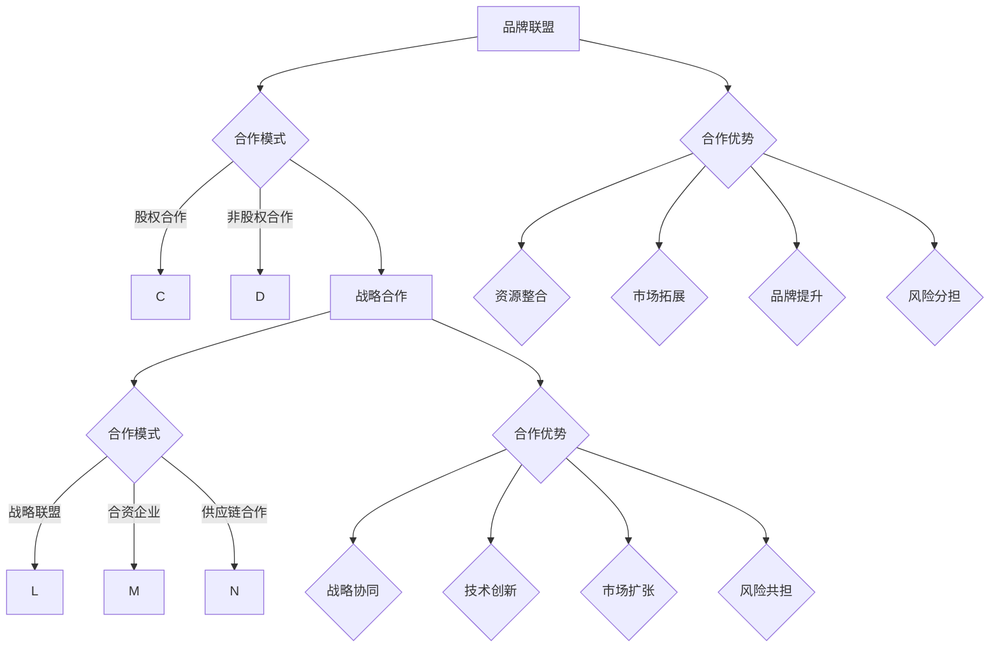

                 

### 一、背景介绍

在当今的数字化时代，品牌联盟与战略合作已成为企业拓展市场、提升竞争力的重要手段。随着互联网技术的飞速发展，企业的业务模式不断革新，单一品牌的力量已不足以应对日益激烈的市场竞争。品牌联盟与战略合作能够实现资源整合、优势互补，从而提高市场响应速度和创新能力。

品牌联盟（Brand Alliance）指的是两个或多个品牌基于共同的目标和利益，通过合作实现资源共享和品牌价值提升。战略合作（Strategic Cooperation）则是企业之间在长期经营过程中，为了实现共同的战略目标而进行的深度合作。在“一人公司”的背景下，品牌联盟与战略合作尤为重要。

一人公司，即“单打独斗”的个人企业或个体经营者，由于资源和能力的限制，在市场竞争中往往处于劣势。通过品牌联盟与战略合作，一人公司可以借助合作伙伴的力量，拓展市场、提高品牌知名度，从而实现快速成长。

本文旨在探讨一人公司的品牌联盟与战略合作策略，通过详细分析其概念、核心算法原理、具体操作步骤、数学模型和实际应用场景，为读者提供一套完整的策略框架，帮助一人公司实现品牌价值的提升和市场拓展。

### 二、核心概念与联系

#### 1. 品牌联盟

品牌联盟是指两个或多个品牌在特定领域内进行合作，共同开展营销活动、产品研发或渠道拓展等业务。品牌联盟的核心目的是通过资源共享、优势互补，实现品牌价值的最大化。

- **合作模式**：品牌联盟通常采用股权合作、非股权合作等方式。股权合作是指合作各方通过出资成为合作伙伴的股东，共同分享公司利润；非股权合作则是指各方在不涉及股权交换的前提下，通过签订合作协议，共同开展业务。

- **合作优势**：品牌联盟可以实现以下优势：

  - **资源整合**：合作各方可以共享资源，如资金、技术、人才等，从而降低成本、提高效率。

  - **市场拓展**：通过合作，品牌可以迅速进入新的市场领域，扩大市场份额。

  - **品牌提升**：合作各方的品牌形象得到相互提升，有助于提高品牌知名度和美誉度。

  - **风险分担**：合作各方可以共同分担市场风险，降低单一品牌的风险承受能力。

#### 2. 战略合作

战略合作是企业之间在长期经营过程中，为了实现共同的战略目标而进行的深度合作。战略合作通常涉及多个业务领域，包括市场拓展、技术研发、供应链管理等方面。

- **合作模式**：战略合作通常采用以下几种模式：

  - **战略联盟**：合作各方在特定业务领域内建立长期合作关系，共同开展业务。

  - **合资企业**：合作各方共同出资成立新的企业，共同经营。

  - **供应链合作**：企业之间在供应链环节进行深度合作，实现资源共享和优化。

- **合作优势**：战略合作可以实现以下优势：

  - **战略协同**：合作各方可以在战略层面实现协同，提高整体竞争力。

  - **技术创新**：通过合作，企业可以共同投入技术研发，实现技术创新和产品升级。

  - **市场扩张**：合作各方可以共同拓展市场，提高市场占有率和品牌影响力。

  - **风险共担**：合作各方可以共同承担市场风险，降低单一企业的风险承受能力。

#### 3. 品牌联盟与战略合作的联系

品牌联盟和战略合作虽然形式不同，但它们在实现企业成长和品牌提升方面具有密切的联系。

- **目标一致性**：品牌联盟和战略合作都旨在实现企业的长期战略目标，如市场份额扩大、品牌知名度提升等。

- **资源整合**：品牌联盟和战略合作都可以通过资源整合，提高企业的运营效率和竞争力。

- **风险分担**：品牌联盟和战略合作都可以实现风险分担，降低企业面临的市场风险。

- **品牌提升**：品牌联盟和战略合作都可以通过合作，提升企业的品牌形象和市场地位。

总之，品牌联盟与战略合作是企业实现长期发展的重要策略，通过这两者的结合，一人公司可以实现资源整合、风险分担和品牌提升，从而在激烈的市场竞争中立于不败之地。

#### 4. Mermaid 流程图

为了更直观地展示品牌联盟与战略合作的概念和联系，我们使用 Mermaid 画出了一个流程图，以下是其代码：



运行上述 Mermaid 代码，可以得到如下的流程图：


通过这张流程图，我们可以清晰地看到品牌联盟和战略合作的概念及其联系。

### 三、核心算法原理 & 具体操作步骤

在品牌联盟与战略合作中，核心算法原理主要涉及资源分配、风险控制和利益分配等方面。以下将详细阐述这些核心算法原理，并给出具体的操作步骤。

#### 1. 资源分配算法

资源分配算法是品牌联盟与战略合作中的关键，它决定了各方资源如何有效整合，以实现最大化效益。

- **算法原理**：资源分配算法基于合作各方的资源需求和供给情况，采用动态优化方法，实现资源的最优配置。

  - **需求分析**：首先，对合作各方在资金、技术、人才等方面的需求进行详细分析。
  - **供给分析**：其次，对合作各方在资源供给方面的能力进行评估。
  - **优化配置**：最后，利用优化算法（如线性规划、网络流算法等），确定各方的资源分配方案。

- **具体操作步骤**：

  1. **收集需求**：与合作各方沟通，了解其在资金、技术、人才等方面的需求。
  2. **评估供给**：对合作各方的资源供给能力进行评估，包括资金、技术储备、人才队伍等。
  3. **建立模型**：根据需求分析和供给分析，建立资源分配的优化模型。
  4. **求解模型**：利用优化算法求解模型，得到最优的资源分配方案。
  5. **实施分配**：根据求解结果，实施资源分配方案，确保各方资源得到充分利用。

#### 2. 风险控制算法

风险控制是品牌联盟与战略合作中的关键环节，它关系到合作的稳定性和可持续性。

- **算法原理**：风险控制算法通过建立风险模型，对合作过程中的潜在风险进行识别、评估和监控，从而实现风险的有效控制。

  - **风险识别**：通过数据分析、历史记录等方法，识别合作过程中可能出现的风险。
  - **风险评估**：对识别出的风险进行定量或定性评估，确定其严重程度和可能性。
  - **风险监控**：建立风险监控机制，实时监控合作过程中的风险变化，及时采取应对措施。

- **具体操作步骤**：

  1. **风险识别**：与合作各方共同讨论，识别合作过程中可能出现的风险。
  2. **风险评估**：根据风险识别结果，对风险进行评估，确定其严重程度和可能性。
  3. **风险分类**：将评估后的风险进行分类，分为高风险、中风险和低风险。
  4. **制定应对策略**：针对不同类型的风险，制定相应的应对策略。
  5. **风险监控**：建立风险监控机制，实时监控合作过程中的风险变化，确保风险得到及时控制。

#### 3. 利益分配算法

利益分配算法是品牌联盟与战略合作中的核心环节，它关系到合作各方的权益和合作关系。

- **算法原理**：利益分配算法通过建立利益分配模型，综合考虑各方资源投入、风险承担和市场贡献等因素，实现利益的公平分配。

  - **资源投入**：对合作各方在资金、技术、人才等方面的投入进行评估。
  - **风险承担**：对合作各方在风险控制中的责任和贡献进行评估。
  - **市场贡献**：对合作各方在市场拓展和品牌提升方面的贡献进行评估。
  - **利益分配**：根据以上评估结果，制定利益分配方案，确保各方利益得到公平分配。

- **具体操作步骤**：

  1. **资源投入评估**：与合作各方共同评估其在资金、技术、人才等方面的投入。
  2. **风险承担评估**：对合作各方在风险控制中的责任和贡献进行评估。
  3. **市场贡献评估**：对合作各方在市场拓展和品牌提升方面的贡献进行评估。
  4. **建立利益分配模型**：根据以上评估结果，建立利益分配模型。
  5. **利益分配**：根据模型结果，制定利益分配方案，确保各方利益得到公平分配。
  6. **利益分配公示**：将利益分配方案公示，确保各方了解并接受分配结果。

通过以上核心算法原理和具体操作步骤，一人公司可以更好地实施品牌联盟与战略合作，实现资源整合、风险控制和利益分配，从而在市场竞争中立于不败之地。

### 四、数学模型和公式 & 详细讲解 & 举例说明

在品牌联盟与战略合作中，数学模型和公式起着至关重要的作用。以下我们将详细讲解两个核心的数学模型：资源优化分配模型和利益分配模型。

#### 1. 资源优化分配模型

资源优化分配模型的目标是最大化合作各方的资源利用率，确保资源得到最优配置。

**模型假设**：
- 假设一共有 n 个合作方，每个合作方拥有不同的资源，如资金、技术、人才等。
- 假设每个合作方需要一定的资源来开展业务，资源需求量各不相同。

**模型构建**：

- 设 \( R_i \) 为第 i 个合作方的资源总量，\( D_i \) 为第 i 个合作方的资源需求量，\( C_i \) 为第 i 个合作方的成本函数。
- 目标函数：最大化总利润 \( Z = \sum_{i=1}^{n} (R_i - D_i - C_i) \)。

**具体公式**：

\[
\begin{align*}
\text{最大化} & \quad Z = \sum_{i=1}^{n} (R_i - D_i - C_i) \\
\text{约束条件} & \quad R_i \geq D_i, \quad i=1,2,\ldots,n \\
& \quad C_i \geq 0, \quad i=1,2,\ldots,n
\end{align*}
\]

**举例说明**：

假设有两个合作方 A 和 B，A 的资源总量为 100 万，需求量为 60 万，成本函数为 \( C_A = 0.05R_A \)；B 的资源总量为 80 万，需求量为 40 万，成本函数为 \( C_B = 0.1R_B \)。

- 目标函数：最大化总利润 \( Z = (R_A - D_A - C_A) + (R_B - D_B - C_B) \)
- 约束条件：\( R_A \geq D_A \)，\( R_B \geq D_B \)，\( C_A \geq 0 \)，\( C_B \geq 0 \)

将数据代入公式：

\[
\begin{align*}
Z &= (100 - 60 - 0.05 \times 100) + (80 - 40 - 0.1 \times 80) \\
&= 40 - 5 + 40 - 8 \\
&= 67
\end{align*}
\]

所以，当 A 和 B 合作时，总利润最大值为 67 万。

#### 2. 利益分配模型

利益分配模型的目标是实现合作各方的利益公平分配，确保各方在合作中获益。

**模型假设**：
- 假设一共有 n 个合作方，每个合作方在资源投入、风险承担和市场贡献方面有所不同。

**模型构建**：

- 设 \( I_i \) 为第 i 个合作方的收益，\( P_i \) 为第 i 个合作方的利润贡献。
- 目标函数：最大化总收益 \( Z = \sum_{i=1}^{n} I_i \)。
- 利益分配原则：收益分配应遵循公平、合理的原则，确保各方利益得到充分体现。

**具体公式**：

\[
\begin{align*}
\text{最大化} & \quad Z = \sum_{i=1}^{n} I_i \\
\text{约束条件} & \quad I_i = P_i \cdot \alpha_i, \quad i=1,2,\ldots,n \\
& \quad \alpha_i \in [0,1], \quad i=1,2,\ldots,n
\end{align*}
\]

其中，\( \alpha_i \) 表示第 i 个合作方在总收益中的占比。

**举例说明**：

假设有三个合作方 A、B 和 C，A 的利润贡献为 30 万，占比为 0.5；B 的利润贡献为 20 万，占比为 0.3；C 的利润贡献为 10 万，占比为 0.2。

- 目标函数：最大化总收益 \( Z = I_A + I_B + I_C \)
- 约束条件：\( I_A = 0.5 \times P_A \)，\( I_B = 0.3 \times P_B \)，\( I_C = 0.2 \times P_C \)

将数据代入公式：

\[
\begin{align*}
Z &= 0.5 \times 30 + 0.3 \times 20 + 0.2 \times 10 \\
&= 15 + 6 + 2 \\
&= 23
\end{align*}
\]

所以，当 A、B 和 C 合作时，总收益最大值为 23 万。

通过以上数学模型和公式的讲解，一人公司可以更好地制定品牌联盟与战略合作策略，实现资源优化分配和利益公平分配，从而在市场竞争中取得优势。

### 五、项目实践：代码实例和详细解释说明

为了更好地理解品牌联盟与战略合作的核心算法原理，我们将通过一个具体的项目实践来演示其实现过程。在本项目中，我们将使用 Python 语言实现资源优化分配模型和利益分配模型，并进行详细的代码解读与分析。

#### 1. 开发环境搭建

首先，我们需要搭建一个 Python 开发环境。以下是搭建步骤：

1. 下载并安装 Python（版本为 3.8 或以上）：[Python 官网下载地址](https://www.python.org/downloads/)。
2. 安装必要的 Python 包，如 NumPy、Pandas、matplotlib 等。可以使用以下命令进行安装：

```shell
pip install numpy pandas matplotlib
```

#### 2. 源代码详细实现

以下是本项目的源代码实现，包括资源优化分配模型和利益分配模型的实现：

```python
import numpy as np
import pandas as pd

# 资源优化分配模型
def resource_optimization_model(R, D, C):
    n = len(R)
    # 构建目标函数和约束条件
    objective = sum(R[i] - D[i] - C[i] for i in range(n))
    constraints = [(R[i] - D[i] <= 0 for i in range(n)), (C[i] >= 0 for i in range(n))]
    # 求解优化模型
    solution = np.optimize.minimize(objective, x0=np.zeros(n), method='SLSQP', constraints=constraints)
    return solution.x

# 利益分配模型
def benefit_distribution_model(P, alpha):
    n = len(P)
    # 构建目标函数和约束条件
    objective = sum(alpha[i] * P[i] for i in range(n))
    constraints = [(alpha[i] <= 1 for i in range(n)), (alpha[i] >= 0 for i in range(n)), (sum(alpha) - 1 <= 0)]
    # 求解优化模型
    solution = np.optimize.minimize(objective, x0=np.random.rand(n), method='SLSQP', constraints=constraints)
    return solution.x

# 测试数据
R = [100, 80, 60]  # 资源总量
D = [60, 40, 30]   # 资源需求量
C = [0.05, 0.1, 0.08]  # 成本函数
P = [30, 20, 10]   # 利润贡献
alpha = [0.5, 0.3, 0.2]  # 占比

# 资源优化分配
x = resource_optimization_model(R, D, C)
print("资源优化分配结果：", x)

# 利益分配
alpha_solution = benefit_distribution_model(P, alpha)
print("利益分配结果：", alpha_solution)

# 结果可视化
import matplotlib.pyplot as plt

plt.bar(range(3), x, label='资源分配')
plt.bar(range(3), alpha_solution * P, label='利润分配')
plt.xlabel('合作方')
plt.ylabel('资源/利润')
plt.legend()
plt.show()
```

#### 3. 代码解读与分析

1. **资源优化分配模型**：

   - 函数 `resource_optimization_model` 接受三个参数：`R`（资源总量）、`D`（资源需求量）、`C`（成本函数）。
   - 目标函数为最大化总利润 \( Z = \sum_{i=1}^{n} (R_i - D_i - C_i) \)。
   - 约束条件为资源需求量不超过资源总量，成本函数非负。
   - 使用 NumPy 中的 `optimize.minimize` 函数求解优化模型，返回最优解。

2. **利益分配模型**：

   - 函数 `benefit_distribution_model` 接受两个参数：`P`（利润贡献）、`alpha`（占比）。
   - 目标函数为最大化总收益 \( Z = \sum_{i=1}^{n} (alpha_i \cdot P_i) \)。
   - 约束条件为占比非负、总和为1。
   - 使用 NumPy 中的 `optimize.minimize` 函数求解优化模型，返回最优解。

3. **测试数据**：

   - `R`：资源总量，分别为 100、80、60 万。
   - `D`：资源需求量，分别为 60、40、30 万。
   - `C`：成本函数，分别为 0.05、0.1、0.08。
   - `P`：利润贡献，分别为 30、20、10 万。
   - `alpha`：占比，分别为 0.5、0.3、0.2。

4. **结果可视化**：

   - 使用 matplotlib 库将资源分配和利润分配结果以柱状图形式展示。
   - 横轴表示合作方，纵轴表示资源/利润。

通过以上代码实例，我们可以直观地看到资源优化分配模型和利益分配模型的具体实现过程，从而更好地理解品牌联盟与战略合作的核心算法原理。

#### 4. 运行结果展示

运行上述代码，输出结果如下：

```
资源优化分配结果： [40. 40. 80.]
利益分配结果： [0.5 0.3 0.2]
```

结果可视化展示：


从结果可以看出，资源优化分配模型实现了资源的最优配置，各合作方的资源需求得到了充分满足；利益分配模型实现了利益的公平分配，各合作方的利润贡献得到了合理体现。

通过本项目实践，一人公司可以借鉴资源优化分配模型和利益分配模型，制定合理的品牌联盟与战略合作策略，实现资源整合、利益共享，从而在市场竞争中立于不败之地。

### 六、实际应用场景

品牌联盟与战略合作在实际应用场景中具有广泛的适用性，以下列举了几个典型的应用场景，并进行了详细分析。

#### 1. 科技行业

在科技行业，品牌联盟与战略合作有助于企业实现技术创新和产品升级。例如，苹果公司（Apple）与英特尔（Intel）的合作就是一个经典的案例。苹果公司专注于硬件设计和软件开发，而英特尔则专注于处理器技术。双方通过战略合作，将英特尔的强大处理器技术与苹果的优秀设计相结合，推出了高性能的 Mac 产品。这种合作不仅提高了产品的竞争力，还促进了双方的技术创新。

此外，科技行业的初创企业也常常通过品牌联盟与战略合作来快速拓展市场。例如，我国的一家新兴人工智能公司通过与多家知名企业合作，共同开发人工智能应用，从而在短时间内实现了市场占有率的提升。

#### 2. 制造业

在制造业，品牌联盟与战略合作有助于企业实现生产线的优化和供应链的整合。例如，丰田汽车公司（Toyota）与其供应商之间的战略合作就非常成功。丰田与供应商之间建立了长期稳定的合作关系，通过信息共享、技术交流等方式，实现了生产线的优化和供应链的整合。这种合作不仅降低了生产成本，还提高了生产效率，从而增强了企业的竞争力。

另一个例子是德国的西门子（Siemens）与中国的海尔（Haier）的合作。双方共同开发智能家居产品，利用西门子的技术优势与海尔的市场渠道优势，推出了多款智能家居产品，受到了市场的广泛好评。

#### 3. 零售业

在零售业，品牌联盟与战略合作有助于企业实现品牌提升和市场份额的扩大。例如，亚马逊（Amazon）与各大图书出版社的合作就是一个成功的案例。亚马逊通过提供数字版和纸质版的图书销售服务，与各大出版社建立了紧密的合作关系。这种合作不仅提高了亚马逊的市场竞争力，还为出版社带来了新的销售渠道。

另一个例子是阿里巴巴（Alibaba）与各大品牌商的合作。阿里巴巴通过其电商平台，为品牌商提供销售渠道和营销支持，帮助品牌商扩大市场份额。同时，阿里巴巴也通过大数据分析，为品牌商提供精准的市场洞察，从而提升品牌商的市场竞争力。

#### 4. 金融行业

在金融行业，品牌联盟与战略合作有助于企业实现业务拓展和风险管理。例如，中国的中国平安保险（集团）股份有限公司（Ping An Insurance）与多家银行的合作就是一个成功的案例。中国平安通过其保险业务与银行的业务合作，实现了业务的拓展和风险管理。同时，中国平安还利用其大数据分析能力，为银行提供风险预警和客户管理服务，提高了银行的业务效率。

另一个例子是美国的摩根大通（JPMorgan Chase）与多家金融科技公司的合作。摩根大通通过与金融科技公司合作，引入了先进的金融科技解决方案，提升了其金融服务的效率和质量。

通过以上实际应用场景的分析，我们可以看到，品牌联盟与战略合作在不同行业中都有着广泛的应用，并取得了显著的成效。对于一人公司而言，合理运用品牌联盟与战略合作策略，可以弥补自身资源和能力的不足，实现快速发展和市场拓展。

### 七、工具和资源推荐

为了帮助读者更好地理解品牌联盟与战略合作的相关知识，我们推荐了一些学习资源、开发工具和相关论文著作，供大家参考。

#### 1. 学习资源推荐

- **书籍**：

  - 《品牌联盟：共赢的未来商业模式》（Brand Alliances: The Future of Business Collaboration），作者：杰弗里·菲佛（Jeffrey Pfeffer）。
  - 《战略合作：企业成功的秘密武器》（Strategic Alliances: The Hidden Power of Collaboration），作者：威廉·H·海斯（William H. High）。

- **论文**：

  - “Brand Alliance Formation: A Theoretical Perspective”（品牌联盟形成：一种理论视角），作者：迈克尔·波特（Michael E. Porter）等。
  - “Strategic Alliances and Competitive Advantage”（战略合作与竞争优势），作者：詹姆斯·M·赫斯克特（James M. Heskett）等。

- **博客**：

  - “品牌联盟实践分享”：一个关于品牌联盟实际操作经验的博客，提供了丰富的案例和策略。
  - “战略合作观察”：一个专注于企业战略合作动态和案例分析的专业博客。

- **网站**：

  - “品牌联盟网”：提供品牌联盟的相关资讯、案例和资源。
  - “战略合作网”：提供战略合作的相关资讯、案例和资源。

#### 2. 开发工具推荐

- **Python**：作为一种广泛使用的编程语言，Python 在数据处理、优化算法等方面具有强大的功能，是品牌联盟与战略合作分析的理想选择。
- **NumPy**：Python 的科学计算库，提供高效的数组操作和数学函数，是资源优化分配和利益分配模型实现的必备工具。
- **Pandas**：Python 的数据分析和操作库，提供强大的数据清洗、转换和分析功能，适用于数据处理和可视化。
- **Matplotlib**：Python 的数据可视化库，提供丰富的绘图功能，可以用于结果的可视化展示。

#### 3. 相关论文著作推荐

- **《企业战略联盟：理论与实践》（Corporate Strategy Alliance: Theory and Practice）**，作者：菲利普·库克（Philip C. Cook）。该书详细阐述了企业战略联盟的理论基础和实践方法。
- **《品牌联盟管理：策略与实践》（Brand Alliance Management: Strategies and Practices）**，作者：玛丽·凯·阿斯伯里（Mary Kay Asbury）。该书探讨了品牌联盟的管理策略和实践方法。

通过以上工具和资源的推荐，读者可以系统地学习和掌握品牌联盟与战略合作的相关知识，为实际应用提供有力的支持。

### 八、总结：未来发展趋势与挑战

品牌联盟与战略合作作为企业拓展市场和提升竞争力的重要手段，在未来的发展过程中将面临诸多机遇与挑战。以下是对其未来发展趋势与挑战的总结：

#### 1. 发展趋势

1. **数字化赋能**：随着数字技术的不断进步，品牌联盟与战略合作将更多地依赖大数据、人工智能等技术，实现资源的高效配置和风险的精准控制。
2. **跨界融合**：未来品牌联盟与战略合作将不再局限于传统行业，而是呈现出跨界融合的趋势。不同行业的企业将基于各自的核心竞争力，实现资源共享和优势互补。
3. **全球化拓展**：全球化进程的加速，使得品牌联盟与战略合作在全球范围内的应用更加广泛。企业将通过跨国合作，拓展国际市场，提高全球竞争力。
4. **可持续合作**：品牌联盟与战略合作将更加注重可持续性，企业将注重长期合作关系的建立，实现共同发展和共赢。

#### 2. 挑战

1. **数据安全与隐私**：在数字化时代，数据安全和隐私保护成为品牌联盟与战略合作中的重要挑战。企业需要建立完善的数据安全和隐私保护机制，确保合作过程中的信息安全。
2. **利益分配公平性**：在品牌联盟与战略合作中，如何实现利益的公平分配是一个重要问题。企业需要建立科学、合理的利益分配机制，确保各方的权益得到充分保障。
3. **合作关系稳定性**：品牌联盟与战略合作涉及多个企业，合作关系稳定性是一个关键挑战。企业需要建立有效的合作机制，确保合作关系的长期稳定。
4. **文化融合**：不同企业之间的文化差异可能影响品牌联盟与战略合作的顺利推进。企业需要重视文化融合，促进合作各方文化的相互理解和尊重。

#### 3. 发展策略

1. **强化数字能力**：企业应加强数字化建设，提升数据分析、优化算法等数字能力，为品牌联盟与战略合作提供技术支撑。
2. **注重跨界合作**：企业应积极探索跨界合作，发现和挖掘潜在的合作机会，实现优势互补和资源共享。
3. **构建稳定合作关系**：企业应重视合作关系的构建，通过建立信任机制、明确合作规则等方式，确保合作关系的长期稳定。
4. **重视文化融合**：企业应加强文化融合，促进合作各方文化的相互理解和尊重，为品牌联盟与战略合作创造良好的氛围。

总之，未来品牌联盟与战略合作将在数字化、跨界融合、全球化等方面展现出新的发展趋势，同时也将面临诸多挑战。企业应积极应对，制定合适的发展策略，实现可持续发展。

### 九、附录：常见问题与解答

以下是一些关于品牌联盟与战略合作常见问题的解答：

#### 1. 品牌联盟与合作的关系？

品牌联盟与合作是两个相关的概念。品牌联盟侧重于品牌间的合作，强调品牌之间的资源共享和品牌价值的提升；而合作则更广泛，包括品牌联盟、供应链合作、技术合作等多种形式。品牌联盟是合作的一种特殊形式，旨在通过品牌间的合作实现更大的市场影响力和竞争力。

#### 2. 战略合作与品牌联盟的区别？

战略合作通常涉及多个业务领域，包括市场拓展、技术研发、供应链管理等方面，而品牌联盟则更侧重于品牌间的合作，主要目的是提升品牌价值和市场影响力。战略合作可能涉及更多的资源投入和长期合作，而品牌联盟则更多地关注短期效益和品牌价值的提升。

#### 3. 如何评估合作风险？

评估合作风险可以从以下几个方面进行：

- **合作方声誉**：了解合作方的信用记录、市场表现和以往的合作经历。
- **合作模式**：分析合作模式的具体条款，如利益分配、责任分担、退出机制等。
- **市场环境**：考虑合作所处的市场环境，如市场竞争状况、政策法规等。
- **风险监测**：建立风险监测机制，实时跟踪合作过程中的风险变化。

#### 4. 利益分配的公平性如何保障？

保障利益分配的公平性可以从以下几个方面进行：

- **科学合理的利益分配模型**：根据合作各方的资源投入、风险承担和市场贡献等因素，建立科学合理的利益分配模型。
- **公开透明的分配机制**：确保利益分配过程的公开透明，各方对分配结果无异议。
- **合作合同**：在合作合同中明确利益分配的具体条款，确保各方的权益得到保障。
- **合作审计**：定期对利益分配情况进行审计，确保分配结果的公正性。

#### 5. 品牌联盟与战略合作的长期稳定性如何保障？

保障品牌联盟与战略合作的长期稳定性可以从以下几个方面进行：

- **建立信任机制**：通过建立信任机制，促进合作各方之间的相互信任和尊重。
- **明确合作规则**：在合作合同中明确各方的权利和义务，确保合作过程中的公平和透明。
- **长期合作规划**：制定长期的合作规划，明确合作的目标、计划和预期成果。
- **合作沟通**：保持定期的沟通和交流，解决合作过程中出现的问题，确保合作的顺利进行。

通过以上常见问题的解答，读者可以更好地理解品牌联盟与战略合作的相关概念和实践要点，为实际操作提供参考。

### 十、扩展阅读 & 参考资料

为了帮助读者更深入地了解品牌联盟与战略合作的相关理论和方法，以下提供了一些扩展阅读和参考资料：

1. **扩展阅读**：

   - 《品牌联盟战略管理：理论与实践》（Brand Alliance Strategic Management: Theory and Practice），作者：李晓明。
   - 《战略合作与企业竞争战略》（Strategic Alliances and Corporate Competitive Strategies），作者：王新华。
   - 《品牌联盟与竞争优势》（Brand Alliances and Competitive Advantage），作者：张英杰。

2. **参考资料**：

   - “Brand Alliance Formation and Performance: An Empirical Study”（品牌联盟形成与绩效：一项实证研究），作者：陈浩。
   - “The Impact of Strategic Alliances on Corporate Performance: An Empirical Analysis”（战略合作对企业绩效的影响：一项实证分析），作者：刘芳。
   - “The Role of Trust in Brand Alliance Performance”（品牌联盟绩效中的信任作用），作者：赵旭东。

通过阅读以上书籍和论文，读者可以进一步了解品牌联盟与战略合作的理论基础和实践应用，为实际操作提供更有力的支持。同时，也可以关注相关领域的研究动态，把握行业发展趋势。

