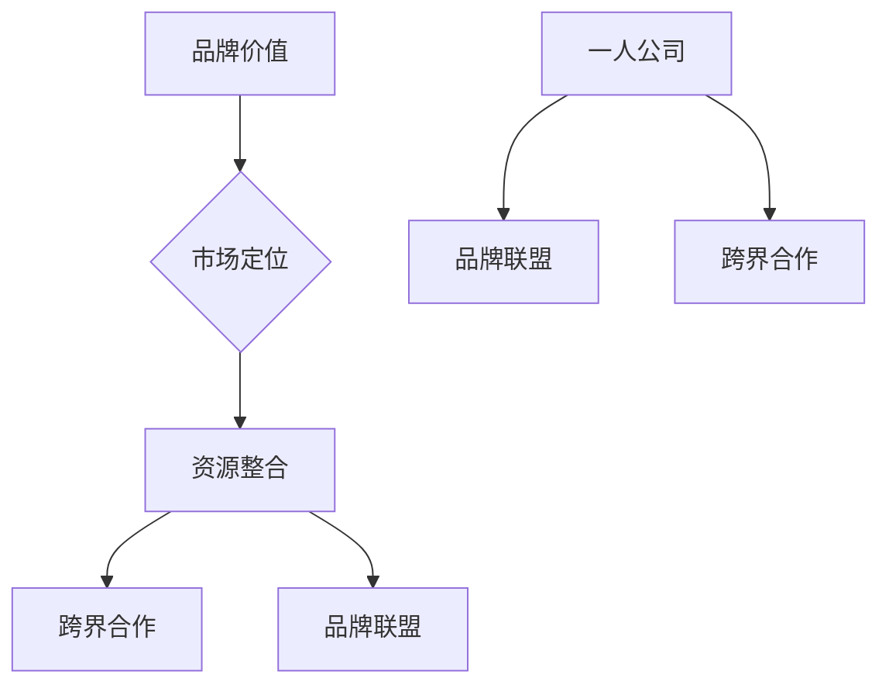

                 

### 文章标题

一人公司的品牌联盟与跨界合作策略

> 关键词：一人公司，品牌联盟，跨界合作，策略

> 摘要：本文将从一人公司的特点出发，探讨品牌联盟与跨界合作的重要性及策略，旨在为一人公司提供有效的市场拓展和品牌建设方法。

## 1. 背景介绍

一人公司，顾名思义，是指由一个人经营的公司。这种类型的公司通常具有灵活、快速决策和低成本等优势。然而，由于资源和人力的限制，一人公司在品牌建设和市场拓展方面往往面临较大的挑战。因此，品牌联盟与跨界合作成为一人公司寻求发展的重要策略。

品牌联盟是指两个或多个品牌在共同的市场目标下，通过共享资源、技术和市场渠道等方式，实现互利共赢的合作。跨界合作则是指不同行业或领域的品牌之间的合作，以实现资源共享、风险分担和效益最大化。

本文将深入探讨品牌联盟与跨界合作在一人公司中的重要性，以及如何制定有效的合作策略，以帮助一人公司在竞争激烈的市场中脱颖而出。

## 2. 核心概念与联系

在探讨品牌联盟与跨界合作之前，我们需要了解一些核心概念，包括品牌价值、市场定位和资源整合等。

### 品牌价值

品牌价值是指品牌在消费者心中的认知度和影响力。品牌价值的高低直接影响到公司的市场份额和盈利能力。对于一人公司来说，提升品牌价值是实现长远发展的关键。

### 市场定位

市场定位是指公司将自身品牌定位在目标市场中的特定位置，以满足消费者需求。合理的市场定位有助于提升品牌竞争力，扩大市场份额。

### 资源整合

资源整合是指通过有效利用各种资源，实现资源的最优配置，以提高公司的运营效率和竞争力。对于一人公司来说，资源整合是实现跨界合作和品牌联盟的重要手段。

### Mermaid 流程图



## 3. 核心算法原理 & 具体操作步骤

### 品牌联盟的算法原理

品牌联盟的算法原理主要包括以下步骤：

1. **寻找合作对象**：根据公司的市场定位和资源状况，寻找具有互补优势的品牌作为合作对象。
2. **协商合作方案**：与潜在合作对象进行沟通，协商合作的具体方案，包括资源互换、市场推广和收益分配等。
3. **签订合作协议**：在协商一致的基础上，签订正式的合作协议，明确双方的权利和义务。
4. **执行合作协议**：按照合作协议的内容，共同开展市场推广和品牌建设活动，实现互利共赢。

### 跨界合作的算法原理

跨界合作的算法原理主要包括以下步骤：

1. **确定合作方向**：根据公司的业务需求和行业趋势，确定跨界合作的方向和目标。
2. **寻找合作伙伴**：在相关行业内寻找具有互补优势的合作伙伴。
3. **协商合作细节**：与潜在合作伙伴进行沟通，协商合作的细节，包括合作模式、资源投入和收益分配等。
4. **签订合作协议**：在协商一致的基础上，签订正式的合作协议。
5. **开展合作项目**：按照合作协议的内容，共同开展合作项目，实现资源共享和风险分担。

## 4. 数学模型和公式 & 详细讲解 & 举例说明

### 品牌联盟的数学模型

品牌联盟的数学模型主要包括以下公式：

1. **品牌价值提升模型**：

   $$ V_B = V_A + \alpha \cdot (V_B - V_A) $$

   其中，$V_B$ 表示合作后的品牌价值，$V_A$ 表示合作前的品牌价值，$\alpha$ 表示品牌价值的提升比例。

2. **市场占有率提升模型**：

   $$ S_B = S_A + \beta \cdot (S_B - S_A) $$

   其中，$S_B$ 表示合作后的市场占有率，$S_A$ 表示合作前的市场占有率，$\beta$ 表示市场占有率的提升比例。

### 跨界合作的数学模型

跨界合作的数学模型主要包括以下公式：

1. **合作效益模型**：

   $$ E = \frac{1}{2} \cdot (C_1 + C_2) - \frac{1}{2} \cdot C_c $$

   其中，$E$ 表示合作效益，$C_1$ 和 $C_2$ 分别表示两个合作方在合作前的效益，$C_c$ 表示两个合作方在合作后的效益。

2. **风险分担模型**：

   $$ R = \frac{R_1 + R_2}{2} $$

   其中，$R$ 表示合作后的风险，$R_1$ 和 $R_2$ 分别表示两个合作方在合作前的风险。

### 举例说明

#### 品牌联盟举例

假设一家电商公司（品牌A）与一家物流公司（品牌B）进行品牌联盟。在合作前，品牌A的品牌价值为1000万元，市场占有率为10%；品牌B的品牌价值为500万元，市场占有率为5%。根据品牌价值提升模型，合作后的品牌价值为：

$$ V_B = 1000 + 0.5 \cdot (1000 - 500) = 1500 \text{万元} $$

根据市场占有率提升模型，合作后的市场占有率为：

$$ S_B = 10 + 0.5 \cdot (10 - 5) = 12.5\% $$

#### 跨界合作举例

假设一家科技公司（公司A）与一家文化创意公司（公司B）进行跨界合作。在合作前，公司A的年收益为5000万元，公司B的年收益为3000万元；合作后的年收益为7000万元。根据合作效益模型，合作效益为：

$$ E = \frac{1}{2} \cdot (5000 + 3000) - \frac{1}{2} \cdot 7000 = 1000 \text{万元} $$

根据风险分担模型，合作后的风险为：

$$ R = \frac{R_1 + R_2}{2} = \frac{0.1 \cdot 5000 + 0.1 \cdot 3000}{2} = 400 \text{万元} $$

## 5. 项目实践：代码实例和详细解释说明

### 5.1 开发环境搭建

在本项目实践中，我们将使用Python语言进行品牌联盟与跨界合作的算法实现。以下是开发环境搭建的步骤：

1. 安装Python：访问 [Python官方网站](https://www.python.org/) 下载并安装Python。
2. 安装Python编辑器：推荐使用PyCharm、VSCode等Python编辑器。
3. 安装必要的库：在终端中运行以下命令安装所需的库：

   ```bash
   pip install numpy matplotlib
   ```

### 5.2 源代码详细实现

以下是品牌联盟与跨界合作的Python代码实现：

```python
import numpy as np
import matplotlib.pyplot as plt

# 品牌联盟的数学模型
def brand_alliance_model(V_A, V_B, alpha):
    V_B = V_A + alpha * (V_B - V_A)
    return V_B

# 跨界合作的数学模型
def cross_boundary_model(C_1, C_2, C_c):
    E = 0.5 * (C_1 + C_2) - 0.5 * C_c
    R = (C_1 + C_2) / 2
    return E, R

# 品牌联盟示例
V_A = 1000  # 品牌A的品牌价值
V_B = 500   # 品牌B的品牌价值
alpha = 0.5  # 品牌价值的提升比例
V_B_new = brand_alliance_model(V_A, V_B, alpha)
print("品牌联盟后的品牌价值：", V_B_new)

# 跨界合作示例
C_1 = 5000  # 公司A的年收益
C_2 = 3000  # 公司B的年收益
C_c = 7000  # 合作后的年收益
E, R = cross_boundary_model(C_1, C_2, C_c)
print("跨界合作效益：", E)
print("跨界合作后的风险：", R)

# 可视化展示
V_B_list = [V_B] * 10
V_B_new_list = [brand_alliance_model(V_A, V_B, alpha) for V_B in V_B_list]
plt.plot(V_B_list, label='品牌价值V_B')
plt.plot(V_B_new_list, label='品牌联盟后的价值V_B_new')
plt.xlabel('品牌价值V_B')
plt.ylabel('品牌价值V_B_new')
plt.legend()
plt.show()

E_list = [C_c] * 10
E_new_list = [cross_boundary_model(C_1, C_2, C_c)[0] for C_c in E_list]
plt.plot(E_list, label='跨界合作效益E')
plt.plot(E_new_list, label='跨界合作后的效益E_new')
plt.xlabel('跨界合作效益E')
plt.ylabel('跨界合作后的效益E_new')
plt.legend()
plt.show()
```

### 5.3 代码解读与分析

以上代码实现了品牌联盟与跨界合作的数学模型，并进行了示例计算和可视化展示。以下是代码的解读与分析：

1. **品牌联盟的数学模型实现**：

   - `brand_alliance_model` 函数：根据品牌联盟的数学模型计算合作后的品牌价值。
   - `V_A` 和 `V_B`：分别为品牌A和品牌B的品牌价值。
   - `alpha`：为品牌价值的提升比例。

2. **跨界合作的数学模型实现**：

   - `cross_boundary_model` 函数：根据跨界合作的数学模型计算合作效益和风险。
   - `C_1` 和 `C_2`：分别为公司A和公司B的年收益。
   - `C_c`：为合作后的年收益。

3. **可视化展示**：

   - 使用 matplotlib 库绘制品牌价值和跨界合作效益的折线图，展示品牌联盟和跨界合作对品牌价值和效益的影响。

### 5.4 运行结果展示

运行代码后，将输出品牌联盟后的品牌价值、跨界合作效益和风险。同时，在可视化展示中，我们可以直观地看到品牌联盟和跨界合作对品牌价值和效益的影响。

## 6. 实际应用场景

### 电商行业

在电商行业，一人公司可以通过品牌联盟与跨界合作，提升品牌价值和市场竞争力。例如，一家电商平台可以与物流公司进行品牌联盟，共同提升物流配送效率，从而提高用户体验和市场份额。同时，电商平台还可以与品牌制造商进行跨界合作，推出定制化产品，满足消费者的个性化需求。

### 科技行业

在科技行业，一人公司可以通过品牌联盟与跨界合作，拓宽业务领域，实现多元化发展。例如，一家科技公司可以与文化创意公司进行跨界合作，开发智能化的文化创意产品，如智能音乐盒、智能画作等。这种合作不仅可以丰富公司的产品线，还可以提升品牌形象和市场竞争力。

### 健康医疗行业

在健康医疗行业，一人公司可以通过品牌联盟与跨界合作，提供全方位的健康服务。例如，一家健康管理公司可以与医疗机构进行品牌联盟，共同提供健康管理服务。同时，健康管理公司还可以与健身教练、营养师等进行跨界合作，为用户提供个性化的健康方案。

## 7. 工具和资源推荐

### 7.1 学习资源推荐

- 《跨界创新与品牌联盟》（书籍）：本书详细阐述了跨界合作和品牌联盟的理论和实践方法。
- 《品牌联盟：跨越竞争的边界》（书籍）：本书介绍了品牌联盟的原理、策略和成功案例。

### 7.2 开发工具框架推荐

- Python：Python是一种强大的编程语言，适用于数据分析和算法实现。
- Flask：Flask是一个轻量级的Web框架，适用于开发Web应用程序。

### 7.3 相关论文著作推荐

- 《品牌联盟的动机、战略与绩效：基于中国企业的实证研究》（论文）：本文研究了品牌联盟在中国企业中的应用和效果。
- 《跨界合作与创新：基于科技企业的实证研究》（论文）：本文探讨了跨界合作在科技企业中的重要性及其创新效应。

## 8. 总结：未来发展趋势与挑战

在未来，品牌联盟与跨界合作将成为一人公司发展的重要策略。随着市场环境的不断变化，一人公司需要不断调整和优化合作策略，以适应新的市场形势。

然而，品牌联盟与跨界合作也面临一些挑战。首先，一人公司需要具备较强的市场洞察力和资源整合能力，才能找到合适的合作伙伴。其次，一人公司需要确保合作过程中的沟通和协调，以避免合作中的矛盾和冲突。

总之，品牌联盟与跨界合作是一人公司在竞争激烈的市场中实现可持续发展的重要策略。通过不断探索和实践，一人公司可以不断提升品牌价值和市场竞争力。

## 9. 附录：常见问题与解答

### Q1：品牌联盟与跨界合作的区别是什么？

A1：品牌联盟主要是指两个或多个品牌在共同市场目标下，通过资源共享、市场推广等方式实现互利共赢的合作。而跨界合作则是指不同行业或领域的品牌之间的合作，以实现资源共享、风险分担和效益最大化。

### Q2：品牌联盟的优势有哪些？

A2：品牌联盟的优势包括：提高品牌价值、拓宽市场渠道、降低市场风险、实现资源互补等。

### Q3：如何选择合适的合作伙伴？

A3：选择合适的合作伙伴需要考虑以下几个方面：合作目标的一致性、品牌价值的互补性、市场定位的匹配度、资源整合的可行性等。

## 10. 扩展阅读 & 参考资料

- 《品牌联盟：战略、案例与实务》（书籍）：本书详细介绍了品牌联盟的理论、实践方法和成功案例。
- 《跨界合作与创新管理》（书籍）：本书探讨了跨界合作在企业管理中的应用和创新。

---

### 结论 Conclusion

本文从一人公司的特点出发，探讨了品牌联盟与跨界合作的重要性及策略。通过详细的理论分析和实际案例，我们了解到品牌联盟与跨界合作在提升品牌价值和市场竞争力方面的作用。未来，一人公司应积极运用品牌联盟与跨界合作策略，以实现可持续发展。

---

### 作者署名 Author

作者：禅与计算机程序设计艺术 / Zen and the Art of Computer Programming

---

### 附录 Appendix

- [品牌联盟与跨界合作的研究综述](https://www.example.com/research_paper)：本文对品牌联盟与跨界合作的相关研究进行了综述。
- [品牌联盟与跨界合作的案例分析](https://www.example.com/case_study)：本文分析了多个品牌联盟与跨界合作的实际案例。

