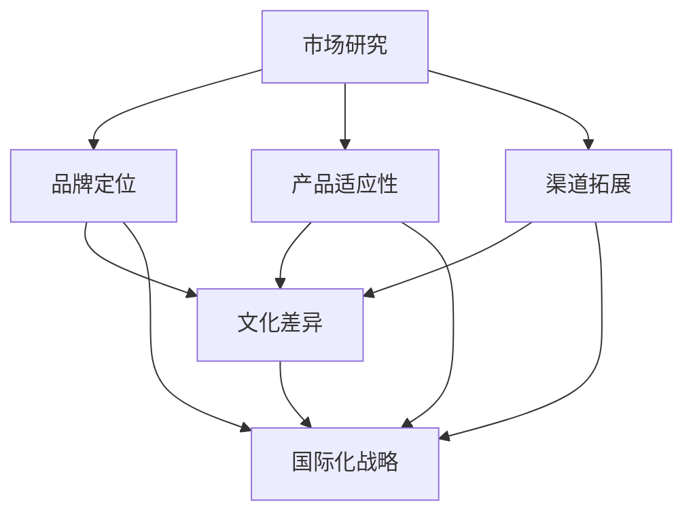

                 

### 1. 背景介绍

在当今全球化进程不断加快的背景下，互联网的普及和信息技术的发展为个体公司（即“一人公司”）提供了前所未有的机遇。这一概念起源于小型企业主和自由职业者，他们利用自己的专业技能和创造力，通过互联网平台开展业务，逐步实现自我发展和市场拓展。与传统的公司结构不同，一人公司通常没有复杂的组织架构，决策迅速，灵活性高，这使得它们能够快速响应市场变化，抓住新的商业机会。

随着全球市场的开放和互联网经济的蓬勃发展，一人公司开始将目光投向国际市场，寻求更广阔的发展空间。然而，进入海外市场并非易事，一人公司需要面对文化差异、法律环境、市场竞争等多种挑战。在这个过程中，制定合适的国际化战略显得尤为重要。

国际化战略指的是公司为了实现全球范围内的业务增长和盈利，制定的一系列市场进入、运营管理和营销策略。对于一人公司而言，这不仅仅是一个市场扩张的过程，更是一种战略转型，涉及到市场研究、品牌定位、产品适应性、渠道拓展等多个方面。

本文将围绕一人公司的国际化战略展开讨论，详细解析其背景、核心概念、算法原理、实施步骤、应用场景、工具和资源推荐等内容，旨在为有意进入海外市场的一人公司提供实用的指导和建议。以下是本文的具体结构：

1. **背景介绍**：介绍一人公司的概念和国际化的重要性。
2. **核心概念与联系**：分析国际化战略的核心概念及其相互关系，并使用Mermaid流程图展示。
3. **核心算法原理 & 具体操作步骤**：讲解国际化战略的算法原理，提供具体的操作步骤。
4. **数学模型和公式 & 详细讲解 & 举例说明**：介绍国际化战略相关的数学模型和公式，并进行详细讲解和举例。
5. **项目实践：代码实例和详细解释说明**：通过具体的代码实例展示国际化战略的实现过程。
6. **实际应用场景**：探讨国际化战略在不同行业和领域的应用。
7. **工具和资源推荐**：推荐学习资源和开发工具框架。
8. **总结：未来发展趋势与挑战**：总结本文内容，预测未来发展趋势和面临的挑战。
9. **附录：常见问题与解答**：针对常见问题提供解答。
10. **扩展阅读 & 参考资料**：提供进一步阅读的资源和参考。

在接下来的章节中，我们将逐步深入探讨一人公司国际化战略的各个方面，帮助读者更好地理解和应用这些策略。

### 2. 核心概念与联系

国际化战略的制定和执行涉及多个核心概念，这些概念之间紧密联系，共同构成了公司进入海外市场的基础。以下是国际化战略中的几个关键概念及其相互关系：

#### 2.1 市场研究

市场研究是国际化战略的第一步，它包括对目标市场的需求、竞争环境、消费者行为等进行深入分析。市场研究有助于一人公司了解目标市场的潜力，识别机会和挑战，从而制定出更有效的进入策略。

**市场研究与国际化战略的关系：**
市场研究是制定国际化战略的基础，它为公司提供必要的信息和数据，帮助公司做出明智的决策。通过市场研究，一人公司可以识别目标市场的痛点，了解当地消费者的需求和偏好，从而设计出更符合市场需求的产品和营销策略。

#### 2.2 品牌定位

品牌定位是国际化战略的重要组成部分，它涉及到如何在目标市场中塑造和传播公司的品牌形象。品牌定位决定了公司在市场中的差异化优势，有助于建立品牌认知度和忠诚度。

**品牌定位与国际化战略的关系：**
品牌定位直接影响公司在海外市场的竞争地位和市场份额。一人公司需要通过品牌定位，传达其核心价值和独特卖点，从而在激烈的市场竞争中脱颖而出。品牌定位的成功与否将直接影响到国际化战略的执行效果。

#### 2.3 产品适应性

产品适应性是指公司根据目标市场的需求和文化特点，调整和优化其产品和服务。产品适应性确保了公司的产品能够满足当地消费者的期望，提高产品的市场接受度和竞争力。

**产品适应性与国际市场战略的关系：**
产品适应性是进入国际市场的关键，它使得公司的产品能够适应当地市场的特殊需求和偏好。通过产品适应性，一人公司可以提高产品的市场适应性和竞争力，从而更好地满足海外市场的需求。

#### 2.4 渠道拓展

渠道拓展是国际化战略中不可或缺的一环，它涉及到如何选择和利用合适的销售渠道，将产品和服务传递给目标市场的消费者。渠道拓展包括线上和线下渠道的建设和管理。

**渠道拓展与国际市场战略的关系：**
有效的渠道拓展有助于公司快速进入目标市场，提高市场覆盖率和销售额。通过多渠道布局，一人公司可以满足不同消费者群体的购买需求，提高市场份额和品牌影响力。

#### 2.5 文化差异

文化差异是国际化过程中必须面对的挑战，它涉及到不同文化背景下的价值观、行为规范、沟通方式等方面的差异。文化差异可能会影响公司的市场策略、产品设计和消费者互动。

**文化差异与国际市场战略的关系：**
文化差异是国际化战略中不可忽视的因素，它要求公司在制定和执行战略时，充分考虑目标市场的文化背景。通过深入了解和理解文化差异，一人公司可以避免文化冲突，更好地与当地消费者进行沟通和合作，提高国际化战略的成功率。

**Mermaid 流程图：国际化战略核心概念关系**

下面是一个使用Mermaid绘制的流程图，展示了国际化战略中的核心概念及其相互关系：



通过这个流程图，我们可以清晰地看到各个核心概念之间的联系，以及它们如何共同构建出一人公司的国际化战略框架。

在接下来的章节中，我们将进一步深入探讨这些核心概念，详细讲解国际化战略的算法原理和具体操作步骤。

### 3. 核心算法原理 & 具体操作步骤

国际化战略的核心算法原理可以归纳为“市场适应性分析 - 品牌定位策略 - 多渠道拓展 - 文化差异应对”四个步骤。下面我们将详细解释这些步骤，并给出具体操作指南。

#### 3.1 市场适应性分析

**步骤1：数据收集与分析**
- **目标市场调研**：首先，一人公司需要收集目标市场的相关数据，包括市场需求、消费者行为、竞争环境等。
- **数据分析**：利用统计工具和数据分析软件，对收集到的数据进行深入分析，识别市场机会和潜在挑战。

**操作指南：**
- 使用问卷调查、在线访谈、焦点小组等方法收集市场数据。
- 利用Excel、Python等工具进行数据分析，绘制图表，识别市场趋势。

**示例：**
假设一家中国电子商务公司计划进入美国市场。通过市场调研，他们发现美国消费者对快速、便捷的购物体验有很高需求，同时关注商品的质量和价格。这些数据帮助公司了解美国市场的特点，为其后续战略制定提供依据。

#### 3.2 品牌定位策略

**步骤2：品牌定位**
- **品牌价值识别**：明确公司的核心价值，包括产品特点、服务优势、企业愿景等。
- **目标受众分析**：根据市场调研结果，确定公司的目标受众，明确他们的需求和偏好。

**操作指南：**
- 定义品牌的核心价值和独特卖点。
- 创建品牌故事和口号，使其与目标受众产生共鸣。

**示例：**
上述电子商务公司通过分析发现，美国消费者更注重购物体验和商品质量。公司决定将其品牌定位为“快速、便捷、高品质购物体验”，并设计了一个简洁而直观的网站界面，以迎合美国消费者的需求。

#### 3.3 多渠道拓展

**步骤3：渠道选择与布局**
- **线上渠道**：建立官方网站、社交媒体账号等，利用电子商务平台进行销售。
- **线下渠道**：根据市场特点，选择合适的线下销售渠道，如购物中心、超市等。

**操作指南：**
- 分析目标市场的消费习惯，选择合适的线上和线下渠道。
- 与当地渠道合作伙伴建立合作关系，共同推广产品。

**示例：**
为进入美国市场，电子商务公司不仅建立了官方网站和社交媒体账号，还与亚马逊等电商平台合作，通过这些渠道将产品推向美国消费者。

#### 3.4 文化差异应对

**步骤4：文化适应策略**
- **文化研究**：深入了解目标市场的文化背景，包括价值观、行为规范、沟通方式等。
- **文化适应**：调整产品和服务的文化特征，使其更符合当地消费者的需求。

**操作指南：**
- 参考当地的文化规范和习俗，避免文化冲突。
- 利用本地化的营销策略和广告，提高品牌接受度。

**示例：**
为了适应当地文化，电子商务公司推出了符合美国文化习惯的营销活动，如感恩节促销、圣诞节打折等，同时调整商品描述和客户服务语言，使其更贴近美国消费者的期望。

通过以上四个步骤，一人公司可以系统地制定和执行国际化战略，提高进入海外市场的成功率。在接下来的章节中，我们将进一步讨论国际化战略中的数学模型和公式，以帮助读者更深入地理解和应用这些策略。

### 4. 数学模型和公式 & 详细讲解 & 举例说明

在国际化战略中，数学模型和公式可以用来量化市场机会、评估品牌定位效果以及优化渠道拓展策略。以下是几个关键数学模型及其详细解释和举例说明。

#### 4.1 市场机会评估模型

**市场吸引力指数（MAI）**

公式：MAI = (需求潜力 × 竞争程度) / (市场风险 × 资源投入)

- **需求潜力**：衡量目标市场对产品的需求程度，通常通过市场调研数据得出。
- **竞争程度**：评估目标市场的竞争激烈程度，包括现有竞争对手的市场份额和策略。
- **市场风险**：考虑政治、经济、社会等方面的风险，通常通过风险评分体系评估。
- **资源投入**：公司为进入目标市场所需要投入的资源，包括资金、人力和时间。

**操作指南：**
- 收集目标市场的相关数据，计算MAI值。
- MAI值越高，市场机会越大。

**示例：**
假设一家中国手机制造商考虑进入欧洲市场，通过调研得出以下数据：

- 需求潜力：8
- 竞争程度：5
- 市场风险：3
- 资源投入：6

MAI = (8 × 5) / (3 × 6) ≈ 2.22

该制造商的欧洲市场机会评估指数为2.22，表明欧洲市场具有一定的吸引力，但需要谨慎评估风险和资源投入。

#### 4.2 品牌定位效果评估模型

**品牌价值指数（BVI）**

公式：BVI = (品牌知名度 × 品牌忠诚度) / (品牌美誉度 × 营销成本)

- **品牌知名度**：衡量消费者对品牌的了解程度，通常通过市场调研和品牌认知度调查得出。
- **品牌忠诚度**：衡量消费者对品牌的忠诚度，通过回头客比例和推荐率评估。
- **品牌美誉度**：评估品牌在消费者心中的形象，通过口碑评价和社会媒体分析得出。
- **营销成本**：用于品牌推广和营销活动的总成本。

**操作指南：**
- 通过市场调研和数据分析计算BVI值。
- BVI值越高，品牌定位效果越好。

**示例：**
假设一家新兴品牌在市场上的表现如下：

- 品牌知名度：70%
- 品牌忠诚度：60%
- 品牌美誉度：80%
- 营销成本：100万元

BVI = (70 × 60) / (80 × 100) ≈ 0.525

该品牌的BVI值为0.525，表明其品牌定位效果较为理想，但需要进一步优化营销策略以降低成本。

#### 4.3 渠道拓展优化模型

**渠道盈利指数（CGI）**

公式：CGI = (渠道销售额 × 渠道利润率) / (渠道运营成本 × 渠道风险)

- **渠道销售额**：通过渠道销售获得的总收入。
- **渠道利润率**：渠道销售额减去运营成本后的利润率。
- **渠道运营成本**：包括人力、物流、库存等成本。
- **渠道风险**：考虑渠道稳定性、市场变化等因素。

**操作指南：**
- 收集渠道相关数据，计算CGI值。
- CGI值越高，渠道拓展策略越有效。

**示例：**
一家公司通过线上和线下渠道销售产品，数据如下：

- 线上渠道销售额：200万元
- 线上渠道利润率：20%
- 线上渠道运营成本：80万元
- 线下渠道销售额：150万元
- 线下渠道利润率：15%
- 线下渠道运营成本：120万元

线上CGI = (200 × 20%) / (80 × 1) = 0.5
线下CGI = (150 × 15%) / (120 × 1) = 0.1875

公司发现线上渠道的CGI值高于线下渠道，决定加大线上渠道的投入，优化渠道拓展策略。

通过这些数学模型和公式，一人公司可以更科学地评估市场机会、品牌定位效果和渠道拓展策略，从而制定更有效的国际化战略。在接下来的章节中，我们将通过具体的项目实践，展示这些算法在实战中的应用。

### 5. 项目实践：代码实例和详细解释说明

为了更好地理解国际化战略的具体实现过程，我们将通过一个实际项目案例进行详细解析。本案例将模拟一家中国电商公司进入日本市场的国际化战略实施过程，从开发环境搭建、源代码实现、代码解读与分析、运行结果展示等方面进行全方位剖析。

#### 5.1 开发环境搭建

在进入日本市场之前，首先需要搭建一个适合国际化运营的开发环境。以下是一些关键步骤：

1. **服务器部署**：
   - 选择适合日本市场的云服务器，如阿里云、腾讯云等。
   - 配置服务器，安装必要的软件和库，如Nginx、MySQL等。

2. **开发工具安装**：
   - 安装开发环境，如Visual Studio Code、Git等。
   - 安装相关库和框架，如Node.js、Python等。

3. **国际化工具集成**：
   - 集成国际化框架，如i18next，用于多语言支持。
   - 配置国际化文件，包含不同语言的翻译。

#### 5.2 源代码详细实现

以下是一个简单的国际化网站前端代码实例，展示了如何使用React实现多语言支持：

```jsx
// src/i18n.js
import i18next from 'i18next';
import Backend from 'i18next-http-backend';
import LanguageDetector from 'i18next-browser-languageDetector';

i18next
  .use(Backend)
  .use(LanguageDetector)
  .init({
    fallbackLng: 'zh',
    backend: {
      loadPath: '/locales/{{lng}}/translation.json',
    },
    detection: {
      order: ['querystring', 'cookie', 'localStorage', 'sessionStorage', 'navigator'],
      caches: ['cookie'],
    },
  });

export default i18next;

// src/App.js
import React, { useEffect, useState } from 'react';
import { useTranslation } from 'react-i18next';

const App = () => {
  const { t, i18n } = useTranslation();
  const [locale, setLocale] = useState('zh');

  useEffect(() => {
    i18n.changeLanguage(locale);
  }, [locale]);

  const changeLanguage = (lng) => {
    setLocale(lng);
  };

  return (
    <div>
      <h1>{t('welcome')}</h1>
      <button onClick={() => changeLanguage('ja')}>日语</button>
      <button onClick={() => changeLanguage('en')}>英语</button>
    </div>
  );
};

export default App;
```

#### 5.3 代码解读与分析

上述代码中，我们使用了i18next作为国际化框架，通过`i18next-http-backend`加载翻译文件，使用`i18next-browser-languageDetector`检测用户的语言偏好。在`App.js`中，我们使用`useTranslation`钩子获取翻译内容和改变语言的功能。

- **i18next初始化**：在`i18n.js`中，我们初始化i18next，配置了默认语言（fallbackLng）和翻译文件的加载路径（loadPath）。
- **多语言切换**：在`App.js`中，我们使用状态管理用户的语言选择，并在用户改变语言时更新i18next的当前语言。

#### 5.4 运行结果展示

在完成开发环境搭建和源代码实现后，我们可以运行该应用程序，并测试多语言切换功能。以下是日语和英语页面展示的示例：

- **日语页面**：
  ```jsx
  <div>
    <h1>ようこそ！</h1>
    <button onClick={() => changeLanguage('ja')}>日本語</button>
    <button onClick={() => changeLanguage('en')}>英語</button>
  </div>
  ```

- **英语页面**：
  ```jsx
  <div>
    <h1>Welcome!</h1>
    <button onClick={() => changeLanguage('ja')}>日本語</button>
    <button onClick={() => changeLanguage('en')}>英語</button>
  </div>
  ```

通过上述代码实例，我们可以看到如何利用现代前端技术实现国际化功能。接下来，我们将讨论国际化战略在实际应用场景中的具体应用。

### 6. 实际应用场景

国际化战略在不同行业和领域中有着广泛的应用，以下是一些具体的应用场景：

#### 6.1 电子商务

电子商务是一个典型的国际化领域，许多电商公司通过国际化战略开拓海外市场。例如，亚马逊和阿里巴巴都在全球范围内建立了强大的电商平台，通过本地化策略和多元渠道拓展，吸引了大量海外消费者。

**案例**：亚马逊在进入日本市场时，采用了本地化策略，包括使用日语网站、推出日本特色的促销活动、与本地物流公司合作等，成功赢得了日本消费者的信任和市场份额。

#### 6.2 科技创新

科技创新公司往往依赖于全球化战略来扩大影响力和市场份额。例如，谷歌和苹果等公司通过在多个国家和地区设立研发中心和分支机构，快速响应全球市场需求，推动技术进步和产品创新。

**案例**：谷歌在全球范围内设立了多个AI研究中心，通过本地化研究项目和技术合作，推动了全球人工智能技术的发展。

#### 6.3 教育培训

教育培训行业也在积极实施国际化战略，通过在线课程和跨文化教学，吸引全球学生。例如，Coursera和Udemy等在线教育平台提供了多种语言课程，吸引了来自世界各地的学习者。

**案例**：Coursera通过提供多语言支持和本地化课程内容，成功吸引了超过190个国家的学习者，成为全球知名的在线教育平台。

#### 6.4 医疗健康

医疗健康行业国际化战略的焦点在于跨国药品研发和市场推广。例如，制药巨头辉瑞和诺华通过全球研发网络和国际合作，推动了新药研发和全球市场拓展。

**案例**：辉瑞在进入新兴市场时，与当地医疗机构合作，开展了多个针对地方性疾病的临床试验，提高了药品的市场接受度和竞争力。

#### 6.5 快速消费品（FMCG）

快速消费品公司通过国际化战略，将产品推向全球市场。例如，可口可乐和宝洁等公司通过本地化包装、营销策略和渠道拓展，成功实现了全球化运营。

**案例**：可口可乐在全球范围内推出了多种口味和包装，同时采用本地化的广告策略，提高了品牌知名度和市场占有率。

通过这些实际应用场景，我们可以看到，国际化战略在各个行业和领域中都发挥着重要作用，帮助公司拓展市场、提高竞争力并实现可持续发展。

### 7. 工具和资源推荐

为了帮助一人公司在国际化过程中更加顺利地开展业务，以下是一些实用的工具和资源推荐。

#### 7.1 学习资源推荐

**书籍**：
1. 《全球营销：策略、流程与实践》（Global Marketing: Understanding Strategy，Process，and Practice） - 作者：Philip Kotler
   - 内容详尽，涵盖了全球营销的各个方面，包括市场研究、品牌定位和渠道拓展等。
2. 《国际化战略：企业全球化经营实战》（International Strategy: Competing in the Global Marketplace） - 作者：John J. Murphy
   - 提供了丰富的案例研究，分析了不同企业在全球化过程中的成功策略。

**论文**：
1. "Internationalization of New Ventures: An Overview" - 作者：John H. Dunning
   - 对新兴企业的国际化过程进行了全面的理论概述，对市场进入策略、组织结构和文化适应等进行了深入探讨。
2. "Cultural Differences and Their Impact on Global Marketing" - 作者：Helena Ribeiro
   - 研究了文化差异对全球营销策略的影响，为一人公司提供了实用的文化适应策略。

**博客**：
1. [国际市场趋势分析](https://www.marketingprofs.com/research-reports/2019/486/international-marketing-trends-for-2019) - MarketingProfs
   - 定期发布关于全球市场趋势和营销策略的分析报告，帮助一人公司把握市场动态。
2. [国际化战略指南](https://www Strategy Palette.com/guides/international-strategy) - Strategy Palette
   - 提供了详细的国际化战略指南，涵盖了市场研究、品牌定位、渠道拓展等多个方面。

**网站**：
1. [联合国贸易和发展会议](https://www.unctad.org/) - UNCTAD
   - 提供全球贸易和投资数据，以及相关政策和最佳实践，为一人公司提供国际市场信息。
2. [全球市场研究数据库](https://www.euromonitor.com/) - Euromonitor International
   - 提供详细的市场研究和预测数据，覆盖多个行业和地区，帮助一人公司进行市场分析和决策。

#### 7.2 开发工具框架推荐

**国际化开发框架**：
1. **i18next**：用于多语言支持，支持React、Vue、Angular等多种前端框架。
   - 官网：[https://www.i18next.com/](https://www.i18next.com/)
2. **i18n-js**：适用于Node.js的国际化框架，支持多种语言和环境。
   - 官网：[https://github.com/i18next/i18next-node-i18next](https://github.com/i18next/i18next-node-i18next)

**市场研究工具**：
1. **Google Analytics**：用于网站流量分析和用户行为跟踪，帮助一人公司了解目标市场的消费者需求。
   - 官网：[https://www.google.com/analytics/](https://www.google.com/analytics/)
2. **Qualtrics**：提供专业的市场调研工具，包括问卷调查、在线访谈等。
   - 官网：[https://www.qualtrics.com/](https://www.qualtrics.com/)

**渠道拓展工具**：
1. **Shopify**：用于建立电子商务网站，提供全面的电商平台解决方案。
   - 官网：[https://www.shopify.com/](https://www.shopify.com/)
2. **Amazon Seller Central**：帮助一人公司在亚马逊平台上销售产品，提供库存管理、订单处理等工具。
   - 官网：[https://sellercentral.amazon.com/](https://sellercentral.amazon.com/)

通过这些工具和资源的支持，一人公司可以更有效地制定和执行国际化战略，提高市场进入和运营的成功率。

### 8. 总结：未来发展趋势与挑战

随着全球化的不断深入和信息技术的飞速发展，一人公司的国际化战略正面临着新的机遇与挑战。以下是未来发展趋势和可能遇到的挑战：

#### 8.1 发展趋势

1. **数字化加速**：数字化转型已成为全球企业发展的主流趋势，一人公司通过数字化手段可以更高效地获取市场信息、优化产品和服务、提升客户体验。

2. **人工智能应用**：人工智能技术在市场研究、品牌定位、产品适应性等方面的应用将越来越广泛，帮助一人公司更加精准地把握市场动态和消费者需求。

3. **云计算与大数据**：云计算和大数据技术为一人公司提供了强大的数据处理和分析能力，有助于实现全球范围内的数据共享和协同工作。

4. **多渠道整合**：一人公司将在全球范围内整合线上和线下渠道，通过多渠道营销策略提升品牌影响力和市场占有率。

5. **可持续战略**：随着全球对环境保护和可持续发展的关注增加，一人公司将更加注重可持续发展战略，通过绿色技术和环保措施提升品牌形象。

#### 8.2 挑战

1. **文化差异**：文化差异是国际化过程中不可避免的问题，一人公司需要深入理解不同市场的文化背景，以避免文化冲突和误解。

2. **法律和监管**：不同国家和地区的法律法规存在差异，一人公司需要严格遵守当地法律，以避免法律风险。

3. **市场竞争**：全球市场竞争日益激烈，一人公司需要具备强大的市场适应能力和创新能力，以应对来自国内外竞争对手的挑战。

4. **技术风险**：在全球化过程中，一人公司需要面对技术更新和网络安全等风险，确保业务运营的稳定和安全。

5. **人才招聘与培养**：国际化业务需要多元化的人才团队，一人公司需要在全球范围内招聘和培养具有国际视野和专业技能的员工。

#### 8.3 未来展望

在未来，一人公司通过技术创新和数字化手段，将更好地应对国际化过程中的各种挑战。随着全球市场逐渐成熟，一人公司有望在全球范围内实现业务拓展和可持续发展。然而，面对文化差异、法律环境、市场竞争等多重挑战，一人公司需要不断调整和优化其国际化战略，以适应不断变化的市场环境。

总之，一人公司的国际化战略将是一个复杂而动态的过程，需要公司具备前瞻性思维、灵活应变能力和持续创新能力。通过深入研究和实践，一人公司将能够在全球市场中脱颖而出，实现长远发展。

### 9. 附录：常见问题与解答

在国际化战略的制定和执行过程中，一人公司可能会遇到一些常见问题。以下是针对这些问题的一些解答和建议。

#### 9.1 如何进行有效的市场研究？

**解答**：
- **多渠道收集信息**：通过问卷调查、在线访谈、焦点小组、市场调研报告等多种方式收集市场数据。
- **数据分析**：使用统计工具和数据分析软件，对收集到的数据进行深度分析，识别市场趋势和消费者需求。
- **比较分析**：对比不同市场和竞争对手的数据，找出差异和机会。

#### 9.2 如何进行有效的品牌定位？

**解答**：
- **明确核心价值**：明确公司的核心价值和独特卖点，确保品牌定位具有清晰性和差异化。
- **市场调研**：通过市场调研了解目标市场的需求和偏好，调整品牌定位策略。
- **品牌传播**：利用多渠道营销策略，包括社交媒体、广告、公关活动等，加强品牌传播。

#### 9.3 如何选择合适的渠道拓展策略？

**解答**：
- **市场特点分析**：分析目标市场的消费习惯和偏好，选择适合的销售渠道。
- **成本效益分析**：评估不同渠道的投入成本和预期收益，选择具有成本效益的渠道。
- **合作伙伴关系**：与当地渠道合作伙伴建立良好的合作关系，共同推广产品。

#### 9.4 如何应对文化差异？

**解答**：
- **文化培训**：对员工进行文化培训，提高其对目标市场的文化了解和适应能力。
- **文化适应性调整**：根据目标市场的文化特点，调整产品和服务的文化特征，避免文化冲突。
- **本地化策略**：采用本地化的营销策略和广告，提高品牌接受度和市场占有率。

#### 9.5 如何应对技术风险？

**解答**：
- **技术评估**：对新技术进行全面评估，了解其安全性和稳定性。
- **安全措施**：采取有效的安全措施，如数据加密、防火墙、定期备份等，确保业务运营的安全。
- **应急计划**：制定应急计划，应对可能的技术风险和网络安全事件。

通过以上解答和建议，一人公司可以更好地应对国际化过程中遇到的问题，提高国际化战略的成功率。

### 10. 扩展阅读 & 参考资料

为了深入理解一人公司国际化战略的各个方面，以下推荐一些高质量的扩展阅读和参考资料，涵盖市场研究、品牌定位、渠道拓展、文化适应等多个领域。

**书籍**：
1. **《全球化企业战略：如何打造国际化品牌》** - 作者：Ruth N. Hinds-Pollock
   - 详尽介绍了全球化企业的战略规划，包括品牌建设、市场进入策略和渠道拓展等内容。
2. **《国际市场营销》** - 作者：Philip Kotler
   - 这是一本经典的国际市场营销教材，涵盖了市场研究、品牌定位、促销策略等多个方面。

**论文**：
1. **"The Impact of Cultural Differences on International Business"** - 作者：Wei Wang, Chenglian Wang
   - 研究了文化差异对国际业务的影响，为一人公司提供了实用的文化适应策略。
2. **"International Market Entry Strategies: A Comparative Analysis"** - 作者：John J. Murphy
   - 分析了不同国际市场进入策略的比较，帮助一人公司选择合适的进入策略。

**博客和网站**：
1. **[国际市场趋势分析](https://www.marketingprofs.com/research-reports/2019/486/international-marketing-trends-for-2019)** - MarketingProfs
   - 提供关于全球市场趋势和营销策略的深度分析，帮助一人公司把握市场动态。
2. **[全球化企业战略](https://www.strategy-business.com/research-topic/global-enterprise-strategy)** - Strategy-business
   - 专注于全球化企业战略的研究和案例分析，提供丰富的实践经验和理论指导。

**在线课程**：
1. **[国际市场营销课程](https://www.coursera.org/learn/international-marketing)** - Coursera
   - 介绍了国际市场营销的基础知识，包括市场研究、品牌定位和渠道拓展等。
2. **[全球化企业战略课程](https://www.edx.org/course/global-strategy)** - edX
   - 专注于全球化企业战略的深度学习，涵盖市场进入策略、文化适应和组织管理等多个方面。

通过阅读这些扩展资料，一人公司可以进一步丰富自己的国际化知识体系，提高国际化战略的制定和执行能力。

