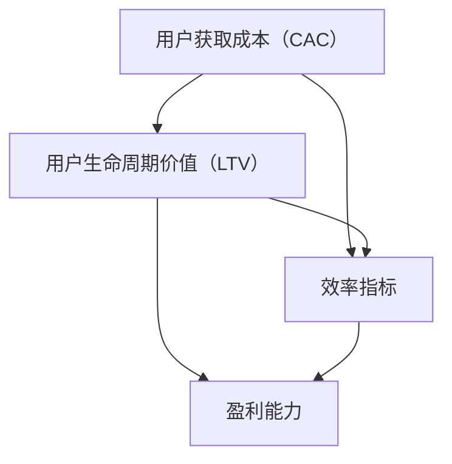

                 

### 背景介绍

**一人公司的增长黑客技巧：低预算高回报的用户获取策略**

在当今数字化时代，创业公司和独立开发者面临的挑战越来越严峻。资源有限、预算紧张，如何实现快速、高效的用户增长成为了一个迫切需要解决的问题。增长黑客（Growth Hacker）正是为此而生，他们利用创意和技术手段，以最低的成本获取最大的用户增长。

**一人公司**，顾名思义，指的是只有一个员工或创始人的公司。这类公司由于人员构成简单、运营成本相对较低，更容易在短时间内进行快速迭代和实验。然而，资源的稀缺性也使得他们必须更加精明地制定和执行用户获取策略。

本文将探讨如何利用增长黑客的思路，为一人公司制定一套低预算高回报的用户获取策略。我们将从多个角度进行分析，包括市场定位、社交媒体营销、内容营销、SEO优化以及用户互动等，帮助读者了解和掌握一套实用的增长黑客技巧。

### 核心概念与联系

在讨论增长黑客技巧之前，我们需要明确几个核心概念：

**1. 增长黑客的定义：**
增长黑客是融合了营销和技术能力的专业人士，他们利用数据分析、A/B测试和创意思维，以极低的成本实现用户增长。

**2. 用户获取成本（CAC）：**
用户获取成本是指公司获取一个新客户所花费的平均成本。降低CAC是增长黑客工作的核心目标之一。

**3. 用户生命周期价值（LTV）：**
用户生命周期价值是指一个用户在整个生命周期内为公司带来的总收益。提高LTV可以帮助公司实现盈利。

**4. 效率指标：**
常见的效率指标包括转化率、留存率、病毒系数等，这些指标可以帮助公司评估增长策略的有效性。

理解这些核心概念之后，我们可以用以下Mermaid流程图来展示它们之间的联系：



这个流程图表明，降低CAC和提高LTV是增长黑客工作的核心目标，而效率指标是评估这些目标实现情况的重要工具。

### 核心算法原理 & 具体操作步骤

**1. 数据分析：**
增长黑客的第一步是收集和分析用户数据。通过分析用户行为、偏好和反馈，可以发现用户获取的潜在机会。具体操作步骤如下：

- **步骤1：数据收集**：通过网站分析工具（如Google Analytics）收集用户访问数据。
- **步骤2：数据清洗**：处理和整理收集到的数据，确保其准确性和完整性。
- **步骤3：数据可视化**：使用图表和仪表盘将数据可视化，以便更直观地分析用户行为。

**2. A/B测试：**
A/B测试是一种常见的实验方法，通过比较不同版本的网页、按钮或功能，来确定哪种设计能够带来更高的用户转化率。具体操作步骤如下：

- **步骤1：定义目标**：确定要测试的指标，如点击率、转化率等。
- **步骤2：创建测试版本**：设计两个或多个测试版本，每个版本针对不同的用户群体。
- **步骤3：部署测试**：将测试版本部署到实际环境中，并跟踪用户的响应。
- **步骤4：分析结果**：根据测试结果，选择最优版本进行推广。

**3. 内容营销：**
内容营销是增长黑客策略中的重要组成部分。通过创建有价值的内容，吸引并留住目标用户。具体操作步骤如下：

- **步骤1：确定目标受众**：明确目标用户的特征和需求。
- **步骤2：内容策划**：制定内容创作计划，包括博客文章、视频、电子书等。
- **步骤3：内容创作**：根据策划计划，创作高质量的内容。
- **步骤4：内容推广**：通过社交媒体、邮件营销等渠道，将内容推广给目标用户。

**4. 社交媒体营销：**
社交媒体是获取新用户的重要渠道。通过巧妙地运用社交媒体平台，可以实现病毒式传播，迅速扩大用户群。具体操作步骤如下：

- **步骤1：选择平台**：根据目标用户的特点，选择合适的社交媒体平台。
- **步骤2：制定策略**：制定社交媒体营销策略，包括发布内容、互动和广告投放等。
- **步骤3：内容创作**：创作吸引人的内容，提高用户参与度。
- **步骤4：互动与反馈**：积极与用户互动，收集反馈并优化营销策略。

**5. SEO优化：**
搜索引擎优化（SEO）是提高网站可见性的关键。通过优化网站内容和结构，可以提高在搜索引擎中的排名，从而吸引更多的有机流量。具体操作步骤如下：

- **步骤1：关键词研究**：确定目标关键词，并评估其搜索量和竞争程度。
- **步骤2：内容优化**：在网站内容中合理地融入目标关键词，并优化标题、描述等元数据。
- **步骤3：技术优化**：优化网站技术，提高网站的加载速度和移动友好性。
- **步骤4：链接建设**：通过外部链接建设，提高网站的权威性和搜索引擎排名。

通过以上步骤，一人公司可以逐步构建起一套有效的用户获取策略，实现快速、高效的用户增长。

### 数学模型和公式 & 详细讲解 & 举例说明

在增长黑客的策略中，数学模型和公式是不可或缺的工具。通过精确的数学分析，我们可以更清晰地了解用户获取成本、用户生命周期价值和效率指标之间的关系，从而制定更有效的增长策略。

**1. 用户获取成本（CAC）模型：**

用户获取成本（CAC）是指公司获取一个新客户所花费的平均成本。其计算公式为：

$$ CAC = \frac{总营销支出}{新增客户数} $$

例如，如果一家公司在一个季度内花费了10000美元进行营销活动，并获得了500个新客户，则其用户获取成本为：

$$ CAC = \frac{10000}{500} = 20美元/客户 $$

**2. 用户生命周期价值（LTV）模型：**

用户生命周期价值（LTV）是指一个用户在整个生命周期内为公司带来的总收益。其计算公式为：

$$ LTV = \frac{ARPU \times 留存周期}{12} $$

其中，ARPU（平均每用户收入）是指用户平均每月支付的费用，留存周期是指用户持续使用产品或服务的平均时间。

例如，如果一个用户的ARPU为50美元，留存周期为12个月，则其LTV为：

$$ LTV = \frac{50 \times 12}{12} = 50美元 $$

**3. 效率指标模型：**

效率指标是评估增长策略有效性的重要工具。常见的效率指标包括转化率、留存率和病毒系数等。

- **转化率（Conversion Rate）：** 转化率是指用户完成特定目标（如注册、购买等）的比例。其计算公式为：

$$ 转化率 = \frac{完成目标用户数}{总访问用户数} $$

例如，如果一个网站有1000个访问用户，其中有200个用户完成了注册，则其转化率为：

$$ 转化率 = \frac{200}{1000} = 20\% $$

- **留存率（Retention Rate）：** 留存率是指在一定时间内，继续使用产品或服务的用户比例。其计算公式为：

$$ 留存率 = \frac{第n个月仍然使用产品的用户数}{第n个月首次使用的用户数} $$

例如，如果一个产品在第一个月有100个用户，其中80个用户在第二个月仍然使用，则其留存率为：

$$ 留存率 = \frac{80}{100} = 80\% $$

- **病毒系数（Virality Coefficient）：** 病毒系数是指每个用户平均邀请的新用户数量。其计算公式为：

$$ 病毒系数 = \frac{新用户数}{原始用户数} $$

例如，如果一个用户平均邀请3个新用户，则其病毒系数为：

$$ 病毒系数 = \frac{3}{1} = 3 $$

通过这些数学模型和公式，一人公司可以更加精确地评估其增长策略的有效性，并不断优化和调整策略。

### 项目实践：代码实例和详细解释说明

**1. 开发环境搭建**

在开始项目实践之前，我们需要搭建一个合适的开发环境。以下是一个基本的步骤指南：

**步骤1：选择开发工具**

- **代码编辑器**：推荐使用Visual Studio Code（简称VS Code）。
- **版本控制工具**：推荐使用Git。
- **Web服务器**：可以使用本地服务器或云服务器，如Heroku或AWS。

**步骤2：安装和配置开发工具**

- 在VS Code中安装必要的插件，如Git插件、Python插件等。
- 在终端中配置Git，并设置用户名和邮箱。

**步骤3：初始化项目**

- 创建一个新文件夹，并初始化Git仓库。

```bash
mkdir my-growth-hacking-project
cd my-growth-hacking-project
git init
```

- 创建一个名为`README.md`的文件，并在其中添加项目的描述和搭建步骤。

**步骤4：搭建Web服务器**

- 如果使用本地服务器，安装并配置Apache或Nginx。
- 如果使用云服务器，按照云服务提供商的指引搭建和配置服务器。

**2. 源代码详细实现**

以下是项目的一个简单示例，包括用户注册、登录、数据存储等基本功能。

**文件：app.py**

```python
from flask import Flask, request, jsonify
import sqlite3

app = Flask(__name__)

# 数据库连接
def get_db_connection():
    conn = sqlite3.connect('users.db')
    conn.row_factory = sqlite3.Row
    return conn

# 用户注册
@app.route('/register', methods=['POST'])
def register():
    data = request.json
    username = data.get('username')
    password = data.get('password')

    # 验证用户名和密码
    if not username or not password:
        return jsonify({'error': '用户名和密码不能为空'}), 400

    # 检查用户名是否已存在
    conn = get_db_connection()
    user = conn.execute('SELECT * FROM users WHERE username = ?', (username,)).fetchone()
    if user:
        return jsonify({'error': '用户名已存在'}), 409

    # 存储新用户
    conn.execute('INSERT INTO users (username, password) VALUES (?, ?)', (username, password))
    conn.commit()
    return jsonify({'message': '注册成功'})

# 用户登录
@app.route('/login', methods=['POST'])
def login():
    data = request.json
    username = data.get('username')
    password = data.get('password')

    # 验证用户名和密码
    if not username or not password:
        return jsonify({'error': '用户名和密码不能为空'}), 400

    # 检查用户名和密码是否正确
    conn = get_db_connection()
    user = conn.execute('SELECT * FROM users WHERE username = ? AND password = ?', (username, password)).fetchone()
    if not user:
        return jsonify({'error': '用户名或密码错误'}), 401

    # 返回登录成功
    return jsonify({'message': '登录成功'})

if __name__ == '__main__':
    app.run(debug=True)
```

**3. 代码解读与分析**

**文件：app.py解读**

- **用户注册（/register）：** 接收POST请求，提取用户名和密码，进行验证后存储到数据库。

- **用户登录（/login）：** 接收POST请求，提取用户名和密码，进行验证后返回登录状态。

- **数据库连接：** 使用SQLite数据库存储用户信息，并确保返回的行对象格式。

**4. 运行结果展示**

- 启动本地服务器：

```bash
python app.py
```

- 使用Postman或其他工具发送POST请求到`http://localhost:5000/register`和`http://localhost:5000/login`，观察返回结果。

### 实际应用场景

**1. 社交媒体营销**

社交媒体平台如Facebook、Instagram和Twitter等，是增长黑客策略中不可或缺的部分。通过精心策划的内容和广告投放，可以迅速提高品牌知名度和用户参与度。以下是社交媒体营销的实际应用场景：

- **案例1：** 一家小型电商公司通过Instagram上的视觉营销，展示了其高质量的产品图片和用户反馈，吸引了大量潜在客户，实现了显著的用户增长。
- **案例2：** 一位独立开发者利用Twitter上的互动和病毒式传播，发布关于其新软件的教程和优惠码，吸引了大量用户下载和使用，大大提升了软件的知名度。

**2. 内容营销**

内容营销是建立品牌信誉和吸引目标用户的重要手段。通过创建有价值的内容，如博客文章、视频教程和电子书等，可以吸引潜在客户并建立长期关系。以下是内容营销的实际应用场景：

- **案例1：** 一家创业公司通过定期发布高质量的博客文章，分享了行业洞察和公司发展历程，赢得了大量关注者和忠实粉丝，提高了品牌影响力。
- **案例2：** 一位独立开发者发布了一系列关于编程的免费视频教程，吸引了大量的编程爱好者，不仅增加了网站的流量，还促进了软件的销售。

**3. SEO优化**

搜索引擎优化（SEO）是提高网站在搜索引擎中排名的重要手段。通过优化网站内容和结构，可以提高网站的可见性，从而吸引更多的有机流量。以下是SEO优化的实际应用场景：

- **案例1：** 一家初创公司通过优化其网站的关键词和元数据，提高了在Google搜索结果中的排名，从而获得了更多的免费流量，实现了用户增长。
- **案例2：** 一位独立开发者通过优化其博客文章的标题和内容，使其在Google搜索结果中排名靠前，吸引了大量潜在读者，提高了博客的访问量。

### 工具和资源推荐

**1. 学习资源推荐**

- **书籍：**
  - 《增长黑客：如何用数据驱动创业增长》（Growth Hacker Marketing） - Ryan Holiday
  - 《精益创业》（The Lean Startup） - Eric Ries
- **论文：**
  - "The Lean Startup" by Eric Ries
  - "Growth Hacking" by Sean Ellis
- **博客：**
  - growthhackers.com
  - venturehacks.com
- **网站：**
  - growthhackers.com
  - hackernoon.com

**2. 开发工具框架推荐**

- **开发工具：**
  - Visual Studio Code
  - Git
  - Heroku
  - AWS
- **框架：**
  - Flask（Python Web框架）
  - React（JavaScript UI库）
  - Laravel（PHP Web框架）

**3. 相关论文著作推荐**

- **论文：**
  - "Growth Hacking: What It Is and How to Do It" by Neil Patel
  - "The Science of Growth Hacking" by Andrew Chen
- **著作：**
  - "Hacking Growth" by Sean Ellis and Morgan Brown
  - "Growth Hacker Marketing" by Ryan Holiday

通过以上工具和资源的推荐，读者可以更深入地了解增长黑客的实践方法和策略，从而为一人公司的用户获取提供更多灵感和指导。

### 总结：未来发展趋势与挑战

**未来发展趋势：**

1. **人工智能与大数据的深度融合：** 人工智能技术的发展将使得数据分析更加智能化，自动化程度更高，为增长黑客提供更精准的用户洞察和预测。

2. **社交媒体与电商的深度融合：** 社交媒体平台的电商功能将进一步发展，使得用户在社交媒体上直接购买产品或服务变得更加便捷，从而推动用户增长。

3. **个性化推荐系统的普及：** 个性化推荐系统将在各个领域得到广泛应用，通过智能推荐，提高用户满意度和留存率。

**面临的主要挑战：**

1. **数据隐私与保护：** 随着用户数据的价值日益凸显，数据隐私和保护将成为增长黑客面临的重要挑战。如何在获取用户数据的同时保护用户隐私，将是一个亟待解决的问题。

2. **用户获取成本上升：** 随着竞争的加剧和用户获取渠道的多样化，用户获取成本可能会上升，对增长黑客的策略和执行提出了更高的要求。

3. **创新能力与可持续性：** 增长黑客需要不断创新，以适应不断变化的市场环境。然而，创新能力和可持续性的平衡也是一个需要长期思考和解决的问题。

### 附录：常见问题与解答

**Q1：什么是增长黑客？**
A：增长黑客（Growth Hacker）是指将技术和营销相结合，利用创意和技术手段，以最低的成本实现用户增长的专业人士。

**Q2：如何降低用户获取成本（CAC）？**
A：通过精准的市场定位、有效的数据分析和A/B测试，可以找到最适合用户获取的渠道和策略，从而降低用户获取成本。

**Q3：什么是用户生命周期价值（LTV）？**
A：用户生命周期价值（LTV）是指一个用户在整个生命周期内为公司带来的总收益。提高LTV可以帮助公司实现盈利。

**Q4：如何衡量增长策略的有效性？**
A：通过效率指标如转化率、留存率和病毒系数等，可以衡量增长策略的有效性。这些指标可以帮助公司了解用户获取和留存的成效。

### 扩展阅读 & 参考资料

- **Growth Hacking Books:**
  - "Growth Hacker Marketing" by Ryan Holiday
  - "Hacking Growth" by Sean Ellis and Morgan Brown

- **Growth Hacking Papers:**
  - "The Lean Startup" by Eric Ries
  - "Growth Hacking" by Sean Ellis

- **Growth Hacking Websites:**
  - growthhackers.com
  - hackernoon.com

- **Growth Hacking Tools:**
  - Google Analytics
  - Mixpanel
  - Intercom

通过以上扩展阅读和参考资料，读者可以更深入地了解增长黑客的实践方法和策略，为自身公司或项目的用户增长提供更多支持和指导。

