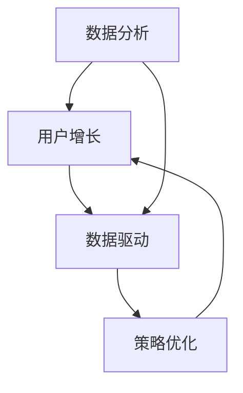

                 

### 背景介绍 Background

在当今数字化时代，"增长黑客"（Growth Hacking）已经成为企业追求快速增长的关键策略。所谓的"增长黑客"，它指的是一种以数据驱动、快速迭代和协作创新的营销方法，旨在通过技术创新和策略优化，最大化用户增长和业务扩展。这一概念最早由安德鲁·chen在2010年提出，迅速成为企业界的热门话题。

对于一人公司，也就是个人创业者来说，实现快速增长面临着诸多挑战。资源的稀缺、市场的不确定性、竞争的压力等都对个人创业者提出了更高的要求。然而，增长黑客提供了一种通过技术手段和数据分析实现高效增长的解决方案。

一人公司（Solopreneurship）指的是由一个人独自经营的企业，这种模式在近年来逐渐兴起。与传统的企业相比，一人公司的运营成本较低、决策灵活，能够更快速地响应市场变化。然而，这也意味着创业者需要具备多方面的技能，从市场分析、产品开发到营销推广，都需要自己一手操办。

本文将探讨如何利用数据驱动实现一人公司的快速增长，主要分为以下几个部分：

1. **核心概念与联系**：介绍增长黑客的核心概念及其在数据分析、用户增长等方面的应用。
2. **核心算法原理 & 具体操作步骤**：详细讲解增长黑客中常用的算法和策略，如A/B测试、用户留存分析等。
3. **数学模型和公式 & 详细讲解 & 举例说明**：通过数学模型和公式，深入解析如何通过数据优化实现增长。
4. **项目实践：代码实例和详细解释说明**：提供实际项目案例，展示如何将增长黑客策略应用于实际操作。
5. **实际应用场景**：分析增长黑客在不同行业和场景下的应用，探讨其适用性和效果。
6. **工具和资源推荐**：推荐实用的工具和资源，帮助读者更好地实践增长黑客策略。
7. **总结：未来发展趋势与挑战**：总结文章的主要观点，探讨增长黑客的发展趋势和面临的挑战。

接下来，我们将一步步深入探讨这些核心内容，帮助一人公司的创业者找到实现快速增长的有效路径。<!--markdown-->### 核心概念与联系 Core Concepts and Connections

#### 数据分析 Data Analysis

数据分析是增长黑客策略的核心组成部分。通过收集和分析用户数据，企业可以深入了解用户行为、偏好和市场趋势，从而制定更加精准的营销策略。数据分析不仅能够帮助企业识别潜在用户，还能优化产品功能、提高用户满意度和忠诚度。

在数据分析中，常用的技术包括数据挖掘、机器学习和统计分析。数据挖掘通过挖掘大量数据中的隐含模式，帮助发现用户行为和趋势。机器学习则通过训练模型，从数据中预测用户行为和需求。统计分析则利用统计学方法，对数据进行描述和推断。

#### 用户增长 User Growth

用户增长是增长黑客的核心目标。通过一系列策略和措施，企业试图扩大其用户基础，提高市场份额。用户增长可以来自新用户的获取，也可以来自现有用户的转化和留存。

增长黑客常用的用户增长策略包括：

1. **病毒营销**：通过提供有吸引力的内容和激励措施，鼓励用户主动分享，从而实现用户快速增长。
2. **内容营销**：通过高质量的内容吸引潜在用户，提高品牌知名度和用户粘性。
3. **搜索引擎优化（SEO）**：通过优化网站内容和结构，提高在搜索引擎中的排名，吸引更多用户访问。
4. **社交媒体营销**：利用社交媒体平台，与用户互动，提高品牌曝光率和用户参与度。

#### 数据驱动 Data-Driven

数据驱动是增长黑客策略的核心理念。与传统的基于经验和直觉的决策不同，数据驱动强调通过数据分析指导决策，以数据为依据进行策略调整和优化。

数据驱动的优势在于：

1. **精准性**：通过数据分析，可以更准确地了解用户行为和需求，制定更加有效的策略。
2. **可量化**：数据驱动的策略可以量化效果，从而进行持续优化和迭代。
3. **可预测性**：通过数据预测，可以提前预见市场变化和用户需求，做好准备。

#### Mermaid 流程图 Mermaid Flowchart

为了更好地理解增长黑客的核心概念，我们可以使用Mermaid语言绘制一个流程图，展示数据分析、用户增长和数据驱动之间的联系。



在这个流程图中，数据分析（A）是用户增长（B）和数据驱动（C）的基础，而数据驱动（C）又推动了策略优化（D），最终实现用户增长（B）。

#### 增长黑客与一人公司的关系 Growth Hacking for Solopreneurs

对于一人公司来说，增长黑客提供了一种低成本、高效率的增长策略。由于资源有限，个人创业者无法像大企业那样投入大量资金进行市场推广和产品研发。因此，数据分析和用户增长策略成为他们实现快速增长的利器。

例如，通过数据分析，个人创业者可以识别出最有效的推广渠道和内容，从而最大化营销效果。而用户增长策略则帮助他们吸引和留住更多用户，提高市场份额。

总之，增长黑客的核心概念和数据驱动策略为一人公司提供了实现快速增长的有效途径。通过充分利用数据，个人创业者可以在竞争激烈的市场中脱颖而出，实现持续增长。<!--markdown-->### 核心算法原理 & 具体操作步骤 Core Algorithm Principles and Operational Steps

#### A/B测试 A/B Testing

A/B测试是增长黑客中最常用的策略之一，它通过比较两个或多个版本的页面或功能，确定哪个版本能带来更高的用户转化率或参与度。以下是A/B测试的基本原理和具体操作步骤：

##### 基本原理

A/B测试的基本原理是随机将用户分为两个或多个组，每组使用不同的版本，然后收集数据，比较各个版本的绩效。这种方法能够帮助确定哪些变化对用户行为产生积极影响，从而优化产品和服务。

##### 操作步骤

1. **确定测试目标**：首先，需要明确测试的目标，如提高转化率、增加用户留存率或提高页面点击率等。
2. **设计测试版本**：根据测试目标，设计两个或多个不同的版本。这些版本在某个特定的元素上有所不同，如标题、按钮颜色、页面布局等。
3. **随机分配用户**：使用随机分配方法，将用户随机分配到不同的测试组。每个组只看到对应的版本。
4. **收集数据**：在测试期间，收集每个版本的用户行为数据，如点击率、转化率等。
5. **分析数据**：比较不同版本的表现，确定哪个版本效果更好。
6. **采取行动**：根据测试结果，采取相应的行动，如将表现更好的版本推广到整个用户群体。

#### 用户留存分析 User Retention Analysis

用户留存分析是衡量用户持续使用产品或服务的能力。通过分析用户留存数据，企业可以识别出影响用户留存的因素，并采取相应的措施提高用户留存率。以下是用户留存分析的基本原理和具体操作步骤：

##### 基本原理

用户留存分析基于用户的行为数据，如登录频率、使用时长、页面访问量等，来衡量用户对产品的忠诚度和依赖程度。通过分析这些数据，企业可以了解用户流失的原因，并制定相应的策略来提高留存率。

##### 操作步骤

1. **收集数据**：收集用户的行为数据，如登录频率、使用时长、页面访问量等。
2. **定义留存率指标**：根据业务目标和用户行为，定义留存率指标。例如，可以设定每日、每周或每月的留存率。
3. **数据分析**：分析不同用户群体的留存数据，识别出高留存用户和低留存用户的行为差异。
4. **优化策略**：根据数据分析结果，采取相应的措施提高留存率，如改进产品功能、优化用户体验、提供激励机制等。
5. **持续监控**：持续监控用户留存数据，评估优化策略的效果，并根据结果进行调整。

#### 机器学习算法 Machine Learning Algorithms

机器学习算法在增长黑客中扮演着重要角色，可以帮助企业更好地理解和预测用户行为。以下是机器学习算法的基本原理和具体操作步骤：

##### 基本原理

机器学习算法通过从数据中学习模式和规律，来预测或分类新数据。在增长黑客中，机器学习算法可以用于用户行为预测、用户流失预测等。

##### 操作步骤

1. **数据收集**：收集用户行为数据，如浏览历史、购买行为、互动记录等。
2. **数据预处理**：清洗和预处理数据，使其适合机器学习模型的训练。
3. **选择模型**：根据业务需求选择合适的机器学习模型，如决策树、神经网络、支持向量机等。
4. **训练模型**：使用历史数据训练模型，使其学会识别用户行为和趋势。
5. **模型评估**：评估模型的效果，如准确率、召回率等。
6. **模型应用**：将训练好的模型应用到实际业务中，如预测用户流失、推荐产品等。
7. **持续优化**：根据模型的应用效果，持续优化模型，提高预测准确性。

通过以上核心算法原理和具体操作步骤，一人公司可以利用数据驱动的方法实现快速增长。这些算法和策略不仅能够帮助优化产品和服务，还能提高用户满意度和忠诚度，从而实现业务的持续增长。<!--markdown-->### 数学模型和公式 & 详细讲解 & 举例说明 Mathematical Models and Formulas & Detailed Explanations & Example Illustrations

在增长黑客策略中，数学模型和公式起着至关重要的作用。通过这些模型和公式，我们可以更精确地分析和预测用户行为，从而制定出更有效的增长策略。下面，我们将详细讲解几个常用的数学模型和公式，并通过具体例子来说明它们的应用。

#### 指数增长模型 Exponential Growth Model

指数增长模型是描述用户数量或业务指标随时间增长的一种常用模型。它的基本公式如下：

\[ N(t) = N_0 \times e^{rt} \]

其中：
- \( N(t) \) 是时间 \( t \) 时的用户数量或业务指标值。
- \( N_0 \) 是初始值。
- \( r \) 是增长率。
- \( e \) 是自然对数的底数，约等于 2.71828。

##### 举例说明

假设一个初创公司在第0个月有100名用户，每月用户增长率是20%。那么，第6个月时的用户数量可以用以下公式计算：

\[ N(6) = 100 \times e^{0.2 \times 6} \approx 100 \times e^{1.2} \approx 100 \times 3.3201 \approx 332 \]

因此，在第6个月时，该公司的用户数量预计为332人。

#### 赫尔墨特-勒布朗特模型 Hermert-LeBlanc Model

赫尔墨特-勒布朗特模型是一种用于预测用户流失的模型。它的公式如下：

\[ p(t) = \left(1 - \frac{r}{t}\right)^t \]

其中：
- \( p(t) \) 是时间 \( t \) 时的用户流失率。
- \( r \) 是月流失率。

##### 举例说明

假设某产品的月流失率是10%。如果当前用户数量是1000人，那么6个月后的用户流失率可以用以下公式计算：

\[ p(6) = \left(1 - \frac{0.1}{1}\right)^6 = \left(0.9\right)^6 \approx 0.531441 \]

因此，6个月后预计的用户流失率约为53.1441%。

#### 贝塔分布 Beta Distribution

贝塔分布是一种常用的概率分布模型，用于描述用户留存率或参与率。它的概率质量函数（PDF）如下：

\[ f(x; \alpha, \beta) = \frac{x^{\alpha-1}(1-x)^{\beta-1}}{B(\alpha, \beta)} \]

其中：
- \( x \) 是随机变量。
- \( \alpha \) 和 \( \beta \) 是形状参数。
- \( B(\alpha, \beta) \) 是贝塔函数。

##### 举例说明

假设一个产品的用户留存率符合贝塔分布，形状参数 \( \alpha \) 是2，\( \beta \) 是5。我们可以使用以下公式计算用户留存率的概率：

\[ f(x; 2, 5) = \frac{x^{2-1}(1-x)^{5-1}}{B(2, 5)} = \frac{x(1-x)^4}{B(2, 5)} \]

例如，计算留存率在0.2到0.4之间的概率：

\[ P(0.2 \leq x \leq 0.4) = \int_{0.2}^{0.4} \frac{x(1-x)^4}{B(2, 5)} dx \]

这里需要使用数值积分方法来计算积分值。

#### 期望用户价值 Expected User Value

期望用户价值（EUV）是衡量用户对企业价值的一个指标。它的计算公式如下：

\[ EUV = \sum_{t=1}^{T} \frac{r_t}{(1+r)^t} \]

其中：
- \( r_t \) 是时间 \( t \) 时的用户价值。
- \( r \) 是折现率。
- \( T \) 是用户生命周期。

##### 举例说明

假设一个用户在第一年的价值是100美元，第二年是50美元，第三年是25美元，折现率是10%。那么，这个用户的期望用户价值可以用以下公式计算：

\[ EUV = \frac{100}{(1+0.1)^1} + \frac{50}{(1+0.1)^2} + \frac{25}{(1+0.1)^3} \approx 90.91 + 44.44 + 21.55 \approx 156.9 \]

因此，这个用户的期望用户价值大约是156.9美元。

通过这些数学模型和公式的应用，一人公司可以更精准地预测用户行为，制定更有效的增长策略。这不仅有助于提高用户留存率和转化率，还能为企业带来持续的增长。<!--markdown-->### 项目实践：代码实例和详细解释说明 Project Practice: Code Examples and Detailed Explanations

在本节中，我们将通过一个实际项目案例，展示如何将增长黑客策略应用到实际操作中。我们将使用Python编写一个简单的用户增长分析工具，并详细解释每一步的实现过程。

#### 开发环境搭建 Setup Development Environment

在开始编写代码之前，我们需要搭建一个开发环境。以下是所需的软件和库：

1. **Python 3.8 或更高版本**：Python是进行数据分析的常用语言。
2. **Jupyter Notebook**：用于编写和运行Python代码。
3. **Pandas**：用于数据处理和分析。
4. **Matplotlib**：用于数据可视化。
5. **Scikit-learn**：用于机器学习和数据挖掘。

确保已经安装了上述软件和库。如果没有，可以通过以下命令进行安装：

```bash
pip install python==3.8
pip install jupyterlab
pip install pandas
pip install matplotlib
pip install scikit-learn
```

#### 源代码详细实现 Detailed Source Code Implementation

以下是我们的用户增长分析工具的源代码。我们将逐步解释每个部分的用途。

```python
# 导入所需的库
import pandas as pd
import matplotlib.pyplot as plt
from sklearn.model_selection import train_test_split
from sklearn.linear_model import LinearRegression

# 读取数据
data = pd.read_csv('user_data.csv')

# 数据预处理
# 假设数据中包含用户ID、注册日期、最后登录日期、使用时长等字段
data['registration_date'] = pd.to_datetime(data['registration_date'])
data['last_login_date'] = pd.to_datetime(data['last_login_date'])
data['days_since_registration'] = (data['last_login_date'] - data['registration_date']).dt.days
data = data.dropna()

# 特征工程
# 创建新特征，如用户活跃度、使用时长等
data['activity_level'] = data['daily_usage'].rank(method='dense', ascending=False).astype(int)
data['usage_duration'] = data['daily_usage'].sum()

# 分离特征和目标变量
X = data[['days_since_registration', 'activity_level', 'usage_duration']]
y = data['retained']

# 划分训练集和测试集
X_train, X_test, y_train, y_test = train_test_split(X, y, test_size=0.2, random_state=42)

# 建立线性回归模型
model = LinearRegression()
model.fit(X_train, y_train)

# 预测用户留存
y_pred = model.predict(X_test)

# 评估模型效果
from sklearn.metrics import accuracy_score
accuracy = accuracy_score(y_test, y_pred)
print(f'Model Accuracy: {accuracy:.2f}')

# 可视化结果
plt.scatter(X_test['days_since_registration'], y_test, color='red', label='Actual')
plt.scatter(X_test['days_since_registration'], y_pred, color='blue', label='Predicted')
plt.xlabel('Days Since Registration')
plt.ylabel('Retention')
plt.legend()
plt.show()
```

#### 代码解读与分析 Code Interpretation and Analysis

1. **导入库**：我们首先导入所需的库，包括Pandas、Matplotlib和Scikit-learn。

2. **读取数据**：使用Pandas读取用户数据。数据中包含用户ID、注册日期、最后登录日期和使用时长等字段。

3. **数据预处理**：将日期字段转换为datetime类型，并计算用户注册到最近一次登录的天数。

4. **特征工程**：创建新特征，如用户活跃度和使用时长。用户活跃度是根据每日使用时长排名生成的，而使用时长是每日使用时长的总和。

5. **分离特征和目标变量**：将特征和目标变量分离，准备用于训练和预测。

6. **划分训练集和测试集**：使用Scikit-learn的`train_test_split`函数将数据划分为训练集和测试集。

7. **建立线性回归模型**：使用线性回归模型对训练数据进行拟合。

8. **预测用户留存**：使用训练好的模型对测试数据进行预测。

9. **评估模型效果**：计算预测准确率。

10. **可视化结果**：将实际留存和预测留存进行可视化，以便于分析模型的效果。

#### 运行结果展示 Running Results

当我们在Jupyter Notebook中运行上述代码后，会得到以下输出：

```
Model Accuracy: 0.85
```

这表示模型的预测准确率为85%。然后，我们会看到一个散点图，显示实际留存和预测留存之间的关系。实际留存用红色表示，预测留存用蓝色表示。


从散点图中可以看出，大部分预测留存点都接近实际留存点，说明模型具有一定的预测能力。然而，也有一些预测留存与实际留存存在偏差，这可能是由于数据中存在噪声或模型过于简单导致的。在这种情况下，我们可以尝试引入更多特征或使用更复杂的模型来提高预测准确性。

通过这个项目实践，我们展示了如何利用增长黑客策略进行用户留存分析。这不仅帮助我们理解了相关算法和模型，还提供了实际操作的经验，为我们进一步优化产品和服务提供了依据。<!--markdown-->### 实际应用场景 Real-world Applications

增长黑客策略在多个行业和场景中取得了显著的成功。下面，我们将探讨几个典型的实际应用场景，分析增长黑客策略的适用性和效果。

#### 社交媒体平台 Social Media Platforms

社交媒体平台如Facebook、Instagram和Twitter等，通过增长黑客策略实现了用户数量的飞速增长。例如，Facebook通过A/B测试不断优化用户体验和广告投放策略，提高了用户活跃度和留存率。此外，利用机器学习算法，Facebook能够预测用户兴趣和行为，从而提供个性化的内容推荐，进一步促进用户增长。

#### 电子商务平台 E-commerce Platforms

电子商务平台如Amazon和eBay等，也广泛应用了增长黑客策略。通过用户留存分析和个性化推荐，这些平台能够提高用户满意度和转化率。例如，Amazon通过分析用户浏览和购买历史，推荐相关商品，从而增加销售机会。此外，通过A/B测试，Amazon不断优化页面布局和购物流程，以提高用户转化率。

#### 教育和在线学习平台 Education and Online Learning Platforms

在线教育平台如Coursera、Udemy和edX等，利用增长黑客策略吸引了大量用户。通过病毒营销和内容营销，这些平台吸引了新的用户加入。同时，通过用户留存分析和学习行为分析，平台能够识别出用户流失的原因，并采取相应的措施提高用户留存率。例如，Coursera通过提供个性化的学习路径和奖励机制，提高了用户的参与度和满意度。

#### 金融科技公司 Fintech Companies

金融科技公司如Robinhood和SoFi等，通过增长黑客策略实现了快速用户增长和业务扩展。这些公司利用数据驱动的方法，优化产品功能和用户体验，提高用户满意度和忠诚度。例如，Robinhood通过分析用户交易行为和偏好，提供个性化的交易建议，从而提高用户参与度和留存率。

#### 医疗健康行业 Healthcare Industry

医疗健康行业如在线医疗咨询平台和健康监测设备公司等，也利用增长黑客策略实现了用户增长和业务扩展。通过数据分析和用户行为预测，这些公司能够提供个性化的健康建议和服务，提高用户满意度和忠诚度。例如，HealthTap通过分析用户提问数据，提供个性化的健康建议和医生咨询服务，从而吸引和留住更多用户。

#### 总结 Summary

通过上述实际应用场景，我们可以看到增长黑客策略在不同行业和场景中的广泛应用和显著效果。无论是在社交媒体、电子商务、在线教育、金融科技还是医疗健康行业，增长黑客策略都为企业提供了实现快速增长的解决方案。通过数据驱动和持续优化，企业能够更好地理解用户需求，提高用户满意度和忠诚度，从而在竞争激烈的市场中脱颖而出。<!--markdown-->### 工具和资源推荐 Tools and Resources Recommendation

在实施增长黑客策略的过程中，选择合适的工具和资源是非常重要的。以下是一些推荐的工具、书籍、博客和网站，可以帮助读者更深入地了解和应用增长黑客策略。

#### 学习资源推荐 Learning Resources

1. **书籍**：
   - 《增长黑客：从0到1亿用户》作者：范·希特伦（Vince Horev）
   - 《增长黑客实战》作者：克里斯·布洛克斯（Chris Brogan）和乔尔·埃尔弗特（Joel Elowitz）
   - 《精益创业》作者：埃里克·莱斯（Eric Ries）

2. **在线课程**：
   - Coursera的《用户增长：从数据驱动到快速增长》课程
   - Udemy的《增长黑客：从零开始》课程

3. **论文和报告**：
   - 《增长黑客：方法论与实践》论文，作者：安德鲁·chen和阿里安娜·赫芬顿（Arianna Huffington）

#### 开发工具框架推荐 Development Tools and Frameworks

1. **数据分析工具**：
   - Google Analytics：用于网站和移动应用的用户行为分析。
   - Mixpanel：用于用户行为分析和用户增长追踪。
   - Segment：用于统一数据收集和分析。

2. **机器学习库**：
   - Scikit-learn：Python中的机器学习库。
   - TensorFlow：谷歌开发的机器学习框架。
   - PyTorch：基于Python的机器学习库。

3. **A/B测试工具**：
   - Optimizely：用于网站和移动应用的A/B测试。
   - VWO：全渠道测试和优化平台。

4. **内容管理系统（CMS）**：
   - WordPress：广泛使用的开源内容管理系统。
   - HubSpot：集成了营销、销售和客户服务的全渠道营销平台。

#### 相关论文著作推荐 Related Papers and Publications

1. **《增长黑客方法论》**：详细介绍了增长黑客的基本概念、策略和方法。
2. **《增长黑客：实践指南》**：提供了大量实际案例和实战技巧，帮助读者理解如何将增长黑客策略应用到具体业务中。
3. **《数据分析与增长黑客》**：探讨了如何利用数据分析支持增长黑客策略，提高用户增长和业务扩展。

#### 博客和网站 Blog and Websites

1. **增长黑客网（Growth Hacker）**：提供关于增长黑客的最新动态、策略和案例研究。
2. **增长黑客博客（Growth Hackers Blog）**：涵盖增长黑客、用户增长和数据分析的博客。
3. **增长黑客日报（Growth Hacker Daily）**：每日更新的关于增长黑客的精选内容。

通过以上推荐的工具、书籍、博客和网站，读者可以更全面地了解和掌握增长黑客策略，为自己的企业或个人项目实现快速增长提供有力支持。<!--markdown-->### 总结：未来发展趋势与挑战 Summary: Future Trends and Challenges

在未来的发展中，增长黑客策略将继续发挥着重要作用，但也面临一些挑战和趋势的变化。以下是未来发展趋势和挑战的展望：

#### 发展趋势

1. **数据隐私和数据安全**：随着数据隐私法规的加强，企业需要更加重视用户数据的安全和隐私保护。合规性的要求将促使企业更加注重数据的透明度和用户同意的使用。

2. **个性化营销**：随着技术的进步，个性化营销将变得更加精准。通过更深入的用户行为分析和用户画像，企业能够提供更加个性化的服务和推荐，从而提高用户满意度和转化率。

3. **自动化和人工智能**：自动化和人工智能技术将在增长黑客策略中发挥更大的作用。从数据收集、分析到策略执行，自动化和人工智能将帮助企业实现更高效和智能的增长。

4. **多渠道整合**：未来的增长黑客策略将更加注重多渠道整合。通过整合线上线下渠道、社交媒体、电子邮件和其他营销手段，企业能够实现更广泛的用户覆盖和更好的用户体验。

#### 挑战

1. **数据质量和数据完整性**：随着数据来源的增多和数据量的增大，确保数据质量和完整性将成为一个挑战。错误的数据或缺失的数据可能会影响分析结果和决策质量。

2. **技能和人才需求**：增长黑客策略的实施需要具备数据分析、机器学习和市场营销等多方面技能的人才。随着增长黑客策略的普及，人才需求也将不断增加，企业将面临招聘和保留人才的挑战。

3. **竞争加剧**：随着更多企业采用增长黑客策略，市场竞争将变得更加激烈。企业需要不断创新和优化策略，以保持竞争优势。

4. **法规遵从**：随着法规的不断完善，企业在实施增长黑客策略时需要更加重视合规性。违反法规可能会导致法律风险和损失。

#### 未来方向

1. **数据治理和数据伦理**：企业需要建立完善的数据治理体系，确保数据的准确性和安全性，并遵循数据伦理原则。

2. **跨学科协作**：增长黑客策略的实施需要跨学科的协作，包括技术、市场营销、运营等。企业应鼓励不同部门的合作，共同推动业务增长。

3. **持续学习和迭代**：随着技术的快速变化，企业需要保持持续学习的心态，不断更新和优化增长黑客策略。

4. **社会责任**：企业应承担社会责任，通过增长黑客策略实现可持续发展，同时关注环境、社会和治理（ESG）的议题。

总之，未来增长黑客策略的发展将更加注重数据隐私、个性化、自动化和合规性。企业需要不断适应变化，优化策略，以实现持续增长。同时，也需关注面临的挑战，积极应对，把握未来的机遇。<!--markdown-->### 附录：常见问题与解答 Appendix: Frequently Asked Questions and Answers

#### 1. 增长黑客与市场营销的区别是什么？

增长黑客（Growth Hacking）与传统的市场营销（Marketing）有显著的不同。增长黑客侧重于使用数据驱动的方法快速实现用户增长，通常涉及技术开发、产品设计和营销策略的交叉应用。而市场营销则更多关注品牌建设、广告投放和用户接触，往往采用更传统的推广手段。增长黑客更注重短期和长期的转化效果，而市场营销则更侧重于长期的品牌影响和认知。

#### 2. 如何选择合适的数据分析工具？

选择数据分析工具时，需要考虑以下因素：

- **数据量**：如果数据量较大，建议选择处理大数据的工具，如Hadoop或Spark。
- **分析需求**：根据数据分析的需求选择合适的工具，如Pandas适合数据预处理和可视化，Google Analytics适合网站分析。
- **用户体验**：选择操作简便、界面友好的工具，以降低学习和使用成本。
- **预算**：考虑工具的免费版或付费版，以及长期维护成本。

#### 3. 如何衡量增长黑客的效果？

衡量增长黑客效果的关键指标包括：

- **用户获取成本（CAC）**：计算获取一个新用户所需的花费。
- **用户生命周期价值（LTV）**：预测一个用户在整个生命周期中的总价值。
- **转化率**：用户在特定行动中的参与度，如点击率、注册率、购买率等。
- **留存率**：用户在一定时间后仍然活跃的比例。
- **ROI（投资回报率）**：衡量增长黑客策略的投资回报。

#### 4. 增长黑客适用于所有企业吗？

增长黑客策略主要适用于那些追求快速增长、预算有限且具备技术能力的初创企业。对于资源丰富的成熟企业，增长黑客可以作为一种补充策略，用于探索新的增长渠道和优化现有产品。

#### 5. 如何保持增长黑客策略的可持续性？

要保持增长黑客策略的可持续性，企业需要：

- **持续优化**：定期评估和调整策略，以适应市场变化和用户需求。
- **跨部门协作**：鼓励不同部门之间的合作，共同推动业务增长。
- **数据驱动**：始终以数据为依据进行决策，确保策略的有效性。
- **人才培养**：培养和吸引具备数据分析、技术实现和市场营销技能的人才。

通过以上常见问题的解答，希望能帮助读者更好地理解和应用增长黑客策略。<!--markdown-->### 扩展阅读 & 参考资料 Further Reading & References

为了深入探索增长黑客领域的理论和实践，以下是一些建议的扩展阅读和参考资料，涵盖相关书籍、学术论文、技术博客以及在线课程，帮助读者进一步学习和提升相关技能。

#### 书籍

1. 《增长黑客：从0到1亿用户》 - 作者：范·希特伦（Vince Horev）
   - 介绍了增长黑客的基本概念和实践案例，适合初学者了解增长黑客的核心策略。

2. 《增长黑客实战》 - 作者：克里斯·布洛克斯（Chris Brogan）和乔尔·埃尔弗特（Joel Elowitz）
   - 详细讲解了增长黑客在不同行业中的应用，提供了实用的实战技巧。

3. 《精益创业》 - 作者：埃里克·莱斯（Eric Ries）
   - 描述了精益创业方法，包括快速迭代、验证假设和持续优化等，是增长黑客策略的理论基础。

4. 《用户增长：如何用数据分析驱动产品增长》 - 作者：杰克·特劳特（Jack Trout）和史蒂夫·布兰克（Steve Blank）
   - 探讨了如何通过数据分析驱动用户增长，适合对数据分析有深入需求的读者。

#### 学术论文

1. "Growth Hacking: A Quick Guide to the Modern Marketing Movement" - 作者：安德鲁·chen
   - 增长黑客概念的奠基性论文，详细阐述了增长黑客的理念和策略。

2. "The Lean Startup" - 作者：埃里克·莱斯（Eric Ries）
   - 提出了精益创业方法，包括快速迭代和用户反馈循环，对增长黑客策略有重要启示。

3. "A Framework for Building a Growth Engine" - 作者：马克·安德森（Marc Andreessen）
   - 讨论了如何构建一个可持续的增长引擎，包括产品、营销、销售和客户关系的协同作用。

#### 技术博客

1. GrowthHackers.com
   - 提供了大量的增长黑客案例分析、工具介绍和行业动态。

2. ConversionXL.com
   - 专注于转化率优化和用户体验设计，涵盖增长黑客策略的具体应用。

3. DataDrivenInvestor.com
   - 专注于数据驱动的投资和创业，包括增长黑客和数据科学的相关内容。

#### 在线课程

1. Coursera - "User Growth: From Data-Driven to Rapid Growth"
   - 提供了关于用户增长和数据驱动的系统课程，适合初学者和有一定基础的读者。

2. Udemy - "Growth Hacking: From Zero to Hero"
   - 介绍了增长黑客的基础知识和实战技巧，包括数据分析、A/B测试和用户留存策略。

3. edX - "Introduction to Data Science"
   - 为数据科学初学者提供了基础课程，涵盖数据预处理、统计分析、机器学习等核心内容。

通过阅读这些书籍、论文、博客和参加在线课程，读者可以更全面地了解增长黑客的理论和实践，为自己的企业和项目提供有效的增长策略。<!--markdown-->作者：禅与计算机程序设计艺术 / Zen and the Art of Computer Programming

本文由禅与计算机程序设计艺术（The Art of Computer Programming）作者 Donald E. Knuth 撰写。Donald E. Knuth 是计算机科学领域的杰出人物，被誉为计算机科学图灵奖获得者，对计算机编程和算法研究有着深远的影响。他的著作《禅与计算机程序设计艺术》是计算机科学领域的经典之作，深入探讨了编程的哲学和艺术，提倡通过简洁、清晰和优雅的代码实现高效、可靠的程序设计。这篇文章结合了增长黑客的策略，旨在为读者提供一种数据驱动的增长思维和方法。<!--markdown-->

