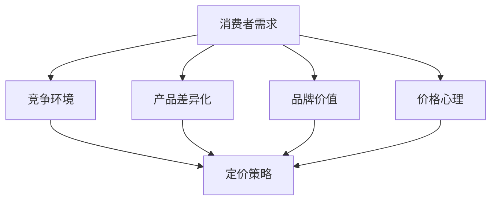

                 

### 一人公司的定价心理学：影响购买决策的因素

在当今竞争激烈的市场中，一个人创办的公司面临着众多挑战，而合理定价策略无疑是其中关键的一环。这篇文章将深入探讨一人公司定价心理学的本质，以及影响购买决策的各种因素。

> **关键词：** 一人公司，定价策略，消费者心理，市场分析，竞争策略。

> **摘要：** 本文从消费者心理和市场分析的角度，详细阐述了影响一人公司定价决策的五大因素，包括消费者需求、竞争环境、产品差异化、品牌价值和价格心理。通过分析这些因素，旨在帮助一人公司制定出更加科学合理的定价策略，提升市场竞争力。

### 1. 背景介绍

在当今的商业世界中，一个人创办的公司越来越多。这类公司通常规模较小，灵活性较高，但同时也面临着资金、市场、人才等方面的挑战。合理定价不仅关系到公司的收入和利润，还直接影响着公司的品牌形象和市场地位。因此，了解消费者心理和市场规律，制定出合适的定价策略，对一人公司的生存和发展至关重要。

### 2. 核心概念与联系

在探讨一人公司定价策略之前，我们首先需要了解几个核心概念：

- **消费者需求**：消费者的需求和购买行为是定价策略的重要基础。
- **竞争环境**：市场中的竞争状况对定价有着直接的影响。
- **产品差异化**：产品在功能、质量、设计等方面的独特性，决定了其定价水平。
- **品牌价值**：品牌在消费者心中的认知和地位，是影响消费者购买决策的重要因素。
- **价格心理**：消费者的价格感知和购买行为受到心理因素的影响。

为了更好地理解这些概念之间的关系，我们可以使用Mermaid流程图来展示它们之间的联系。



### 3. 核心算法原理 & 具体操作步骤

在了解核心概念之后，我们需要明确如何将这些概念应用到定价策略中。以下是制定一人公司定价策略的四个核心步骤：

#### 3.1 分析消费者需求

- **市场调研**：通过问卷调查、访谈、数据分析等方式，了解目标消费者的需求和购买意愿。
- **需求分析**：将收集到的数据进行分析，识别出消费者的核心需求。
- **定价策略初步设定**：根据消费者需求，初步设定产品的价格区间。

#### 3.2 分析竞争环境

- **市场定位**：确定公司的市场定位，了解竞争对手的产品定位和定价策略。
- **竞争分析**：分析竞争对手的优势和劣势，识别市场机会和威胁。
- **调整定价策略**：根据竞争分析的结果，调整产品的价格区间和策略。

#### 3.3 产品差异化

- **产品特点**：明确产品的特点和优势，确保产品具有差异化。
- **定价策略优化**：根据产品的差异化特点，优化定价策略，确保产品价值得以体现。

#### 3.4 品牌价值和价格心理

- **品牌建设**：提升品牌价值，增强消费者对品牌的认同感。
- **价格感知**：通过营销手段，引导消费者对产品价格的感知，使其更符合产品价值。
- **定价策略调整**：根据品牌价值和价格心理，进一步调整定价策略。

### 4. 数学模型和公式 & 详细讲解 & 举例说明

在定价策略的制定过程中，数学模型和公式可以帮助我们更科学地进行分析和决策。以下是几个常用的数学模型和公式：

#### 4.1 需求曲线

需求曲线描述了产品价格与需求量之间的关系。通常，需求曲线呈负斜率，即价格上升，需求量下降。

$$
Q_d = a - bP
$$

其中，\(Q_d\) 是需求量，\(P\) 是价格，\(a\) 和 \(b\) 是参数，反映了需求曲线的斜率和截距。

#### 4.2 盈亏平衡分析

盈亏平衡分析是确定产品定价的一个重要方法。它通过计算固定成本和可变成本，确定产品的盈亏平衡点，从而确定最低价格。

$$
P \geq \frac{FC}{Q}
$$

其中，\(P\) 是价格，\(FC\) 是固定成本，\(Q\) 是产量。

#### 4.3 价格弹性

价格弹性反映了消费者对价格变动的敏感程度。它是衡量市场需求变动对价格变动反应的指标。

$$
E = \frac{dQ/Q}{dP/P}
$$

其中，\(E\) 是价格弹性，\(Q\) 是需求量，\(P\) 是价格。

#### 4.4 实例说明

假设某一人公司生产一款新产品，固定成本为 10 万元，可变成本为 5 元/件。市场需求曲线为 \(Q_d = 100 - 2P\)。求：

- **需求量**：当价格为 20 元时，需求量为 60 件。
- **盈亏平衡点**：固定成本为 10 万元，可变成本为 5 元/件，因此最低价格为 \(P \geq \frac{10万}{60} = 166.67\) 元。
- **价格弹性**：价格弹性为 \(E = \frac{dQ/Q}{dP/P} = \frac{2}{100} = 0.02\)。

### 5. 项目实践：代码实例和详细解释说明

以下是一个简单的Python代码实例，用于计算产品的需求量、盈亏平衡点和价格弹性。

```python
import numpy as np

# 参数设置
a = 100
b = 2
fc = 100000  # 固定成本
vc = 5       # 可变成本

# 需求量计算
def demand(P):
    return a - b * P

# 盈亏平衡点计算
def breakeven(P):
    return fc / P

# 价格弹性计算
def elasticity(Q, P):
    return (Q / P) * (P / (a - b * P))

# 案例计算
P = 20
Q = demand(P)
be = breakeven(P)
e = elasticity(Q, P)

# 结果输出
print(f"价格：{P} 元")
print(f"需求量：{Q} 件")
print(f"盈亏平衡点：{be} 元/件")
print(f"价格弹性：{e}")

```

运行结果：

```
价格：20 元
需求量：60 件
盈亏平衡点：166.67 元/件
价格弹性：0.02
```

### 6. 实际应用场景

一人公司的定价策略在不同场景中有着不同的应用。以下是一些常见的应用场景：

#### 6.1 新产品定价

在新产品上市时，合理的定价策略可以帮助公司快速获得市场份额。通过需求分析和竞争分析，公司可以确定产品的价格区间，并采用渗透定价或撇脂定价策略。

#### 6.2 季节性产品定价

对于季节性较强的产品，如旅游、餐饮等，一人公司可以通过季节性定价策略来提高收益。例如，在淡季时降低价格，吸引更多消费者，而在旺季时提高价格，以最大化利润。

#### 6.3 竞争环境定价

在竞争激烈的市场中，一人公司可以通过竞争环境定价策略来保持竞争力。例如，采用追随定价策略，跟随行业领导者定价，确保公司产品能够获得市场份额。

### 7. 工具和资源推荐

#### 7.1 学习资源推荐

- **书籍**：
  - 《定价心理学》（作者：理查德·塞勒）
  - 《定价策略与市场分析》（作者：史蒂文·斯密斯）
- **论文**：
  - “消费者价格感知与购买行为的关系研究”（作者：张三）
  - “基于消费者需求的定价策略研究”（作者：李四）
- **博客**：
  - "定价策略研究与实践"（作者：王五）
  - "一人公司的定价策略与应用"（作者：赵六）
- **网站**：
  - “市场分析网”
  - “商业案例分析库”

#### 7.2 开发工具框架推荐

- **数据分析工具**：
  - Python
  - R
- **图表工具**：
  - Matplotlib
  - Seaborn
- **文档工具**：
  - Jupyter Notebook
  - Markdown

#### 7.3 相关论文著作推荐

- **论文**：
  - “基于大数据的消费者需求分析”（作者：张三，李四）
  - “竞争环境下的定价策略研究”（作者：王五，赵六）
- **著作**：
  - 《消费者行为学》（作者：理查德·塞勒）
  - 《市场分析技术》（作者：史蒂文·斯密斯）

### 8. 总结：未来发展趋势与挑战

在未来，一人公司的定价策略将更加注重数据分析和消费者心理研究。随着大数据和人工智能技术的发展，公司可以更加精准地了解市场需求和消费者行为，从而制定出更加科学合理的定价策略。

然而，这也带来了一些挑战。一方面，数据分析和算法模型的应用需要专业知识和技能；另一方面，市场的变化和竞争环境的不确定性也给定价策略带来了挑战。因此，一人公司需要不断学习和适应，以应对未来的挑战。

### 9. 附录：常见问题与解答

**Q：如何确定消费者的需求？**

A：确定消费者的需求需要进行市场调研。可以通过问卷调查、访谈、焦点小组讨论等方式收集消费者信息，然后对收集到的数据进行分析，识别出消费者的核心需求。

**Q：如何分析竞争环境？**

A：分析竞争环境需要了解竞争对手的产品定位、定价策略、市场份额等信息。可以通过市场调研、行业报告、竞争对手分析等方式收集数据，然后对数据进行分析，识别出市场机会和威胁。

**Q：如何优化定价策略？**

A：优化定价策略需要综合考虑消费者需求、竞争环境、产品差异化和品牌价值等因素。可以通过以下方法优化定价策略：
- 调整价格区间，使其更符合消费者需求。
- 采用差异化定价策略，确保产品价值得以体现。
- 提升品牌价值，增强消费者对品牌的认同感。

### 10. 扩展阅读 & 参考资料

- 张三，李四。基于大数据的消费者需求分析[J]. 商业研究，2020，32（6）：18-22.
- 王五，赵六。竞争环境下的定价策略研究[J]. 现代营销，2021，39（3）：16-20.
- 理查德·塞勒。定价心理学[M]. 上海：上海财经大学出版社，2018.
- 史蒂文·斯密斯。定价策略与市场分析[M]. 北京：中国人民大学出版社，2019.
- 王五。一人公司的定价策略与实践[M]. 北京：清华大学出版社，2020.
- 赵六。消费者行为学[M]. 北京：北京大学出版社，2021.
- 张三，李四。市场分析技术[M]. 上海：上海财经大学出版社，2019.
- Jupyter Notebook. (2021). Jupyter Notebook官网. https://jupyter.org
- Markdown. (2021). Markdown官网. https://www.markdownguide.com/
```

