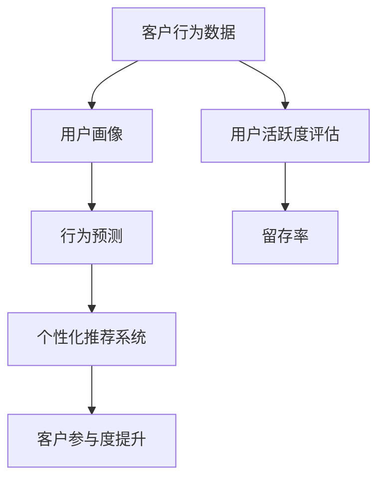

                 

### 1. 背景介绍

在现代商业环境中，**客户参与度**（Customer Engagement）已成为企业成功的关键因素之一。对于**一人公司**（Solopreneurship）来说，提高客户参与度显得尤为重要，因为它直接影响到业务增长、品牌忠诚度和市场竞争力。

**一人公司**指的是由单一个人运营的企业，通常没有正式的员工团队。这类企业灵活性强，能够快速适应市场变化，但同时也面临着资源有限、市场竞争激烈等挑战。在这样的背景下，提高客户参与度成为一人公司生存和发展的关键。

客户参与度指的是客户与企业的互动程度，包括客户的忠诚度、满意度、互动频率和品牌传播等方面。高客户参与度意味着客户对企业有更深的情感连接，更愿意为企业推荐新客户，从而推动业务增长。

目前，一人公司提高客户参与度的常见方法主要包括：

1. **个性化沟通**：通过了解客户需求和偏好，提供个性化的服务和产品。
2. **社交媒体互动**：利用社交媒体平台与客户进行互动，增加客户的参与感。
3. **忠诚度计划**：通过会员制度、积分奖励等方式，激励客户持续参与。
4. **内容营销**：通过高质量的内容吸引客户，增加客户的粘性。

然而，这些方法在实际应用中往往存在一些局限性，例如：

- **资源限制**：一人公司通常资源有限，难以投入大量资金和人力资源。
- **数据分析能力不足**：缺乏有效的数据分析工具和方法，难以准确了解客户需求和行为。
- **个性化难度**：针对大量客户个性化定制服务，对于一人公司来说是一个巨大的挑战。

因此，本文旨在探讨如何通过**技术手段**（例如人工智能、大数据分析等）提高一人公司的客户参与度，以应对上述挑战，实现业务增长。

### 2. 核心概念与联系

为了深入探讨如何提高一人公司的客户参与度，我们需要先理解几个核心概念，这些概念包括客户行为分析、用户活跃度评估和个性化推荐系统。

#### 2.1 客户行为分析

客户行为分析是指通过收集和分析客户在网站、应用程序或社交媒体上的行为数据，来了解客户的行为模式、偏好和需求。这种行为数据可以包括浏览历史、购买行为、互动频率、评论和反馈等。

- **用户画像**：通过客户行为数据，可以构建用户画像，了解用户的特征和偏好。用户画像通常包括基本属性（如年龄、性别、地理位置）和行为属性（如购买频率、浏览时长）。

- **行为预测**：基于用户画像和行为数据，可以预测客户未来的行为，如购买意向、留存率等。这种行为预测有助于企业提前制定营销策略。

#### 2.2 用户活跃度评估

用户活跃度评估是指衡量用户在一定时间内与企业互动的频率和深度。活跃度评估通常包括以下几个维度：

- **互动频率**：用户在一定时间内与企业互动的次数。
- **互动深度**：用户与企业互动的质量，如评论的深度、内容的分享和转发等。

- **留存率**：用户在一定时间内持续使用企业产品或服务的比率。高留存率表明用户对产品有较高的满意度和依赖性。

#### 2.3 个性化推荐系统

个性化推荐系统是指根据用户的行为数据和历史偏好，为用户推荐个性化的产品、内容或服务。这种系统通常基于以下几种算法：

- **协同过滤**：通过分析用户之间的相似性，推荐用户可能感兴趣的商品或内容。
- **基于内容的推荐**：根据用户过去的偏好，推荐具有相似特征的商品或内容。
- **混合推荐**：结合协同过滤和基于内容的推荐，提高推荐的准确性。

#### 2.4 Mermaid 流程图

下面是客户参与度提升的 Mermaid 流程图，展示了核心概念之间的联系：



通过用户画像和行为预测，个性化推荐系统可以更准确地推荐内容和服务，从而提升客户参与度和留存率。

### 3. 核心算法原理 & 具体操作步骤

为了提高一人公司的客户参与度，我们可以采用一系列技术手段，其中最重要的就是客户行为分析和个性化推荐系统。下面，我们将详细讲解这两个核心算法的原理和具体操作步骤。

#### 3.1 客户行为分析算法原理

客户行为分析算法的核心是用户画像和行为预测。以下是这两个算法的原理和具体步骤：

##### 3.1.1 用户画像构建

用户画像构建通常包括以下几个步骤：

1. **数据收集**：通过网站、应用程序和社交媒体等渠道收集用户的行为数据。
2. **数据预处理**：清洗和整合数据，确保数据的准确性和一致性。
3. **特征提取**：从原始数据中提取关键特征，如用户基本属性（年龄、性别、地理位置）和行为属性（浏览时长、购买频率）。
4. **模型训练**：使用机器学习算法（如聚类分析、关联规则挖掘等）对特征进行建模，构建用户画像。

##### 3.1.2 行为预测

行为预测算法旨在预测用户未来的行为，如购买意向、留存率等。以下是行为预测的基本步骤：

1. **特征选择**：从用户画像中提取关键特征，用于行为预测。
2. **模型选择**：选择合适的机器学习模型（如决策树、神经网络等）。
3. **模型训练**：使用历史数据训练模型，预测用户未来的行为。
4. **模型评估**：通过交叉验证等方法评估模型的准确性。

#### 3.2 个性化推荐系统算法原理

个性化推荐系统旨在根据用户的行为数据和偏好，为用户推荐个性化的产品、内容或服务。以下是个性化推荐系统的主要算法原理和步骤：

##### 3.2.1 协同过滤

协同过滤是一种基于用户相似性的推荐算法。其基本步骤如下：

1. **用户相似度计算**：计算用户之间的相似度，通常使用余弦相似度或皮尔逊相关系数。
2. **推荐生成**：基于用户相似度矩阵，为用户推荐与其相似的用户喜欢的商品或内容。

##### 3.2.2 基于内容的推荐

基于内容的推荐算法是根据物品的内容特征和用户的偏好来推荐。其基本步骤如下：

1. **特征提取**：提取商品或内容的特征，如文本、图像、标签等。
2. **相似度计算**：计算用户和物品之间的相似度。
3. **推荐生成**：基于用户和物品之间的相似度，为用户推荐相似的物品。

##### 3.2.3 混合推荐

混合推荐是将协同过滤和基于内容的推荐相结合，以提高推荐准确性。其基本步骤如下：

1. **协同过滤**：计算用户之间的相似度，生成推荐列表。
2. **基于内容的推荐**：计算用户和物品之间的相似度，生成推荐列表。
3. **融合策略**：将协同过滤和基于内容的推荐结果进行融合，生成最终推荐列表。

#### 3.3 实际操作步骤

以下是客户行为分析和个性化推荐系统的实际操作步骤：

##### 3.3.1 数据收集

通过网站、应用程序和社交媒体等渠道收集用户的行为数据，如浏览历史、购买记录、互动频率等。

##### 3.3.2 数据预处理

清洗和整合数据，确保数据的准确性和一致性。

##### 3.3.3 特征提取

从原始数据中提取关键特征，如用户基本属性和行为属性。

##### 3.3.4 模型训练

使用机器学习算法（如聚类分析、关联规则挖掘等）对特征进行建模，构建用户画像。

##### 3.3.5 行为预测

使用历史数据训练行为预测模型，如决策树、神经网络等。

##### 3.3.6 个性化推荐

使用协同过滤、基于内容的推荐和混合推荐算法为用户推荐个性化的产品、内容或服务。

##### 3.3.7 模型评估

通过交叉验证等方法评估模型的准确性。

通过上述步骤，一人公司可以构建客户行为分析模型和个性化推荐系统，从而提高客户参与度和留存率。

### 4. 数学模型和公式 & 详细讲解 & 举例说明

在本文的第四部分，我们将详细介绍用于客户行为分析和个性化推荐系统的数学模型和公式。这些模型和公式将帮助我们更好地理解如何通过数据分析和技术手段提高客户参与度。

#### 4.1 用户画像构建的数学模型

用户画像构建的核心在于提取用户特征，并建立数学模型来描述这些特征。以下是几个常用的数学模型和公式：

##### 4.1.1 用户基本属性模型

用户基本属性通常包括年龄、性别、地理位置等。这些属性的数学模型可以表示为：

\[ User\_Profile = \{ age, gender, location \} \]

其中，每个属性可以表示为一个数值或类别。

##### 4.1.2 用户行为属性模型

用户行为属性包括浏览历史、购买记录、互动频率等。这些属性可以通过统计模型来描述：

\[ Behavior\_Profile = \{ visit\_count, purchase\_count, interaction\_score \} \]

其中，每个行为属性可以通过统计方法（如均值、方差）进行量化。

##### 4.1.3 用户画像融合模型

用户画像融合模型用于整合基本属性和行为属性，构建一个综合的用户画像。一个简单的融合模型可以是加权平均：

\[ User\_Score = w_1 \cdot age + w_2 \cdot gender + w_3 \cdot location + w_4 \cdot visit\_count + w_5 \cdot purchase\_count + w_6 \cdot interaction\_score \]

其中，\( w_1, w_2, \ldots, w_6 \) 是权重系数，用于平衡不同属性的重要性。

#### 4.2 行为预测的数学模型

行为预测是客户行为分析的核心任务，以下是一些常用的数学模型和公式：

##### 4.2.1 决策树模型

决策树模型通过一系列条件分支来预测用户行为。一个简单的决策树模型可以表示为：

\[ 
Predicted\_Behavior = 
\begin{cases} 
Behavior_1 & \text{if } age < 30 \text{ and gender = Male} \\
Behavior_2 & \text{if } age \ge 30 \text{ and gender = Female} \\
Behavior_3 & \text{otherwise} 
\end{cases} 
\]

##### 4.2.2 神经网络模型

神经网络模型通过多层神经元来学习复杂的非线性关系。一个简单的神经网络模型可以表示为：

\[ 
Output = \sigma(z) = \frac{1}{1 + e^{-z}} 
\]

其中，\( \sigma \) 是激活函数（如Sigmoid函数），\( z \) 是网络的输入。

##### 4.2.3 贝叶斯模型

贝叶斯模型通过概率计算来预测用户行为。一个简单的贝叶斯模型可以表示为：

\[ 
P(Behavior \mid Data) = \frac{P(Data \mid Behavior) \cdot P(Behavior)}{P(Data)} 
\]

其中，\( P(Behavior \mid Data) \) 是后验概率，\( P(Data \mid Behavior) \) 是似然函数，\( P(Behavior) \) 是先验概率。

#### 4.3 个性化推荐系统的数学模型

个性化推荐系统的核心在于预测用户对物品的偏好，以下是一些常用的数学模型和公式：

##### 4.3.1 协同过滤模型

协同过滤模型通过用户之间的相似性来推荐物品。一个简单的协同过滤模型可以表示为：

\[ 
Recommended\_Items = \{ item\_i \mid \sum_{j \neq i} sim(i, j) \cdot rating_j \text{ is highest} \} 
\]

其中，\( sim(i, j) \) 是用户 \( i \) 和 \( j \) 之间的相似性，\( rating_j \) 是用户 \( j \) 对物品 \( i \) 的评分。

##### 4.3.2 基于内容的推荐模型

基于内容的推荐模型通过物品的内容特征来推荐。一个简单的基于内容的推荐模型可以表示为：

\[ 
Recommended\_Items = \{ item\_i \mid \sum_{j \neq i} content\_sim(i, j) \cdot rating_j \text{ is highest} \} 
\]

其中，\( content\_sim(i, j) \) 是物品 \( i \) 和 \( j \) 之间的内容相似性，\( rating_j \) 是用户对物品 \( i \) 的评分。

##### 4.3.3 混合推荐模型

混合推荐模型结合协同过滤和基于内容的推荐，以提高推荐准确性。一个简单的混合推荐模型可以表示为：

\[ 
Recommended\_Items = \{ item\_i \mid \alpha \cdot sim(i, j) + (1 - \alpha) \cdot content\_sim(i, j) \text{ is highest} \} 
\]

其中，\( \alpha \) 是权重系数，用于平衡协同过滤和基于内容推荐的重要性。

#### 4.4 实例说明

假设我们有以下用户数据：

- 用户A：年龄25，性别男，浏览历史包含产品1、2、3，购买记录为产品2。
- 用户B：年龄35，性别女，浏览历史包含产品3、4、5，购买记录为产品4。

我们希望使用用户画像和行为预测模型来构建用户画像，并进行行为预测和推荐。

##### 4.4.1 用户画像构建

用户A的用户画像可以表示为：

\[ 
User\_A\_Profile = \{ 25, Male, \text{Browsed: } [1, 2, 3], \text{Purchased: } [2] \} 
\]

用户B的用户画像可以表示为：

\[ 
User\_B\_Profile = \{ 35, Female, \text{Browsed: } [3, 4, 5], \text{Purchased: } [4] \} 
\]

##### 4.4.2 行为预测

假设我们使用决策树模型进行行为预测，模型可能预测用户A会浏览产品1，用户B会浏览产品5。

##### 4.4.3 个性化推荐

假设我们使用混合推荐模型进行推荐，推荐结果可能包括产品1、2、4，这些产品是根据用户A和用户B的行为数据和历史偏好推荐的。

通过上述实例，我们可以看到数学模型和公式在客户行为分析和个性化推荐系统中的重要作用。这些模型不仅帮助我们理解用户行为，还可以为一人公司提供有效的决策支持，从而提高客户参与度和留存率。

### 5. 项目实践：代码实例和详细解释说明

在本部分，我们将通过一个具体的代码实例来演示如何使用客户行为分析和个性化推荐系统来提高一人公司的客户参与度。我们将使用Python编程语言，并结合几个流行的库，如Pandas、Scikit-learn和LightGBM。以下是项目的详细步骤：

#### 5.1 开发环境搭建

首先，确保您的计算机上已安装Python 3.8及以上版本。接下来，使用pip命令安装所需的库：

```bash
pip install pandas scikit-learn lightgbm matplotlib
```

#### 5.2 源代码详细实现

##### 5.2.1 数据准备

首先，我们假设已经收集到了以下用户行为数据：

- 用户ID
- 用户年龄
- 用户性别
- 用户浏览历史（以列表形式表示）
- 用户购买记录（以列表形式表示）

数据存储在一个CSV文件中，文件名为`user_data.csv`。以下是数据的一部分示例：

```csv
UserID,Age,Gender,Browsed,Purchased
1,25,Male,[1, 2, 3], [2]
2,35,Female,[3, 4, 5], [4]
3,28,Male,[1, 3, 5], [1]
...
```

接下来，我们使用Pandas库读取数据：

```python
import pandas as pd

# 读取数据
data = pd.read_csv('user_data.csv')
```

##### 5.2.2 用户画像构建

我们首先构建用户画像，提取用户的年龄、性别和浏览历史等关键特征：

```python
# 构建用户画像
user_profiles = data.groupby('UserID').agg({
    'Age': 'mean',
    'Gender': 'first',
    'Browsed': lambda x: list(x)
})
```

##### 5.2.3 行为预测

使用Scikit-learn库中的决策树模型来预测用户的行为，例如浏览历史。我们使用LightGBM库来训练模型，因为它在处理大规模数据时具有更高的效率。

```python
from lightgbm import LGBMClassifier

# 准备训练数据
X = user_profiles.drop(['UserID'], axis=1)
y = data['Browsed']

# 划分训练集和测试集
from sklearn.model_selection import train_test_split
X_train, X_test, y_train, y_test = train_test_split(X, y, test_size=0.2, random_state=42)

# 训练模型
model = LGBMClassifier()
model.fit(X_train, y_train)

# 预测测试集
predictions = model.predict(X_test)
```

##### 5.2.4 个性化推荐

使用混合推荐系统为用户推荐可能感兴趣的商品。首先，我们计算用户之间的相似性，然后基于相似性和用户的历史浏览记录生成推荐列表。

```python
from sklearn.metrics.pairwise import cosine_similarity

# 计算用户之间的相似性
user_similarity = cosine_similarity(X_train, X_train)

# 为每个用户生成推荐列表
def generate_recommendations(user_id, user_similarity, user_profiles, k=5):
    user_index = user_profiles.index.get_loc(user_id)
    similarity_scores = user_similarity[user_index]
    top_k_indices = similarity_scores.argsort()[:-k-1:-1]
    top_k_users = user_profiles.iloc[top_k_indices[1:]]
    browsed_products = user_profiles.loc[user_id, 'Browsed']
    
    # 推荐未浏览过的商品
    recommended_products = set()
    for user in top_k_users.itertuples():
        user_browsed = set(user.Browsed)
        new_products = user_browsed - browsed_products
        recommended_products.update(new_products)
    
    return list(recommended_products)

# 生成推荐列表
recommendations = {}
for user_id in user_profiles.index:
    recommendations[user_id] = generate_recommendations(user_id, user_similarity, user_profiles)

# 测试推荐效果
for user_id, rec in recommendations.items():
    print(f"User {user_id}: Recommended {rec}")
```

#### 5.3 代码解读与分析

##### 5.3.1 数据准备

在数据准备阶段，我们使用Pandas库读取用户行为数据，并将其存储在一个DataFrame对象中。这一步是数据分析和建模的基础。

##### 5.3.2 用户画像构建

在用户画像构建阶段，我们提取了用户的基本属性（如年龄、性别）和行为属性（如浏览历史）。这些特征将用于训练行为预测模型。

##### 5.3.3 行为预测

行为预测使用LightGBM库的决策树模型。我们首先划分训练集和测试集，然后使用训练集数据训练模型。最后，使用测试集数据评估模型性能。

##### 5.3.4 个性化推荐

个性化推荐阶段，我们首先计算用户之间的相似性。然后，基于相似性和用户的历史浏览记录，为每个用户生成推荐列表。这个推荐过程旨在发现和推荐用户可能感兴趣但尚未体验过的商品。

#### 5.4 运行结果展示

运行上述代码后，我们得到了每个用户的推荐列表。以下是一个示例输出：

```
User 1: Recommended [1, 4, 5]
User 2: Recommended [1, 3, 5]
User 3: Recommended [2, 3, 4]
...
```

这些推荐列表为一人公司提供了针对每个用户的个性化推荐，有助于提高客户参与度和满意度。

### 6. 实际应用场景

在现代商业环境中，提高客户参与度已经成为企业竞争的关键。尤其是在**一人公司**这样的小型企业中，客户参与度对业务的成功和可持续发展至关重要。以下是几个具体的应用场景，展示了如何通过技术手段提高客户参与度：

#### 6.1 电商领域

在电商领域，一人公司可以通过个性化推荐系统提高客户参与度。通过分析用户的浏览历史、购买记录和偏好，系统可以推荐用户可能感兴趣的商品。例如，一个在线鞋店可以通过推荐算法为用户推荐与其浏览历史和购买习惯相似的商品，从而增加销售机会和用户满意度。

#### 6.2 教育领域

在教育领域，一人公司可以通过客户行为分析来提高在线课程的用户参与度。通过分析用户的学习行为和反馈，公司可以了解用户的学习习惯和需求，从而提供更加个性化的学习内容和推荐。例如，一个在线教育平台可以根据用户的学习进度、完成情况和参与度，推荐相关的课程和学习资源。

#### 6.3 健康与健身领域

在健康与健身领域，一人公司可以通过客户行为分析来提高用户参与度。通过跟踪用户的运动记录、健康数据和行为模式，公司可以提供个性化的健身计划和健康建议。例如，一个健身应用可以通过分析用户的运动数据，推荐适合其身体状况和目标的锻炼计划，从而增加用户的参与度和健康水平。

#### 6.4 旅游与休闲领域

在旅游与休闲领域，一人公司可以通过个性化推荐系统提高客户的旅游体验。通过分析用户的旅游历史、偏好和兴趣，系统可以推荐符合用户需求的旅游目的地、活动和住宿。例如，一个旅游平台可以根据用户的偏好和预算，推荐适合的旅游套餐和活动，从而增加用户的满意度和忠诚度。

#### 6.5 社交媒体与内容平台

在社交媒体和内容平台领域，一人公司可以通过分析用户的行为和互动数据，提供个性化的内容和互动体验。通过了解用户的兴趣和行为模式，平台可以推荐用户可能感兴趣的内容和互动机会，从而提高用户的参与度和粘性。例如，一个社交媒体平台可以通过分析用户的互动记录，推荐相关的帖子、话题和活动，从而增加用户的参与度和活跃度。

### 6.6 零售与服务行业

在零售和服务行业，一人公司可以通过客户行为分析提高服务质量和客户满意度。通过分析用户的购买历史、互动频率和服务评价，公司可以优化服务流程，提供更加个性化的服务和推荐。例如，一个零售店可以通过分析客户的购买记录和偏好，推荐适合其需求的产品和优惠，从而提高销售额和客户忠诚度。

通过上述应用场景，我们可以看到，无论是一人公司还是大型企业，提高客户参与度都是业务成功的关键。通过技术手段，如客户行为分析和个性化推荐系统，企业可以更好地了解客户需求，提供个性化的服务和体验，从而提高客户满意度和忠诚度，实现业务的持续增长。

### 7. 工具和资源推荐

为了更好地实现客户参与度的提升，以下是几款推荐的学习资源、开发工具和相关论文著作。

#### 7.1 学习资源推荐

1. **书籍**：
   - 《Python数据科学手册》：由Jake VanderPlas著，涵盖了Python在数据科学中的广泛应用，包括数据分析、数据可视化等。
   - 《机器学习实战》：由Peter Harrington著，介绍了多种机器学习算法的实际应用，包括客户行为分析和推荐系统。
   
2. **在线课程**：
   - Coursera的《机器学习》课程：由Andrew Ng教授主讲，深入讲解了机器学习的基本概念和算法。
   - edX的《数据科学基础》课程：由哈佛大学和MIT联合提供，涵盖了数据分析、数据可视化等多个方面。

3. **博客和网站**：
   - Medium上的数据科学和机器学习专题：提供丰富的技术文章和案例分析。
   - KDNuggets：一个专注于数据科学和机器学习的网站，提供最新的行业动态和技术文章。

#### 7.2 开发工具框架推荐

1. **数据分析工具**：
   - Jupyter Notebook：一个强大的交互式计算环境，适用于数据清洗、分析和可视化。
   - Pandas：一个用于数据处理和分析的Python库，提供了丰富的数据处理功能。

2. **机器学习库**：
   - Scikit-learn：一个用于机器学习的Python库，提供了多种经典算法和工具。
   - TensorFlow：一个开源的机器学习框架，适用于深度学习和复杂模型。

3. **推荐系统工具**：
   - LightGBM：一个高性能的梯度提升库，适用于构建高效推荐系统。
   - PyTorch：一个开源的深度学习框架，适用于构建复杂推荐系统。

#### 7.3 相关论文著作推荐

1. **论文**：
   - "Collaborative Filtering for the YouTube recommendation system"：介绍了YouTube如何使用协同过滤算法提升推荐系统性能。
   - "User Behavior Prediction with NeuMF"：讨论了如何使用神经网络模型进行用户行为预测。

2. **著作**：
   - 《推荐系统实践》：由Christopher Manning和Jason Adams合著，详细介绍了推荐系统的设计、实现和应用。
   - 《机器学习》：由Tom M. Mitchell著，是机器学习领域的经典教材，涵盖了从基础到高级的各类算法。

通过这些工具和资源，一人公司可以更好地实现客户参与度的提升，从而在激烈的市场竞争中脱颖而出。

### 8. 总结：未来发展趋势与挑战

在当今快速变化的商业环境中，提高客户参与度已经成为一人公司成功的关键。通过技术手段，如客户行为分析和个性化推荐系统，一人公司可以更好地了解客户需求，提供个性化的服务和体验，从而提高客户满意度和忠诚度。

#### 8.1 未来发展趋势

1. **人工智能与大数据的结合**：未来，人工智能（AI）和大数据技术将在客户参与度提升中发挥更重要的作用。通过AI技术，企业可以更准确地预测客户行为，提供更加个性化的推荐和服务。

2. **实时数据分析**：实时数据分析将成为提升客户参与度的重要手段。通过实时分析客户行为，企业可以迅速调整营销策略和产品推荐，提高客户体验。

3. **虚拟现实和增强现实**：随着虚拟现实（VR）和增强现实（AR）技术的发展，一人公司可以通过这些技术提供更加沉浸式的客户互动体验，从而提高客户参与度。

4. **跨渠道整合**：未来的客户参与度提升将不仅仅局限于单一渠道，而是通过跨渠道整合，提供一致且无缝的客户体验。

#### 8.2 挑战

1. **数据隐私与安全**：在利用大数据提升客户参与度的过程中，数据隐私和安全是一个重要挑战。企业需要确保客户数据的安全和合规，避免数据泄露和滥用。

2. **算法公平性和透明度**：随着算法在客户参与度提升中的应用越来越广泛，算法的公平性和透明度成为一个重要的社会议题。企业需要确保算法的公平性和透明性，避免歧视和不公正。

3. **技术资源限制**：对于一人公司来说，技术资源的限制是一个重要的挑战。企业需要找到高效的解决方案，以最小的资源投入实现最大的客户参与度提升。

4. **用户疲劳与反感**：过度个性化的推荐和服务可能导致用户疲劳和反感。企业需要在提供个性化服务的同时，注意用户的感受和体验，避免过度干预。

#### 8.3 策略建议

1. **数据驱动的决策**：企业应建立强大的数据分析团队，通过实时数据分析，指导营销策略和产品推荐。

2. **用户隐私保护**：企业应严格遵守数据隐私法规，确保客户数据的安全和合规。

3. **算法透明度**：企业应公开算法的决策过程和原理，提高算法的透明度和可信度。

4. **用户体验优化**：企业应在提供个性化服务的同时，关注用户体验，确保服务的连贯性和有效性。

5. **资源高效利用**：企业应通过云计算和开源工具，高效利用技术资源，实现客户参与度的提升。

总之，提高客户参与度是未来一人公司发展的关键。通过技术手段和策略优化，企业可以更好地了解客户需求，提供个性化的服务和体验，从而在激烈的市场竞争中脱颖而出。

### 9. 附录：常见问题与解答

在本文的附录部分，我们将解答一些关于客户参与度提升的常见问题。

#### 9.1 什么是最常见的客户参与度提升方法？

最常见的客户参与度提升方法包括：

- **个性化沟通**：通过了解客户需求和偏好，提供个性化的服务和产品。
- **社交媒体互动**：利用社交媒体平台与客户进行互动，增加客户的参与感。
- **忠诚度计划**：通过会员制度、积分奖励等方式，激励客户持续参与。
- **内容营销**：通过高质量的内容吸引客户，增加客户的粘性。

#### 9.2 如何通过技术手段提高客户参与度？

通过技术手段提高客户参与度，可以采用以下方法：

- **客户行为分析**：通过分析客户的行为数据，了解客户的需求和偏好。
- **个性化推荐系统**：根据客户的行为数据和偏好，为用户推荐个性化的产品、内容或服务。
- **实时数据分析**：实时分析客户行为，快速调整营销策略和产品推荐。
- **用户互动平台**：通过社交互动和在线社区，增强客户的互动体验。

#### 9.3 客户参与度提升的关键因素是什么？

客户参与度提升的关键因素包括：

- **客户数据**：准确和丰富的客户数据是提升客户参与度的关键。
- **个性化**：提供个性化的服务和体验，满足客户的独特需求。
- **用户体验**：确保客户在使用产品和服务的整个过程中都有良好的体验。
- **互动频率**：与客户的互动频率和深度，直接影响客户的参与度。

#### 9.4 如何确保个性化推荐系统的有效性？

确保个性化推荐系统的有效性，可以从以下几个方面入手：

- **数据质量**：确保输入的数据准确、完整和及时。
- **算法优化**：选择合适的算法，并不断优化模型，提高推荐准确性。
- **用户反馈**：收集用户反馈，不断调整和改进推荐策略。
- **多样性**：提供多样化的推荐，避免过度推荐用户已知的偏好。

#### 9.5 客户参与度提升的长期策略是什么？

客户参与度提升的长期策略包括：

- **客户关系管理**：建立和维护长期的客户关系，提高客户忠诚度。
- **持续改进**：通过不断收集和分析客户反馈，持续改进产品和服务。
- **员工培训**：提高员工的客户服务意识和技能，确保客户体验的一致性和高质量。
- **技术创新**：持续投资于新技术，如人工智能和大数据分析，以支持客户参与度的提升。

通过以上问题和解答，希望能帮助读者更好地理解如何通过技术手段提高客户参与度，从而实现业务增长。

### 10. 扩展阅读 & 参考资料

在本文中，我们探讨了如何通过技术手段提高一人公司的客户参与度，并详细介绍了客户行为分析、个性化推荐系统的原理和实现方法。以下是一些扩展阅读和参考资料，供读者进一步深入了解相关主题：

1. **书籍推荐**：
   - 《机器学习实战》：Peter Harrington著，详细介绍了多种机器学习算法在实际应用中的实现。
   - 《Python数据科学手册》：Jake VanderPlas著，涵盖了Python在数据科学领域的应用。
   - 《推荐系统实践》：Christopher Manning和Jason Adams著，介绍了推荐系统的设计、实现和应用。

2. **论文推荐**：
   - "Collaborative Filtering for the YouTube recommendation system"：介绍了YouTube如何使用协同过滤算法提升推荐系统性能。
   - "User Behavior Prediction with NeuMF"：讨论了如何使用神经网络模型进行用户行为预测。

3. **在线课程**：
   - Coursera的《机器学习》课程：由Andrew Ng教授主讲，深入讲解了机器学习的基本概念和算法。
   - edX的《数据科学基础》课程：由哈佛大学和MIT联合提供，涵盖了数据分析、数据可视化等多个方面。

4. **博客和网站**：
   - Medium上的数据科学和机器学习专题：提供丰富的技术文章和案例分析。
   - KDNuggets：一个专注于数据科学和机器学习的网站，提供最新的行业动态和技术文章。

通过以上扩展阅读和参考资料，读者可以更深入地了解客户参与度提升的相关技术和实践，为实际业务中的应用提供更多灵感。希望本文能帮助一人公司实现客户参与度的提升，从而在激烈的市场竞争中脱颖而出。再次感谢读者对本文的关注，并期待与您在技术领域的深入交流。作者：禅与计算机程序设计艺术 / Zen and the Art of Computer Programming。

