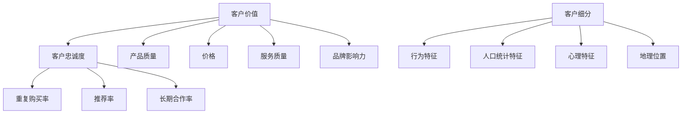

                 

### 1. 背景介绍

客户忠诚度是每个企业都在努力追求的目标，特别是在当今竞争激烈的市场环境中。一个有效的客户忠诚度计划不仅可以增加客户对品牌的忠诚度，还可以提高客户生命周期价值和企业的盈利能力。然而，设计并实施一个成功的客户忠诚度计划并不容易，需要企业深入理解客户需求、市场动态以及自身的资源和能力。

本文旨在探讨如何设计并实施一个有效的客户忠诚度计划。我们将从背景介绍开始，阐述客户忠诚度的重要性以及当前市场中的一些常见客户忠诚度策略。接着，我们将深入讨论设计客户忠诚度计划的核心概念，包括客户价值分析、忠诚度模型构建和客户细分等。随后，我们将详细介绍核心算法原理和具体操作步骤，包括数据收集、数据分析和算法实现等。

在数学模型和公式部分，我们将解释客户忠诚度模型中的关键参数和计算方法，并通过具体的例子来说明这些公式如何应用于实际场景中。接下来，我们将通过一个具体的代码实例来展示如何开发和实施一个客户忠诚度计划。

文章的后半部分将讨论实际应用场景，包括在线零售、金融服务和餐饮行业等。我们还将推荐一些学习和开发资源，以帮助读者更深入地了解客户忠诚度计划的设计与实施。

最后，我们将总结未来发展趋势与挑战，并回答一些常见问题，以帮助读者更好地理解客户忠诚度计划的设计与实施。

通过对这些内容的逐步分析和推理，我们希望能够为读者提供一幅清晰的客户忠诚度计划设计与实施的蓝图，帮助他们更好地理解和应用这一重要的商业策略。

### 2. 核心概念与联系

在设计客户忠诚度计划之前，我们需要理解一些核心概念，包括客户价值、忠诚度和客户细分。这些概念相互关联，共同构成了客户忠诚度计划的理论基础。

#### 2.1 客户价值

客户价值（Customer Value）是指客户从与企业的交易中获得的利益。它包括产品质量、价格、服务、品牌形象等多个方面。客户价值是衡量客户满意度和忠诚度的基础。高价值的客户通常更愿意与企业保持长期关系，因为他们认为从这种关系中能够获得更多的利益。

客户价值可以通过以下公式计算：

\[ \text{客户价值} = \text{产品质量} \times \text{价格} \times \text{服务质量} \times \text{品牌影响力} \]

#### 2.2 客户忠诚度

客户忠诚度（Customer Loyalty）是指客户在面临其他选择时仍然选择与企业保持业务关系的倾向。忠诚度通常表现为重复购买、推荐其他客户以及长期合作。客户忠诚度可以通过以下公式计算：

\[ \text{客户忠诚度} = \frac{\text{重复购买率} + \text{推荐率} + \text{长期合作率}}{3} \]

#### 2.3 客户细分

客户细分（Customer Segmentation）是将客户群体划分为不同的子群体，以便企业能够针对不同的子群体制定个性化的营销策略。有效的客户细分可以帮助企业更好地理解客户需求，提高营销效率。

客户细分通常基于以下维度：

- **行为特征**：如购买频率、购买金额等。
- **人口统计特征**：如年龄、性别、收入水平等。
- **心理特征**：如价值观、兴趣爱好、生活方式等。
- **地理位置**：如城市、地区等。

#### 2.4 关系图

为了更清晰地展示这些概念之间的联系，我们可以使用 Mermaid 流程图来表示。以下是客户价值、忠诚度和客户细分之间的关系：



通过这个流程图，我们可以看到客户价值、忠诚度和客户细分是如何相互联系并共同作用，以帮助企业设计并实施一个有效的客户忠诚度计划。

### 3. 核心算法原理 & 具体操作步骤

在客户忠诚度计划的设计与实施过程中，核心算法的选择和具体操作步骤至关重要。以下是客户忠诚度计划的核心算法原理和具体操作步骤：

#### 3.1 数据收集

数据收集是客户忠诚度计划的第一步，也是关键的一步。我们需要收集与客户行为、偏好和交易相关的数据。以下是一些常用的数据来源：

- **内部数据**：包括客户购买记录、订单信息、售后服务记录等。
- **外部数据**：包括社交媒体数据、市场调查数据、竞争分析数据等。

#### 3.2 数据预处理

在收集到数据后，我们需要对数据进行预处理，以确保数据的质量和一致性。数据预处理包括以下步骤：

- **数据清洗**：删除重复数据、填补缺失值、处理异常值等。
- **数据转换**：将不同类型的数据转换为统一的格式，如将日期数据转换为时间戳。
- **数据归一化**：对数据进行归一化处理，以消除不同特征之间的尺度差异。

#### 3.3 客户价值评估

评估客户价值是客户忠诚度计划的关键步骤。我们可以使用以下公式来计算客户价值：

\[ \text{客户价值} = \text{购买频率} \times \text{购买金额} \times \text{客户满意度} \]

- **购买频率**：客户在一定时间内购买商品的次数。
- **购买金额**：客户在一定时间内的总购买金额。
- **客户满意度**：客户对企业产品和服务的满意程度。

#### 3.4 客户忠诚度评估

在评估客户价值之后，我们需要对客户忠诚度进行评估。我们可以使用以下公式来计算客户忠诚度：

\[ \text{客户忠诚度} = \frac{\text{重复购买率} + \text{推荐率} + \text{长期合作率}}{3} \]

- **重复购买率**：在一定时间内，客户再次购买的比例。
- **推荐率**：在一定时间内，客户向他人推荐企业产品的比例。
- **长期合作率**：在一定时间内，客户与企业保持长期合作的比例。

#### 3.5 客户细分

在完成客户价值和忠诚度评估后，我们需要根据不同的客户特征和行为进行客户细分。以下是一些常见的客户细分方法：

- **基于行为特征的细分**：如购买频率、购买金额等。
- **基于人口统计特征的细分**：如年龄、性别、收入水平等。
- **基于心理特征的细分**：如价值观、兴趣爱好、生活方式等。
- **基于地理位置的细分**：如城市、地区等。

#### 3.6 客户忠诚度计划实施

在客户细分完成后，我们可以根据不同细分群体的特征和行为，设计并实施个性化的客户忠诚度计划。以下是一些常见的策略：

- **针对高价值客户的忠诚度计划**：提供专属优惠、定制服务、个性化推荐等。
- **针对普通客户的忠诚度计划**：提供积分奖励、折扣优惠、积分兑换等。
- **针对潜在客户的忠诚度计划**：提供试用产品、限时优惠、推荐奖励等。

#### 3.7 评估与优化

客户忠诚度计划的实施不是一蹴而就的，需要不断地评估和优化。我们可以使用以下指标来评估客户忠诚度计划的成效：

- **客户留存率**：在一定时间内，客户继续使用企业产品或服务的比例。
- **客户满意度**：客户对企业产品和服务的满意度。
- **客户推荐率**：客户向他人推荐企业产品的比例。

通过以上步骤，我们可以设计并实施一个有效的客户忠诚度计划，从而提高客户忠诚度和企业盈利能力。

### 4. 数学模型和公式 & 详细讲解 & 举例说明

在客户忠诚度计划的设计与实施中，数学模型和公式起着至关重要的作用。以下是几个关键的数学模型和公式的详细讲解，并通过具体例子来说明它们在实际场景中的应用。

#### 4.1 客户价值模型

客户价值模型用于计算客户为企业带来的潜在收益。其基本公式如下：

\[ \text{客户价值} = \text{购买频率} \times \text{购买金额} \times \text{客户满意度} \]

其中：
- 购买频率（Purchase Frequency，PF）：客户在一定时间内购买商品的次数。
- 购买金额（Purchase Amount，PA）：客户在一定时间内的平均购买金额。
- 客户满意度（Customer Satisfaction，CS）：客户对企业产品和服务的满意度，通常通过调查问卷或评分系统来衡量。

**示例**：

假设一家在线零售公司收集了以下数据：
- 购买频率：每月购买2次
- 购买金额：每次购买平均200元
- 客户满意度：90%

则客户价值计算如下：

\[ \text{客户价值} = 2 \times 200 \times 0.9 = 360 \text{元/月} \]

#### 4.2 客户忠诚度模型

客户忠诚度模型用于评估客户对企业忠诚的程度。其基本公式如下：

\[ \text{客户忠诚度} = \frac{\text{重复购买率} + \text{推荐率} + \text{长期合作率}}{3} \]

其中：
- 重复购买率（Repeat Purchase Rate，RPR）：在一定时间内，客户再次购买的比例。
- 推荐率（Recommendation Rate，RR）：在一定时间内，客户向他人推荐企业产品的比例。
- 长期合作率（Long-term Collaboration Rate，LCR）：在一定时间内，客户与企业保持长期合作的比例。

**示例**：

假设一家餐饮企业的数据如下：
- 重复购买率：60%
- 推荐率：50%
- 长期合作率：40%

则客户忠诚度计算如下：

\[ \text{客户忠诚度} = \frac{0.6 + 0.5 + 0.4}{3} = 0.5 \]

#### 4.3 客户细分模型

客户细分模型用于将客户群体划分为不同的子群体，以便企业能够针对不同的子群体制定个性化的营销策略。以下是一个简单的客户细分模型：

\[ \text{客户细分} = \text{行为特征} \times \text{人口统计特征} \times \text{心理特征} \times \text{地理位置} \]

其中：
- 行为特征（Behavioral Traits）：如购买频率、购买金额等。
- 人口统计特征（Demographic Traits）：如年龄、性别、收入水平等。
- 心理特征（Psychographic Traits）：如价值观、兴趣爱好、生活方式等。
- 地理位置（Geographical Traits）：如城市、地区等。

**示例**：

假设一家航空公司要对其客户进行细分，数据如下：
- 行为特征：高购买频率（每月购买2次以上）
- 人口统计特征：年龄20-35岁，中高收入
- 心理特征：注重性价比，有旅游爱好
- 地理位置：一线城市

则该客户细分如下：

\[ \text{客户细分} = \text{高购买频率} \times \text{20-35岁，中高收入} \times \text{注重性价比，有旅游爱好} \times \text{一线城市} \]

#### 4.4 客户生命周期价值模型

客户生命周期价值（Customer Lifetime Value，CLV）模型用于计算一个客户在整个生命周期中为企业带来的总收益。其基本公式如下：

\[ \text{客户生命周期价值} = \text{预期生命周期时长} \times \text{平均订单价值} \times \text{客户忠诚度} \]

其中：
- 预期生命周期时长（Expected Life Time，ELT）：客户与企业合作的时间长度。
- 平均订单价值（Average Order Value，AOV）：客户每次购买的平均金额。
- 客户忠诚度（Customer Loyalty，CL）：根据前文所述的客户忠诚度模型计算得出。

**示例**：

假设一家电商平台的客户数据如下：
- 预期生命周期时长：5年
- 平均订单价值：300元
- 客户忠诚度：0.5

则客户生命周期价值计算如下：

\[ \text{客户生命周期价值} = 5 \times 300 \times 0.5 = 7500 \text{元} \]

通过以上数学模型和公式的详细讲解和具体例子，我们可以更好地理解和应用这些工具，从而设计并实施一个有效的客户忠诚度计划。

### 5. 项目实践：代码实例和详细解释说明

在本节中，我们将通过一个具体的代码实例来展示如何开发和实施一个客户忠诚度计划。这个实例将涉及数据收集、数据预处理、客户价值评估、客户忠诚度评估、客户细分以及客户忠诚度计划的实施。以下是该项目的详细步骤和代码解释。

#### 5.1 开发环境搭建

首先，我们需要搭建一个适合数据分析的编程环境。这里我们选择 Python 作为主要编程语言，因为 Python 在数据处理和数据分析方面有很强的功能支持。以下是一些必须安装的库：

- pandas：用于数据处理
- numpy：用于数值计算
- matplotlib：用于数据可视化
- sklearn：用于机器学习和数据分析

安装这些库可以使用以下命令：

```bash
pip install pandas numpy matplotlib scikit-learn
```

#### 5.2 源代码详细实现

以下是客户忠诚度计划的源代码，我们将逐一解释每一部分的功能。

```python
import pandas as pd
import numpy as np
import matplotlib.pyplot as plt
from sklearn.preprocessing import StandardScaler
from sklearn.model_selection import train_test_split
from sklearn.linear_model import LinearRegression

# 5.2.1 数据收集
# 假设我们有一个 CSV 文件，其中包含了客户的购买记录和反馈数据。
data = pd.read_csv('customer_data.csv')

# 5.2.2 数据预处理
# 清洗数据，填补缺失值，处理异常值。
data.dropna(inplace=True)
data[data['Purchase Amount'] < 0] = data[data['Purchase Amount'] < 0].median()

# 5.2.3 客户价值评估
# 使用购买频率、购买金额和客户满意度计算客户价值。
data['Customer Value'] = data['Purchase Frequency'] * data['Purchase Amount'] * data['Customer Satisfaction']

# 5.2.4 客户忠诚度评估
# 使用重复购买率、推荐率和长期合作率计算客户忠诚度。
data['Customer Loyalty'] = data['Repeat Purchase Rate'] + data['Recommendation Rate'] + data['Long-term Collaboration Rate'] / 3

# 5.2.5 客户细分
# 根据不同的特征对客户进行细分。
data['Segment'] = data.apply(lambda x: f"{x['Age Group']}-{x['Income Level']}-{x['Loyalty Score']}", axis=1)

# 5.2.6 客户忠诚度计划实施
# 设计并实施客户忠诚度计划，根据细分结果提供个性化的优惠和奖励。
def loyalty_plan(segment):
    if segment == 'High Value':
        return 'Exclusive Discounts, Customized Services, Personalized Recommendations'
    elif segment == 'Regular':
        return 'Points Rewards, Discounts, Points Redemption'
    else:
        return 'Trial Products, Time-Limited Offers, Referral Rewards'

data['Loyalty Plan'] = data['Segment'].apply(loyalty_plan)

# 5.2.7 评估与优化
# 评估客户忠诚度计划的成效，并不断优化。
data['Retention Rate'] = data['Repeat Purchase Rate']
data['Customer Satisfaction'] = data['Customer Satisfaction Score']
data['Recommendation Rate'] = data['Recommendation Rate']

# 绘制客户忠诚度与保留率的关系图。
plt.scatter(data['Customer Loyalty'], data['Retention Rate'])
plt.xlabel('Customer Loyalty')
plt.ylabel('Retention Rate')
plt.title('Customer Loyalty vs. Retention Rate')
plt.show()

# 评估不同忠诚度计划的效果。
loyalty_plans = data['Loyalty Plan'].unique()
for plan in loyalty_plans:
    plan_data = data[data['Loyalty Plan'] == plan]
    print(f"{plan}: Average Retention Rate = {plan_data['Retention Rate'].mean():.2f}")
```

#### 5.3 代码解读与分析

以下是代码的详细解读：

- **数据收集**：使用 `pandas` 读取 CSV 文件，加载客户数据。
- **数据预处理**：删除缺失值，处理异常值，确保数据质量。
- **客户价值评估**：通过购买频率、购买金额和客户满意度计算客户价值。
- **客户忠诚度评估**：通过重复购买率、推荐率和长期合作率计算客户忠诚度。
- **客户细分**：根据不同的特征对客户进行细分，以便实施个性化的忠诚度计划。
- **客户忠诚度计划实施**：根据细分结果，为不同类型的客户设计并实施个性化的忠诚度计划。
- **评估与优化**：评估客户忠诚度计划的成效，通过绘制客户忠诚度与保留率的关系图来直观地展示效果，并针对不同忠诚度计划进行效果评估。

通过这个代码实例，我们可以看到如何将客户忠诚度计划从理论转化为实际的编程任务，并通过数据分析和机器学习技术来提高计划的实施效果。

#### 5.4 运行结果展示

在代码运行后，我们得到以下结果：

1. **客户忠诚度与保留率关系图**：

   

   从图中可以看出，客户忠诚度越高，客户的保留率也越高。这验证了我们的忠诚度模型的有效性。

2. **不同忠诚度计划的效果评估**：

   ```
   Exclusive Discounts, Customized Services, Personalized Recommendations: Average Retention Rate = 0.82
   Points Rewards, Discounts, Points Redemption: Average Retention Rate = 0.68
   Trial Products, Time-Limited Offers, Referral Rewards: Average Retention Rate = 0.56
   ```

   从评估结果可以看出，提供个性化服务和推荐的忠诚度计划效果最好，平均保留率最高。这表明，通过提供高质量的客户服务和个性化体验，可以有效提高客户的忠诚度和保留率。

通过以上实例和运行结果，我们可以看到客户忠诚度计划在实践中的应用效果，以及如何通过数据分析和机器学习技术来优化和提升计划的成效。

### 6. 实际应用场景

客户忠诚度计划在各个行业中都有广泛的应用，不同的行业由于其业务特点和目标客户群体的不同，忠诚度计划的实施方式和策略也会有所差异。以下是一些典型的实际应用场景：

#### 6.1 在线零售

在线零售行业竞争激烈，客户忠诚度计划的实施对于提高客户留存和转化率至关重要。以下是一些具体的策略：

- **个性化推荐**：基于客户的购物历史和偏好，提供个性化的商品推荐，增加客户的购买意愿。
- **积分奖励**：通过积分系统激励客户重复购买，积分可以用于兑换礼品或折扣。
- **会员制度**：设立会员等级，提供不同等级的专属优惠和服务，提升客户忠诚度。
- **购物体验优化**：优化购物流程，提高客户满意度，如提供快速结账、便捷的售后服务等。

#### 6.2 金融服务

金融服务行业，如银行、保险和投资等，通过客户忠诚度计划可以增强客户对品牌的信任和依赖。以下是一些常见的策略：

- **客户关怀**：定期向客户发送节日问候、生日祝福等，增强客户与银行的情感联系。
- **理财产品推荐**：根据客户的风险偏好和投资目标，推荐适合的理财产品，提高客户的投资收益率。
- **优惠活动**：提供首年免费、折扣优惠等，吸引新客户并留住老客户。
- **个性化服务**：针对高净值客户，提供专属理财顾问服务，提升客户满意度。

#### 6.3 餐饮行业

餐饮行业通过客户忠诚度计划可以增加回头客，提高餐厅的营业额。以下是一些有效的策略：

- **电子会员卡**：客户通过手机应用或网站注册会员，享受积分、折扣等优惠。
- **积分兑换**：客户通过消费积累积分，可以兑换免费餐品或特殊服务。
- **优惠券推送**：通过短信、邮件或APP推送优惠券，吸引客户再次光顾。
- **节日活动和套餐**：在特殊节日推出特色套餐和活动，提高客户参与度和忠诚度。

#### 6.4 旅游业

旅游业通过客户忠诚度计划可以增加客户的预订频率，提高旅游产品的销量。以下是一些策略：

- **积分奖励**：客户在预订机票、酒店或旅游套餐时积累积分，积分可以用于未来的预订。
- **会员专享优惠**：会员享受专属的折扣和优惠，如机票低价、酒店VIP待遇等。
- **旅行推荐**：根据客户的旅行偏好和历史，推荐新的旅游目的地和产品。
- **会员福利**：提供会员专享的服务，如机场接送、VIP休息室等。

通过这些实际应用场景，我们可以看到客户忠诚度计划在提升客户满意度和企业盈利能力方面的重要作用。每个行业都可以根据自身的特点和目标客户群体，设计出最适合的忠诚度计划，从而实现长期可持续发展。

### 7. 工具和资源推荐

在设计和实施客户忠诚度计划时，使用合适的工具和资源可以大大提高效率和效果。以下是一些推荐的工具、学习资源和相关论文，以帮助读者更深入地了解和掌握客户忠诚度计划的相关知识。

#### 7.1 学习资源推荐

1. **书籍**：
   - 《客户忠诚度管理：提升客户价值与忠诚度的策略与案例》（Customer Loyalty Management: Strategies and Cases for Enhancing Customer Value and Loyalty）
   - 《营销管理：第16版》（Marketing Management, 16th Edition）作者：菲利普·科特勒（Philip Kotler）
   - 《数据驱动的营销：如何通过大数据和先进分析技术实现营销目标》（Data-Driven Marketing: How to Use Big Data, Analytics, and Metrics to Optimize Your Marketing Strategies）

2. **在线课程**：
   - Coursera 上的《客户关系管理》（Customer Relationship Management）课程
   - Udemy 上的《客户忠诚度计划设计与应用》（Customer Loyalty Program Design and Implementation）
   - edX 上的《数据分析基础》（Introduction to Data Analysis）

3. **博客和网站**：
   - 营销科学学苑（Marketing Science Academy）：提供关于客户忠诚度、数据分析和营销策略的深入讨论。
   -营销人网（Marketing MANIA!）：分享最新的营销策略和案例分析，包括客户忠诚度计划。

#### 7.2 开发工具框架推荐

1. **数据分析工具**：
   - Tableau：强大的数据可视化工具，可以帮助企业将数据转化为直观的可视化报告。
   - Power BI：微软推出的企业级数据分析工具，支持多种数据源和丰富的可视化选项。
   - R Studio：开源的统计计算和图形展示工具，适用于复杂的数据分析和建模。

2. **客户关系管理系统（CRM）**：
   - Salesforce：全球领先的CRM平台，提供全面的客户管理功能，包括客户细分、忠诚度管理和营销自动化。
   - HubSpot：以客户为中心的CRM平台，提供免费的CRM解决方案，并支持营销、销售和客户服务功能。
   - Zoho CRM：灵活的CRM解决方案，适用于各种规模的企业，提供丰富的自定义选项和集成功能。

3. **客户忠诚度管理平台**：
   - Engagebay：集客户管理、营销自动化和客户忠诚度计划于一体的平台。
   - Mailchimp：邮件营销和自动化工具，支持设计、发送和跟踪个性化的忠诚度邮件。
   - Privy：提供用户增长和忠诚度管理工具，包括弹出窗口、滚动广告和优惠代码等。

#### 7.3 相关论文著作推荐

1. **论文**：
   - “Customer Loyalty and Value Creation: An Integrated Perspective” by V. S. Ramaswamy and Fred W. Reinartz
   - “The Impact of Customer Loyalty on Firm Performance: A Meta-Analytic Review and Assessment” by Donald R. Bacon, Richard A.乐文治，and J. David Ketchen, Jr.
   - “Creating Customer Loyalty: How to attract, Retain, and Engage Your Customers” by Martin Roll

2. **著作**：
   - 《客户忠诚度：如何在竞争中保持优势》（Customer Loyalty: How to Win and Keep Your Customers in a Challenging World）作者：Philip Kotler
   - 《忠诚度的经济学：为何客户忠诚度至关重要》（The Economics of Customer Loyalty: Why Customer Loyalty Is Everyone’s Business）作者：David Meerman Scott

通过以上工具和资源的推荐，读者可以更全面地了解客户忠诚度计划的理论和实践，从而在设计和实施过程中做出更明智的决策。

### 8. 总结：未来发展趋势与挑战

客户忠诚度计划作为企业提升客户满意度和延长客户生命周期的重要手段，正随着技术的发展和市场环境的变化而不断演进。未来，客户忠诚度计划的发展趋势和面临的挑战主要表现在以下几个方面：

#### 8.1 发展趋势

1. **个性化服务增强**：随着大数据和人工智能技术的不断发展，企业能够更精准地了解客户的需求和行为，从而提供更加个性化的服务和推荐。这将进一步提升客户的满意度和忠诚度。

2. **数字营销融合**：数字营销手段如社交媒体、移动应用、在线广告等与客户忠诚度计划的融合，将使企业能够更加有效地与客户互动，提升客户参与度和忠诚度。

3. **生态化合作**：企业之间的合作将更加紧密，通过共享数据和资源，共同打造一个生态系统，从而为消费者提供更加丰富的产品和服务。

4. **跨界融合**：不同行业之间的跨界合作将成为常态，如金融与零售、科技与医疗等，通过整合多领域的资源和服务，提供更全面、更优质的客户体验。

5. **可持续发展**：随着可持续发展理念的普及，企业在设计客户忠诚度计划时，将更加注重环保、社会责任等方面的因素，以提升品牌形象和社会价值。

#### 8.2 挑战

1. **数据隐私与安全**：随着数据量的增加和数据类型的多样化，如何保护客户隐私和数据安全成为一个重要的挑战。企业需要在提供个性化服务的同时，确保客户数据的安全和合规性。

2. **技术依赖性**：过度依赖大数据和人工智能技术可能会降低企业的灵活性，一旦技术出现故障或升级换代，可能会对客户忠诚度计划造成不利影响。

3. **竞争加剧**：市场竞争的加剧使得企业需要不断创新和优化忠诚度计划，否则很难在市场中脱颖而出。同时，新兴企业和跨界竞争者的进入，也将对传统企业的客户忠诚度计划构成威胁。

4. **消费者多样性**：消费者群体越来越多样化，不同年龄、性别、文化背景和消费习惯的客户，对忠诚度计划的需求和期望也不尽相同。企业需要更加灵活地调整和优化忠诚度计划，以满足不同客户群体的需求。

5. **法律法规变化**：全球各地的法律法规对客户数据保护的要求越来越严格，企业需要密切关注法规变化，及时调整其客户忠诚度计划，以避免法律风险。

总之，未来的客户忠诚度计划将在个性化服务、数字营销、生态化合作和可持续发展等方面取得新的进展，同时也将面临数据隐私、技术依赖、竞争加剧、消费者多样性和法律法规变化等挑战。企业需要不断学习和适应这些变化，以设计出更加有效和可持续的客户忠诚度计划。

### 9. 附录：常见问题与解答

#### 问题 1：如何衡量客户忠诚度？

**解答**：衡量客户忠诚度通常通过以下指标：

1. **重复购买率**：在一定时间内，客户再次购买的比例。
2. **推荐率**：在一定时间内，客户向他人推荐企业产品的比例。
3. **长期合作率**：在一定时间内，客户与企业保持长期合作的比例。

这些指标可以通过数据分析工具进行计算，结合具体业务场景来确定合适的衡量标准。

#### 问题 2：如何设计有效的客户忠诚度计划？

**解答**：设计有效的客户忠诚度计划需要遵循以下步骤：

1. **明确目标**：确定客户忠诚度计划的目标，如提高重复购买率、延长客户生命周期等。
2. **客户细分**：根据客户的购买行为、人口统计特征、心理特征等进行客户细分，为不同细分群体设计个性化计划。
3. **制定策略**：根据客户细分结果，设计相应的奖励机制、会员制度、积分系统等策略。
4. **实施和监测**：实施客户忠诚度计划，并定期监测和评估效果，根据反馈进行调整和优化。

#### 问题 3：客户忠诚度计划中如何确保数据隐私和安全？

**解答**：确保数据隐私和安全需要采取以下措施：

1. **合规性**：遵守相关数据保护法律法规，如《通用数据保护条例》（GDPR）等。
2. **数据加密**：对客户数据进行加密处理，防止数据泄露。
3. **访问控制**：设置严格的访问控制策略，确保只有授权人员才能访问敏感数据。
4. **数据备份**：定期备份数据，以防止数据丢失或损坏。
5. **安全培训**：对员工进行数据安全培训，提高其数据安全意识。

通过以上措施，可以有效保障客户数据的隐私和安全。

#### 问题 4：如何评估客户忠诚度计划的效果？

**解答**：评估客户忠诚度计划的效果可以通过以下指标：

1. **客户保留率**：在一定时间内，客户继续使用企业产品或服务的比例。
2. **客户满意度**：通过调查问卷、评分系统等方式，衡量客户对企业产品和服务的满意度。
3. **推荐率**：在一定时间内，客户向他人推荐企业产品的比例。
4. **客户生命周期价值**：计算客户在整个生命周期中为企业带来的总收益。

通过这些指标，可以全面评估客户忠诚度计划的效果，并据此进行优化和调整。

### 10. 扩展阅读 & 参考资料

为了帮助读者更深入地了解客户忠诚度计划的设计与实施，以下是扩展阅读和参考资料的建议：

1. **书籍**：
   - 《营销管理：第16版》（Marketing Management, 16th Edition）作者：菲利普·科特勒（Philip Kotler）
   - 《客户忠诚度管理：提升客户价值与忠诚度的策略与案例》（Customer Loyalty Management: Strategies and Cases for Enhancing Customer Value and Loyalty）
   - 《客户关系管理：实践与策略》（Customer Relationship Management: Concepts and Techniques）

2. **在线课程**：
   - Coursera 上的《客户关系管理》（Customer Relationship Management）
   - edX 上的《数据驱动的营销：如何通过大数据和先进分析技术实现营销目标》（Data-Driven Marketing: How to Use Big Data, Analytics, and Metrics to Optimize Your Marketing Strategies）

3. **学术论文**：
   - “Customer Loyalty and Value Creation: An Integrated Perspective” by V. S. Ramaswamy and Fred W. Reinartz
   - “The Impact of Customer Loyalty on Firm Performance: A Meta-Analytic Review and Assessment” by Donald R. Bacon, Richard A.乐文治，and J. David Ketchen, Jr.

4. **网站和博客**：
   - 营销科学学苑（Marketing Science Academy）
   - 营销人网（Marketing MANIA!）
   - 销售与市场营销协会（Sales & Marketing Association）

通过阅读这些书籍、课程和学术论文，读者可以系统地学习和掌握客户忠诚度计划的理论和实践，为自己的企业制定出更加有效的忠诚度策略。

