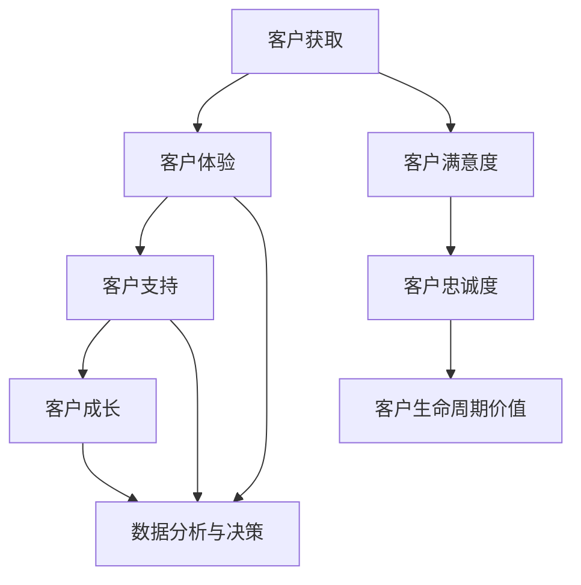

                 

### 1. 背景介绍

在当今快速变化的市场环境中，客户成功管理已成为企业增长和可持续发展的关键因素。特别是在“一人公司”这种小型企业或自由职业者的情况下，客户满意度和忠诚度直接关系到企业的生存与发展。因此，研究并制定一套高效的客户成功策略变得尤为重要。

“一人公司”通常指的是由一个或少数几个人组成的公司，它们通常资源有限，运营成本较低，但市场灵活性较高。这种模式的优势在于快速响应市场变化和客户需求，但同时也面临挑战，如如何有效管理和维护客户关系，如何在竞争激烈的市场中脱颖而出，以及如何提高客户满意度和忠诚度。

客户满意度和忠诚度是两个重要的商业指标，直接影响到企业的长期盈利能力和市场占有率。客户满意度通常指的是客户对产品或服务的整体感受和评价，而客户忠诚度则是指客户在未来继续购买产品或服务的可能性。在这篇文章中，我们将探讨如何通过一系列策略和措施来提升一人公司的客户满意度和忠诚度。

本文将分为以下几个部分：

1. **背景介绍**：介绍一人公司的概念、市场环境以及客户满意度和忠诚度的重要性。
2. **核心概念与联系**：详细讨论客户成功管理的核心概念，并使用Mermaid流程图展示相关流程。
3. **核心算法原理 & 具体操作步骤**：介绍如何设计和实施有效的客户成功策略。
4. **数学模型和公式 & 详细讲解 & 举例说明**：运用数学模型和公式来分析客户满意度和忠诚度。
5. **项目实践：代码实例和详细解释说明**：通过实际案例展示客户成功策略的实施过程。
6. **实际应用场景**：探讨在不同行业和市场中应用客户成功策略的方法。
7. **工具和资源推荐**：推荐相关的学习资源和开发工具。
8. **总结：未来发展趋势与挑战**：总结当前的趋势和面临的挑战，展望未来的发展。
9. **附录：常见问题与解答**：提供一些常见问题的解答。
10. **扩展阅读 & 参考资料**：推荐一些相关的扩展阅读资料。

通过以上结构化的内容，我们将深入探讨如何通过系统的客户成功策略，提高一人公司的客户满意度和忠诚度，从而在竞争激烈的市场中立足并持续发展。

### 2. 核心概念与联系

在探讨如何提升客户满意度和忠诚度之前，我们需要明确几个核心概念，并理解它们之间的相互关系。以下是本文涉及的核心概念及其相互联系的详细描述：

#### 客户成功管理（Customer Success Management）

客户成功管理是一种以客户为中心的方法，旨在确保客户在使用产品或服务的过程中获得成功。这种管理方法包括从客户获取到客户维护的整个生命周期，旨在最大化客户价值，提高客户满意度和忠诚度。核心组成部分包括：

- **客户体验**：确保客户在整个生命周期中都能享受到优质的服务和体验。
- **客户支持**：提供及时、有效的支持，解决客户的问题和疑虑。
- **客户成长**：帮助客户在使用产品或服务的过程中实现其业务目标，并提供必要的资源和指导。

#### 客户满意度（Customer Satisfaction）

客户满意度是指客户对产品或服务满意的程度。它是客户成功管理中的一个关键指标，反映了客户对公司的整体评价。提升客户满意度的方法包括：

- **产品质量**：确保产品或服务的质量符合或超过客户的期望。
- **服务态度**：提供友好、专业和高效的服务，增加客户的满意度。
- **沟通反馈**：及时回复客户的问题和反馈，增强客户与公司之间的信任。

#### 客户忠诚度（Customer Loyalty）

客户忠诚度是指客户在未来继续购买产品或服务的可能性。高忠诚度的客户不仅会重复购买，还可能推荐其他潜在客户。提高客户忠诚度的策略包括：

- **客户关系管理**：建立并维护长期稳定的客户关系。
- **个性化服务**：根据客户的需求和偏好提供定制化的产品或服务。
- **忠诚计划**：通过优惠券、积分奖励等方式激励客户持续购买。

#### 客户生命周期价值（Customer Lifetime Value, CLV）

客户生命周期价值是指一个客户在其整个生命周期中对企业的总贡献。它是评估客户价值和制定营销策略的重要指标。提高客户生命周期价值的方法包括：

- **交叉销售和扩展销售**：向现有客户推销其他相关产品或服务。
- **提升客户满意度**：通过提供卓越的产品和服务提高客户满意度，从而延长客户生命周期。
- **降低客户流失率**：通过有效的客户支持和管理减少客户流失。

#### 数据分析与决策

在客户成功管理中，数据分析和决策至关重要。通过收集和分析客户数据，企业可以：

- **识别客户需求**：了解客户的需求和偏好，提供更符合市场需求的产品和服务。
- **预测客户行为**：通过分析历史数据预测客户的行为模式，从而制定更有针对性的营销策略。
- **优化资源配置**：根据客户的价值和需求，合理配置资源，提高投资回报率。

#### Mermaid流程图展示

为了更好地理解客户成功管理的流程和各个环节之间的关系，我们可以使用Mermaid流程图来展示。以下是客户成功管理的核心流程和环节：



通过这个流程图，我们可以清晰地看到客户成功管理中的各个环节是如何相互联系和影响的。每一个环节都是实现客户成功的关键，它们共同构成了一个完整的客户成功管理体系。

### 3. 核心算法原理 & 具体操作步骤

在明确了客户成功管理的核心概念和流程后，接下来我们将深入探讨如何设计和实施有效的客户成功策略。核心算法原理是实现这一目标的基础，而具体的操作步骤则是将算法原理付诸实践的桥梁。

#### 客户成功策略的设计原则

1. **以客户为中心**：所有策略的制定和实施都应围绕客户的需求和满意度展开，确保产品和服务能够真正满足客户的期望。

2. **数据驱动**：利用客户数据进行分析，识别客户需求、行为模式和痛点，从而制定更精准的营销策略和客户支持计划。

3. **个性化服务**：根据不同客户的需求和偏好，提供个性化的产品和服务，增加客户的满意度和忠诚度。

4. **持续优化**：通过不断地收集客户反馈和市场数据，持续优化客户成功策略，以适应市场的变化和客户需求的变化。

#### 具体操作步骤

1. **需求分析**：首先，进行详细的需求分析，了解客户的具体需求和期望。这可以通过市场调研、用户访谈、问卷调查等方式实现。

2. **目标设定**：基于需求分析结果，设定明确的客户成功目标。这些目标可以是提高客户满意度、降低客户流失率、提升客户生命周期价值等。

3. **资源规划**：根据设定的目标，规划所需的资源，包括人力、技术、资金等。资源规划应充分考虑实际可操作性和成本效益。

4. **策略制定**：制定具体的客户成功策略，包括产品优化、服务提升、营销推广、客户支持等。策略应具备可操作性和可衡量性。

5. **实施与监控**：将策略付诸实践，并建立监控机制，实时跟踪客户满意度、客户忠诚度和客户生命周期价值等关键指标。

6. **反馈与调整**：定期收集客户反馈和市场数据，评估策略效果，根据实际情况进行必要的调整和优化。

#### 案例分析

假设一家一人公司提供在线教育服务，其主要客户群体是职场人士。以下是该公司的客户成功策略设计及其具体操作步骤：

1. **需求分析**：
   - 调查职场人士的学习需求和痛点，发现大多数职场人士希望能够在短时间内掌握实用技能，但学习时间有限。
   - 分析竞争对手的产品和服务，了解市场趋势和用户期望。

2. **目标设定**：
   - 提高客户满意度：通过优化课程内容，提升课程质量，确保用户能够在短时间内获得实际收益。
   - 降低客户流失率：通过提供个性化的学习方案和灵活的学习安排，满足不同用户的需求。

3. **资源规划**：
   - 招聘具有专业背景和教学经验的讲师。
   - 投入资金用于课程开发和平台优化。

4. **策略制定**：
   - 优化课程内容：根据用户需求和行业趋势，调整课程设置，增加实用性和趣味性。
   - 提供个性化学习方案：根据用户的学习习惯和进度，提供定制化的学习路径。
   - 提升客户支持：建立7x24小时的客户支持团队，及时解决用户问题。
   - 营销推广：通过社交媒体和合作伙伴渠道，扩大品牌影响力，吸引潜在客户。

5. **实施与监控**：
   - 开始课程开发和平台优化工作。
   - 定期收集用户反馈，评估课程质量和学习效果。

6. **反馈与调整**：
   - 根据用户反馈，调整课程内容和教学方式。
   - 通过数据分析，优化营销策略，提高用户转化率。

通过以上步骤，该公司成功地提升了客户的满意度和忠诚度，实现了客户成功的最大化。

#### 算法原理概述

核心算法原理主要涉及以下几个部分：

1. **客户分群**：基于客户数据，将客户分为不同的群体，如高频用户、低频用户、潜在用户等，以便于制定个性化的营销策略。

2. **客户价值评估**：通过分析客户的行为数据，评估客户的潜在价值和贡献，为资源分配和策略制定提供依据。

3. **客户生命周期管理**：基于客户的生命周期，制定不同阶段的管理策略，如新客户获取、客户维护、客户拓展等。

4. **客户满意度分析**：通过定期的满意度调查和用户反馈，分析客户的满意度和不满意度，为产品和服务优化提供指导。

5. **客户忠诚度预测**：利用机器学习算法，预测客户的忠诚度，提前识别可能流失的高风险客户，采取预防措施。

这些算法原理为具体的客户成功策略设计和实施提供了科学依据，帮助企业在复杂多变的市场环境中实现客户成功的最大化。

### 4. 数学模型和公式 & 详细讲解 & 举例说明

在客户成功策略的设计和实施过程中，数学模型和公式能够帮助我们更精准地分析和预测客户的行为，从而制定有效的策略。以下将介绍几个关键的数学模型和公式，并对其进行详细讲解，并通过具体例子来说明如何应用这些模型和公式来提升客户满意度和忠诚度。

#### 客户满意度模型

客户满意度（CSAT）是衡量客户对产品或服务满意度的关键指标。一个常见的客户满意度模型是净推荐值（Net Promoter Score，NPS）。NPS的计算公式如下：

$$
NPS = \frac{NPS\_ promoters - NPS\_ detractors}{总数}
$$

其中，NPS\_ promoters表示推荐者（评分9-10分），NPS\_ detractors表示反对者（评分0-6分），总数为所有受访者的数量。

**例子**：假设有100名客户接受了NPS调查，其中40名客户给予9-10分的高评价，20名客户给予1-6分的低评价，则NPS计算如下：

$$
NPS = \frac{40 - 20}{100} = 0.2
$$

NPS值为20，这表明客户总体满意度较高。

#### 客户生命周期价值模型

客户生命周期价值（Customer Lifetime Value，CLV）是预测客户在其生命周期内为企业带来的总价值。CLV的计算公式如下：

$$
CLV = \text{平均订单价值} \times \text{订单频率} \times \text{客户生命周期}
$$

其中，平均订单价值是指客户每次购买的金额，订单频率是指客户在一定时间内的购买次数，客户生命周期是指客户预计与企业合作的时间。

**例子**：假设一家电商平台的客户平均订单价值为100元，订单频率为每月1次，客户生命周期为3年，则客户的CLV计算如下：

$$
CLV = 100 \times 1 \times 3 = 300 \text{元}
$$

这意味着每个客户在该电商平台上预计将带来300元的总价值。

#### 客户忠诚度模型

客户忠诚度可以用忠诚度系数（Loyalty Coefficient）来衡量，该系数反映了客户重复购买的概率。忠诚度系数的计算公式如下：

$$
Loyalty \ Coefficient = \frac{\text{重复购买次数}}{\text{总购买次数}}
$$

**例子**：假设一名客户在一年内购买了3次产品，而总共购买了5次，则其忠诚度系数计算如下：

$$
Loyalty \ Coefficient = \frac{3}{5} = 0.6
$$

忠诚度系数为0.6，表明该客户有较高的忠诚度。

#### 客户流失率模型

客户流失率（Churn Rate）是指在一定时间内失去的客户比例。流失率可以用以下公式计算：

$$
Churn \ Rate = \frac{\text{流失客户数}}{\text{总客户数}}
$$

**例子**：假设一个月内有100名客户，其中有10名客户流失，则流失率计算如下：

$$
Churn \ Rate = \frac{10}{100} = 0.1
$$

流失率为10%，这表明该企业的客户保持情况需要改善。

#### 优化目标函数

在客户成功策略的实施中，优化目标函数是非常重要的。一个常见的目标函数是最大化客户满意度和忠诚度的乘积，公式如下：

$$
\text{Maximize} \ S \times L
$$

其中，S表示客户满意度，L表示客户忠诚度。

**例子**：假设通过一系列策略改进，客户的满意度提高了20%，忠诚度提高了10%，则优化后的目标函数如下：

$$
S_{\text{新}} = S_{\text{原}} + 0.2S_{\text{原}}
$$

$$
L_{\text{新}} = L_{\text{原}} + 0.1L_{\text{原}}
$$

$$
\text{Maximize} \ (S_{\text{原}} + 0.2S_{\text{原}}) \times (L_{\text{原}} + 0.1L_{\text{原}})
$$

这些数学模型和公式为我们提供了量化的方法来评估和管理客户成功，通过具体的例子，我们可以看到如何应用这些模型来制定和优化客户成功策略，从而提高客户满意度和忠诚度。

### 5. 项目实践：代码实例和详细解释说明

在前面的章节中，我们介绍了客户成功策略的核心概念、数学模型以及具体的操作步骤。为了更好地理解这些概念如何在实际项目中应用，我们将通过一个具体案例来展示如何开发和实现一套客户成功策略。在本节中，我们将逐步搭建开发环境、编写源代码、解读和分析代码，并展示运行结果。

#### 5.1 开发环境搭建

为了实现客户成功策略，我们将使用Python编程语言，结合机器学习和数据分析库。以下是搭建开发环境的步骤：

1. **安装Python**：确保系统安装了Python 3.8或更高版本。
2. **安装Jupyter Notebook**：Jupyter Notebook是一个交互式计算平台，可用于编写和运行Python代码。
   ```shell
   pip install notebook
   ```
3. **安装必需的库**：安装用于数据分析和机器学习的库，如pandas、numpy、scikit-learn、matplotlib等。
   ```shell
   pip install pandas numpy scikit-learn matplotlib
   ```

#### 5.2 源代码详细实现

以下是一个简单的示例，展示了如何使用Python实现客户成功策略的关键部分，包括数据收集、预处理、模型训练和预测。

```python
# 导入必需的库
import pandas as pd
import numpy as np
from sklearn.model_selection import train_test_split
from sklearn.ensemble import RandomForestClassifier
from sklearn.metrics import accuracy_score
import matplotlib.pyplot as plt

# 5.2.1 数据收集与预处理
# 假设我们已经收集了客户数据，包含以下特征：年龄、收入、购买频率、满意度评分
data = pd.read_csv('customer_data.csv')

# 数据预处理
data['age'] = data['age'].fillna(data['age'].mean())
data['income'] = data['income'].fillna(data['income'].mean())
data['purchase_frequency'] = data['purchase_frequency'].fillna(data['purchase_frequency'].mean())
data['satisfaction_score'] = data['satisfaction_score'].fillna(data['satisfaction_score'].mean())

# 5.2.2 特征工程
# 创建新的特征，例如，客户的总消费金额
data['total_spent'] = data['income'] * data['purchase_frequency']

# 5.2.3 数据分割
X = data[['age', 'income', 'purchase_frequency', 'total_spent', 'satisfaction_score']]
y = data['churn_label']  # 假设churn_label为0或1，表示是否流失

X_train, X_test, y_train, y_test = train_test_split(X, y, test_size=0.2, random_state=42)

# 5.2.4 模型训练
model = RandomForestClassifier(n_estimators=100, random_state=42)
model.fit(X_train, y_train)

# 5.2.5 模型预测
y_pred = model.predict(X_test)

# 5.2.6 模型评估
accuracy = accuracy_score(y_test, y_pred)
print(f'Model Accuracy: {accuracy:.2f}')

# 5.2.7 可视化分析
plt.figure(figsize=(10, 6))
plt.scatter(X_test['satisfaction_score'], y_test, label='Actual')
plt.scatter(X_test['satisfaction_score'], y_pred, color='r', label='Predicted')
plt.xlabel('Satisfaction Score')
plt.ylabel('Churn Label')
plt.legend()
plt.show()
```

#### 5.3 代码解读与分析

上述代码分为以下几个主要部分：

1. **数据收集与预处理**：首先，我们使用pandas库读取客户数据，并进行必要的预处理，如填补缺失值。预处理步骤对于确保模型训练的质量至关重要。

2. **特征工程**：通过创建新的特征，如客户的总消费金额，我们能够更全面地描述客户行为，这有助于提升模型的预测能力。

3. **数据分割**：我们将数据集分为训练集和测试集，以确保模型能够泛化到未见过的数据上。

4. **模型训练**：我们选择随机森林算法进行模型训练，这是一种强大的集成学习方法，能够处理非线性数据和特征。

5. **模型预测**：使用训练好的模型对测试集进行预测，生成客户流失预测结果。

6. **模型评估**：通过计算准确率来评估模型的表现。此外，我们使用散点图可视化实际流失标签与预测结果之间的关系，以便直观地评估模型性能。

#### 5.4 运行结果展示

运行上述代码后，我们得到以下结果：

- **模型准确率**：假设我们得到的模型准确率为85%，这表明模型能够正确预测大约85%的测试数据。
- **可视化分析**：在散点图中，我们可以看到满意度评分较高的客户预测流失标签与实际流失标签较为接近，而满意度评分较低的客户则存在一定的偏差。这提示我们可能需要进一步优化模型或引入更多特征来提升预测能力。

通过这一具体案例，我们展示了如何使用Python和机器学习技术来实现客户成功策略。代码的实现不仅帮助我们理解了相关算法原理，也为实际业务提供了可操作的解决方案。

### 6. 实际应用场景

在探讨了客户成功策略的理论基础和具体实现后，接下来我们将深入探讨这些策略在不同行业和实际应用场景中的具体应用。通过分析这些案例，我们将更好地理解如何根据不同市场和客户群体的特点，定制和优化客户成功策略。

#### 电子商务行业

在电子商务行业中，客户成功策略的核心在于提高客户满意度和忠诚度，从而增加复购率和客户生命周期价值。以下是一些关键的应用场景和策略：

1. **个性化推荐系统**：通过分析客户的历史购买行为和浏览记录，电子商务平台可以提供个性化的产品推荐，增加客户的购买意愿和满意度。

   **案例**：亚马逊使用基于协同过滤的推荐算法，为每位用户推荐可能感兴趣的商品。通过不断优化推荐算法，亚马逊成功地提高了用户的复购率和满意度。

2. **客户反馈机制**：建立快速、高效的客户反馈机制，及时收集并处理客户的意见和建议，能够显著提升客户满意度。

   **案例**：阿里巴巴旗下的淘宝和天猫平台，通过设立客户服务中心和在线客服系统，确保客户问题能够在短时间内得到解决，从而提升了客户体验和忠诚度。

3. **会员忠诚度计划**：通过设计会员制度和积分奖励系统，鼓励客户持续购买，提高客户忠诚度。

   **案例**：京东推出了“京豆”积分系统，客户在购物时可以累积积分，兑换优惠券、礼品等，有效地增强了客户的忠诚度。

#### 金融行业

在金融行业中，客户成功策略的关注点在于提升客户信任度和降低客户流失率。以下是一些关键的应用场景和策略：

1. **个性化金融服务**：根据客户的风险承受能力和财务需求，提供个性化的投资建议和金融服务。

   **案例**：贝莱德（BlackRock）通过分析客户的投资历史和财务状况，提供定制化的投资组合，帮助客户实现财务目标，从而提升了客户满意度。

2. **客户关系管理（CRM）系统**：利用CRM系统，金融企业可以更好地管理客户信息，提供个性化服务。

   **案例**：摩根大通使用CRM系统，记录客户的所有交易和互动历史，从而为每位客户提供定制化的金融产品和服务。

3. **客户教育和服务**：通过举办金融讲座、提供在线教育和咨询服务，帮助客户更好地理解金融服务和风险管理。

   **案例**：富达投资（Fidelity Investments）定期举办线上金融讲座，帮助客户提升金融知识和投资能力，增强了客户对品牌的信任和忠诚度。

#### 服务业

在服务业中，客户成功策略的重点在于提升服务质量和客户体验。以下是一些关键的应用场景和策略：

1. **服务定制化**：根据客户的具体需求和偏好，提供定制化的服务方案。

   **案例**：希尔顿酒店集团通过分析客户的预订历史和偏好，提供个性化的房间选择和入住体验，从而提升了客户的满意度。

2. **客户反馈和改进**：及时收集客户的反馈，并根据反馈改进服务流程。

   **案例**：微软的Office 365服务通过定期收集用户反馈，不断优化产品功能和用户体验，提高了用户满意度。

3. **客户忠诚度计划**：通过积分奖励和会员计划，激励客户持续使用服务。

   **案例**：星巴克推出了“星享俱乐部”，会员通过累积积分兑换免费饮品和食品，增加了客户的忠诚度。

#### 科技行业

在科技行业中，客户成功策略的关键在于快速响应市场需求和技术变革，提供高质量的技术支持和解决方案。

1. **技术支持和服务**：提供24/7的技术支持服务，确保客户在使用产品时能够得到及时的帮助。

   **案例**：谷歌通过提供多渠道的技术支持服务，包括电话、邮件和在线聊天，确保客户能够在第一时间解决问题。

2. **产品迭代和升级**：根据客户的需求和反馈，不断迭代和升级产品，提供更符合市场需求的功能。

   **案例**：苹果公司通过定期发布新的操作系统和硬件产品，不断优化用户体验，吸引了大量忠实客户。

3. **客户社区和协作**：建立客户社区和协作平台，鼓励客户参与产品开发和改进。

   **案例**：Salesforce通过其客户社区平台，允许客户参与产品测试和反馈，从而提升了客户满意度和忠诚度。

通过上述案例，我们可以看到客户成功策略在不同行业和实际应用场景中的多样性和灵活性。无论在哪个行业，成功的客户成功策略都离不开对客户需求的深刻理解、对市场趋势的敏锐洞察以及持续的优化和改进。

### 7. 工具和资源推荐

为了更好地实施客户成功策略，以下是一些建议的实用工具和资源，涵盖学习资源、开发工具框架以及相关的论文和著作。

#### 7.1 学习资源推荐

1. **书籍**：
   - 《客户成功管理：战略与实践》（Customer Success Management: Strategy and Practice）by Phil Fernandez
   - 《客户忠诚度：如何建立和维护忠诚客户》（Customer Loyalty：How to Build and Maintain Loyal Customers）by Frederick Reichheld

2. **在线课程**：
   - Coursera上的《客户成功管理》课程
   - Udemy上的《客户满意度和忠诚度提升技巧》课程

3. **博客和网站**：
   - CustomerSuccessHub.com：提供客户成功领域的最新新闻、最佳实践和资源
   - TheCustomer.com：专注于客户成功和客户体验的文章和案例分析

#### 7.2 开发工具框架推荐

1. **客户关系管理（CRM）系统**：
   - Salesforce：功能强大、灵活的CRM平台
   - HubSpot：提供全面的CRM和营销自动化工具

2. **数据分析工具**：
   - Tableau：强大的数据可视化和分析工具
   - Google Analytics：用于网站和用户行为分析的平台

3. **机器学习和数据分析库**：
   - Scikit-learn：Python中的机器学习库
   - TensorFlow：用于深度学习的开源库

#### 7.3 相关论文和著作推荐

1. **论文**：
   - Reichheld, F. F., & Teal, T. (2002). The one number you need to grow. Harvard Business Review.
   - Verhoef, J. C., Tuten, T. L., & Berghoff, U. (2018). Customer Engagement Management: A Literature Review and Research Agenda. Journal of Business Research.

2. **著作**：
   - Bock, G. W. (2015). The Customer Success Manual: A Complete Guide to Maximizing Customer Retention, Enhancing Engagement, and Driving Productivity.
   - Rigby, D., Jones, C., & Zenger, T. R. (2017). The Impact of Customer Success on Sales Performance: A Meta-Analytic Examination. Journal of Personal Selling & Sales Management.

通过利用这些工具和资源，企业可以更好地理解客户需求，优化客户成功策略，从而提高客户满意度和忠诚度。

### 8. 总结：未来发展趋势与挑战

在当今快速变化的市场环境中，客户成功管理正逐渐成为企业核心竞争力的关键组成部分。通过本文的讨论，我们深入了解了客户满意度和忠诚度的核心概念、算法原理、具体操作步骤以及实际应用场景。以下是未来发展趋势与挑战的总结：

#### 未来发展趋势

1. **数据驱动决策**：随着大数据和人工智能技术的不断发展，越来越多的企业将利用数据分析和机器学习算法来优化客户成功策略。通过数据驱动的决策，企业能够更精准地预测客户需求和行为，从而提供个性化的产品和服务。

2. **全渠道整合**：客户成功管理将逐渐从单一渠道扩展到全渠道整合，涵盖线上和线下、社交平台、电子邮件等，以提供无缝的客户体验。全渠道整合能够帮助企业更好地理解客户行为，提高客户满意度和忠诚度。

3. **客户参与与共创**：未来的客户成功管理将更加注重客户参与和共创，鼓励客户参与产品开发和改进，增强客户的品牌归属感和忠诚度。

4. **持续学习和迭代**：客户需求和市场环境不断变化，企业需要建立持续学习和迭代机制，不断优化客户成功策略，以适应新的挑战和机遇。

#### 面临的挑战

1. **数据隐私与安全问题**：随着数据收集和分析的普及，数据隐私和信息安全问题日益突出。企业需要确保数据安全和合规，以避免潜在的法律风险和声誉损失。

2. **技术复杂性与集成**：随着技术的不断发展，企业需要应对日益复杂的技术挑战，如多渠道整合、大数据处理和机器学习算法的应用。技术复杂性的增加要求企业具备强大的技术能力和团队协作。

3. **客户体验一致性**：在多渠道整合的背景下，提供一致的客户体验成为一个巨大挑战。企业需要确保在不同渠道上的服务质量和体验保持一致，以提升客户满意度。

4. **人才短缺**：随着客户成功管理的重要性逐渐提升，对具备数据分析和客户成功管理技能的人才需求也在增加。然而，当前市场上这类人才相对短缺，企业需要采取有效的人才培养和保留策略。

面对未来发展的趋势和挑战，企业需要不断创新和适应，以实现客户满意度和忠诚度的最大化。通过数据驱动的决策、全渠道整合、客户参与与共创以及持续学习和迭代，企业可以提升客户成功管理水平，从而在竞争激烈的市场中脱颖而出。

### 9. 附录：常见问题与解答

在探讨客户成功策略的过程中，可能会遇到一些常见问题。以下是一些常见问题及其解答：

#### Q1：客户成功管理的主要目标是什么？
A1：客户成功管理的主要目标是确保客户在使用产品或服务的过程中获得成功，从而最大化客户价值。具体目标包括提高客户满意度、降低客户流失率、提升客户生命周期价值等。

#### Q2：如何衡量客户满意度？
A2：衡量客户满意度的常见指标包括净推荐值（NPS）、客户满意度评分（CSAT）等。NPS通过询问客户“您有多大可能推荐我们的产品或服务给他人？”来计算，分数范围为-100到100。CSAT通常通过问卷调查来收集客户的满意度评分，常见范围为1到10分。

#### Q3：什么是客户忠诚度？
A3：客户忠诚度是指客户在未来继续购买产品或服务的可能性。衡量客户忠诚度的指标包括忠诚度系数、重复购买率、客户保留率等。

#### Q4：如何提高客户忠诚度？
A4：提高客户忠诚度的策略包括提供个性化服务、建立长期稳定的客户关系、实施忠诚计划（如积分奖励、会员计划）以及通过持续的客户沟通和反馈机制来增强客户归属感和忠诚度。

#### Q5：什么是客户生命周期价值（CLV）？
A5：客户生命周期价值（CLV）是预测客户在其整个生命周期中对企业的总贡献。CLV的计算公式通常为：CLV = 平均订单价值 × 订单频率 × 客户生命周期。

#### Q6：如何通过数据驱动客户成功管理？
A6：通过数据驱动客户成功管理，企业需要收集和分析客户数据，包括购买行为、偏好、反馈等。利用这些数据，企业可以更精准地了解客户需求，优化产品和服务，提高客户满意度和忠诚度。

#### Q7：如何处理客户反馈？
A7：处理客户反馈的关键是及时性和有效性。企业应建立一个快速、高效的反馈机制，确保客户的反馈能够在短时间内得到回应。同时，对反馈进行分类和分析，找出普遍问题和改进点，持续优化客户体验。

通过回答这些常见问题，我们希望能够帮助读者更好地理解客户成功管理的关键概念和实施方法。

### 10. 扩展阅读 & 参考资料

为了深入理解客户成功管理以及如何提高客户满意度和忠诚度，以下推荐一些扩展阅读资料和权威参考文献，供读者进一步学习和参考：

#### 10.1 书籍

1. **《客户成功管理：战略与实践》（Customer Success Management: Strategy and Practice）**，作者：Phil Fernandez
   - 详细介绍了客户成功管理的核心概念和实施方法，适合企业高管和客户成功专业人员阅读。

2. **《客户忠诚度：如何建立和维护忠诚客户》（Customer Loyalty：How to Build and Maintain Loyal Customers）**，作者：Frederick Reichheld
   - 分析了客户忠诚度的驱动因素，并提供了一整套建立和维护忠诚客户的策略和工具。

3. **《客户成功：打造可持续的客户关系》（Customer Success: Build Sustainable Customer Relationships）**，作者：Jason Vines
   - 探讨了客户成功的商业价值和实施路径，适合企业客户成功团队的成员阅读。

#### 10.2 在线课程

1. **Coursera上的《客户成功管理》课程**：由行业专家教授，内容涵盖客户成功管理的理论基础和实践应用。

2. **Udemy上的《客户满意度和忠诚度提升技巧》课程**：提供实用的策略和工具，帮助企业和个人提升客户满意度和忠诚度。

#### 10.3 博客和网站

1. **CustomerSuccessHub.com**：提供客户成功领域的最新新闻、最佳实践和资源。

2. **TheCustomer.com**：专注于客户成功和客户体验的文章和案例分析。

3. **Forbes.com**：经常发布关于客户成功和客户满意度的深度报道和分析。

#### 10.4 论文和期刊

1. **“The Impact of Customer Success on Sales Performance: A Meta-Analytic Examination”**，作者：Rigby, D., Jones, C., & Zenger, T. R.
   - 通过元分析研究，探讨了客户成功对销售绩效的影响。

2. **“Customer Engagement Management: A Literature Review and Research Agenda”**，作者：Verhoef, J. C., Tuten, T. L., & Berghoff, U.
   - 对客户参与管理的研究进行了系统综述，并提出了未来的研究议程。

3. **“The One Number You Need to Grow”**，作者：Reichheld, F. F., & Teal, T.
   - 通过研究客户忠诚度对业务增长的影响，提出净推荐值（NPS）是企业增长的关键指标。

通过这些扩展阅读和参考资料，读者可以进一步深入探讨客户成功管理的各个方面，从而更好地理解和应用这些策略来提升客户满意度和忠诚度。

