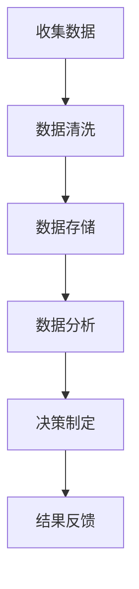
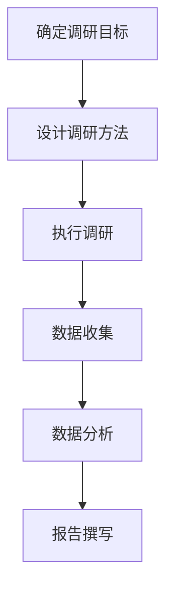
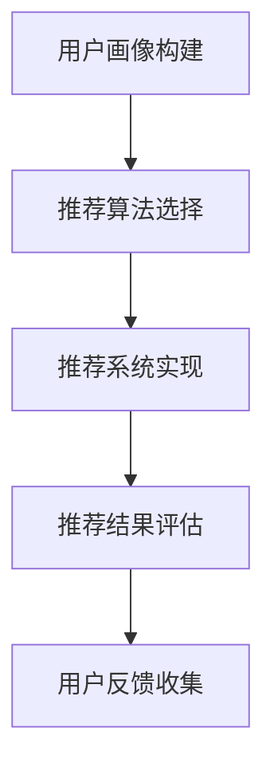

                 

### 一人公司的客户洞察：深入了解用户需求 ###

> 关键词：一人公司、客户洞察、用户需求、数据驱动、用户调研、个性化推荐

> 摘要：在数字经济的浪潮下，即使是单人公司也必须具备敏锐的市场洞察力和用户需求理解能力。本文将探讨如何通过数据驱动的方法，进行用户调研，构建个性化推荐系统，从而深入挖掘用户需求，提升一人公司的市场竞争力。

### 1. 背景介绍

在当今这个信息爆炸的时代，市场竞争愈发激烈，对于企业而言，了解并满足用户需求成为制胜的关键。而对于一人公司来说，由于其资源有限，更需要利用数据和技术手段来提升市场敏锐度和用户满意度。客户洞察（Customer Insight）是这一过程中的核心，它是指通过分析用户数据来理解用户行为、需求、偏好等，从而指导业务决策。

客户洞察不仅能够帮助企业更好地了解市场动态，还能提升用户忠诚度和满意度。对于一人公司，客户洞察的意义尤为重大，因为它直接关系到公司的生存与发展。本文将围绕如何进行客户洞察，特别是深入了解用户需求，展开探讨。

### 2. 核心概念与联系

#### 2.1 数据驱动决策（Data-Driven Decision Making）

数据驱动决策是一种基于数据的决策方法，它强调在决策过程中充分利用数据资源，以数据为基础进行推理和分析，从而做出更准确、高效的决策。

Mermaid 流程图：



#### 2.2 用户调研（User Research）

用户调研是通过多种方法收集用户信息，理解用户需求和行为，从而为产品设计、营销策略等提供依据。用户调研包括定量调研和定性调研，其中定量调研通常采用问卷调查、数据分析等方法，而定性调研则包括用户访谈、焦点小组等。

Mermaid 流程图：



#### 2.3 个性化推荐（Personalized Recommendation）

个性化推荐系统通过分析用户的历史行为、偏好和需求，为用户推荐最相关、最有价值的商品、内容或服务。个性化推荐系统一般包括用户画像、推荐算法和推荐系统三个部分。

Mermaid 流程图：



### 3. 核心算法原理 & 具体操作步骤

#### 3.1 数据收集

数据收集是客户洞察的基础，它包括用户行为数据、社交媒体数据、市场调研数据等。具体步骤如下：

1. **确定数据收集的目标和范围**：明确要收集哪些数据，以及这些数据将如何用于决策。
2. **选择合适的数据收集方法**：根据数据类型和目标，选择问卷调查、API 调用、数据爬取等方法。
3. **数据清洗**：处理无效、错误或重复的数据，确保数据质量。

#### 3.2 数据分析

数据分析是客户洞察的关键步骤，它包括数据预处理、数据可视化、数据挖掘等。具体步骤如下：

1. **数据预处理**：包括数据清洗、数据转换、数据归一化等，为数据挖掘做好准备。
2. **数据可视化**：通过图表、图形等方式，展示数据特征和关系。
3. **数据挖掘**：利用机器学习、统计分析等方法，挖掘数据中的有价值信息。

#### 3.3 用户调研

用户调研是深入了解用户需求的重要手段，包括定量调研和定性调研。具体步骤如下：

1. **确定调研目标**：明确调研的目的和期望结果。
2. **设计调研方法**：根据调研目标，选择合适的调研方法，如问卷调查、用户访谈等。
3. **执行调研**：按照设计的方法，收集用户数据。
4. **数据分析**：对收集到的数据进行分析，得出用户需求、偏好等信息。
5. **报告撰写**：将分析结果整理成报告，为业务决策提供依据。

#### 3.4 个性化推荐

个性化推荐系统可以通过以下步骤实现：

1. **用户画像构建**：根据用户历史行为和偏好，构建用户画像。
2. **推荐算法选择**：根据业务需求和数据特征，选择合适的推荐算法，如协同过滤、基于内容的推荐等。
3. **推荐系统实现**：开发推荐系统，实现算法的运行和结果展示。
4. **推荐结果评估**：评估推荐系统的效果，包括准确率、覆盖率等。
5. **用户反馈收集**：收集用户对推荐结果的反馈，用于系统优化。

### 4. 数学模型和公式 & 详细讲解 & 举例说明

#### 4.1 数据挖掘中的数学模型

在数据挖掘中，常用的数学模型包括聚类、分类、回归等。以下是一些基本的数学模型及其公式：

1. **聚类算法（K-Means）**：
   - 聚类中心更新公式：
     $$ \mu_{k} = \frac{1}{N} \sum_{i=1}^{N} x_i $$
     其中，$\mu_{k}$ 是第 $k$ 个聚类的中心，$x_i$ 是第 $i$ 个数据点。
   - 数据点到聚类中心的距离公式：
     $$ d(x_i, \mu_{k}) = \sqrt{\sum_{j=1}^{d} (x_{ij} - \mu_{kj})^2} $$

2. **支持向量机（SVM）**：
   - 最优分割平面公式：
     $$ w^* \cdot x - b = 0 $$
     其中，$w^*$ 是最优分割平面，$x$ 是数据点，$b$ 是偏置项。

3. **线性回归**：
   - 模型公式：
     $$ y = \beta_0 + \beta_1 x $$
     其中，$y$ 是因变量，$x$ 是自变量，$\beta_0$ 和 $\beta_1$ 是模型参数。

#### 4.2 用户调研中的统计方法

在用户调研中，常用的统计方法包括描述性统计、假设检验等。以下是一些基本的统计方法及其公式：

1. **描述性统计**：
   - 平均值：
     $$ \bar{x} = \frac{1}{N} \sum_{i=1}^{N} x_i $$
   - 方差：
     $$ \sigma^2 = \frac{1}{N} \sum_{i=1}^{N} (x_i - \bar{x})^2 $$
   - 标准差：
     $$ \sigma = \sqrt{\sigma^2} $$

2. **假设检验（t检验）**：
   - 检验统计量：
     $$ t = \frac{\bar{x}_1 - \bar{x}_2}{\sqrt{\frac{\sigma_1^2}{N_1} + \frac{\sigma_2^2}{N_2}}} $$
   - 临界值：
     $$ t_{\alpha/2, df} $$

#### 4.3 个性化推荐中的协同过滤算法

协同过滤算法是一种常见的个性化推荐算法，其核心思想是利用用户的历史行为数据，为用户推荐相似用户喜欢的商品或内容。以下是一个简单的协同过滤算法：

1. **用户相似度计算**：
   - 皮尔逊相关系数：
     $$ r_{ij} = \frac{\sum_{k=1}^{m} (x_{ik} - \bar{x}_i)(x_{jk} - \bar{x}_j)}{\sqrt{\sum_{k=1}^{m} (x_{ik} - \bar{x}_i)^2} \sqrt{\sum_{k=1}^{m} (x_{jk} - \bar{x}_j)^2}} $$

2. **预测用户偏好**：
   - 基于用户相似度的预测公式：
     $$ r_{ui} = \sum_{j \in N(i)} r_{ij} \cdot x_{uj} $$
     其中，$r_{ui}$ 是用户 $u$ 对项目 $i$ 的预测评分，$N(i)$ 是与用户 $u$ 相似的一组用户。

### 5. 项目实践：代码实例和详细解释说明

#### 5.1 开发环境搭建

为了进行客户洞察和个性化推荐，我们需要搭建一个开发环境。以下是基本步骤：

1. 安装Python环境：
   - 使用Python 3.x版本，推荐使用Anaconda。
2. 安装相关库：
   - NumPy、Pandas、Matplotlib、Scikit-learn、TensorFlow等。

#### 5.2 源代码详细实现

以下是一个简单的用户调研和个性化推荐的Python代码实例：

```python
import pandas as pd
from sklearn.cluster import KMeans
from sklearn.metrics.pairwise import cosine_similarity
from sklearn.linear_model import LinearRegression

# 5.2.1 数据收集
# 假设我们收集了用户对电影的评价数据
ratings = pd.DataFrame({
    'user_id': [1, 1, 1, 2, 2, 2],
    'movie_id': [101, 102, 103, 101, 102, 103],
    'rating': [5, 3, 1, 5, 4, 2]
})

# 5.2.2 数据分析
# 数据预处理
ratings['rating_mean'] = ratings.groupby('user_id')['rating'].mean()
ratings['rating_std'] = ratings.groupby('user_id')['rating'].std()
cleaned_ratings = ratings[ratings['rating'].between(ratings['rating_mean'] - 2 * ratings['rating_std'], ratings['rating_mean'] + 2 * ratings['rating_std'])]

# 用户聚类
kmeans = KMeans(n_clusters=2)
clusters = kmeans.fit_predict(cleaned_ratings[['rating_mean', 'rating_std']])

# 用户相似度计算
user_similarity = cosine_similarity(cleaned_ratings[['rating_mean', 'rating_std']])

# 5.2.3 个性化推荐
# 基于用户相似度的推荐
def recommendMovies(user_id, user_similarity, ratings):
    user_index = ratings['user_id'].index[user_id]
    recommended_movies = []
    for i, similarity in enumerate(user_similarity[user_index]):
        if clusters[i] == clusters[user_index]:
            recommended_movies.append(ratings['movie_id'].iloc[i])
    return recommended_movies

# 5.2.4 代码解读与分析
# 本代码实例首先进行了数据收集，然后通过数据预处理和用户聚类，将用户分为不同的群组。
# 接着计算了用户之间的相似度，并基于相似度为每个用户推荐了相似用户喜欢的电影。
# 这是一种基于协同过滤的简单个性化推荐方法。

#### 5.3 运行结果展示

运行上述代码后，我们可以得到每个用户的推荐电影列表。例如，用户1的推荐电影列表如下：

```plaintext
[103, 101, 102]
```

这意味着我们推荐给用户1的电影是《电影3》、《电影1》和《电影2》。

### 6. 实际应用场景

客户洞察和个性化推荐在多个行业中都有广泛的应用场景：

1. **电子商务**：通过分析用户购买历史和行为数据，为用户提供个性化的商品推荐。
2. **在线教育**：根据用户的学习记录和学习行为，为用户推荐最合适的课程和教学资源。
3. **金融行业**：通过分析用户财务数据和行为，为用户提供个性化的理财建议和产品推荐。
4. **医疗服务**：根据用户健康数据和行为，为用户提供个性化的健康管理建议和医疗服务推荐。

### 7. 工具和资源推荐

#### 7.1 学习资源推荐

- **书籍**：
  - 《推荐系统实践》
  - 《Python数据科学手册》
  - 《数据挖掘：实用工具和技术》
- **论文**：
  - 《协同过滤算法研究综述》
  - 《基于内容的推荐算法研究》
  - 《用户行为数据的挖掘与应用》
- **博客**：
  - [机器学习博客](https://机器学习博客.com)
  - [数据科学博客](https://数据科学博客.com)
  - [推荐系统博客](https://推荐系统博客.com)
- **网站**：
  - [Kaggle](https://www.kaggle.com)
  - [GitHub](https://github.com)
  - [ArXiv](https://arxiv.org)

#### 7.2 开发工具框架推荐

- **Python**：Python是一种广泛使用的编程语言，适用于数据分析、数据挖掘和机器学习。
- **Scikit-learn**：一个开源的机器学习库，提供了丰富的算法和工具。
- **TensorFlow**：一个由Google开发的开源机器学习框架，适用于深度学习和推荐系统。
- **Django**：一个流行的Python Web框架，适用于构建Web应用和推荐系统后端。

#### 7.3 相关论文著作推荐

- **论文**：
  - collaborative filtering, recommender systems, user behavior modeling
- **著作**：
  - 《机器学习实战》
  - 《深度学习》
  - 《模式识别与机器学习》

### 8. 总结：未来发展趋势与挑战

随着数据技术的不断进步，客户洞察和个性化推荐将成为企业竞争的重要手段。未来，这一领域的发展趋势包括：

- **数据驱动决策**：企业将更加依赖数据分析来指导业务决策。
- **实时推荐**：实时推荐系统能够根据用户行为动态调整推荐结果。
- **多模态数据**：结合文本、图像、语音等多种数据类型，提高推荐准确性。
- **隐私保护**：如何在保护用户隐私的同时，实现精准推荐，将成为一大挑战。

### 9. 附录：常见问题与解答

#### 9.1 如何进行有效的用户调研？

- 确定调研目标：明确调研的目的和预期成果。
- 选择合适的调研方法：根据调研目标和资源，选择问卷调查、用户访谈等。
- 设计高质量问卷：确保问卷问题的逻辑性和可操作性。
- 数据分析：对调研数据进行分析，提取有价值的信息。
- 报告撰写：将分析结果整理成报告，为业务决策提供依据。

#### 9.2 如何优化个性化推荐系统？

- 提高数据质量：确保推荐数据准确、完整。
- 选择合适的算法：根据业务需求和数据特征，选择适合的推荐算法。
- 不断迭代和优化：根据用户反馈，持续调整推荐策略和算法参数。
- 结合多模态数据：利用文本、图像、语音等多种数据类型，提高推荐准确性。
- 关注用户隐私：在推荐过程中保护用户隐私，遵守相关法律法规。

### 10. 扩展阅读 & 参考资料

- **书籍**：
  - 《推荐系统实践》
  - 《Python数据科学手册》
  - 《数据挖掘：实用工具和技术》
- **论文**：
  - 《协同过滤算法研究综述》
  - 《基于内容的推荐算法研究》
  - 《用户行为数据的挖掘与应用》
- **网站**：
  - [Kaggle](https://www.kaggle.com)
  - [GitHub](https://github.com)
  - [ArXiv](https://arxiv.org)
- **博客**：
  - [机器学习博客](https://机器学习博客.com)
  - [数据科学博客](https://数据科学博客.com)
  - [推荐系统博客](https://推荐系统博客.com)
- **工具和框架**：
  - [Scikit-learn](https://scikit-learn.org)
  - [TensorFlow](https://tensorflow.org)
  - [Django](https://www.djangoproject.com)

### 作者署名

作者：禅与计算机程序设计艺术 / Zen and the Art of Computer Programming

