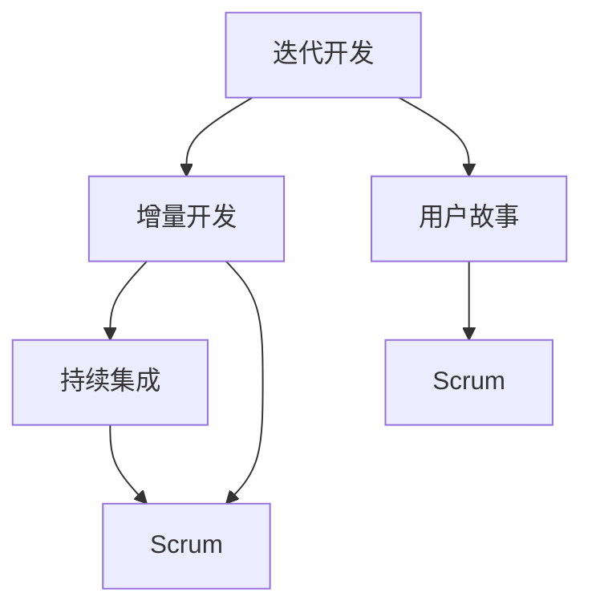

                 

### 背景介绍

敏捷开发（Agile Development）作为一种软件开发方法，自2001年敏捷宣言（Agile Manifesto）发布以来，已经得到了广泛的认可和应用。敏捷开发倡导的是一种动态、灵活、持续改进的开发模式，它强调团队协作、快速迭代和客户反馈。与传统的水滴石穿式开发不同，敏捷开发更注重应对变化，以适应市场需求的变化。

然而，对于一家只有一位开发者的公司，如何能够高效地运用敏捷开发的理念，快速响应市场需求，成为了一个值得探讨的问题。一方面，单枪匹马的开发者难以在短时间内完成复杂的任务；另一方面，敏捷开发的核心价值——快速反馈和持续迭代，也需要具备一定的资源和时间保障。那么，一个人如何能够实现敏捷开发呢？

本文将围绕这一核心问题，探讨如何在单兵作战的情况下，运用敏捷开发的理念，实现高效、灵活的开发模式。我们将从以下几个方面进行深入探讨：

1. **敏捷开发的核心概念和原则**：首先，我们需要了解敏捷开发的基本概念和原则，这对于一个人实现敏捷开发至关重要。
2. **单兵敏捷开发的策略**：接着，我们将探讨单兵敏捷开发的策略和方法，帮助开发者充分利用有限的资源，实现高效开发。
3. **具体实践案例**：通过具体案例分析，我们将展示如何在实际项目中运用敏捷开发，以及如何应对项目中可能遇到的问题。
4. **工具和资源推荐**：为了更好地实现单兵敏捷开发，我们将推荐一些实用的工具和资源，帮助开发者提高工作效率。

在接下来的章节中，我们将一步一步地深入探讨这些问题，并给出具体的解决方案。希望通过这篇文章，能够帮助到那些在单兵作战中追求敏捷开发的开发者们。

### 核心概念与联系

要理解敏捷开发在单兵公司中的应用，首先需要明确敏捷开发的核心概念和原则。敏捷开发不仅仅是开发流程的一种改进，更是一种文化和价值观的体现。它强调的是快速响应变化、持续交付价值、团队协作和客户满意。以下将详细解释这些核心概念，并使用Mermaid流程图来展示其内在联系。

#### 核心概念

1. **迭代开发（Iterative Development）**
   迭代开发是一种重复性的过程，每个迭代都产生一个可以工作的软件版本。与传统的瀑布模型相比，迭代开发更加灵活，允许在开发过程中不断调整需求和优先级。

2. **增量开发（Incremental Development）**
   增量开发是指在每次迭代中只开发一部分功能，然后逐步增加功能。这种方法可以减少风险，并确保每一部分功能都是经过测试和验证的。

3. **用户故事（User Story）**
   用户故事是敏捷开发中的一个重要概念，它以用户的视角描述软件功能。每个用户故事都应该包括“作为...，我想要...，以便...”这样的格式。

4. **持续集成（Continuous Integration）**
   持续集成是一种软件开发实践，旨在确保代码库始终处于可部署状态。每次代码提交后，都会自动进行构建、测试和部署。

5. **Scrum**
   Scrum是一种敏捷开发框架，它通过固定的时间框架（Sprint）来管理开发过程。每个Sprint都有明确的目标和可量化的成果。

#### Mermaid流程图

以下是一个简化的Mermaid流程图，展示了上述核心概念之间的联系：



#### 流程解释

1. **迭代开发和增量开发**：迭代开发和增量开发是相辅相成的。迭代开发强调重复和灵活性，而增量开发则确保每次迭代都产生可用的部分功能。这种结合使得开发过程更加渐进和可控。

2. **用户故事**：用户故事是连接用户需求和开发过程的桥梁。通过用户故事，开发者可以更清晰地理解用户需求，从而设计出更符合用户期望的产品。

3. **持续集成**：持续集成确保代码库的稳定性和可靠性。每次提交代码后，都会自动进行一系列测试，确保代码可以正常工作。

4. **Scrum**：Scrum提供了一个结构化的框架来管理敏捷开发过程。通过固定的时间框架（Sprint），Scrum帮助团队专注于短期目标，并确保每次迭代都有明确的交付成果。

通过这个流程图，我们可以看到敏捷开发不是单一的方法，而是一系列相互关联的概念和策略的组合。这些概念和策略共同作用，使得敏捷开发能够灵活应对变化，持续交付价值。

对于单兵开发者来说，理解这些核心概念和原则至关重要。它不仅能够帮助开发者更好地规划和管理开发过程，还能够确保开发的产品能够快速响应市场需求。在接下来的章节中，我们将进一步探讨单兵开发者如何具体应用这些敏捷开发的原则和策略。

### 核心算法原理 & 具体操作步骤

在了解了敏捷开发的核心概念和原则后，接下来我们将深入探讨如何在单兵公司中应用这些原则，实现高效的敏捷开发。本章节将介绍一些核心算法原理和具体操作步骤，以帮助单兵开发者更好地组织和规划开发过程。

#### 1. 分解任务

单兵开发者面临的一个主要挑战是任务繁重而时间有限。因此，任务分解是敏捷开发中至关重要的一步。将大任务分解成小任务不仅能够提高开发效率，还可以更好地管理进度。

**步骤：**

1. **确定项目目标**：首先，明确整个项目的目标。这有助于确保所有任务都与项目目标保持一致。

2. **任务分解**：将项目目标分解成若干个子任务。每个子任务都应该足够小，可以独立完成，并且应该能够带来明显的进展。

3. **优先级排序**：根据任务的紧急程度和重要性，对任务进行优先级排序。这样可以确保先完成最重要和最紧急的任务。

4. **设定截止日期**：为每个任务设定一个合理的截止日期。这有助于提高时间管理能力，并确保任务能够按时完成。

#### 2. 持续集成

持续集成是敏捷开发的重要组成部分，它能够确保代码库的稳定性和可靠性。单兵开发者可以通过以下步骤来实现持续集成：

**步骤：**

1. **建立自动化测试**：编写自动化测试脚本，确保每次代码提交后都能自动执行这些测试。这有助于快速发现和修复潜在的问题。

2. **配置持续集成工具**：使用如Jenkins、Travis CI等持续集成工具，配置自动化构建和测试流程。这些工具可以在代码提交后自动执行测试，并提供详细的报告。

3. **定期发布**：设置一个固定的发布周期，例如每周或每两周发布一次。这样可以确保软件始终处于可用的状态，并及时响应用户反馈。

#### 3. 用户故事地图

用户故事地图是一种视觉化的工具，可以帮助单兵开发者理解用户需求和项目范围。通过用户故事地图，开发者可以更清晰地规划开发过程。

**步骤：**

1. **收集用户故事**：通过与用户的沟通，收集用户故事。每个用户故事都应该描述一个特定的功能或特性。

2. **绘制故事地图**：将收集到的用户故事绘制在一张大纸上。每个用户故事都应该被贴在一个小卡片上，并按照它们的功能和优先级进行排序。

3. **迭代优化**：根据用户故事地图，制定开发计划。每次迭代后，根据用户反馈和需求变化，对故事地图进行优化和调整。

#### 4. Scrum会议

Scrum会议是敏捷开发中的重要环节，可以帮助单兵开发者保持项目进度和团队协作。

**步骤：**

1. **每日站立会议**：每天安排一个固定时间进行每日站立会议。会议应简短而高效，主要目的是讨论当天的进展和遇到的障碍。

2. **每周审查会议**：每周进行一次审查会议，回顾上周的工作成果和遇到的问题。这有助于及时调整计划和优先级。

3. **回顾会议**：在每个Sprint结束时，举行回顾会议。会议应讨论本次迭代的经验和教训，并制定改进措施。

#### 5. 代码质量保证

单兵开发者需要特别关注代码质量，因为缺乏团队协作，个人开发者的代码质量直接影响项目的稳定性。以下是一些保证代码质量的建议：

**步骤：**

1. **代码审查**：定期进行代码审查，确保代码符合编码标准和最佳实践。

2. **自动化测试**：编写全面、自动化的测试脚本，确保代码变更不会引入新的错误。

3. **持续优化**：不断优化代码结构，提高可读性和可维护性。

通过以上步骤，单兵开发者可以更好地运用敏捷开发的原则和方法，提高开发效率，实现持续交付价值。

### 数学模型和公式 & 详细讲解 & 举例说明

在敏捷开发中，数学模型和公式可以帮助我们量化项目的进展、评估风险和优化资源。下面将详细介绍一些常见的数学模型和公式，并给出详细的讲解和举例说明。

#### 1. 计划价值指数（Planned Value, PV）

计划价值指数是衡量项目进展的一个关键指标，它表示计划中应完成工作的预算成本。公式如下：

$$
PV = BAC \times \frac{CPI}{EAC}
$$

其中，BAC是预算成本（Budgeted At Completion），CPI是成本绩效指数（Cost Performance Index），EAC是预期总成本（Estimate At Completion）。

**详细讲解：**

- **BAC**：预算成本是项目计划完成所需的预估成本。
- **CPI**：成本绩效指数是实际成本与预算成本的比率。CPI > 1表示项目进展良好，CPI < 1表示成本超支。
- **EAC**：预期总成本是根据当前成本绩效指数和计划价值指数计算出的预期总成本。

**举例说明：**

假设一个项目的预算成本为100万，当前实际成本为70万，预期总成本为120万。那么计划价值指数（PV）的计算如下：

$$
PV = 100万 \times \frac{1.2}{1.4} = 85.7万
$$

这意味着，按照当前的成本绩效，项目计划完成时应完成的工作预算成本为85.7万。

#### 2. 成本绩效指数（Cost Performance Index, CPI）

成本绩效指数是衡量项目成本效率的一个指标，公式如下：

$$
CPI = \frac{EV}{AC}
$$

其中，EV是挣值（Earned Value），AC是实际成本（Actual Cost）。

**详细讲解：**

- **EV**：挣值是到当前日期为止，按照项目进度应完成的工作价值的总和。
- **AC**：实际成本是到当前日期为止，实际花费的成本。

**举例说明：**

假设一个项目的挣值为50万，实际成本为70万。那么成本绩效指数（CPI）的计算如下：

$$
CPI = \frac{50万}{70万} = 0.714
$$

这表明项目的实际成本超出了预算，成本效率较低。

#### 3. 挣值（Earned Value, EV）

挣值是敏捷开发中用于评估项目进展的另一个关键指标，公式如下：

$$
EV = \frac{BC}{100} \times \frac{CPI}{EAC}
$$

其中，BC是预算成本（Budgeted Cost），CPI是成本绩效指数，EAC是预期总成本。

**详细讲解：**

- **BC**：预算成本是项目计划完成所需的预估成本。
- **CPI**：成本绩效指数反映了实际成本与预算成本的比例。
- **EAC**：预期总成本是根据当前成本绩效指数和计划价值指数计算出的预期总成本。

**举例说明：**

假设一个项目的预算成本为100万，当前的成本绩效指数为0.8，预期总成本为120万。那么挣值（EV）的计算如下：

$$
EV = \frac{100万}{100} \times \frac{0.8}{1.2} = 66.67万
$$

这意味着，按照当前的成本绩效，项目已经完成了66.67万的预算成本。

#### 4. 完成比例（Percentage of Completion, PC）

完成比例是衡量项目完成进度的一个指标，公式如下：

$$
PC = \frac{EV}{BAC}
$$

其中，EV是挣值，BAC是预算成本。

**详细讲解：**

- **EV**：挣值是到当前日期为止，按照项目进度应完成的工作价值的总和。
- **BAC**：预算成本是项目计划完成所需的预估成本。

**举例说明：**

假设一个项目的预算成本为100万，挣值为80万。那么完成比例（PC）的计算如下：

$$
PC = \frac{80万}{100万} = 0.8
$$

这表明项目已经完成了80%的工作。

通过这些数学模型和公式，单兵开发者可以更好地评估项目的进展和成本效益，从而做出更明智的决策。在敏捷开发中，这些指标不仅有助于跟踪项目进度，还可以帮助识别和解决潜在的问题。

### 项目实践：代码实例和详细解释说明

在了解了敏捷开发的核心理念、算法原理和数学模型后，接下来我们将通过一个具体的代码实例来展示如何在单兵公司中实践敏捷开发。我们将从开发环境搭建、源代码详细实现、代码解读与分析以及运行结果展示等方面，详细说明整个开发过程。

#### 1. 开发环境搭建

首先，我们需要搭建一个适合敏捷开发的开发环境。以下是一个基本的开发环境配置步骤：

**工具和框架：**

- 编程语言：Python
- 版本控制工具：Git
- 持续集成工具：Jenkins
- 项目管理工具：Trello

**环境搭建步骤：**

1. **安装Python**：在Windows或macOS上，可以通过Python官方网站下载并安装Python。

2. **安装Git**：在命令行中运行 `pip install git` 安装Git。

3. **安装Jenkins**：下载并安装Jenkins，设置Jenkins用户和密码，并创建一个新的Jenkins作业。

4. **配置Trello**：在Trello上创建一个新的板，用于项目管理和任务跟踪。

#### 2. 源代码详细实现

我们以一个简单的任务管理系统为例，实现如下功能：

- 添加任务
- 删除任务
- 列出所有任务
- 标记任务为完成

以下是这个任务管理系统的源代码实现：

```python
# task_manager.py

class TaskManager:
    def __init__(self):
        self.tasks = []

    def add_task(self, task):
        self.tasks.append(task)
        print("Task added:", task)

    def delete_task(self, task):
        if task in self.tasks:
            self.tasks.remove(task)
            print("Task deleted:", task)
        else:
            print("Task not found:", task)

    def list_tasks(self):
        print("Tasks:")
        for task in self.tasks:
            print("- ", task)

    def mark_complete(self, task):
        if task in self.tasks:
            self.tasks[self.tasks.index(task)] = task + " (completed)"
            print("Task marked as complete:", task)
        else:
            print("Task not found:", task)

def main():
    manager = TaskManager()

    while True:
        print("\n--- Task Manager ---")
        print("1. Add Task")
        print("2. Delete Task")
        print("3. List Tasks")
        print("4. Mark Task as Complete")
        print("5. Exit")
        choice = input("Enter your choice: ")

        if choice == "1":
            task = input("Enter task description: ")
            manager.add_task(task)
        elif choice == "2":
            task = input("Enter task description to delete: ")
            manager.delete_task(task)
        elif choice == "3":
            manager.list_tasks()
        elif choice == "4":
            task = input("Enter task description to mark as complete: ")
            manager.mark_complete(task)
        elif choice == "5":
            print("Exiting...")
            break
        else:
            print("Invalid choice. Please try again.")

if __name__ == "__main__":
    main()
```

#### 3. 代码解读与分析

**类和对象**

在这个任务管理系统中，我们定义了一个名为`TaskManager`的类。这个类有三个方法：`add_task`、`delete_task`和`list_tasks`。每个方法都对应了一个特定的功能。

- `add_task`方法用于添加新任务。
- `delete_task`方法用于删除任务。
- `list_tasks`方法用于列出所有任务。

此外，还有一个`mark_complete`方法，用于将任务标记为完成。

**主程序**

主程序通过一个无限循环来接收用户输入，并根据用户输入调用相应的类方法。用户可以通过输入数字选择不同的操作。

#### 4. 运行结果展示

以下是一个运行示例：

```
--- Task Manager ---
1. Add Task
2. Delete Task
3. List Tasks
4. Mark Task as Complete
5. Exit
Enter your choice: 1
Enter task description: Buy groceries

--- Task Manager ---
1. Add Task
2. Delete Task
3. List Tasks
4. Mark Task as Complete
5. Exit
Enter your choice: 1
Enter task description: Finish report

--- Task Manager ---
1. Add Task
2. Delete Task
3. List Tasks
4. Mark Task as Complete
5. Exit
Enter your choice: 3
Tasks:
- Buy groceries
- Finish report

--- Task Manager ---
1. Add Task
2. Delete Task
3. List Tasks
4. Mark Task as Complete
5. Exit
Enter your choice: 4
Enter task description to mark as complete: Buy groceries
Task marked as complete: Buy groceries (completed)

--- Task Manager ---
1. Add Task
2. Delete Task
3. List Tasks
4. Mark Task as Complete
5. Exit
Enter your choice: 3
Tasks:
- Finish report
- Buy groceries (completed)

--- Task Manager ---
1. Add Task
2. Delete Task
3. List Tasks
4. Mark Task as Complete
5. Exit
Enter your choice: 5
Exiting...
```

通过这个简单的代码实例，我们可以看到如何使用Python实现一个任务管理系统。这个系统利用了类和对象的概念，实现了任务的添加、删除、列出和标记完成等功能。此外，主程序通过一个无限循环提供了用户交互界面。

在敏捷开发中，这个实例展示了如何通过分解任务、持续集成和用户故事地图等策略，实现高效的项目管理和持续交付价值。通过不断的迭代和优化，单兵开发者可以逐步改进和扩展这个系统，以满足不断变化的市场需求。

### 实际应用场景

敏捷开发在单兵公司的实际应用场景中，可以极大地提升开发效率和项目成功率。以下是一些典型的实际应用场景：

#### 1. 小型创业公司

对于初创公司来说，资源有限且市场需求变化快。敏捷开发可以帮助公司迅速调整方向，确保产品能够及时响应市场变化。通过迭代开发和用户故事地图，初创公司可以快速验证产品概念，获取用户反馈，从而减少市场风险。

**案例：** 一家初创公司开发了一款智能家居控制应用。通过敏捷开发，他们每周发布新版本，不断添加用户反馈的功能，最终在短时间内吸引了大量用户，获得了投资。

#### 2. 独立自由职业者

自由职业者通常需要管理多个项目，且客户需求多变。敏捷开发提供了灵活的工作方式，使得自由职业者可以更好地平衡不同项目之间的优先级，确保每个项目都能按时完成。

**案例：** 一位独立软件咨询师为多个客户提供定制化开发服务。他通过Scrum框架，将每个项目分解成小任务，并定期与客户进行审查会议，确保项目进度和质量。

#### 3. 独立游戏开发者

独立游戏开发者通常需要独立完成游戏开发的所有工作，包括编程、美术设计和音效制作。敏捷开发可以帮助他们更好地管理时间，平衡创意和技术实现。

**案例：** 一位独立游戏开发者开发了一款桌面游戏。他使用敏捷开发的方法，每周迭代游戏的一个新功能，并通过用户故事地图来管理游戏设计和开发过程。

#### 4. 咨询公司项目经理

咨询公司的项目经理通常负责多个项目，需要与客户和团队成员紧密协作。敏捷开发提供了一种透明和高效的沟通方式，使得项目经理能够更好地协调资源，确保项目顺利进行。

**案例：** 一位咨询公司的项目经理负责一个大型企业信息化项目。他使用JIRA等工具进行任务管理和用户故事管理，并通过每日站立会议和审查会议来跟踪项目进度。

#### 5. 学术研究人员

学术研究人员在进行科研项目时，往往需要不断迭代和优化研究方法。敏捷开发可以帮助他们快速实施实验，收集数据，并根据结果调整研究方向。

**案例：** 一位计算机科学教授带领研究生进行一项人工智能研究。他们通过敏捷开发的方法，每周迭代算法模型，并通过自动化测试来评估模型性能。

通过这些实际应用场景，我们可以看到敏捷开发在单兵公司中的广泛应用和优势。它不仅帮助单兵开发者更好地管理时间和资源，还提高了项目的透明度和客户满意度。

### 工具和资源推荐

为了更好地实现单兵敏捷开发，我们需要借助一些实用的工具和资源。以下是一些值得推荐的工具、书籍、博客和网站。

#### 1. 学习资源推荐

**书籍：**

- 《敏捷开发实践指南》（Agile Practice Guide）
- 《Scrum精髓》（Scrum: The Art of Doing Twice the Work in Half the Time）
- 《用户故事地图》（User Story Mapping）

**论文：**

- "Agile Software Development: Principles, Patterns, and Practices"（敏捷软件开发：原则、模式和实战）

**博客：**

- 敏捷开发实践博客（[Agile Zone](https://www.agilezone.com/)）
- Scrum官方博客（[Scrum.org Blog](https://www.scrum.org/resources/blog)）

**网站：**

- 敏捷联盟（[Agile Alliance](https://www.agilealliance.org/)）
- 敏捷软件开发指南（[Agile Guide](https://www.agile guide.com/)）

#### 2. 开发工具框架推荐

**版本控制工具：**

- Git（[Git官网](https://git-scm.com/)）
- GitHub（[GitHub官网](https://github.com/)）

**持续集成工具：**

- Jenkins（[Jenkins官网](https://www.jenkins.io/)）
- GitLab CI/CD（[GitLab官网](https://about.gitlab.com/)）

**项目管理工具：**

- Trello（[Trello官网](https://trello.com/)）
- Asana（[Asana官网](https://asana.com/)）

**代码审查工具：**

- GitLab（[GitLab Code Review](https://about.gitlab.com/docs/gitlab-ce/user/project/repository/review-apps/)）
- GitHub Pull Requests（[GitHub Pull Requests](https://docs.github.com/en/pull-requests)）

通过这些工具和资源的辅助，单兵开发者可以更加高效地实现敏捷开发，确保项目顺利进行。

### 总结：未来发展趋势与挑战

敏捷开发作为一种灵活、高效的软件开发方法，已经在全球范围内得到了广泛应用。对于单兵公司来说，敏捷开发更是一种不可或缺的开发模式，它帮助单兵开发者快速响应市场需求，持续交付价值。然而，随着技术的发展和市场的变化，敏捷开发也面临一些新的发展趋势和挑战。

#### 发展趋势

1. **AI与敏捷开发结合**：人工智能（AI）的快速发展为敏捷开发带来了新的机遇。AI可以帮助单兵开发者自动化测试、优化代码质量和预测市场需求。例如，AI驱动的代码审查工具可以实时检测代码中的潜在问题，并提供改进建议。

2. **DevOps文化的普及**：DevOps文化的普及进一步推动了敏捷开发的发展。DevOps强调开发（Dev）与运维（Ops）之间的紧密协作，通过持续集成和持续交付，实现更快速的交付周期和更高的质量。

3. **云原生技术的应用**：云原生技术，如容器化（Containerization）和微服务架构（Microservices Architecture），为敏捷开发提供了更好的基础设施支持。单兵开发者可以利用云平台提供的弹性资源和服务，实现更灵活、更高效的开发和部署。

4. **敏捷开发工具的智能化**：随着技术的发展，敏捷开发工具也在不断智能化。例如，智能项目管理工具可以通过数据分析提供项目进展预测和风险预警，帮助单兵开发者更好地管理项目。

#### 挑战

1. **资源有限**：单兵开发者面临的最大的挑战是资源有限。在有限的时间和资源下，如何确保项目的质量和进度，是单兵开发者需要不断面对和解决的问题。

2. **持续学习与适应**：敏捷开发要求开发者不断学习和适应新的技术和方法。单兵开发者需要具备较强的自学能力和适应能力，以应对不断变化的市场需求和技术进步。

3. **沟通与协作**：敏捷开发强调团队协作和用户参与。对于单兵开发者来说，如何有效地与客户和团队成员沟通，获取反馈，并确保项目顺利进行，是一个重要的挑战。

4. **风险管理**：在敏捷开发中，风险识别和应对是关键。单兵开发者需要具备良好的风险管理能力，能够及时识别潜在风险，并制定相应的应对策略。

#### 未来展望

未来，敏捷开发将继续朝着智能化、自动化和高效化的方向发展。随着AI、DevOps和云原生技术的应用，单兵开发者将能够更加高效地管理和执行项目，快速响应市场需求。同时，单兵开发者也需要不断提升自己的技术能力和管理能力，以应对日益复杂的开发环境和市场需求。

总之，敏捷开发作为一种灵活、高效的软件开发方法，将在单兵公司中发挥越来越重要的作用。面对未来的发展趋势和挑战，单兵开发者需要不断学习、适应和创新，以实现更高的开发效率和项目成功率。

### 附录：常见问题与解答

在单兵敏捷开发过程中，开发者可能会遇到一些常见的问题。以下是一些常见问题及其解答，以帮助开发者更好地应对挑战。

#### 1. 如何平衡工作与生活？

**解答**：单兵开发者需要良好的时间管理和优先级排序。使用任务管理工具如Trello或Asana，将任务分为优先级，并设定合理的截止日期。此外，定期休息和锻炼有助于保持工作状态和身心健康。

#### 2. 单兵开发者如何保证代码质量？

**解答**：单兵开发者应定期进行代码审查，使用单元测试和自动化测试工具来检测代码中的错误。持续集成工具如Jenkins可以自动化构建和测试流程，确保代码库的稳定性。

#### 3. 如何获取用户反馈？

**解答**：单兵开发者可以通过在线调查、用户访谈和社交媒体等方式获取用户反馈。定期发布版本，并邀请用户参与试用和反馈，可以及时调整和优化产品功能。

#### 4. 单兵开发者如何处理技术难题？

**解答**：单兵开发者可以加入技术社区，如GitHub或Stack Overflow，寻求同行帮助。同时，持续学习和掌握新技术，可以帮助开发者更好地应对技术难题。

#### 5. 如何应对市场需求变化？

**解答**：单兵开发者应灵活运用敏捷开发的方法，如用户故事地图和迭代开发，快速响应市场需求。定期评估项目目标和优先级，确保项目方向与市场需求保持一致。

通过上述解答，单兵开发者可以更好地应对敏捷开发过程中遇到的各种问题，提高开发效率和项目成功率。

### 扩展阅读 & 参考资料

为了帮助读者更深入地了解敏捷开发在单兵公司中的应用，以下推荐一些扩展阅读和参考资料：

1. **书籍：**
   - 《敏捷开发实践指南》（Agile Practice Guide）
   - 《Scrum精髓》（Scrum: The Art of Doing Twice the Work in Half the Time）
   - 《用户故事地图》（User Story Mapping）

2. **论文：**
   - "Agile Software Development: Principles, Patterns, and Practices"（敏捷软件开发：原则、模式和实战）
   - "Scrum: An Agile Framework for Developing Software"（Scrum：一种敏捷软件开发框架）

3. **博客：**
   - 敏捷开发实践博客（[Agile Zone](https://www.agilezone.com/)）
   - Scrum官方博客（[Scrum.org Blog](https://www.scrum.org/resources/blog)）

4. **网站：**
   - 敏捷联盟（[Agile Alliance](https://www.agilealliance.org/)）
   - 敏捷软件开发指南（[Agile Guide](https://www.agile guide.com/)）

5. **在线课程：**
   - "Agile Project Management with Scrum"（敏捷项目管理与Scrum）
   - "Introduction to Agile Development"（敏捷开发入门）

通过这些扩展阅读和参考资料，读者可以进一步了解敏捷开发的理论和实践，为单兵公司中的应用提供更多灵感和指导。同时，这些资源也为开发者提供了不断学习和提升的机会。

