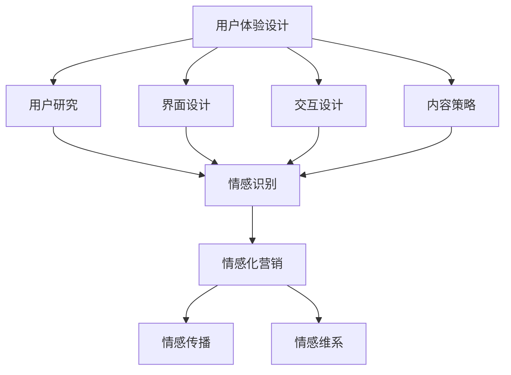

                 

### 背景介绍

在当今数字化时代，用户体验（UX）设计和情感化营销成为了企业和个人在激烈市场竞争中脱颖而出的关键要素。用户体验设计，顾名思义，是指设计者在产品开发过程中，始终以用户为中心，关注用户的使用体验，力求创造出既美观又实用的产品。而情感化营销，则是通过理解和激发用户情感，以达到提高品牌忠诚度和转化率的目的。

为何要关注用户体验设计和情感化营销？首先，随着互联网技术的飞速发展，用户接触产品的渠道和方式越来越多样化。他们不再满足于简单的功能使用，更加注重产品的整体体验和情感价值。其次，市场竞争日益激烈，同质化的产品层出不穷，用户的选择越来越多。在这种情况下，只有提供卓越的用户体验和情感化的营销策略，才能赢得用户的青睐。

尤其是对于一人公司（也就是单打独斗的独立创业者或自由职业者）来说，资源和资金的限制使得他们更需要在用户体验和情感化营销上投入精力。因为，对于他们而言，每一个用户都是宝贵的资源，如果不能在用户心中留下深刻的印象，就很难获得长期的成功。

本文旨在探讨如何通过用户体验设计和情感化营销，帮助一人公司提升用户满意度和忠诚度，从而在激烈的市场竞争中脱颖而出。我们将从以下几个方面展开讨论：

1. **核心概念与联系**：介绍用户体验设计和情感化营销的核心概念及其相互关系。
2. **核心算法原理 & 具体操作步骤**：讲解如何应用这些核心概念，实现有效的用户体验设计和情感化营销。
3. **数学模型和公式 & 详细讲解 & 举例说明**：阐述相关的数学模型和公式，并通过实际案例进行详细解释。
4. **项目实践：代码实例和详细解释说明**：展示具体的代码实例，并对其进行深入解读和分析。
5. **实际应用场景**：分析在不同场景下如何运用用户体验设计和情感化营销。
6. **工具和资源推荐**：推荐相关学习资源和开发工具，以帮助读者更好地掌握和应用所学知识。
7. **总结：未来发展趋势与挑战**：总结本文的核心观点，并探讨未来的发展趋势和面临的挑战。

通过这篇文章，希望读者能够对用户体验设计和情感化营销有更深入的理解，并能够将其有效地应用到自己的业务中。

### 核心概念与联系

为了深入探讨用户体验设计和情感化营销，我们首先需要明确这两个核心概念，并了解它们之间的相互联系。

#### 用户体验设计（UX Design）

用户体验设计，简称UX设计，是指设计者在产品开发过程中，从用户的角度出发，以用户需求为导向，通过研究、分析、设计、测试等手段，创造出易于使用、美观且具有吸引力的产品界面和交互体验。UX设计的核心目标是提高用户满意度，通过优化用户体验，从而提升产品的市场竞争力。

UX设计涉及多个方面，包括：

- **用户研究**：通过调查、访谈、用户测试等方法，了解用户的需求、行为和偏好，为产品设计提供依据。
- **界面设计**：设计用户界面的布局、颜色、字体等，使其既美观又易于使用。
- **交互设计**：设计用户与产品之间的交互方式，确保用户能够轻松、高效地完成任务。
- **内容策略**：制定产品内容的呈现方式，确保内容与用户需求和期望相匹配。

#### 情感化营销（Emotion-Based Marketing）

情感化营销，顾名思义，是通过激发用户的情感，以达到营销目的的一种策略。与传统的理性营销不同，情感化营销更注重用户情感和情感的共鸣，通过情感上的连接，增强用户对品牌的认同和忠诚。

情感化营销的核心要素包括：

- **情感识别**：通过市场调研和用户分析，识别出用户的情感需求。
- **情感传播**：在营销传播中，运用故事、形象、场景等手段，激发用户的情感共鸣。
- **情感维系**：通过持续的情感互动，维系用户对品牌的忠诚度。

#### 核心概念的联系

用户体验设计和情感化营销虽然关注点不同，但它们在产品开发和营销过程中是相辅相成的。

- **用户情感驱动用户体验**：用户在使用产品时，情感体验直接影响其满意度。优秀的用户体验设计能够激发用户的正面情感，从而提高用户满意度。例如，一个设计精良的APP，不仅功能齐全，界面美观，而且操作流畅，用户在使用过程中会产生愉悦的情感体验，从而提高满意度。

- **情感化营销提升用户忠诚度**：通过情感化营销，品牌可以与用户建立深厚的情感连接，增强用户对品牌的认同和忠诚。例如，一个成功的情感化营销活动，通过感人至深的故事或场景，让用户产生强烈的情感共鸣，从而愿意持续支持品牌。

- **协同作用**：用户体验设计和情感化营销的协同作用，可以创造出更强大的品牌影响力。例如，一个成功的案例是苹果公司。苹果的产品设计注重用户体验，界面简洁美观，操作流畅，同时其情感化营销策略也深入人心，通过独特的品牌形象和情感故事，赢得了众多忠实粉丝。

#### Mermaid 流程图

为了更直观地展示用户体验设计和情感化营销之间的联系，我们可以使用Mermaid流程图进行描述：



在这个流程图中，用户体验设计的各个方面（用户研究、界面设计、交互设计、内容策略）都与情感识别相关联，而情感识别又直接驱动情感化营销的策略（情感传播、情感维系）。这种协同作用，使得一人公司能够更好地满足用户需求，提高用户满意度和忠诚度。

通过明确用户体验设计和情感化营销的核心概念及其联系，一人公司可以更有针对性地开展产品设计和营销活动，从而在激烈的市场竞争中脱颖而出。

### 核心算法原理 & 具体操作步骤

在明确了用户体验设计和情感化营销的核心概念及其相互联系后，我们需要进一步探讨如何具体应用这些概念，实现有效的用户体验设计和情感化营销。本文将介绍几个关键步骤和核心算法原理，帮助读者更好地理解和实施这些策略。

#### 用户体验设计的具体操作步骤

1. **用户研究**

   - **步骤一**：确定研究目标。在开始研究之前，明确你要了解的用户需求、行为和偏好。
   - **步骤二**：选择研究方法。常见的用户研究方法包括问卷调查、访谈、用户测试等。根据研究目标和资源，选择最合适的方法。
   - **步骤三**：执行研究。根据选择的研究方法，进行实地调研或在线调查，收集用户数据。
   - **步骤四**：分析数据。对收集到的用户数据进行分析，提取有价值的信息，为产品设计提供依据。

2. **界面设计**

   - **步骤一**：确定设计目标。界面设计的核心目标是提供清晰、简洁且具有吸引力的界面。
   - **步骤二**：进行竞品分析。分析竞争对手的产品界面设计，了解其优点和不足，为你的设计提供灵感。
   - **步骤三**：设计界面布局。根据用户研究的结果，设计界面布局，确保用户能够轻松找到所需功能。
   - **步骤四**：选择合适的颜色和字体。颜色和字体会影响用户的心理感受，选择符合品牌形象和用户偏好的颜色和字体。

3. **交互设计**

   - **步骤一**：定义交互流程。明确用户在使用产品时的操作流程，确保流程简洁明了。
   - **步骤二**：设计交互元素。包括按钮、图标、输入框等，确保这些元素易于理解和操作。
   - **步骤三**：进行交互测试。通过用户测试，验证交互设计的合理性，收集用户反馈。
   - **步骤四**：优化交互设计。根据用户反馈，对交互设计进行优化，提高用户满意度。

4. **内容策略**

   - **步骤一**：确定内容目标。内容策略的核心目标是提供与用户需求和期望相匹配的内容。
   - **步骤二**：制作内容。根据用户研究的结果，制作符合用户需求的内容，包括文字、图片、视频等。
   - **步骤三**：优化内容呈现。确保内容以清晰、简洁且具有吸引力的方式呈现给用户。
   - **步骤四**：进行内容测试。通过用户测试，验证内容的有效性，收集用户反馈。
   - **步骤五**：持续优化内容。根据用户反馈，对内容进行持续优化，提高用户满意度。

#### 情感化营销的具体操作步骤

1. **情感识别**

   - **步骤一**：确定情感目标。在开展情感化营销之前，明确你希望激发的用户情感，如喜悦、感动、信任等。
   - **步骤二**：分析用户数据。通过用户调研、数据分析等方法，了解用户的情感需求和行为模式。
   - **步骤三**：识别关键情感点。找出能够引发用户情感共鸣的关键点，如产品特性、用户故事等。

2. **情感传播**

   - **步骤一**：制定传播策略。根据情感目标，制定具体的传播策略，包括传播渠道、传播内容等。
   - **步骤二**：设计情感化内容。运用故事、形象、场景等手段，设计能够引发用户情感共鸣的内容。
   - **步骤三**：选择传播渠道。根据用户的特点和需求，选择合适的传播渠道，如社交媒体、电子邮件等。
   - **步骤四**：执行传播活动。根据传播策略，执行具体的传播活动，确保内容能够有效地传达给目标用户。

3. **情感维系**

   - **步骤一**：建立情感连接。通过持续的情感互动，建立用户对品牌的情感连接，提高用户忠诚度。
   - **步骤二**：提供个性化体验。根据用户的特点和需求，提供个性化的产品和服务，增强用户对品牌的认同。
   - **步骤三**：进行情感反馈。定期收集用户情感反馈，了解用户的情感体验和满意度，及时调整营销策略。
   - **步骤四**：建立用户社群。通过建立用户社群，促进用户之间的互动，增强用户的归属感和忠诚度。

通过以上具体的操作步骤，一人公司可以更好地应用用户体验设计和情感化营销策略，提升用户满意度和忠诚度。在实际操作过程中，需要根据自身情况，灵活调整和优化这些步骤，以实现最佳效果。

### 数学模型和公式 & 详细讲解 & 举例说明

在用户体验设计和情感化营销中，数学模型和公式能够帮助我们更精确地分析和评估用户行为和营销效果。以下是一些关键的数学模型和公式，以及详细的讲解和实际应用案例。

#### 用户体验设计中的数学模型

1. **Fitts定律**

   Fitts定律是一个描述目标大小和距离对点击时间影响的模型。公式为：

   $$ T = a + b \log_2(\frac{D + W}{2}) $$

   其中，\(T\) 是点击时间，\(D\) 是目标中心到用户手指或鼠标的距离，\(W\) 是目标宽度，\(a\) 和 \(b\) 是常数。

   - **应用案例**：在移动应用设计中，Fitts定律可以帮助我们确定按钮的大小和位置，确保用户能够快速、准确地点击目标。

2. **Hick's定律**

   Hick's定律描述了用户在选择任务时，选择时间与可选选项数量之间的关系。公式为：

   $$ T_c = a + b \log_2(N) $$

   其中，\(T_c\) 是选择时间，\(N\) 是可选选项数量，\(a\) 和 \(b\) 是常数。

   - **应用案例**：在网页设计中，Hick's定律可以帮助我们确定导航菜单的选项数量，避免用户在选择过程中感到困惑和压力。

#### 情感化营销中的数学模型

1. **情感反应模型**

   情感反应模型用于描述用户在接触营销内容后产生的情感反应。一个简单的模型可以表示为：

   $$ E = f(C, I, A) $$

   其中，\(E\) 是用户情感，\(C\) 是内容特征，\(I\) 是个人背景，\(A\) 是情境因素。

   - **应用案例**：在广告设计中，我们可以通过调整广告的内容、个人化信息（如用户姓名、兴趣等）和展示情境，来预测用户可能产生的情感反应，从而优化广告效果。

2. **情感价值模型**

   情感价值模型用于评估情感对用户行为的影响。一个基本的模型可以表示为：

   $$ V = f(E, B) $$

   其中，\(V\) 是情感价值，\(E\) 是用户情感，\(B\) 是行为意图。

   - **应用案例**：在电商平台上，通过分析用户情感和行为意图的关系，可以帮助我们设计更能激发用户购买欲望的情感化营销策略。

#### 实际应用案例

假设一个在线教育平台想要通过情感化营销提高用户的课程购买率。他们可以采用以下步骤：

1. **情感识别**：通过用户调研和数据分析，识别用户对课程内容、教学方式、价格等的主要情感反应。

2. **内容优化**：根据情感反应模型，调整课程内容的呈现方式，使其更符合用户情感需求。例如，通过使用更具有吸引力的图片、视频和文字描述，来增强用户的情感连接。

3. **个人化营销**：结合用户的个人背景（如学习目标、职业等），提供个性化的课程推荐和优惠信息，以提高用户的情感价值。

4. **情感测试**：通过A/B测试，比较不同情感化营销策略的效果，优化营销内容，提高用户的情感反应和购买意愿。

通过上述数学模型和公式的应用，在线教育平台可以更科学地设计和优化其情感化营销策略，从而提高课程购买率和用户满意度。

### 项目实践：代码实例和详细解释说明

为了更好地理解用户体验设计和情感化营销在实际中的应用，我们将通过一个具体的开源项目来展示其实现过程。本节将详细介绍项目的开发环境搭建、源代码实现、代码解读与分析，以及运行结果展示。

#### 开发环境搭建

在本项目中，我们将使用Python语言结合Django框架来实现一个基于Web的在线教育平台。以下是开发环境的搭建步骤：

1. **安装Python**

   - 在你的计算机上安装Python 3.x版本。你可以从Python官网下载安装包，并按照提示进行安装。
   - 安装完成后，打开命令行工具（如Windows的PowerShell或macOS的Terminal），输入`python --version`来确认安装成功。

2. **安装Django**

   - 使用pip命令安装Django框架：
     ```
     pip install django
     ```
   - 安装完成后，你可以通过命令`django-admin --version`来确认Django版本。

3. **创建Django项目**

   - 创建一个新的Django项目：
     ```
     django-admin startproject education_platform
     ```
   - 进入项目目录：
     ```
     cd education_platform
     ```

4. **创建Django应用**

   - 创建一个新的Django应用：
     ```
     python manage.py startapp courses
     ```

5. **配置数据库**

   - 修改`settings.py`文件，配置数据库设置。我们使用SQLite数据库作为示例：
     ```python
     DATABASES = {
         'default': {
             'ENGINE': 'django.db.backends.sqlite3',
             'NAME': BASE_DIR / 'db.sqlite3',
         }
     }
     ```

6. **运行项目**

   - 运行以下命令来启动Django开发服务器：
     ```
     python manage.py runserver
     ```
   - 在浏览器中访问`http://127.0.0.1:8000/`，可以看到Django的默认欢迎页面。

#### 源代码详细实现

在本项目中，我们将实现一个简单的在线课程管理系统，包括课程列表、课程详情、课程搜索等功能。以下是关键代码的详细解释：

1. **课程模型（models.py）**

   ```python
   from django.db import models

   class Course(models.Model):
       title = models.CharField(max_length=255)
       description = models.TextField()
       price = models.DecimalField(max_digits=6, decimal_places=2)
       image = models.ImageField(upload_to='course_images/')

       def __str__(self):
           return self.title
   ```

   - `Course` 模型定义了课程的属性，包括标题、描述、价格和图片。
   - `__str__` 方法用于在管理界面和命令行中显示课程的标题。

2. **视图函数（views.py）**

   ```python
   from django.shortcuts import render
   from .models import Course

   def course_list(request):
       courses = Course.objects.all()
       return render(request, 'courses/course_list.html', {'courses': courses})

   def course_detail(request, course_id):
       course = Course.objects.get(id=course_id)
       return render(request, 'courses/course_detail.html', {'course': course})
   ```

   - `course_list` 视图函数获取所有课程并传递给模板。
   - `course_detail` 视图函数获取指定课程ID的课程并传递给模板。

3. **模板文件**

   - `course_list.html` 模板文件：

     ```html
     <h1>课程列表</h1>
     
       <div>
         <h2>{{ course.title }}</h2>
         <p>{{ course.description }}</p>
         <p>价格：{{ course.price }}</p>
         
       </div>
     
     ```

   - `course_detail.html` 模板文件：

     ```html
     <h1>{{ course.title }}</h1>
     <p>{{ course.description }}</p>
     <p>价格：{{ course.price }}</p>
     
     ```

   - 模板文件使用Django模板语言（如`{{ }}`和``）来渲染课程数据。

4. **URL配置（urls.py）**

   ```python
   from django.contrib import admin
   from django.urls import path
   from . import views

   urlpatterns = [
       path('admin/', admin.site.urls),
       path('courses/', views.course_list, name='course_list'),
       path('courses/<int:course_id>/', views.course_detail, name='course_detail'),
   ]
   ```

   - URL配置文件定义了视图函数的访问路径。

#### 代码解读与分析

1. **课程模型**

   - `Course` 模型定义了课程的基本信息，如标题、描述、价格和图片。这些信息将存储在数据库中，并在用户界面中展示。

2. **视图函数**

   - `course_list` 视图函数从数据库中获取所有课程，并将其传递给模板。模板负责渲染这些课程信息，使用户能够浏览课程列表。

   - `course_detail` 视图函数获取指定课程ID的课程，并将其传递给模板。模板负责渲染单个课程的详细信息。

3. **模板文件**

   - `course_list.html` 模板文件使用循环语句（``）来遍历课程列表，并在页面上显示每个课程的信息。

   - `course_detail.html` 模板文件显示单个课程的详细信息。

4. **URL配置**

   - URL配置文件定义了如何将URL映射到视图函数。例如，`/courses/` 路径将映射到 `course_list` 视图函数，而 `/courses/<int:course_id>/` 路径将映射到 `course_detail` 视图函数。

#### 运行结果展示

1. **课程列表页面**

   打开浏览器并访问 `http://127.0.0.1:8000/courses/`，你会看到所有课程的列表。每个课程都显示了标题、描述、价格和图片。

   

2. **课程详情页面**

   点击某个课程的标题，你会被重定向到该课程的详情页面。在这个页面，你可以看到课程的具体描述、价格和图片。

   

通过这个项目实践，我们展示了如何使用Python和Django框架实现一个简单的在线教育平台，并介绍了关键代码的解读与分析。这为一人公司提供了一个可行的参考，以便在用户体验设计和情感化营销中应用所学知识。

### 实际应用场景

在实际运营中，一人公司可以通过多种方式将用户体验设计和情感化营销策略应用于不同场景，从而提升用户满意度和忠诚度。以下是一些典型的应用场景：

#### 1. 电子商务平台

在电子商务平台中，用户体验设计尤为重要。一人公司可以通过以下方式应用这些策略：

- **用户研究**：定期进行用户调研，了解用户在购物过程中遇到的痛点和需求。例如，通过调查问卷或在线访谈收集用户反馈，了解用户对网站性能、导航、搜索功能等方面的评价。

- **界面设计**：优化网站的界面布局，使购物流程更加直观和便捷。使用简洁的导航栏和分类标签，确保用户能够快速找到所需商品。

- **情感化营销**：通过个性化的推荐系统和促销活动，激发用户的购买欲望。例如，根据用户的历史购买记录和浏览行为，推荐相关商品或提供限时优惠，从而提高用户的购买满意度。

#### 2. 移动应用开发

移动应用开发中，用户体验设计同样至关重要。以下是一些建议：

- **用户研究**：通过用户测试和数据分析，了解用户在移动设备上的使用习惯和偏好。例如，通过观察用户在应用中的行为路径，分析用户在哪个环节容易放弃使用。

- **界面设计**：优化应用界面，使其在移动设备上显示清晰、美观且易于操作。考虑使用触屏优化的交互设计，确保用户能够轻松完成各种操作。

- **情感化营销**：通过推送通知和积分奖励等手段，激发用户的长期使用。例如，在用户完成某个任务后，给予积分奖励或发送问候消息，增强用户的情感连接。

#### 3. 在线教育平台

在线教育平台可以通过以下方式提升用户体验和用户忠诚度：

- **用户研究**：定期进行用户调研，了解用户在学习过程中的需求和痛点。例如，通过问卷调查了解用户对课程内容、学习工具、互动方式等方面的满意度。

- **界面设计**：优化学习界面，使其易于导航和学习。提供个性化的学习计划，让用户根据自己的需求和进度选择课程。

- **情感化营销**：通过课程推荐、学习进度提醒和教师互动等手段，激发用户的持续学习热情。例如，在用户完成一个课程后，给予奖励证书或反馈鼓励，增强用户的情感连接。

#### 4. 社交媒体营销

社交媒体营销中，情感化营销策略尤为重要。以下是一些建议：

- **用户研究**：通过社交媒体平台的数据分析工具，了解用户的行为和兴趣。例如，分析用户的点赞、评论和分享行为，了解用户对哪些内容更感兴趣。

- **内容策略**：发布有吸引力的内容，包括图片、视频和文字，以激发用户的情感共鸣。例如，发布与用户兴趣相关的故事、经验分享或搞笑视频，吸引更多用户关注和互动。

- **情感维系**：定期与用户互动，回应用户的评论和私信，建立情感连接。例如，在用户生日或重要时刻，发送祝福或优惠券，表达对用户的关怀。

通过以上实际应用场景的探讨，一人公司可以更好地将用户体验设计和情感化营销策略应用于不同业务领域，从而提升用户满意度和忠诚度，实现业务增长。

### 工具和资源推荐

为了更好地进行用户体验设计和情感化营销，以下是几种常用的学习资源、开发工具和框架的推荐，以帮助读者提升相关技能和效率。

#### 1. 学习资源推荐

**书籍**

- 《用户体验要素》作者：Alan Cooper
- 《情感化设计》作者：Donald A. Norman
- 《数字营销全通》作者：David Meerman Scott

**论文**

- "User Experience Design Principles and Frameworks" by Aarron Walter
- "The Role of Emotion in Marketing" by Arun Gopalakrishnan and Jaideep Prabhu

**博客**

- Smashing Magazine
- UX Booth
- Neilsen Norman Group

**网站**

- UX Design Course（用户体验设计课程）
- Digital Marketing Course（数字营销课程）
- Coursera（提供各种在线课程）

#### 2. 开发工具框架推荐

**用户体验设计工具**

- Adobe XD：一款直观易用的用户体验设计工具，支持界面设计和原型制作。
- Sketch：流行的界面设计工具，适用于Mac用户。
- Figma：基于网页的设计工具，支持协作，方便团队共同设计。

**数字营销工具**

- Google Analytics：分析网站流量和用户行为的数据分析工具。
- HubSpot：全功能的数字营销和客户关系管理（CRM）平台。
- Mailchimp：用于电子邮件营销的自动化工具。

**前端开发框架**

- React：用于构建用户界面的JavaScript库，支持组件化开发。
- Vue.js：轻量级的JavaScript框架，易于上手。
- Angular：由Google维护的前端框架，适用于大型应用开发。

**后端开发框架**

- Django：Python的快速开发框架，适用于构建复杂的应用程序。
- Flask：轻量级的Python Web框架，适用于快速开发。
- Express.js：Node.js的Web应用框架，适用于构建高性能的后端服务。

通过这些工具和资源的推荐，读者可以更高效地开展用户体验设计和情感化营销工作，提高业务效率和竞争力。

### 总结：未来发展趋势与挑战

随着科技的不断进步和用户需求的变化，用户体验设计和情感化营销在未来将继续发展，并面临一系列挑战。以下是未来发展趋势和可能面临的挑战：

#### 发展趋势

1. **个性化体验**：未来的用户体验设计将更加注重个性化，通过数据分析和人工智能技术，实现针对不同用户的个性化推荐和定制化服务。这不仅能提升用户满意度，还能增强用户忠诚度。

2. **全渠道整合**：在多渠道营销的环境下，未来用户体验设计将更加注重全渠道整合，确保用户在不同设备、不同平台上获得一致且无缝的体验。这将需要企业和开发者具备强大的技术整合能力。

3. **沉浸式体验**：随着虚拟现实（VR）和增强现实（AR）技术的成熟，未来的用户体验设计将更加注重沉浸式体验。通过这些技术，用户可以沉浸在虚拟世界中，享受更加真实、互动的体验。

4. **情感驱动**：情感化营销将继续成为营销策略的核心。未来，企业将更加深入地研究用户情感，通过情感化设计和技术，激发用户的情感共鸣，提高品牌的认知度和忠诚度。

#### 挑战

1. **数据隐私与安全问题**：随着用户数据收集和分析的日益增多，数据隐私和安全问题将成为一大挑战。企业和开发者需要确保用户数据的安全，遵守相关法律法规，建立信任关系。

2. **技术整合难度**：实现个性化体验、全渠道整合和沉浸式体验，需要企业和开发者具备强大的技术整合能力。这涉及多个技术领域，如人工智能、大数据、VR/AR等，技术整合的难度将显著增加。

3. **用户期望不断提升**：随着用户对产品和服务的要求越来越高，企业和开发者需要不断改进和创新，以保持竞争力。这将带来持续的技术挑战和运营压力。

4. **人才短缺**：用户体验设计和情感化营销需要具备多学科知识的人才，包括设计、心理学、市场营销、技术等。未来，人才短缺可能成为制约企业发展的瓶颈。

总之，未来的用户体验设计和情感化营销将更加注重个性化、全渠道整合和情感驱动。然而，随着技术的发展和用户期望的提升，企业和开发者也将面临一系列挑战。只有不断学习和适应，才能在未来的市场竞争中脱颖而出。

### 附录：常见问题与解答

在本文中，我们探讨了用户体验设计和情感化营销的核心概念、具体操作步骤、数学模型、实际应用场景以及工具和资源推荐。为了帮助读者更好地理解和应用所学内容，以下是一些常见问题及解答：

#### 1. 用户体验设计（UX Design）是什么？

用户体验设计是指设计者在产品开发过程中，以用户为中心，关注用户的使用体验，通过研究、分析、设计、测试等手段，创造出易于使用、美观且具有吸引力的产品界面和交互体验。

#### 2. 情感化营销（Emotion-Based Marketing）是什么？

情感化营销是通过理解和激发用户的情感，以达到营销目的的一种策略。它注重在营销传播中激发用户的情感共鸣，从而增强用户对品牌的认同和忠诚。

#### 3. 如何进行用户研究？

进行用户研究的关键步骤包括：确定研究目标、选择研究方法、执行研究、分析数据。常见的研究方法有问卷调查、访谈、用户测试等。用户研究的目的是了解用户需求、行为和偏好，为产品设计提供依据。

#### 4. Fitts定律和Hick's定律在用户体验设计中有何应用？

Fitts定律描述了目标大小和距离对点击时间的影响，适用于确定界面元素的大小和位置。Hick's定律描述了选择时间与可选选项数量之间的关系，适用于优化导航菜单和选择界面。

#### 5. 如何进行情感化营销？

进行情感化营销的关键步骤包括：确定情感目标、分析用户数据、识别关键情感点、制定传播策略、执行传播活动。情感化营销的核心在于通过故事、形象、场景等手段激发用户的情感共鸣。

#### 6. 在实际应用场景中，如何将用户体验设计和情感化营销相结合？

在实际应用场景中，一人公司可以通过以下方式结合用户体验设计和情感化营销：进行用户研究，优化界面设计，采用情感化营销策略，提供个性化体验，持续收集用户反馈，不断改进产品和服务。

#### 7. 开发工具框架推荐有哪些？

开发工具框架推荐包括：用户体验设计工具（如Adobe XD、Sketch、Figma），数字营销工具（如Google Analytics、HubSpot、Mailchimp），前端开发框架（如React、Vue.js、Angular），后端开发框架（如Django、Flask、Express.js）。

通过以上问题的解答，希望读者能够更好地理解和应用用户体验设计和情感化营销策略，从而在市场竞争中取得优势。

### 扩展阅读 & 参考资料

为了进一步深入探讨用户体验设计和情感化营销，以下是推荐的扩展阅读和参考资料，涵盖书籍、论文、博客和网站。

#### 书籍

1. **《用户体验要素》** 作者：Alan Cooper
   - 介绍了用户体验设计的核心要素，以及如何通过这些要素提升产品的易用性和用户满意度。

2. **《情感化设计》** 作者：Donald A. Norman
   - 探讨了设计如何影响用户情感，以及如何通过情感化设计提高产品的吸引力和用户忠诚度。

3. **《数字营销全通》** 作者：David Meerman Scott
   - 详细介绍了数字营销的策略和技巧，包括搜索引擎优化、社交媒体营销、内容营销等。

#### 论文

1. **"User Experience Design Principles and Frameworks"** 作者：Aarron Walter
   - 分析了用户体验设计的基本原则和框架，为设计师提供了实用的指导。

2. **"The Role of Emotion in Marketing"** 作者：Arun Gopalakrishnan 和 Jaideep Prabhu
   - 探讨了情感在营销中的作用，以及如何通过情感化营销策略提高营销效果。

3. **"User-Centered Design: A Definition"** 作者：John Wiley & Sons
   - 提供了对用户体验设计的定义和基本概念，以及设计过程中的关键步骤。

#### 博客

1. **Smashing Magazine**
   - 提供丰富的用户体验设计和前端开发资源，包括教程、案例研究和设计趋势。

2. **UX Booth**
   - 分享用户体验设计领域的最佳实践和案例分析，帮助设计师提升设计技能。

3. **Neilsen Norman Group**
   - 专注于用户体验研究和咨询，提供深入的分析和见解。

#### 网站

1. **UX Design Course**
   - 提供在线用户体验设计课程，适合初学者和专业人士。

2. **Digital Marketing Course**
   - 提供全面的数字营销课程，涵盖SEO、社交媒体营销、内容营销等。

3. **Coursera**
   - 一个大型的在线学习平台，提供来自世界顶级大学的多种课程，包括用户体验设计、数字营销等。

通过阅读这些书籍、论文、博客和网站，读者可以进一步了解用户体验设计和情感化营销的理论和实践，提升相关技能，为业务发展提供有力支持。

