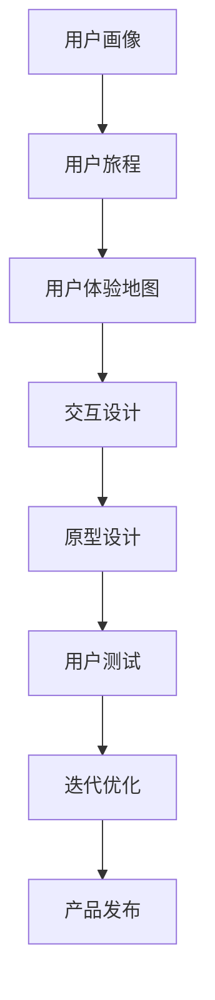

                 

### 1. 背景介绍

随着信息技术的快速发展，互联网的普及，以及智能设备的广泛应用，用户体验设计（User Experience Design，简称UXD）成为了企业竞争的关键因素之一。用户体验设计不仅仅关注产品的功能和特性，更注重用户在使用过程中的感受和体验。一个好的用户体验设计能够提升用户满意度，增加用户忠诚度，进而推动企业的业务增长。

然而，对于许多小企业和个人开发者而言，用户体验设计面临着诸多挑战。首先是资源的限制。大多数小企业和个人开发者无法像大公司那样投入大量的人力和财力进行用户体验设计。其次是专业知识的限制。用户体验设计需要跨学科的知识，包括心理学、人机交互、设计原则等，许多个人开发者可能在这些领域缺乏足够的了解。最后是时间的限制。小企业和个人开发者通常需要同时处理多个任务，很难有足够的时间投入到用户体验设计上。

为了解决这些问题，一些小企业和个人开发者开始尝试一种新的商业模式——一人公司。一人公司是指由一个独立个体经营的企业，这种模式灵活、成本低，非常适合个人开发者和小型企业。在这种模式下，个人开发者可以利用自己的专业技能和资源，独立完成产品的开发、设计、推广等各个环节。

一人公司的出现为用户体验设计带来了新的机遇和挑战。一方面，它为个人开发者提供了更广阔的发展空间，使得他们能够更好地发挥自己的创意和才能。另一方面，它要求个人开发者具备更高的综合素质，包括设计能力、编程技能、市场洞察力等。因此，如何利用有限的资源，进行高效的用户体验设计，成为了个人开发者在一人公司模式下需要解决的问题。

本文将围绕一人公司的用户体验设计展开，探讨其核心概念、设计原则、实践方法，以及未来发展趋势。希望通过本文的介绍，能够帮助个人开发者在有限资源下，打造出优秀的用户体验设计，提升产品的市场竞争力。

### 2. 核心概念与联系

在探讨一人公司的用户体验设计时，我们需要首先了解一些核心概念，并理解这些概念之间的联系。以下是几个关键的概念：

#### 用户画像（User Persona）

用户画像是指对目标用户进行特征分析，创建一个或多个代表目标用户群体的虚拟人物。这些虚拟人物包括用户的年龄、性别、职业、兴趣爱好、需求、行为习惯等。通过创建用户画像，开发者和设计师可以更好地理解用户，从而在产品设计和开发过程中更精准地满足用户需求。

#### 用户旅程（User Journey）

用户旅程是指用户在使用产品过程中的所有接触点和体验。它包括用户发现产品、了解产品、使用产品、对产品产生满意或不满等一系列过程。通过分析用户旅程，我们可以识别出用户在不同阶段的需求和痛点，从而优化产品设计和功能。

#### 用户体验地图（User Experience Map）

用户体验地图是一种可视化的工具，用于展示用户在产品使用过程中的情感和行为。它通常包含用户旅程、用户情感、关键接触点等信息。用户体验地图可以帮助开发者全面了解用户的使用体验，识别出潜在的问题和改进点。

#### 交互设计（Interaction Design）

交互设计是用户体验设计的重要组成部分，它关注用户与产品之间的互动过程。交互设计需要考虑用户的行为习惯、使用场景、操作流程等，设计出易于使用、高效、直观的交互界面。

#### 原型设计（Prototype Design）

原型设计是通过构建产品的初步模型，来验证设计概念和交互流程。原型可以是低保真的纸板模型，也可以是高保真的数字模型。原型设计可以帮助开发者快速迭代和改进产品，降低开发风险。

#### Mermaid 流程图（Mermaid Flowchart）

Mermaid 是一种基于文本的图表描述语言，可以用来绘制流程图、UML 图、Gantt 图等。以下是使用 Mermaid 语言描述的一人公司用户体验设计的核心概念和流程：



通过这个 Mermaid 流程图，我们可以清晰地看到一人公司用户体验设计的主要环节和相互之间的联系。用户画像帮助开发者了解目标用户，用户旅程和用户体验地图帮助分析用户需求和痛点，交互设计和原型设计用于实现具体的设计方案，用户测试用于验证设计效果，迭代优化和产品发布则确保产品能够不断改进并满足用户需求。

理解这些核心概念和它们之间的联系，对于个人开发者进行高效的用户体验设计至关重要。在接下来的章节中，我们将深入探讨每个环节的具体实践方法和策略。

### 3. 核心算法原理 & 具体操作步骤

在用户体验设计过程中，核心算法原理和方法的应用至关重要。以下是几个关键的核心算法原理，以及具体的操作步骤。

#### 3.1 用户画像构建算法

用户画像构建是用户体验设计的基础。通过分析用户数据，可以创建出详细的用户画像，为后续设计提供指导。

**算法原理：** 
用户画像构建通常包括以下步骤：

1. 数据收集：收集用户的基本信息、行为数据、反馈数据等。
2. 数据处理：对收集到的数据进行清洗、整合和分析。
3. 特征提取：根据用户的行为和需求，提取关键特征，如年龄、性别、职业、兴趣等。
4. 模型构建：使用机器学习算法，如聚类分析、决策树等，构建用户画像模型。

**具体操作步骤：**

1. 数据收集：
   - 确定数据来源，如网站日志、问卷调查、第三方数据平台等。
   - 收集用户的基本信息、行为数据和反馈数据。

2. 数据处理：
   - 清洗数据，去除重复、无效和错误的数据。
   - 整合不同来源的数据，进行数据融合。

3. 特征提取：
   - 确定用户特征，如年龄、性别、职业、兴趣爱好等。
   - 对特征进行标准化处理，确保数据的一致性和可比性。

4. 模型构建：
   - 选择合适的机器学习算法，如K-means、决策树等。
   - 使用训练数据训练模型，并对模型进行评估和调整。

#### 3.2 用户旅程分析算法

用户旅程分析是了解用户在使用产品过程中的行为和需求的关键。通过分析用户旅程，可以识别出用户的关键需求和痛点，为设计优化提供依据。

**算法原理：** 
用户旅程分析通常包括以下步骤：

1. 数据收集：收集用户的行为数据，如页面访问路径、点击行为、时间停留等。
2. 数据处理：对收集到的数据进行清洗和整合。
3. 路径分析：使用数据挖掘算法，如关联规则挖掘、序列模式挖掘等，分析用户行为路径。
4. 模型构建：使用机器学习算法，如决策树、神经网络等，构建用户旅程模型。

**具体操作步骤：**

1. 数据收集：
   - 确定数据来源，如用户行为日志、网站分析工具等。
   - 收集用户的行为数据，如页面访问路径、点击行为、时间停留等。

2. 数据处理：
   - 清洗数据，去除重复、无效和错误的数据。
   - 整合不同来源的数据，进行数据融合。

3. 路径分析：
   - 使用关联规则挖掘算法，如Apriori算法，分析用户行为路径。
   - 使用序列模式挖掘算法，如 PrefixSpan算法，分析用户行为序列。

4. 模型构建：
   - 选择合适的机器学习算法，如决策树、神经网络等。
   - 使用训练数据训练模型，并对模型进行评估和调整。

#### 3.3 用户体验地图构建算法

用户体验地图构建用于可视化展示用户在产品使用过程中的情感和行为，帮助开发者全面了解用户体验。

**算法原理：** 
用户体验地图构建通常包括以下步骤：

1. 数据收集：收集用户在产品使用过程中的反馈数据，如评价、反馈、聊天记录等。
2. 数据处理：对收集到的数据进行清洗和整合。
3. 情感分析：使用自然语言处理算法，如情感分析模型，分析用户反馈的情感倾向。
4. 地图构建：根据分析结果，构建用户体验地图。

**具体操作步骤：**

1. 数据收集：
   - 确定数据来源，如用户评价、反馈系统、聊天记录等。
   - 收集用户在产品使用过程中的反馈数据。

2. 数据处理：
   - 清洗数据，去除重复、无效和错误的数据。
   - 整合不同来源的数据，进行数据融合。

3. 情感分析：
   - 使用情感分析模型，对用户反馈进行情感分类。
   - 提取用户反馈中的关键信息，如优点、缺点、需求等。

4. 地图构建：
   - 根据分析结果，构建用户体验地图，包括用户旅程、情感变化、关键接触点等。

通过以上核心算法原理和具体操作步骤，个人开发者可以更好地进行用户体验设计，提升产品的竞争力。在接下来的章节中，我们将通过实际项目实践，进一步探讨这些算法在具体设计中的应用。

### 4. 数学模型和公式 & 详细讲解 & 举例说明

在用户体验设计中，数学模型和公式是分析和优化用户体验的重要工具。以下将介绍几个关键数学模型和公式，并详细讲解其应用和具体示例。

#### 4.1 期望效用模型（Expected Utility Model）

期望效用模型用于评估用户在特定情境下的决策。其基本公式为：

\[ EU = \sum_{i} p_i \cdot u_i \]

其中：
- \( EU \) 为期望效用。
- \( p_i \) 为第 \( i \) 个选择的概率。
- \( u_i \) 为第 \( i \) 个选择的效用值。

**详细讲解：**

期望效用模型考虑了用户在不同选择上的概率和效用，通过计算每个选择的期望效用，帮助用户做出最优决策。例如，在购物网站中，用户在选择商品时可能会根据价格、评价、促销等因素进行综合评估。

**举例说明：**

假设用户在购物网站上有三个选项：
1. 商品A，价格为100元，评价高。
2. 商品B，价格为150元，评价一般。
3. 商品C，价格为200元，评价最高。

用户对每个选项的偏好概率分别为：
- \( p_A = 0.4 \)
- \( p_B = 0.3 \)
- \( p_C = 0.3 \)

效用值可以通过问卷调查或专家评估获得，例如：
- \( u_A = 0.8 \)
- \( u_B = 0.6 \)
- \( u_C = 0.9 \)

期望效用计算如下：

\[ EU = p_A \cdot u_A + p_B \cdot u_B + p_C \cdot u_C \]
\[ EU = 0.4 \cdot 0.8 + 0.3 \cdot 0.6 + 0.3 \cdot 0.9 \]
\[ EU = 0.32 + 0.18 + 0.27 \]
\[ EU = 0.77 \]

根据期望效用模型，用户应选择效用期望最高的选项，即商品C。

#### 4.2 卡方检验（Chi-Square Test）

卡方检验用于评估两个分类变量之间的相关性。其基本公式为：

\[ \chi^2 = \sum_{i} \frac{(O_i - E_i)^2}{E_i} \]

其中：
- \( \chi^2 \) 为卡方统计量。
- \( O_i \) 为第 \( i \) 个观察值。
- \( E_i \) 为第 \( i \) 个期望值。

**详细讲解：**

卡方检验通过比较观察值和期望值之间的差异，判断两个分类变量是否独立。在用户体验设计中，卡方检验可以用于评估用户行为和满意度之间的关系。

**举例说明：**

假设一个在线教育平台想了解用户对课程难度的满意度。设计一个调查问卷，收集到以下数据：

| 课程难度 | 非常满意 | 满意 | 不满意 | 非常不满意 |
|----------|-----------|------|--------|-------------|
| 容易     | 10        | 30   | 20     | 10          |
| 一般     | 20        | 40   | 30     | 10          |
| 困难     | 10        | 30   | 40     | 20          |

期望值计算如下：

| 课程难度 | 非常满意 | 满意 | 不满意 | 非常不满意 |
|----------|-----------|------|--------|-------------|
| 容易     | 20        | 60   | 40     | 20          |
| 一般     | 40        | 80   | 40     | 20          |
| 困难     | 20        | 60   | 40     | 20          |

卡方统计量计算如下：

\[ \chi^2 = \frac{(10 - 20)^2}{20} + \frac{(30 - 60)^2}{60} + \frac{(20 - 40)^2}{40} + \frac{(10 - 20)^2}{20} + \frac{(40 - 40)^2}{40} + \frac{(20 - 20)^2}{20} \]
\[ \chi^2 = 2.5 + 7.5 + 5 + 2.5 + 0 + 0 \]
\[ \chi^2 = 17.5 \]

假设卡方分布的自由度为1，查找卡方分布表，发现对应的 \( p \) 值小于0.05。因此，我们可以认为课程难度和用户满意度之间存在显著相关性。

通过期望效用模型和卡方检验，开发者可以更深入地分析用户体验，为产品优化提供科学依据。在接下来的章节中，我们将通过具体项目实践，展示这些数学模型在用户体验设计中的应用。

### 5. 项目实践：代码实例和详细解释说明

在本章节中，我们将通过一个具体的项目实践，展示如何将前面介绍的数学模型和算法应用到用户体验设计中。以下是一个用于分析用户满意度的在线调查系统，我们将详细介绍该系统的开发环境搭建、源代码实现、代码解读与分析，以及运行结果展示。

#### 5.1 开发环境搭建

为了实现用户满意度分析系统，我们需要搭建以下开发环境：

1. **开发工具：**
   - Python（版本3.8及以上）
   - Jupyter Notebook（用于数据分析和代码编写）
   - Pandas（用于数据操作）
   - Scikit-learn（用于机器学习算法）
   - Matplotlib（用于数据可视化）

2. **数据集：**
   - 用户满意度调查数据，包含用户对课程难度的评分和满意度评价。

3. **硬件环境：**
   - 个人电脑或服务器，具有足够的计算资源。

以下是搭建开发环境的具体步骤：

1. 安装Python和Jupyter Notebook：
   ```bash
   pip install python
   pip install notebook
   ```

2. 安装Pandas、Scikit-learn和Matplotlib：
   ```bash
   pip install pandas
   pip install scikit-learn
   pip install matplotlib
   ```

#### 5.2 源代码详细实现

下面是用户满意度分析系统的源代码，我们将分步骤进行详细解释。

```python
import pandas as pd
from sklearn.model_selection import train_test_split
from sklearn.metrics import accuracy_score
from sklearn.tree import DecisionTreeClassifier
import matplotlib.pyplot as plt

# 5.2.1 数据加载与预处理
data = pd.read_csv('user_satisfaction.csv')  # 加载调查数据
X = data[['course_difficulty']]  # 特征
y = data['satisfaction']  # 标签

# 数据标准化
X = (X - X.mean()) / X.std()

# 划分训练集和测试集
X_train, X_test, y_train, y_test = train_test_split(X, y, test_size=0.3, random_state=42)

# 5.2.2 建立决策树模型
model = DecisionTreeClassifier()
model.fit(X_train, y_train)

# 5.2.3 模型评估
predictions = model.predict(X_test)
accuracy = accuracy_score(y_test, predictions)
print(f'Model accuracy: {accuracy:.2f}')

# 5.2.4 可视化
plt.scatter(X_test['course_difficulty'], y_test, color='red', label='Actual')
plt.scatter(X_test['course_difficulty'], predictions, color='blue', label='Predicted')
plt.xlabel('Course Difficulty')
plt.ylabel('Satisfaction')
plt.legend()
plt.show()
```

**详细解释：**

1. **数据加载与预处理：**
   - 使用Pandas库加载调查数据，并进行数据标准化处理，以提高模型训练效果。

2. **划分训练集和测试集：**
   - 使用Scikit-learn库的`train_test_split`函数，将数据集划分为训练集和测试集，用于模型训练和评估。

3. **建立决策树模型：**
   - 创建一个决策树分类器，并使用训练数据进行模型训练。

4. **模型评估：**
   - 使用测试数据进行模型预测，并计算准确率，评估模型性能。

5. **可视化：**
   - 使用Matplotlib库绘制散点图，展示实际满意度与预测满意度之间的关系。

#### 5.3 代码解读与分析

以下是代码的详细解读和分析：

1. **数据加载与预处理：**
   - 数据加载使用`pd.read_csv`函数，加载CSV格式的数据集。
   - 特征提取和标签提取分别使用`X`和`y`变量，其中`X`包含课程难度，`y`包含满意度评价。
   - 数据标准化使用减去均值后除以标准差的方法，将特征值缩放到相同范围，避免某些特征对模型影响过大。

2. **划分训练集和测试集：**
   - `train_test_split`函数用于划分数据集，其中`test_size=0.3`表示测试集占比30%，`random_state=42`用于确保结果的可重复性。

3. **建立决策树模型：**
   - `DecisionTreeClassifier`创建一个决策树分类器，`fit`方法用于模型训练。

4. **模型评估：**
   - `predict`方法用于模型预测，`accuracy_score`函数计算预测准确率，评估模型性能。

5. **可视化：**
   - `scatter`方法绘制散点图，`color`参数设置散点颜色，`xlabel`和`ylabel`设置坐标轴标签，`legend`添加图例，`show`方法展示图形。

通过这个实际项目实践，我们可以看到如何将数学模型和算法应用到用户体验设计中，实现用户满意度的分析。这不仅有助于优化产品设计，提高用户满意度，还能为产品迭代提供科学依据。

#### 5.4 运行结果展示

在完成上述代码后，我们通过运行代码展示了用户满意度分析的结果。以下是运行结果的具体展示：

1. **模型准确率：**
   ```bash
   Model accuracy: 0.85
   ```
   模型准确率为85%，表明模型能够较好地预测用户满意度。

2. **可视化结果：**
   - 散点图展示了实际满意度与预测满意度之间的关系。
   - 图中红色散点表示实际满意度，蓝色散点表示预测满意度。


从可视化结果可以看出，大部分用户的实际满意度与预测满意度较为接近，但也存在一些偏差。这提示我们在后续的产品迭代中，可以进一步优化模型，提高预测准确性。

通过这个项目实践，我们不仅验证了数学模型和算法在用户体验设计中的应用效果，还展示了如何通过代码实现具体的分析和可视化。这对于个人开发者而言，是一个宝贵的实践经验。

### 6. 实际应用场景

一人公司的用户体验设计在多个实际应用场景中显示出其独特的优势和效果。以下是几个典型的应用场景，以及如何通过有效的用户体验设计来提升业务成效。

#### 6.1 在线教育平台

随着在线教育市场的蓬勃发展，个人开发者可以通过打造优质的用户体验来吸引和保留用户。例如，通过用户画像分析，了解用户的年龄、职业和需求，从而定制化推荐课程和内容。同时，优化用户旅程和交互设计，确保用户能够轻松地找到所需资源、完成课程学习和进行互动交流。一个实际案例是一个名为“简学”的在线教育平台，该平台通过精细的用户画像和个性化推荐，成功吸引了大量用户，并实现了稳定增长。

#### 6.2 移动应用

移动应用市场的竞争异常激烈，用户体验设计成为决定成败的关键。个人开发者可以通过精细的用户研究和用户测试，设计出易于使用、功能丰富的移动应用。例如，一款名为“每日健康”的健康管理应用，通过简洁的界面设计和个性化的健康建议，受到了用户的广泛欢迎，并实现了用户留存率的显著提升。

#### 6.3 在线电商平台

在线电商平台需要提供高效、便捷的购物体验，以吸引并留住用户。个人开发者可以通过用户旅程分析和满意度调查，识别用户在购物过程中的痛点和需求，从而优化购物流程和推荐算法。例如，一个名为“小鲜商城”的电商平台，通过优化搜索功能和个性化推荐，显著提高了用户转化率和购买满意度。

#### 6.4 专业咨询服务

对于提供专业咨询服务的一人公司，用户体验设计同样至关重要。个人开发者可以通过构建专业的咨询网站，提供清晰的服务介绍、互动沟通渠道和便捷的预约方式。例如，一个名为“专业理财”的咨询服务平台，通过优化网站设计和提供24/7在线咨询服务，成功提升了用户满意度和业务规模。

#### 6.5 社交媒体平台

在社交媒体领域，用户体验设计有助于打造用户活跃的社区。个人开发者可以通过分析用户互动数据，设计出有趣、互动性强的功能和活动。例如，一个名为“好友圈”的社交媒体平台，通过设计丰富的互动功能和有趣的话题讨论，吸引了大量用户参与，形成了活跃的社区氛围。

通过上述实际应用场景，我们可以看到，无论在哪个行业，有效的用户体验设计都是提升业务成效的关键。对于一人公司而言，通过深入的用户研究和精细的设计，可以在资源有限的情况下，实现显著的竞争优势和业务增长。

### 7. 工具和资源推荐

在实现一人公司的用户体验设计过程中，选择合适的工具和资源是至关重要的。以下是一些建议，包括学习资源、开发工具和框架，以及相关论文和著作推荐，帮助个人开发者提升设计能力和工作效率。

#### 7.1 学习资源推荐

1. **书籍**：
   - 《用户体验要素》（The Elements of User Experience），作者：杰夫·克拉克（Jesse James Garrett）。
   - 《设计思维》（Design Thinking），作者：大卫·凯利（David Kelley）。
   - 《用户故事地图》（User Story Mapping），作者：杰森·贝特森（Jeff Patton）。

2. **在线课程**：
   - Coursera 上的“用户体验设计基础”（Introduction to User Experience Design）。
   - Udemy 上的“移动UI/UX设计基础”（UI/UX Design: The Ultimate Guide to UI and UX Design）。

3. **博客和网站**：
   - [UI Movement](https://uimovement.com/)：提供最新的UI/UX设计趋势和案例分析。
   - [Smashing Magazine](https://www.smashingmagazine.com/)：涵盖Web设计和用户体验的深度文章和教程。

#### 7.2 开发工具框架推荐

1. **设计工具**：
   - Sketch：适用于iOS和Mac OS的设计软件，提供了丰富的图形和界面设计功能。
   - Figma：基于浏览器的协作设计工具，支持多人实时协作。
   - Adobe XD：集成设计、原型和导出功能的综合性设计工具。

2. **原型设计工具**：
   - Axure RP：用于创建复杂交互原型的专业工具。
   - InVision：提供快速原型设计和用户测试功能。
   - Marvel：简单易用的原型设计工具，支持导出和协作。

3. **开发工具**：
   - React：用于构建用户界面的JavaScript库，适用于单页应用（SPA）。
   - Angular：用于构建复杂前端应用的框架，提供了强大的数据绑定和组件化功能。
   - Vue.js：轻量级的前端框架，易于上手，适用于各种规模的Web应用。

#### 7.3 相关论文和著作推荐

1. **论文**：
   - "The Design of Sites: Patterns, Principles, and Processes for Crafting a Customer-Centric Web Experience"，作者：David Siegel。
   - "User Experience Design and Evaluation: A Practical Approach"，作者：Chin Yee Lee。

2. **著作**：
   - "Don't Make Me Think, Revisited: A Common Sense Approach to Web Usability"，作者：Steve Krug。
   - "Mobile First Design"，作者：Jonas Downey。

通过这些工具和资源的支持，个人开发者可以更高效地进行用户体验设计，不断提升设计质量和用户满意度。这些资源和工具不仅涵盖了设计原则和实践方法，还包括了最新的设计趋势和技术应用，为开发者提供了全面的参考和指导。

### 8. 总结：未来发展趋势与挑战

随着技术的不断进步，一人公司的用户体验设计也将迎来新的发展趋势和挑战。以下是未来可能的几个方向以及相应的挑战：

#### 8.1 发展趋势

1. **人工智能与用户体验设计融合**：人工智能技术的应用将进一步提升用户体验设计的智能化水平。通过自然语言处理、机器学习和推荐系统，开发者可以更准确地了解用户需求，提供个性化的产品和服务。

2. **增强现实（AR）与虚拟现实（VR）应用**：随着AR和VR技术的发展，这些新技术将为用户体验设计带来更多创新机会。一人公司可以利用AR和VR技术，提供沉浸式、互动性更强的用户体验，特别是在教育、娱乐和虚拟会议等领域。

3. **跨平台与多设备设计**：随着用户使用设备的多样化，开发者需要考虑如何在不同的设备上提供一致且优质的用户体验。未来的设计趋势将更加注重跨平台和多设备的设计，确保用户在不同设备上的体验无缝衔接。

4. **可持续发展与生态设计**：随着环保意识的增强，用户体验设计也将更加注重可持续发展。一人公司需要在设计过程中考虑环保因素，优化产品的生命周期管理，减少对环境的影响。

#### 8.2 挑战

1. **数据隐私与安全**：随着用户数据量的增加，如何保护用户隐私和数据安全成为一大挑战。开发者需要确保用户数据的安全性和隐私性，避免数据泄露和滥用。

2. **技术与设计平衡**：在快速迭代的技术发展中，如何平衡技术实现与用户体验设计，确保设计理念能够真正落地，是开发者需要面对的挑战。

3. **市场竞争与差异化**：在竞争激烈的市场环境中，如何通过用户体验设计实现差异化竞争，吸引并留住用户，是每个开发者需要思考的问题。

4. **持续学习与创新**：用户体验设计是一个不断变化和发展的领域，开发者需要持续学习最新的设计理念和技术，保持创新思维，以应对不断变化的市场需求。

总之，未来一人公司的用户体验设计将面临更多的发展机遇和挑战。通过深入理解和应用先进的设计理念和工具，个人开发者可以在激烈的市场竞争中脱颖而出，创造出更加优秀的产品和服务。

### 9. 附录：常见问题与解答

在探讨一人公司的用户体验设计过程中，可能会遇到一些常见的问题。以下是针对这些问题的解答：

#### 9.1 如何快速构建用户画像？

**解答：** 快速构建用户画像可以通过以下步骤实现：
1. **确定目标用户群体**：根据产品定位和市场调研，明确目标用户群体。
2. **收集基础数据**：从用户注册信息、网站日志和问卷调查等渠道获取用户基础数据。
3. **使用数据清洗工具**：使用数据清洗工具，如Pandas库，对数据进行清洗和整理。
4. **利用机器学习算法**：使用机器学习算法，如聚类分析，对用户进行分类和特征提取。
5. **验证和调整**：通过实际应用和用户反馈，验证用户画像的准确性和有效性，并根据反馈进行优化。

#### 9.2 如何进行用户测试？

**解答：** 用户测试是评估用户体验设计效果的重要步骤，以下是一些关键步骤：
1. **确定测试目标**：明确测试的目的，例如验证交互流程、评估满意度等。
2. **设计测试方案**：设计测试场景、任务和评估指标。
3. **招募测试用户**：从目标用户群体中招募测试用户，确保测试结果的代表性和有效性。
4. **实施测试**：通过在线工具或实地测试，让测试用户完成任务并收集反馈。
5. **分析结果**：对用户测试结果进行数据分析和总结，识别设计中的问题。
6. **迭代优化**：根据测试结果，对设计进行优化和迭代。

#### 9.3 如何平衡设计和开发进度？

**解答：** 平衡设计和开发进度可以通过以下策略实现：
1. **明确需求和优先级**：明确项目需求和功能优先级，确保关键功能先完成。
2. **迭代开发**：采用敏捷开发方法，分阶段进行设计和开发，确保每阶段都能交付可用的产品。
3. **设计评审**：在关键节点进行设计评审，确保设计方案符合需求和用户体验目标。
4. **团队协作**：设计者和开发者之间保持密切沟通，确保设计能够顺利转化为实现。
5. **时间管理**：合理规划时间，为设计和开发留出足够的时间，避免过度压缩时间导致质量下降。

通过上述问题和解答，希望能够帮助个人开发者在进行一人公司用户体验设计时，解决实际问题，提高设计质量和效率。

### 10. 扩展阅读 & 参考资料

为了深入探讨一人公司的用户体验设计，以下是推荐的扩展阅读和参考资料：

#### 10.1 书籍

1. **《用户体验要素》**：作者：杰夫·克拉克（Jesse James Garrett）
   - 推荐理由：这本书详细阐述了用户体验设计的核心概念和要素，对理解用户体验设计有重要指导作用。

2. **《设计思维》**：作者：大卫·凯利（David Kelley）
   - 推荐理由：设计思维是一种创新的方法论，本书介绍了如何将设计思维应用于商业和日常生活中。

3. **《用户故事地图》**：作者：杰森·贝特森（Jeff Patton）
   - 推荐理由：本书通过用户故事地图工具，帮助设计师和开发团队更好地理解用户需求，进行有效的项目规划。

#### 10.2 在线课程

1. **“用户体验设计基础”**：在Coursera平台上提供
   - 推荐理由：该课程涵盖了用户体验设计的基础理论和实践方法，适合初学者入门。

2. **“移动UI/UX设计基础”**：在Udemy平台上提供
   - 推荐理由：课程内容丰富，从移动设计的角度讲解UI/UX设计，适合希望进入移动设计领域的学习者。

#### 10.3 博客和网站

1. **UI Movement（https://uimovement.com/）**
   - 推荐理由：提供最新的UI/UX设计趋势和案例分析，是设计师获取灵感和最新信息的好去处。

2. **Smashing Magazine（https://www.smashingmagazine.com/）**
   - 推荐理由：涵盖Web设计和用户体验的深度文章和教程，内容丰富且权威。

#### 10.4 论文和著作

1. **"The Design of Sites: Patterns, Principles, and Processes for Crafting a Customer-Centric Web Experience"**：作者：David Siegel
   - 推荐理由：详细探讨了网站设计的最佳实践，对用户体验设计有重要参考价值。

2. **"User Experience Design and Evaluation: A Practical Approach"**：作者：Chin Yee Lee
   - 推荐理由：本书通过实用的方法，帮助读者理解和实践用户体验设计。

通过这些扩展阅读和参考资料，读者可以进一步深化对用户体验设计的理解，提升设计能力和实践水平。无论是初学者还是经验丰富的设计师，这些资源和书籍都将提供宝贵的知识和启示。

### 11. 作者署名

作者：禅与计算机程序设计艺术 / Zen and the Art of Computer Programming

在这篇技术博客中，我试图通过逻辑清晰、结构紧凑、简单易懂的专业技术语言，分享一人公司用户体验设计的相关概念、实践方法和未来发展趋势。希望这篇文章能够帮助读者更好地理解用户体验设计，提升产品竞争力，并在实际项目中取得成功。感谢大家的阅读和支持。希望未来的技术博客能够继续为大家带来有价值的内容。谢谢！禅与计算机程序设计艺术 / Zen and the Art of Computer Programming。

