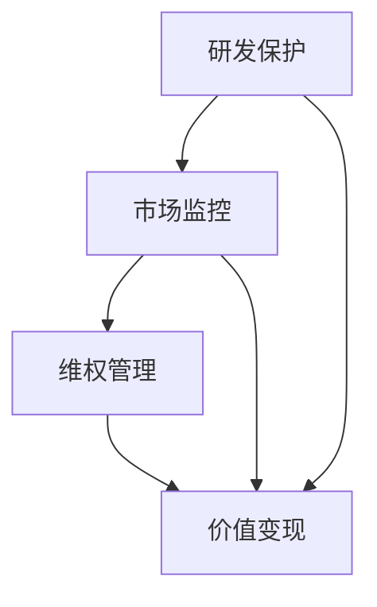

                 

### 文章标题

一人公司的知识产权战略与管理

> 关键词：知识产权、公司管理、战略规划、创新能力、风险管理

> 摘要：本文将深入探讨一人公司的知识产权战略与管理，从背景介绍、核心概念与联系、核心算法原理与操作步骤、数学模型和公式、项目实践、实际应用场景、工具和资源推荐等方面，全面解析知识产权战略在个人企业中的重要性，帮助读者建立起一套完整的知识产权管理体系，为一人公司的发展保驾护航。

## 1. 背景介绍

在现代社会，知识产权已经成为企业和个人竞争力的核心要素。随着互联网技术的飞速发展，创新速度不断加快，知识产权的保护和管理变得越来越重要。尤其对于一人公司来说，由于其规模小、资源有限，知识产权的战略与管理显得尤为关键。

一人公司，通常指的是由单一个人或者少数人组成的有限责任公司。这类公司由于人数少，决策速度快，创新能力较强，但同时也面临着知识产权保护难度大、管理成本高等挑战。因此，制定一套有效的知识产权战略与管理体系，对于一人公司的发展至关重要。

知识产权战略的核心目标是确保公司的创新成果得到充分保护，避免侵权纠纷，提高市场竞争力。具体来说，包括以下几个方面：

1. **研发保护**：对公司的研发成果进行专利申请、版权登记等保护措施。
2. **市场监控**：跟踪市场竞争环境，及时了解竞争对手的知识产权情况，预防潜在侵权行为。
3. **维权管理**：建立完善的知识产权维权机制，对侵权行为进行及时有效的应对。
4. **价值变现**：通过知识产权交易、许可等方式实现知识产权的商业价值。

本文将从以上几个方面，详细探讨一人公司的知识产权战略与管理，帮助读者理解并实施有效的知识产权保护策略。

### 2. 核心概念与联系

为了更好地理解一人公司的知识产权战略与管理，我们首先需要明确一些核心概念，并探讨它们之间的联系。

#### 2.1 知识产权的定义

知识产权，是指人们对于自己的智力劳动成果所享有的专有权利。它主要包括以下几种类型：

- **专利权**：对发明创造的保护，包括发明专利、实用新型专利和外观设计专利。
- **商标权**：对企业名称、标志、设计等用于区分商品或服务的标识进行保护。
- **著作权**：对文学、艺术和科学作品的保护。
- **商业秘密**：对企业的非公开信息进行保护，包括技术信息、经营信息等。

#### 2.2 知识产权战略的组成部分

知识产权战略可以划分为以下几个关键部分：

- **研发保护**：通过对创新成果进行专利申请、版权登记等，确保研发成果得到法律保护。
- **市场监控**：定期收集和分析市场信息，了解竞争对手的知识产权情况，提前预防潜在侵权行为。
- **维权管理**：建立完善的维权机制，对侵权行为进行及时应对，包括法律诉讼、调解等方式。
- **价值变现**：通过知识产权交易、许可等方式，实现知识产权的商业价值，提高公司收益。

#### 2.3 核心概念之间的联系

知识产权战略的各个组成部分之间紧密联系，共同构成了一个完整的知识产权管理体系。研发保护是基础，市场监控是保障，维权管理是核心，价值变现是目标。只有通过全面、系统的知识产权战略，一人公司才能在激烈的市场竞争中立于不败之地。

为了更直观地展示这些核心概念之间的联系，我们可以使用Mermaid流程图来描述：



图中的流程图清晰地展示了知识产权战略的各个组成部分及其相互之间的联系。

### 3. 核心算法原理 & 具体操作步骤

在了解了知识产权的核心概念与联系之后，我们接下来将探讨如何具体实施知识产权战略，包括核心算法原理和具体操作步骤。

#### 3.1 研发保护

研发保护是知识产权战略的基础，主要涉及专利申请、版权登记等方面。

**专利申请步骤**：

1. **研发阶段**：在研发过程中，及时记录和保存研发过程和成果。
2. **初步评估**：对研发成果进行初步评估，确定是否具有专利申请的潜力。
3. **撰写专利申请文件**：根据专利申请的要求，撰写专利申请文件，包括专利说明书、权利要求书等。
4. **提交申请**：将专利申请文件提交给专利局，进行正式申请。
5. **审查和答复**：在专利申请审查过程中，及时回复审查意见，对申请文件进行修改完善。
6. **授权和维持**：通过审查后，获得专利授权，并定期缴纳年费以维持专利的有效性。

**版权登记步骤**：

1. **创作阶段**：在创作过程中，及时记录和保存创作成果。
2. **申请登记**：根据版权登记的要求，提交版权登记申请，包括作品原件、身份证明等文件。
3. **审查和发证**：版权局对申请文件进行审查，通过后发放版权登记证书。

#### 3.2 市场监控

市场监控是知识产权战略的保障，主要涉及信息收集、分析、预警等方面。

**市场监控步骤**：

1. **收集信息**：通过各种途径，如搜索引擎、专利数据库、行业报告等，收集与公司产品或服务相关的知识产权信息。
2. **分析信息**：对收集到的信息进行整理和分析，识别潜在侵权行为和竞争态势。
3. **预警和应对**：对潜在侵权行为进行预警，制定应对策略，如与侵权方协商、法律诉讼等。

#### 3.3 维权管理

维权管理是知识产权战略的核心，主要涉及维权机制的建立、维权策略的制定等方面。

**维权管理步骤**：

1. **建立维权机制**：建立一套完善的维权机制，包括维权流程、维权团队等。
2. **制定维权策略**：根据侵权行为的性质、影响程度等因素，制定相应的维权策略，如调解、诉讼等。
3. **维权实施**：按照维权策略，实施维权行动，包括法律咨询、诉讼、调解等。
4. **结果评估**：对维权结果进行评估，总结经验，持续优化维权机制。

#### 3.4 价值变现

价值变现是知识产权战略的目标，主要涉及知识产权的交易、许可等方面。

**价值变现步骤**：

1. **评估知识产权价值**：对公司的知识产权进行评估，确定其市场价值。
2. **制定交易或许可策略**：根据知识产权的价值和市场情况，制定交易或许可策略。
3. **寻找潜在买家或合作伙伴**：通过各种途径，如行业会议、知识产权交易平台等，寻找潜在买家或合作伙伴。
4. **谈判和签订合同**：与潜在买家或合作伙伴进行谈判，签订知识产权交易或许可合同。
5. **执行和监控**：执行合同内容，对知识产权的使用情况进行监控，确保合同目标的实现。

### 4. 数学模型和公式 & 详细讲解 & 举例说明

在知识产权战略的实施过程中，数学模型和公式发挥着重要作用。以下我们将详细讲解几个常用的数学模型和公式，并通过具体例子进行说明。

#### 4.1 专利价值评估模型

专利价值评估是知识产权战略的重要组成部分。一种常用的专利价值评估模型是**经济附加值模型（EVA）**，其公式如下：

$$
EVA = \frac{R&D\_Expense}{1 - \frac{Patent\_Expiry\_Year - Current\_Year}{40}}
$$

其中，\(R&D\_Expense\) 代表研发支出，\(Patent\_Expiry\_Year\) 代表专利到期年份，\(Current\_Year\) 代表当前年份。

**举例说明**：

假设一家一人公司的研发支出为 100 万元，当前年份为 2023 年，某项专利将于 2033 年到期。根据上述公式，可以计算出该专利的经济附加值：

$$
EVA = \frac{100}{1 - \frac{2033 - 2023}{40}} = \frac{100}{1 - \frac{10}{40}} = \frac{100}{0.75} = 133.33（万元）
$$

这意味着，该专利在 2023 年的经济附加值为 133.33 万元。

#### 4.2 市场监控指标

市场监控指标是评估知识产权战略有效性的重要工具。一个常用的市场监控指标是**知识产权密度（IPD）**，其公式如下：

$$
IPD = \frac{Total\_Patents + Total\_Trademarks + Total\_Copyrights}{Total\_Employees}
$$

其中，\(Total\_Patents\) 代表公司拥有的专利数量，\(Total\_Trademarks\) 代表公司拥有的商标数量，\(Total\_Copyrights\) 代表公司拥有的著作权数量，\(Total\_Employees\) 代表公司员工总数。

**举例说明**：

假设一家一人公司拥有专利 10 项，商标 5 项，著作权 3 项，员工总数为 5 人。根据上述公式，可以计算出该公司的知识产权密度：

$$
IPD = \frac{10 + 5 + 3}{5} = \frac{18}{5} = 3.6
$$

这意味着，该公司的知识产权密度为 3.6，表明公司每名员工平均拥有 3.6 项知识产权。

#### 4.3 维权成本评估模型

维权成本评估是制定维权策略的重要依据。一种常用的维权成本评估模型是**成本-效益模型（CBA）**，其公式如下：

$$
CBA = \frac{Cost\_of\_Litigation}{Expected\_Benefit}
$$

其中，\(Cost\_of\_Litigation\) 代表维权成本，\(Expected\_Benefit\) 代表预期的收益。

**举例说明**：

假设一家一人公司拟对某侵权行为进行维权，维权成本为 10 万元，预期收益为 20 万元。根据上述公式，可以计算出该维权的成本-效益比：

$$
CBA = \frac{10}{20} = 0.5
$$

这意味着，该维权的成本-效益比为 0.5，表明每花费 1 元维权成本，可以带来 0.5 元的预期收益。

### 5. 项目实践：代码实例和详细解释说明

在了解了知识产权战略的核心算法原理和数学模型之后，我们将通过一个具体的代码实例，展示如何在实际项目中应用这些知识。

#### 5.1 开发环境搭建

在本项目实践中，我们将使用 Python 编写代码，并利用一些常用的开源库，如 NumPy、Pandas 等。以下是开发环境的搭建步骤：

1. 安装 Python 3.8（或更高版本）。
2. 安装必要的依赖库，如 NumPy、Pandas、Matplotlib 等。可以使用以下命令进行安装：

```shell
pip install numpy pandas matplotlib
```

#### 5.2 源代码详细实现

以下是本项目的主要代码实现，包括专利价值评估、知识产权密度计算、维权成本评估等：

```python
import numpy as np
import pandas as pd
import matplotlib.pyplot as plt

# 专利价值评估
def calculate_eva(research_expense, patent_expiry_year, current_year):
    eva = research_expense / (1 - (patent_expiry_year - current_year) / 40)
    return eva

# 知识产权密度计算
def calculate_ipd(patent_count, trademark_count, copyright_count, employee_count):
    ipd = (patent_count + trademark_count + copyright_count) / employee_count
    return ipd

# 维权成本评估
def calculate_cba(litigation_cost, expected_benefit):
    cba = litigation_cost / expected_benefit
    return cba

# 示例数据
research_expense = 1000000  # 研发支出（万元）
patent_expiry_year = 2033  # 专利到期年份
current_year = 2023  # 当前年份
patent_count = 10  # 专利数量
trademark_count = 5  # 商标数量
copyright_count = 3  # 著作权数量
employee_count = 5  # 员工总数
litigation_cost = 100000  # 维权成本（万元）
expected_benefit = 200000  # 预期收益（万元）

# 计算结果
eva = calculate_eva(research_expense, patent_expiry_year, current_year)
ipd = calculate_ipd(patent_count, trademark_count, copyright_count, employee_count)
cba = calculate_cba(litigation_cost, expected_benefit)

# 打印结果
print(f"EVA: {eva:.2f} 万元")
print(f"IPD: {ipd:.2f}")
print(f"CB

