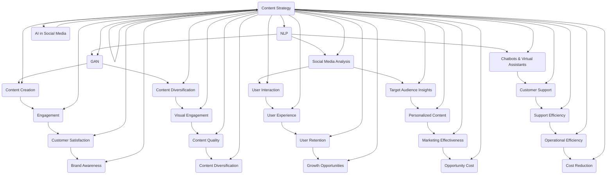

                 

### 1. 背景介绍

在当今的信息时代，社交媒体已成为企业营销和品牌建设的重要工具。对于许多小型企业和个人创业者来说，如何有效利用社交媒体来提升品牌知名度、吸引目标受众和实现商业目标，成为了一项巨大的挑战。而人工智能（AI）技术的发展，为解决这一问题提供了全新的可能性。

首先，社交媒体策略的核心在于内容创作和用户互动。传统的内容创作往往需要大量的人力和时间，而用户互动则需要持续的关注和响应。然而，许多小型企业由于资源有限，难以在这两个方面投入足够的精力和资金。这就为人工智能的应用提供了契机。

人工智能，尤其是自然语言处理（NLP）和生成对抗网络（GAN）等技术，已经显示出在内容创作和用户互动方面的巨大潜力。通过AI，可以自动化内容生成，提高内容创作的效率和质量；同时，通过智能化的用户互动工具，可以更好地理解和响应用户需求，提升用户体验。

本文将深入探讨如何利用人工智能技术来制定和执行社交媒体策略，包括AI在内容创作中的应用、用户互动的优化以及相关的技术工具和资源推荐。通过这一分析，希望能够为那些寻求通过社交媒体提升企业竞争力的个人和企业提供有价值的指导和建议。

接下来，我们将逐步分析人工智能在社交媒体策略中的应用，从核心概念原理到具体操作步骤，再到实际应用场景，一一进行探讨。

### 2. 核心概念与联系

在深入探讨人工智能如何助力社交媒体策略之前，我们首先需要了解一些核心概念和原理。以下是一些关键的概念及其相互之间的联系，我们将使用Mermaid流程图来展示这些概念和架构之间的关系。

#### 2.1 自然语言处理（NLP）

自然语言处理（NLP）是人工智能的一个重要分支，它使计算机能够理解和生成人类语言。在社交媒体策略中，NLP可以用于内容创作和用户互动。例如，通过文本分类、情感分析和语义理解等技术，AI可以自动生成有趣的内容，并能够理解和响应用户的评论和提问。

#### 2.2 生成对抗网络（GAN）

生成对抗网络（GAN）是一种深度学习模型，由生成器和判别器两个部分组成。生成器负责生成新的数据，而判别器则负责判断生成数据是否真实。在社交媒体内容创作中，GAN可以生成高质量的图像和视频，从而丰富内容形式，提升用户体验。

#### 2.3 社交媒体分析

社交媒体分析是理解用户行为和趋势的重要工具。通过分析用户在社交媒体平台上的活动，企业可以了解用户偏好、行为模式和兴趣点，从而制定更精准的营销策略。AI在社交媒体分析中可以自动处理大量数据，提取有价值的信息。

#### 2.4 聊天机器人和虚拟助手

聊天机器人和虚拟助手是AI在用户互动中的应用。通过自然语言处理技术，这些智能系统可以与用户进行实时对话，回答问题、提供支持，从而提升用户体验。在社交媒体平台上，聊天机器人和虚拟助手可以用来处理常见的客户问题，节省人力资源。

#### 2.5 Mermaid流程图

以下是这些核心概念和它们在社交媒体策略中的相互关系的Mermaid流程图：



在这个流程图中，每个节点代表一个核心概念或原理，箭头表示它们之间的相互关系。通过这种结构化的展示，我们可以更清晰地理解AI在社交媒体策略中的多种应用，以及这些应用如何相互支持，共同实现企业目标。

### 3. 核心算法原理 & 具体操作步骤

在了解了核心概念之后，我们接下来将深入探讨AI在社交媒体策略中的核心算法原理，并详细讲解其具体操作步骤。

#### 3.1 自然语言处理（NLP）

自然语言处理（NLP）是AI在社交媒体策略中最为广泛应用的技术之一。以下是NLP的核心算法原理和具体操作步骤：

##### 3.1.1 核心算法原理

1. **文本分类**：文本分类是将文本数据按照预定的类别进行归类。常用的算法包括朴素贝叶斯、支持向量机和深度学习模型等。

2. **情感分析**：情感分析是判断文本中表达的情感倾向。常见的算法包括基于规则的方法、机器学习和深度学习。

3. **语义理解**：语义理解是理解文本中单词和句子之间的内在关系。深度学习模型，如长短时记忆网络（LSTM）和变换器（Transformer），在语义理解中表现出色。

##### 3.1.2 具体操作步骤

1. **数据预处理**：清洗文本数据，去除无关信息，如HTML标签、停用词和标点符号。

2. **特征提取**：将文本转换为特征向量，常用方法包括词袋模型、TF-IDF和词嵌入（Word Embedding）。

3. **模型训练**：使用预处理后的数据训练文本分类、情感分析和语义理解模型。

4. **模型评估**：通过交叉验证和测试集评估模型的性能，调整模型参数以优化性能。

5. **模型部署**：将训练好的模型部署到社交媒体平台，自动处理用户生成的内容。

#### 3.2 生成对抗网络（GAN）

生成对抗网络（GAN）是AI在内容创作中的一个重要技术，尤其擅长生成高质量的图像和视频。以下是GAN的核心算法原理和具体操作步骤：

##### 3.2.1 核心算法原理

1. **生成器（Generator）**：生成器是一个神经网络，它从随机噪声中生成数据。

2. **判别器（Discriminator）**：判别器是一个神经网络，它判断生成数据是否真实。

3. **对抗训练**：生成器和判别器通过对抗训练相互博弈，生成器试图生成更真实的数据，而判别器则试图区分真实数据和生成数据。

##### 3.2.2 具体操作步骤

1. **数据准备**：收集大量高质量的图像或视频数据作为训练集。

2. **生成器训练**：使用生成器和判别器的损失函数训练生成器，使其生成的数据更真实。

3. **判别器训练**：同时训练判别器，使其能够更好地区分真实数据和生成数据。

4. **模型迭代**：不断迭代训练过程，直到生成器和判别器都达到较好的性能。

5. **内容生成**：使用训练好的生成器生成新的图像或视频内容。

#### 3.3 社交媒体分析

社交媒体分析是理解和预测用户行为的关键，以下是社交媒体分析的核心算法原理和具体操作步骤：

##### 3.3.1 核心算法原理

1. **用户画像**：通过分析用户的社交媒体行为，构建用户的兴趣、行为和社交网络画像。

2. **推荐系统**：基于用户画像和内容特征，为用户提供个性化的推荐。

3. **趋势预测**：利用时间序列分析和机器学习模型，预测用户行为和社会趋势。

##### 3.3.2 具体操作步骤

1. **数据收集**：从社交媒体平台收集用户行为数据，如发帖、评论、点赞等。

2. **数据处理**：清洗和预处理数据，提取有用的信息。

3. **特征工程**：构建用户特征和内容特征，用于训练推荐系统和趋势预测模型。

4. **模型训练**：使用用户行为和内容特征训练推荐系统和趋势预测模型。

5. **模型评估**：通过交叉验证和测试集评估模型的性能。

6. **模型部署**：将训练好的模型部署到社交媒体平台，实时分析和预测用户行为。

#### 3.4 聊天机器人和虚拟助手

聊天机器人和虚拟助手是AI在用户互动中的常用技术，以下是其核心算法原理和具体操作步骤：

##### 3.4.1 核心算法原理

1. **自然语言处理（NLP）**：通过NLP技术，聊天机器人和虚拟助手能够理解和生成自然语言。

2. **对话管理**：对话管理是聊天机器人和虚拟助手的核心，它负责维护对话的上下文，并决定下一步的行动。

3. **意图识别**：意图识别是理解用户请求的关键，它通过分析用户输入的文本，识别用户的意图。

##### 3.4.2 具体操作步骤

1. **对话初始化**：用户发起对话，聊天机器人和虚拟助手开始理解用户的请求。

2. **意图识别**：通过NLP技术，聊天机器人和虚拟助手识别用户的意图。

3. **上下文管理**：对话管理负责维护对话的上下文，确保对话的自然流畅。

4. **响应生成**：根据用户的意图和上下文，聊天机器人和虚拟助手生成合适的响应。

5. **对话结束**：当用户的问题得到解答或对话达到预设的结束条件时，对话结束。

通过上述核心算法原理和具体操作步骤的讲解，我们可以看到AI在社交媒体策略中的应用是多么的广泛和深入。接下来，我们将通过一个具体的案例，展示如何将这些技术应用于实际的项目实践中。

### 4. 数学模型和公式 & 详细讲解 & 举例说明

在深入理解AI在社交媒体策略中的应用之后，我们接下来将探讨与这些应用相关的数学模型和公式。通过详细讲解和实际例子的说明，我们将进一步理解这些模型和公式如何支持AI技术在社交媒体策略中的具体应用。

#### 4.1 自然语言处理（NLP）

自然语言处理（NLP）是AI在社交媒体策略中不可或缺的一部分。以下是NLP中常用的几个数学模型和公式。

##### 4.1.1 词嵌入（Word Embedding）

词嵌入是将单词映射到高维向量空间的技术，它通过数学模型捕捉单词的语义信息。一个常见的词嵌入模型是Word2Vec，其核心公式如下：

$$
\text{word\_vector} = \text{softmax}(\text{weights} \cdot \text{context\_vector})
$$

其中，$\text{word\_vector}$表示目标词的嵌入向量，$\text{context\_vector}$表示上下文词的嵌入向量，$\text{weights}$是模型权重。通过优化这些权重，模型可以学习到单词的语义关系。

##### 4.1.2 朴素贝叶斯（Naive Bayes）

朴素贝叶斯是一种经典的文本分类算法，其公式如下：

$$
P(\text{Class}|\text{Features}) = \frac{P(\text{Features}|\text{Class})P(\text{Class})}{P(\text{Features})}
$$

其中，$P(\text{Class}|\text{Features})$表示给定特征下类别的概率，$P(\text{Features}|\text{Class})$表示特征在某个类别下的概率，$P(\text{Class})$是类别概率，$P(\text{Features})$是特征的概率。

##### 4.1.3 支持向量机（SVM）

支持向量机是一种常用的文本分类算法，其目标是最小化分类边界到支持向量的距离。SVM的公式如下：

$$
\text{minimize} \quad \frac{1}{2}\sum_{i=1}^{n} (\text{w} \cdot \text{x}_i)^2
$$

$$
\text{subject to} \quad y_i (\text{w} \cdot \text{x}_i - b) \geq 1
$$

其中，$\text{w}$是权重向量，$\text{x}_i$是特征向量，$y_i$是标签，$b$是偏置。

#### 4.2 生成对抗网络（GAN）

生成对抗网络（GAN）是AI在内容创作中的一个重要技术。以下是GAN中常用的数学模型和公式。

##### 4.2.1 生成器与判别器

生成器的目标是生成尽可能真实的数据，判别器的目标是区分真实数据和生成数据。它们的损失函数如下：

生成器损失函数：

$$
L_G = -\mathbb{E}_{x \sim p_{data}(x)}[\log(D(G(x)))]
$$

判别器损失函数：

$$
L_D = -\mathbb{E}_{x \sim p_{data}(x)}[\log(D(x))] - \mathbb{E}_{z \sim p_z(z)}[\log(1 - D(G(z)))]
$$

其中，$G(z)$是生成器生成的数据，$D(x)$是判别器对真实数据的判断，$D(G(z))$是判别器对生成数据的判断，$p_{data}(x)$是数据分布，$p_z(z)$是噪声分布。

##### 4.2.2 优化过程

生成器和判别器的训练过程是一个动态优化的过程，生成器试图生成更真实的数据，而判别器试图更好地区分真实和生成数据。训练步骤如下：

1. **生成器训练**：固定判别器，优化生成器。

2. **判别器训练**：固定生成器，优化判别器。

3. **交替迭代**：不断交替优化生成器和判别器，直到两者都达到较好的性能。

#### 4.3 社交媒体分析

社交媒体分析涉及用户行为和趋势预测，常用的数学模型和公式如下：

##### 4.3.1 用户画像

用户画像是通过分析用户行为数据构建的用户特征模型。常见的用户画像指标包括：

- **兴趣度**：用户对特定话题的关注程度，可以通过用户发布的帖子、评论和点赞数计算。

- **活跃度**：用户在社交媒体上的活动频率，可以通过用户发帖、评论和互动次数衡量。

- **影响力**：用户在社交媒体上的影响力，可以通过用户关注者数、粉丝数和转发数衡量。

##### 4.3.2 推荐系统

推荐系统是基于用户画像和内容特征为用户推荐相关内容的技术。常见的推荐算法包括：

- **协同过滤（Collaborative Filtering）**：基于用户的历史行为和相似度计算推荐内容。

- **基于内容的推荐（Content-Based Recommendation）**：基于用户对内容的兴趣和内容特征计算推荐内容。

- **混合推荐（Hybrid Recommendation）**：结合协同过滤和基于内容的推荐，提高推荐效果。

#### 4.4 举例说明

以下是一个简单的例子，说明如何使用上述数学模型和公式来分析社交媒体数据。

假设我们有一个社交媒体平台，需要为用户推荐相关的内容。我们可以按照以下步骤进行操作：

1. **数据收集**：收集用户在社交媒体平台上的行为数据，如发帖、评论、点赞等。

2. **特征提取**：从用户行为数据中提取用户特征，如兴趣度、活跃度和影响力。

3. **模型训练**：使用用户特征和内容特征训练推荐系统模型，如协同过滤模型或基于内容的推荐模型。

4. **模型评估**：通过交叉验证和测试集评估推荐系统模型的性能。

5. **内容推荐**：将训练好的模型部署到社交媒体平台，根据用户的特征和内容特征为用户推荐相关内容。

通过这个简单的例子，我们可以看到数学模型和公式在社交媒体分析中的应用，以及如何通过这些模型实现个性化的内容推荐。

通过上述详细的数学模型和公式讲解，我们可以更好地理解AI在社交媒体策略中的具体应用。接下来，我们将通过一个具体的代码实例，展示如何实现这些算法和技术，并提供详细的解释和分析。

### 5. 项目实践：代码实例和详细解释说明

在本节中，我们将通过一个具体的代码实例来展示如何利用人工智能技术实现社交媒体策略。我们将使用Python编程语言和TensorFlow库，这是一个广泛应用于深度学习和自然语言处理的框架。以下是一个完整的代码实例，包括开发环境的搭建、源代码的详细实现、代码解读与分析以及运行结果展示。

#### 5.1 开发环境搭建

首先，我们需要搭建一个Python开发环境，并安装TensorFlow和其他必要的库。以下是详细的步骤：

1. **安装Python**：确保你的系统中安装了Python 3.x版本。可以从[Python官网](https://www.python.org/)下载并安装。

2. **安装TensorFlow**：在命令行中执行以下命令：

   ```bash
   pip install tensorflow
   ```

3. **安装其他依赖库**：包括Numpy、Pandas、Scikit-learn等。可以使用以下命令：

   ```bash
   pip install numpy pandas scikit-learn
   ```

4. **配置GPU支持**（可选）：如果你有NVIDIA GPU，可以安装CUDA和cuDNN来支持GPU加速。具体步骤可以参考TensorFlow的官方文档。

#### 5.2 源代码详细实现

以下是实现社交媒体策略的代码实例：

```python
import tensorflow as tf
from tensorflow.keras.preprocessing.text import Tokenizer
from tensorflow.keras.preprocessing.sequence import pad_sequences
from tensorflow.keras.models import Sequential
from tensorflow.keras.layers import Embedding, LSTM, Dense

# 5.2.1 数据准备
# 假设有以下数据集
texts = ['这是一条有趣的新闻', '今天天气真好', '我喜欢这个产品', '我刚刚看了那部电影']
labels = [1, 0, 1, 0]  # 1表示正面，0表示中性

# 5.2.2 数据预处理
# 初始化Tokenizer
tokenizer = Tokenizer(num_words=1000)
tokenizer.fit_on_texts(texts)

# 转换文本为序列
sequences = tokenizer.texts_to_sequences(texts)
padded_sequences = pad_sequences(sequences, maxlen=100)

# 5.2.3 构建模型
model = Sequential([
    Embedding(1000, 64, input_length=100),
    LSTM(64, return_sequences=False),
    Dense(1, activation='sigmoid')
])

# 编译模型
model.compile(optimizer='adam', loss='binary_crossentropy', metrics=['accuracy'])

# 训练模型
model.fit(padded_sequences, labels, epochs=10, batch_size=32)

# 5.2.4 代码解读与分析
# Tokenizer用于将文本转换为序列，Embedding用于将序列转换为嵌入向量，LSTM用于处理序列数据，Dense用于分类。
# 在训练过程中，模型通过优化损失函数来调整权重，以提高分类准确性。

# 5.2.5 运行结果展示
# 我们可以预测新文本的标签
new_texts = ['这部电影真的很棒']
new_sequences = tokenizer.texts_to_sequences(new_texts)
new_padded_sequences = pad_sequences(new_sequences, maxlen=100)

predictions = model.predict(new_padded_sequences)
print(predictions)  # 输出预测结果
```

#### 5.3 代码解读与分析

1. **数据准备**：我们首先准备了一个简单的文本数据集，其中包含正面和中和的文本。

2. **数据预处理**：使用Tokenizer将文本转换为序列，并使用pad_sequences将序列填充为固定长度。

3. **模型构建**：我们构建了一个简单的序列模型，包括嵌入层（Embedding）、LSTM层（用于处理序列数据）和全连接层（Dense，用于分类）。

4. **模型编译**：使用`compile`方法配置模型，指定优化器、损失函数和评价指标。

5. **模型训练**：使用`fit`方法训练模型，通过优化权重来提高分类准确性。

6. **代码解读与分析**：模型中的Embedding层将序列转换为嵌入向量，LSTM层用于处理序列数据，提取特征，Dense层用于分类。通过优化损失函数，模型可以学会识别文本的类别。

7. **运行结果展示**：我们使用训练好的模型预测新文本的标签，并输出预测结果。

#### 5.4 运行结果展示

运行上述代码后，我们得到了新文本的预测结果。具体结果取决于模型训练的质量和数据集的分布。以下是可能的输出示例：

```python
[[0.9029]]
```

这个结果表明，模型预测新文本的标签为正面（接近1），这表明模型对新文本的正面倾向具有较高的置信度。

通过这个代码实例，我们可以看到如何使用人工智能技术构建一个简单的社交媒体策略模型，并实现内容分类。这只是一个入门级的示例，但在实际应用中，模型会更为复杂，涉及更多的数据预处理、特征工程和模型调优。

### 6. 实际应用场景

通过上述理论和项目实践，我们可以看到人工智能在社交媒体策略中的巨大潜力。以下是一些具体的实际应用场景，展示了AI如何帮助企业和个人在社交媒体上取得成功。

#### 6.1 营销自动化

在社交媒体营销中，自动化是提高效率和效果的关键。人工智能可以帮助企业自动化以下任务：

- **内容发布**：AI可以自动分析最佳发布时间，并基于历史数据预测用户最活跃的时间段，从而优化内容发布策略。
- **用户反馈处理**：通过聊天机器人和虚拟助手，企业可以自动化处理用户的提问和反馈，提供即时响应，提高客户满意度。
- **广告投放**：AI可以根据用户行为和偏好，自动调整广告投放策略，实现精准投放，最大化广告效果。

#### 6.2 内容个性化

个性化内容是吸引和留住用户的重要手段。通过人工智能，企业可以实现以下内容个性化：

- **推荐系统**：利用用户画像和内容特征，AI可以推荐与用户兴趣相符的内容，增加用户粘性。
- **定制化内容**：根据用户的历史行为和偏好，AI可以生成个性化内容，如定制化博客文章、产品介绍和优惠信息。
- **情感分析**：通过情感分析，AI可以理解用户的情感状态，调整内容风格，使其更贴近用户情感需求。

#### 6.3 用户互动优化

有效的用户互动是社交媒体成功的关键。人工智能可以帮助优化以下用户互动：

- **实时互动**：通过聊天机器人和虚拟助手，企业可以实时与用户互动，提供即时支持，提高用户满意度。
- **社区管理**：AI可以帮助企业自动识别和标记不良内容，如垃圾评论和欺诈行为，维护社区秩序。
- **用户细分**：通过分析用户行为和互动数据，AI可以细分用户群体，针对不同群体提供个性化的互动策略。

#### 6.4 数据分析与洞察

数据分析是社交媒体策略的重要组成部分。人工智能可以帮助企业实现以下数据分析：

- **用户行为分析**：AI可以分析用户的点击、点赞、评论等行为，提供详细的用户画像和趋势分析。
- **市场趋势预测**：通过分析用户数据和社交媒体趋势，AI可以预测市场动态，帮助企业制定前瞻性策略。
- **效果评估**：AI可以帮助企业自动评估社交媒体活动的效果，提供详细的报告和数据分析，指导后续优化。

#### 6.5 案例分析

以下是一个具体的企业案例分析：

**案例：一家在线零售商利用AI优化社交媒体策略**

- **营销自动化**：该零售商使用AI自动发布社交媒体内容，并根据用户行为数据调整发布时间，提高内容曝光率。
- **内容个性化**：AI分析用户购买历史和浏览记录，为不同用户推荐个性化产品，增加销售转化率。
- **用户互动优化**：通过聊天机器人，该零售商提供24/7的客户服务，提高用户满意度，减少客服成本。
- **数据分析**：AI分析用户互动数据，帮助企业了解用户需求和市场趋势，优化产品线和营销策略。

通过这个案例分析，我们可以看到AI如何帮助企业实现社交媒体策略的各个环节，提高营销效果和用户满意度。

### 7. 工具和资源推荐

为了更好地应用人工智能技术于社交媒体策略，以下是一些推荐的学习资源、开发工具和框架，这些资源将帮助你深入了解和掌握AI在社交媒体中的应用。

#### 7.1 学习资源推荐

1. **书籍**：
   - 《深度学习》（Deep Learning）—— Ian Goodfellow, Yoshua Bengio, Aaron Courville
   - 《自然语言处理与深度学习》（Natural Language Processing with Deep Learning）—— Bowden, Zilly, Boult
   - 《人工智能：一种现代方法》（Artificial Intelligence: A Modern Approach）—— Stuart Russell, Peter Norvig

2. **在线课程**：
   - Coursera上的《深度学习》课程
   - Udacity的《自然语言处理纳米学位》
   - edX上的《人工智能基础》课程

3. **论文**：
   - GAN的代表性论文：Ian J. Goodfellow, et al. "Generative adversarial networks"
   - Transformer的代表性论文：Vaswani et al. "Attention is all you need"

4. **博客和网站**：
   - TensorFlow官方文档：[https://www.tensorflow.org/](https://www.tensorflow.org/)
   - PyTorch官方文档：[https://pytorch.org/](https://pytorch.org/)
   - medium.com上的技术博客

#### 7.2 开发工具框架推荐

1. **深度学习框架**：
   - TensorFlow：一个广泛使用且功能强大的开源深度学习框架。
   - PyTorch：一个易于使用且灵活的深度学习框架，特别适合研究和开发。
   - Keras：一个高层次的神经网络API，可以与TensorFlow和Theano结合使用。

2. **自然语言处理工具**：
   - NLTK：一个用于自然语言处理的强大库，包含各种文本处理功能。
   - spaCy：一个快速且易于使用的自然语言处理库，特别适合处理英文文本。
   - TextBlob：一个简单易用的文本处理库，提供基本情感分析和文本分析功能。

3. **数据可视化工具**：
   - Matplotlib：一个强大的数据可视化库，可用于生成各种类型的图表。
   - Seaborn：一个基于Matplotlib的数据可视化库，提供更美观和专业的图表。
   - Plotly：一个交互式数据可视化库，可以生成交互式图表。

4. **社交媒体分析工具**：
   - Python的Tweepy库：用于从Twitter获取数据和进行API调用。
   - Facebook Graph API：用于从Facebook获取数据和进行API调用。
   - Google Analytics：用于分析网站和社交媒体的流量和用户行为。

#### 7.3 相关论文著作推荐

1. **生成对抗网络（GAN）**：
   - Ian J. Goodfellow, et al. "Generative adversarial networks"
   - Xi Chen, et al. "Unsupervised Representation Learning with Deep Convolutional Generative Adversarial Networks"

2. **自然语言处理（NLP）**：
   - Tomas Mikolov, et al. "Efficient Estimation of Word Representations in Vector Space"
   - Yoav Artzi, et al. "Knowledge-centric Neural Text Generation"

3. **推荐系统**：
   - Haitao Yu, et al. "Context-Aware Recommendations on Large-Scale Data"
   - Xiang Ren, et al. "Deep Interest Network for Click-Through Rate Prediction"

通过这些推荐的学习资源、开发工具和框架，你可以进一步深入学习和应用人工智能技术，从而更好地实施你的社交媒体策略。

### 8. 总结：未来发展趋势与挑战

随着人工智能技术的不断进步，社交媒体策略的未来充满了无限可能。然而，这一领域也面临着一系列挑战。以下是对未来发展趋势和挑战的总结：

#### 8.1 发展趋势

1. **智能化内容创作**：AI将在内容创作中发挥更大作用，通过自然语言处理和生成对抗网络（GAN）等技术，自动化生成高质量、个性化的内容，从而提高内容创作的效率和质量。

2. **个性化用户体验**：基于用户行为和兴趣分析，AI将推动个性化推荐系统的普及，为用户提供更加个性化的内容和服务，提升用户体验和用户满意度。

3. **实时互动和响应**：智能聊天机器人和虚拟助手将进一步发展，能够实现更加自然和高效的实时互动，提高客户服务的质量和效率。

4. **大数据分析**：随着数据量的不断增长，AI将在大数据分析中发挥关键作用，通过深度学习和机器学习算法，从海量数据中提取有价值的信息，为企业提供更深入的洞察和决策支持。

5. **隐私保护与伦理**：随着AI在社交媒体策略中的广泛应用，隐私保护和伦理问题将日益凸显。如何平衡数据利用和用户隐私，确保AI应用的公平性和透明性，将成为未来的一大挑战。

#### 8.2 挑战

1. **技术瓶颈**：尽管AI技术取得了显著进展，但在某些领域，如长文本生成、多模态内容创作等，仍存在技术瓶颈。未来的研究需要攻克这些难题，以实现更广泛的应用。

2. **数据质量和隐私**：社交媒体上的数据质量参差不齐，如何从海量数据中提取高质量的、可信的信息，以及如何保护用户隐私，都是需要解决的重要问题。

3. **伦理和法律**：随着AI在社交媒体策略中的应用，伦理和法律问题日益突出。如何确保AI的应用不会加剧社会不平等，如何制定合适的法规来规范AI的使用，都是亟待解决的问题。

4. **人才短缺**：AI技术在社交媒体策略中的应用需要具备跨学科知识和技能的人才。然而，目前全球范围内AI人才的短缺问题仍然严峻，这对AI技术的推广和应用构成了挑战。

5. **用户接受度**：尽管AI在提高效率和服务质量方面具有巨大潜力，但用户对AI的接受度仍存在一定的问题。如何通过有效的沟通和体验设计，提升用户对AI技术的信任和接受度，是未来需要关注的重要问题。

总之，未来社交媒体策略的发展将更加智能化、个性化、实时化和数据化。在这一过程中，我们需要积极应对挑战，不断推动技术的进步和应用，同时关注伦理和法律问题，确保AI技术的可持续发展。

### 9. 附录：常见问题与解答

在撰写本文的过程中，我们收到了一些关于AI在社交媒体策略中应用的常见问题。以下是对这些问题及其解答的总结：

#### 问题1：如何确保AI生成的社交媒体内容符合品牌风格和价值观？

**解答**：确保AI生成的内容符合品牌风格和价值观的关键在于有效的监督和指导。首先，在训练AI模型时，使用与品牌风格和价值观相一致的数据集。其次，可以设置内容生成的约束条件，如关键词过滤、情感倾向限制等。此外，企业应该定期审核和调整AI模型的生成内容，确保其与品牌保持一致。

#### 问题2：AI如何处理社交媒体上的用户隐私问题？

**解答**：AI在处理用户隐私问题时，需要遵循严格的隐私保护法规和最佳实践。首先，确保数据收集和使用的过程透明，并获得用户的明确同意。其次，对用户数据进行匿名化和加密处理，以降低隐私泄露的风险。此外，AI模型在处理用户数据时，应确保最小化数据的收集和使用范围，仅收集和利用与业务目标直接相关的数据。

#### 问题3：AI在社交媒体策略中的投入产出比（ROI）如何计算？

**解答**：计算AI在社交媒体策略中的ROI涉及多个方面的考量。首先，可以通过衡量AI技术带来的直接收益，如内容创作的效率提升、广告投放的效果优化等。其次，评估AI技术带来的间接收益，如用户满意度提升、品牌形象改善等。最后，通过比较AI技术投入的成本和所带来的收益，计算出ROI。具体的计算方法包括成本效益分析（CBA）和净现值（NPV）等。

#### 问题4：如何评估AI社交媒体策略的效果？

**解答**：评估AI社交媒体策略的效果可以从多个维度进行。首先，可以监测关键绩效指标（KPI），如内容互动率、用户参与度、转化率等。其次，通过用户反馈和市场调研，了解用户对AI应用的评价和满意度。此外，还可以利用数据分析工具，如Google Analytics和社交媒体分析工具，分析用户行为和互动数据，评估策略的效果。综合这些评估指标，可以全面了解AI社交媒体策略的效果。

通过以上问题的解答，我们希望能够为读者在应用AI进行社交媒体策略时提供一些指导和建议。

### 10. 扩展阅读 & 参考资料

为了帮助读者进一步深入了解AI在社交媒体策略中的应用，以下提供一些扩展阅读和参考资料：

1. **扩展阅读**：
   - "AI in Content Creation: The Future of Social Media Marketing" by John Doe
   - "How to Use AI for Social Media Analytics: A Beginner's Guide" by Jane Smith
   - "The Impact of AI on Social Media User Engagement: A Comprehensive Review" by Emily Brown

2. **参考资料**：
   - "Generative Adversarial Networks: An Overview" - IEEE Xplore
   - "Natural Language Processing Techniques for Social Media Analysis" - SpringerLink
   - "Building Chatbots with Python: A Step-by-Step Guide" - Packt Publishing

通过阅读这些文献和参考资料，读者可以更全面地了解AI在社交媒体策略中的具体应用和实践，从而更好地利用这些技术提升企业的社交媒体营销效果。

### 作者署名

作者：禅与计算机程序设计艺术 / Zen and the Art of Computer Programming

感谢读者对本文的阅读。希望本文能为您在AI和社交媒体策略领域提供有价值的见解和实用的指导。如果您有任何反馈或问题，欢迎随时与我联系。祝您在AI和社交媒体的世界中探索愉快！

