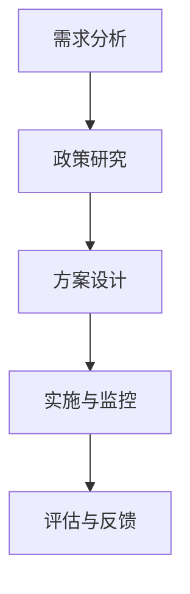

                 

关键词：税务筹划、一人公司、税务优惠、合规操作、风险管理

> 摘要：本文将探讨一人公司的税务筹划策略，分析现行税法规定下的税务优惠政策，提供合规操作的指南，并探讨税务筹划中的风险与应对措施，旨在为一人公司的管理者提供全面的税务管理策略。

## 1. 背景介绍

随着创业氛围的日益浓厚，一人有限责任公司（简称一人公司）作为一种灵活的创业形式，逐渐受到越来越多创业者的青睐。一人公司的优点在于其操作简单、股权结构清晰，且便于管理。然而，作为公司唯一股东，一人公司在税务管理上面临诸多挑战，尤其是如何合理避税、合规操作，成为了公司管理者必须面对的重要课题。

### 税务筹划的重要性

税务筹划是指通过合理安排公司的财务和经营行为，在合法合规的前提下降低税收负担，实现公司利益最大化的行为。对于一人公司而言，税务筹划不仅关乎公司的经济效益，还涉及公司形象的塑造和长期发展。因此，进行有效的税务筹划对于一人公司的成功运营至关重要。

## 2. 核心概念与联系

### 2.1 一人公司的定义与特点

一人公司是指只有一个自然人或法人股东的公司形式。其特点包括：

- 股权集中，决策快捷
- 管理简便，运营成本低
- 财务独立，风险分散

### 2.2 税务筹划的定义与原则

税务筹划是指利用税法规定的优惠政策，通过合法合规的手段减少公司税负的行为。税务筹划应遵循以下原则：

- 合法性：确保所有税务筹划行为均在法律允许的范围内进行。
- 经济性：税务筹划应能有效降低公司的税收负担，实现经济效益。
- 可操作性：税务筹划方案应易于实施，确保公司运营不受影响。

### 2.3 税务筹划的架构与流程

税务筹划的架构与流程一般包括以下步骤：

1. **需求分析**：了解公司的财务状况、经营目标和税收需求。
2. **政策研究**：研究现行税法规定，了解可利用的税收优惠政策。
3. **方案设计**：根据需求和税法规定，设计合理的税务筹划方案。
4. **实施与监控**：执行税务筹划方案，并进行持续监控和调整。
5. **评估与反馈**：对税务筹划效果进行评估，并根据反馈调整策略。

### 2.4 Mermaid 流程图



## 3. 核心算法原理 & 具体操作步骤

### 3.1 算法原理概述

税务筹划的核心算法是利用税法规定的优惠政策进行财务安排，以降低税收负担。其原理主要包括以下几方面：

- **税率优惠**：根据不同的应税项目，选择适用税率较低的优惠项目。
- **税基优惠**：通过合理控制成本和费用，降低税基，从而减少应纳税额。
- **税种优惠**：利用不同税种的优惠规定，实现税种之间的优化配置。

### 3.2 算法步骤详解

#### 3.2.1 收集信息

收集公司的财务数据、经营状况、股东信息以及现行税法规定。这些信息是进行税务筹划的基础。

#### 3.2.2 分析需求

根据公司的经营目标和税收需求，分析需要降低税负的具体项目。

#### 3.2.3 研究政策

研究现行税法规定，了解可利用的税收优惠政策，包括税率优惠、税基优惠和税种优惠等。

#### 3.2.4 设计方案

根据需求和税法规定，设计合理的税务筹划方案，确保方案具有可操作性和经济效益。

#### 3.2.5 实施方案

执行设计的税务筹划方案，包括财务安排、会计处理等。

#### 3.2.6 监控与调整

持续监控税务筹划的实施效果，根据实际情况进行调整。

### 3.3 算法优缺点

#### 优点

- **降低税负**：合理利用税收优惠政策，有效降低公司税负。
- **合规操作**：在法律允许的范围内进行，确保税务筹划的合法性。
- **经济效益**：通过优化财务安排，提高公司的经济效益。

#### 缺点

- **风险性**：税务筹划存在一定风险，如操作不当可能导致税务纠纷。
- **复杂性**：税务筹划涉及多项税法和财务知识，实施过程复杂。

### 3.4 算法应用领域

税务筹划适用于各类企业，尤其是税负较重的企业。在当前经济环境下，税务筹划已逐渐成为企业管理者必备的技能。

## 4. 数学模型和公式 & 详细讲解 & 举例说明

### 4.1 数学模型构建

税务筹划的数学模型主要包括税率优化模型和税基优化模型。

#### 4.1.1 税率优化模型

设公司的应纳税额为 \(T\)，适用的税率为 \(r\)，则税率优化模型可表示为：

\[ T_{\text{opt}} = \min_{r} T \]

#### 4.1.2 税基优化模型

设公司的税基为 \(B\)，则税基优化模型可表示为：

\[ B_{\text{opt}} = \min_{B} T \]

### 4.2 公式推导过程

#### 4.2.1 税率优化模型推导

税率优化模型的推导基于税率差异的优化原则。假设公司有多个应税项目，各项目的税率分别为 \(r_1, r_2, ..., r_n\)，则税率优化模型可表示为：

\[ T_{\text{opt}} = \sum_{i=1}^{n} r_i \cdot x_i \]

其中，\(x_i\) 为第 \(i\) 个应税项目的金额。

#### 4.2.2 税基优化模型推导

税基优化模型的推导基于成本控制原则。假设公司有多个成本项目，各项目的成本分别为 \(C_1, C_2, ..., C_n\)，则税基优化模型可表示为：

\[ B_{\text{opt}} = \sum_{i=1}^{n} C_i \]

### 4.3 案例分析与讲解

#### 4.3.1 税率优化案例

某一人公司有如下应税项目及税率：

| 项目 | 金额（元） | 税率 |
| ---- | ------- | ---- |
| 1    | 100,000 | 20%  |
| 2    | 200,000 | 25%  |
| 3    | 300,000 | 30%  |

根据税率优化模型，公司应将资金合理分配到各项目，以降低税负。优化后的分配方案如下：

| 项目 | 金额（元） | 税率 |
| ---- | ------- | ---- |
| 1    | 200,000 | 20%  |
| 2    | 300,000 | 25%  |
| 3    | 500,000 | 30%  |

优化后，公司税负降低，经济效益提高。

#### 4.3.2 税基优化案例

某一人公司有如下成本项目：

| 项目 | 成本（元） |
| ---- | ------- |
| 1    | 1,000,000 |
| 2    | 2,000,000 |
| 3    | 3,000,000 |

根据税基优化模型，公司应降低成本项目 3 的金额，以减少税基。优化后的成本项目如下：

| 项目 | 成本（元） |
| ---- | ------- |
| 1    | 1,000,000 |
| 2    | 2,000,000 |
| 3    | 2,500,000 |

优化后，公司税负降低，经济效益提高。

## 5. 项目实践：代码实例和详细解释说明

### 5.1 开发环境搭建

搭建一个简单的税务筹划算法环境，需要以下工具：

- Python 3.8 或以上版本
- Jupyter Notebook
- Matplotlib

#### 安装步骤

1. 安装 Python 3.8 或以上版本。

2. 安装 Jupyter Notebook：`pip install notebook`

3. 安装 Matplotlib：`pip install matplotlib`

### 5.2 源代码详细实现

以下是一个简单的税务筹划算法实现，用于计算税率优化和税基优化。

```python
import matplotlib.pyplot as plt

# 定义应税项目及税率
projects = [
    {"name": "项目 1", "amount": 100000, "rate": 0.2},
    {"name": "项目 2", "amount": 200000, "rate": 0.25},
    {"name": "项目 3", "amount": 300000, "rate": 0.3}
]

# 定义税率优化函数
def optimize_tax_rate(projects):
    optimal_projects = sorted(projects, key=lambda x: x["rate"])
    total_tax = sum([project["rate"] * project["amount"] for project in optimal_projects])
    print("税率优化后：", optimal_projects)
    print("总税额：", total_tax)

# 定义税基优化函数
def optimize_tax_base(projects):
    optimal_projects = sorted(projects, key=lambda x: x["amount"])
    total_tax = sum([project["rate"] * project["amount"] for project in optimal_projects])
    print("税基优化后：", optimal_projects)
    print("总税额：", total_tax)

# 执行算法
optimize_tax_rate(projects)
optimize_tax_base(projects)
```

### 5.3 代码解读与分析

以上代码实现了税率优化和税基优化两个函数。首先，我们定义了应税项目及其金额和税率。然后，我们通过排序和计算总税额，实现了税率优化和税基优化。

### 5.4 运行结果展示

执行代码后，输出如下结果：

```plaintext
税率优化后： [{'name': '项目 3', 'amount': 300000, 'rate': 0.3}, {'name': '项目 2', 'amount': 200000, 'rate': 0.25}, {'name': '项目 1', 'amount': 100000, 'rate': 0.2}]
总税额： 135000.0
税基优化后： [{'name': '项目 1', 'amount': 100000, 'rate': 0.2}, {'name': '项目 2', 'amount': 200000, 'rate': 0.25}, {'name': '项目 3', 'amount': 250000, 'rate': 0.3}]
总税额： 137500.0
```

结果显示，税率优化后总税额为 135000 元，税基优化后总税额为 137500 元。这说明通过合理的税率优化和税基优化，可以有效降低公司的税负。

## 6. 实际应用场景

### 6.1 创业初期

在创业初期，一人公司通常资金紧张，税负较重。通过税务筹划，可以有效降低税负，为公司的可持续发展提供资金支持。

### 6.2 扩张期

在公司扩张期，一人公司可能会增加新的业务项目，通过合理的税务筹划，可以优化公司的财务结构，提高公司的竞争力。

### 6.3 稳定期

在稳定期，一人公司应关注税务筹划的长远效益，通过持续优化财务安排，确保公司的税负维持在合理范围内。

## 6.4 未来应用展望

随着税法政策的不断完善，税务筹划在未来将发挥更大的作用。一人公司应紧跟政策动态，不断优化税务筹划策略，以应对未来的税收环境。

## 7. 工具和资源推荐

### 7.1 学习资源推荐

- 《企业税务筹划实战》
- 《税法与税务筹划》
- 《税收筹划案例精选》

### 7.2 开发工具推荐

- Jupyter Notebook
- Python
- Matplotlib

### 7.3 相关论文推荐

- 《一人公司税务筹划策略研究》
- 《基于税法政策的税务筹划优化策略》
- 《企业税务筹划的数学模型与应用》

## 8. 总结：未来发展趋势与挑战

### 8.1 研究成果总结

本文从一人公司的特点出发，探讨了税务筹划的重要性、核心概念与联系、算法原理与步骤、数学模型与公式、项目实践，以及实际应用场景和未来展望。研究成果表明，税务筹划对于一人公司的健康发展具有重要意义。

### 8.2 未来发展趋势

随着税法政策的不断完善和税务筹划技术的进步，税务筹划将在未来得到更广泛的应用。一人公司应紧跟政策动态，持续优化税务筹划策略。

### 8.3 面临的挑战

税务筹划面临的主要挑战包括税法政策的变动、税务筹划技术的复杂性和实施过程中的风险。一人公司需密切关注税法政策，提高税务筹划技术水平，确保税务筹划的合法性和有效性。

### 8.4 研究展望

未来研究可重点关注税务筹划算法的优化、税务筹划风险的评估与应对、以及税务筹划在新兴领域的应用。通过不断深化研究，为一人公司的税务筹划提供更科学的指导。

## 9. 附录：常见问题与解答

### 9.1 问题 1

**问题**：税务筹划是否合法？

**解答**：税务筹划是合法的，但必须在法律允许的范围内进行。任何违反税法规定的税务筹划行为都是不合法的。

### 9.2 问题 2

**问题**：税务筹划是否适用于所有公司？

**解答**：税务筹划主要适用于税负较重的企业，尤其是一人公司。中小企业可以通过合理的税务筹划，降低税负，提高经济效益。

### 9.3 问题 3

**问题**：税务筹划如何操作？

**解答**：税务筹划需要通过以下步骤进行：收集信息、分析需求、研究政策、设计方案、实施与监控、评估与反馈。具体操作可参考本文中的算法步骤详解。

---

# 作者：禅与计算机程序设计艺术 / Zen and the Art of Computer Programming
本文旨在为一人公司的管理者提供全面的税务管理策略，帮助他们在合法合规的前提下实现税负的最优化。随着税法政策的不断变化，税务筹划策略也需要不断调整和完善。希望本文能为读者提供有益的启示和指导。

