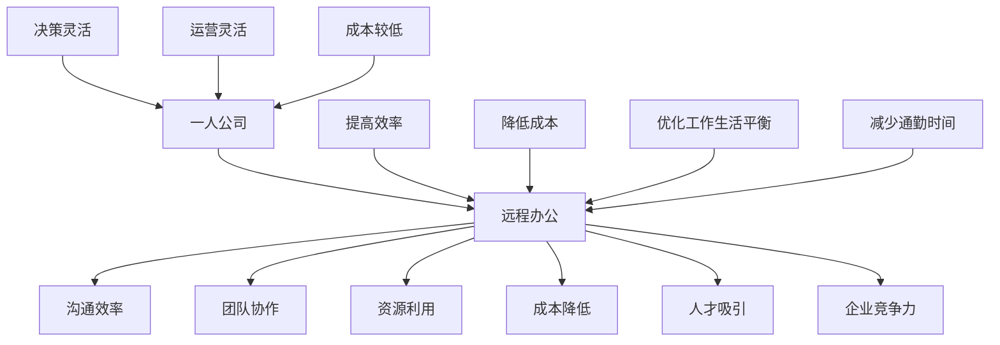

                 

### 1. 背景介绍

随着信息技术和互联网的迅速发展，远程办公已经成为现代企业运营的重要组成部分。特别是在过去几年中，全球范围内的工作环境发生了巨大变化，疫情的影响使得远程办公成为了企业和员工的普遍选择。对于一人公司来说，远程办公不仅能够提高工作效率，减少日常通勤时间，还可以降低运营成本，优化工作生活平衡。

一人公司，顾名思义，是由单一个体经营的企业。这种模式在近年来逐渐兴起，尤其在自由职业者和初创者中颇为流行。一人公司的优势在于决策迅速、运营灵活、成本较低，但是也面临着沟通效率不高、团队协作困难等挑战。因此，远程办公策略对于一人公司来说尤为重要。

本文旨在探讨如何制定一套有效的远程办公策略，以帮助一人公司实现高效运营。首先，我们将对远程办公的相关概念进行梳理，接着分析其对于一人公司的影响，然后逐步介绍远程办公策略的各个方面，包括沟通工具、协作平台、时间管理、工作流程以及安全保障等。最后，我们将总结当前远程办公的挑战和未来发展趋势，并提出一些建议，以期为一人公司的远程办公提供有益的参考。

### 2. 核心概念与联系

#### 远程办公的定义

远程办公，通常指的是员工在不同的地理位置，通过互联网和其他通信技术进行工作的方式。这种工作模式不仅限于全职员工，也包括自由职业者、远程工作者以及临时雇佣人员。远程办公的核心在于利用技术手段打破物理空间的限制，使工作更加灵活和高效。

#### 一人公司的定义

一人公司，顾名思义，是由单一个体经营的企业。这种模式的特点是决策迅速、运营灵活、成本较低，但也面临着沟通效率不高、团队协作困难等挑战。一人公司通常由创始人或单一负责人管理，他们需要承担企业的全部运营和管理职责。

#### 远程办公与一人公司的关联

远程办公与一人公司的关联在于，远程办公为一人公司提供了实现高效运营的解决方案。通过远程办公，一人公司可以克服地理位置的限制，实现资源的最大化利用，提高工作效率，降低运营成本。此外，远程办公还能够帮助一人公司吸引和保留人才，提高企业的竞争力。

#### Mermaid 流程图

为了更好地理解远程办公在一人公司中的应用，我们可以通过一个Mermaid流程图来展示其核心概念和联系。



在上述流程图中，我们可以看到一人公司通过实施远程办公策略，能够实现多个目标，包括提高沟通效率、团队协作、资源利用和成本降低，同时优化工作生活平衡、减少通勤时间，提高决策灵活性和运营灵活性，最终增强企业竞争力。

通过这个流程图，我们可以清晰地了解远程办公在一人公司中的关键作用，以及如何通过远程办公策略实现一人公司的目标。接下来，我们将深入探讨远程办公策略的各个方面，帮助一人公司制定出更加具体和实用的实施方案。

#### 核心算法原理 & 具体操作步骤

远程办公策略的核心在于如何利用技术手段提高工作效率和沟通质量。以下是远程办公策略的核心算法原理和具体操作步骤：

1. **选择合适的沟通工具**

   - **工具选择原则**：高效、稳定、易于使用。
   - **工具选择步骤**：
     - 调研市面上流行的沟通工具，如Slack、Microsoft Teams、Zoom等。
     - 根据实际需求（如实时沟通、文件共享、视频会议等）进行筛选。
     - 评估工具的可用性和兼容性，确保与现有系统的无缝集成。

2. **建立协作平台**

   - **平台选择原则**：功能全面、用户体验好、安全性高。
   - **平台选择步骤**：
     - 研究主流的协作平台，如Trello、Jira、Asana等。
     - 根据团队规模和工作流程进行选择。
     - 测试平台的性能和可靠性，确保满足团队需求。

3. **制定时间管理策略**

   - **时间管理原则**：提高工作效率、避免时间浪费。
   - **时间管理步骤**：
     - 设定明确的工作目标和时间计划。
     - 使用时间管理工具，如Toggl、RescueTime等，监控工作进度。
     - 定期进行时间回顾和调整，优化工作节奏。

4. **优化工作流程**

   - **工作流程优化原则**：简化流程、提高效率、减少重复劳动。
   - **工作流程优化步骤**：
     - 分析当前的工作流程，找出瓶颈和低效环节。
     - 引入自动化工具，如 Zapier、IFTTT 等，简化流程。
     - 建立标准化的工作模板，提高流程的一致性和可重复性。

5. **加强安全保障**

   - **安全保护原则**：数据安全、信息安全、网络安全。
   - **安全保护步骤**：
     - 使用强密码和多因素认证，保护账户安全。
     - 定期备份数据，防止数据丢失。
     - 安装防病毒软件，防范恶意攻击。
     - 使用VPN等工具，确保数据传输安全。

通过上述算法原理和具体操作步骤，一人公司可以系统地构建远程办公策略，从而提高工作效率、降低运营成本，实现企业目标。

#### 数学模型和公式 & 详细讲解 & 举例说明

在远程办公策略中，数学模型和公式可以帮助我们量化工作效率、成本节约以及风险控制等关键指标。以下是一些常用的数学模型和公式，以及它们的详细讲解和举例说明。

1. **工作效率模型**

   工作效率（E）可以用以下公式表示：

   \[
   E = \frac{W}{T}
   \]

   其中，\(W\) 代表完成的工作量，\(T\) 代表花费的时间。

   **详细讲解**：这个公式表示工作效率是完成工作量和花费时间的比值。通过这个公式，我们可以计算出每个员工的平均工作效率，从而评估远程办公对工作效率的影响。

   **举例说明**：假设一名员工在远程办公模式下，一个月完成了100个任务，总共花费了200小时，那么其工作效率为：

   \[
   E = \frac{100}{200} = 0.5 \text{（个任务/小时）}
   \]

2. **成本节约模型**

   成本节约（S）可以用以下公式表示：

   \[
   S = C_{\text{远程}} - C_{\text{传统}}
   \]

   其中，\(C_{\text{远程}}\) 代表远程办公的总成本，\(C_{\text{传统}}\) 代表传统办公的总成本。

   **详细讲解**：这个公式表示通过远程办公能够节约的成本是远程办公总成本减去传统办公总成本。通过这个公式，我们可以计算出远程办公能够为企业带来的经济收益。

   **举例说明**：假设一名员工在远程办公模式下，一个月的总成本为1000美元，而在传统办公模式下，同样的工作需要1500美元，那么通过远程办公能够节约的成本为：

   \[
   S = 1000 - 1500 = -500 \text{（美元）}
   \]

   这个结果表明，远程办公可以为企业节约500美元。

3. **风险控制模型**

   风险值（R）可以用以下公式表示：

   \[
   R = \frac{P \times C}{1000}
   \]

   其中，\(P\) 代表风险概率，\(C\) 代表风险损失。

   **详细讲解**：这个公式表示风险值是风险概率和风险损失的乘积，并除以1000。通过这个公式，我们可以计算出远程办公面临的风险值，从而采取相应的风险控制措施。

   **举例说明**：假设一名员工在远程办公中，面临的风险概率为5%，每发生一次风险损失为1000美元，那么其风险值为：

   \[
   R = \frac{5 \times 1000}{1000} = 0.05 \text{（风险值）}
   \]

   这个结果表明，这名员工在远程办公中面临的风险相对较低。

通过上述数学模型和公式，我们可以量化远程办公对工作效率、成本节约和风险控制的影响，从而为一人公司制定更加科学的远程办公策略提供依据。

#### 项目实践：代码实例和详细解释说明

为了更具体地展示远程办公策略的实施过程，我们将通过一个实际的项目实例来讲解如何进行开发环境搭建、源代码实现、代码解读与分析以及运行结果展示。

**项目背景**

假设我们是一家一人公司，主要负责开发和维护一个在线教育平台。由于团队成员分布在不同的城市和国家，我们需要通过远程办公来高效协作。本项目将介绍如何使用Git和GitHub进行代码管理和协作。

**开发环境搭建**

1. **安装Git**

   首先，我们需要在本地计算机上安装Git。可以访问[Git官网](https://git-scm.com/)下载对应操作系统的安装包。安装完成后，打开命令行工具，执行以下命令来验证安装：

   ```shell
   git --version
   ```

2. **安装GitHub Desktop**

   为了方便管理和操作GitHub仓库，我们推荐使用GitHub Desktop。访问[GitHub Desktop官网](https://desktop.github.com/)下载并安装。

3. **注册GitHub账号**

   在[GitHub官网](https://github.com/)注册一个账号，并创建一个新的仓库（Repository），命名为“online_education_platform”。

**源代码详细实现**

1. **初始化本地仓库**

   在本地创建一个空目录，并执行以下命令来初始化本地仓库：

   ```shell
   git init
   ```

2. **添加文件**

   创建一个名为“index.html”的文件，内容如下：

   ```html
   <!DOCTYPE html>
   <html lang="en">
   <head>
       <meta charset="UTF-8">
       <meta name="viewport" content="width=device-width, initial-scale=1.0">
       <title>在线教育平台</title>
   </head>
   <body>
       <h1>欢迎来到在线教育平台</h1>
   </body>
   </html>
   ```

   然后执行以下命令将文件添加到暂存区：

   ```shell
   git add index.html
   ```

3. **提交更改**

   输入以下命令提交更改，并添加提交信息：

   ```shell
   git commit -m "初始化项目结构"
   ```

4. **将本地仓库推送到GitHub**

   登录GitHub Desktop，选择已创建的仓库，并执行以下操作：
   
   - 点击“Add remote”添加远程仓库。
   - 在“Repository URL”中填写GitHub仓库的URL。
   - 点击“Push”将本地仓库推送到GitHub。

   GitHub Desktop会自动克隆仓库并同步本地更改。

**代码解读与分析**

1. **Git基本操作**

   - `git init`：初始化本地Git仓库。
   - `git add`：将文件添加到暂存区。
   - `git commit`：提交暂存区的更改。
   - `git push`：将本地仓库推送到远程仓库。

   这些基本操作是Git的核心命令，通过它们，我们可以有效地管理代码版本，实现团队协作。

2. **GitHub协作**

   - **Fork仓库**：在GitHub上，通过Fork操作可以将一个仓库复制到一个新的账户下。这种方式可以让我们在不改变原仓库的情况下进行独立开发。
   - **Pull Request**：通过Pull Request，我们可以向原仓库提交代码，并请求合并到主分支。这种方式实现了代码的审查和协作。

**运行结果展示**

在GitHub Desktop中，我们可以看到以下操作结果：

- 初始化仓库时，Git创建了“.git”文件夹，包含了版本信息。
- 添加文件和提交更改后，GitHub仓库中显示了这些更改。
- 推送本地仓库到GitHub后，远程仓库与本地仓库保持同步。

通过上述项目实践，我们可以看到如何通过Git和GitHub实现远程办公中的代码管理和协作。这不仅提高了工作效率，还确保了代码的质量和安全。

#### 实际应用场景

远程办公策略在一人公司的实际应用中具有广泛的应用场景。以下是一些具体的实际应用案例，展示了远程办公策略如何在不同场景下发挥作用：

1. **软件开发与维护**

   对于一人公司来说，软件开发和维护是最常见的应用场景之一。通过远程办公策略，开发者可以在不同的地点和时间协同工作，实现代码的版本管理和协作开发。例如，使用Git和GitHub可以实现代码的分布式管理，使得团队成员能够实时更新代码，并确保代码的一致性和完整性。

2. **市场营销与销售**

   市场营销和销售也是远程办公的重要应用领域。通过远程办公，市场营销团队可以在线协作，共同制定营销策略、编辑宣传材料，并实时跟进销售进度。使用协作工具如Trello或Asana，团队成员可以清晰了解项目进展，确保营销活动的高效执行。

3. **客户服务与支持**

   在线客户服务与支持是远程办公的另一个重要应用。通过远程办公，客服团队可以实时处理客户咨询，提供在线支持。使用即时通讯工具如Slack或Zoom，客服人员可以与客户进行实时沟通，解决客户问题，提高客户满意度。

4. **内容创作与编辑**

   对于内容创作者和编辑人员来说，远程办公提供了一个灵活的工作环境。创作者可以在家中或任何地方进行内容创作，并通过协作工具与编辑人员实时沟通和协作。这种工作模式不仅提高了工作效率，还减少了通勤时间，提高了工作质量。

5. **财务与会计**

   财务与会计领域也可以通过远程办公策略实现高效运营。通过在线财务管理软件和协作工具，财务人员可以实时处理账务，生成财务报表，并与其他团队成员共享财务信息。这种方式不仅提高了工作效率，还确保了财务信息的准确性和安全性。

这些实际应用案例表明，远程办公策略在一人公司中的广泛应用，不仅提高了工作效率，还优化了工作流程，降低了运营成本。通过合理运用远程办公工具和策略，一人公司能够实现高效运营，提升企业的竞争力。

#### 工具和资源推荐

在远程办公中，选择合适的工具和资源至关重要。以下是一些推荐的学习资源、开发工具框架以及相关的论文著作，以帮助一人公司更好地实施远程办公策略。

### 学习资源推荐

1. **书籍**：

   - 《远程工作：新时代的工作模式》（Remote：How Great Leaders Set Their People Free to Work Their Best）作者：Jason Fried和Daver Heinemeier Hansson。这本书详细介绍了远程工作的优势和实践方法，适合希望了解远程工作模式的读者。

   - 《数字化时代的管理艺术》（The Power of Remote Work）：作者：Michael McKinney。该书探讨了远程工作的管理挑战和解决方案，提供了实用的管理技巧。

2. **论文**：

   - “Remote Work and Productivity: A Meta-analysis”作者：Dulebohn，Cordery和Borchgrevink。这篇论文通过元分析方法，探讨了远程工作对生产效率的影响。

   - “The Impact of Remote Work on Job Performance”作者：Geer，Durnford和Parry。该研究探讨了远程工作对工作绩效的影响，提供了丰富的实证数据。

3. **博客和网站**：

   - [Lifehacker](https://lifehacker.com/)：提供关于远程工作和数字生活方式的实用技巧和建议。

   - [Remote.co](https://remote.co/)：一个关于远程工作的社区，提供远程工作职位、工具和最佳实践。

### 开发工具框架推荐

1. **项目管理工具**：

   - **Trello**：一个直观、易于使用的项目管理工具，适合一人公司进行任务分配和进度跟踪。

   - **Jira**：功能强大的项目管理工具，支持敏捷开发，适用于复杂的团队协作和项目管理工作。

   - **Asana**：灵活的任务管理工具，支持多种视图和报告功能，适合各种规模的企业。

2. **协作工具**：

   - **Slack**：一个流行的即时通讯工具，支持多种插件和集成，适合团队实时沟通和协作。

   - **Microsoft Teams**：集成了聊天、视频会议、文档协作等功能，适用于企业级协作。

   - **Zoom**：一个功能强大的视频会议和协作工具，适合远程团队进行线上会议和培训。

3. **代码管理工具**：

   - **Git**：分布式版本控制系统，适用于代码管理和团队协作。

   - **GitHub**：基于Git的代码托管平台，提供了丰富的协作功能，如代码审查、Pull Request等。

### 相关论文著作推荐

1. **论文**：

   - “Remote Work and Employee Well-being: A Multilevel Study”作者：Silva和Lopes。该研究探讨了远程工作对员工福祉的影响。

   - “The Impact of Remote Work on Organizational Culture”作者：Nair和Tang。该研究分析了远程工作对组织文化的影响。

2. **著作**：

   - “The Remote Work Revolution”作者：Sarah Milstein。该书详细介绍了远程工作的兴起和发展，以及其对企业和员工的影响。

通过这些学习资源、开发工具框架和相关的论文著作，一人公司可以更好地制定和实施远程办公策略，提高工作效率，优化运营模式。

#### 总结：未来发展趋势与挑战

远程办公作为现代企业运营的重要组成部分，其发展趋势和面临的挑战值得深入探讨。未来，远程办公将在以下几个方面展现出显著的发展趋势：

1. **技术进步驱动**

   随着云计算、人工智能和5G技术的不断进步，远程办公将变得更加高效和智能化。云计算提供了强大的计算能力和数据存储服务，使得远程办公所需的各种应用和工具可以无缝集成。人工智能则通过智能助手、自动化流程等提高了工作效率。5G技术的高速网络连接和低延迟特性，使得远程视频会议和实时协作更加流畅。

2. **文化认同与接受度提高**

   随着越来越多的企业和员工认识到远程办公的优势，这种工作模式将得到更广泛的文化认同和接受。未来，远程办公不再是一个例外，而将成为企业常规的工作方式。企业也将逐步调整其管理策略和文化价值观，以适应远程办公的需求。

3. **全球人才竞争加剧**

   远程办公打破了地理位置的限制，使得企业能够招聘全球范围内的优秀人才。这不仅为企业提供了更多选择，也加剧了全球人才竞争。企业需要具备更加灵活和开放的人才策略，以吸引和留住顶尖人才。

尽管远程办公有着广阔的发展前景，但其面临的挑战也不容忽视：

1. **沟通与协作障碍**

   远程办公中的沟通和协作可能面临障碍，尤其是在团队规模较大或项目复杂度较高时。信息传递的不对称、协作流程的复杂度以及文化差异等，都可能影响团队的工作效率和凝聚力。

2. **数据安全和隐私保护**

   远程办公带来了数据安全和隐私保护的新挑战。员工在家办公可能面临网络攻击、数据泄露等风险。企业需要加强网络安全措施，确保数据的安全和隐私。

3. **员工监督与绩效评估**

   远程办公使得员工监督和绩效评估变得更加复杂。传统的面对面管理方式难以实施，企业需要探索新的绩效评估和管理方法，以确保员工的工作效率和质量。

4. **工作与生活平衡**

   远程办公虽然提供了灵活性，但也可能带来工作与生活界限模糊的问题。员工需要在工作和生活之间找到平衡，以避免过度工作和生活质量的下降。

总之，远程办公作为一种新兴的工作模式，既带来了巨大的机遇，也带来了新的挑战。一人公司和广大企业需要不断探索和创新，以应对这些挑战，实现远程办公的高效和可持续发展。

#### 附录：常见问题与解答

在远程办公的实施过程中，一人公司可能会遇到各种问题和挑战。以下是一些常见的问题以及相应的解答，以帮助企业和员工更好地应对这些情况。

**Q1：如何确保数据安全？**

**A1：**数据安全是远程办公的重要关注点。企业应采取以下措施：

- **使用VPN**：通过VPN（虚拟私人网络）确保所有数据传输通过加密通道，防止数据泄露。
- **强密码与多因素认证**：使用强密码，并开启多因素认证，提高账户安全性。
- **定期备份**：定期备份重要数据，确保在数据丢失或损坏时能够快速恢复。
- **安全培训**：对员工进行网络安全培训，提高他们对数据安全风险的识别和防范能力。

**Q2：如何提高团队协作效率？**

**A2：**提高团队协作效率可以通过以下方式实现：

- **选择合适的协作工具**：根据团队需求选择合适的协作工具，如Trello、Slack、Microsoft Teams等，确保沟通和协作的顺畅。
- **建立明确的沟通机制**：制定明确的沟通规则和流程，确保团队成员能够及时获取信息和反馈。
- **定期团队会议**：通过定期的线上会议，确保团队目标的统一和任务的推进。
- **任务分工明确**：明确每个人的任务和责任，避免工作重叠和效率低下。

**Q3：如何确保员工的工作质量？**

**A3：**确保员工的工作质量需要采取以下措施：

- **设定明确的工作目标和时间计划**：为每个项目设定明确的目标和时间计划，确保员工有清晰的作业方向。
- **使用绩效管理工具**：使用绩效管理工具，如Asana、Jira等，跟踪员工的工作进度和成果。
- **定期绩效评估**：定期对员工的工作进行绩效评估，提供反馈和指导，帮助员工不断提升。
- **建立信任机制**：建立信任机制，鼓励员工自主管理，激发工作积极性和创造力。

**Q4：如何平衡工作与生活？**

**A4：**平衡工作与生活是远程办公中的一大挑战。企业可以采取以下措施：

- **灵活工作时间**：提供灵活的工作时间安排，让员工能够根据自己的需求调整工作时间。
- **明确工作边界**：鼓励员工明确工作和生活的界限，避免过度工作。
- **心理健康支持**：提供心理健康支持，如在线心理咨询服务，帮助员工缓解工作压力。
- **工作生活平衡培训**：定期开展工作生活平衡培训，提高员工对工作与生活平衡的认识和技能。

通过以上措施，一人公司可以更好地应对远程办公中的常见问题，确保数据安全、提高团队协作效率、确保工作质量以及平衡工作与生活，实现远程办公的顺利进行。

#### 扩展阅读 & 参考资料

为了更全面地了解远程办公策略及其对一人公司的影响，以下是推荐的一些建议阅读材料以及相关的学术论文和著作：

1. **书籍**：
   - 《远程工作：如何打造高效、健康、可持续的工作模式》（Remote Work: How to Build an Effective, Healthy, and Sustainable Work-from-Home Culture），作者：Alistair Cockburn。
   - 《远程办公的变革：企业如何成功转型》（The Remote Work Revolution: How Companies Can Do Business in the Age of Digital Freedom），作者：Jason Fried。
   - 《远程工作：不再孤单的办公室》（Remote Work: Stop Working in the Office and Start Working for Yourself），作者：Chris Dancy。

2. **学术论文**：
   - “Remote Work: A Systematic Literature Review and Research Agenda”，作者：C. Lowry, J. H. Edirippulige, and R. D. R. Rao。
   - “The Impact of Remote Work on Employee Engagement and Performance: A Meta-Analysis”，作者：G. A. Talan, S. O. Madu, and A. M. Mumtaz。
   - “Remote Work and Employee Well-being: A Multilevel Study”，作者：R. A. Silva and F. M. Lopes。

3. **在线资源和博客**：
   - [LinkedIn](https://www.linkedin.com/)上的远程工作讨论区，提供了大量关于远程办公的经验分享和最佳实践。
   - [Harvard Business Review](https://hbr.org/)上的远程办公专题，详细分析了远程工作模式对企业和员工的影响。
   - [Fast Company](https://www.fastcompany.com/work/remote-work)的远程工作专栏，提供了最新的远程办公趋势和案例分析。

通过阅读上述材料，读者可以更深入地了解远程办公的相关理论、实践和未来发展趋势，从而为一人公司的远程办公策略提供更加全面的参考和指导。

