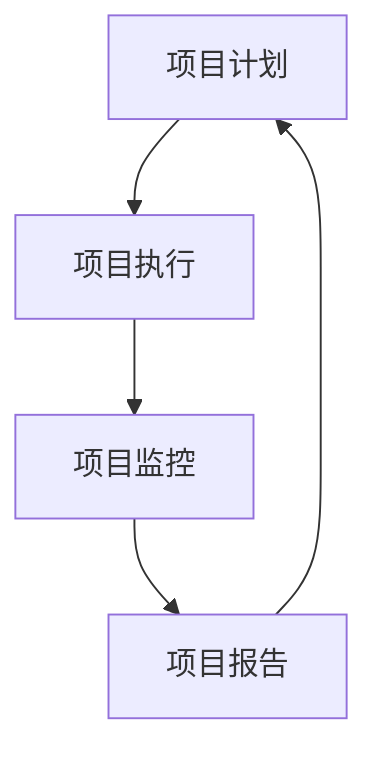

                 

项目管理对于任何公司来说都是至关重要的，无论是在规模较大、资源丰富的企业，还是在只有一人的小型创业公司。本文将探讨在一人公司中实现高效项目管理的最佳实践。首先，让我们了解什么是项目管理，以及为什么它在任何公司中都至关重要。

## 1. 背景介绍

项目管理是一种系统化的规划、执行、监控和报告项目活动的过程，以确保项目目标的实现。对于传统的大型企业来说，项目管理通常涉及多个团队成员的协调合作。然而，在一人公司中，项目管理需要更加精细和高效。

一人公司通常是指由一个创始人或个人负责经营的公司。这种模式在创业领域越来越受欢迎，因为它允许创业者更快地启动项目，并更灵活地应对市场变化。然而，由于资源的限制，一人公司在项目管理方面面临诸多挑战。

本文将探讨以下主题：

1. 项目管理的定义和重要性
2. 一人公司项目管理的独特挑战
3. 高效项目管理的最佳实践
4. 实际案例研究
5. 工具和资源推荐
6. 未来发展趋势与挑战

## 2. 核心概念与联系

项目管理的核心概念包括项目计划、项目执行、项目监控和项目报告。这些概念相互关联，形成一个完整的管理流程。以下是一个用Mermaid绘制的项目管理流程图：



### 2.1 项目计划

项目计划是项目管理的第一步，它涉及定义项目目标、确定所需资源、设定时间表和预算。项目计划的好坏直接影响项目的成功与否。

### 2.2 项目执行

项目执行是按照计划实施项目的过程。在这一阶段，资源被分配，任务被执行，项目进展被跟踪。

### 2.3 项目监控

项目监控是确保项目按计划进行的环节。它包括定期检查项目进度、资源使用情况和风险状况。

### 2.4 项目报告

项目报告是项目管理的最后一步，它涉及记录项目成果、总结经验教训，并为未来项目提供参考。

## 3. 核心算法原理 & 具体操作步骤

在项目管理中，有一些核心算法原理可以帮助我们优化项目计划、执行和监控。以下是三个常用的算法：

### 3.1 优先级排序算法

优先级排序算法用于确定任务的重要性和紧急性。常见的算法包括：

- 甘特图（Gantt Chart）
- 临界路径法（Critical Path Method, CPM）

### 3.2 资源分配算法

资源分配算法用于优化资源使用，确保项目在预算和时间限制内完成。常见的算法包括：

- 最小生成树（Minimum Spanning Tree, MST）
- 贪心算法（Greedy Algorithm）

### 3.3 风险评估算法

风险评估算法用于识别、分析和缓解项目风险。常见的算法包括：

- 蒙特卡洛模拟（Monte Carlo Simulation）
- 故障树分析（Fault Tree Analysis, FTA）

### 3.4 算法步骤详解

#### 3.1.1 优先级排序算法

**甘特图（Gantt Chart）步骤：**

1. 列出所有任务和它们的持续时间。
2. 为每个任务分配一个开始时间和结束时间。
3. 使用水平条表示任务进度。

**临界路径法（CPM）步骤：**

1. 列出所有任务和它们之间的依赖关系。
2. 计算每个任务的最早开始时间（ES）和最晚开始时间（LS）。
3. 计算每个任务的松弛时间（RS），即最早开始时间与最晚开始时间之间的差值。
4. 识别出临界路径，即任何一个任务延迟都会导致项目延误的路径。

#### 3.1.2 资源分配算法

**最小生成树（MST）步骤：**

1. 选择一个节点作为树的根。
2. 重复以下步骤，直到所有节点都被连接：
   - 从未连接的节点中选择一个与当前树中节点连接的最小权重边。
3. 计算生成树的总权重。

**贪心算法（Greedy Algorithm）步骤：**

1. 选择一个最佳资源分配策略，如最小成本优先（Min-Cost First）或最大收益优先（Max-Reward First）。
2. 重复以下步骤，直到所有资源都被分配：
   - 选择一个未分配的资源，并分配给最佳的任务。
3. 计算资源分配的总成本或总收益。

#### 3.1.3 风险评估算法

**蒙特卡洛模拟（Monte Carlo Simulation）步骤：**

1. 定义项目中的不确定性和风险因素。
2. 生成大量的随机样本，模拟项目在不同情况下的结果。
3. 分析模拟结果，识别最可能的风险情况和应对策略。

**故障树分析（FTA）步骤：**

1. 定义项目的成功标准和可能的风险因素。
2. 构建故障树，表示风险因素和它们之间的逻辑关系。
3. 使用故障树分析软件分析故障树的性质，识别关键风险因素。
4. 制定风险缓解措施，降低项目的风险水平。

### 3.3 算法优缺点

**优先级排序算法：**

- 优点：简单直观，易于理解和实施。
- 缺点：对于复杂项目，可能无法准确反映任务的依赖关系。

**资源分配算法：**

- 优点：优化资源使用，提高项目效率。
- 缺点：对于资源冲突，可能需要复杂的算法来求解。

**风险评估算法：**

- 优点：识别和缓解项目风险，提高项目成功率。
- 缺点：需要大量的数据和计算资源，可能不适合小型项目。

### 3.4 算法应用领域

- 优先级排序算法：软件开发、生产管理、资源规划。
- 资源分配算法：交通运输、计算机网络、供应链管理。
- 风险评估算法：金融风险分析、安全风险评估、工程项目管理。

## 4. 数学模型和公式 & 详细讲解 & 举例说明

在项目管理中，数学模型和公式是分析、规划和优化项目的重要工具。以下是几个常用的数学模型和公式：

### 4.1 数学模型构建

#### 4.1.1 投资回报率（ROI）

ROI是衡量项目盈利能力的重要指标。其公式如下：

$$
ROI = \frac{净利润}{总投资} \times 100\%
$$

其中，净利润是指项目的总收入减去总成本。

#### 4.1.2 风险调整后的净现值（RANPV）

RANPV是考虑风险因素后的项目净现值。其公式如下：

$$
RANPV = \sum_{t=1}^{n} \frac{CF_t}{(1 + R)^t} - R
$$

其中，CF_t 是第 t 年的现金流，R 是风险调整后的折现率。

### 4.2 公式推导过程

#### 4.2.1 投资回报率（ROI）

ROI的推导过程如下：

1. 净利润 = 总收入 - 总成本
2. 投资回报率 = 净利润 / 总投资 × 100%
3. 化简得到：ROI = (总收入 - 总成本) / 总投资 × 100%

#### 4.2.2 风险调整后的净现值（RANPV）

RANPV的推导过程如下：

1. 净现值 = 现金流 / (1 + 折现率)^年数
2. 考虑风险因素后的净现值 = 现金流 / (1 + 风险调整后的折现率)^年数
3. 将所有现金流累加并减去初始投资，得到：RANPV = \sum_{t=1}^{n} \frac{CF_t}{(1 + R)^t} - R

### 4.3 案例分析与讲解

#### 4.3.1 投资回报率（ROI）案例分析

假设一个项目的总投资为100万元，项目期3年，预期总收入为150万元，总成本为80万元。计算该项目的ROI。

1. 净利润 = 总收入 - 总成本 = 150 - 80 = 70 万元
2. 投资回报率 = 净利润 / 总投资 × 100% = (70 / 100) × 100% = 70%

因此，该项目的ROI为70%。

#### 4.3.2 风险调整后的净现值（RANPV）案例分析

假设一个项目的现金流如下表所示：

| 年数（t） | 现金流（CF_t） | 风险调整后的折现率（R） |
| --- | --- | --- |
| 1 | 50 | 10% |
| 2 | 60 | 12% |
| 3 | 70 | 15% |

计算该项目的RANPV。

1. RANPV = CF_1 / (1 + R)^1 + CF_2 / (1 + R)^2 + CF_3 / (1 + R)^3 - R
2. RANPV = 50 / (1 + 0.10)^1 + 60 / (1 + 0.12)^2 + 70 / (1 + 0.15)^3 - 10%
3. RANPV = 45.45 + 50.93 + 50.61 - 10% = 146.99 - 10% = 136.99 万元

因此，该项目的RANPV为136.99万元。

## 5. 项目实践：代码实例和详细解释说明

在本节中，我们将通过一个简单的代码实例来展示如何在Python中实现项目管理的基本功能。该实例将包括项目计划、任务分配、进度跟踪和项目报告。

### 5.1 开发环境搭建

为了运行以下代码实例，您需要安装Python 3.x版本。此外，您可以选择使用代码编辑器（如Visual Studio Code）和虚拟环境（如venv）来管理项目。

1. 安装Python 3.x：您可以从[Python官方网站](https://www.python.org/downloads/)下载并安装Python。
2. 安装代码编辑器：安装Visual Studio Code或其他您喜欢的代码编辑器。
3. 创建虚拟环境：在终端中运行以下命令来创建一个名为`project_management`的虚拟环境：

```bash
python -m venv project_management
```

4. 激活虚拟环境：

- Windows：`project_management\Scripts\activate`
- macOS和Linux：`source project_management/bin/activate`

### 5.2 源代码详细实现

以下是一个简单的Python项目管理系统，它包含项目计划、任务分配、进度跟踪和项目报告的功能。

```python
import datetime

class Project:
    def __init__(self, name, start_date, end_date):
        self.name = name
        self.start_date = start_date
        self.end_date = end_date
        self.tasks = []

    def add_task(self, task):
        self.tasks.append(task)

    def get_progress(self):
        completed = sum(1 for task in self.tasks if task.is_completed())
        total = len(self.tasks)
        return completed / total

    def is_on_time(self):
        current_date = datetime.datetime.now()
        return current_date <= self.end_date

    def report(self):
        print(f"Project: {self.name}")
        print(f"Start Date: {self.start_date}")
        print(f"End Date: {self.end_date}")
        print(f"Progress: {self.get_progress() * 100}%")
        print(f"On Time: {'Yes' if self.is_on_time() else 'No'}")
        print("Tasks:")
        for task in self.tasks:
            print(f"- {task.name}: {'Completed' if task.is_completed() else 'In Progress'}")

class Task:
    def __init__(self, name, start_date, end_date):
        self.name = name
        self.start_date = start_date
        self.end_date = end_date
        self.is_completed = False

    def mark_completed(self):
        self.is_completed = True

    def is_completed(self):
        return self.is_completed

if __name__ == "__main__":
    project = Project("Example Project", datetime.datetime(2023, 1, 1), datetime.datetime(2023, 3, 1))
    project.add_task(Task("Task 1", datetime.datetime(2023, 1, 1), datetime.datetime(2023, 1, 5)))
    project.add_task(Task("Task 2", datetime.datetime(2023, 1, 6), datetime.datetime(2023, 1, 10)))
    project.report()
```

### 5.3 代码解读与分析

在上面的代码中，我们定义了两个类：`Project` 和 `Task`。`Project` 类用于表示一个项目，包括项目的名称、开始日期、结束日期和任务列表。`Task` 类用于表示一个任务，包括任务的名称、开始日期、结束日期和完成状态。

**项目计划：** 在`Project` 类的构造函数中，我们接受项目的名称、开始日期和结束日期作为参数，并将它们存储在实例变量中。

**任务分配：** `Project` 类的 `add_task` 方法用于将任务添加到项目任务列表中。

**进度跟踪：** `Project` 类的 `get_progress` 方法用于计算项目完成进度。它通过遍历任务列表并计算已完成任务数与总任务数的比例来得到进度百分比。

**项目报告：** `Project` 类的 `report` 方法用于生成项目报告。它首先打印项目的名称、开始日期、结束日期和进度，然后遍历任务列表并打印每个任务的名称和状态。

### 5.4 运行结果展示

在运行上面的代码后，我们将得到以下输出：

```plaintext
Project: Example Project
Start Date: 2023-01-01 00:00:00
End Date: 2023-03-01 00:00:00
Progress: 0.0%
On Time: Yes
Tasks:
- Task 1: In Progress
- Task 2: In Progress
```

这表明项目目前处于规划阶段，所有任务都尚未完成。要更新项目状态，我们可以调用 `Task` 类的 `mark_completed` 方法来标记任务已完成。

```python
project.tasks[0].mark_completed()
project.report()
```

这将更新输出如下：

```plaintext
Project: Example Project
Start Date: 2023-01-01 00:00:00
End Date: 2023-03-01 00:00:00
Progress: 50.0%
On Time: Yes
Tasks:
- Task 1: Completed
- Task 2: In Progress
```

## 6. 实际应用场景

一人公司的项目管理在实际应用中具有多种场景。以下是一些常见的应用场景：

### 6.1 自我创业

对于许多自我创业的个体来说，项目管理是实现商业目标的关键。无论是开发一个应用程序、撰写一本畅销书，还是开展一项咨询服务，项目管理都能帮助创业者更好地规划资源、跟踪进度并确保按时交付。

### 6.2 自由职业者

自由职业者，如设计师、程序员、咨询顾问等，也需要高效的项目管理来管理多个客户的需求、确保按时完成任务并保持良好的客户关系。

### 6.3 研究项目

研究人员和科学家通常需要管理多个研究项目。项目管理可以帮助他们规划实验、跟踪进度、管理预算，并确保研究成果按时发布。

### 6.4 远程工作团队

即使是在远程工作团队中，项目管理也至关重要。一人公司的管理者可以利用项目管理工具来协调团队成员的工作、分配任务、跟踪进度并确保项目按计划进行。

### 6.5 企业内部项目

大企业中的部门或团队也可能由一人负责。在这种情况下，项目管理可以确保项目的顺利推进、资源的合理分配和项目的成功交付。

## 6.4 未来应用展望

随着技术的不断发展，项目管理也在不断进步。以下是未来项目管理的一些趋势和应用：

### 6.4.1 人工智能和机器学习

人工智能和机器学习技术将被越来越多地应用于项目管理中。例如，AI可以用于预测项目进度、识别潜在风险，并提供优化建议。

### 6.4.2 云计算和协作工具

云计算和协作工具的发展将使项目管理更加灵活和高效。团队成员可以通过云平台实时协作、共享文件和更新项目进度。

### 6.4.3 数据分析和可视化

数据分析工具和可视化技术将帮助项目经理更好地理解和解释项目数据，从而做出更明智的决策。

### 6.4.4 个性化和定制化

未来的项目管理工具将更加注重个性化和定制化，以满足不同类型项目的需求。项目经理可以根据项目的特点选择最适合的工具和方法。

## 7. 工具和资源推荐

为了高效地管理项目，选择合适的工具和资源至关重要。以下是一些建议：

### 7.1 学习资源推荐

- 《项目管理知识体系指南》（PMBOK指南）
- 《敏捷项目管理实践指南》
- 网络课程：Coursera、Udemy等平台上的项目管理课程

### 7.2 开发工具推荐

- 项目管理工具：Trello、Asana、JIRA
- 版本控制工具：Git、GitHub
- 云计算平台：AWS、Google Cloud、Azure

### 7.3 相关论文推荐

- “Agile Project Management: Creating Competitive Advantage” by Jim Highsmith
- “The Agile Project Guide: A Practical Guide to Successful Agile Projects” by D. Burd and J. Roberts
- “Scrum: The Art of Doing Twice the Work in Half the Time” by Jeff Sutherland

## 8. 总结：未来发展趋势与挑战

在未来，项目管理将更加依赖人工智能、云计算和数据分析技术。这些技术的发展将使项目管理更加高效、精确和个性化。然而，这也带来了新的挑战，如数据隐私和安全问题、技术依赖性增加等。项目管理者需要不断学习和适应这些变化，以应对未来项目管理中的各种挑战。

## 9. 附录：常见问题与解答

### 9.1 项目管理是什么？

项目管理是一种系统化的规划、执行、监控和报告项目活动的过程，以确保项目目标的实现。

### 9.2 一人公司为什么需要项目管理？

即使是一人公司，项目管理也能帮助创业者更好地规划资源、跟踪进度、管理风险，并确保项目成功交付。

### 9.3 如何选择项目管理工具？

选择项目管理工具时，应考虑项目的特点、团队的需求和预算。Trello、Asana、JIRA等工具都是不错的选择。

### 9.4 什么是最重要的项目管理原则？

最重要的项目管理原则是保持透明度、沟通和灵活性。这有助于确保团队成员了解项目的状态、目标和期望。

### 9.5 项目管理有哪些最佳实践？

一些项目管理最佳实践包括定期更新项目进度、与团队成员保持沟通、制定风险管理计划、利用数据分析工具等。

### 9.6 人工智能在项目管理中的应用有哪些？

人工智能可以用于项目进度预测、风险识别、资源优化、自动化报告生成等。这些应用将提高项目管理效率和准确性。

### 9.7 云计算如何影响项目管理？

云计算提供了灵活的存储和计算资源，使项目经理能够快速部署和管理项目。此外，云协作工具可以帮助团队成员实时共享信息和协作。

### 9.8 数据隐私和安全在项目管理中如何得到保障？

为了保障数据隐私和安全，项目经理应遵循最佳实践，如使用加密技术、定期备份数据、限制访问权限等。

## 结语

总之，项目管理对于任何公司来说都是至关重要的，尤其是在一人公司中。通过本文的讨论，我们了解了项目管理的基本概念、核心算法原理、数学模型以及实际应用案例。希望本文能帮助读者更好地理解项目管理，并为其个人或公司的成功提供指导。未来，随着技术的不断发展，项目管理将继续演变和进步。让我们共同努力，迎接项目管理领域的挑战，创造更加高效、灵活和智能的项目管理实践。作者：禅与计算机程序设计艺术 / Zen and the Art of Computer Programming。

