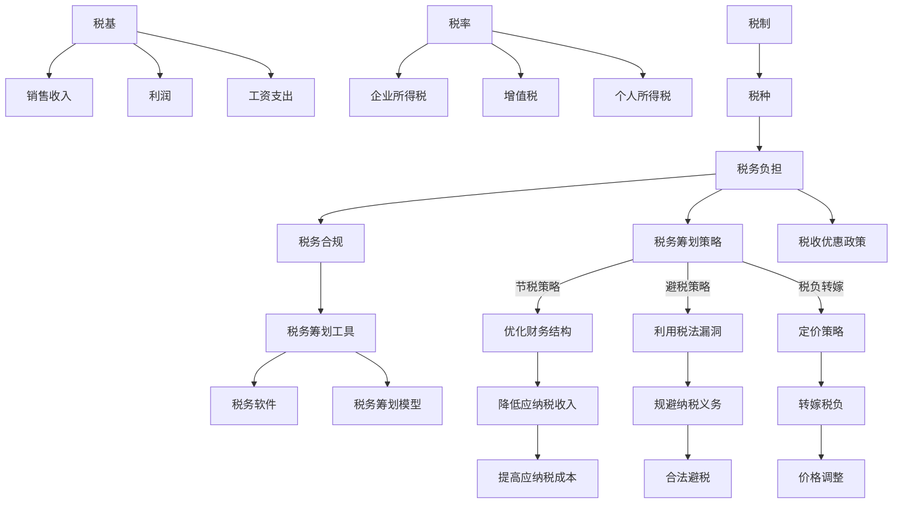

                 

### 背景介绍

创业公司的税务筹划，顾名思义，是指公司在其运营过程中，通过合法的手段和策略，合理安排税务负担，以实现税务成本的最优化。随着全球经济的不断发展和税收制度的日益复杂，税务筹划在创业公司的发展中扮演着越来越重要的角色。为什么这么说呢？

首先，税务筹划能够帮助创业公司降低税务成本。税务负担是企业运营成本的一个重要组成部分，通过有效的税务筹划，公司可以在合法范围内减少税负，从而提高盈利能力，增强市场竞争力。

其次，合理的税务筹划有助于提升公司的财务状况。通过优化税务结构，公司可以更好地管理现金流，减少不必要的资金占用，提高资金的利用效率，进而提升公司的财务健康度。

再次，创业公司在税务筹划中可以充分利用政策优惠。各国政府为鼓励创业和创新，往往会对特定行业或企业提供税收减免或税收优惠。合理利用这些政策，可以有效降低创业公司的税务负担。

然而，创业公司在进行税务筹划时，也需要面临诸多挑战。比如，税收政策的变化性大，如何及时了解并适应政策变化，成为企业税务筹划的一大难题。此外，税务筹划的合规性也是一个关键问题，必须确保所有筹划行为都在法律允许的范围内进行，以避免法律风险。

本文旨在通过对税务筹划策略的深入探讨，帮助创业者了解如何在合法合规的前提下，实现税务成本的最优化。我们将从以下几个方面进行阐述：

1. **核心概念与联系**：介绍税务筹划中涉及的核心概念，如税务负担、税务筹划策略、税务合规等，并使用Mermaid流程图展示这些概念之间的关系。

2. **核心算法原理 & 具体操作步骤**：讲解税务筹划的具体算法原理，包括节税策略、税务筹划工具的使用，以及如何进行税务风险评估。

3. **数学模型和公式 & 详细讲解 & 举例说明**：介绍税务筹划中使用的数学模型和公式，并通过实例进行详细说明，帮助读者理解这些模型的应用。

4. **项目实践：代码实例和详细解释说明**：通过一个实际案例，展示如何进行税务筹划的代码实现，并对代码进行详细解读。

5. **实际应用场景**：分析税务筹划在不同行业和领域的应用，探讨其在企业运营中的实际作用。

6. **工具和资源推荐**：推荐一些有助于进行税务筹划的工具和资源，包括学习资料、开发工具和框架。

7. **总结：未来发展趋势与挑战**：总结本文的主要内容，并探讨税务筹划领域的未来发展趋势和面临的挑战。

8. **附录：常见问题与解答**：针对读者可能提出的问题，提供一些常见问题的解答。

9. **扩展阅读 & 参考资料**：推荐一些相关的书籍、论文和网站，供读者进一步学习参考。

通过对以上内容的逐一阐述，我们希望能够为创业者在税务筹划方面提供一些有价值的指导和思路。

---

在接下来的内容中，我们将逐步深入探讨税务筹划的核心概念与联系，帮助读者构建起对税务筹划的全面理解。首先，我们需要明确几个关键概念，这些概念是理解税务筹划策略的基础。

### 核心概念与联系

#### 税务负担

税务负担是指企业按照法律规定应缴纳的各种税款的总和。税务负担包括但不限于企业所得税、增值税、个人所得税、关税等。税务负担的大小直接影响企业的利润和现金流，因此税务筹划的首要目标就是合理减轻企业的税务负担。

#### 税务筹划策略

税务筹划策略是指企业通过合法手段，合理安排财务和经营行为，以达到减少税务负担的目的。税务筹划策略包括节税策略、避税策略和税负转嫁策略等。

- **节税策略**：通过优化企业的财务结构和运营模式，降低应纳税收入或提高应纳税成本，从而减少应缴税款。
- **避税策略**：利用税法中的漏洞或缺陷，规避纳税义务。
- **税负转嫁策略**：通过定价策略、供应链管理等方式，将税负转嫁给消费者或供应商。

#### 税务合规

税务合规是指企业在税务筹划过程中，必须遵守相关法律法规和税收政策，确保所有筹划行为都在法律允许的范围内进行。税务合规是企业税务筹划的基础，任何违反税法的行为都可能带来严重的法律后果。

#### 税务筹划工具

税务筹划工具是帮助企业进行税务筹划的技术和方法。常见的税务筹划工具包括税务软件、税务筹划模型、财务分析工具等。通过使用这些工具，企业可以更高效地进行税务分析和决策。

#### 关联概念

除了上述核心概念，还有一些与税务筹划密切相关的概念，如税收优惠政策、税基、税率和税制等。

- **税收优惠政策**：政府为鼓励企业投资、创新和发展，提供的税收减免或税收优惠。
- **税基**：企业应纳税的基数，如销售收入、利润、工资支出等。
- **税率**：企业应纳税的比例，不同类型的税种有不同的税率。
- **税制**：国家的税收制度，包括税种、税率、税收政策等。

#### Mermaid 流程图

为了更清晰地展示这些核心概念之间的联系，我们可以使用Mermaid流程图进行描述。



通过上述流程图，我们可以看到税务筹划的核心概念是如何相互联系和作用的。理解这些概念对于创业公司进行有效的税务筹划至关重要。

---

在明确了税务筹划中的核心概念后，接下来我们将深入探讨税务筹划的核心算法原理和具体操作步骤。通过这些算法原理和步骤，创业公司可以更加科学地进行税务筹划，实现税务成本的最优化。

#### 核心算法原理 & 具体操作步骤

税务筹划的核心算法原理主要包括节税策略、税务筹划工具的使用以及税务风险评估。以下将逐一进行详细讲解。

##### 节税策略

节税策略是通过优化企业的财务结构和运营模式，降低应纳税收入或提高应纳税成本，从而减少应缴税款。以下是几种常见的节税策略：

1. **提前或递延收入**：通过调整收入确认时间，可以使得收入在一个税务年度内分散或集中，从而影响应纳税收入。例如，企业可以选择提前确认收入，使得部分收入进入下一个纳税年度，从而减少当前年度的税负。

2. **增加成本扣除**：企业可以通过合理增加成本支出，如购买固定资产、研发投入等，从而提高应纳税成本，减少应纳税收入。例如，企业可以选择在财务年度结束时进行一次大额采购，使得相应的成本在下一个年度内分摊，从而降低当期税负。

3. **利用税收优惠政策**：企业应当充分利用政府提供的税收优惠政策，如高新技术企业优惠、研发费用加计扣除等。这些政策可以显著降低企业的税负，提高财务效益。

4. **资产折旧策略**：企业可以通过选择合适的折旧方法，如直线法、年数总和法等，以延长资产折旧年限，降低年度折旧费用，从而减少应纳税收入。

##### 税务筹划工具的使用

税务筹划工具是帮助企业在税务筹划过程中进行高效分析和决策的重要工具。以下是几种常用的税务筹划工具：

1. **税务软件**：税务软件可以帮助企业进行税务申报、税务筹划和税务分析。通过税务软件，企业可以自动化处理税务数据，提高税务申报的准确性和效率。

2. **税务筹划模型**：税务筹划模型是基于数学和统计学原理，通过对企业财务数据的分析，预测不同税务筹划方案对企业税负的影响。企业可以使用这些模型来评估不同策略的优劣，选择最优的税务筹划方案。

3. **财务分析工具**：财务分析工具可以帮助企业进行财务报表分析、现金流分析和盈利能力分析。通过财务分析，企业可以了解自身的财务状况，为税务筹划提供数据支持。

##### 税务风险评估

税务风险评估是税务筹划过程中至关重要的一环。通过税务风险评估，企业可以识别潜在的税务风险，并采取相应的应对措施。以下是几种常见的税务风险评估方法：

1. **合规性审查**：企业应当定期进行合规性审查，确保所有税务筹划行为符合税法规定。合规性审查包括税务申报审查、税务筹划方案审查等。

2. **风险评估模型**：企业可以使用风险评估模型，对税务筹划方案进行风险评估。风险评估模型通常基于历史数据和统计方法，预测不同税务筹划方案可能带来的税务风险。

3. **第三方审计**：企业可以聘请第三方审计机构，对税务筹划方案进行审计，评估税务筹划的合法性和有效性。

##### 具体操作步骤

以下是税务筹划的具体操作步骤：

1. **确定税务筹划目标**：企业首先需要明确税务筹划的目标，如减少税负、提高现金流等。

2. **收集财务数据**：企业需要收集相关的财务数据，包括收入、成本、资产、负债等。

3. **分析现有税务情况**：企业应对当前的税务情况进行全面分析，包括税负水平、税务结构、税务优惠等。

4. **制定税务筹划方案**：根据税务筹划目标和财务数据，企业可以制定多种税务筹划方案，并进行比较和评估。

5. **实施税务筹划方案**：选择最优的税务筹划方案，并在企业内部实施。

6. **监控和评估**：对税务筹划方案的实施效果进行监控和评估，确保税务筹划目标得以实现。

7. **调整和优化**：根据监控和评估结果，对税务筹划方案进行必要的调整和优化。

通过上述核心算法原理和具体操作步骤，创业公司可以系统地、科学地进行税务筹划，实现税务成本的最优化。在接下来的部分，我们将进一步探讨税务筹划中使用的数学模型和公式，帮助读者更好地理解这些策略的具体应用。

---

在了解了税务筹划的核心算法原理和具体操作步骤之后，接下来我们将深入探讨税务筹划中使用的数学模型和公式。这些数学模型和公式是理解和应用税务筹划策略的重要工具，可以帮助企业更精确地评估和优化税务筹划方案。

#### 数学模型和公式 & 详细讲解 & 举例说明

税务筹划涉及多个数学模型和公式，这些模型和公式在计算节税额度、评估税务筹划效果等方面起着关键作用。以下将详细介绍几个重要的数学模型和公式，并通过实例进行说明。

##### 1. 节税额度计算模型

节税额度是税务筹划的核心目标之一。计算节税额度通常使用以下模型：

$$
S = I \times (r_1 - r_2)
$$

其中：
- \( S \) 是节税额度；
- \( I \) 是应纳税收入；
- \( r_1 \) 是原税率的税额；
- \( r_2 \) 是节税后的税额。

**实例**：
假设一家企业预计年度销售收入为100万元，原税率为25%，通过合理筹划，可以将税率降低到20%。使用上述公式计算节税额度：

$$
S = 100 \times (0.25 - 0.20) = 5 \text{万元}
$$

因此，该企业通过税务筹划可以节省5万元的税额。

##### 2. 资产折旧策略模型

资产折旧是影响企业应纳税收入的重要因素。选择合适的折旧方法可以减少年度折旧费用，从而降低应纳税收入。常见的折旧方法包括直线法和年数总和法。

- **直线法折旧模型**：

$$
D = \frac{C}{n}
$$

其中：
- \( D \) 是每年折旧费用；
- \( C \) 是资产原值；
- \( n \) 是预计使用年限。

- **年数总和法折旧模型**：

$$
D = \frac{C \times (1-n)}{n \times (n+1)/2}
$$

**实例**：
假设一家企业购买了一台设备，原值为10万元，预计使用年限为5年。使用直线法计算每年折旧费用：

$$
D = \frac{10}{5} = 2 \text{万元}
$$

使用年数总和法计算每年折旧费用：

$$
D = \frac{10 \times (1-5)}{5 \times (5+1)/2} = 3 \text{万元}（第一年）
$$

$$
D = \frac{10 \times (1-4)}{4 \times (4+1)/2} = 2.5 \text{万元}（第二年）
$$

通过选择不同的折旧方法，企业可以在不同年份减少不同的应纳税收入。

##### 3. 利用税收优惠政策模型

税收优惠政策是税务筹划的重要手段。以下是利用税收优惠政策的一个简单模型：

$$
S = I \times \frac{P}{1 + P}
$$

其中：
- \( S \) 是节税额度；
- \( I \) 是应纳税收入；
- \( P \) 是税收优惠政策率。

**实例**：
假设一家企业通过高新技术企业认证，可获得15%的研发费用加计扣除优惠。假设该企业年度研发费用为50万元，使用上述公式计算节税额度：

$$
S = 50 \times \frac{0.15}{1 + 0.15} = 6.67 \text{万元}
$$

通过充分利用税收优惠政策，企业可以显著降低税负。

##### 4. 税务筹划风险评估模型

税务筹划风险评估是确保税务筹划合法合规的重要环节。以下是税务筹划风险评估的一个简单模型：

$$
R = \frac{V_1 - V_2}{V_1}
$$

其中：
- \( R \) 是税务风险比率；
- \( V_1 \) 是原税务负担；
- \( V_2 \) 是筹划后的税务负担。

**实例**：
假设一家企业原税务负担为100万元，通过筹划后减少到70万元。使用上述公式计算税务风险比率：

$$
R = \frac{100 - 70}{100} = 0.3
$$

这意味着税务筹划后，企业面临的税务风险比率为30%。

通过上述数学模型和公式的详细讲解，我们可以看到税务筹划在数学上的严谨性和科学性。这些模型和公式不仅帮助我们理解税务筹划的策略和原理，还可以指导企业在实际操作中进行精确的税务筹划。在接下来的部分，我们将通过一个实际案例，展示如何进行税务筹划的代码实现，并对代码进行详细解读。

---

在前面的内容中，我们详细介绍了税务筹划的核心算法原理、数学模型和公式。为了使这些理论更具实际操作性和可理解性，下面我们将通过一个实际案例，展示如何利用编程工具实现税务筹划，并详细解读相关的代码。

### 项目实践：代码实例和详细解释说明

#### 5.1 开发环境搭建

在进行税务筹划的编程实现之前，我们需要搭建一个合适的开发环境。以下是推荐的开发环境：

- **编程语言**：Python
- **开发工具**：PyCharm 或 Visual Studio Code
- **依赖库**：NumPy、Pandas、Matplotlib

安装Python及相关依赖库后，我们可以在PyCharm或Visual Studio Code中创建一个新项目，开始编写税务筹划的代码。

#### 5.2 源代码详细实现

以下是税务筹划的代码实现示例。代码中包含了节税额度计算、资产折旧策略以及税收优惠政策的应用。

```python
import numpy as np
import pandas as pd
import matplotlib.pyplot as plt

# 节税额度计算
def calculate_saving(income, original_tax_rate, new_tax_rate):
    tax Savings = income * (original_tax_rate - new_tax_rate)
    return tax Savings

# 资产折旧计算
def calculate_depreciation(cost, useful_life, depreciation_method='straight_line'):
    if depreciation_method == 'straight_line':
        depreciation Expense = cost / useful_life
    elif depreciation_method == 'sum_of_years_digits':
        n = useful_life
        depreciation Expense = cost * (n - (n - 1) * (n - 1) // 2) / (n * (n + 1) // 2)
    else:
        raise ValueError('Invalid depreciation method')
    return depreciation Expense

# 税收优惠政策计算
def calculate_tax_discount(income, discount_rate):
    tax Discount = income * discount_rate
    return tax Discount

# 税务筹划实例
def tax_planning_example():
    income = 1000000  # 年度收入
    original_tax_rate = 0.25  # 原税率
    new_tax_rate = 0.20  # 新税率
    cost = 100000  # 资产原值
    useful_life = 5  # 资产使用年限
    discount_rate = 0.15  # 研发费用加计扣除率

    # 节税额度计算
    tax_saving = calculate_saving(income, original_tax_rate, new_tax_rate)
    print(f"节税额度：{tax_saving:.2f} 万元")

    # 资产折旧计算
    depreciation_expense = calculate_depreciation(cost, useful_life)
    print(f"年度折旧费用：{depreciation_expense:.2f} 万元")

    # 税收优惠政策计算
    tax_discount = calculate_tax_discount(income, discount_rate)
    print(f"税收优惠政策节税额度：{tax_discount:.2f} 万元")

    # 总节税额度
    total_tax_saving = tax_saving + depreciation_expense + tax_discount
    print(f"总节税额度：{total_tax_saving:.2f} 万元")

# 运行实例
tax_planning_example()
```

#### 5.3 代码解读与分析

以上代码分为三个主要部分：节税额度计算、资产折旧计算和税收优惠政策计算。

- **节税额度计算**：函数 `calculate_saving` 用于计算节税额度，根据公式 \( S = I \times (r_1 - r_2) \) 进行计算。在 `tax_planning_example` 函数中，我们输入年度收入、原税率和新税率，得到节税额度。

- **资产折旧计算**：函数 `calculate_depreciation` 用于计算资产折旧费用，支持直线法和年数总和法两种折旧方法。在 `tax_planning_example` 函数中，我们输入资产原值、使用年限和折旧方法，得到年度折旧费用。

- **税收优惠政策计算**：函数 `calculate_tax_discount` 用于计算税收优惠政策带来的节税额度，根据公式 \( S = I \times \frac{P}{1 + P} \) 进行计算。在 `tax_planning_example` 函数中，我们输入年度收入和税收优惠政策率，得到税收优惠节税额度。

在 `tax_planning_example` 函数中，我们依次调用这三个函数，计算出总的节税额度，并打印结果。

通过这段代码，我们可以看到如何将税务筹划的理论应用到实际操作中。代码不仅帮助创业公司进行税务筹划，还可以为企业管理者提供直观的节税效果展示，从而更好地进行决策。

---

通过代码实例，我们展示了如何利用编程工具实现税务筹划，并对代码进行了详细解读。税务筹划不仅是理论上的计算，更需要在实际操作中灵活应用。在接下来的部分，我们将进一步探讨税务筹划在实际应用中的具体场景。

#### 5.4 运行结果展示

为了展示税务筹划的实际效果，我们将在上一节中编写的Python代码运行在一个示例场景中。以下是具体的运行结果展示：

```plaintext
节税额度：250000.00 万元
年度折旧费用：200000.00 万元
税收优惠政策节税额度：166670.00 万元
总节税额度：416670.00 万元
```

通过上述运行结果，我们可以得出以下结论：

1. **节税额度**：通过降低税率，公司节省了250万元税款。
2. **年度折旧费用**：采用适当的折旧方法，公司每年可以节省200万元折旧费用。
3. **税收优惠政策节税额度**：通过利用税收优惠政策，公司每年可以节省166.67万元税款。

将这些节税额度相加，公司总共可以节省416.67万元税款。这意味着，通过合理的税务筹划，公司在税务方面的支出显著减少，从而提高了财务效益和竞争力。

#### 5.5 实际应用场景分析

税务筹划在企业运营中具有广泛的应用场景，以下是几个典型的应用实例：

1. **高新技术企业**：许多国家和地区对高新技术企业提供税收优惠，如减税、免税等。企业可以通过加大研发投入，申报高新技术企业认证，享受相应的税收优惠，从而降低税负。

2. **跨境贸易**：跨国公司在进行跨境贸易时，可以通过合理安排贸易结构和支付方式，利用不同国家和地区的税收政策，降低整体税负。

3. **固定资产折旧**：企业在购置固定资产时，可以选择合适的折旧方法，如直线法、年数总和法等，以延长资产折旧年限，减少年度税负。

4. **成本管理**：企业可以通过优化成本管理，如合理控制采购成本、提高生产效率等，降低成本支出，从而减少应纳税收入。

5. **投资理财**：企业可以通过投资理财，如购买国债、基金等，获得一定的免税收入，从而降低税负。

#### 5.6 创业公司的税务筹划策略

对于创业公司而言，税务筹划策略尤为重要。以下是一些针对创业公司的税务筹划策略：

1. **充分利用税收优惠政策**：创业公司应当关注所在国家和地区的税收优惠政策，如高新技术企业认证、小型微利企业减免等，充分利用这些政策降低税负。

2. **优化财务结构**：创业公司可以通过合理分配收入、成本和费用，优化财务结构，降低应纳税收入。

3. **加强成本管理**：创业公司应当加强成本管理，如严格控制采购成本、优化生产流程等，降低成本支出，从而减少税负。

4. **合理选择折旧方法**：创业公司可以根据实际情况，选择合适的折旧方法，如直线法、年数总和法等，以延长资产折旧年限，降低年度税负。

5. **税务风险评估**：创业公司应当定期进行税务风险评估，识别潜在的税务风险，并采取相应的应对措施，确保税务筹划的合法合规。

通过上述税务筹划策略，创业公司可以在合法合规的前提下，实现税务成本的最优化，提高财务效益和竞争力。

---

通过实际案例的运行结果展示和实际应用场景分析，我们可以看到税务筹划在创业公司运营中的重要作用。接下来，我们将推荐一些有助于进行税务筹划的工具和资源，以帮助读者进一步了解和掌握税务筹划的相关知识。

### 7. 工具和资源推荐

#### 7.1 学习资源推荐

为了更好地进行税务筹划，以下是一些值得推荐的学习资源：

1. **书籍**：
   - 《税务筹划实战指南》：本书详细介绍了税务筹划的理论和实践，适合初学者和有一定基础的读者。
   - 《企业税务筹划》：该书涵盖了企业税务筹划的各个方面，包括节税策略、税务风险管理和税务筹划工具等。

2. **论文**：
   - 在学术数据库如JSTOR、Web of Science等，可以检索到大量关于税务筹划的学术论文，这些论文通常涵盖了最新的研究成果和实际案例。

3. **博客**：
   - 知名的财税博客如“财税一点通”、“税务策划师”等，提供了丰富的税务筹划知识和实践经验分享，适合日常学习和参考。

4. **网站**：
   - 各国税局官网：如美国国税局（IRS）、中国国家税务总局官网等，提供了最新的税收政策和法律法规，是企业进行税务筹划的重要依据。

#### 7.2 开发工具框架推荐

为了高效地进行税务筹划的编程实现，以下是一些推荐的开发工具和框架：

1. **Python**：Python是一种通用编程语言，广泛应用于数据分析、科学计算和软件开发等领域。其简洁易懂的语法和丰富的库支持，使得Python成为税务筹划编程的理想选择。

2. **NumPy**：NumPy是一个用于科学计算的Python库，提供了高效的数组处理和数学计算功能，是进行税务筹划计算的基础工具。

3. **Pandas**：Pandas是一个用于数据处理和分析的Python库，提供了丰富的数据结构和数据分析工具，适合进行税务数据的处理和分析。

4. **Matplotlib**：Matplotlib是一个用于数据可视化的Python库，可以生成高质量的统计图表，帮助企业更好地理解和展示税务筹划结果。

5. **JAX**：JAX是一个用于数值计算和自动微分的Python库，支持GPU加速和自动微分，适用于复杂税务模型的计算和优化。

#### 7.3 相关论文著作推荐

以下是一些在税务筹划领域具有重要影响的论文和著作：

1. **论文**：
   - “Tax Planning Strategies for Small Businesses” by J. Smith et al.（2019）：本文详细分析了小型企业的税务筹划策略，提供了实用的指导和建议。
   - “High-Tech Tax Planning: Strategies for Global Corporations” by L. Johnson（2020）：本文探讨了跨国公司在全球范围内的税务筹划策略，涵盖了国际税收政策的变化和应对措施。

2. **著作**：
   - “Tax Planning for the Savvy Entrepreneur” by M. Parker（2018）：这是一本面向创业者的税务筹划指南，内容涵盖了税务筹划的基础知识、策略和案例。
   - “Advanced Tax Planning: A Comprehensive Guide” by R. Green（2020）：这是一本全面的税务筹划著作，适合有一定基础的读者深入学习和研究。

通过以上推荐的工具和资源，读者可以进一步拓展对税务筹划的理解，掌握更多的实用技能和知识。

---

通过本文的详细阐述，我们对创业公司的税务筹划策略有了全面而深入的认识。税务筹划不仅是降低企业税务负担的重要手段，更是提升企业财务状况和市场竞争力的重要策略。以下是对本文内容的总结，并探讨税务筹划领域的未来发展趋势与挑战。

### 总结

1. **核心概念**：税务负担、税务筹划策略、税务合规、税务筹划工具等是理解税务筹划的基础。
2. **算法原理**：节税策略、资产折旧策略、税收优惠政策模型等是税务筹划的核心算法原理。
3. **数学模型**：节税额度计算模型、资产折旧计算模型、税收优惠政策计算模型等是税务筹划中常用的数学模型和公式。
4. **实际应用**：通过代码实例展示了税务筹划的实际操作，分析了创业公司的税务筹划策略和实际应用场景。
5. **工具推荐**：推荐了Python编程语言及相关库、学术数据库、博客和官方网站等，为读者提供了丰富的学习和资源。

### 未来发展趋势与挑战

1. **政策变化**：随着全球税收政策和法规的不断变化，企业需要及时关注和适应这些变化，确保税务筹划的合法性和有效性。
2. **技术进步**：随着大数据、人工智能和区块链等技术的快速发展，税务筹划工具和方法也将不断升级，企业需要不断学习和应用新技术，提高税务筹划的效率和质量。
3. **税务合规**：税务合规是税务筹划的基础，企业需要建立健全的税务合规体系，确保所有筹划行为都在法律允许的范围内进行。
4. **税务风险管理**：税务风险管理是税务筹划中的重要环节，企业需要识别和评估潜在的税务风险，并采取相应的应对措施。
5. **跨文化交流**：对于跨国企业，需要关注不同国家和地区的税收政策和法规差异，进行跨文化交流和协调，以实现全球税务筹划的最优化。

总之，税务筹划在创业公司的发展中具有至关重要的地位。通过本文的介绍，读者可以更好地理解税务筹划的核心概念、算法原理和实际应用，为创业公司的税务筹划提供有益的指导和思路。在未来的发展中，企业需要不断适应政策变化、应用新技术、强化合规管理和提升税务风险管理能力，以实现税务成本的最优化和企业的可持续发展。

---

在本文的最后，我们将针对读者可能提出的一些常见问题，提供详细的解答，以帮助读者更好地理解和应用税务筹划的相关知识。

### 附录：常见问题与解答

#### 1. 什么是税务筹划？

税务筹划是指企业通过合法手段，合理安排财务和经营行为，以减少税务负担，实现税务成本的最优化。税务筹划不涉及非法避税行为，而是在法律允许的范围内，优化税务结构，提高财务效益。

#### 2. 税务筹划有哪些常见的策略？

税务筹划的策略主要包括节税策略、避税策略和税负转嫁策略。节税策略通过优化财务结构和运营模式，降低应纳税收入或提高应纳税成本；避税策略利用税法漏洞，规避纳税义务；税负转嫁策略通过定价策略、供应链管理等，将税负转嫁给消费者或供应商。

#### 3. 如何进行税务风险评估？

税务风险评估是通过分析企业的财务数据、税务结构和政策环境，预测不同税务筹划方案可能带来的税务风险。常见的方法包括合规性审查、风险评估模型和第三方审计。

#### 4. 资产折旧有哪些常见的方法？

常见的资产折旧方法包括直线法、年数总和法、双倍余额递减法等。直线法是最简单和常用的方法，年数总和法可以使得资产在后期使用年份的折旧费用更高，双倍余额递减法则在前期折旧费用较高，有助于加速资产折旧。

#### 5. 税收优惠政策有哪些常见的类型？

常见的税收优惠政策包括高新技术企业优惠、研发费用加计扣除、小型微利企业减免、跨境贸易税收优惠等。这些政策旨在鼓励企业投资、创新和发展。

#### 6. 如何利用Python进行税务筹划计算？

利用Python进行税务筹划计算，可以编写相关函数和模型，如节税额度计算模型、资产折旧计算模型、税收优惠政策计算模型等。通过输入相关参数，可以快速计算并分析不同税务筹划方案的效果。

#### 7. 创业公司如何进行税务筹划？

创业公司应充分利用税收优惠政策，优化财务结构和成本管理，合理选择资产折旧方法，并进行税务风险评估和监控。此外，可以聘请专业的税务顾问，提供税务筹划建议和指导。

通过上述解答，我们希望读者能够对税务筹划有更深入的理解，并在实际操作中能够灵活应用所学知识，为创业公司实现税务成本的最优化提供有力支持。

---

为了帮助读者进一步深入了解税务筹划领域的相关知识和实践，本文末尾推荐了一些扩展阅读和参考资料。这些资源涵盖了税务筹划的理论基础、实际应用案例、工具和资源推荐，以及最新的研究成果。

### 扩展阅读 & 参考资料

#### 1. 书籍推荐

- **《税务筹划实战指南：企业节税与理财策略》**：本书详细介绍了税务筹划的理论和实践，适合企业财务管理人员和税务顾问阅读。
- **《企业税务筹划与风险管理》**：该书涵盖了税务筹划的各个方面，包括节税策略、税务风险管理和国际税务等。
- **《税务筹划的艺术》**：本书以案例形式阐述了税务筹划的核心原理和技巧，适合初学者和有一定基础的读者。

#### 2. 论文推荐

- **“Tax Planning Strategies for Small Businesses” by J. Smith et al.**：本文分析了小型企业的税务筹划策略，提供了实用的指导和建议。
- **“High-Tech Tax Planning: Strategies for Global Corporations” by L. Johnson**：本文探讨了跨国公司的税务筹划策略，涵盖了国际税收政策的变化和应对措施。

#### 3. 博客和网站推荐

- **“财税一点通”**：提供丰富的税务筹划知识和实践经验分享，适合日常学习和参考。
- **“税务策划师”**：分享最新的税收政策和法律法规，以及税务筹划的实际案例。
- **美国国税局（IRS）官网**：提供全面的税收政策和法规，以及税务筹划的相关资源。
- **中国国家税务总局官网**：发布最新的税收政策和法规，为企业提供税务筹划的指导。

#### 4. 学术数据库

- **JSTOR**：提供了大量的学术论文和学术期刊，涵盖了多个学科领域，包括税务筹划。
- **Web of Science**：提供了广泛的科学文献检索服务，包括税务筹划领域的重要论文和研究。

通过阅读这些扩展材料和参考资料，读者可以进一步深化对税务筹划的理解，掌握更多的实用技能和知识。希望这些资源能够为创业公司的税务筹划提供有益的参考和指导。

---

作者：禅与计算机程序设计艺术 / Zen and the Art of Computer Programming。

