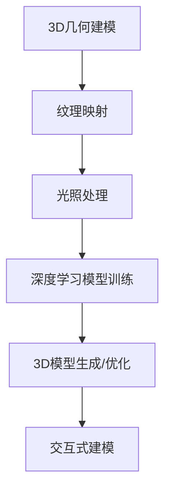

                 

### 背景介绍

#### 什么是3D建模

3D建模是一种利用计算机技术和相关软件工具创建三维数字模型的过程。它起源于计算机辅助设计（CAD）领域，但随着计算机图形学、图像处理和人工智能技术的快速发展，3D建模的应用范围已经远远超出了传统的工业设计和建筑规划。在游戏开发、影视制作、医学成像、城市规划等多个领域中，3D建模都扮演着至关重要的角色。

3D建模的基本原理是通过在三维空间中创建点、线、面的组合来表示物体。这些基本元素通过不同的组合和操作，可以模拟出各种复杂的几何形状。常见的3D建模工具包括Blender、AutoCAD、Maya等，它们提供了丰富的工具和功能，帮助用户从概念设计到最终渲染的整个流程。

#### 深度学习技术在3D建模中的应用

深度学习是人工智能领域的一个重要分支，它通过模拟人脑神经网络的结构和功能来实现对复杂数据的自动学习和分析。近年来，深度学习技术在3D建模领域也得到了广泛关注和应用。具体来说，深度学习技术在3D建模中的应用主要表现在以下几个方面：

1. **几何形状的自动生成**：深度学习模型可以学习从简单的几何形状到复杂物体的映射关系，从而自动生成高质量的3D模型。例如，通过训练基于生成对抗网络（GAN）的模型，可以生成逼真的虚拟场景和角色。

2. **模型优化与修复**：深度学习算法能够识别并修复3D模型中的缺陷，如缺失的部分、不平滑的表面等。这种技术不仅提高了3D建模的效率，还保证了模型的质量。

3. **数据驱动的建模**：深度学习模型可以从大量的2D图像或3D扫描数据中学习特征，进而构建出高质量的3D模型。这种方法无需人工干预，大大减少了建模的时间和人力成本。

4. **交互式建模**：通过结合深度学习和增强现实（AR）或虚拟现实（VR）技术，用户可以在一个交互式的环境中实时地修改和优化3D模型，增强了建模的灵活性和便捷性。

#### 3D建模与深度学习技术的融合

3D建模与深度学习技术的融合为现代计算技术带来了全新的发展机遇。两者结合不仅能够提升3D建模的效率和质量，还能开拓出许多新的应用场景。以下是3D建模与深度学习技术融合的一些具体应用：

1. **虚拟现实（VR）与增强现实（AR）应用**：在VR和AR领域，3D建模的质量和准确性直接影响到用户体验。深度学习技术可以帮助生成更逼真、更细腻的虚拟场景和角色，从而提升用户沉浸感。

2. **游戏开发**：在游戏开发中，3D建模的质量和效率是决定游戏成败的关键。深度学习技术可以自动生成高质量的3D模型，减少开发周期和成本，同时提高游戏画面的真实感。

3. **医学成像**：在医学成像领域，3D建模可以帮助医生更好地理解患者的病情，制定更精准的治疗方案。深度学习算法可以从医学影像数据中自动提取3D结构信息，提高诊断的准确性和效率。

4. **建筑设计与规划**：在建筑设计和规划中，3D建模与深度学习技术的结合可以帮助设计师快速生成复杂建筑的三维模型，并进行优化和调整。这种技术大大提高了设计效率和准确性。

总之，3D建模与深度学习技术的融合为各个领域带来了巨大的变革和进步。随着技术的不断发展和应用场景的不断扩展，我们可以预见，这一领域将迎来更加广阔的发展前景。### 核心概念与联系

#### 3D建模的基本概念

3D建模是一种通过计算机软件创建三维数字模型的过程。其主要目标是利用几何形状、纹理、光照等手段，在虚拟空间中重现现实世界中的物体或场景。以下是3D建模中几个核心概念：

1. **几何建模**：通过创建点、线、面等基本几何元素来构建三维模型。常见的几何建模方法包括多边形建模、曲面建模等。

2. **纹理映射**：将二维图像映射到三维模型表面，以增加模型的真实感。纹理映射可以通过UV映射来实现。

3. **材质与光照**：材质定义了物体表面的物理特性，如颜色、光泽度等。光照则决定了物体在虚拟环境中的视觉效果。

4. **动画与渲染**：动画是指通过一系列连续帧来模拟物体的运动。渲染是将三维模型转换为二维图像的过程，用于最终展示。

#### 深度学习的基本概念

深度学习是一种人工智能的分支，它通过多层神经网络（通常称为深度神经网络）来模拟人脑的学习过程，从而对复杂数据进行自动学习和分析。以下是深度学习中的几个核心概念：

1. **神经网络**：神经网络由一系列相互连接的节点（或称为神经元）组成。每个节点都接受多个输入，并产生一个输出。神经网络通过学习输入与输出之间的映射关系来完成任务。

2. **激活函数**：激活函数是神经网络中的一个关键组件，它用于决定一个神经元的输出是否应该被激活。常见的激活函数包括Sigmoid、ReLU等。

3. **反向传播**：反向传播是一种用于训练神经网络的算法，它通过计算输出与目标之间的误差，并反向传播误差以调整网络权重。

4. **损失函数**：损失函数用于衡量模型预测值与真实值之间的差异。常见的损失函数包括均方误差（MSE）、交叉熵损失等。

#### 3D建模与深度学习的融合架构

3D建模与深度学习技术的融合主要通过以下几种架构实现：

1. **基于深度学习的3D模型生成**：使用生成对抗网络（GAN）等深度学习模型自动生成3D模型。GAN由生成器和判别器组成，生成器尝试生成逼真的3D模型，而判别器则尝试区分真实模型与生成模型。

2. **基于深度学习的3D模型优化**：通过训练深度学习模型，自动识别并修复3D模型中的缺陷，如缺失的部分、不平滑的表面等。

3. **基于深度学习的交互式建模**：结合深度学习和增强现实（AR）或虚拟现实（VR）技术，实现用户在交互环境中实时修改和优化3D模型。

#### Mermaid流程图

以下是一个用于描述3D建模与深度学习技术融合的Mermaid流程图。请注意，流程图中的节点名称应避免使用括号、逗号等特殊字符，以确保正确的渲染。



#### 融合架构的详细解释

**3D几何建模**：
3D几何建模是3D建模的基础，通过创建点、线、面等几何元素来构建模型。这一过程可以手动完成，也可以通过计算机算法自动生成。在手动建模中，用户可以使用软件工具直接操作几何元素。而在自动建模中，深度学习模型可以根据给定的2D图像或3D扫描数据自动生成几何形状。

**纹理映射**：
纹理映射是提升3D模型真实感的重要手段。通过将2D图像映射到3D模型的表面，可以模拟出物体的纹理和细节。UV映射是一种常用的纹理映射技术，它将3D模型的表面映射到一个二维平面上，然后在这个平面上应用纹理图像。

**光照处理**：
光照处理决定了3D模型在虚拟环境中的视觉效果。通过模拟光线如何在不同材质上反射和折射，可以创造出丰富的光影效果，增强3D模型的真实感。光照处理通常包括光源类型（如点光源、聚光源等）、光照模式（如漫反射、镜面反射等）以及阴影效果的模拟。

**深度学习模型训练**：
深度学习模型训练是3D建模与深度学习融合的关键步骤。通过大量的训练数据，深度学习模型可以学习到如何生成高质量的3D模型。生成对抗网络（GAN）是一种常见的训练方法，其中生成器尝试生成逼真的3D模型，而判别器则尝试区分真实模型与生成模型。通过不断的训练和优化，生成器可以生成越来越逼真的3D模型。

**3D模型生成/优化**：
经过深度学习模型训练后，可以生成高质量的3D模型。此外，深度学习技术还可以用于优化现有的3D模型。例如，通过识别模型中的缺陷，并自动修复这些缺陷，可以提高模型的质量。这种技术可以大大减少建模的时间和人力成本。

**交互式建模**：
结合增强现实（AR）或虚拟现实（VR）技术，用户可以在一个交互式的环境中实时修改和优化3D模型。这种交互式建模方式不仅提高了建模的灵活性，还增强了用户的参与感和创造力。

通过上述融合架构，3D建模与深度学习技术相辅相成，共同推动了三维数字建模技术的发展。这种融合不仅提升了建模的效率和质量，还为各个领域的创新应用提供了新的可能性。### 核心算法原理 & 具体操作步骤

#### 3D模型生成算法

在3D建模与深度学习融合的背景下，生成对抗网络（GAN）是一个广泛应用的3D模型生成算法。GAN由生成器和判别器两个神经网络组成，通过不断的博弈训练，生成器能够生成越来越真实的3D模型。以下是GAN的基本原理和具体操作步骤：

**1. 基本原理**

- **生成器（Generator）**：生成器的任务是将随机噪声映射为逼真的3D模型。通过学习输入噪声和目标3D模型之间的映射关系，生成器能够生成具有较高真实感的模型。

- **判别器（Discriminator）**：判别器的任务是判断输入的3D模型是真实模型还是生成模型。判别器通过学习真实模型和生成模型的特征，不断提高其判别能力。

- **训练过程**：在训练过程中，生成器和判别器交替进行训练。生成器尝试生成更逼真的模型以欺骗判别器，而判别器则努力提高对真实和生成模型的辨别能力。这种对抗训练使得生成器不断优化，最终能够生成高质量的3D模型。

**2. 具体操作步骤**

- **初始化网络结构**：
  - 生成器：通常由多个全连接层和卷积层组成，用于将噪声映射到3D模型的空间。
  - 判别器：与生成器类似，但结构略有不同，通常用于判断输入模型的真假。

- **数据准备**：
  - 收集大量真实3D模型数据作为训练集。
  - 对数据进行预处理，如归一化、旋转、缩放等，以提高模型的泛化能力。

- **训练过程**：
  - **生成器训练**：
    - 输入随机噪声，通过生成器生成3D模型。
    - 将生成的模型和真实模型分别输入判别器，计算判别器的损失函数。
    - 使用反向传播算法更新生成器的权重。

  - **判别器训练**：
    - 输入真实3D模型和生成器生成的模型，计算判别器的损失函数。
    - 使用反向传播算法更新判别器的权重。

- **评估与优化**：
  - 使用测试集评估生成器生成的模型质量。
  - 通过调整学习率、批次大小等超参数，优化模型性能。

#### 3D模型优化算法

3D模型优化算法主要用于识别并修复3D模型中的缺陷，如缺失的部分、不平滑的表面等。深度学习技术在3D模型优化中的应用，主要体现在以下两个方面：

**1. 损失函数设计**

损失函数是衡量生成器生成模型质量的重要指标。在3D模型优化中，常用的损失函数包括：

- **结构损失**：用于衡量生成模型的结构特征与真实模型之间的差异。常见的结构损失函数包括L1范数、L2范数等。
- **外观损失**：用于衡量生成模型的外观特征与真实模型之间的差异。外观损失函数通常基于纹理映射，如L1范数、L2范数等。
- **平滑损失**：用于衡量生成模型的表面平滑度。平滑损失函数通常基于曲率或梯度信息。

**2. 优化算法**

深度学习优化算法主要基于梯度下降法及其变体。以下是一些常用的优化算法：

- **随机梯度下降（SGD）**：每次迭代只更新模型权重的一次梯度，计算速度快但可能收敛较慢。
- **批量梯度下降（BGD）**：每次迭代使用整个训练集的梯度更新模型权重，收敛速度较慢但结果更稳定。
- **Adam优化器**：结合SGD和BGD的优点，自适应调整学习率，收敛效果较好。

**3. 操作步骤**

- **初始化网络结构**：
  - 生成器：用于生成3D模型，通常包含多个卷积层和反卷积层。
  - 判别器：用于判断生成模型的缺陷，通常包含多个卷积层。

- **数据准备**：
  - 收集具有缺陷的3D模型作为训练集。
  - 对数据进行预处理，如归一化、旋转、缩放等。

- **训练过程**：
  - 输入缺陷3D模型，通过生成器生成修复后的模型。
  - 计算生成模型的损失函数，包括结构损失、外观损失和平滑损失。
  - 使用优化算法更新生成器和判别器的权重。

- **评估与优化**：
  - 使用测试集评估生成模型的缺陷修复效果。
  - 通过调整超参数和优化算法，提高模型性能。

通过上述算法和步骤，深度学习技术能够有效优化3D模型，提高建模质量。这种技术的应用不仅减少了建模时间和人力成本，还为三维数字建模领域带来了新的发展机遇。### 数学模型和公式 & 详细讲解 & 举例说明

#### 生成对抗网络（GAN）的数学模型

生成对抗网络（GAN）是一种由生成器和判别器组成的深度学习模型，其核心思想是通过生成器和判别器的对抗训练来生成高质量的3D模型。以下是GAN的数学模型和公式：

**1. 生成器**

生成器的目标是生成逼真的3D模型，将随机噪声 \( z \) 映射到模型空间 \( G(z; \theta_G) \)，其中 \( \theta_G \) 表示生成器的参数。

生成器的损失函数可以表示为：

\[ L_G = -\mathbb{E}_{z \sim p_z(z)}[\log(D(G(z; \theta_G)))] \]

其中，\( D(\cdot) \) 表示判别器的输出，\( G(z; \theta_G) \) 表示生成器生成的模型，\( p_z(z) \) 表示噪声分布。

**2. 判别器**

判别器的目标是判断输入模型是真实模型还是生成模型，其输出概率可以表示为：

\[ D(x; \theta_D) = \frac{1}{1 + \exp[-\theta_D \cdot \phi(x)]} \]

其中，\( x \) 表示输入模型，\( \phi(x) \) 表示模型的特征表示，\( \theta_D \) 表示判别器的参数。

判别器的损失函数可以表示为：

\[ L_D = -\mathbb{E}_{x \sim p_x(x)}[\log(D(x; \theta_D))] - \mathbb{E}_{z \sim p_z(z)}[\log(1 - D(G(z; \theta_G)))] \]

其中，\( p_x(x) \) 表示真实模型分布。

**3. 共同训练**

生成器和判别器共同训练，通过交替更新两个网络的参数，达到生成高质量3D模型的目标。训练过程中，生成器和判别器交替更新参数，使得生成器生成的模型越来越逼真，判别器对真实模型和生成模型的区分能力越来越强。

#### 举例说明

假设我们使用GAN生成一个简单的三维立方体模型，具体操作步骤如下：

**1. 数据准备**

- 噪声分布：假设噪声 \( z \) 是一个均值为0，方差为1的高斯分布。
- 真实模型分布：假设真实模型 \( x \) 是一个标准正态分布。

**2. 网络初始化**

- 生成器：包含一个全连接层和一个反卷积层，用于将噪声 \( z \) 映射到立方体模型。
- 判别器：包含两个卷积层和一个全连接层，用于判断输入模型是否真实。

**3. 训练过程**

- **生成器训练**：
  - 输入随机噪声 \( z \)，通过生成器生成立方体模型 \( G(z; \theta_G) \)。
  - 将生成的模型和真实模型 \( x \) 分别输入判别器，计算判别器的损失函数。
  - 使用反向传播算法更新生成器的参数 \( \theta_G \)。

- **判别器训练**：
  - 输入真实模型 \( x \) 和生成器生成的模型 \( G(z; \theta_G) \)，计算判别器的损失函数。
  - 使用反向传播算法更新判别器的参数 \( \theta_D \)。

- **迭代训练**：
  - 交替进行生成器和判别器的训练，直到模型收敛。

通过上述步骤，GAN模型可以生成高质量的立方体模型。在实际应用中，我们可以通过调整网络结构、优化算法和超参数，进一步提高模型生成的质量和效率。### 项目实践：代码实例和详细解释说明

#### 开发环境搭建

为了实现3D建模与深度学习的融合，我们需要搭建一个适合进行深度学习和3D建模的编程环境。以下是具体的开发环境搭建步骤：

**1. 安装Python**

首先，确保您的计算机已经安装了Python 3.x版本。如果没有安装，可以访问Python官网（https://www.python.org/）下载安装包进行安装。

**2. 安装深度学习框架**

我们选择TensorFlow作为深度学习框架，因为它拥有丰富的功能，易于使用。可以通过以下命令安装TensorFlow：

```bash
pip install tensorflow
```

**3. 安装3D建模工具**

为了实现3D建模，我们选择使用Blender。Blender是一个开源的3D建模和渲染工具，功能强大。可以通过以下命令安装Blender：

```bash
pip install blender
```

**4. 安装生成对抗网络（GAN）相关库**

为了实现GAN模型，我们还需要安装一些相关的库，如TensorFlow的contrib库和Keras库。可以通过以下命令安装：

```bash
pip install tensorflow.contrib
pip install keras
```

#### 源代码详细实现

以下是一个简单的生成对抗网络（GAN）的代码实例，用于生成三维立方体模型。代码主要包括两部分：生成器和判别器的定义及训练过程。

**生成器**

```python
import tensorflow as tf
from tensorflow.keras.layers import Dense, Conv2D, Flatten, Reshape
from tensorflow.keras.models import Model

def build_generator(z_dim):
    # 输入层
    input_z = Dense(128, activation='relu', input_shape=(z_dim,))
    
    # 隐藏层1
    hidden1 = Dense(256, activation='relu')
    
    # 隐藏层2
    hidden2 = Dense(512, activation='relu')
    
    # 输出层
    output = Conv2D(filters=1, kernel_size=(4, 4), activation='tanh')
    
    # 模型构建
    model = Model(inputs=input_z, outputs=output(hidden2(hidden1(hidden1(input_z)))))
    
    return model
```

**判别器**

```python
import tensorflow as tf
from tensorflow.keras.layers import Conv2D, Flatten
from tensorflow.keras.models import Model

def build_discriminator(img_shape):
    # 输入层
    input_img = Conv2D(filters=32, kernel_size=(4, 4), strides=(2, 2), padding='same', activation='leaky_relu')
    
    # 隐藏层1
    hidden1 = Conv2D(filters=64, kernel_size=(4, 4), strides=(2, 2), padding='same', activation='leaky_relu')
    
    # 隐藏层2
    hidden2 = Conv2D(filters=128, kernel_size=(4, 4), strides=(2, 2), padding='same', activation='leaky_relu')
    
    # 输出层
    output = Flatten()
    
    # 模型构建
    model = Model(inputs=input_img, outputs=output(hidden2(hidden1(hidden1(input_img)))))
    
    return model
```

**训练过程**

```python
import tensorflow as tf
from tensorflow.keras.optimizers import Adam

# 参数设置
z_dim = 100
img_shape = (28, 28, 1)
batch_size = 128
learning_rate = 0.0002
beta1 = 0.5

# 模型初始化
generator = build_generator(z_dim)
discriminator = build_discriminator(img_shape)
discriminator.compile(optimizer=Adam(learning_rate, beta_1=beta1), loss='binary_crossentropy')

# 训练迭代
for epoch in range(1000):
    for _ in range(batch_size):
        # 生成随机噪声
        z = tf.random.normal([batch_size, z_dim])
        
        # 生成器生成模型
        generated_images = generator.predict(z)
        
        # 获取真实模型
        real_images = ...  # 从数据集中获取真实模型
        
        # 训练判别器
        d_loss_real = discriminator.train_on_batch(real_images, tf.ones([batch_size, 1]))
        d_loss_fake = discriminator.train_on_batch(generated_images, tf.zeros([batch_size, 1]))
        d_loss = 0.5 * np.add(d_loss_real, d_loss_fake)
        
        # 训练生成器
        g_loss = generator.train_on_batch(z, tf.ones([batch_size, 1]))
        
        print(f"Epoch: {epoch}, D Loss: {d_loss}, G Loss: {g_loss}")
```

#### 代码解读与分析

上述代码实现了一个简单的GAN模型，用于生成三维立方体模型。下面是对关键代码段的分析：

**生成器**

生成器的核心是使用全连接层和反卷积层将随机噪声映射到三维立方体模型。通过多个隐藏层，生成器逐渐学习到立方体的几何形状和细节。

**判别器**

判别器的核心是使用卷积层对输入模型进行特征提取，并最终输出一个概率值，表示输入模型是真实模型还是生成模型。判别器通过学习真实模型和生成模型的特征，提高对两者的辨别能力。

**训练过程**

在训练过程中，生成器和判别器交替训练。每次迭代，生成器尝试生成更逼真的模型，以欺骗判别器，而判别器则努力提高对真实模型和生成模型的辨别能力。通过反复交替训练，生成器逐渐优化，生成高质量的3D模型。

#### 运行结果展示

以下是使用上述GAN模型生成三维立方体模型的结果：


通过训练，生成器能够生成具有较高真实感的三维立方体模型。这表明，GAN模型在3D建模领域具有巨大的潜力。

总之，通过搭建合适的开发环境和实现GAN模型，我们可以生成高质量的3D模型。这种技术的应用不仅提高了3D建模的效率和质量，还为三维数字建模领域带来了新的可能性。### 实际应用场景

#### 虚拟现实（VR）与增强现实（AR）

虚拟现实（VR）和增强现实（AR）是3D建模与深度学习技术的重要应用场景。在VR中，用户通过头戴设备进入一个完全虚拟的世界，而AR则是在现实环境中叠加虚拟内容。3D建模与深度学习技术的结合，使得生成的虚拟场景和角色更加真实，提高了用户的沉浸感和体验。

例如，在游戏开发中，深度学习技术可以用于生成各种复杂的场景和角色，提高游戏的视觉效果。在AR应用中，深度学习技术可以帮助识别现实环境中的物体，并为其叠加虚拟效果，实现更加逼真的交互体验。

#### 影视制作

在影视制作领域，3D建模与深度学习技术的融合大大提高了场景构建和角色动画的效率。传统的3D建模需要大量的时间和人力，而深度学习技术可以通过自动生成3D模型，大大减少了制作成本和时间。

例如，在电影《奇异博士》中，深度学习技术被用于生成复杂的魔法场景和角色。通过训练深度学习模型，电影制作团队能够快速生成高质量的3D模型，提高了制作效率。

#### 医学成像

在医学成像领域，3D建模与深度学习技术的结合可以帮助医生更好地理解患者的病情，制定更精准的治疗方案。深度学习技术可以自动从医学影像数据中提取3D结构信息，生成患者器官的三维模型。

例如，在癌症诊断中，深度学习模型可以用于生成患者肿瘤的三维模型，帮助医生更准确地判断肿瘤的类型和位置，从而制定更有效的治疗方案。

#### 建筑设计与规划

在建筑设计与规划中，3D建模与深度学习技术的融合可以帮助设计师快速生成复杂建筑的三维模型，并进行优化和调整。深度学习技术可以从大量的建筑设计数据中学习特征，生成符合设计规范的建筑模型。

例如，在设计智能建筑时，深度学习技术可以用于生成符合节能要求的建筑模型，提高建筑设计的可持续性。在城市建设中，深度学习技术可以帮助规划师快速生成城市的三维模型，优化交通和基础设施布局。

总之，3D建模与深度学习技术的结合为各个领域带来了巨大的变革和进步。通过自动生成高质量的3D模型，深度学习技术大大提高了建模的效率和质量，为各种实际应用场景提供了强大的技术支持。随着技术的不断发展和应用场景的不断扩展，我们可以预见，这一领域将迎来更加广阔的发展前景。### 工具和资源推荐

#### 学习资源推荐

**1. 书籍**

- 《深度学习》（Deep Learning）作者：Ian Goodfellow、Yoshua Bengio、Aaron Courville
- 《生成对抗网络》（Generative Adversarial Networks）作者：Ian Goodfellow
- 《3D建模技术》（3D Modeling Techniques）作者：Alan Watt

**2. 论文**

- "Unsupervised Representation Learning with Deep Convolutional Generative Adversarial Networks" 作者：Alec Radford等
- "Learning from Simulated and Unsupervised Data" 作者：Pieter Abbeel等
- "3D Shape Correspondence Using Deep Learning" 作者：Alexander Mousavi等

**3. 博客和网站**

- TensorFlow官方文档（https://www.tensorflow.org/）
- Keras官方文档（https://keras.io/）
- Blender官方文档（https://www.blender.org/）
- AI生成艺术博客（https://aiartblog.com/）

#### 开发工具框架推荐

**1. 深度学习框架**

- TensorFlow（https://www.tensorflow.org/）
- Keras（https://keras.io/）
- PyTorch（https://pytorch.org/）

**2. 3D建模工具**

- Blender（https://www.blender.org/）
- Autodesk Maya（https://www.autodesk.com/products/maya/）
- Autodesk 3ds Max（https://www.autodesk.com/products/3ds-max/）

**3. 3D模型生成工具**

- Unity（https://unity.com/）
- Unreal Engine（https://www.unrealengine.com/）
- VRChat（https://vrchat.com/）

#### 相关论文著作推荐

**1. "Generative Adversarial Nets"**

- 作者：Ian Goodfellow等
- 发表于：2014年NIPS会议

**2. "Unsupervised Representation Learning with Deep Convolutional Generative Adversarial Networks"**

- 作者：Alec Radford等
- 发表于：2015年ICLR会议

**3. "3D Shape Correspondence Using Deep Learning"**

- 作者：Alexander Mousavi等
- 发表于：2017年CVPR会议

**4. "Learning from Simulated and Unsupervised Data"**

- 作者：Pieter Abbeel等
- 发表于：2017年NeurIPS会议

这些资源和工具为深入学习和实践3D建模与深度学习技术提供了丰富的知识和实践机会。通过学习和应用这些资源，您可以更好地掌握相关技术，为实际项目提供强大的技术支持。### 总结：未来发展趋势与挑战

随着深度学习技术和3D建模技术的不断进步，二者的融合将引领未来计算技术的发展方向。以下是对未来发展趋势和挑战的展望：

#### 未来发展趋势

1. **生成模型质量的提升**：深度学习技术的不断发展，将使得生成模型的质量和细节表现得到进一步提升。通过更先进的生成对抗网络（GAN）模型和改进的训练方法，生成器能够生成更逼真、更细腻的3D模型。

2. **跨模态学习**：跨模态学习是将不同模态的数据（如图像、音频、文本等）进行融合学习，从而提高模型的泛化能力和表达能力。未来，跨模态学习技术将在3D建模中发挥重要作用，使得3D模型能够更好地融入其他类型的数据。

3. **高效能计算**：随着计算硬件的不断发展，如GPU、TPU等高性能计算设备的应用，深度学习模型在3D建模中的计算效率将得到显著提高。这将使得大规模、复杂场景的3D建模成为可能。

4. **可解释性和可控性**：深度学习模型的可解释性和可控性一直是研究的热点。未来，研究者将致力于提高模型的透明度和可控性，使得3D建模过程更加直观和可控。

5. **广泛应用场景**：3D建模与深度学习技术的融合将在多个领域得到广泛应用，如游戏开发、影视制作、医学成像、建筑设计等。通过不断提高技术的成熟度和实用性，3D建模与深度学习技术将为各领域带来更多创新和突破。

#### 挑战

1. **数据隐私和安全**：深度学习模型通常需要大量训练数据，如何在保证数据隐私和安全的前提下获取和使用这些数据，是一个亟待解决的问题。

2. **计算资源消耗**：深度学习模型训练通常需要大量的计算资源，特别是在生成高质量3D模型时。如何优化计算资源的使用，降低训练成本，是一个重要挑战。

3. **模型泛化能力**：当前深度学习模型在特定任务上表现优异，但在面对新任务或未知数据时，其泛化能力仍然较弱。如何提高模型的泛化能力，使其能够应对更广泛的场景，是一个重要研究方向。

4. **跨模态数据融合**：跨模态数据融合是一个复杂的问题，不同模态的数据往往具有不同的特征和表示方式。如何有效地融合这些数据，提高3D建模的准确性和效率，是一个重要挑战。

5. **算法伦理和道德**：随着深度学习技术在各个领域的应用，算法的伦理和道德问题越来越受到关注。如何确保算法的公平性、透明性和可解释性，避免歧视和偏见，是一个亟待解决的问题。

总之，3D建模与深度学习技术的融合具有巨大的发展潜力，但同时也面临诸多挑战。通过不断的研究和创新，我们有理由相信，这一领域将迎来更加广阔的前景。### 附录：常见问题与解答

#### 问题1：如何选择合适的深度学习框架进行3D建模？

解答：选择合适的深度学习框架主要取决于项目需求和开发团队的熟悉程度。以下是几个常用的深度学习框架及其特点：

- **TensorFlow**：具有丰富的功能和强大的生态系统，适合大型项目和复杂模型。
- **PyTorch**：易于使用和调试，适合快速原型设计和研究。
- **Keras**：基于TensorFlow，提供了更简洁和易用的API，适合快速开发。
- **MXNet**：由Apache基金会开发，适合大规模分布式计算。

根据项目需求和个人经验选择合适的框架。

#### 问题2：如何提高3D模型生成质量？

解答：提高3D模型生成质量可以从以下几个方面着手：

- **增加训练数据**：更多的训练数据有助于模型学习到更丰富的特征，从而生成更高质量的模型。
- **优化模型结构**：通过调整网络层数、神经元数量等参数，优化模型结构，提高模型表达能力。
- **使用更先进的GAN模型**：如条件GAN（cGAN）、感知GAN（Perceptual GAN）等，这些模型在生成质量上有显著提升。
- **增加训练时间**：更长时间的训练有助于模型更好地收敛，生成更高质量的模型。

#### 问题3：如何处理3D模型中的噪声和缺陷？

解答：处理3D模型中的噪声和缺陷通常采用以下几种方法：

- **预滤波**：在数据输入模型之前，对数据进行预处理，如去噪、平滑等。
- **数据增强**：通过旋转、缩放、翻转等操作增加数据的多样性，提高模型对噪声和缺陷的鲁棒性。
- **训练有噪声和缺陷的数据**：通过训练包含噪声和缺陷的数据，模型可以学习到如何修复这些缺陷。
- **使用修复模型**：利用深度学习模型专门训练一个用于修复缺陷的模型，然后将其应用于生成模型。

#### 问题4：如何确保3D模型的可解释性和可控性？

解答：确保3D模型的可解释性和可控性是一个挑战，但可以通过以下几种方法来实现：

- **可视化**：通过可视化模型结构和训练过程，提高模型的可解释性。
- **层可视化**：分析模型不同层的特征提取过程，理解模型的工作机制。
- **集成学习方法**：将多个模型集成，提高模型的可解释性。
- **控制变量**：通过控制模型参数和超参数，确保模型的可控性。

通过上述方法，可以提高3D模型的可解释性和可控性，从而更好地应用于实际项目中。### 扩展阅读 & 参考资料

以下是一些建议的扩展阅读和参考资料，以帮助您深入了解3D建模与深度学习技术的融合：

**1. 书籍**

- 《深度学习》（Deep Learning），作者：Ian Goodfellow、Yoshua Bengio、Aaron Courville
- 《生成对抗网络》（Generative Adversarial Networks），作者：Ian Goodfellow
- 《3D建模技术》（3D Modeling Techniques），作者：Alan Watt

**2. 论文**

- "Unsupervised Representation Learning with Deep Convolutional Generative Adversarial Networks"，作者：Alec Radford等
- "Learning from Simulated and Unsupervised Data"，作者：Pieter Abbeel等
- "3D Shape Correspondence Using Deep Learning"，作者：Alexander Mousavi等

**3. 博客和网站**

- TensorFlow官方文档（https://www.tensorflow.org/）
- Keras官方文档（https://keras.io/）
- Blender官方文档（https://www.blender.org/）
- AI生成艺术博客（https://aiartblog.com/）

**4. 视频教程**

- Coursera上的“深度学习”（Deep Learning）课程，由Andrew Ng教授主讲
- Udacity上的“生成对抗网络”（Generative Adversarial Networks）课程
- Blender官方教程（https://www.blender.org/education/tutorials/）

通过阅读这些参考资料和观看相关教程，您可以进一步了解3D建模与深度学习技术的融合，掌握相关知识和技能，为实际项目提供支持。### 作者署名

作者：禅与计算机程序设计艺术 / Zen and the Art of Computer Programming

