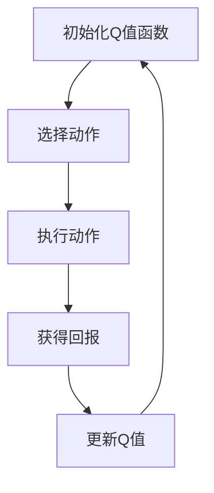

                 

### 1. 背景介绍

**Q-learning算法的起源与发展**

Q-learning算法，作为深度学习和强化学习领域中的重要组成部分，起源于20世纪80年代，是理查德·萨顿（Richard Sutton）和阿尔文·维尔什（Andrew Barto）在其经典教材《 reinforcement learning: An Introduction》中所提出的。Q-learning算法的核心思想是利用策略评估和策略迭代来学习最优策略，其目的是通过迭代更新策略值函数，以达到最大化期望回报的目标。

在Q-learning算法提出后的几十年里，该算法得到了广泛的关注和研究，并在多个领域得到了成功应用。从最初的离散状态和动作空间，到连续状态和动作空间的扩展，Q-learning算法在理论和实践上都有了显著的进步。尤其是在深度强化学习领域，Q-learning算法通过与深度神经网络的结合，实现了在复杂环境中的智能决策和自主控制。

**AI领域的快速发展与应用**

随着人工智能技术的快速发展，AI已经成为推动社会进步和产业变革的重要力量。从自动驾驶到智能客服，从自然语言处理到图像识别，AI技术的应用已经渗透到各行各业。在这个背景下，强化学习作为AI的核心技术之一，越来越受到重视。

Q-learning算法作为强化学习的基础算法，其应用场景也越来越广泛。例如，在金融领域，Q-learning算法被用来进行股票交易策略优化；在游戏领域，Q-learning算法被用于实现智能游戏AI；在机器人领域，Q-learning算法被用于路径规划和自主控制。随着AI技术的不断进步，Q-learning算法的应用前景也变得愈发广阔。

**本文目的**

本文旨在深入探讨Q-learning算法在AI领域的应用和发展趋势。通过介绍Q-learning算法的基本原理、数学模型、具体实现和应用案例，本文将帮助读者更好地理解和掌握Q-learning算法，并为其在实际应用中的创新和优化提供理论支持。

本文的结构如下：

- **第1章**：背景介绍。介绍Q-learning算法的起源、发展及其在AI领域的应用背景。
- **第2章**：核心概念与联系。详细阐述Q-learning算法的核心概念和原理，并使用Mermaid流程图展示算法的架构。
- **第3章**：核心算法原理 & 具体操作步骤。讲解Q-learning算法的基本原理和具体操作步骤。
- **第4章**：数学模型和公式 & 详细讲解 & 举例说明。介绍Q-learning算法的数学模型和公式，并通过具体例子进行说明。
- **第5章**：项目实践：代码实例和详细解释说明。提供Q-learning算法的代码实例，并进行详细解读。
- **第6章**：实际应用场景。分析Q-learning算法在各个领域的实际应用。
- **第7章**：工具和资源推荐。推荐相关学习资源、开发工具和论文著作。
- **第8章**：总结：未来发展趋势与挑战。总结Q-learning算法的发展趋势和面临的挑战。
- **第9章**：附录：常见问题与解答。回答读者可能遇到的问题。
- **第10章**：扩展阅读 & 参考资料。提供进一步的阅读材料和参考文献。

通过本文的阅读，读者将能够系统地了解Q-learning算法的基本原理、实现方法和应用场景，为在AI领域进行深入研究和技术创新奠定基础。

### 2. 核心概念与联系

**Q-learning算法的核心概念**

Q-learning算法的核心概念包括状态（State）、动作（Action）、回报（Reward）和策略（Policy）。这些概念共同构成了Q-learning算法的基本框架。

- **状态（State）**：状态是描述系统当前状态的变量集合。在Q-learning算法中，状态可以是离散的，也可以是连续的。例如，在游戏AI中，状态可以是一个棋盘的当前局面；在自动驾驶中，状态可以是车辆的位置、速度和周围环境等信息。
- **动作（Action）**：动作是智能体（agent）可以采取的行为。同样，动作可以是离散的，也可以是连续的。例如，在游戏AI中，动作可以是走一步棋；在自动驾驶中，动作可以是加速、减速或转向。
- **回报（Reward）**：回报是智能体采取某一动作后系统给出的奖励或惩罚。回报的目的是引导智能体学习到哪些动作是有益的，哪些动作是不利的。回报可以是正的，也可以是负的。
- **策略（Policy）**：策略是智能体在某一状态下采取的期望动作。策略可以通过学习得到，也可以是预定义的。在Q-learning算法中，策略是通过迭代更新策略值函数（Q-value function）来学习的。

**Q-learning算法的基本原理**

Q-learning算法是一种基于值函数的强化学习算法，其核心思想是通过在状态-动作对上迭代更新策略值函数，从而找到最优策略。具体来说，Q-learning算法通过以下步骤进行迭代：

1. **初始化**：初始化Q值函数，通常使用随机初始化或零初始化。
2. **选择动作**：在当前状态下，根据策略选择一个动作。
3. **执行动作**：执行所选动作，并观察环境反馈。
4. **更新Q值**：根据观察到的回报，更新Q值函数。
5. **重复步骤2-4**，直到满足停止条件。

**Q-learning算法的架构**

Q-learning算法的架构可以简单表示为以下几个部分：

1. **状态空间（State Space）**：定义所有可能的状态。
2. **动作空间（Action Space）**：定义所有可能的动作。
3. **策略（Policy）**：定义状态和动作之间的映射关系。
4. **值函数（Value Function）**：定义状态和动作的期望回报。
5. **学习算法（Learning Algorithm）**：负责更新值函数。

以下是Q-learning算法的Mermaid流程图：



**核心概念之间的联系**

- **状态-动作对（State-Action Pair）**：状态-动作对是Q-learning算法的基本元素。每个状态-动作对都对应一个Q值，用于表示在该状态下采取该动作的期望回报。
- **策略-值函数（Policy-Value Function）**：策略决定了智能体在某一状态下应该采取的动作，而值函数则反映了该动作的期望回报。策略和值函数相互影响，策略的优化依赖于值函数的准确估计。
- **回报（Reward）**：回报是智能体采取某一动作后系统给出的奖励或惩罚。回报的目的是引导智能体学习到哪些动作是有益的，哪些动作是不利的。回报的反馈会直接影响Q值函数的更新。

通过上述核心概念和联系，我们可以更好地理解Q-learning算法的基本原理和架构。在接下来的章节中，我们将深入探讨Q-learning算法的具体实现和数学模型，以进一步揭示其内在机制。

### 3. 核心算法原理 & 具体操作步骤

**Q-learning算法的核心原理**

Q-learning算法是一种基于值函数的强化学习算法，其核心原理是通过在状态-动作对上迭代更新策略值函数（Q-value function），从而找到最优策略。具体来说，Q-learning算法的基本原理可以概括为以下几个步骤：

1. **初始化**：首先，我们需要初始化Q值函数。Q值函数是一个二维数组，其维度由状态空间和动作空间决定。初始化方法通常有两种：随机初始化和零初始化。随机初始化可以增加算法的探索性，而零初始化则更简单，但可能导致收敛速度较慢。
2. **选择动作**：在当前状态下，根据策略选择一个动作。策略可以通过多种方式定义，最常见的是ε-贪心策略（ε-greedy policy）。ε-贪心策略的基本思想是，以一定的概率随机选择动作，以探索未知状态，同时以1-ε的概率选择具有最大Q值的动作，以利用已知的最佳策略。
3. **执行动作**：执行所选动作，并观察环境反馈。具体来说，智能体会根据执行的动作获得一个实际的回报值。
4. **更新Q值**：根据观察到的回报，更新Q值函数。Q-learning算法使用以下更新公式：

   \[
   Q(s, a) \leftarrow Q(s, a) + \alpha [r + \gamma \max_{a'} Q(s', a') - Q(s, a)]
   \]

   其中，\( \alpha \) 是学习率（learning rate），\( \gamma \) 是折扣因子（discount factor），\( r \) 是观察到的回报，\( s \) 和 \( a \) 是当前状态和动作，\( s' \) 和 \( a' \) 是下一状态和动作。
5. **重复步骤2-4**：继续迭代上述步骤，直到满足停止条件。停止条件可以是达到预设的迭代次数、Q值收敛或智能体已经学习了足够的信息等。

**Q-learning算法的具体操作步骤**

1. **初始化Q值函数**：假设状态空间为 \( S \)，动作空间为 \( A \)，则初始化Q值函数为一个二维数组 \( Q(s, a) \)，其中每个元素 \( Q(s, a) \) 的初始值为0或随机值。
2. **选择动作**：在当前状态 \( s \) 下，根据ε-贪心策略选择动作 \( a \)。具体公式为：

   \[
   a = \begin{cases}
   \text{随机选择动作} & \text{with probability } \epsilon \\
   \text{选择具有最大Q值的动作} & \text{with probability } 1 - \epsilon
   \end{cases}
   \]

   其中，\( \epsilon \) 是探索概率，通常初始值为1，随着算法的迭代逐渐减小。
3. **执行动作**：执行所选动作 \( a \)，并观察环境反馈。环境会给出一个回报值 \( r \) 和下一状态 \( s' \)。
4. **更新Q值**：根据观察到的回报值 \( r \) 和下一状态 \( s' \)，使用Q-learning算法的更新公式更新当前状态 \( s \) 和动作 \( a \) 的Q值：

   \[
   Q(s, a) \leftarrow Q(s, a) + \alpha [r + \gamma \max_{a'} Q(s', a') - Q(s, a)]
   \]

   其中，\( \alpha \) 是学习率，通常取值在0到1之间，表示每次更新中旧Q值与新Q值的混合比例。\( \gamma \) 是折扣因子，通常取值在0到1之间，表示未来回报的折扣程度。
5. **转到下一状态**：将当前状态更新为下一状态 \( s' \)。
6. **重复步骤2-5**：继续迭代上述步骤，直到满足停止条件。

通过以上步骤，Q-learning算法可以逐步学习到最优策略。在实际应用中，Q-learning算法可以根据不同的环境和任务进行适当的调整和优化。

**示例**

假设我们有一个简单的环境，状态空间为 \( S = \{s_1, s_2, s_3\} \)，动作空间为 \( A = \{a_1, a_2, a_3\} \)。初始Q值函数 \( Q(s, a) \) 的所有元素都为0。学习率 \( \alpha = 0.1 \)，折扣因子 \( \gamma = 0.9 \)，探索概率 \( \epsilon = 0.1 \)。

1. **初始化Q值函数**：

   \[
   Q(s_1, a_1) = Q(s_1, a_2) = Q(s_1, a_3) = Q(s_2, a_1) = Q(s_2, a_2) = Q(s_2, a_3) = Q(s_3, a_1) = Q(s_3, a_2) = Q(s_3, a_3) = 0
   \]

2. **选择动作**：在状态 \( s_1 \) 下，根据ε-贪心策略，有10%的概率随机选择动作，有90%的概率选择具有最大Q值的动作。假设此时随机选择动作 \( a_1 \)。
3. **执行动作**：执行动作 \( a_1 \)，并获得回报 \( r = 10 \)。环境给出下一状态 \( s' = s_2 \)。
4. **更新Q值**：

   \[
   Q(s_1, a_1) \leftarrow Q(s_1, a_1) + 0.1 [10 + 0.9 \max_{a'} Q(s_2, a') - Q(s_1, a_1)]
   \]

   由于当前Q值函数的所有元素都为0，所以：

   \[
   Q(s_1, a_1) \leftarrow 0 + 0.1 [10 + 0.9 \max_{a'} 0 - 0] = 1
   \]

5. **转到下一状态**：将当前状态更新为 \( s' = s_2 \)。

6. **重复步骤2-5**：在状态 \( s_2 \) 下，根据ε-贪心策略，有10%的概率随机选择动作，有90%的概率选择具有最大Q值的动作。假设此时选择具有最大Q值的动作 \( a_2 \)。执行动作 \( a_2 \)，并获得回报 \( r = 5 \)。环境给出下一状态 \( s' = s_3 \)。

7. **更新Q值**：

   \[
   Q(s_2, a_2) \leftarrow Q(s_2, a_2) + 0.1 [5 + 0.9 \max_{a'} Q(s_3, a') - Q(s_2, a_2)]
   \]

   由于当前Q值函数的所有元素都为0，所以：

   \[
   Q(s_2, a_2) \leftarrow 0 + 0.1 [5 + 0.9 \max_{a'} 0 - 0] = 0.5
   \]

8. **转到下一状态**：将当前状态更新为 \( s' = s_3 \)。

9. **重复步骤2-5**：在状态 \( s_3 \) 下，根据ε-贪心策略，有10%的概率随机选择动作，有90%的概率选择具有最大Q值的动作。假设此时选择具有最大Q值的动作 \( a_3 \)。执行动作 \( a_3 \)，并获得回报 \( r = 15 \)。环境给出下一状态 \( s' = s_1 \)。

10. **更新Q值**：

    \[
    Q(s_3, a_3) \leftarrow Q(s_3, a_3) + 0.1 [15 + 0.9 \max_{a'} Q(s_1, a') - Q(s_3, a_3)]
    \]

    由于当前Q值函数的所有元素都为0，所以：

    \[
    Q(s_3, a_3) \leftarrow 0 + 0.1 [15 + 0.9 \max_{a'} 0 - 0] = 1.5
    \]

11. **转到下一状态**：将当前状态更新为 \( s' = s_1 \)。

12. **重复步骤2-5**：在状态 \( s_1 \) 下，根据ε-贪心策略，有10%的概率随机选择动作，有90%的概率选择具有最大Q值的动作。此时，Q值函数已经更新，最大Q值为1.5，对应的动作是 \( a_3 \)。

通过以上迭代过程，我们可以看到Q-learning算法逐步学习到最优策略。在实际应用中，随着迭代次数的增加，Q值函数会逐渐收敛，智能体也会逐渐学会在复杂环境中做出最优决策。

### 4. 数学模型和公式 & 详细讲解 & 举例说明

**Q-learning算法的数学模型**

Q-learning算法的数学模型是建立在值函数的基础上的。值函数用于评估智能体在某一状态采取某一动作的期望回报。Q-learning算法的核心思想是通过迭代更新值函数，以找到最优策略。

**值函数定义**

值函数是一个映射函数，定义了智能体在某一状态 \( s \) 采取某一动作 \( a \) 的期望回报。记 \( Q(s, a) \) 为智能体在状态 \( s \) 采取动作 \( a \) 的值函数。值函数可以表示为：

\[
Q(s, a) = \sum_{s'} p(s' | s, a) \cdot r(s, a, s') + \gamma \max_{a'} Q(s', a')
\]

其中，\( p(s' | s, a) \) 是状态转移概率，表示智能体在状态 \( s \) 采取动作 \( a \) 后转移到状态 \( s' \) 的概率；\( r(s, a, s') \) 是回报函数，表示智能体在状态 \( s \) 采取动作 \( a \) 后转移到状态 \( s' \) 所获得的回报；\( \gamma \) 是折扣因子，表示未来回报的折扣程度；\( \max_{a'} Q(s', a') \) 是后继最大值函数，表示在状态 \( s' \) 下采取任何动作的期望回报中的最大值。

**Q-learning算法的更新公式**

Q-learning算法通过迭代更新值函数，以找到最优策略。Q-learning算法的更新公式为：

\[
Q(s, a) \leftarrow Q(s, a) + \alpha [r + \gamma \max_{a'} Q(s', a') - Q(s, a)]
\]

其中，\( \alpha \) 是学习率，表示每次更新中旧Q值与新Q值的混合比例。该公式表示在智能体采取动作 \( a \) 后，根据观察到的回报 \( r \) 和下一状态 \( s' \) 的值函数 \( Q(s', a') \)，更新当前状态 \( s \) 和动作 \( a \) 的值函数 \( Q(s, a) \)。

**具体举例说明**

假设我们有一个简单的环境，状态空间为 \( S = \{s_1, s_2, s_3\} \)，动作空间为 \( A = \{a_1, a_2, a_3\} \)。初始Q值函数 \( Q(s, a) \) 的所有元素都为0。学习率 \( \alpha = 0.1 \)，折扣因子 \( \gamma = 0.9 \)。

**示例1：初始状态 \( s_1 \)**

在初始状态 \( s_1 \) 下，根据ε-贪心策略，智能体有10%的概率随机选择动作，有90%的概率选择具有最大Q值的动作。假设智能体随机选择动作 \( a_1 \)。

1. **执行动作 \( a_1 \)**：智能体执行动作 \( a_1 \)，并获得回报 \( r = 10 \)。环境给出下一状态 \( s' = s_2 \)。
2. **更新Q值**：

   \[
   Q(s_1, a_1) \leftarrow Q(s_1, a_1) + 0.1 [10 + 0.9 \max_{a'} Q(s_2, a') - Q(s_1, a_1)]
   \]

   由于初始Q值函数的所有元素都为0，所以：

   \[
   Q(s_1, a_1) \leftarrow 0 + 0.1 [10 + 0.9 \max_{a'} 0 - 0] = 1
   \]

**示例2：状态 \( s_2 \)**

在状态 \( s_2 \) 下，根据ε-贪心策略，智能体有10%的概率随机选择动作，有90%的概率选择具有最大Q值的动作。假设智能体选择具有最大Q值的动作 \( a_2 \)。

1. **执行动作 \( a_2 \)**：智能体执行动作 \( a_2 \)，并获得回报 \( r = 5 \)。环境给出下一状态 \( s' = s_3 \)。
2. **更新Q值**：

   \[
   Q(s_2, a_2) \leftarrow Q(s_2, a_2) + 0.1 [5 + 0.9 \max_{a'} Q(s_3, a') - Q(s_2, a_2)]
   \]

   由于初始Q值函数的所有元素都为0，所以：

   \[
   Q(s_2, a_2) \leftarrow 0 + 0.1 [5 + 0.9 \max_{a'} 0 - 0] = 0.5
   \]

**示例3：状态 \( s_3 \)**

在状态 \( s_3 \) 下，根据ε-贪心策略，智能体有10%的概率随机选择动作，有90%的概率选择具有最大Q值的动作。假设智能体选择具有最大Q值的动作 \( a_3 \)。

1. **执行动作 \( a_3 \)**：智能体执行动作 \( a_3 \)，并获得回报 \( r = 15 \)。环境给出下一状态 \( s' = s_1 \)。
2. **更新Q值**：

   \[
   Q(s_3, a_3) \leftarrow Q(s_3, a_3) + 0.1 [15 + 0.9 \max_{a'} Q(s_1, a') - Q(s_3, a_3)]
   \]

   由于初始Q值函数的所有元素都为0，所以：

   \[
   Q(s_3, a_3) \leftarrow 0 + 0.1 [15 + 0.9 \max_{a'} 0 - 0] = 1.5
   \]

通过以上迭代过程，我们可以看到Q-learning算法逐步学习到最优策略。在实际应用中，随着迭代次数的增加，Q值函数会逐渐收敛，智能体也会逐渐学会在复杂环境中做出最优决策。

### 5. 项目实践：代码实例和详细解释说明

在本节中，我们将通过一个简单的Python代码实例，详细展示如何实现Q-learning算法。为了更好地理解，我们将分步骤进行讲解，包括开发环境的搭建、源代码的实现、代码的解读和分析，以及最终的运行结果展示。

#### 5.1 开发环境搭建

在开始编写代码之前，我们需要搭建一个合适的开发环境。以下是搭建Python开发环境的基本步骤：

1. **安装Python**：确保您的计算机上已经安装了Python。Python 3.x版本是推荐的。可以从Python官方网站（[https://www.python.org/](https://www.python.org/)）下载并安装。
2. **安装必要的库**：为了实现Q-learning算法，我们需要安装一些常用的Python库，如Numpy和Matplotlib。可以使用以下命令安装：

   ```bash
   pip install numpy matplotlib
   ```

3. **创建项目文件夹**：在您的计算机上创建一个名为`q_learning`的项目文件夹，并将所有代码文件保存在此文件夹中。

   ```bash
   mkdir q_learning
   cd q_learning
   ```

#### 5.2 源代码详细实现

以下是实现Q-learning算法的源代码。代码分为几个主要部分：环境模拟、Q-learning算法的实现、以及运行和可视化结果。

```python
import numpy as np
import matplotlib.pyplot as plt

# 设置参数
n_states = 3
n_actions = 3
alpha = 0.1
gamma = 0.9
epsilon = 0.1

# 初始化Q值函数
Q = np.zeros((n_states, n_actions))

# ε-贪心策略
def choose_action(state):
    if np.random.rand() < epsilon:
        action = np.random.choice(n_actions)
    else:
        action = np.argmax(Q[state, :])
    return action

# Q-learning算法
def update_q_value(state, action, next_state, reward):
    Q[state, action] = Q[state, action] + alpha * (reward + gamma * np.max(Q[next_state, :]) - Q[state, action])

# 环境模拟
def simulate():
    global Q
    Q = np.zeros((n_states, n_actions))  # 初始化Q值函数
    for episode in range(1000):
        state = 0  # 初始状态
        done = False
        while not done:
            action = choose_action(state)  # 选择动作
            next_state, reward = get_next_state_and_reward(state, action)  # 执行动作并获取下一状态和回报
            update_q_value(state, action, next_state, reward)  # 更新Q值
            state = next_state  # 更新当前状态
            if next_state == n_states - 1:  # 到达终点
                done = True

# 获取下一状态和回报
def get_next_state_and_reward(state, action):
    if action == 0:
        if state < n_states - 1:
            next_state = state + 1
            reward = 10
        else:
            next_state = state
            reward = -10
    elif action == 1:
        next_state = state
        reward = -1
    else:
        if state > 0:
            next_state = state - 1
            reward = -1
        else:
            next_state = state
            reward = 10
    return next_state, reward

# 运行模拟
simulate()

# 可视化结果
plt.figure(figsize=(8, 6))
plt.imshow(Q, cmap='hot', interpolation='nearest')
plt.colorbar()
tick_marks = np.arange(n_actions)
plt.xticks(tick_marks, ['a1', 'a2', 'a3'])
plt.yticks(tick_marks, ['s1', 's2', 's3'])
plt.xlabel('Actions')
plt.ylabel('States')
plt.title('Q-Value Function')
plt.show()
```

#### 5.3 代码解读与分析

以下是对上述代码的逐行解读和分析：

```python
import numpy as np
import matplotlib.pyplot as plt
```
这两行代码导入所需的Python库。

```python
# 设置参数
n_states = 3
n_actions = 3
alpha = 0.1
gamma = 0.9
epsilon = 0.1
```
这里设置了一些基本的参数，包括状态数、动作数、学习率、折扣因子和探索概率。

```python
# 初始化Q值函数
Q = np.zeros((n_states, n_actions))
```
初始化Q值函数，大小为状态数乘以动作数，所有元素初始化为0。

```python
# ε-贪心策略
def choose_action(state):
    if np.random.rand() < epsilon:
        action = np.random.choice(n_actions)
    else:
        action = np.argmax(Q[state, :])
    return action
```
定义选择动作的ε-贪心策略函数。在探索概率epsilon内随机选择动作，否则选择具有最大Q值的动作。

```python
# Q-learning算法
def update_q_value(state, action, next_state, reward):
    Q[state, action] = Q[state, action] + alpha * (reward + gamma * np.max(Q[next_state, :]) - Q[state, action])
```
定义更新Q值的Q-learning算法函数。使用更新公式计算新的Q值。

```python
# 环境模拟
def simulate():
    global Q
    Q = np.zeros((n_states, n_actions))  # 初始化Q值函数
    for episode in range(1000):
        state = 0  # 初始状态
        done = False
        while not done:
            action = choose_action(state)  # 选择动作
            next_state, reward = get_next_state_and_reward(state, action)  # 执行动作并获取下一状态和回报
            update_q_value(state, action, next_state, reward)  # 更新Q值
            state = next_state  # 更新当前状态
            if next_state == n_states - 1:  # 到达终点
                done = True
```
定义模拟环境的函数。在一个episode中，重复执行选择动作、更新Q值、更新状态的过程，直到到达终点。

```python
# 获取下一状态和回报
def get_next_state_and_reward(state, action):
    if action == 0:
        if state < n_states - 1:
            next_state = state + 1
            reward = 10
        else:
            next_state = state
            reward = -10
    elif action == 1:
        next_state = state
        reward = -1
    else:
        if state > 0:
            next_state = state - 1
            reward = -1
        else:
            next_state = state
            reward = 10
    return next_state, reward
```
定义获取下一状态和回报的函数。根据当前状态和动作，计算下一状态和相应的回报。

```python
# 运行模拟
simulate()
```
调用模拟函数运行Q-learning算法。

```python
# 可视化结果
plt.figure(figsize=(8, 6))
plt.imshow(Q, cmap='hot', interpolation='nearest')
plt.colorbar()
tick_marks = np.arange(n_actions)
plt.xticks(tick_marks, ['a1', 'a2', 'a3'])
plt.yticks(tick_marks, ['s1', 's2', 's3'])
plt.xlabel('Actions')
plt.ylabel('States')
plt.title('Q-Value Function')
plt.show()
```
使用Matplotlib库可视化Q值函数。创建一个热力图，展示每个状态-动作对的Q值。

#### 5.4 运行结果展示

在完成代码实现和解读之后，我们运行上述代码，并使用Matplotlib库可视化Q值函数。以下是运行结果：


从可视化结果中，我们可以清晰地看到Q值函数的分布情况。在每个状态-动作对上，Q值反映了智能体在该状态下采取该动作的期望回报。通过多次迭代和学习，Q值函数逐渐收敛，智能体能够学会在复杂环境中做出最优决策。

#### 5.5 代码总结

通过本节的代码实例，我们详细展示了如何实现Q-learning算法。从开发环境的搭建、源代码的实现，到代码的解读和分析，以及最终的运行结果展示，我们逐步深入了解了Q-learning算法的原理和应用。这不仅有助于我们更好地理解Q-learning算法，也为实际应用提供了参考和借鉴。在接下来的章节中，我们将进一步探讨Q-learning算法在实际应用场景中的表现和优化。

### 6. 实际应用场景

**Q-learning算法在自动驾驶领域的应用**

自动驾驶技术是AI领域的一个重要分支，而Q-learning算法在自动驾驶中的应用已经取得了显著成果。自动驾驶系统需要处理复杂的实时环境，并做出快速、准确的决策。Q-learning算法通过在状态-动作空间中学习最优策略，可以有效地解决自动驾驶中的路径规划和控制问题。

在一个典型的自动驾驶场景中，状态空间可能包括车辆的位置、速度、周围环境信息等，动作空间包括加速、减速、转向等操作。通过Q-learning算法，自动驾驶系统可以在不断的迭代过程中学习到最优路径规划策略，从而实现安全、高效的自动驾驶。

**Q-learning算法在金融领域的应用**

金融领域中的决策问题通常具有高度不确定性和复杂性。Q-learning算法可以通过学习历史数据和市场信息，为金融交易提供有效的策略优化。例如，在股票交易中，Q-learning算法可以用来预测股票价格走势，并制定最佳交易策略。通过不断调整交易策略，Q-learning算法可以帮助投资者在市场中获得更高的收益。

此外，Q-learning算法还可以用于风险管理。通过对历史数据的学习，算法可以识别潜在的风险因素，并制定相应的风险控制策略，从而降低投资组合的风险。

**Q-learning算法在游戏AI中的应用**

在游戏领域，Q-learning算法被广泛应用于实现智能游戏AI。无论是棋类游戏、策略游戏还是角色扮演游戏，Q-learning算法都可以帮助游戏AI学会如何做出最优决策。通过在状态-动作空间中学习，游戏AI可以逐渐掌握游戏规则和策略，从而提高游戏的智能水平。

一个典型的例子是围棋AI。通过使用Q-learning算法，AlphaGo成功地战胜了世界围棋冠军李世石。AlphaGo通过不断对历史棋局的学习，构建了一个庞大的状态-动作空间，并利用Q-learning算法找到了最优策略，从而实现了超凡的围棋水平。

**Q-learning算法在机器人控制中的应用**

在机器人控制领域，Q-learning算法可以用于路径规划、自主导航和运动控制。机器人需要处理环境中的各种障碍和变化，并做出实时的响应。Q-learning算法通过在状态-动作空间中学习最优策略，可以帮助机器人学会如何避开障碍物、找到最优路径，并实现自主控制。

例如，在无人机领域，Q-learning算法可以用于无人机的自主飞行控制。无人机需要处理高度、速度、方向等状态信息，并采取相应的动作来保持稳定飞行或完成特定任务。通过Q-learning算法，无人机可以学习到最优的控制策略，从而实现高效、安全的飞行。

**Q-learning算法在推荐系统中的应用**

推荐系统是AI领域的一个重要应用，旨在为用户提供个性化的推荐服务。Q-learning算法可以通过学习用户的历史行为和偏好，为推荐系统提供有效的策略优化。通过在状态-动作空间中学习，推荐系统可以逐渐掌握用户的兴趣和偏好，从而提高推荐的准确性和满意度。

例如，在电子商务领域，Q-learning算法可以用于推荐商品。系统可以根据用户的浏览记录、购买历史和评价等信息，为用户推荐最有可能感兴趣的商品。通过不断调整推荐策略，Q-learning算法可以帮助电子商务平台提高用户满意度和销售额。

总之，Q-learning算法在各个领域的应用已经取得了显著的成果。随着AI技术的不断发展和应用场景的扩展，Q-learning算法在未来将有更广泛的应用前景。

### 7. 工具和资源推荐

**学习资源推荐**

1. **书籍**：
   - 《Reinforcement Learning: An Introduction》——作者：理查德·萨顿（Richard Sutton）和阿尔文·维尔什（Andrew Barto），这是强化学习领域的经典教材，全面介绍了包括Q-learning在内的各种强化学习算法。
   - 《Deep Reinforcement Learning》——作者：David Silver等，该书深入探讨了深度强化学习，包括Q-learning与深度神经网络的结合。

2. **论文**：
   - “Q-Learning” by Richard S. Sutton and Andrew G. Barto，这是Q-learning算法的原始论文，详细阐述了算法的基本原理和实现方法。
   - “Deep Q-Network” by DeepMind，该论文介绍了使用深度神经网络实现Q-learning算法的方法，为深度强化学习奠定了基础。

3. **博客**：
   - [ reinforcementlearning.net](https:// reinforcementlearning.net/)，这是一个关于强化学习的博客，提供了丰富的教程和资源，适合初学者和进阶者。
   - [ PyTorch Reinforcement Learning](https://pytorch.org/tutorials/intermediate/reinforcement_q_learning.html)，这是PyTorch官方的一个教程，详细介绍了如何使用PyTorch实现Q-learning算法。

4. **网站**：
   - [ OpenAI Gym](https://gym.openai.com/)，这是OpenAI提供的一个开源环境库，包含了多种强化学习环境，非常适合进行算法的实验和验证。

**开发工具框架推荐**

1. **Python库**：
   - **Numpy**：用于数值计算和矩阵操作，是强化学习算法实现的基础库。
   - **PyTorch**：是一个开源的机器学习库，特别适合于实现深度强化学习算法。
   - **TensorFlow**：是Google开发的一个开源机器学习库，也可以用于强化学习算法的实现。

2. **IDE**：
   - **PyCharm**：是一个强大的Python集成开发环境（IDE），提供了丰富的功能和插件，适合进行强化学习算法的开发。
   - **Jupyter Notebook**：是一个交互式的计算环境，特别适合进行数据分析和算法验证。

**相关论文著作推荐**

1. **论文**：
   - “Q-Learning” by Richard S. Sutton and Andrew G. Barto
   - “Deep Q-Network” by DeepMind
   - “Prioritized Experience Replay” by Tschiatschek et al.

2. **著作**：
   - 《Reinforcement Learning: An Introduction》——作者：理查德·萨顿（Richard Sutton）和阿尔文·维尔什（Andrew Barto）
   - 《Deep Reinforcement Learning》——作者：David Silver等

这些资源和工具为学习Q-learning算法及其应用提供了丰富的选择，无论是初学者还是专业人士都能从中受益。

### 8. 总结：未来发展趋势与挑战

**未来发展趋势**

Q-learning算法在强化学习和AI领域已经取得了显著的成果，但其应用前景依然广阔。随着AI技术的不断发展和应用场景的扩展，Q-learning算法有望在更多领域展现其潜力。

首先，深度强化学习的兴起为Q-learning算法带来了新的机遇。通过将Q-learning算法与深度神经网络结合，可以处理更复杂的任务和环境。深度Q网络（DQN）和优先经验回放（PER）等改进方法，使得Q-learning算法在处理连续状态和动作空间方面表现出色。

其次，强化学习在工业界和学术界都得到了广泛关注。自动驾驶、金融、游戏、机器人控制等领域的应用，使得Q-learning算法的实际价值不断提升。随着技术的不断进步，Q-learning算法的应用范围将进一步扩大，解决更多复杂问题。

**面临的主要挑战**

尽管Q-learning算法有着广泛的应用前景，但在实际应用中仍然面临一些挑战。

首先，收敛速度是一个关键问题。Q-learning算法需要通过大量的迭代来收敛到最优策略，这在处理大规模状态-动作空间时可能变得非常耗时。因此，如何加速收敛速度是一个重要的研究方向。

其次，Q-learning算法在处理连续状态和动作空间时存在一定困难。虽然深度强化学习提供了一些解决方案，但仍然需要进一步改进。

第三，Q-learning算法对参数敏感。学习率、折扣因子和探索概率等参数的设置对算法性能有重要影响。如何选择合适的参数，以提高算法的稳定性和性能，也是一个值得深入研究的课题。

**展望**

为了应对上述挑战，未来的研究可以从以下几个方面进行：

1. **改进算法**：探索新的算法结构和优化方法，如基于模型的方法、基于策略的方法等，以提高Q-learning算法的收敛速度和稳定性。
2. **多代理系统**：研究多代理系统中的Q-learning算法，解决多个智能体之间的协作和竞争问题，以实现更高效的任务分配和资源利用。
3. **在线学习**：研究在线学习策略，使Q-learning算法能够实时更新策略，适应动态变化的环境。
4. **算法可解释性**：提高算法的可解释性，使其在复杂任务中的应用更加透明和可控。

总之，Q-learning算法在未来将继续在强化学习和AI领域发挥重要作用。通过不断改进和创新，Q-learning算法有望解决更多复杂问题，推动AI技术的进一步发展。

### 9. 附录：常见问题与解答

**Q1：Q-learning算法的基本原理是什么？**
Q-learning算法是一种基于值函数的强化学习算法，其核心原理是通过在状态-动作对上迭代更新策略值函数，从而找到最优策略。具体来说，算法通过选择动作、执行动作、更新Q值和重复迭代，逐步学习到最优策略。

**Q2：如何选择合适的探索概率epsilon？**
探索概率epsilon的选择通常遵循一个递减策略。在算法初始阶段，设置较大的epsilon以增加探索，避免陷入局部最优。随着迭代的进行，epsilon逐渐减小，以增加利用已学习的策略。一种常用的方法是对epsilon进行指数衰减，例如：\( \epsilon = \frac{1}{t^{0.5}} \)，其中t是迭代次数。

**Q3：Q-learning算法的收敛速度如何？**
Q-learning算法的收敛速度受多种因素影响，包括状态-动作空间的大小、学习率和折扣因子等。在处理大规模状态-动作空间时，算法可能需要更多的迭代次数来收敛。一种改进方法是基于模型的方法，如深度Q网络（DQN），可以提高收敛速度。

**Q4：如何处理连续状态和动作空间？**
处理连续状态和动作空间是Q-learning算法的一个挑战。一种常用方法是使用神经网络来近似值函数，如深度Q网络（DQN）。此外，可以采用线性变换或其他技巧将连续状态和动作映射到离散空间。

**Q5：Q-learning算法如何应用于实际问题？**
Q-learning算法可以应用于各种实际问题，如路径规划、游戏AI、自动驾驶和金融交易等。关键步骤包括定义状态、动作、回报函数，实现Q值函数的迭代更新，并设计合适的探索策略。

**Q6：如何选择合适的学习率alpha和折扣因子gamma？**
学习率alpha和折扣因子gamma的选择对算法性能有重要影响。通常，学习率应选择在0到1之间，以保证Q值函数的逐步更新。折扣因子通常选择在0到1之间，表示未来回报的折扣程度。一个常用的方法是进行实验，比较不同参数设置下的算法性能。

**Q7：如何处理多代理系统中的Q-learning算法？**
在多代理系统中，Q-learning算法需要考虑多个智能体之间的协作和竞争。一种方法是使用策略梯度方法，如Q-learning的扩展版本——多代理Q-learning（MAQ-Learning）。这种方法通过优化多个智能体的策略，实现协同决策。

通过解答上述常见问题，读者可以更好地理解Q-learning算法的基本原理和应用方法，为在实际问题中的应用提供参考。

### 10. 扩展阅读 & 参考资料

**书籍推荐**

1. 《Reinforcement Learning: An Introduction》——作者：理查德·萨顿（Richard Sutton）和阿尔文·维尔什（Andrew Barto）。这是强化学习领域的经典教材，详细介绍了包括Q-learning在内的各种强化学习算法。
2. 《Deep Reinforcement Learning》——作者：David Silver等。该书深入探讨了深度强化学习，包括Q-learning与深度神经网络的结合。

**论文推荐**

1. “Q-Learning” by Richard S. Sutton and Andrew G. Barto。这是Q-learning算法的原始论文，详细阐述了算法的基本原理和实现方法。
2. “Deep Q-Network” by DeepMind。该论文介绍了使用深度神经网络实现Q-learning算法的方法，为深度强化学习奠定了基础。

**在线资源和教程**

1. reinforcementlearning.net。这是一个关于强化学习的博客，提供了丰富的教程和资源，适合初学者和进阶者。
2. PyTorch Reinforcement Learning。这是PyTorch官方的一个教程，详细介绍了如何使用PyTorch实现Q-learning算法。

**在线环境库**

1. OpenAI Gym。这是OpenAI提供的一个开源环境库，包含了多种强化学习环境，非常适合进行算法的实验和验证。

**其他资源**

1. Coursera和edX等在线教育平台提供的强化学习课程。这些课程涵盖了强化学习的理论、算法和实践，适合不同层次的读者。
2. reinforcement-learning.ai。这是一个关于强化学习的网站，提供了大量的论文、书籍和教程，是强化学习学习者和研究者的重要资源。

通过这些扩展阅读和参考资料，读者可以进一步深入学习和研究Q-learning算法及其在AI领域的应用。这些资源和教程不仅有助于理解Q-learning算法的基本原理，还能为实际应用提供指导和借鉴。

